# Architectural Design for GenAI

**Domain 1 · Task 1.1 · Skill 1.1.1**

> Create comprehensive architectural designs that align with specific business needs and technical constraints, including appropriate foundation models, integration patterns, and deployment strategies.

This skill is not a service-memorization drill. It tests whether you can look at a messy business request and produce a design you could defend in an architecture review.

Walk this scenario as you read:

> We need an internal GenAI assistant over proprietary documents, with a 10-second response target, unpredictable usage, source citations, restricted access, and hourly freshness.

By the end of this article you should be able to extract those constraints, choose a pattern, name the AWS pieces, and explain the tradeoffs out loud — without jumping straight to “so… Knowledge Bases?”

---

## What Skill 1.1.1 actually tests

Skill 1.1.1 is a **requirements-to-architecture** skill.

The exam is asking: given this business need and these constraints, which *shape* of system should exist, and which AWS services realize that shape without adding unnecessary machinery?

```text
Business need
      +
Technical constraints
      ↓
Architecture pattern
      ↓
AWS services
      ↓
Tradeoffs
```

Services come last. If you start with services, you will overbuild: an agent for a three-step pipeline, SageMaker for a two-week demo, EKS because the company is “large,” Provisioned Throughput for a three-hour spike.

Two adjacent skills sit next door and are **not** this article:

- **1.1.2** is proving the idea on a clock (PoC, exit gates, least ops). That is a [dedicated article](/learn/1/poc-implementations).
- **1.1.3** is standardizing the path (Well-Architected GenAI Lens + reusable components). That is a [dedicated article](/learn/1/standardized-components).

1.1.1 is the design conversation *before* you scale and *before* you industrialize: what must this system do, and what architecture makes that possible?

### Four kinds of input, not one blob called “requirements”

People collapse everything into “the requirements.” Split them or you will solve the wrong problem.

**Business need** is the outcome a stakeholder will pay for.

- “Analysts must answer ‘what did NVDA say about Blackwell?’ from this quarter’s filings, with a citation, during market hours.”

**Functional requirements** are the behaviors the system must exhibit.

- Retrieve from internal filings.
- Return an answer with source passages.
- Refuse requests for personalized trading advice.

**Non-functional requirements** are how well those behaviors must hold.

- Complete answer in about 10 seconds.
- Survive an earnings-day traffic spike.
- Keep 10-Ks inside a US geographic boundary.
- Cost stays consumption-based because usage is unpredictable.

**Technical constraints** are the hard walls you do not get to wish away.

- No GPU cluster budget.
- Existing Python agent must be hosted, not rewritten.
- Users already authenticate through the corporate IdP.
- The path is always retrieve → summarize → emit JSON — the model must not invent extra tools.

Same words in a stem can be any of these. “Must cite the 10-K” is functional. “Must answer in 8 seconds” is non-functional. “Filings must not leave the EU” is a constraint. “Leadership wants analysts to stop hunting through PDFs” is the business need.

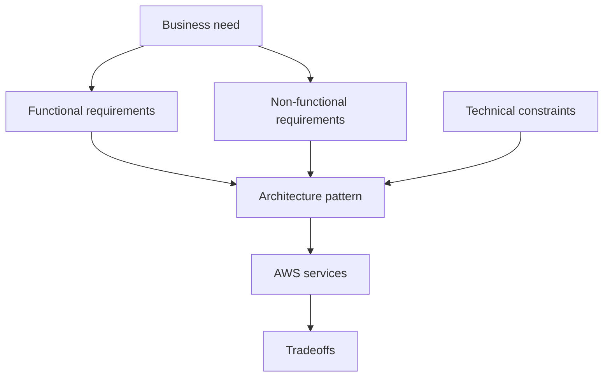

### A running example

An equity-research desk wants a blotter that answers questions over earnings calls, 10-Ks, internal notes, and ticker metadata.

That is not yet an architecture. These are:

| Kind | Example |
|------|---------|
| Business need | Analysts spend less time hunting exhibits and more time writing the note |
| Functional | Ground answers in *our* documents; show the source; never invent a number |
| Non-functional | First useful tokens quickly; full answer under ~10 seconds; hourly freshness |
| Constraints | Documents stay in AWS; unpredictable desk usage; no SageMaker cluster for v1 |

The architecture that falls out is **synchronous RAG on Bedrock**, not “an agent on EKS.” You will rebuild this example in Part IX. The rest of the article teaches the questions that get you there.

> **Exam tip:** The stem is usually ambiguous on purpose. Find the constraint first. The constraint picks the pattern. The pattern picks the service.

---

## The architecture decision framework

Do not start by naming Amazon Bedrock. Start by interrogating the scenario. The same dozen questions work on the exam and in a design review.

### 1. What is the actual task?

Summarize a pasted paragraph? Answer from a corpus? Extract fields from 10,000 PDFs overnight? Call Jira after comparing two filings?

Generation, retrieval, extraction, and action are different jobs. A bigger prompt does not turn one into another.

### 2. Where does the required knowledge come from?

| Source of knowledge | Implication |
|---------------------|-------------|
| Already in the model’s training data, or pasted into this prompt | Direct inference is enough |
| Proprietary, current, or too large to paste | Retrieval (RAG) |
| A *style* or *schema* the model should always emit | Prompting, and only later fine-tuning — still not a substitute for facts |
| Live systems (positions, tickets, calendars) | Tools / APIs, possibly an agent |

The model’s weights were frozen in the past. They do not contain this quarter’s 10-K, and they have no footnote.

### 3. Does the system only generate information, or also perform actions?

If the output is text, you need inference (and maybe retrieval). If the output is a side effect — file a ticket, run SQL, post to Slack — something must be allowed to call tools. That something is **not automatically an agent**. If the tool calls are always the same three steps, that is a workflow.

### 4. Is the execution path known or discovered?

**Known path** → you write the graph (Step Functions, Prompt Flows).

**Unknown / dynamic path** → the model chooses tools at runtime (an agent).

This is the highest-value fork in Skill 1.1.1.

### 5. Does a human wait for the answer?

If a trader is staring at a caret, the request is **synchronous** (and often streamed). If a pile of filings can finish by morning, the request is **asynchronous** or **batch**.

### 6. What is the latency budget?

Total response time is a sum, not a single Bedrock number:

```text
Total latency
  = network
  + authentication
  + retrieval
  + optional reranking
  + prompt construction
  + model inference
  + output processing
```

A 10-second budget with RAG is tight. A 10-second budget for a pasted-paragraph summary is easy. A 4-hour overnight job should not be on a synchronous API at all.

### 7. What is the workload shape?

| Shape | Capacity implication |
|-------|----------------------|
| Unpredictable / bursty | Consumption-based: on-demand, serverless compute |
| Steady and high | Consider reserved model capacity (Provisioned Throughput) |
| One giant off-hours pile | Batch inference or a queue of workers |
| Peak in one Region | Cross-Region inference before you buy idle capacity |

### 8. What happens when something fails?

Retries, queues, fallbacks, and “say you don’t know” are architecture, not afterthoughts. Silent garbage is a GenAI-specific failure mode: the HTTP call succeeded and the answer is still wrong.

### 9. Who is allowed to see which data?

Authentication answers “who is this?” Authorization answers “may this identity retrieve *this* chunk?” Successfully logging someone in does not entitle them to every document in the Knowledge Base.

### 10. Are there residency or network constraints?

“Stay in the EU” kills **global** Cross-Region inference. “Never traverse the public internet” asks for an **interface VPC endpoint** (PrivateLink), not a gateway endpoint (those are S3/DynamoDB only).

### 11. What must be monitored versus audited?

**CloudWatch** is operational health: latency, errors, throttles, token volume.

**CloudTrail** is who called which AWS API.

Neither replaces evaluation of answer quality.

### 12. What is the cost constraint?

Cost is a design input. Bursty desks waste money on reserved capacity. Huge offline corpora waste money on interactive on-demand tokens. Sending 40 retrieved chunks into the prompt wastes money *and* quality.

### Pocket decision card

Use this on every stem:

```text
1. Task: generate / retrieve / extract / act
2. Knowledge: prompt | RAG | weights | live APIs
3. Path: known workflow | dynamic agent
4. Timing: user waits | later is fine
5. Shape: bursty | steady | overnight pile
6. Failure: retry, queue, degrade, refuse
7. Access: identity + document-level authorization
8. Place: Region, geography, private network
9. Evidence: metrics (CloudWatch) vs audit (CloudTrail)
10. Cost: what you pay for when idle vs when busy
```

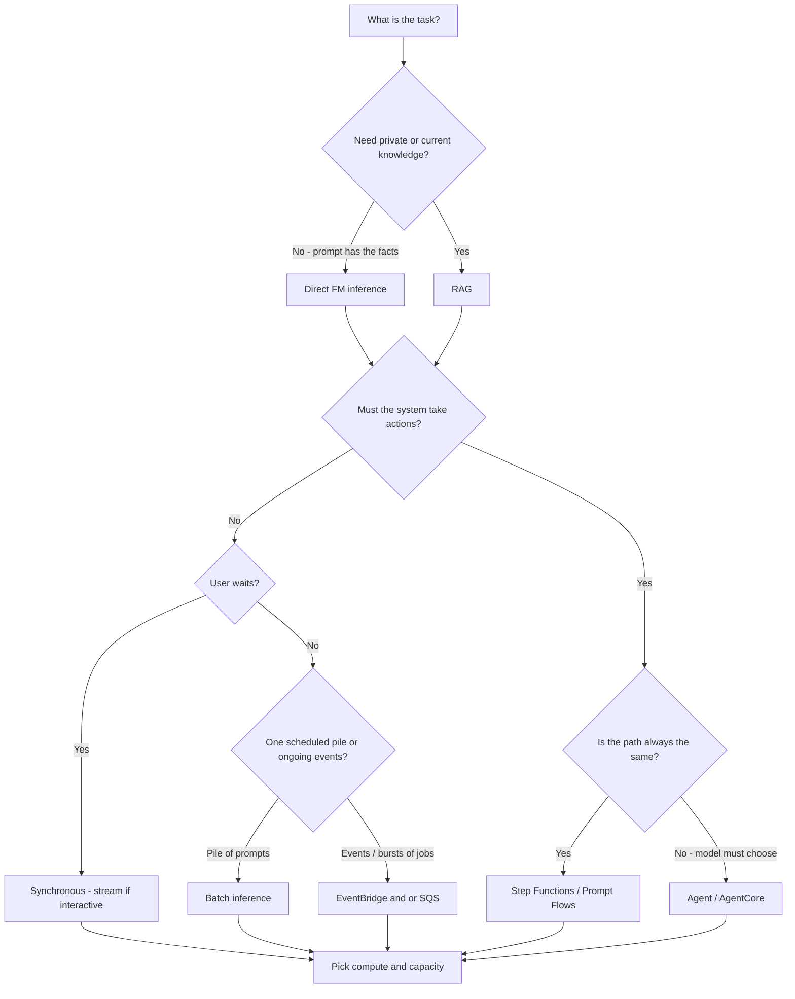

```recall
Q: What is the first architecture question, before naming a service?
A: What is the actual task, and where does the required knowledge come from?
```

---

## Direct foundation-model inference

### The problem it solves

Sometimes the model already has what it needs: a pasted paragraph, a public-knowledge question, a rewrite, a classification of text sitting in the request. There is nothing to retrieve.

Direct inference is the smallest GenAI architecture: **application code calls a foundation model and returns the result.**

If an analyst pastes four sentences from an NVDA call and asks for four bullets, RAG would be ceremony. The exhibit is already in the prompt.

### Architecture

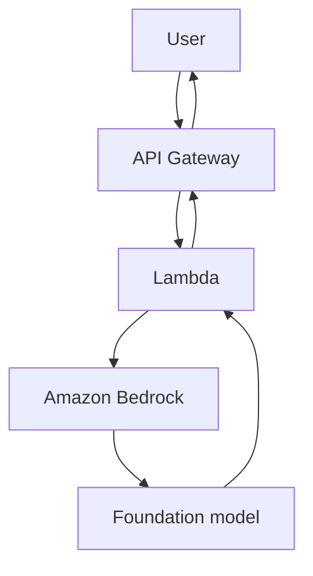

For a notebook PoC you can skip API Gateway. For anything other people call, the gateway is the front door: auth, throttles, a stable URL while you swap models behind it.

### When it is enough

- The facts are in the prompt or in general knowledge.
- You do not need source citations against a corpus.
- The job is rewrite, classify, extract from *this* payload, or summarize *this* text.
- Freshness is “whatever the user just pasted.”

### When it is not

- The 10-K is 80 pages and two people must share the same corpus.
- The answer must cite a specific exhibit.
- The facts change this afternoon and must not wait for a training job.

### Typical AWS implementation

| Piece | Why it exists |
|-------|----------------|
| Amazon Bedrock on-demand | Managed FM API; you do not own GPUs |
| Lambda | Glue: receive the request, build the prompt, call Converse, return text |
| API Gateway | Production HTTP or WebSocket front door |
| IAM | The function may invoke only the models it needs |
| Guardrails | Content / PII / topic policy on the same call |
| CloudWatch | Latency, errors, throttles |

Bedrock is an API, not a box in your account. You enable a model, then Lambda (or a container, or a laptop) calls **Bedrock Runtime**. AWS hosts the GPUs.

**Converse** is the call to learn: the same message shape across providers. `InvokeModel` is the older, model-specific JSON body — still on the exam, not where a new design should start.

### Benefits and tradeoffs

**Benefits.** Smallest moving parts. Fast to reason about. Token-priced. Easy to attach a guardrail.

**Tradeoffs.** No grounding in *your* corpus. Tight coupling if every client calls Bedrock directly with no gateway. You own retries and backoff unless you add them.

### Exam cues

- “Summarize this document the user uploaded”
- “Classify the ticket”
- “Rewrite in a professional tone”
- “Least operational overhead” with no mention of a private corpus

### Common incorrect choices

- Adding a Knowledge Base when the payload already contains the text.
- Fine-tuning so the model “knows” a paragraph the user was willing to paste.
- Standing up SageMaker because “this is production.”

> **Known facts in the prompt → direct inference. Known facts in *your* library → RAG.**

---

## Retrieval-augmented generation

### The problem it solves

Foundation models have two structural gaps: they were trained in the past, and they never saw your private files. When they lack a fact, they do not reliably say “I don’t know.” They generate plausible language.

RAG keeps knowledge **outside** the weights. At ask time you retrieve relevant passages and put them in the prompt, then ask the model to answer from those passages. Facts can change this afternoon without a training job. The model can point at a paragraph.

Fine-tuning solves a different problem (style, format, behavior). It does not give you this quarter’s 10-K with a footnote. That comparison is in Part V; here we teach the RAG lifecycle, because each stage exists for a reason.

### Two planes, not one pipeline

RAG is easier if you stop mixing **ingestion** (prepare the library) with **query** (use the library). They run on different clocks and fail in different ways.

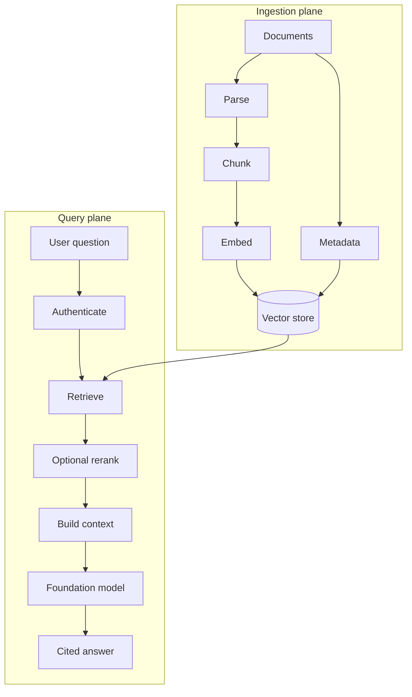

Hourly freshness is an **ingestion** requirement: new filings must be parsed, chunked, embedded, and indexed within the hour. The 10-second response target is a **query** requirement: retrieve + rerank + infer must fit the budget. Do not solve freshness by making the user wait for a full re-index on every question.

### Why each stage exists

**Documents / S3.** Something durable has to hold the source of truth. For GenAI on AWS that is almost always S3: filings, transcripts, PDFs. S3 is the library warehouse, not the search engine.

**Parsing.** Models do not read PDF bytes. You extract text (and structure where you can). Bad parsing is a silent RAG failure: retrieval looks fine and the chunk is garbled.

**Chunking.** Embedding models and context windows have limits. A 200-page 10-K cannot be one vector if you want to retrieve the Blackwell paragraph. Chunks are the unit of retrieval. Too large and you drag irrelevant text into the prompt. Too small and you lose the sentence that made the claim true.

**Embeddings.** A chunk becomes a vector so “Blackwell supply” can match “sold through on GB200” even when the words differ. This is why RAG finds meaning, not only keywords.

**Vector storage.** Vectors need a store that can do nearest-neighbor search, usually with **metadata filters** (ticker, document type, ACL group). OpenSearch Serverless, Aurora pgvector, S3 Vectors, and similar options are the shelf. Skill 1.4 picks the shelf; 1.1.1 decides that you *need* a shelf.

**Retrieval.** The question is embedded and the store returns the nearest chunks. This is the step that either grounds the answer or poisons it. Garbage in the top-k becomes confident nonsense in the completion.

**Optional reranking.** First-stage retrieval is fast and approximate. A reranker re-scores a larger candidate set so the prompt gets the 5 passages that actually answer the question instead of the 5 that were merely nearby in vector space. You add it when quality is the bottleneck — and you pay a latency tax.

**Context construction.** You do not dump 40 chunks into the model. You pack the survivors, with source metadata, under a prompt that says: answer only from this evidence; cite it; if evidence is weak, say so.

**Foundation model.** Now direct inference is the right pattern — because the prompt finally contains the facts.

**Cited answer.** Citations are not a UI flourish. They are why RAG exists for regulated research: the analyst can open the exhibit. That requires **source metadata** on each chunk (URI, page, ticker), not just the text.

### Authorization is part of retrieval

If two analysts share a Knowledge Base, and one is cleared for unpublished internal notes while the other is not, retrieval must **filter by identity**. Authenticate at the front door, then pass user/group attributes into the retrieve call as metadata filters. Otherwise the model will happily cite a memo the caller was never allowed to see.

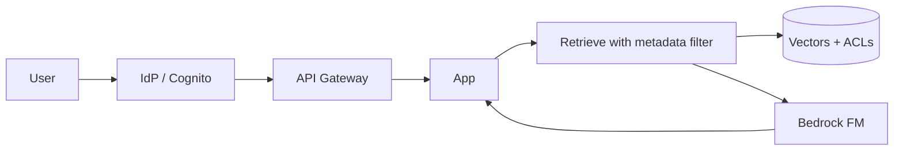

> **Important:** Successfully authenticating a user does not mean that user is authorized to retrieve every document.

### Weak evidence

If retrieval returns low similarity, or contradictory snippets, a production design **refuses to guess**. Instruct the model to say it cannot find support, and show what it searched. This is an architecture choice: you accepted “I don’t know” as a valid product output. The alternative is hallucination with a citation-shaped decoration.

### Typical AWS implementation

| Piece | Why it exists |
|-------|----------------|
| S3 | Source documents |
| Bedrock Knowledge Bases | Managed chunk → embed → retrieve path |
| Embedding model on Bedrock | Turns chunks and queries into vectors |
| Vector store | Similarity search plus metadata filter |
| Reranker | Optional second-stage quality |
| Bedrock FM | Answers from constructed context |
| EventBridge / S3 notifications | New object → ingest (hourly freshness) |
| IAM + metadata filters | Document-level authorization |

`RetrieveAndGenerate` is the managed one-shot. `Retrieve` is when you want to inspect chunks, rerank yourself, or enforce extra authorization before the FM sees them.

### Benefits and tradeoffs

**Benefits.** Current private knowledge. Citations. Updates without retraining. Usually cheaper and safer than baking facts into weights.

**Tradeoffs.** You now operate two planes. Retrieval quality dominates answer quality. Latency budget includes retrieval and rerank. Authorization is harder than a single IAM role on `InvokeModel`.

### Exam cues

- “Proprietary documents,” “internal knowledge,” “company data”
- “Source citations,” “grounded,” “do not hallucinate from memory”
- “Information changes frequently”
- “Hourly / daily freshness” of a corpus

### Common incorrect choices

- Fine-tune on the 10-Ks to “teach” this quarter’s numbers.
- RAG when the user already pasted the only document that matters.
- Retrieving 50 chunks and hoping the model sorts it out.
- Authenticating users but retrieving the global top-k.

```fillin
Private, changing facts that must be cited live in a {{library you retrieve from}}, not in the model weights.
```

---

## Deterministic workflow orchestration

### The problem it solves

Some jobs are multi-step but **not** mysterious. You already know the path:

```text
Retrieve the 10-K chunk
    → summarize
    → emit JSON
    → optionally email
```

An agent would spend tokens *deciding* whether to retrieve, then maybe deciding to retrieve again. You do not want a model inventing a fourth step that posts to Slack. You want retries, a timeout, a human approval pause, and an audit of which state ran.

That is **orchestration**: you specify the graph. The model is a node in the graph, not the author of the graph.

### Architecture

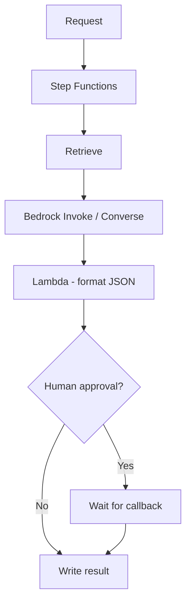

**AWS Step Functions** is the usual exam answer for a scripted path with retries, branching you defined, and human-in-the-loop. **Bedrock Prompt Flows** is the lower-code cousin when the graph is prompts, a Knowledge Base, Lambda, and conditions — still *your* graph.

### When this beats an agent

- The steps do not change between requests.
- You need a guaranteed order (redact → retrieve → generate, never the reverse).
- A person must approve a side effect.
- You want Standard workflow’s durable state and execution history.

### Typical AWS services

Step Functions, Lambda, Bedrock, optionally SQS between steps, DynamoDB for job status, API Gateway if a caller starts the workflow.

### Benefits and tradeoffs

**Benefits.** Predictable. Testable. Cheap relative to an agent loop. Natural place for retries and backoff. Clear audit trail of states.

**Tradeoffs.** Inflexible when the next tool really *is* unknown. You maintain the graph. Standard workflows bill **state transitions**; chatty graphs cost money even when the FM is cheap.

### Exam cues

- “Always the same sequence”
- “Fixed workflow,” “predefined steps”
- “Human in the loop,” “approve before sending”
- “Orchestrate” without “the model decides”

### Common incorrect choices

- Bedrock Agents / AgentCore because “multi-step means agent.”
- One giant Lambda that hides the steps (harder retries, no visual execution history).

> **Known path → workflow. Unknown path → agent.**

---

## Agentic architecture

### The problem it solves

“Pull NVDA’s last two risk factors, compare them to this morning’s transcript, and open a Jira if a new risk appears.”

You cannot draw that graph in advance. Sometimes there is no new risk. Sometimes the transcript mentions three products and the agent must query a second API. The **model chooses tools** in a loop until it should stop.

An agent is a **behavior**, not a product name. A bigger prompt is not an agent. A Step Functions graph is not an agent. AgentCore is not “the AWS word for agent.”

### The loop

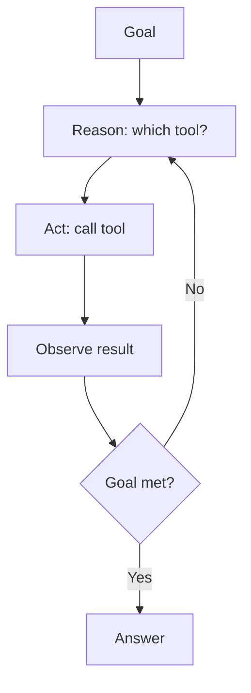

Each extra loop costs tokens, latency, and blast radius. That is why you do not use this pattern for a path you could have written down.

### Two AWS shapes people mix up

**Bedrock Agents** — AWS runs ReAct for you. You declare a Knowledge Base, **action groups** (OpenAPI + Lambda), optional memory and guardrail. Little of your own orchestration code. Fits “KB + a few tools, AWS owns the loop.”

**Amazon Bedrock AgentCore** — a platform for **your** agent code (Strands, LangGraph, CrewAI, …). You already wrote the loop. You need production hosting, identity, tool connectivity, memory, and traces — not a rewrite into action groups.

If the stem says the team already has a Python agent and names AgentCore Runtime, do not “simplify” it into Bedrock Agents, and do not park it on ECS just because you know ECS.

### AgentCore pieces, in architectural terms

| Piece | Problem it solves |
|-------|-------------------|
| **Runtime** | Serverless host for the agent process. Session isolation. JSON *and* long-lived streaming. Contract: `POST /invocations`, `GET /ping`, port 8080, ARM64 image |
| **Gateway** | Turn APIs, Lambdas, and existing MCP servers into tools the agent can call without each team hand-wrapping every backend |
| **Identity** | Credentials for the *agent* to call AWS and third-party APIs — not the human login screen |
| **Memory** | Short-term conversation vs long-term facts the agent should remember across sessions |
| **Observability** | Traces of the loop: which tool, which latency, which failure — so you can debug a non-deterministic path |

The SDK `@app.entrypoint` stands up the HTTP contract. The **starter toolkit** packages the ARM64 image and deploys Runtime. Hand-rolled FastAPI on Fargate can speak the same routes; you then own the server, the image, and the task definition. Least-ops stems want Runtime to own that.

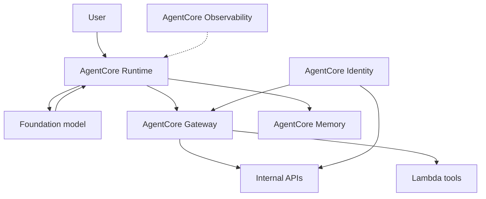

### When an agent is unnecessary

- Always retrieve → summarize → JSON.
- The user pasted the only document.
- The “tool” is a single Lambda you could call yourself.
- You need a human approval gate as a *state in a graph* (Step Functions callback) rather than hoping the model asks.

### Benefits and tradeoffs

**Benefits.** Handles tasks whose next step depends on intermediate results. One interface for “research this and maybe act.”

**Tradeoffs.** Non-deterministic path. Harder tests. Larger blast radius (IAM on every tool). More tokens. Easier to over-permission. You must cap iterations and timeouts so the loop cannot run forever.

### Exam cues

- “Dynamically choose which API to call”
- “Existing LangGraph / Strands / CrewAI”
- “Sub-second JSON *and* multi-minute stream” on AgentCore Runtime
- “Action groups,” “the model must decide”

### Common incorrect choices

- Agent for a fixed pipeline.
- ECS/Fargate as the first host when the stem named AgentCore Runtime and asked for minimal ops.
- SageMaker real-time because it also has `/invocations` and `/ping` — that is a **model endpoint** contract, not AgentCore.
- Treating AgentCore Identity as Cognito for humans.

> **The model chooses the next tool → agent. You already chose the next tool → workflow.**

---

## Synchronous, asynchronous, event-driven, and batch

These four are about **time and coupling**, not about RAG vs agents. Any of those patterns can sit on a sync or async pipe.

### Synchronous

The caller waits. The user’s next action depends on the answer.

**Problem.** Interactive blotter, chatbot, “summarize this now.”

**Architecture.** API Gateway (HTTP or WebSocket) → compute → Bedrock → response. For chat, **stream** tokens (`ConverseStream` / `InvokeModelWithResponseStream`) so the first words appear in hundreds of milliseconds even if the full answer takes eight seconds.

**Benefits.** Simple mental model. Easy to reason about auth per request.

**Tradeoffs.** You are on the clock. API Gateway, Lambda, and Bedrock all have timeouts. A 15-minute GPU job does not belong here. A burst of 10,000 waiting clients will crush a tightly sized backend unless something buffers.

**Exam cues.** “User needs the result immediately,” “interactive,” “chat,” “p95 under 10 seconds.”

**Incorrect.** Putting the chat UI on SQS and making the analyst poll. Using batch inference for a live question.

### Asynchronous

The caller submits work and comes back later. Status lives in DynamoDB or S3. Notification via SNS, EventBridge, or a poll.

**Problem.** The work is too slow, too large, or too bursty to finish in one waiting HTTP call.

**Architecture.** Accept request → persist job id → return 202 → worker processes → write result.

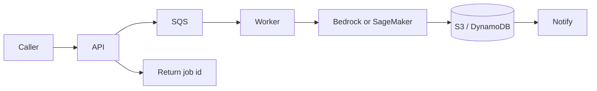

**SageMaker asynchronous inference** is the cousin for **large payloads** (tens of MB) and **many minutes on a GPU** — drop the object in S3, get a pointer back, SNS when done. Do not run that job on synchronous Lambda.

**Exam cues.** “Process in the background,” “notify when complete,” “payload too large for real-time.”

### Event-driven

Something happened in the world (object created, table updated, cron fired). **Who should react?** Possibly several consumers, unknown to the producer.

**Amazon EventBridge** is a router: receive an event, filter, fan out to targets. The 10-K landing in S3 should not hard-code “call this Lambda.” It should emit “object created”; ingest, Slack, and the blotter cache subscribe separately.

**Amazon SQS** is a **durable buffer**: a pile of *jobs* waits until a worker can process them at a sustainable rate. If 10,000 recap jobs arrive at 5pm, SQS holds them so you do not need 10,000 concurrent Bedrock calls.

They compose: EventBridge rule → SQS queue → workers. Bus for routing; queue for absorption.

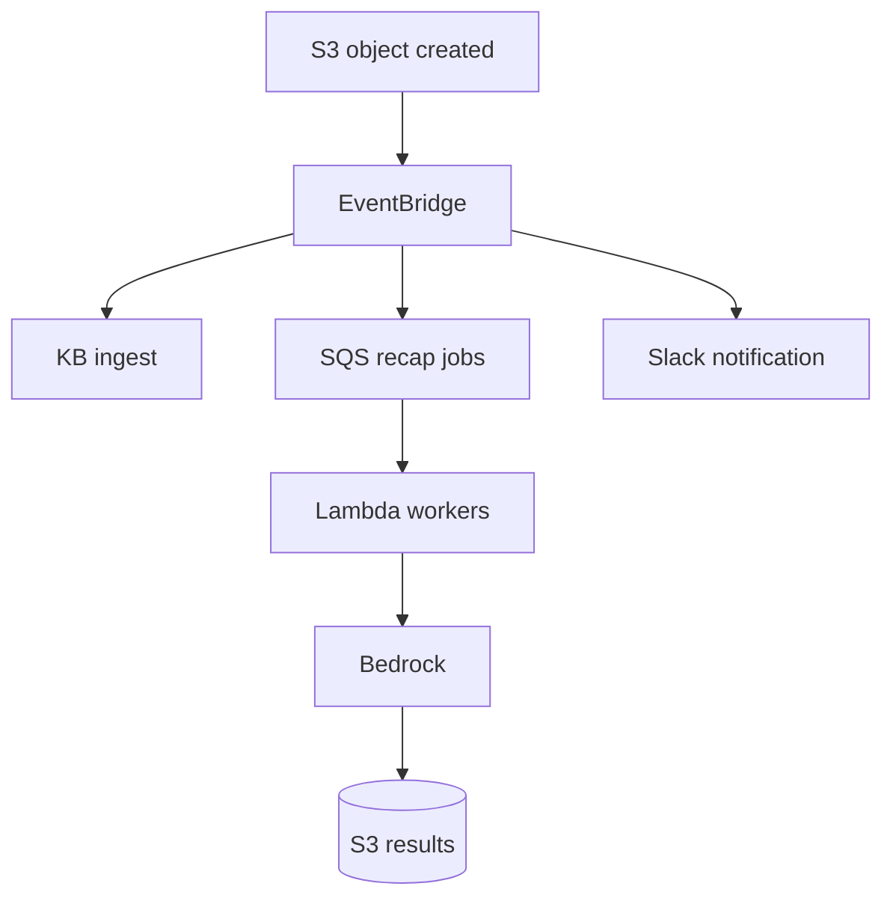

**EventBridge Scheduler** is “run this at 1am” without a homemade cron fleet.

**EventBridge Pipes** is point-to-point: one source (DynamoDB stream, SQS, …) → optional filter/enrich → one target. Not a replacement for a bus with many rules.

**Exam cues.**

- “Fan out,” “many consumers,” “route events” → EventBridge
- “Absorb a spike,” “decouple producers from consumers,” “durable queue” → SQS

**Incorrect.** EventBridge alone when the stem needs a backlog that must not drop work under a burst. SQS when the need is “tell three systems that a filing arrived.”

### Batch

You have a **file of prompts**, not a live queue. Hours are acceptable. Lowest per-token price on Bedrock.

**Bedrock Batch Inference:** JSONL in S3, JSONL out S3, cheaper tokens, not a chatbot.

Use it for 10,000 overnight recaps, evaluation sets, backfills. Do not use it for the analyst sitting in the blotter.

### Side-by-side

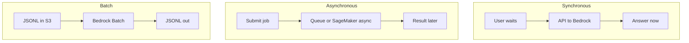

| If the stem says… | Pattern |
|-------------------|---------|
| Trader waits, stream tokens | Synchronous (+ streaming) |
| Job id, notify later | Asynchronous |
| Filing arrived, several systems should react | Event-driven (EventBridge) |
| 10,000 jobs at once, workers catch up | SQS buffer |
| Overnight file of prompts, cheapest tokens | Batch inference |

```quickcheck
Q: A desk drops 8,000 transcript recap jobs at 5pm. Workers should process overnight without losing work. What is the buffer?
A: Amazon SQS
B: EventBridge only
C: Bedrock Provisioned Throughput
D: API Gateway usage plans
correct: A
feedback: SQS holds jobs until workers are ready. EventBridge routes events; it is not a durable work backlog. Provisioned Throughput is model capacity, not a job queue.
```

---

## A production-grade GenAI architecture

Put the planes together. This is the shape you should be able to draw on a whiteboard for a real internal assistant — not the only shape, the *complete* one.

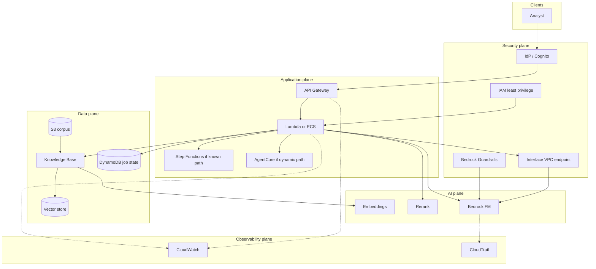

You will not deploy every box for every design. A pasted-paragraph summarizer does not need the data plane. A fixed JSON pipeline does not need AgentCore. The diagram is a **menu** whose items you select with the decision framework.

**Compute choice** (why the box exists, not which logo is fashionable):

| Need | Compute |
|------|---------|
| Short request, event-driven, no container to babysit | Lambda |
| Long-lived process, custom runtime, streaming for minutes | ECS on Fargate (or AgentCore Runtime if it is an agent) |
| Kubernetes is an explicit requirement | EKS |
| HTTP container, least cluster ceremony | ECS Express Mode (not new App Runner) |
| You must SSH to a GPU box you tuned | SageMaker / EC2 — last, not first |

Lambda is glue around Bedrock. It is not where you load Llama-70B.

---

## AWS service glossary

Services appear above in the architecture that needs them. This section is the lookup card: same facts, compressed. Pricing is the **meter**, not a dollar amount that will be wrong next quarter.

### GenAI / AI

#### Amazon Bedrock

**What it is.** A managed API in front of foundation models (Anthropic, Amazon, Meta, and others).

**Problem it solves.** You need an FM without owning GPUs, containers, or CUDA.

**Where it sits.** The AI plane. Everything else calls it.

**Typical use.** Chat, RAG generation, classification, embeddings, guardrailed inference.

**Pricing.** Tokens (on-demand / batch) or reserved Model Units (Provisioned Throughput).

**Exam cue.** Default GenAI answer when a managed FM API will do.

**Do not confuse with.** SageMaker — a platform you size for training and custom hosting.

#### Foundation models on Bedrock

**What it is.** Pretrained models you invoke by model ID or inference profile.

**Problem it solves.** Generation, reasoning, embeddings, rerank — without training from scratch.

**Where it sits.** Behind Bedrock Runtime.

**Typical use.** Claude/Nova for the blotter answer; Titan/Cohere embed for RAG.

**Pricing.** Per model, input vs output tokens.

**Exam cue.** “Choose an appropriate FM” — match modality, quality floor, Region, and features (tools, KB, batch).

**Do not confuse with.** A custom model you fine-tuned; that is a different artifact with different capacity rules.

#### Bedrock on-demand inference

**What it is.** Shared capacity, pay per token, no reservation.

**Problem it solves.** Unpredictable or low/variable traffic.

**Where it sits.** Default invoke path.

**Typical use.** Internal desk, PoC, spiky earnings-day chat (often plus CRI).

**Pricing.** Tokens. Idle costs nothing.

**Exam cue.** “Unpredictable usage,” “least ops,” “do not pay for idle.”

**Do not confuse with.** Provisioned Throughput (you pay when idle) or batch (hours, cheaper, not interactive).

#### Bedrock Batch Inference

**What it is.** JSONL of prompts in S3, results in S3, hours not seconds.

**Problem it solves.** Huge offline generation at lower token price.

**Where it sits.** Off the interactive path.

**Typical use.** 10k overnight recaps, eval backfills.

**Pricing.** Discounted tokens vs on-demand; S3 storage.

**Exam cue.** “Overnight,” “thousands of documents,” “not user-facing.”

**Do not confuse with.** SQS workers (live queue) or SageMaker batch transform (your container/model).

#### Bedrock Provisioned Throughput

**What it is.** Reserved Model Units, billed by time, optional 1- or 6-month commit.

**Problem it solves.** Steady high utilization, or dedicated capacity some custom models still require.

**Where it sits.** Alternate invoke path for the same FM family.

**Typical use.** 24/7 production chatbot with a known floor of traffic.

**Pricing.** Hourly MUs whether you use them or not.

**Exam cue.** “Consistent latency,” “stable high throughput,” “custom model invocation” when on-demand custom deploy is not available.

**Do not confuse with.** CRI (peak relief on **shared** capacity) or prompt routing (different models).

#### Bedrock inference profiles

**What it is.** A handle (`us.…`, `eu.…`, or global) you pass as `modelId` instead of a single-Region ID.

**Problem it solves.** Let Bedrock serve the **same** FM from another Region’s spare capacity.

**Where it sits.** On the Converse/Invoke call.

**Typical use.** Earnings-day `Too many requests` in one Region.

**Pricing.** Tokens at the source Region’s price; no extra “router fee.”

**Exam cue.** “Increase throughput, same FM, same API, least ops.”

**Do not confuse with.** Prompt routing (picks among **different** FMs).

#### Cross-Region inference

**What it is.** Automatic routing via an inference profile.

**Problem it solves.** Regional capacity and availability without you coding failover.

**Where it sits.** Bedrock control plane; traffic stays on the AWS network.

**Typical use.** Peak relief; resilience.

**Pricing.** On-demand tokens.

**Exam cue.** Throttling in one Region; “no additional operational overhead.”

**Do not confuse with.** Your Lambda retrying `us-west-2`. **Geographic** vs **global** profiles: residency (“must stay in the EU”) → `eu.` profile, not global.

#### Bedrock Knowledge Bases

**What it is.** Managed RAG: connect S3 (or similar), chunk, embed, retrieve, optionally generate.

**Problem it solves.** Ground answers in *your* documents without assembling the pipeline from scratch.

**Where it sits.** Between S3 and the FM.

**Typical use.** Internal research assistant with citations.

**Pricing.** Embedding/indexing plus retrieval/generation tokens; vector store costs.

**Exam cue.** “Cite internal docs,” “managed RAG.”

**Do not confuse with.** Fine-tuning. KB is a library; fine-tune is weights.

#### Embedding models

**What it is.** Models that turn text into vectors.

**Problem it solves.** Semantic similarity for retrieval.

**Where it sits.** Ingestion and query embedding steps.

**Typical use.** Titan Embeddings / Cohere embed on Bedrock for a Knowledge Base.

**Pricing.** Tokens or characters embedded.

**Exam cue.** RAG indexing and query encoding.

**Do not confuse with.** The chat FM. Embeddings do not write the answer.

#### Vector stores

**What it is.** Databases that search by nearest neighbor, usually with metadata filters.

**Problem it solves.** “Find the 10 chunks closest to this question.”

**Where it sits.** RAG data plane.

**Typical use.** OpenSearch Serverless, Aurora PostgreSQL pgvector, S3 Vectors, and similar behind a Knowledge Base.

**Pricing.** Storage + search capacity (varies by product).

**Exam cue.** Semantic search, filters by ticker/ACL.

**Do not confuse with.** S3 (object warehouse) or DynamoDB (key-value / job state — not your k-NN engine unless the stem is very explicit).

#### Reranking

**What it is.** A second model that re-scores retrieved candidates.

**Problem it solves.** First-stage retrieval is approximate; the prompt needs the truly relevant passages.

**Where it sits.** After retrieve, before context construction.

**Typical use.** Research Q&A where citation quality matters and the latency budget still fits.

**Pricing.** Per rerank request / tokens.

**Exam cue.** “Improve retrieval quality” without dumping more chunks into the FM.

**Do not confuse with.** Fine-tuning the chat model to “know” the corpus.

#### Bedrock Guardrails

**What it is.** A named policy on inputs and outputs: topics, PII, content, prompt attacks.

**Problem it solves.** Restrict *what is said*, not *who may call the API*.

**Where it sits.** On the Converse/Invoke call (`guardrailConfig`).

**Typical use.** Block investment advice and SSN echo on the blotter.

**Pricing.** Per text unit evaluated (plus the inference itself).

**Exam cue.** “Denied topics,” “PII in outputs,” “jailbreak.”

**Do not confuse with.** IAM. Guardrails read language. IAM authorizes AWS API calls. Enforce “must attach this guardrail” with IAM condition `bedrock:GuardrailIdentifier`.

#### Amazon Bedrock AgentCore

**What it is.** Platform for deploying and operating *your* agents (any framework, many models).

**Problem it solves.** Productionize an existing agent without inventing ECS + auth + tool mesh + traces yourself.

**Where it sits.** Application / agent plane.

**Typical use.** LangGraph research agent in production.

**Pricing.** Runtime and satellite services (usage-based); plus model tokens.

**Exam cue.** Existing agent code, minimal ops, named AgentCore.

**Do not confuse with.** Bedrock Agents (AWS-managed ReAct) or SageMaker endpoints.

#### AgentCore Runtime

**What it is.** Serverless isolated runtime for the agent process.

**Problem it solves.** Host JSON lookups and multi-minute streams without you owning `/invocations` plumbing.

**Where it sits.** Where the agent code runs.

**Typical use.** `@app.entrypoint` + starter toolkit.

**Pricing.** Runtime usage.

**Exam cue.** “Automatically manage HTTP server, routing, health.”

**Do not confuse with.** FastAPI you wrote, or SageMaker `/invocations`.

#### AgentCore Gateway

**What it is.** Managed tool connectivity (APIs, Lambda, MCP) for agents.

**Problem it solves.** Agents need tools; every team should not wrap every backend.

**Where it sits.** Between Runtime and enterprise APIs.

**Typical use.** Jira, internal research APIs, Lambda actions.

**Pricing.** Gateway invocation / tool calls.

**Exam cue.** “Expose existing APIs as tools.”

**Do not confuse with.** API Gateway (human/app HTTP front door).

#### AgentCore Identity

**What it is.** Identity and credential management for agents calling other systems.

**Problem it solves.** The agent needs a badge to call Salesforce or AWS — without stuffing long-lived keys in the prompt.

**Where it sits.** On outbound tool calls.

**Typical use.** OAuth/IdP-backed tool access.

**Pricing.** Identity operations (service-specific).

**Exam cue.** Agent-to-tool auth.

**Do not confuse with.** Cognito user login for the analyst.

#### AgentCore Memory

**What it is.** Managed short-term and long-term memory for agents.

**Problem it solves.** Multi-turn context and cross-session recall without a homemade DynamoDB schema on day one.

**Where it sits.** Beside Runtime.

**Typical use.** Remember the ticker the analyst is covering this week.

**Pricing.** Storage and retrieval of memory records.

**Exam cue.** “Retain context across sessions” for an agent.

**Do not confuse with.** Vector RAG memory of documents (that is a Knowledge Base).

#### AgentCore Observability

**What it is.** Traces and metrics for agent loops, typically OTEL into CloudWatch.

**Problem it solves.** Debugging a path the model chose.

**Where it sits.** Observability plane.

**Typical use.** Which tool failed on the NVDA compare.

**Pricing.** Logs/metrics/traces.

**Exam cue.** Monitor agent steps in production.

**Do not confuse with.** CloudTrail (API audit), or quality evaluation (Domain 5).

#### Amazon SageMaker AI

**What it is.** ML platform: train, host, batch, async, JumpStart, custom containers (DJL/vLLM), Inferentia.

**Problem it solves.** A training loop, a model Bedrock does not host, a GPU you tune, or a long/large-file job Bedrock will not run.

**Where it sits.** Alternative AI plane.

**Typical use.** 50 MB pack, 15-minute GPU parse → **async** endpoint.

**Pricing.** Instances (and storage) for the boxes you keep warm or spin.

**Exam cue.** Custom container, training, large/long GPU job.

**Do not confuse with.** Bedrock. SageMaker is the box you size. EKS is later still.

### Application / compute

#### Amazon API Gateway

**What it is.** Managed HTTP and WebSocket front door.

**Problem it solves.** Auth, keys, throttles, a stable contract, streaming for chat.

**Where it sits.** Edge of the application plane.

**Typical use.** Production blotter API; WebSocket for token streaming.

**Pricing.** Requests (and connection minutes for WebSocket).

**Exam cue.** “External users,” “throttle at the edge,” “WebSocket.”

**Do not confuse with.** AgentCore Gateway.

#### AWS Lambda

**What it is.** Event-driven functions; you bring code, not servers.

**Problem it solves.** Glue: HTTP → prompt → Bedrock; SQS workers; EventBridge targets.

**Where it sits.** Application plane.

**Typical use.** Converse wrapper; ingest trigger.

**Pricing.** Requests + GB-seconds (execution time × memory).

**Exam cue.** Least-ops compute around Bedrock. 15-minute max; no GPU FM hosting.

**Do not confuse with.** The place to run a 70B model.

#### Amazon ECS

**What it is.** Container orchestrator (your tasks, AWS schedules them).

**Problem it solves.** Long-running or custom containers without Kubernetes.

**Where it sits.** Application plane.

**Typical use.** Streaming proxy, heavy worker, custom agent when Runtime is not in the stem.

**Pricing.** Underlying compute (Fargate vCPU/memory or EC2).

**Exam cue.** Containers, no Kubernetes requirement.

**Do not confuse with.** EKS (Kubernetes) or AgentCore Runtime (agent-specific host).

#### AWS Fargate

**What it is.** Serverless compute engine for ECS (and EKS) tasks — no EC2 fleet to patch.

**Problem it solves.** Run containers without managing instances.

**Where it sits.** Under ECS tasks.

**Typical use.** ECS on Fargate for an API container.

**Pricing.** vCPU + memory duration.

**Exam cue.** “Containers, no servers.” **No GPU** on Fargate.

**Do not confuse with.** Lambda (functions, not arbitrary long GPU work).

#### ECS Express Mode

**What it is.** Simplified ECS-on-Fargate deploy: image in, service + URL + load balancer + scaling out.

**Problem it solves.** App-Runner-like simplicity while remaining ECS, with resources visible in your account.

**Where it sits.** Application plane for HTTP containers.

**Typical use.** New containerized FM wrapper / API.

**Pricing.** No extra Express Mode fee; you pay Fargate, ALB, logs.

**Exam cue.** “Simple container deploy,” successor path from App Runner.

**Do not confuse with.** EKS, or hand-built ECS with every knob from day one.

#### Amazon EKS

**What it is.** Managed Kubernetes.

**Problem it solves.** You **must** run Kubernetes (existing platform, custom schedulers, GPU operators).

**Where it sits.** Application plane, maximum ops.

**Typical use.** Last resort when Bedrock and SageMaker cannot host the runtime.

**Pricing.** Control plane + node compute.

**Exam cue.** Stem **names Kubernetes** as a requirement.

**Do not confuse with.** “We are a large enterprise therefore EKS.”

#### Amazon EC2

**What it is.** Virtual machines you size and patch.

**Problem it solves.** Full control, including GPU instances you operate.

**Where it sits.** Bottom of the compute stack.

**Typical use.** Rare in 1.1.1 if the stem asks to minimize infrastructure management.

**Pricing.** Instance hours.

**Exam cue.** Only when something explicitly needs a VM you run.

**Do not confuse with.** Fargate (no instance management).

#### AWS App Runner

**What it is.** Managed “from container or source to HTTPS URL” service.

**Problem it solves.** Historically: run a web container with almost no ECS knowledge.

**Where it sits.** Legacy simple-container path.

**Typical use.** Existing App Runner services.

**Pricing.** Compute + requests (legacy).

**Exam cue.** Older stems may still mention it for “container, no cluster.”

**Do not confuse with.** The current default. **As of April 30, 2026, App Runner does not accept new customers.** Existing customers keep running; no new features. AWS’s recommended path is **ECS Express Mode**.

### Integration / orchestration

#### AWS Step Functions

**What it is.** Managed state machines.

**Problem it solves.** Deterministic multi-step work, retries, wait-for-human.

**Where it sits.** Orchestration layer.

**Typical use.** Retrieve → generate → format; approval before Jira.

**Pricing.** Standard: **per state transition**. Express: per request/duration (at-least-once, cheaper, less durable history).

**Exam cue.** Fixed sequence, audit of steps, HITL.

**Do not confuse with.** Agents.

#### Amazon EventBridge

**What it is.** Serverless event bus (plus Pipes and Scheduler).

**Problem it solves.** Route events from many sources to many targets.

**Where it sits.** Integration plane.

**Typical use.** S3 `Object Created` → ingest + notify.

**Pricing.** Events ingested / invocations.

**Exam cue.** “Route,” “fan out,” “react when X happens.”

**Do not confuse with.** SQS (buffer of jobs).

#### EventBridge Scheduler

**What it is.** Managed cron / rate / one-time schedules.

**Problem it solves.** “Start the nightly recap at 01:00” without a fleet of cron hosts.

**Where it sits.** Time-based producer into the same targets (Lambda, Step Functions, …).

**Typical use.** Hourly KB sync trigger.

**Pricing.** Schedule invocations.

**Exam cue.** Recurring invocation, no servers.

**Do not confuse with.** EventBridge **rules** on a bus (those react to events, not the clock — unless the event is scheduled).

#### EventBridge Pipes

**What it is.** Point-to-point pipe: one source → filter/enrich → one target.

**Problem it solves.** Connect a stream/queue to a target without a Lambda shim.

**Where it sits.** Integration plane.

**Typical use.** DynamoDB stream → Step Functions.

**Pricing.** Pipe events.

**Exam cue.** Single source to single target, optional enrichment.

**Do not confuse with.** A bus with many rules.

#### Amazon SQS

**What it is.** Durable message queue.

**Problem it solves.** A burst of 10,000 jobs must not overwhelm workers; work must wait safely.

**Where it sits.** Between producers and consumers.

**Typical use.** Recap job queue; buffer in front of Bedrock workers.

**Pricing.** Primarily **requests** (and some data transfer).

**Exam cue.** “Durable buffer,” “absorb a spike,” “process when ready.”

**Do not confuse with.** EventBridge. SQS holds work; EventBridge routes events.

### Data

#### Amazon S3

**What it is.** Object storage.

**Problem it solves.** Durable files: filings, batch I/O, invocation logs, async payloads.

**Where it sits.** Data plane warehouse.

**Typical use.** Knowledge Base source; batch JSONL; SageMaker async input.

**Pricing.** Storage + requests + retrieval.

**Exam cue.** Documents, files, large payloads.

**Do not confuse with.** A vector index. S3 holds objects; a vector store searches embeddings (S3 Vectors is the exception that *is* a vector store).

#### Amazon DynamoDB

**What it is.** Serverless key-value / document database.

**Problem it solves.** Low-latency item access: job status, session pointers, metadata by key.

**Where it sits.** Application data, not the semantic library.

**Typical use.** `jobId → status/result pointer`; agent session keys.

**Pricing.** Reads/writes (on-demand or provisioned capacity).

**Exam cue.** Session or job state, not “search 80-page 10-Ks by meaning.”

**Do not confuse with.** Vector search. DynamoDB is not your default k-NN engine.

### Security / operations

#### AWS IAM

**What it is.** Who may call which AWS APIs on which resources, optionally under conditions.

**Problem it solves.** Least privilege for `InvokeModel`, S3 GetObject, KB retrieve, tool Lambdas.

**Where it sits.** Every plane.

**Typical use.** Role on Lambda; `bedrock:GuardrailIdentifier` condition; no `*` on models.

**Pricing.** No per-call IAM fee.

**Exam cue.** “Permissions,” “least privilege,” “enforce guardrail on every call.”

**Do not confuse with.** Guardrails (content) or Cognito (user identity federation).

#### Amazon CloudWatch

**What it is.** Metrics, logs, alarms, dashboards (and X-Ray/Application Signals in the same operations family).

**Problem it solves.** Is the system healthy? Latency, 429s, error rates, token volume.

**Where it sits.** Observability plane.

**Typical use.** p95 latency alarm; throttle count.

**Pricing.** Metrics, log ingest/storage, dashboards.

**Exam cue.** “Monitor,” “operational metrics,” “alarms.”

**Do not confuse with.** CloudTrail.

#### AWS CloudTrail

**What it is.** Account API audit log.

**Problem it solves.** **Who** called `InvokeModel`, from which role, when.

**Where it sits.** Audit plane.

**Typical use.** Compliance: which principal hit Bedrock.

**Pricing.** Management events (default) + data events if you enable them.

**Exam cue.** “Who changed / who invoked,” “audit.”

**Do not confuse with.** CloudWatch. Trail does not store prompt text for you; invocation logging is a different Bedrock feature.

### Architecture governance

#### AWS Well-Architected Framework

**What it is.** A review framework: operational excellence, security, reliability, performance, cost, sustainability.

**Problem it solves.** Structured questions before you call a design “production.”

**Where it sits.** Governance — not the runtime path.

**Typical use.** Design review checklist.

**Pricing.** The Tool is free to use; the architecture still costs what it costs.

**Exam cue.** “Align to AWS best practices” at the framework level.

**Do not confuse with.** A service that hosts models. Not Trusted Advisor.

#### AWS Well-Architected Tool

**What it is.** Console/API to record Well-Architected reviews.

**Problem it solves.** Capture answers and improvement plans.

**Where it sits.** Governance process.

**Typical use.** Team runs a workload review.

**Pricing.** No charge for the tool.

**Exam cue.** Documenting a review — still not the runtime.

**Do not confuse with.** GenAI Lens content itself (the questions) vs the Tool (the place you record them).

#### AWS Well-Architected Generative AI Lens

**What it is.** Extra questions for prompts, RAG, agents, non-determinism, token cost, prompt injection.

**Problem it solves.** Traditional five pillars miss GenAI-specific failure modes.

**Where it sits.** 1.1.3 more than 1.1.1, but 1.1.1 designs should survive a Lens review.

**Typical use.** “Standardize GenAI across teams” + reusable IaC — that pair is 1.1.3.

**Pricing.** None for the guidance.

**Exam cue.** Best-practice alignment for GenAI workloads.

**Do not confuse with.** Bedrock. The Lens does not invoke models.

---

## Critical service comparisons

Each row is a conceptual distinction the exam will try to flatten.

### Bedrock vs SageMaker AI

**Distinction.** Bedrock is a **managed FM API**. SageMaker is a **platform of boxes** you size: training, real-time/async/batch endpoints, custom images.

**Bedrock scenario.** Blotter chat and RAG on Claude, on-demand, Knowledge Base, guardrail.

**SageMaker scenario.** 50 MB research pack, ~15 minutes on a GPU, custom DJL container — **async** endpoint.

**Trap.** “Production” or “enterprise” does not mean SageMaker. EKS is a third, heavier option if both refuse the runtime.

**Heuristic.** If Bedrock hosts the FM, call Bedrock. SageMaker when you need a training loop, a GPU you tune, or a job Bedrock will not run.

### RAG vs fine-tuning / customization

**Distinction.** RAG puts facts in a **library**. Fine-tuning puts **behavior** in **weights**. Weights have no citation and do not update when tomorrow’s 10-K lands.

**RAG scenario.** Cite this quarter’s NVDA risk factors.

**Fine-tune scenario.** Always emit the desk’s JSON schema / house tone — still retrieve facts via RAG.

**Trap.** Fine-tune to solve a changing-knowledge problem.

**Heuristic.** Changing facts → RAG. Changing style/schema → prompt first, fine-tune later.

### Direct inference vs RAG

**Distinction.** Direct inference assumes the prompt already has the evidence. RAG fetches evidence first.

**Direct scenario.** User pasted the paragraph.

**RAG scenario.** User asked about a corpus they did not paste.

**Trap.** Knowledge Base on every design as a reflex.

**Heuristic.** If the stem never mentions a corpus, do not invent RAG.

### Step Functions vs AgentCore / agents

**Distinction.** You authored the path vs the model authors the path.

**Step Functions scenario.** Always redact → retrieve → summarize → write S3.

**Agent scenario.** Compare filings, then maybe open Jira, then maybe query a second API depending on what showed up.

**Trap.** Multi-step = agent.

**Heuristic.** **Known path → Step Functions. Dynamic path → agent.**

### EventBridge vs SQS

**Distinction.** **Who should react?** vs **Who can process this when ready?**

**EventBridge scenario.** Object created → ingest, Slack, cache invalidation.

**SQS scenario.** 8,000 recap jobs must wait in line.

**Trap.** EventBridge as a durable work backlog; SQS as a fan-out bus.

**Heuristic.** Route events with EventBridge. Buffer jobs with SQS.

### Lambda vs ECS / Fargate

**Distinction.** Short event-driven glue vs a long-lived container you package.

**Lambda scenario.** API Gateway → Converse → 1.2 s response.

**ECS scenario.** Custom runtime, connection reuse, 10-minute stream, dependencies that do not fit a function.

**Trap.** ECS because it “feels production.” Lambda for a 40-minute GPU job (15-minute cap, no GPU).

**Heuristic.** Glue around Bedrock → Lambda. You brought a container that must keep running → Fargate.

### ECS vs EKS

**Distinction.** AWS-native containers vs Kubernetes.

**ECS scenario.** Team has a container, no K8s requirement.

**EKS scenario.** Stem requires Kubernetes, existing cluster, or K8s-only tooling.

**Trap.** Large company ⇒ EKS.

**Heuristic.** Kubernetes named → EKS. Otherwise ECS/Fargate (or Express Mode).

### On-demand vs Provisioned Throughput

**Distinction.** Pay for tokens you use vs pay for a reserved lane.

**On-demand scenario.** Unpredictable desk usage; three-hour earnings spike (often + CRI).

**PT scenario.** Flat 24/7 load, or a custom model that still needs reserved capacity.

**Trap.** Buying MUs to survive a spike; using on-demand and hoping through a hard SLA with no CRI/retries.

**Heuristic.** Bursty → on-demand/CRI. Steady high → consider PT.

### Synchronous vs asynchronous

**Distinction.** Caller waits vs caller comes back.

**Sync scenario.** 10-second blotter answer.

**Async scenario.** Overnight corpus; SageMaker async for huge GPU jobs.

**Trap.** Batch/SQS for a waiting user; synchronous Lambda for a 15-minute parse.

**Heuristic.** Human staring at the UI → sync (stream). Work can finish later → async/batch.

### CloudWatch vs CloudTrail

**Distinction.** **How is it running?** vs **Who did what to AWS?**

**CloudWatch scenario.** p95 latency and throttle alarms.

**CloudTrail scenario.** Which role invoked Bedrock at 14:02.

**Trap.** CloudTrail as your latency dashboard; CloudWatch as your auditor of who called.

**Heuristic.** **Operational health → CloudWatch. Who did what → CloudTrail.**

### IAM vs Guardrails

**Distinction.** AWS API authorization vs language-level policy.

**IAM scenario.** This role may `InvokeModel` on these model ARNs, only with this guardrail ID.

**Guardrails scenario.** Block “should I buy NVDA” and redact account numbers in the completion.

**Trap.** Guardrails replace IAM; IAM reads prompt text (it does not).

**Heuristic.** **Who may call → IAM. What may be said → Guardrails.**

### S3 vs DynamoDB vs vector storage

**Distinction.** Files vs items vs meaning.

**S3 scenario.** Store the PDF.

**DynamoDB scenario.** Store `jobId` status.

**Vector scenario.** Find the chunk about Blackwell.

**Trap.** DynamoDB as a semantic search engine; S3 ListObjects as RAG.

**Heuristic.** Object → S3. Key lookup → DynamoDB. Similarity → vector store.

### Global vs geographic Cross-Region inference

**Distinction.** Both are CRI. **Geographic** profiles (`us.`, `eu.`) keep routing inside a boundary. **Global** may serve from commercial Regions worldwide.

**Geographic scenario.** Legal: prompts and generations stay in the EU → `eu.` profile.

**Global scenario.** No residency constraint, maximize spare capacity.

**Trap.** Picking global despite “data must remain in the US/EU.” Picking a homemade dual-Region Lambda when CRI would do.

**Heuristic.** Residency named → geographic profile. Peak + same FM + least ops → CRI, not PT.

---

## Pricing as an architectural dimension

You are not studying a rate card. You are learning **what the design causes you to pay for**, especially when the system is idle.

```text
Tokens                → Bedrock inference (on-demand / batch)
Reserved model capacity → Provisioned Throughput (MUs / hour)
Requests              → API Gateway, SQS, EventBridge
Execution time × memory → Lambda
State transitions     → Step Functions Standard
vCPU + memory duration → Fargate
Storage + requests    → S3
Reads / writes        → DynamoDB
Logs / metrics / traces → CloudWatch
Instances             → SageMaker / EC2
```

Translate requirements into meters:

| Requirement | Cost implication |
|-------------|------------------|
| Unpredictable usage | Prefer token- and request-priced pieces; idle reserved capacity is waste |
| Steady high QPS | PT and provisioned DynamoDB can beat pure on-demand |
| Huge retrieved context | You pay input tokens for every chunk — improve retrieval instead of stuffing |
| Agent with 8 tool loops | You pay the FM for every thought, not just the final answer |
| Chatty Step Functions graph | Transition charges add up even if Lambda is tiny |
| Overnight 50k summaries | Batch tokens beat interactive on-demand |
| “Never go down” logging at debug | CloudWatch ingest can rival inference if you log every prompt at volume |

A bursty earnings desk on Provisioned Throughput pays for 21 quiet hours to survive 3 hot ones. CRI plus on-demand pays for the hot hours. A 24/7 customer-facing assistant at 70% MU utilization is the opposite story.

> **Exam tip:** Highly bursty usage favors consumption-based components because idle capacity would otherwise be wasted.

---

## Security and governance

Security is a plane of the architecture, not a slide you add after the boxes look right.

### Identity vs authorization vs content policy

Three doors:

1. **Authentication** — the analyst is really Priya from IR (IdP → Cognito / IAM Identity Center → temporary credentials). No long-lived keys in the app.
2. **Authorization** — Priya’s role may invoke Bedrock and retrieve only chunks tagged for her groups. IAM for AWS APIs; **metadata filters** for documents.
3. **Content policy** — even an authorized call cannot ask for personalized trading advice or echo an SSN. Guardrails on the FM call.

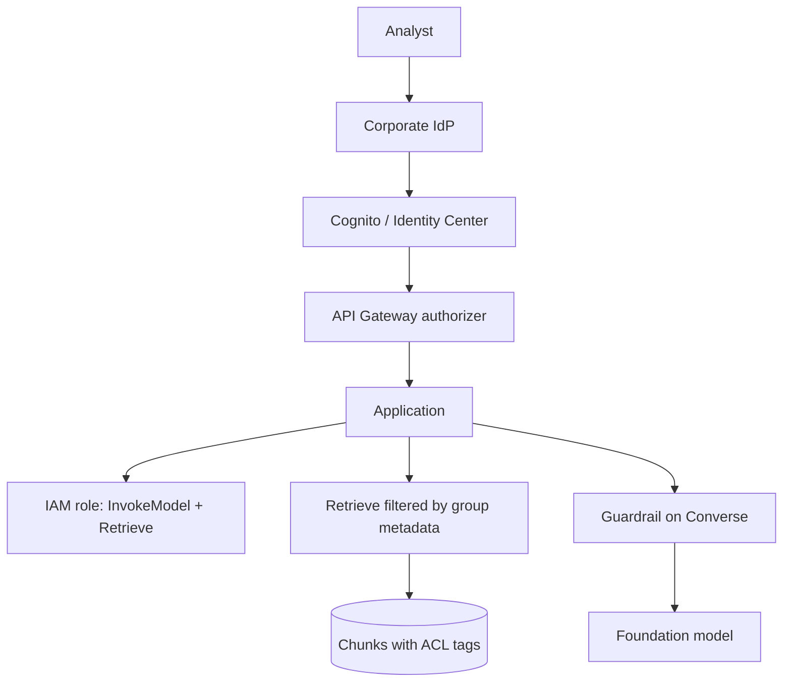

Least privilege means the application role can invoke **these** models, read **these** buckets, and call **these** tools — not `bedrock:*` on `*`. Tool IAM is the blast radius if an agent is jailbroken.

**Encryption** at rest (S3, vector store, DynamoDB) and in transit (TLS). **Private networking:** interface VPC endpoint so Bedrock traffic never uses the public internet. Gateway endpoints do not work for Bedrock.

**Agent tools** need AgentCore Identity (or equivalent) so the agent’s outbound calls are credentialed and scoped. **CloudTrail** records who invoked. **CloudWatch** tells you the call was slow. Enable Bedrock invocation logging to S3/CloudWatch when you must reconstruct prompts — that is not CloudTrail’s job.

> **Important:** Authenticating a user is not the same as authorizing retrieval of every document.

---

## Reliability and performance

### Failure is not only 5xx

| Failure | Architectural response |
|---------|------------------------|
| Throttle / 429 | Exponential backoff with jitter; CRI for spare Regional capacity; queue if the work can wait |
| Transient 5xx | Retries with a cap; Step Functions retry policies |
| Regional capacity | Geographic or global inference profile |
| Model producing garbage | Guardrail + application check; fallback to smaller model or cached safe response; “I don’t know” on weak RAG evidence |
| Downstream tool outage | Circuit breaker; degrade to read-only; do not loop the agent forever |

SQS is reliability for *work*: if a worker dies mid-recap, the message returns and another worker takes it (after visibility timeout). That is why bursts belong on a queue.

Graceful degradation for a blotter: if retrieval is down, refuse rather than answer from parametric memory when the product promise was citations. If the large model is throttled, fall back to a smaller one for ticker lookup, not for the 12-page compare.

### Cross-Region inference

On-demand capacity is **per model per Region**. A US geographic inference profile lets Bedrock serve the **same** FM from another US Region when `us-east-1` is saturated. A **global** profile may leave the geography — use it only when residency allows.

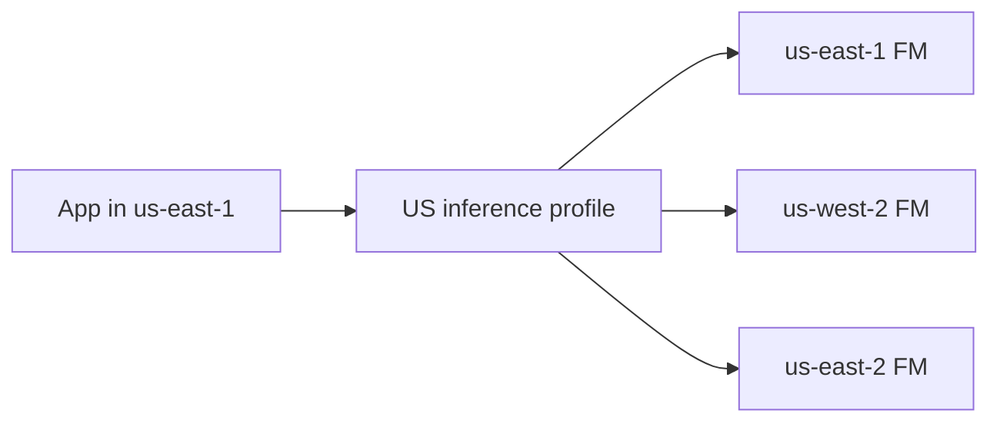

You still call Converse. You swap the model ID for the profile. You do not write a dual-Region Lambda. Custom models generally cannot ride this path.

### Latency budget

```text
Total response latency
  = network
  + authentication
  + retrieval
  + reranking
  + prompt construction
  + inference
  + output processing
```

Architecture moves time between line items:

| Change | Helps | Hurts |
|--------|-------|-------|
| Streaming | Perceived latency | Complexity (WebSocket/SSE) |
| Reranking | Answer quality | Adds a model call before the FM |
| More chunks in context | Sometimes recall | Input tokens, latency, confusion |
| Smaller FM | Inference time and cost | Quality on hard compares |
| CRI | Avoid throttle waits | Occasional extra Regional hop |
| Sync RAG for overnight 50k docs | — | Impossible budget; use batch |

A 10-second target with RAG is a **budget you allocate**, not a Bedrock SLA. If retrieve is 2s, rerank 1s, and generation 6s, you have 1s left for everything else. That is why “just add rerank” is a tradeoff, not a free quality upgrade.

Cross-Region inference improves **availability and peak throughput**, not p50 token generation in a healthy Region. Provisioned Throughput improves **capacity certainty**, not retrieval quality.

---

## Worked architecture scenarios

For each scenario: extract, imply, choose pattern, choose services, draw, justify, trade off, name a plausible wrong design.

### Scenario 1 — Simple document summarization

**Business need.** IR wants a button: paste an earnings paragraph, get four bullets, no invented numbers.

**Extract.** Facts are in the prompt. No corpus. Internal users. Unpredictable clicks. Latency of a few seconds is fine. No tools.

**Implications.** Direct inference. On-demand. No RAG. No agent. Sync.

**Pattern.** Synchronous direct FM inference.

**Services.** API Gateway → Lambda → Bedrock on-demand (small/cheap model that meets quality). IAM least privilege. Optional Guardrails. CloudWatch on the function and API.

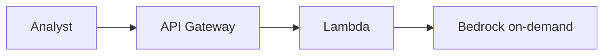

**Why each exists.** Gateway: auth and throttle. Lambda: prompt + Converse. Bedrock: the FM. No vector store because nothing is stored.

**Tradeoffs.** (1) No citations against a filing library — acceptable because the user pasted the exhibit. (2) On-demand may throttle on a wild day — acceptable at this scale; CRI if it becomes a firm-wide button.

**Plausible wrong design.** Knowledge Base over S3 “for production readiness.” There is no library. You added ingest, embeddings, and failure modes for zero benefit.

### Scenario 2 — Internal enterprise RAG assistant

**Business need.** The original blotter: answers over proprietary filings and notes, during the day.

**Extract.**

| Requirement | Implication |
|-------------|-------------|
| Proprietary documents | RAG, not parametric memory |
| 10-second response | Synchronous query path; tight retrieve+infer budget |
| Unpredictable usage | On-demand (+ CRI if peaks hurt), serverless app tier |
| Source citations | Chunk metadata (URI, page, ticker) returned to the UI |
| Restricted access | AuthN + metadata filters on retrieve |
| Hourly freshness | Ingestion plane on a schedule or S3 event, not per question |

**Pattern.** Sync RAG. Event-driven ingest.

**Services.** S3; Knowledge Base + embeddings + vector store; Lambda/API Gateway; Bedrock FM; EventBridge (S3 object created and/or Scheduler hourly sync); IAM + Cognito; Guardrails; CloudWatch/CloudTrail; interface VPC endpoint if filings must not traverse the public internet.

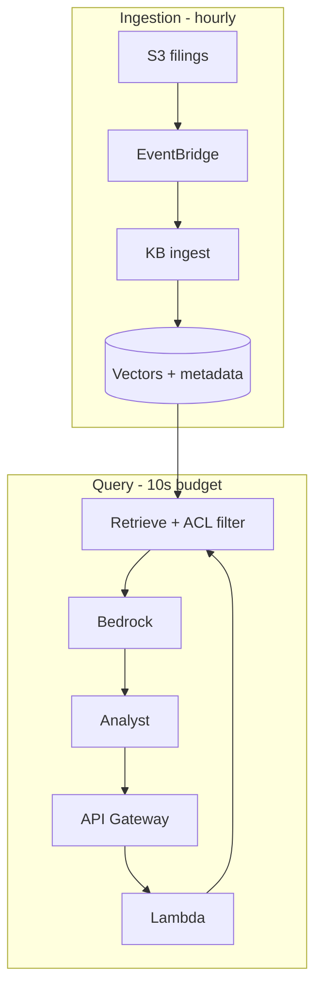

**Why each exists.** S3 is the source of truth. Ingest is separate so freshness does not sit on the user’s clock. Retrieve filter is the authorization boundary. FM writes the cited answer. On-demand matches unpredictable desks.

**Tradeoffs.** (1) Hourly — not real-time to the second; a filing at 10:05 may miss the 10:00 sync. (2) No rerank yet — add it if citation errors dominate and the 10s budget still holds.

**Plausible wrong design.** Fine-tune on all historical 10-Ks so the model “knows NVDA.” No footnotes, stale tomorrow, expensive, fails the citation requirement.

### Scenario 3 — Overnight document-processing pipeline

**Business need.** After close, recap 12,000 transcripts into a standard template for the morning meeting.

**Extract.** Nobody waits. Volume is a pile. Cheapest correct tokens win. Deterministic template. Failures must retry.

**Implications.** Batch or SQS workers. Not a chatbot. Not an agent. Not PT unless you already run 24/7.

**Pattern.** Batch inference **or** event/queue workers. Prefer Batch when the input is naturally a file of prompts. Prefer SQS when jobs trickle in and must not be lost.

**Services.** S3 JSONL → Bedrock Batch Inference → S3; or EventBridge Scheduler → Lambda that enqueues → SQS → Lambda workers → Bedrock on-demand → S3/DynamoDB. Step Functions if you need per-document retry graphs and a failure report.

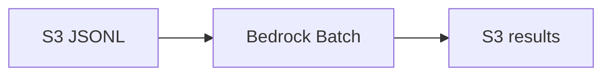

**Why each exists.** S3 holds the pile. Batch is the discounted, hours-scale FM path. No API Gateway for analysts.

**Tradeoffs.** (1) Hours of latency — fine for morning, fatal if someone wanted live chat. (2) Batch error handling is job-level; per-item poison-pill logic is more natural on SQS.

**Plausible wrong design.** Synchronous API Gateway + Lambda + Converse in a loop from a laptop. Timeouts, 429s, no durable progress, interactive pricing.

### Scenario 4 — Agent across enterprise APIs

**Business need.** “Compare NVDA vs AVGO networking attach; if a new risk appears, open Jira and notify Slack.”

**Extract.** Path depends on intermediate findings. Side effects. Existing Python (LangGraph). Sub-second ticker lookup **and** multi-minute streamed compare. Minimal new ops.

**Implications.** Agent, not Step Functions. AgentCore Runtime, not a from-scratch ECS service. Gateway for tools. Identity for outbound APIs. Observability for the loop.

**Pattern.** Agentic on AgentCore.

**Services.** AgentCore Runtime (SDK + starter toolkit), Gateway, Identity, Memory, Observability; Bedrock FM; Jira/Slack via Gateway; Guardrails; IAM on every tool Lambda.

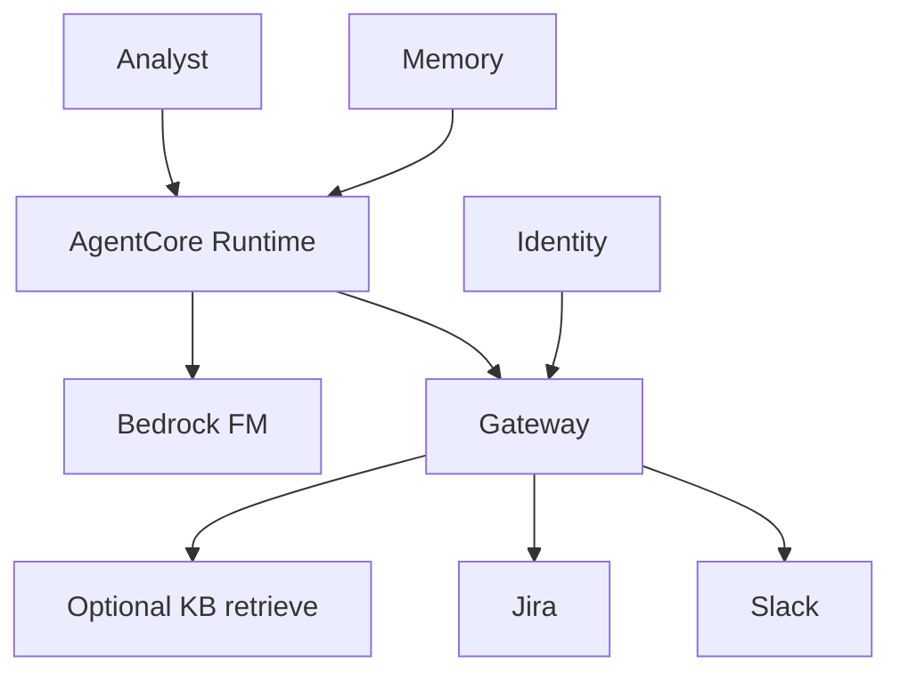

**Why each exists.** Runtime hosts *their* loop and both response shapes. Gateway is tool mesh. Identity is the agent’s badge. Memory keeps the session. Guardrails still wrap language; IAM still wraps API blast radius.

**Tradeoffs.** (1) Non-deterministic: the agent might open Jira too often — mitigate with confirmation or a Step Functions approval *around* the side effect. (2) Token cost of the loop vs a scripted path — accepted because the path is not scriptable.

**Plausible wrong design.** Step Functions with 40 branches trying to pre-enumerate every compare. Or ECS Fargate + homemade FastAPI `/invocations` when the stem asked for AgentCore and least ops.

### Scenario 5 — High-volume regulated assistant

**Business need.** Client-facing research assistant. US data residency. High availability. Auditable. Predictable weekday load, strict p95. No unrestricted document bleed between client teams.

**Extract.** Residency → geographic CRI (`us.`), not global. Availability → CRI + multi-AZ app. Audit → CloudTrail + invocation logs. Steady load → consider PT. Isolation → metadata ACLs, not one shared retrieve. Private network → interface VPC endpoint.

**Pattern.** Sync RAG + geographic CRI + strong security plane. Possibly PT if utilization math works. No agent unless tools are required.

**Services.** API Gateway + auth; app on Lambda or ECS; Knowledge Bases with metadata; Bedrock with `us.` inference profile and/or PT; Guardrails + IAM condition; PrivateLink; CloudWatch + CloudTrail; S3 encrypted; WAF if public.

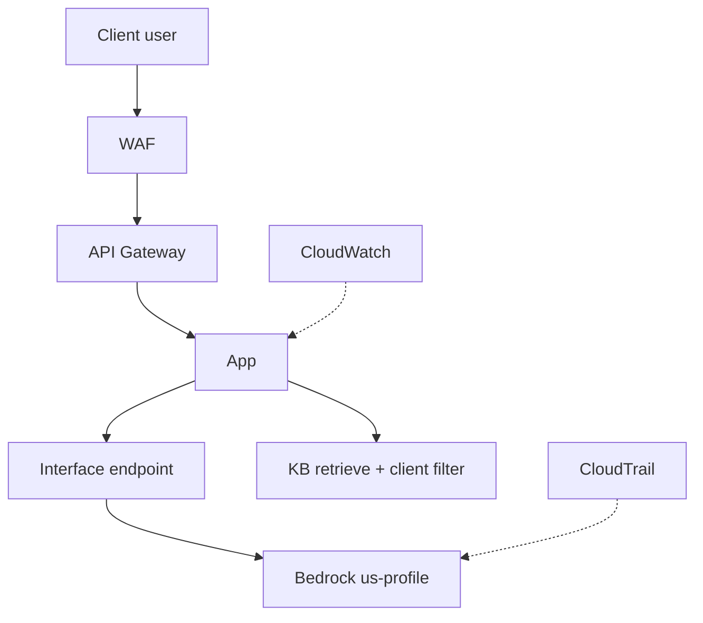

**Why each exists.** Geographic profile keeps routing in-US while surviving a busy Region. PrivateLink satisfies “not on the public internet.” Client filter is tenancy. Trail is who called; Watch is how it ran.

**Tradeoffs.** (1) Global CRI might have had more spare capacity — illegal under residency. (2) PT raises the floor cost; wrong if the “high volume” is actually a two-hour spike.

**Plausible wrong design.** Global inference profile “for resilience,” or EKS because the bank is large, or Guardrails without document filters (content policy ≠ tenancy).

---

## Architecture recognition cues

| If the question says… | Think… |
|-----------------------|--------|
| Current proprietary knowledge | RAG |
| Source citations | RAG + chunk metadata |
| User pasted the only text | Direct inference |
| Information changes often | RAG, not fine-tune |
| Always the same multi-step sequence | Step Functions / Prompt Flows |
| Dynamic choice of tools | Agent |
| Existing LangGraph / Strands, least ops | AgentCore Runtime |
| Human must approve a side effect | Step Functions HITL |
| Burst of work / do not drop jobs | SQS |
| Route / fan out events | EventBridge |
| Nightly at 01:00 | EventBridge Scheduler |
| User needs the result now | Synchronous (+ stream if chat) |
| Process thousands overnight | Async or Batch |
| File of prompts, cheapest tokens | Bedrock Batch Inference |
| Large file, many minutes on GPU | SageMaker async |
| Unpredictable traffic | Serverless + on-demand |
| Steady high throughput / reserved lane | Provisioned Throughput |
| Same FM, peak 429s, least ops | Cross-Region inference |
| Must stay in EU / US | Geographic profile, not global |
| Kubernetes requirement | EKS |
| Containers, no Kubernetes | ECS / Fargate / Express Mode |
| Minimize infrastructure management | Bedrock + Lambda, not EC2 |
| New simple container HTTP service (2026+) | ECS Express Mode |
| Operational metrics / alarms | CloudWatch |
| Who called / who changed | CloudTrail |
| AI content restrictions | Guardrails |
| AWS resource permissions | IAM |
| Agent’s outbound credentials | AgentCore Identity |
| Document-level access | Retrieval metadata filters |
| Private connectivity to Bedrock | Interface VPC endpoint |
| Training loop / custom GPU image | SageMaker |
| Managed FM API | Bedrock |

This table is a review sheet, not a substitute for the framework. If two cues collide, the **constraint** wins (residency beats global CRI; “same three steps” beats agent).

---

## Common exam traps

**Using agents for deterministic processes.** An agent spends tokens choosing a path you already know. You also inherit a blast radius and a loop that can wander. Use Step Functions or Prompt Flows.

**Using RAG when all data is already in the prompt.** You pay to index and retrieve a document the user uploaded in the same request. Direct inference.

**Fine-tuning to solve a changing knowledge problem.** Tomorrow’s 10-K is not in the weights. Fine-tunes do not cite exhibits. RAG.

**Choosing EKS because the organization is large.** Kubernetes is a requirement, not a company size. Prefer Bedrock, then SageMaker, then ECS, then EKS.

**Choosing EC2 when the stem minimizes infrastructure management.** EC2 is a box you patch. Lambda, Fargate, Bedrock, and AgentCore Runtime exist to avoid that.

**Using EventBridge when a durable queue is required.** A bus delivers events to targets; it is not a backlog of 8,000 jobs with visibility timeouts and worker-driven drain. SQS.

**Assuming Guardrails replace IAM.** An intern with `bedrock:InvokeModel` on `*` bypasses your “we configured a guardrail in the console” unless IAM **requires** the identifier. Guardrails also do not filter which PDFs retrieval returns.

**Authenticating users without filtering retrieval.** SSO proves identity. Metadata filters (or separate indexes) enforce tenancy. Otherwise the model cites the other team’s memo.

**Choosing global inference despite residency.** Global may leave the geography. Legal said EU → `eu.` profile.

**Synchronous processing for huge offline workloads.** Timeouts, interactive prices, no durable progress. Batch or SQS.

**Provisioning expensive fixed capacity for bursty usage.** MUs run at 3am. CRI + on-demand (or a queue) match the shape.

**Sending excessive retrieved context instead of improving retrieval/rerank.** More chunks raise cost and latency and can *worsen* answers. Fix chunking, filters, and rerank.

**SageMaker because `/invocations` appeared.** SageMaker endpoints and AgentCore Runtime share a path shape. Read which host the stem named.

**App Runner for a greenfield 2026 design.** New customers are not accepted after April 30, 2026. ECS Express Mode is the simple-container path.

**Gateway endpoints for Bedrock.** Those are S3/DynamoDB. Bedrock needs an **interface** endpoint.

---

## Retention aids

### Mental models

> **Knowledge problem → RAG**

> **Style/schema problem → prompt, then maybe fine-tune**

> **Known path → workflow**

> **Dynamic path → agent**

> **Who should react? → EventBridge**

> **Who can process this when ready? → SQS**

> **User is waiting → synchronous (stream if chat)**

> **Morning is soon enough → async / batch**

> **Bursty → consumption-based**

> **Steady and hot → consider reserved capacity**

> **Operational health → CloudWatch**

> **Who did what? → CloudTrail**

> **Who may call? → IAM**

> **What may be said? → Guardrails**

> **Who may read this chunk? → metadata filter**

> **Bedrock first, SageMaker if you need a box, EKS last**

### Architecture chains

```text
Private knowledge
  → RAG
  → embeddings
  → vector retrieval
  → source metadata
  → grounded answer
```

```text
Fixed steps
  → Step Functions
  → retries / HITL
  → Bedrock as a node
```

```text
Model chooses tools
  → agent
  → AgentCore Runtime + Gateway + Identity
  → capped loops
```

```text
Object landed
  → EventBridge fan-out
  → SQS if a job pile
  → workers at a sustainable rate
```

```text
Peak 429, same FM
  → inference profile
  → geographic if residency
```

### Service families

```text
AI            Bedrock, FMs, KB, embeddings, rerank, Guardrails, AgentCore, SageMaker
Compute       Lambda, ECS, Fargate, Express Mode, EKS, EC2
Data          S3, DynamoDB, vector stores
Integration   API Gateway, Step Functions, EventBridge, Pipes, Scheduler, SQS
Security      IAM, Cognito / Identity Center, Guardrails, PrivateLink, AgentCore Identity
Observability CloudWatch, CloudTrail, AgentCore Observability
Governance    Well-Architected, Tool, GenAI Lens
```

### Short retrieval exercises

**Stop and answer:** Why would this use SQS rather than EventBridge alone?

A filing pipeline enqueues 8,000 summarization jobs. Workers can only run 50 concurrent Bedrock calls. You need the other 7,950 jobs to **wait without being lost**. SQS is that buffer. EventBridge can *start* the work (object created → send a message) but it is not the backlog.

**Stop and answer:** Why is this Step Functions rather than an agent?

Every request is redact → retrieve → summarize → JSON. The model should not decide to skip redaction or add a Slack post. That is a graph you own.

**Stop and answer:** Why geographic CRI instead of global?

The stem says client data must remain in the EU. A global profile may serve from outside that boundary. `eu.` keeps CRI’s peak relief inside the geography.

```recall
Q: Authentication succeeded. Can the user retrieve every RAG chunk?
A: No. Authorization for documents is a separate filter (metadata / ACLs). AuthN ≠ AuthZ.
```

---

## Practice questions

Pick an answer on every stem. The explanation appears after you choose — there is no separate answer key to spoil the later questions.

```practice
Q: An analyst pastes a 600-word NVDA earnings paragraph into an internal tool and asks for four bullets with no invented numbers. Usage is sporadic. Which design best meets the need with the least operational overhead?
A: Bedrock Knowledge Bases over an S3 corpus of historical filings, then `RetrieveAndGenerate`
B: Lambda invoking Amazon Bedrock on-demand with the paragraph in the prompt
C: A SageMaker real-time endpoint hosting a fine-tuned summarization model
D: An AgentCore agent with tools to fetch the 10-K and open Jira
correct: B
feedback: The evidence is in the prompt; usage is sporadic. Direct on-demand inference is the whole design. A is RAG without a library that needs consulting. C adds a box you must host. D adds tools and a loop for a rewrite task.

Q: A firm wants answers grounded in this quarter’s 10-Ks with paragraph-level citations. The filings change when new exhibits are posted. Which approach addresses the knowledge requirement?
A: Fine-tune a Bedrock model on all historical 10-Ks and invoke the custom model
B: Store filings in S3 and use RAG so retrieved passages are placed in the prompt
C: Increase `maxTokens` and lower temperature on direct Converse calls
D: Train a model from scratch on SageMaker using the 10-K corpus
correct: B
feedback: Current private filings with citations are a library problem. A bakes stale text into weights without footnotes. C only changes decoding. D is a training program, not an assistant architecture.

Q: Every request must run in this exact order: redact PII, retrieve from a Knowledge Base, generate JSON, write the object to S3. The model must not add steps. Which orchestration fits?
A: Bedrock Agents with action groups for each step
B: AgentCore Runtime so the model can choose tools
C: AWS Step Functions with Bedrock and Lambda tasks
D: Amazon EventBridge Pipes with a SageMaker async endpoint
correct: C
feedback: The path is known and must not gain extra steps. A and B let the model choose. D is the wrong shape (pipe/async GPU) for a fixed four-step request path.

Q: On earnings morning, an on-demand Bedrock app in `us-east-1` returns “Too many requests.” Legal requires the **same** FM and US-only processing. Leadership wants the least new machinery. What should you do?
A: Buy Provisioned Throughput sized to the peak, 24 hours a day
B: Switch to intelligent prompt routing across a model family
C: Use a US geographic inference profile for Cross-Region inference
D: Deploy the model on Amazon EKS in two Regions with a custom router
correct: C
feedback: Same FM, same API, peak throttle, US residency, least ops → US geographic CRI. A pays for idle MUs. B changes models. D is a Kubernetes router you own.

Q: Operators ask: “Which IAM role invoked `InvokeModel` at 14:02?” Which service answers that?
A: Amazon CloudWatch Logs Insights on Lambda timeouts
B: AWS CloudTrail
C: Bedrock Guardrails traces
D: EventBridge Scheduler history
correct: B
feedback: CloudTrail answers who called which API. CloudWatch is health. Guardrail traces explain *policy*, not IAM principal. Scheduler is cron history.

Q: A chatbot must not give personalized trading advice and must redact SSNs in completions. Developers already attach a guardrail in happy-path code. Governance wants unguarded calls to fail. What enforces that most efficiently?
A: A Lambda proxy that is the only allowed path to Bedrock
B: Store the guardrail ID in Parameter Store
C: IAM policies on InvokeModel/Converse with `bedrock:GuardrailIdentifier`
D: CloudWatch alarms on output token count
correct: C
feedback: IAM condition makes unguarded inference fail at the API door. A works but is extra ops. B stores an ID; it does not deny. D does not read content policy.

Q: 9,000 overnight recap jobs arrive in 10 minutes. Workers should process them until morning without losing messages. Which component is the durable buffer?
A: EventBridge event bus only
B: Amazon SQS
C: API Gateway usage plans
D: CloudTrail data events
correct: B
feedback: Durable job backlog. An event bus routes; it does not hold 9,000 work items for workers to drain. Usage plans throttle APIs. CloudTrail is audit.

Q: A team has a LangGraph agent in Python. It must return sub-second JSON lookups and stream a multi-minute compare. The stem requires Amazon Bedrock AgentCore Runtime and minimal ops. Which pairing fits?
A: SageMaker real-time custom container because it exposes `/invocations` and `/ping`
B: ECS on Fargate with a hand-written FastAPI server
C: AgentCore SDK `@app.entrypoint` plus the AgentCore starter toolkit
D: Rewrite the agent as Bedrock Agents action groups
correct: C
feedback: Runtime’s least-ops pair is SDK HTTP contract + toolkit deploy. A is a different product’s container contract. B is valid protocol, high ops. D discards the existing LangGraph code the stem wanted hosted.

Q: Users authenticate with the corporate IdP. The Knowledge Base holds public 10-Ks **and** unpublished internal notes. Only a subset of users may see the notes. What must the query path include?
A: Guardrails denied topics only
B: CloudTrail logging of `Retrieve` calls only
C: Metadata filters (or equivalent) so retrieval returns only authorized chunks
D: Provisioned Throughput so unauthorized users are throttled
correct: C
feedback: AuthN ≠ document AuthZ. Guardrails do not ACL chunks. Trail records; it does not filter. PT is capacity.

Q: A workload processes 50 MB PDF packs on a GPU for about 15 minutes per file. Bedrock on-demand cannot host the custom container. Users do not wait in a browser. Which hosting mode fits?
A: Lambda calling Converse synchronously
B: SageMaker asynchronous inference with the payload in S3
C: Bedrock Batch Inference with Claude
D: API Gateway WebSocket streaming from Lambda
correct: B
feedback: Large payload, minutes on GPU, custom container, async UX → SageMaker async. A cannot host that job. C is Bedrock FMs, not their image. D is interactive streaming.

Q: Traffic is low most of the day and spikes for three hours around a print. Finance refuses to pay for reserved model capacity overnight. Which capacity approach matches the shape?
A: Provisioned Throughput with a six-month commit
B: On-demand inference, with Cross-Region inference if the Region throttles
C: Always-on SageMaker real-time ml.p4d instances
D: EKS GPU nodes at the peak size, 24×7
correct: B
feedback: Bursty → tokens + optional CRI. A and C/D pay for a reserved or warm floor overnight.

Q: A 10-K lands in S3. Knowledge Base ingest, a Slack notification, and a cache refresh must all run, and future consumers will be added without changing the producer. Which service should receive the object-created event?
A: Amazon SQS as the only integration
B: Amazon EventBridge
C: Step Functions Express — one state that calls all three
D: CloudWatch Logs subscription filters
correct: B
feedback: Fan-out to current and future consumers without coupling. SQS alone is one backlog, not many independent subscribers (unless you build that). A single Step Functions branch hard-codes consumers. Logs are not an event bus.

Q: An application must call Bedrock without sending traffic over the public internet. Which construct is correct?
A: An S3 gateway VPC endpoint, because Bedrock uses S3 internally
B: An interface VPC endpoint (PrivateLink) for Bedrock
C: A NAT gateway with Guardrails enabled
D: Cross-Region inference with a global profile
correct: B
feedback: Interface endpoint for Bedrock. Gateway endpoints are S3/DynamoDB. NAT still uses public Bedrock endpoints. Global CRI is residency/capacity, not PrivateLink.

Q: You retrieve 40 chunks into every prompt “to be safe.” Latency and cost are up; answers sometimes ignore the relevant paragraph. What is the better architectural move?
A: Switch from Bedrock to SageMaker so the context window is larger
B: Improve chunking, metadata filters, and optional reranking; send fewer, better passages
C: Fine-tune the chat model on the same 40 chunks
D: Replace SQS with EventBridge to speed retrieval
correct: B
feedback: Quality and cost are retrieval problems. More context can hurt. SageMaker does not fix ranking. Fine-tuning does not cite. EventBridge is unrelated to k-NN.

Q: A platform team wants a new HTTPS API container that wraps Bedrock. They do not need Kubernetes. They are not an existing App Runner customer. Which compute path matches current AWS direction with low cluster ceremony?
A: AWS App Runner as the default for all new accounts
B: Amazon EKS with GPU node groups
C: Amazon ECS Express Mode on Fargate
D: Amazon EC2 with self-managed nginx
correct: C
feedback: Express Mode is the simple ECS path. App Runner is closed to new customers as of April 30, 2026. EKS/GPUs and raw EC2 ignore “no Kubernetes / low ceremony.”

Q: Client contracts require that prompts and generations remain in the European Union. The app needs Cross-Region inference for peak capacity. Which choice is correct?
A: A global inference profile
B: An `eu.` geographic inference profile
C: Provisioned Throughput in `us-east-1`
D: A Lambda that retries `ap-southeast-1` then `us-west-2`
correct: B
feedback: EU geographic CRI. Global may leave the EU. US PT violates residency. Lambda to Asia/US is both extra ops and a residency break.

Q: An internal assistant must answer in under 10 seconds, cite sources, and stay on serverless components because load is unknown. Which combination is most coherent?
A: Bedrock Batch Inference plus SQS, polled by the UI every 5 minutes
B: Synchronous RAG: API Gateway, Lambda, Knowledge Bases, on-demand Bedrock
C: SageMaker training jobs invoked per user question
D: EKS with a self-hosted 70B model on Fargate GPUs
correct: B
feedback: Waiting user + citations + unknown load → sync RAG on serverless/on-demand. Batch is hours. Training per question is absurd. Fargate has no GPUs; EKS 70B is the opposite of unknown-load serverless.

Q: A workflow is retrieve → summarize → email, **except** when the summary mentions a new legal risk, in which case a human must approve the email. The happy path never varies otherwise. Which design is the best default?
A: An unconstrained agent with an email tool and a Jira tool
B: Step Functions including a callback/wait state for human approval
C: EventBridge Scheduler sending the email every hour until someone notices
D: Direct Converse from the user’s laptop with no orchestration
correct: B
feedback: Mostly deterministic, with a defined approval state. An unconstrained agent can email without approval. A scheduler is not conditional HITL. A laptop Converse call has no durable wait.
```

---

## Final compressed review

### What are the five architecture patterns I must recognize?

1. **Direct FM inference** — evidence is already in the prompt (or general knowledge).
2. **RAG** — evidence lives in *your* changing library and must be retrieved (and usually cited).
3. **Deterministic workflow** — you already know the steps (Step Functions / Prompt Flows).
4. **Agentic** — the model must choose tools (Bedrock Agents or AgentCore for *your* code).
5. **Time/coupling variants** — synchronous (user waits), asynchronous (job id), event-driven (EventBridge), buffered work (SQS), overnight file (Batch).

### What are the most important AWS services?

**Bedrock** (FM API, KB, Guardrails, batch, PT, CRI profiles, AgentCore). **Lambda + API Gateway** as the default app edge. **S3** for documents. **Step Functions** for known graphs. **EventBridge + SQS** for routing vs buffering. **IAM + CloudWatch + CloudTrail** as the security/ops trio. **SageMaker** only when you need a box. **ECS/Fargate/Express Mode** for containers; **EKS** when Kubernetes is required.

### What are the ten most important distinctions?

1. RAG vs fine-tune (facts vs behavior)
2. Direct inference vs RAG (prompt already has evidence vs not)
3. Step Functions vs agent (known vs dynamic path)
4. EventBridge vs SQS (route vs buffer)
5. Bedrock vs SageMaker (API vs box)
6. On-demand vs PT (tokens vs reserved lane)
7. Sync vs async/batch (waiting human vs later)
8. IAM vs Guardrails (API auth vs language policy)
9. CloudWatch vs CloudTrail (health vs who)
10. Geographic vs global CRI (residency vs worldwide spare capacity)

### What requirement words should trigger what choices?

Proprietary / citations / changing docs → **RAG**. Same sequence / HITL → **Step Functions**. Chooses tools / existing LangGraph → **agent / AgentCore**. Spike of jobs → **SQS**. Fan-out → **EventBridge**. Unpredictable → **on-demand**. Steady hot → **PT**. Peak 429 same FM → **CRI**. Stay in EU/US → **geographic profile**. Waiting user → **sync + stream**. Overnight pile → **batch**. Least ops FM → **Bedrock**. Custom long GPU job → **SageMaker async**. K8s required → **EKS**.

### What mistakes is AWS trying to tempt me into making?

Agent for a scripted path. RAG as decoration. Fine-tune for tomorrow’s 10-K. EKS for prestige. EC2 when asked to minimize ops. EventBridge as a job queue. Guardrails as IAM. AuthN without retrieval ACLs. Global CRI under residency. Sync for 12,000 overnight docs. PT for a three-hour spike. Stuffing 40 chunks instead of ranking 5. SageMaker because the path looks like `/invocations`. App Runner for a new customer in mid-2026.

Walk every stem with:

```text
Business need + constraints → pattern → services → tradeoffs
```

If you can explain that chain out loud for the internal RAG assistant — 10-second budget, citations, ACLs, hourly ingest, unpredictable load — you are doing Skill 1.1.1.
