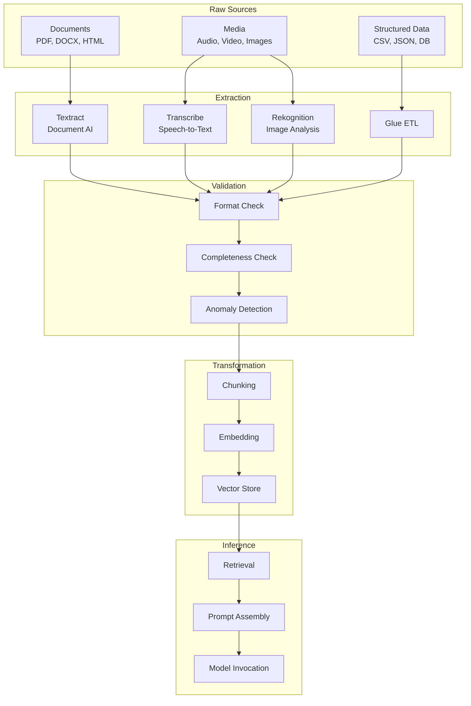
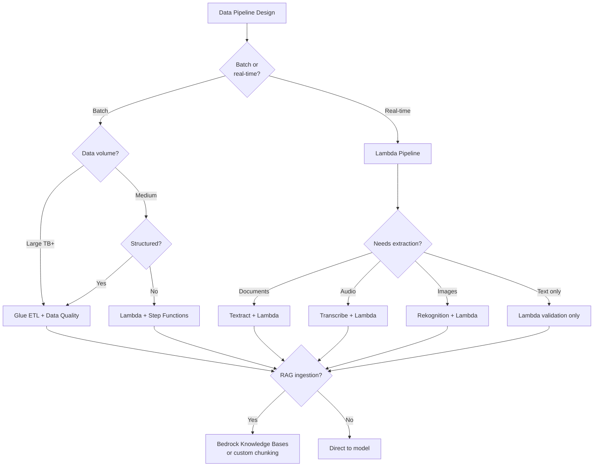

# Data Pipelines for GenAI

**Domain 1 | Task 1.3 | ~30 minutes**

---

## Why This Matters

There's an old saying in computing: garbage in, garbage out. For AI systems, this principle applies with double force. Foundation models are remarkably capable, but they're also remarkably trusting—they'll process whatever you send them and produce output that looks confident, even when the input was nonsensical or corrupted. The model won't raise its hand and say "this input seems wrong." It will simply produce garbage output with the same fluency it produces useful responses.

This creates a fundamental challenge for production AI systems. The quality of your outputs depends entirely on the quality of your inputs, and ensuring input quality requires deliberate work. That work happens in your data pipeline—everything that touches data between its raw source and the moment it reaches the model.

The scope is broad. Data pipelines for GenAI encompass validation (is this data correct?), transformation (converting between formats), extraction (pulling text from documents, audio, images), enhancement (adding context, expanding queries), and formatting (structuring requests for specific APIs). Each step has services optimized for it, and choosing the right service for each task determines whether your pipeline is robust and cost-effective or fragile and expensive.

This topic matters practically because it's where many AI projects fail. Teams focus on prompt engineering and model selection, assuming data quality will take care of itself. It doesn't. The team that masters data pipelines builds AI systems that work reliably. The team that ignores pipelines builds demos that break in production.

---

## Under the Hood: How Data Flows in GenAI Systems

Understanding the data flow helps you identify where problems originate and where to apply controls.

### The GenAI Data Pipeline

Data passes through multiple transformation stages before reaching the model:



### Where Quality Problems Originate

| Stage | Common Problems | Impact on Output |
|-------|-----------------|------------------|
| **Raw sources** | Corruption, encoding issues, format errors | Pipeline fails or processes garbage |
| **Extraction** | OCR errors, transcription mistakes | Wrong text in prompts |
| **Validation** | Missing fields, out-of-range values | Incomplete or misleading context |
| **Chunking** | Split mid-sentence, lost context | Poor retrieval matches |
| **Embedding** | Wrong model, dimension mismatch | Retrieval fails entirely |
| **Retrieval** | Wrong documents, poor ranking | Hallucination, wrong answers |

### Why Early Validation Saves Money

Catching problems early is cheaper:

| Stage | Cost to Process | Cost to Fix |
|-------|-----------------|-------------|
| Validation (pre-processing) | ~$0 | Reject immediately |
| Embedding | ~$0.0001/chunk | Re-embed after fix |
| Vector store | ~$0.0001/chunk | Delete and re-index |
| Model invocation | ~$0.01+/call | User sees bad output, investigate |

**Key insight:** Model invocations are 100-1000x more expensive than validation. Every garbage input you catch early saves expensive inference and user frustration.

---

## Decision Framework: Choosing Pipeline Components

Use this framework to select the right AWS services for each pipeline stage.

### Quick Reference

| Data Type | Extraction Service | Validation | Processing |
|-----------|-------------------|------------|------------|
| PDFs, scanned docs | **Textract** | Lambda format checks | Glue ETL or Lambda |
| Audio/video | **Transcribe** | Confidence thresholds | Lambda |
| Images | **Rekognition** | Moderation confidence | Lambda |
| Structured data | Direct ingest | **Glue Data Quality** | Glue ETL |
| Web content | Lambda scraping | Format validation | Lambda |
| Real-time user input | N/A | **Lambda validation** | Lambda |

### Decision Tree



### Service Selection by Use Case

| Use Case | Services | Why |
|----------|----------|-----|
| **Knowledge base ingestion** | Textract → Glue → Bedrock KB | Structured extraction, quality rules, managed RAG |
| **Document Q&A** | Textract → Lambda → Bedrock | Real-time extraction and querying |
| **Call center analysis** | Transcribe → Comprehend → Bedrock | Speech transcription, entity extraction, summarization |
| **Content moderation** | Rekognition → Lambda → Bedrock | Image analysis, policy check, generate explanation |
| **Form processing** | Textract AnalyzeDocument → Lambda | Structured form extraction |
| **Data quality pipeline** | Glue Data Quality → SNS alerts | Batch validation with notifications |

### Trade-off Analysis

| Approach | Throughput | Latency | Cost | Complexity |
|----------|-----------|---------|------|------------|
| Lambda only | Medium | Low | Pay per invocation | Low |
| Glue ETL | High | High (batch) | Pay per DPU-hour | Medium |
| Step Functions + Lambda | Medium | Medium | Pay per state transition | Medium-High |
| Bedrock KB managed | Medium | Low (after ingestion) | Per query + storage | Lowest |
| Custom pipeline | Flexible | Flexible | Depends on design | Highest |

---

## Data Quality: The Foundation of Everything

Foundation models exhibit a dangerous property: they produce fluent output regardless of input quality. Give a model corrupted text, and it will generate a confident-sounding response based on whatever patterns it can extract from the noise. Give it incomplete data, and it will fill gaps with plausible-sounding fabrications. Give it contradictory information, and it will often produce a response that sounds reasonable while being completely wrong.

This behavior makes quality validation essential. You cannot rely on the model to flag problems—you must catch them before data ever reaches the model.

### Format Validation: The First Line of Defense

Format validation catches the obvious problems that shouldn't reach production but inevitably try to. Is that JSON actually parseable, or does it have a missing bracket? Is that text file UTF-8 encoded, or is it some legacy encoding that will produce mojibake? Is that supposed image file actually an image, or is it a corrupted binary blob?

These checks sound trivial, and they are—individually. But production systems receive data from diverse sources, each with its own quirks. Customer uploads might be corrupted. API responses might be malformed. Files transferred between systems might lose encoding information. Without explicit validation, these problems slip through and cause mysterious failures downstream.

Format validation should be immediate and unforgiving. The moment bad data arrives, reject it with a clear error message. Don't let it proceed through expensive processing steps only to fail cryptically later.

### Completeness Checking: Ensuring Nothing's Missing

Your prompt template expects certain fields—a customer name, an order history, a product description. If any field is missing, the resulting prompt is incomplete. The model will still generate output, but that output will be generic at best and fabricated at worst. A response that should reference "your recent order of the Blue Widget" becomes "your order" or invents order details that don't exist.

Completeness checking verifies that all expected data elements exist before building prompts. This is particularly important in RAG systems, where retrieved context might be empty or partial. If retrieval returns nothing, what happens? If it returns documents without the expected metadata, how does your prompt handle it?

Define what "complete" means for each pipeline stage and verify it explicitly. Don't assume data will be complete because it usually is—verify because sometimes it isn't.

### Anomaly Detection: Catching the Weird Stuff

Some data passes format and completeness checks but is still obviously wrong. A product price of negative fifty dollars. A customer age of 250 years. An email address that's a thousand characters long. A date in year 2099 for a historical event.

These anomalies suggest data corruption, integration bugs, or adversarial input. They should trigger alerts and prevent processing. Domain-specific rules catch these issues—rules that encode your business knowledge about what valid data looks like.

Anomaly detection is inherently domain-specific. Generic validation can't know that your product prices should never exceed $10,000 or that customer IDs should match a particular pattern. You must encode this knowledge in your validation rules.

### AWS Glue Data Quality: Declarative Batch Validation

**AWS Glue Data Quality** provides a declarative approach to validation in batch pipelines. You define rules using DQDL (Data Quality Definition Language), and Glue evaluates them automatically during ETL jobs.

```python
# Example DQDL rules
rules = """
Rules = [
    ColumnValues "price" between 0 and 10000,
    Completeness "customer_id" > 0.99,
    ColumnValues "email" matches ".*@.*\\..*",
    ColumnValues "order_date" <= now(),
    Uniqueness "order_id" > 0.999
]
"""
```

These rules run automatically as part of your Glue ETL jobs. When data fails quality checks, the pipeline can halt, quarantine bad records, or alert operators—depending on your configuration.

The declarative approach has significant advantages. Rules are readable and auditable. Adding new rules doesn't require code changes. Quality thresholds can be adjusted without redeploying pipelines. And Glue tracks quality metrics over time, showing trends that might indicate upstream data problems.

For batch processing of large datasets before AI workloads, Glue Data Quality provides the validation layer that prevents garbage from reaching expensive model invocations.

### SageMaker Data Wrangler: Visual Exploration and Preparation

Before you can write good validation rules, you need to understand your data. What distributions do values follow? What outliers exist? What patterns suggest problems?

**SageMaker Data Wrangler** provides visual exploration tools for this discovery phase. Import data from various sources, explore distributions, spot anomalies, and build transformation recipes—all through a visual interface rather than code.

Data Wrangler excels at building intuition. You might discover that 3% of your product descriptions are empty, or that customer IDs follow three different formats depending on when they were created, or that a particular data source has systematic encoding issues. These discoveries inform your validation rules and transformation logic.

Once you've built transformation recipes in Data Wrangler, you can export them as code for production pipelines. The visual exploration becomes the specification for production logic.

### Lambda: Real-Time Custom Validation

Batch validation handles scheduled processing, but many AI workloads process data in real-time. A user uploads a document, asks a question, or submits a form—and the AI needs to respond immediately. Validation must happen inline, as part of request processing.

**Lambda functions** handle real-time custom validation. They execute your business logic the moment data arrives, rejecting bad input before it proceeds further.

```python
def validate_request(event):
    body = json.loads(event['body'])

    # Format validation
    if 'question' not in body or not isinstance(body['question'], str):
        return {'statusCode': 400, 'body': 'question field required'}

    # Length validation
    if len(body['question']) > 10000:
        return {'statusCode': 400, 'body': 'question exceeds maximum length'}

    # Business rule validation
    if contains_pii(body['question']):
        return {'statusCode': 400, 'body': 'PII not allowed in questions'}

    # Passed validation - proceed with processing
    return process_valid_request(body)
```

Lambda validation should fail fast and return clear error messages. Users can't fix problems they don't understand. "Invalid input" is useless; "question exceeds 10,000 character limit" is actionable.

---

## Multimodal Data Processing

Modern AI doesn't just read text—it processes images, extracts content from documents, transcribes audio, and analyzes video. Each modality requires specific preparation before AI processing can begin.

### Images: Preparation for Multimodal Models

Multimodal models like Claude 3 and Titan Vision accept images directly alongside text. But images need preparation to work reliably.

**Resolution matters.** Large images consume more tokens and processing time. Models have maximum resolution limits—exceeding them causes failures. Scale images down to reasonable dimensions before submission. A 20-megapixel photograph doesn't need that resolution for most AI tasks; 1024×1024 pixels often suffices.

**Format compatibility varies.** Most APIs accept JPEG, PNG, GIF, and WebP. Other formats may need conversion. PDF pages aren't images—they need rendering or extraction first.

**Encoding for transmission.** API calls typically require base64-encoded image data. The encoding inflates file size by roughly 33%, which affects payload limits and transmission time.

```python
import base64

def prepare_image_for_bedrock(image_path):
    with open(image_path, 'rb') as f:
        image_bytes = f.read()

    # Check file size after encoding
    encoded = base64.b64encode(image_bytes).decode('utf-8')
    if len(encoded) > 20_000_000:  # Example limit
        raise ValueError('Image too large after encoding')

    # Determine media type
    media_type = 'image/jpeg' if image_path.endswith('.jpg') else 'image/png'

    return {
        'type': 'image',
        'source': {
            'type': 'base64',
            'media_type': media_type,
            'data': encoded
        }
    }
```

**Error handling is essential.** Images can be corrupted, truncated, or in unexpected formats. Validation should verify that image data is actually valid before attempting AI processing. A corrupted image that passes to the API produces unhelpful error messages.

### Document Processing with Amazon Textract

Documents—PDFs, scanned pages, Word files—contain valuable text, but that text is trapped in formats AI can't directly consume. **Amazon Textract** extracts text while preserving structure that simple OCR loses.

The key insight is that documents aren't just text—they have structure. Tables have rows and columns. Forms have labels and values. Pages have headings, paragraphs, and lists. Textract understands this structure and exposes it through specialized APIs.

**DetectDocumentText** provides basic OCR—converting images of text into actual text. It returns lines and words with their positions. This works for simple documents where you just need the text content.

**AnalyzeDocument** goes deeper, understanding document structure through configurable **FeatureTypes**:

**TABLES** extracts tabular data with row/column relationships preserved. A financial statement, specification sheet, or any document with grid layouts produces structured table data rather than a confusing sequence of cells.

```python
response = textract.analyze_document(
    Document={'S3Object': {'Bucket': 'my-bucket', 'Name': 'financial-report.pdf'}},
    FeatureTypes=['TABLES']
)

# Response includes TABLE blocks with CELL children
# Each CELL knows its row/column position
for block in response['Blocks']:
    if block['BlockType'] == 'CELL':
        row = block['RowIndex']
        col = block['ColumnIndex']
        # Cell text available through relationships
```

**FORMS** extracts key-value pairs from form-like documents. "Customer Name: John Smith" becomes structured data with `{key: "Customer Name", value: "John Smith"}`. Applications, questionnaires, and structured documents yield clean, queryable data.

**SIGNATURES** detects the presence and location of signatures. For contract processing, you might verify that required signatures are present before proceeding. The response includes bounding boxes showing exactly where signatures appear.

**QUERIES** lets you ask specific questions about the document. Instead of extracting everything and searching afterward, you ask "What is the invoice total?" and receive a direct answer. This reduces post-processing and improves accuracy for targeted extraction.

**LAYOUT** analyzes document structure—titles, headers, paragraphs, lists, page numbers. This is critical for RAG applications where chunking must respect semantic structure. A heading shouldn't be separated from its content; a paragraph shouldn't be split mid-sentence.

```python
response = textract.analyze_document(
    Document={'S3Object': {'Bucket': 'bucket', 'Name': 'manual.pdf'}},
    FeatureTypes=['TABLES', 'FORMS', 'LAYOUT']
)
```

You can combine multiple FeatureTypes in a single call, extracting tables, forms, and layout structure simultaneously.

### Synchronous vs. Asynchronous Textract APIs

Textract provides two API patterns with different use cases.

**Synchronous APIs** (`DetectDocumentText`, `AnalyzeDocument`) process single-page documents and return immediately. They're limited to **10 MB** file size. Use them for real-time processing of individual pages—a user uploads a form, you extract data, you respond immediately.

**Asynchronous APIs** (`StartDocumentTextDetection`, `StartDocumentAnalysis`) handle multi-page PDFs up to **3,000 pages** and **500 MB**. Processing happens in the background; you poll for results or receive SNS notifications when complete.

The async workflow follows a consistent pattern:

```python
# Start the job
start_response = textract.start_document_analysis(
    DocumentLocation={
        'S3Object': {'Bucket': 'my-bucket', 'Name': 'large-report.pdf'}
    },
    FeatureTypes=['TABLES', 'FORMS'],
    NotificationChannel={
        'SNSTopicArn': 'arn:aws:sns:...:textract-notifications',
        'RoleArn': 'arn:aws:iam::...:role/TextractNotificationRole'
    }
)
job_id = start_response['JobId']

# Later, retrieve results (or receive via SNS)
results = textract.get_document_analysis(JobId=job_id)

# Handle pagination for large documents
while 'NextToken' in results:
    more_results = textract.get_document_analysis(
        JobId=job_id,
        NextToken=results['NextToken']
    )
    # Process more_results
    results = more_results
```

For exam purposes: if you see "500-page PDF" or "multi-page document" in a question, the answer involves async APIs with `Start*` operations and job polling. Synchronous APIs simply cannot handle large multi-page documents.

### Specialized Extraction APIs

Beyond general document analysis, Textract provides specialized APIs optimized for specific document types:

**AnalyzeExpense** is optimized for receipts and invoices. It understands expense-specific fields—vendor names, line items, totals, taxes—and extracts them with higher accuracy than generic analysis.

**AnalyzeID** handles identity documents—driver's licenses, passports, ID cards. It extracts standard fields (name, address, date of birth, ID number) with awareness of document layouts specific to identity documents.

These specialized APIs typically outperform generic analysis for their target document types because they incorporate domain-specific knowledge about expected layouts and fields.

### Audio Processing with Amazon Transcribe

Audio content—recorded calls, meetings, podcasts, voice inputs—must become text before most AI processing can use it. **Amazon Transcribe** handles this conversion with features beyond basic speech-to-text.

**Speaker diarization** identifies different speakers in a recording. A customer service call becomes a transcript showing who said what—critical for analyzing conversations rather than just extracting words.

**Custom vocabularies** improve accuracy for domain-specific terminology. Medical terms, product names, technical jargon, company-specific acronyms—standard models might misrecognize these. Custom vocabularies teach Transcribe your terminology.

```python
transcribe.create_vocabulary(
    VocabularyName='company-terms',
    LanguageCode='en-US',
    Phrases=[
        'AWS Bedrock',
        'GPT-4',
        'LangChain',
        'RAG pipeline'
    ]
)
```

**Real-time streaming** enables live transcription. As audio arrives, text streams back. This supports live captioning, real-time analysis, and voice-driven interfaces.

**Batch processing** handles recorded audio at scale. Submit audio files to S3, configure transcription jobs, and receive transcripts when complete. This integrates with data pipelines that process audio archives.

### Video: The Combination Challenge

Video presents unique challenges because it combines visual and audio tracks. A complete analysis might:

1. Extract key frames for visual analysis
2. Transcribe the audio track
3. Correlate visual and spoken content
4. Synthesize insights from both modalities

Different frames contain different information—a presentation video cycles through slides; an instructional video shows different steps. Intelligent frame extraction selects informative frames rather than sampling blindly.

Amazon Rekognition handles video analysis—detecting objects, faces, activities, and text within video frames. Combined with Transcribe for audio, you can build comprehensive video analysis pipelines.

### Handling Failures Gracefully

Multimodal processing encounters failures that pure text processing doesn't. Images can be corrupted. Audio can be garbled. PDFs can be password-protected. Scanned documents can be too low-quality for OCR.

Production pipelines must handle these failures gracefully:

- **Log failures with context** — Capture enough information to diagnose problems
- **Skip bad inputs, continue processing** — One bad file shouldn't halt a thousand-file batch
- **Return meaningful errors** — Users uploading corrupted files need clear feedback
- **Quarantine problematic files** — Route failures to a separate queue for manual review

```python
def process_document(document_path):
    try:
        result = extract_and_analyze(document_path)
        return {'status': 'success', 'data': result}
    except textract.exceptions.InvalidS3ObjectException:
        log_error(document_path, 'Document not found')
        return {'status': 'error', 'reason': 'Document not accessible'}
    except textract.exceptions.UnsupportedDocumentException:
        log_error(document_path, 'Unsupported format')
        return {'status': 'error', 'reason': 'Document format not supported'}
    except Exception as e:
        log_error(document_path, f'Unexpected: {e}')
        return {'status': 'error', 'reason': 'Processing failed'}
```

---

## API-Ready Data Formatting

Foundation model APIs are precise about input format. A missing bracket, wrong field name, or improper nesting causes request failures—sometimes with cryptic error messages that take significant debugging to understand.

### Understanding Bedrock's Messages API

Bedrock's Messages API expects a specific JSON structure:

```json
{
  "anthropic_version": "bedrock-2023-05-31",
  "max_tokens": 1024,
  "messages": [
    {
      "role": "user",
      "content": [
        {"type": "text", "text": "What is the capital of France?"}
      ]
    }
  ]
}
```

Each element must be correct. The `messages` array contains message objects. Each message has a `role` (user or assistant) and `content`. Content is an array of content blocks, each with a `type`. Text content has `type: "text"` and a `text` field. Image content has `type: "image"` with a `source` object.

Multimodal messages combine content types:

```json
{
  "role": "user",
  "content": [
    {"type": "text", "text": "What's in this image?"},
    {
      "type": "image",
      "source": {
        "type": "base64",
        "media_type": "image/jpeg",
        "data": "base64-encoded-image-data..."
      }
    }
  ]
}
```

Building these structures manually is error-prone. Use proper serialization libraries and helper functions rather than string concatenation.

### Token Limits: The Silent Constraint

Every model has a maximum context window—the total tokens it can process in a single request. Claude 3 models offer 200,000 tokens. Other models have different limits. Exceeding the limit causes request failures.

Token counting isn't straightforward. Tokens aren't words—they're subword units that vary by model and text content. The same text might be 100 tokens in one model and 120 in another. Libraries like `tiktoken` provide accurate counting for specific models.

```python
def check_token_limit(messages, max_tokens=100000):
    # Estimate tokens (actual counting varies by model)
    total_chars = sum(
        len(m['content'][0]['text'])
        for m in messages
        if m['content'][0]['type'] == 'text'
    )
    estimated_tokens = total_chars / 4  # Rough estimate

    if estimated_tokens > max_tokens:
        raise ValueError(f'Input exceeds token limit: ~{estimated_tokens}')
```

When inputs exceed limits, you have options:

**Truncation** is simplest—cut content to fit. But it loses data and might cut mid-thought, producing incoherent context.

**Summarization** compresses content while preserving meaning. Use a smaller, faster model to summarize documents before sending to the main model. This adds processing time and cost but preserves information.

**Chunking and aggregation** processes content in pieces. Break a long document into chunks, process each separately, then synthesize results. This works for analysis tasks where each chunk can be processed independently.

### Special Characters and Encoding

JSON has strict rules about special characters. Newlines must be `\n`. Quotes must be escaped as `\"`. Backslashes become `\\`. Control characters need Unicode escapes.

If you're building JSON by concatenating strings, you'll eventually encounter content that breaks your JSON. A user question containing a quote character. A document with tabs and newlines. Code with backslashes.

**Use proper serialization libraries.** Python's `json.dumps()` handles escaping automatically. JavaScript's `JSON.stringify()` does too. Don't reinvent this wheel.

```python
# Wrong - will break on special characters
payload = f'{{"messages": [{{"role": "user", "content": "{user_input}"}}]}}'

# Right - handles escaping automatically
payload = json.dumps({
    "messages": [{"role": "user", "content": [{"type": "text", "text": user_input}]}]
})
```

### Building a Formatting Layer

Every codebase that interacts with AI APIs needs formatting logic. The question is whether that logic is scattered across ten files or centralized in one place.

A **formatting layer** centralizes API interaction logic:

```python
class BedrockFormatter:
    def __init__(self, model_id):
        self.model_id = model_id

    def format_text_request(self, user_message, system_prompt=None, max_tokens=1024):
        messages = [{'role': 'user', 'content': [{'type': 'text', 'text': user_message}]}]

        body = {
            'anthropic_version': 'bedrock-2023-05-31',
            'max_tokens': max_tokens,
            'messages': messages
        }

        if system_prompt:
            body['system'] = system_prompt

        return json.dumps(body)

    def format_multimodal_request(self, text, image_data, media_type='image/jpeg'):
        # Centralized multimodal formatting
        pass

    def parse_response(self, response_body):
        # Centralized response parsing
        pass
```

When APIs change—and they will—you fix one place rather than hunting through the codebase. When you add new formatting options, all callers can use them immediately. When debugging format issues, you know exactly where to look.

---

## Input Enhancement Techniques

Raw user input is often insufficient for optimal AI responses. Users write tersely, use abbreviations, omit context that seems obvious to them, or ask questions that require background knowledge they haven't provided. Enhancement techniques improve AI responses by enriching input before it reaches the model.

### Entity Extraction with Amazon Comprehend

**Amazon Comprehend** provides NLP capabilities that identify entities, sentiment, key phrases, and more—faster and cheaper than using foundation models for these standard tasks.

Entity extraction identifies names, dates, locations, organizations, and other structured elements in text. A customer message mentioning "John Smith from Acme Corp called about the March invoice" yields entities: person (John Smith), organization (Acme Corp), date (March).

This information enables:

**Intelligent routing** — Messages about billing go to billing support; technical issues go to technical support. Extract entities, classify intent, and route accordingly.

**Contextual enrichment** — The extracted organization name can trigger a database lookup for customer history, which gets injected into the prompt for the AI.

**Response filtering** — If sentiment analysis detects anger, perhaps escalate to a human. If entities include competitor names, perhaps apply additional review.

```python
comprehend = boto3.client('comprehend')

response = comprehend.detect_entities(
    Text="I'd like to discuss my order #12345 with John Smith at Acme Corp",
    LanguageCode='en'
)

for entity in response['Entities']:
    print(f"{entity['Type']}: {entity['Text']} (confidence: {entity['Score']:.2f})")
# QUANTITY: order #12345
# PERSON: John Smith
# ORGANIZATION: Acme Corp
```

### Custom Entity Recognition: Teaching Comprehend Your Domain

Out-of-the-box Comprehend recognizes standard entity types—PERSON, ORGANIZATION, DATE, LOCATION. But your domain likely has specific entities it doesn't know: product codes, internal project names, medical terms, legal citations.

**Custom Entity Recognition** trains Comprehend to find your entities. The process involves:

**1. Prepare training data.** Create an annotations file mapping text spans to your entity types, or provide entity lists with examples of each type.

Annotations format (more flexible, higher accuracy):
```csv
File,Line,Begin Offset,End Offset,Type
doc1.txt,0,15,25,PRODUCT_CODE
doc1.txt,0,45,60,CUSTOMER_ID
```

Entity list format (simpler, faster to prepare):
```csv
Text,Type
ABC-1234,PRODUCT_CODE
XYZ-5678,PRODUCT_CODE
CUST-001,CUSTOMER_ID
```

**2. Train the model.** Comprehend handles the ML infrastructure—you just provide data and wait.

```python
response = comprehend.create_entity_recognizer(
    RecognizerName='product-entity-recognizer',
    DataAccessRoleArn='arn:aws:iam::123456789012:role/ComprehendRole',
    InputDataConfig={
        'EntityTypes': [
            {'Type': 'PRODUCT_CODE'},
            {'Type': 'CUSTOMER_ID'}
        ],
        'Documents': {'S3Uri': 's3://bucket/training-docs/'},
        'EntityList': {'S3Uri': 's3://bucket/entities.csv'}
    },
    LanguageCode='en'
)
```

Training takes hours—plan accordingly. Once complete, create an endpoint for real-time inference or use batch jobs for async processing.

**3. Use the trained model.** Custom recognizers work like built-in ones but find YOUR entities.

### Custom Classification: Categorizing at Scale

Sometimes you need to categorize documents into your own taxonomy—support ticket types, document categories, content topics. **Custom Classification** trains Comprehend for your categories.

```python
# Training data format (CSV)
# CLASS,TEXT
# billing_issue,"I was charged twice for my subscription"
# technical_problem,"The app crashes when I click settings"
# feature_request,"Please add dark mode"

response = comprehend.create_document_classifier(
    DocumentClassifierName='support-ticket-classifier',
    DataAccessRoleArn='arn:aws:iam::123456789012:role/ComprehendRole',
    InputDataConfig={
        'S3Uri': 's3://bucket/training-data.csv'
    },
    LanguageCode='en',
    Mode='MULTI_CLASS'  # Each document gets exactly one category
)
```

**MULTI_CLASS** assigns exactly one category per document. **MULTI_LABEL** allows multiple categories—a ticket might be both "billing" AND "cancellation."

### When to Use Custom Comprehend vs. Foundation Models

Both Comprehend custom models and foundation models can classify and extract entities. The choice depends on your use case:

| Factor | Comprehend Custom | Foundation Model |
|--------|-------------------|------------------|
| Per-request cost | Lower at volume | Higher |
| Inference latency | Faster (~100ms) | Slower (~1-3s) |
| Flexibility | Fixed after training | Adjustable via prompts |
| Setup time | Hours of training | Immediate |
| Category changes | Requires retraining | Update the prompt |

For **stable, high-volume tasks** where categories and entities don't change frequently, train Comprehend models. The lower per-request cost compounds at scale.

For **evolving needs** where categories change frequently or you're still iterating, foundation models offer flexibility. Update the prompt rather than retraining.

### Text Normalization

Raw text often benefits from cleanup before AI processing:

- **Expand abbreviations**: "u" → "you", "msg" → "message"
- **Fix obvious typos**: Common misspellings that don't affect meaning
- **Standardize formats**: Dates, phone numbers, currency amounts
- **Remove noise**: Excessive punctuation, emoji overuse, repeated characters

Models handle imperfect input reasonably well, but cleaner input often produces cleaner output. A carefully normalized prompt eliminates ambiguity that the model might resolve incorrectly.

### Context Enrichment: The Power Move

The most impactful enhancement technique is **context injection**—adding relevant background information that enables specific, personalized responses.

**Before enhancement:**
```
User: "What's my order status?"
```

The model can only generate a generic response about how to check order status.

**After context injection:**
```
User context:
- Customer: John Smith (ID: 12345)
- Recent order: #98765 (Blue Widget, qty 2)
- Order status: Shipped yesterday
- Tracking: 1Z999AA1012345678
- Estimated delivery: Friday

User question: "What's my order status?"
```

Now the model can respond specifically: "Your order #98765 for 2 Blue Widgets shipped yesterday and should arrive Friday. Here's your tracking number: 1Z999AA1012345678."

Context injection typically involves:
1. Extracting identifiers from the user message or session
2. Looking up relevant data in your systems
3. Formatting that data for inclusion in the prompt
4. Including it in a way the model can use naturally

The difference in response quality is dramatic. Generic responses become specific ones. Unhelpful responses become actionable ones.

### Query Expansion for RAG

In RAG systems, users' queries often use different terminology than your documents. A question about "compute options" might need to match documents about "EC2," "Lambda," and "Fargate." Query expansion bridges this vocabulary gap.

Techniques include:
- **Synonym expansion**: Add known synonyms to the query
- **Abbreviation expansion**: "ML" → "machine learning"
- **Hierarchical expansion**: "EC2" → "EC2 compute virtual machine server"
- **LLM-based expansion**: Ask a model to rephrase the query in multiple ways

```python
def expand_query(original_query):
    # Use a fast, cheap model to generate query variants
    expansion_prompt = f"""
    Generate 3 alternative phrasings of this question for search purposes:
    "{original_query}"

    Return only the alternative phrasings, one per line.
    """

    variants = invoke_model(expansion_prompt)
    return [original_query] + variants.split('\n')
```

Multiple query variants cast a wider net during retrieval, finding relevant documents that might have been missed by the original phrasing alone.

---

## Exam Tips

| When you see... | Think... |
|-----------------|----------|
| "data quality rules" or "batch validation" | **AWS Glue Data Quality** with DQDL rules |
| "real-time custom validation" | **Lambda** with custom validation logic |
| "visual data exploration" | **SageMaker Data Wrangler** |
| "forms or tables in documents" | **Textract AnalyzeDocument** with FORMS or TABLES FeatureTypes |
| "multi-page PDF" or "large documents" | Textract **async APIs** (StartDocumentAnalysis) |
| "document structure" or "headings" | Textract **LAYOUT** FeatureType |
| "signature detection" | Textract **SIGNATURES** FeatureType |
| "receipts or invoices" | **Textract AnalyzeExpense** |
| "identity documents" | **Textract AnalyzeID** |
| "speaker identification in audio" | **Transcribe** with diarization |
| "domain-specific audio terms" | Transcribe **custom vocabularies** |
| "entity or sentiment extraction" | **Amazon Comprehend** |
| "domain-specific entities" | Comprehend **Custom Entity Recognition** |
| "document categorization at scale" | Comprehend **Custom Classification** |
| "high-volume classification, low cost" | Comprehend (not foundation models) |

---

## Key Takeaways

> **1. Validate before sending to AI.**
> Foundation models don't flag bad input—they produce garbage output that looks confident. Catch errors in your pipeline, before expensive model invocations.

> **2. Choose the right validation approach.**
> Glue Data Quality for batch pipelines with declarative rules. Lambda for real-time custom logic. Data Wrangler for visual exploration before writing rules.

> **3. Use Comprehend for standard NLP tasks.**
> Entity extraction, sentiment analysis, and classification are faster and cheaper with Comprehend than foundation models for these common tasks.

> **4. Understand Textract's FeatureTypes.**
> TABLES for tabular data, FORMS for key-value pairs, LAYOUT for document structure, SIGNATURES for signature detection, QUERIES for targeted extraction. Async APIs for multi-page documents.

> **5. Enhance inputs for better outputs.**
> Context injection transforms generic responses into specific ones. Query expansion improves RAG retrieval. Entity extraction enables intelligent routing.

> **6. Build a formatting layer.**
> Centralize API formatting logic instead of scattering it throughout your codebase. When APIs change, fix one place.

---

## Common Mistakes

| Mistake | Why It Matters |
|---------|----------------|
| **Skipping validation entirely** | AI produces confident garbage from bad input. You won't discover problems until users complain about nonsensical responses. |
| **Using foundation models for standard NLP** | Entity extraction and sentiment analysis via Comprehend are 10-100x cheaper than FM calls. Reserve FMs for complex reasoning. |
| **Using sync Textract for multi-page PDFs** | Synchronous APIs only handle single pages. Multi-page documents require async APIs with job polling. |
| **Forgetting token limits** | Requests fail or truncate unexpectedly. Count tokens before sending and handle oversized inputs explicitly. |
| **Building JSON with string concatenation** | Special characters break your JSON. Use proper serialization libraries that handle escaping automatically. |
| **Scattered formatting logic** | Duplicate formatting code diverges over time and creates inconsistent bugs. Centralize in a formatting layer. |
| **No context injection** | Users get generic responses when specific ones are possible. Look up relevant data and include it in prompts. |
