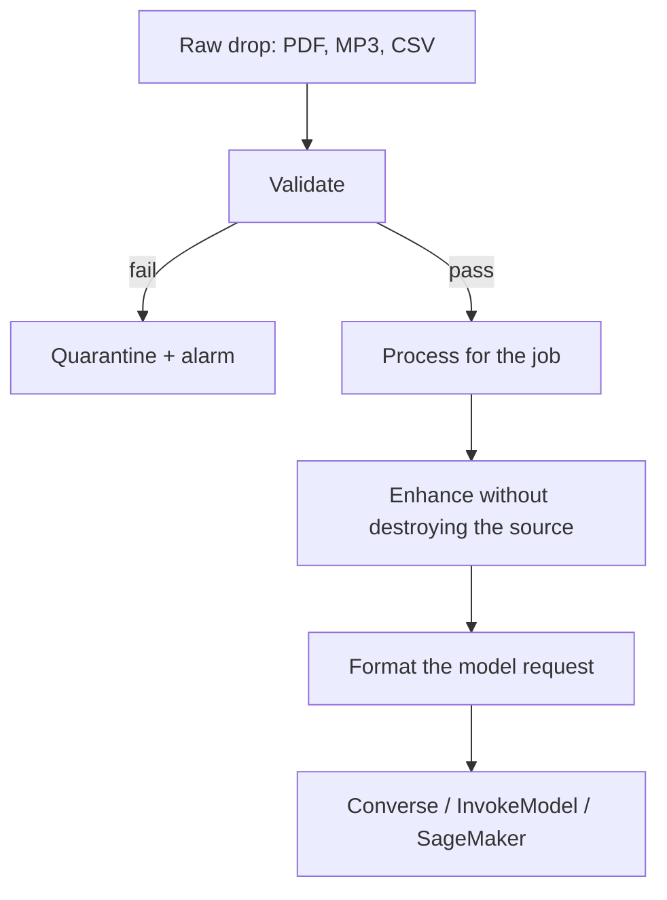
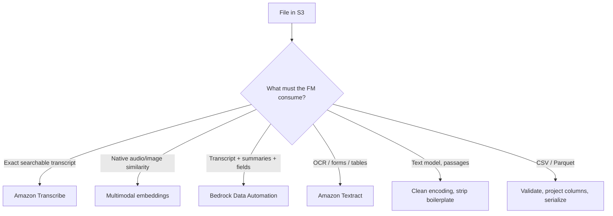

# Implement Data Validation and Processing Pipelines for FM Consumption

**Domain 1 · Task 1.3 · Skills 1.3.1–1.3.4**

A foundation model never sees a filing cabinet. It sees **bytes in a request**: a transcript string, a PNG the multimodal API accepts, a JSON body with `user` / `assistant` roles. Task 1.3 is the work that turns a drop in S3 into that request — and refuses to spend tokens when the drop is empty, corrupt, or the wrong shape.

The running example is an earnings desk. IR puts `NVDA-FY26-Q1.mp3` and a 10-K PDF in a bucket. Before anyone asks “what did Jensen say about Blackwell,” four things have to happen, in this order:

1. **Validate.** Is there actually audio? Is the ticker present? Is revenue a number? Failures go to a quarantine bucket and an alarm — they do not become a fluent, wrong answer.
2. **Process.** The same MP3 is not one pipeline. Searchable speech is Transcribe. Native audio similarity is a multimodal embedder. Structured “company / revenue / summary” from 50,000 PDFs is Bedrock Data Automation. OCR of a form is Textract. You pick from the **job**, not the file extension.
3. **Enhance.** Cheap, determinate cleanup: `NVIDIA Corporation` → `NVDA` in Lambda; PERSON/ORG tags or PII redaction in Comprehend; a messy note rewritten by Bedrock only when code cannot parse it. Keep the raw file. Derived copies live beside it.
4. **Format.** Glue saying the row is valid is not a Converse body. Anthropic JSON is not Titan JSON. Turn 2 of a chat must resend turn 1. This stage wraps the **API contract** the chosen model already expects.


```mermaid
flowchart TD
    R[Raw drop: PDF, MP3, CSV] --> V[Validate]
    V -->|fail| Q[Quarantine + alarm]
    V -->|pass| P[Process for the job]
    P --> E[Enhance without destroying the source]
    E --> F[Format the model request]
    F --> M[Converse / InvokeModel / SageMaker]
```

Read the article as those four ideas. Each skill below is one stage, with the AWS kitchen that actually runs it.

> **Exam tip:** Garbage in still comes out fluent. A null transcript that reaches Sonnet is not a model failure. It is a pipeline you skipped.

---

## Skill 1.3.1 — Validate before you spend tokens

**Validation** is the gate that decides whether a record is allowed to become a model input. A single Glue rule is one check. A **validation workflow** is inspect → pass or quarantine → alert. Empty transcripts should never burn tokens, and they should never be ingested “so retrieval has something.”

```text
Inspect   schema, completeness, type, range, uniqueness, freshness, MIME, referential integrity
Pass      continue to processing
Fail      quarantine the record; CloudWatch metric / alarm; SNS or an operator — not a quiet skip
```

For the blotter: `ticker`, `period`, and `revenue` exist; `revenue` is numeric; transcript text is not null; fiscal quarter is 1–4; one transcript per ticker / quarter / version; the Q1 file did not arrive six months late; encoding is supported; the CIK maps to the expected issuer.

Dataset-valid is not enough. Also ask: **can this FM consume this input?** Modality, content type, request shape, token / context size, file limits, conversation roles, required fields.

> Dataset valid → model-request valid → invoke. That is 1.3.1 meeting 1.3.3. A 400 that looks like a model failure is often a body you never mapped.

### Four kitchens — who runs the transform

Fine-tuning JSONL is one use of these tools, not the definition of any of them.

| Kitchen | When |
|---------|------|
| **Lambda** | Tiny, event-shaped map. `NVIDIA Corporation` → `NVDA` when a file lands. Fifteen minutes, S3 event. Not a lake job. |
| **Glue** | Production ETL around a lake. Millions of filing records, Catalog, scheduled jobs, **Data Quality**. |
| **SageMaker Data Wrangler** | Interactive / little-code. Analysts inspect a messy extract; recipes can later feed production. Not the 200 ms S3-event map. |
| **SageMaker Processing** | Your script at ML scale. Custom Python / Spark / container. 500 GB fine-tune corpus or a post-job eval set. |

```quickcheck
Q: IR uploads one transcript. You must map issuer name to ticker before anything else. Which kitchen?
A: AWS Glue Data Quality on the whole lake
B: Lambda on the S3 event
C: SageMaker Processing on a 500 GB cluster
D: Bedrock Converse
correct: B
feedback: Event-shaped deterministic map is Lambda. Glue is lake ETL. Processing is large custom compute. Converse is inference, not validation.
```

### AWS Glue Data Quality

**Glue Data Quality** runs checks on the Data Catalog and in ETL. It identifies failing records and publishes **passed / failed** metrics to **CloudWatch**. An alarm on a DQ score below threshold stops the Step Functions ingest.

**DQDL** (Data Quality Definition Language) is the rules language. A ruleset is a list of checks; Glue returns a **data quality score**.

```text
Rules = [
    ColumnExists "ticker",
    Completeness "revenue" > 0.99,
    Uniqueness "document_id" > 0.999,
    ColumnValues "fiscal_quarter" in [1, 2, 3, 4]
]
```

```recall
Q: What language does Glue Data Quality use, and what happens on failure?
A: DQDL. Quarantine failing records and alarm on CloudWatch — do not silently ingest into a Knowledge Base.
```

### Lambda for real-time custom checks

A user drops a PDF *now*. Validation must run inline: parseable, UTF-8, page count, MIME, required metadata. Reject with a clear error before Textract or Bedrock.

### CloudWatch

Skill 1.3.1 names **CloudWatch metrics**. Count validation failures, DQ score, quarantine volume. An alarm is how operators notice a bad IR drop instead of a week of fluent wrong answers.

```fillin
Format validation should be immediate — reject bad data the moment it arrives, before {{expensive model invocations}}.
```

---

## Skill 1.3.2 — Process from the job, not the file extension

**Processing** is how you convert a file into the *kind of content* the downstream model can use. It is not automatically “make it text.” Knowledge Bases can work with images, audio, and video. **Nova Multimodal Embeddings** can embed multimedia in native form. **Bedrock Data Automation** can instead turn that media into text or structured JSON.

The same MP3 can become a searchable transcript, a native audio embedding, or a structured BDA blob.


```mermaid
flowchart TD
    F[File in S3] --> J{What must the FM consume?}
    J -->|Exact searchable transcript| T[Amazon Transcribe]
    J -->|Native audio/image similarity| MM[Multimodal embeddings]
    J -->|Transcript + summaries + fields| BDA[Bedrock Data Automation]
    J -->|OCR / forms / tables| TX[Amazon Textract]
    J -->|Text model, passages| TXT[Clean encoding, strip boilerplate]
    J -->|CSV / Parquet| TAB[Validate, project columns, serialize]
```

Embed the MP3 with a **text** embedder and you fail before retrieval starts.

### Text

HTML / TXT / DOC → clean encoding, strip boilerplate, normalize. Default only when the FM is a text model and the job is passages.

### Image / document

OCR, “look at this exhibit,” and “extract 50k 10-Ks into JSON” are three products.

| Stem | Product |
|------|---------|
| OCR / forms / tables | **Amazon Textract** (`FORMS`, `TABLES`, `LAYOUT`, `SIGNATURES`, `QUERIES`) |
| Multi-page PDF | Textract **async** (`StartDocumentAnalysis`) — sync APIs are single-page |
| Receipts / invoices | Textract **AnalyzeExpense** |
| Identity docs | Textract **AnalyzeID** |
| Multimodal FM should *look* at the exhibit | Image → multimodal Converse / Knowledge Base |
| GenAI extraction at document scale | **Bedrock Data Automation** → JSON / Markdown / HTML / CSV |

> Fifty thousand 10-Ks into company / revenue / tables / summary is BDA. A homemade Textract parser is the wrong altitude. Embeddings do not parse a PDF into fields.

### Audio

Exact searchable transcript → **Transcribe** (diarization for speakers; custom vocabularies for `Blackwell` / `H100`). Native multimodal understanding or embedding → Bedrock multimodal / BDA.

```python
import boto3

transcribe = boto3.client("transcribe")
transcribe.start_transcription_job(
    TranscriptionJobName="nvda-fy26-q1-call",
    Media={"MediaFileUri": "s3://desk-raw/nvda-fy26-q1.mp3"},
    MediaFormat="mp3",
    LanguageCode="en-US",
    OutputBucketName="desk-text",
)
```

### Tabular

CSV / Parquet / Glue table → validate schema → normalize units and nulls → select rows / columns → **serialize** into JSON, a markdown table, or prompt rows. Do not paste a 400-column dump into Converse and hope.

```quickcheck
Q: You need structured company / revenue / tables from 50,000 10-K PDFs. What is the right altitude?
A: Loop Textract AnalyzeDocument in Lambda for every file
B: Bedrock Data Automation
C: Paste each PDF into Converse
D: Embed the PDFs with a text embedder and skip extraction
correct: B
feedback: Blueprint-driven multimodal extraction at document scale is BDA. Textract is OCR/forms. Converse is not a 50k-file factory. Text embeddings do not parse fields.
```

---

## Skill 1.3.4 — Enhance with the cheapest determinate tool

**Enhancement** is optional cleanup after the file is a usable modality and before you wrap an API call: normalize tickers, tag entities, redact a phone, or rewrite a messy note. Three kitchens. Use the cheapest one that has a determinate answer. You enhance, then you format — even though the official numbering lists format first.

| Tool | Job |
|------|-----|
| **Lambda** | Deterministic normalization. `NVIDIA Corporation` → `NVDA`. `$26.0 billion` → `amount=26.0, unit=USD_BILLION`. |
| **Amazon Comprehend** | NLP enrichment: entities, language, sentiment, PII. Tag `ticker=NVDA` or redact a phone **before** a Knowledge Base. Custom entity recognition / custom classification when the taxonomy is yours. |
| **Bedrock** | Semantic transformation. A messy analyst note becomes sections or a structured blob when code cannot parse it. You are paying an FM to rewrite, not to look up a ticker. |

Do **not** overwrite the raw source with an LLM-normalized copy. Keep provenance: **RAW → CURATED → DERIVED / AI-ENRICHED**. When the transformation is wrong, you still have the filing.

> Comprehend on the way *in* is not a Guardrail. A Guardrail filters the model call. Enhancement tags or redacts the corpus before retrieval ever starts.

```recall
Q: Entity extraction and sentiment at high volume, low cost — FM or Comprehend?
A: Comprehend. Reserve the FM for tasks that actually need generation. Using Sonnet to label PERSON/ORG is the expensive wrong kitchen.
```

---

## Skill 1.3.3 — Valid data is not a valid model request

**Formatting** is the last mile: cleaned content still has to match the API the model speaks. A Glue table that passed quality checks is not a Converse body. This skill is JSON for Bedrock and structured bytes for a SageMaker endpoint.

**Converse** is the provider-neutral envelope: `system`, `messages` (role + content), `inferenceConfig`. Model-specific knobs still go in `additionalModelRequestFields`. Converse standardizes the **request envelope**. It does not erase model capabilities.

**InvokeModel** is the raw, model-specific JSON. Anthropic’s body is not Titan’s. A small Lambda that maps “filing → request body” is the adapter. Build JSON with a serializer, not string concatenation.

```python
def titan_body(prompt: str) -> bytes:
    import json
    return json.dumps({
        "inputText": prompt,
        "textGenerationConfig": {"maxTokenCount": 400, "temperature": 0.2},
    }).encode()
```

SageMaker endpoints have their own serializer (the container’s `/invocations` contract). Same idea: structured data in, bytes the endpoint expects.

### Conversation formatting

The exam names this on purpose. The model does **not** remember the prior API call. Your app reconstructs the thread.

Turn 1 is “What did NVDA say about Blackwell?” Turn 2 is “Compare that with last quarter.” If the second Converse call sends only the new sentence, “that” has nothing to point at. Session storage is your job (DynamoDB, agent memory) — not Bedrock’s hidden brain.

```text
system     You are an equity research assistant. Sent every call — your choice, not memory.
Turn 1     user: What did NVDA say about Blackwell?  assistant: … (you store both)
Turn 2     Resend prior user + assistant turns, then the new user sentence. Roles intact.
```

> There is no hidden session on the model ID. Drop the history and the model asks which company. Switching to InvokeModel will not remember either.

Count tokens before send. Truncate or split oversized inputs explicitly. Token overflow is a pipeline bug, not an FM personality.

```fillin
Converse standardizes the {{request envelope}}. It does not give the model a hidden session or erase provider constraints.
```

---

## When to use which

| Stem | Pick |
|------|------|
| Batch quality rules on cataloged / ETL data | **Glue Data Quality** (DQDL) + CloudWatch |
| Visual explore before writing rules | **SageMaker Data Wrangler** |
| Real-time custom validation | **Lambda** |
| Large custom preprocess | **SageMaker Processing** |
| Lake ETL | **Glue** |
| Searchable speech | **Transcribe** |
| OCR / forms / tables | **Textract** (async if multi-page) |
| 50k documents → structured GenAI extraction | **Bedrock Data Automation** |
| Native image / audio search | Multimodal FM or embeddings |
| Entities / PII / cheap NLP | **Comprehend** |
| Semantic rewrite | **Bedrock** (keep RAW vs DERIVED) |
| Provider-neutral chat | **Converse** + reconstructed `messages` |
| Model-specific raw body | **InvokeModel** mapping Lambda |
| SageMaker host | That container’s `/invocations` contract |

---

## AWS service glossary

### Data

#### AWS Glue Data Quality

**What it is.** Declarative checks (DQDL) on Data Catalog / ETL datasets, with a quality score.

**Problem it solves.** Catch schema, completeness, and range failures before FM spend.

**Where it sits.** Lake / batch ingest, before Knowledge Base or Converse.

**Typical use.** `Completeness "transcript" > 0.99`; fail the Step Functions ingest.

**Pricing.** Glue DPU / job time (plus Catalog).

**Exam cue.** Batch validation, DQDL, data quality score, CloudWatch on failures.

**Do not confuse with.** Lambda real-time checks. SageMaker Data Wrangler (explore).

#### Amazon SageMaker Data Wrangler

**What it is.** Visual data prep: distributions, outliers, transformation recipes.

**Problem it solves.** Discover what “valid” means before you write production rules.

**Where it sits.** Interactive exploration; recipes can export to pipelines.

**Typical use.** Spot empty product descriptions, mixed customer-ID formats.

**Pricing.** Studio / compute while you prep.

**Exam cue.** Visual exploration, little-code prep — not a 200 ms S3 trigger.

**Do not confuse with.** Glue Data Quality (declarative batch rules). SageMaker Processing (your script at scale).

#### Amazon SageMaker Processing

**What it is.** Managed compute to run *your* preprocessing / eval script.

**Problem it solves.** Large custom Python / Spark jobs without babysitting clusters.

**Where it sits.** Offline prep for fine-tune JSONL or huge extracts.

**Typical use.** 500 GB corpus clean before training.

**Pricing.** Instance hours for the processing job.

**Exam cue.** Custom preprocessing at scale.

**Do not confuse with.** Data Wrangler (UI). Lambda (event glue).

#### Amazon S3

**What it is.** Object store. Source of truth for filings, audio, BDA output.

**Problem it solves.** Durable RAW files the pipeline reads.

**Where it sits.** Start of 1.3; still the source after you enhance.

**Typical use.** `s3://desk-raw/nvda-fy26-q1.mp3`.

**Pricing.** Storage + requests.

**Exam cue.** Do not overwrite RAW with an LLM rewrite.

**Do not confuse with.** The derived vector index (1.4).

### GenAI / AI

#### Amazon Bedrock Data Automation

**What it is.** Managed GenAI document/media understanding into structured output.

**Problem it solves.** Extract fields, tables, summaries from piles of 10-Ks without a homemade OCR farm.

**Where it sits.** 1.3.2 processing path when the job is structured extraction at scale.

**Typical use.** 50,000 PDFs → JSON blueprints.

**Pricing.** Pages / units processed.

**Exam cue.** Document-scale structured extraction. Not Textract OCR.

**Do not confuse with.** Textract (OCR/forms). Knowledge Bases (retrieval).

#### Amazon Bedrock (rewrite / multimodal)

**What it is.** FM API used here to *transform* or *look at* content, not to answer the blotter.

**Problem it solves.** Semantic normalize; native image/audio understanding.

**Where it sits.** Enhancement (1.3.4) or multimodal consume (1.3.2).

**Typical use.** Messy note → sections; exhibit image → Converse.

**Pricing.** Tokens.

**Exam cue.** Semantic rewrite when Lambda cannot parse. Keep provenance.

**Do not confuse with.** The chat writer in 1.2. Guardrails in 3.1.

### Integration / orchestration

#### AWS Lambda

**What it is.** Event function: validate, normalize, map JSON.

**Problem it solves.** S3-shaped work under 15 minutes.

**Where it sits.** Validation, enhancement, request-body adapter.

**Typical use.** Issuer → ticker; Converse envelope builder.

**Pricing.** Requests + GB-seconds.

**Exam cue.** Real-time custom validation; deterministic map; format adapter.

**Do not confuse with.** Glue (lake). Cosine-over-DynamoDB (1.4 trap).

#### Amazon EventBridge / Step Functions

**What it is.** Schedule or state machine around ingest.

**Problem it solves.** Stop the pipeline when DQ score tanks; sequence validate → process → format.

**Where it sits.** Orchestration around 1.3, not the transform itself.

**Typical use.** Glue job → DQ check → quarantine branch.

**Pricing.** Events / state transitions.

**Exam cue.** Alarm-driven halt. Known graph, not an agent.

**Do not confuse with.** The FM.

### Security / operations

#### Amazon CloudWatch

**What it is.** Metrics, logs, alarms on validation and DQ.

**Problem it solves.** Operators see failed records instead of fluent garbage.

**Where it sits.** Named in 1.3.1 beside Glue / Lambda.

**Typical use.** Alarm on `ValidationFailures > 0`.

**Pricing.** Metrics / log ingest.

**Exam cue.** Quality workflow includes **observability**, not only a rule file.

**Do not confuse with.** CloudTrail (who called the API).

#### Amazon Comprehend

**What it is.** Managed NLP: entities, PII, sentiment, custom classifiers.

**Problem it solves.** Cheap determinate enrichment before generation.

**Where it sits.** 1.3.4 enhancement.

**Typical use.** Tag ticker; redact phone; classify note type.

**Pricing.** Units of text.

**Exam cue.** Standard NLP → Comprehend, not Sonnet.

**Do not confuse with.** Guardrails (model I/O filter). Macie (S3 sensitive-data discovery).

#### Amazon Textract

**What it is.** OCR and document structure APIs.

**Problem it solves.** Text, forms, tables, layout from images/PDFs.

**Where it sits.** 1.3.2 document path.

**Typical use.** `TABLES` + `FORMS`; async for multi-page.

**Pricing.** Pages / features.

**Exam cue.** FeatureTypes. Async for multi-page. Not BDA.

**Do not confuse with.** Bedrock Data Automation.

#### Amazon Transcribe

**What it is.** Speech-to-text.

**Problem it solves.** Exact searchable transcript from an earnings call.

**Where it sits.** 1.3.2 audio path when the job is text.

**Typical use.** Diarization + custom vocabulary.

**Pricing.** Audio minutes.

**Exam cue.** Searchable transcript. Not native audio embeddings.

**Do not confuse with.** Multimodal embed of the MP3 itself.

---

## Practice questions

Pick an answer on every stem. The explanation appears after you choose — later questions stay unspoiled until you answer them.

```practice
Q: A Glue table of transcripts has null text on 4% of rows. The team still syncs the Knowledge Base so “retrieval has something.” What should 1.3.1 do?
A: Ingest anyway — the FM will flag bad rows
B: Quarantine failures, alarm on CloudWatch, do not silently ingest
C: Fine-tune Sonnet so it ignores nulls
D: Raise temperature
correct: B
feedback: Validation workflows quarantine and alert. Models produce fluent garbage from empty context. Fine-tune and temperature are not quality gates.

Q: You need declarative completeness and uniqueness checks on millions of cataloged filing rows, with a quality score in CloudWatch. Which service?
A: SageMaker Data Wrangler
B: AWS Glue Data Quality with DQDL
C: Amazon Comprehend
D: OpenSearch aggregations
correct: B
feedback: Batch rules + score is Glue Data Quality. Wrangler is interactive explore. Comprehend is NLP. OpenSearch is search.

Q: Analysts must inspect a messy extract, see distributions, and build a prep recipe before production. Which kitchen?
A: Lambda on each S3 event
B: SageMaker Data Wrangler
C: InvokeModel
D: S3 Object Lock
correct: B
feedback: Visual exploration is Data Wrangler. Lambda is the 200 ms map after you know the rules.

Q: The job is an exact searchable transcript of the NVDA webcast. Which 1.3.2 path?
A: Embed the MP3 with Titan Text Embeddings
B: Amazon Transcribe, then later chunk/embed the text
C: Rekognition celebrity recognition
D: SageMaker Training
correct: B
feedback: Searchable speech is Transcribe. A text embedder on audio bytes is the wrong modality. The same MP3 would take a multimodal embedder only if the job is native audio similarity.

Q: 50,000 10-Ks must become company, revenue, tables, and a summary. Homemade Textract+Lambda is proposed. What matches the skill’s altitude?
A: Keep the homemade OCR farm
B: Amazon Bedrock Data Automation
C: Paste PDFs into Converse in a loop
D: Store PDFs only in DynamoDB
correct: B
feedback: Document-scale structured GenAI extraction is BDA. Textract is OCR/forms. Converse is not a factory.

Q: Multi-page PDF, need tables and key-value pairs. Sync Textract AnalyzeDocument fails. Why?
A: Textract cannot read tables
B: Synchronous APIs are single-page; use async StartDocumentAnalysis
C: You must use Comprehend
D: You must fine-tune Titan
correct: B
feedback: Multi-page → async Textract. TABLES/FORMS FeatureTypes are correct; the API mode was wrong.

Q: `NVIDIA Corporation` must become `NVDA` on every S3 drop. The mapping is already known. Which enhancer?
A: Claude Opus
B: Lambda deterministic map
C: SageMaker Processing on ml.p4d
D: Kendra
correct: B
feedback: Cheapest determinate tool. An FM lookup is spend you do not need. Processing is for huge custom jobs.

Q: Tag PERSON/ORG and redact phone numbers in notes *before* they hit a Knowledge Base. Guardrails are proposed on Converse only. What is the 1.3.4 move?
A: Amazon Comprehend on ingest
B: Guardrails only — they will clean the corpus
C: CloudTrail
D: Provisioned Throughput
correct: A
feedback: Enhancement tags/redacts the corpus on the way in. Guardrails filter a model call. They are not a document pipeline.

Q: A teammate overwrites the S3 10-K with a Bedrock-normalized markdown file. The rewrite drops a paragraph. What did they break?
A: Nothing — derived is better
B: Provenance. Keep RAW → CURATED → DERIVED so you can rebuild
C: OpenSearch sharding
D: Prompt routing
correct: B
feedback: 1.3.4 and 1.4 agree: do not destroy the source. If the rewrite is wrong you still need the filing.

Q: Glue says the row is valid. Converse returns 400. Anthropic body was sent to a Titan InvokeModel call. Which skill failed?
A: 1.3.1 dataset validation
B: 1.3.3 request formatting
C: 1.2.4 fine-tuning
D: 1.4.3 sharding
correct: B
feedback: Dataset-valid ≠ request-valid. Titan vs Anthropic JSON is the adapter. Fine-tune and shards are unrelated.

Q: Turn 2 is “Compare that with last quarter.” The app sends only that sentence to Converse. What is missing?
A: A hidden Bedrock session on the model ID
B: Reconstructed messages[] with prior user/assistant turns (app-owned state)
C: A new SageMaker endpoint
D: Higher top-k
correct: B
feedback: Conversation formatting is 1.3.3. The model has no hidden memory. DynamoDB/agent memory is your job.

Q: Entity extraction at millions of notes, cost-sensitive, no generation required. Sonnet is proposed. What instead?
A: Amazon Comprehend
B: OpenSearch LTR
C: S3 Vectors
D: Cross-Region inference
correct: A
feedback: Standard NLP is Comprehend. Sonnet is the expensive kitchen. LTR/vectors/CRI are other tasks.
```

---

## Final compressed review

### What are the four knobs?

1. **Validate** — inspect → pass or quarantine → CloudWatch. Glue DQDL for batch; Lambda for real-time; Wrangler to discover rules; Processing for huge custom jobs.
2. **Process** — job, not file type. Transcribe / Textract / BDA / multimodal / tabular serialize.
3. **Enhance** — Lambda if code knows; Comprehend for NLP/PII; Bedrock for semantic rewrite. Never overwrite RAW.
4. **Format** — Converse envelope, InvokeModel body, SageMaker `/invocations`, reconstructed chat roles.

### What requirement words should trigger what choices?

DQDL / quality score → **Glue Data Quality**. Visual prep → **Data Wrangler**. S3 event map → **Lambda**. 500 GB script → **Processing**. Searchable audio → **Transcribe**. Forms/tables → **Textract** (async if multi-page). 50k structured 10-Ks → **BDA**. Entities/PII cheap → **Comprehend**. Semantic rewrite → **Bedrock**. Chat across turns → **messages[] you rebuild**. 400 on invoke → **wrong body**, not a “dumb model.”

### What mistakes is AWS trying to tempt you into making?

Ingesting nulls so RAG “has something.” Using Sonnet to label ORG. Homemade Textract farm instead of BDA. Sync Textract on a 200-page PDF. Text-embedding an MP3. Overwriting S3 with an LLM file. String-concatenated JSON. Dropping chat history. Treating Converse as a session store.

If you can walk the blotter out loud — quarantine empty transcripts, Transcribe the call, Comprehend-tag the notes, keep the 10-K in S3, wrap Converse with both turns — you are doing Task 1.3.

Where vectors live is next: [1.4 Vector Store Solutions](/learn/1/vector-stores). How you cut and ask is [1.5](/learn/1/retrieval-mechanisms).
