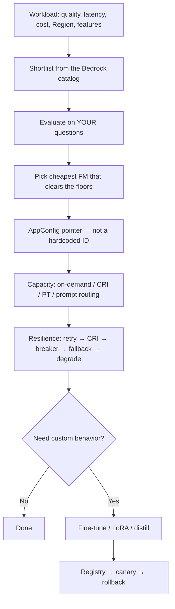
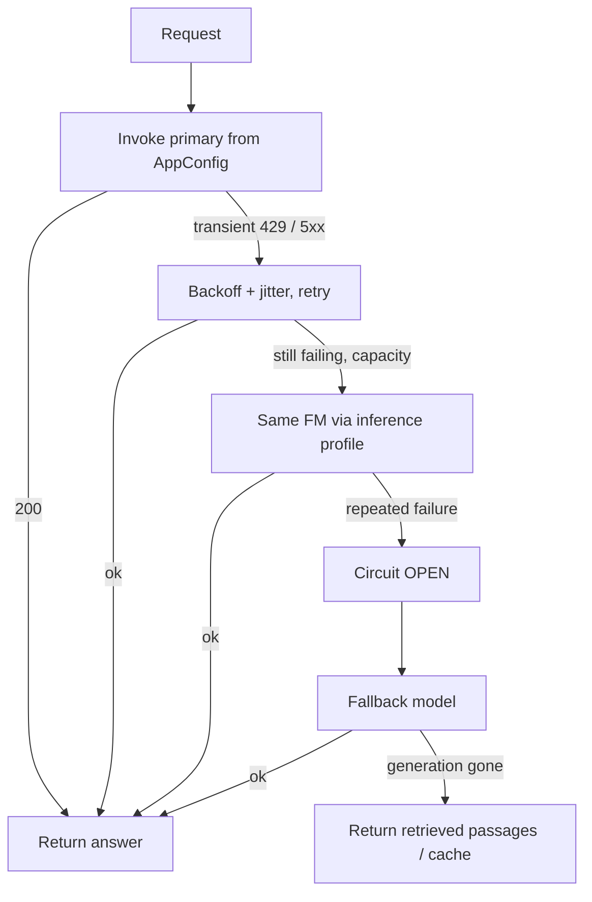

# Select and Configure Foundation Models

**Domain 1 · Task 1.2 · Skills 1.2.1–1.2.4**

> **1.2.1** Assess FMs: benchmarks, capabilities, limitations.  
> **1.2.2** Select and switch models without a code change.  
> **1.2.3** Make inference resilient: retries, Cross-Region inference, circuit breakers, graceful degradation.  
> **1.2.4** Customize when you must, then register, canary, and roll back.

This task is not “which model is smartest?” It tests whether you can **pick** an FM, **point** the app at a name, **choose how it runs and fails**, and only then **customize behavior** — without mixing those four knobs.

Walk this scenario as you read:

> The research desk asks “What did NVDA say about Blackwell this quarter?” Quality floor 90% grounded accuracy, ~10-second interactive budget, unpredictable usage, US-only filings, Friday model swaps without a deploy. Someone will propose fine-tuning last week’s 10-K into the weights. Someone else will buy Provisioned Throughput for a three-hour spike.

By the end you should be able to name which knob the stem is turning, pick the AWS control that actually turns it, and reject the answer that solves a different knob.

---

## What Task 1.2 actually tests

You do not train a foundation model from scratch on this exam. You consume one.

```text
What must it do?          →  1.2.1  pick the FM
Point the app at a name   →  1.2.2  config, not a zip
How should it run / fail? →  capacity SKU + 1.2.3
Need a custom artifact?   →  1.2.4  only for behavior
```

The exam will offer you one answer that solves the **wrong** decision. Fine-tune when the stem is RAG. Prompt routing when the stem is same-FM throttle. AppConfig when the stem is Regional capacity. Provisioned Throughput when the stem is a three-hour spike.

Adjacent tasks sit next door and are **not** this article:

- **1.1.1** is which *architecture* (direct inference vs RAG vs workflow vs agent).
- **1.1.2** is proving that architecture on a clock.
- **1.4 / 1.5** are vector stores and retrieval.
- **5.1** is the full evaluation curriculum. Here you only need enough eval to **pick**.



> **Exam tip:** The model, the capacity SKU, and a fine-tune are three different purchases. Read the stem until you know which one it is asking for.

### A running example

The blotter still wants grounded NVDA answers. Task 1.2 starts after 1.1.1 already chose **synchronous RAG on Bedrock**. Now you have to choose *which* FM writes the answer, how the Lambda finds that ID, what happens on `Too many requests`, and whether anyone is allowed to fine-tune.

| Knob | Desk example | Wrong answer the stem will dangle |
|------|----------------|-----------------------------------|
| Pick | Haiku clears 90% grounded; Sonnet is nicer and 4× the cost | “Always Opus” |
| Point | `modelId` in AppConfig | Redeploy Lambda to change writers |
| Run | On-demand + US inference profile | PT sized to earnings-day peak, 24×7 |
| Fail | Retry → CRI → fallback Haiku → return retrieved passages | Agent that “tries something” |
| Customize | Do not. Facts live in the Knowledge Base | Fine-tune on 10-Ks |

---

## Skill 1.2.1 — Pick the model before you pick the capacity

Do not ask which model is smartest. Ask: **which model satisfies this workload’s quality floor at the lowest acceptable latency and cost, in the Region, with the features the job actually uses?**

### Three passes, or you will pick a clever model that cannot run the job

**Capability.** Input type (text, image, audio, video). Context window versus the 10-K + history you will send. Max output length. Basic rewrite versus a hard compare. Tool calling. JSON / schema.

**Operations.** Time to first token and total generation. Tokens per minute, concurrency, quotas. Input vs output token price. Is the model in the Region the filings must stay in? Does an inference profile exist for Cross-Region inference?

**Platform.** Converse, streaming, Knowledge Bases, Guardrails, Agents, batch. Can this model be fine-tuned or distilled at all? Active vs Legacy / EOL.

A model that wins a blog benchmark and cannot call tools, or is not in `eu-west-1` when data must stay in the EU, is **not a candidate**. Drop it before you run an eval.

### Leaderboards shortlist. Your questions purchase.

Public benchmarks are useful for a first cut. They are not a purchase order. The scoreboard is a **versioned set of your real prompts** — 50 to 100 representative analyst questions, including hard and unanswerable items.

Three candidates for the blotter. Quality floor is ≥90% grounded accuracy on 100 desk questions. Interactive P95 must stay under ~10 seconds.

| Candidate | Accuracy | P95 | Cost / query | Verdict |
|-----------|----------|-----|--------------|---------|
| Nova Lite | 86% | 2.1 s | $0.006 | Misses the floor |
| Claude Haiku | 91% | 2.5 s | $0.009 | **Cheapest that clears** |
| Claude Sonnet | 95% | 5.8 s | $0.041 | Extra quality you did not require |

Select the **smallest / cheapest model that meets the requirements**, not the most capable one on the shelf. Sonnet is allowed if the stem raises the floor (legal compare, 95%+). It is not allowed because it “feels safer.”

```recall
Q: A leaderboard ranks Model X #1. It is missing from the required Region and cannot use tools. Is it still the pick?
A: No. Catalog fit (Region, modality, tools, KB, Guardrails) is a gate. Leaderboards only shortlist.
```

### Bedrock Model Evaluations

Skill 1.2.1 names **Amazon Bedrock model evaluations**. You bring a JSONL (or console) prompt dataset and compare candidates with:

- **Automatic metrics** when you have references (similarity, quality scores).
- **Human evaluators** for the desk’s hard cases.
- **LLM-as-judge** to scale — then **calibrate against humans**. A 0.86 judge score that desk analysts reject on 12 of 15 hard items is not a GO.

Evaluate quality, latency, cost, and safety on the **same** dataset when you change the pointer later. That is how 1.2.2 and 1.2.4 stay honest.

Full eval design (faithfulness, Recall@K, LLM-as-judge pitfalls) is Domain 5. Here the exam wants: **your data, not a screenshot of an arena.**

```quickcheck
Q: Quality floor is 90%. Lite 86% cheap, Haiku 91% mid, Sonnet 95% expensive. What do you pick?
A: Sonnet — highest accuracy
B: Haiku — cheapest that clears the floor
C: Lite — cheapest overall
correct: B
feedback: 1.2.1 is a floor, not a trophy. Lite fails the requirement. Sonnet is unused quality unless the stem raises the floor.
```

### Context window is memory, not intelligence

The context window is how much the model can *see* in one call: system prompt + history + retrieved chunks + the question + room for the answer. Overflow fails or truncates. A 200K window does not make a small model reason like a large one. It just lets Haiku look at more of the 10-K while still being Haiku.

If the job is “paste a paragraph, four bullets,” a huge window is irrelevant. If the job is “compare two full 10-Ks in one prompt,” window size is a selection gate.

### Temperature is decoding, not a model pick

Temperature 0 is greedy (classification, extraction, factual Q&A). Mid-range is general chat. High is creative. A small model at high temperature for legal extraction is the wrong *pair*. Changing temperature does not add this quarter’s 10-K to the weights.

```fillin
A 200K context window does {{not make the model smarter}} — it only lets it see more at once.
```

> **Exam cue:** “MOST cost-effective” + a simple task → smallest model that already passed *your* eval. “Choose an appropriate FM” → match modality, window, Region, and attached features, then score on your set.

---

## Skill 1.2.2 — Point the app at a name, not a hardcoded ID

Friday’s decision is “use Haiku instead of Sonnet.” That must not be a new Lambda zip.

Keep the application contract as `generate(messages, options)`. Put the `modelId` in **AWS AppConfig** (exam default) or **Parameter Store** (simpler cousin). The same pointer can hold `prod`, `cheap`, and `fallback`.

```text
Application  →  generate(messages)   // no model ID in source
AppConfig    →  prod     = Sonnet    // research answers
             →  cheap    = Nova Lite // summaries that already passed a cheaper eval
             →  fallback = Haiku     // desk still answers if primary is gone
```

AppConfig is the one with **deployment strategies**: gradual rollout, validation, automatic rollback when a CloudWatch alarm fires. Parameter Store stores the string. Either beats 17 hardcoded IDs.

Lambda and API Gateway still sit in front — they *read* the pointer. They are not where you bake `anthropic.claude-…` into a constant.

### Converse is a shared envelope, not identical models

**Converse** (and `ConverseStream`) gives one message shape across providers. That is why swapping IDs is *possible*. It does **not** make every model identical. Context windows, modalities, tool support, inference parameters, Regions, and Bedrock feature attach still differ.

Blindly pointing a tool-calling research path at an embedding model “because Converse is provider-agnostic” is the trap. Change the pointer, then **re-run the same eval set**.

```recall
Q: Where does the production model ID live if you must swap writers this afternoon with no deploy?
A: AWS AppConfig (or Parameter Store) — not source code, not a new SageMaker endpoint.
```

> **Exam cue:** “without code changes,” “without redeploying,” “switch models dynamically” → AppConfig. Then re-eval. Converse helps; it does not bless an unfit model.

---

## Capacity and routing — three logos the exam will shuffle

Which model answers and **how you pay for capacity** are different knobs. Prompt routing is not extra quota for one FM.

| If the stem is… | Pick |
|-----------------|------|
| Default / spiky / unpredictable / do not pay for idle | **On-demand** (input + output tokens). Shared per-Region quota. Peak can return `Too many requests`. |
| Same FM, this Region is hot, least ops, stay in US/EU | **Cross-Region inference** via an inference profile (`us.…`, `eu.…`, or global) |
| Stable high utilization, or a custom model with no on-demand path | **Provisioned Throughput** — Model Units by the hour, including 3am |
| Easy vs hard prompts, **same family**, save money at ask time | **Intelligent prompt routing** |
| Supported **custom** model, variable traffic | **Custom Model Deployment** (on-demand tokens). Custom models **cannot** use CRI. |

Do not rent 24/7 Model Units for a three-hour earnings spike.

### What actually moved?

Ask this out loud. The exam mixes the logos on purpose.

| Feature | What changed | What did not |
|---------|--------------|--------------|
| Cross-Region inference | **Region** (spare capacity for the same FM) | The writer |
| Intelligent prompt routing | **Model**, same family (small vs large) | Your AppConfig code |
| Application routing (AppConfig) | Whatever you put in the pointer — model, provider, task, fallback | A Bedrock SKU |

Prompt routing *picks* the cheaper model **at runtime**. Distillation (skill 1.2.4) *trains* the cheaper model to imitate a teacher **before** runtime.

### Prompt caching (do not confuse with “remember the answer”)

The IR methodology is a long, stable prefix. The analyst question is not. **Prompt caching** stores the computed state of a supported, repeated prefix so later calls skip re-processing those input tokens — cheaper, often faster. It does **not** cache the completion. A unique 8K retrieved blob with nothing shared will not help. Deeper cost treatment is Domain 4.

> Cache the static prefix. Do not expect a cache to remember last night’s Blackwell bullets.

```quickcheck
Q: Earnings-day 429s in us-east-1. Same FM. US-only. Least ops?
A: Prompt routing to a cheaper model
B: US geographic inference profile
C: PT sized to the peak, all day
correct: B
feedback: Same writer, spare US Region, still tokens. Routing changes the model. PT pays for idle overnight.
```

---

## Skill 1.2.3 — Failure is not one thing

A 429, a dead Region, a model that returns garbage, and a path that is completely down are different failures. Stack the responses. Do not pick one logo and stop.

| Failure | Response |
|---------|----------|
| Transient 429 / 5xx | **Retry** with exponential backoff **and jitter**. Immediate identical retries are a thundering herd. |
| This Region is out of spare capacity; same FM still required | **Cross-Region inference** (inference profile). Not a different writer. |
| Repeated failure; retries make timeouts worse | **Circuit breaker**: CLOSED → (threshold) OPEN → wait → HALF-OPEN (probe) → CLOSED. Stop hammering. |
| Provider or primary model is gone | **Fallback** model from AppConfig (Sonnet → Haiku). Quality may drop; the desk still answers. |
| Generation is dead | **Degrade**: return retrieved 10-K passages or last night’s cached summary. The UI does not go blank. |

A circuit breaker sits **in front of** CRI. It does not replace CRI. Retry is a blip. Fallback is a different model. Degradation is “generation is gone, still show something.”



### Step Functions when the path is already written down

Skill 1.2.3 names **AWS Step Functions**. You do not need an agent to decide “if the API fails three times, call backup.”

```text
Invoke primary
    → retry / backoff on transient 429 / 5xx
    → still failing? invoke AppConfig fallback
    → still failing? return degraded / cached response. Stop.
```

That is a deterministic workflow. Agents are for when the *model* must choose tools (1.1.1 / 2.1). An EventBridge cron that emails someone every hour is not failover.

> **Exam cue:** Known failover graph → Step Functions. Same FM, peak throttle → CRI. Stop hammering → circuit breaker. Show something when generation is dead → degrade. Change writers without a deploy → AppConfig, then re-eval.

```recall
Q: Circuit breaker vs Cross-Region inference — which one changes the writer?
A: Neither. CRI changes Region for the same FM. The breaker stops sending. Changing the writer is fallback / AppConfig.
```

---

## Skill 1.2.4 — Customize behavior, not this week’s 10-K

RAG changes **what the model knows at inference time**. Customization changes **how the model behaves**. Do not fine-tune to “add this week’s 10-K.” That knowledge is stale the morning after the 8-K. Put the filing in a Knowledge Base.

**Prompt engineering first.** Few-shot examples, clearer instructions, splitting the task, Prompt Management. Fine-tuning is weeks and a training set. Prompts iterate this afternoon.

| Need | Lever |
|------|--------|
| Fresh / private / changing facts, citations | **RAG** — not a custom model |
| Task-specific behavior from labeled input–output pairs | **Supervised fine-tuning** |
| Objective reward / grader | **Reinforcement fine-tuning (RFT)** |
| Large-model behavior at lower cost, trained ahead of time | **Distillation** (teacher → student) |
| Domain adaptation from unlabeled corpus | **Continued pretraining** |
| Several specialized behaviors, swap at inference, thin extra weights | **LoRA / adapters** |

You put JSONL (or the teacher’s outputs) on S3, run a Bedrock or SageMaker job, and get a **custom model**. Invoke it with a **Custom Model Deployment** ARN (on-demand, if that model/Region supports it) or with **Provisioned Throughput**. Custom models still **cannot** use Cross-Region inference.

```fillin
Fine-tune for behavior. Retrieve for {{facts}}. Distill to make the cheap model better; route to pick the cheap model live.
```

### Register, canary, rollback, retire

Skill 1.2.4 is the **lifecycle**, not a one-shot job. A custom model that cannot be rolled back is not a production model.

```text
Base FM → customize → offline eval → SageMaker Model Registry
    → approve
    → canary / blue-green (5% → 25% → 100%)
    → CloudWatch alarms
    → unhealthy? roll back to v2
    → retire when the base FM goes Legacy / EOL
```

**SageMaker Model Registry** versions the package and is what CI/CD points at. Do not bury `MODEL = "old-id"` in 17 Lambdas — that is what AppConfig and the registry are for. Hard-cutting 100% to v3 and deleting v2 is how you get stuck.

Bedrock FMs move **Active → Legacy → EOL**. Migrate to an Active model before retirement. Customization options can shrink once a model is Legacy. Treat the production pointer as a config alias, evaluate the replacement on the **same** dataset, then cut over.

> **Exam cue:** Changing filings / citations → RAG. “Consistent format / brand voice / labeled pairs” → fine-tune after prompts fail. “Swap adapters” → LoRA. “Version and roll back” → Model Registry + canary. Teacher imitated ahead of time → distillation, not prompt routing.

---

## Easy-to-confuse pairs

### Leaderboard vs your eval set

Leaderboard = shortlist. Your JSONL + Bedrock evaluations = purchase. A #1 model that is missing from the Region is not a candidate.

### Smallest that meets the floor vs most capable

90% required, Haiku 91%, Sonnet 95% → Haiku unless the stem raised the floor or the latency/cost of Sonnet is still inside budget *and required*.

### AppConfig vs inference profile vs prompt routing

| Stem language | Control |
|---------------|---------|
| Swap writers, no deploy | AppConfig |
| Same FM, other Region, 429 | Inference profile / CRI |
| Easy vs hard, same family, at ask time | Prompt routing |

### On-demand vs Provisioned Throughput vs CRI

Spiky → tokens. Steady hot (or custom with no on-demand path) → PT. Peak 429 same FM → CRI. PT is not a 429 button you press for three hours.

### Retry vs circuit breaker vs fallback vs degrade

Blip → retry + jitter. Repeated failure → breaker. Different model → fallback. Generation gone → retrieved passages / cache.

### RAG vs fine-tune vs continued pretraining vs distillation

Facts / freshness / citations → RAG. Behavior from labels → SFT. Unlabeled domain text → CPT. Cheap model imitating a teacher **before** runtime → distill. Cheap vs large **at** runtime → prompt routing.

### Converse vs “any model will do”

Shared envelope. Re-eval after every pointer change.

### Custom Model Deployment vs CRI

Supported custom models can be on-demand via a deployment ARN. They still cannot use Cross-Region inference.

```quickcheck
Q: Which pair is correct?
A: CRI changes the writer; AppConfig changes the Region
B: CRI changes the Region (same FM); AppConfig changes the writer
C: Prompt routing is extra quota for one FM
correct: B
feedback: Region vs model vs your config. Prompt routing is easy-vs-hard inside a family, not spare TPS for Sonnet.
```

---

## Exam recognition

| When you see… | Think… |
|----------------|--------|
| MOST cost-effective / simple extraction / classification | Smallest FM that already passed *your* eval; on-demand |
| Compare models objectively / JSONL / your prompts | Bedrock Model Evaluations |
| Change models without deployment | AppConfig (Parameter Store if they simplify) |
| Too many requests, same FM, residency | Geographic inference profile |
| Easy vs hard, same family, save money live | Intelligent prompt routing |
| Known failover steps, no extra tools | Step Functions |
| Stop hammering a sick dependency | Circuit breaker |
| Generation down, still show something | Degrade to retrieval / cache |
| This week’s 10-K / citations / changing docs | RAG, not fine-tune |
| Consistent JSON / brand voice after prompts failed | Fine-tune |
| Multiple behaviors, swap extra weights | LoRA |
| Teacher → cheaper student ahead of time | Distillation |
| Version, approve, 5% traffic, roll back | Model Registry + canary |
| Active / Legacy / EOL | Migrate the AppConfig pointer; re-eval |

Walk every stem with:

```text
Which knob?  pick | pointer | capacity | fail | customize
Then the AWS control that turns THAT knob.
```

---

## AWS service glossary

Lookup cards for Task 1.2. Pricing is the **meter**, not a dollar amount that will be wrong next quarter.

### GenAI / AI

#### Amazon Bedrock Runtime / Converse

**What it is.** The invoke API. `Converse` / `ConverseStream` is the unified messages shape.

**Problem it solves.** Call FMs without owning GPUs; swap providers without rewriting JSON per vendor.

**Where it sits.** Lambda / app → Runtime. `modelId` is a foundation-model ID or an inference-profile / deployment ARN.

**Typical use.** Desk chat, RAG generation, classification.

**Pricing.** Input and output tokens of the chosen model (or MUs if PT).

**Exam cue.** Start here, not model-specific `InvokeModel` JSON, unless the stem forces it.

**Do not confuse with.** A guarantee that every model is interchangeable.

#### Foundation models on Bedrock

**What it is.** Pretrained models you invoke by model ID or profile.

**Problem it solves.** Generation, embeddings, rerank — without training from scratch.

**Where it sits.** Behind Runtime.

**Typical use.** Haiku for the blotter if it clears 90%; larger only if the floor requires it.

**Pricing.** Per model, input vs output tokens.

**Exam cue.** Match modality, window, Region, tools, KB — then score on *your* set.

**Do not confuse with.** A custom model (different artifact, different capacity rules, no CRI).

#### Bedrock model evaluations

**What it is.** Managed jobs: automatic metrics, human raters, LLM-as-judge, on *your* prompt dataset.

**Problem it solves.** Compare candidates without a folklore bake-off.

**Where it sits.** Before you write the AppConfig pointer, and again after you change it.

**Typical use.** 100 versioned analyst questions; quality + latency + cost + safety.

**Pricing.** Judge / model tokens plus any human loop.

**Exam cue.** “Compare models on our data,” JSONL, not a public leaderboard.

**Do not confuse with.** CloudWatch (health) or a training job.

#### On-demand inference

**What it is.** Shared capacity, pay per token, no reservation.

**Problem it solves.** Unpredictable or low/variable traffic.

**Where it sits.** Default invoke path.

**Typical use.** Internal desk; earnings spike (often plus CRI).

**Pricing.** Tokens. Idle is free.

**Exam cue.** “Do not pay for idle,” “unpredictable usage.”

**Do not confuse with.** PT (you pay at 3am) or batch (hours, not interactive).

#### Inference profiles / Cross-Region inference

**What it is.** A handle (`us.…`, `eu.…`, global) you pass as `modelId` so Bedrock may use another Region’s spare capacity **for the same FM**.

**Problem it solves.** Peak 429s and Regional blips without you coding failover.

**Where it sits.** On the Converse/Invoke call.

**Typical use.** Earnings-day `Too many requests` in one US Region.

**Pricing.** Tokens at the source Region’s price; no extra “router fee.”

**Exam cue.** Same FM, least ops, stay in geography → `us.` / `eu.` profile, not global under residency.

**Do not confuse with.** Prompt routing (different models) or AppConfig (your pointer).

#### Intelligent prompt routing

**What it is.** Bedrock picks a small or large model in a **supported family** at ask time.

**Problem it solves.** Cost / quality on mixed easy-vs-hard traffic.

**Where it sits.** Alternate `modelId` (router), not extra quota for one FM.

**Typical use.** Summaries vs hard compares in the same family.

**Pricing.** Tokens of whichever model ran.

**Exam cue.** Easy vs hard, same family, runtime.

**Do not confuse with.** CRI, distillation, or AppConfig task routing.

#### Custom Model Deployment

**What it is.** On-demand invoke of a *supported* custom model via deployment ARN as `modelId`.

**Problem it solves.** Variable traffic on a fine-tune without buying idle MUs (when the path exists).

**Where it sits.** Custom artifact → Runtime.

**Typical use.** Fine-tuned JSON formatter with spiky desk traffic.

**Pricing.** Tokens.

**Exam cue.** Custom + variable traffic. Still **no CRI**.

**Do not confuse with.** PT (dedicated MUs) or importing a random GGUF as a default.

#### Prompt caching

**What it is.** Reuse of the computed prefix for a supported, repeated prompt prefix.

**Problem it solves.** Long stable system / methodology tokens that do not change per question.

**Where it sits.** On the invoke, when the model and prefix qualify.

**Typical use.** 40K IR boilerplate + a short analyst question.

**Pricing.** Discounted cached input tokens vs full re-read.

**Exam cue.** Cache the static prefix, not the completion.

**Do not confuse with.** ElastiCache of yesterday’s answer.

### Application / config

#### AWS AppConfig

**What it is.** Application configuration with staged rollout and optional alarm-based rollback.

**Problem it solves.** Change `modelId` / aliases without a code deploy.

**Where it sits.** Lambda reads it at runtime.

**Typical use.** `prod` / `cheap` / `fallback` pointers.

**Pricing.** AppConfig API / poll — not model tokens.

**Exam cue.** “Without redeploying,” gradual model switch, auto rollback.

**Do not confuse with.** Inference profiles (Region) or Parameter Store (plain parameter, no strategy).

#### Parameter Store

**What it is.** Hierarchical parameters (often a model ID string).

**Problem it solves.** Simple externalized config.

**Where it sits.** Same place AppConfig would — the app reads a name.

**Typical use.** Small apps; exam may accept it as the simpler 1.2.2 cousin.

**Pricing.** Standard / advanced parameters.

**Exam cue.** Externalize the ID. Prefer AppConfig when they mention gradual rollout or alarm rollback.

**Do not confuse with.** Secrets Manager (credentials, not model routing).

### Integration / orchestration

#### AWS Step Functions

**What it is.** Managed state machines.

**Problem it solves.** A **known** retry / fallback / degrade graph.

**Where it sits.** Around Bedrock invokes.

**Typical use.** Primary → backoff → fallback → cache.

**Pricing.** State transitions.

**Exam cue.** Failover path already written; model must not invent steps.

**Do not confuse with.** Agents (dynamic tools) or EventBridge Scheduler (cron).

#### SageMaker Model Registry

**What it is.** Versioned model packages with approval states for CI/CD.

**Problem it solves.** Lineage and a pointer you can roll back.

**Where it sits.** After customize + offline eval, before canary.

**Typical use.** custom-v3 approved → 5% traffic.

**Pricing.** SageMaker control plane; hosting is separate.

**Exam cue.** Version, approve, roll back. Not the eval dataset itself.

**Do not confuse with.** Bedrock Prompt Management (prompts, not weight artifacts).

---

## Practice questions

Pick an answer on every stem. The explanation appears after you choose — later questions stay unspoiled until you answer them.

```practice
Q: Three Bedrock chat models are scored on 100 real analyst questions. Quality floor is ≥90% grounded accuracy. Nova Lite scores 86% at $0.006/query, Haiku 91% at $0.009, Sonnet 95% at $0.041. Which pick matches Skill 1.2.1?
A: Sonnet, because it has the highest accuracy
B: Haiku — cheapest model that clears the quality floor
C: Nova Lite, because it is the cheapest
D: Average the three scores and pick at random
correct: B
feedback: Pick the smallest / cheapest model that meets the floors, not the smartest on the shelf. Nova Lite misses 90%. Sonnet is extra quality you did not require.

Q: A blog leaderboard ranks Model X first for “reasoning.” Model X is not in `eu-west-1`, and it cannot call tools. The workload must stay in the EU and must use tools. What should you do?
A: Choose Model X anyway; leaderboards are authoritative
B: Fine-tune Model X so it gains tool use
C: Drop Model X from the shortlist; catalog fit (Region, features) is a selection gate
D: Use a global inference profile so Model X can run in Ireland
correct: C
feedback: Public benchmarks shortlist; they do not purchase. A model that cannot run in the required Region or attach the required features is not a candidate. Global CRI does not invent tool APIs or EU residency.

Q: You must compare two Bedrock models on *your* research prompts, with automatic metrics plus a human slice. Which service is the systematic Bedrock path?
A: CloudWatch Logs Insights on Lambda timeouts
B: Amazon Bedrock model evaluations with a versioned prompt dataset (JSONL)
C: SageMaker training jobs invoked per user question
D: A public LMSYS arena screenshot attached to the design review
correct: B
feedback: 1.2.1 is evaluation on your data. Bedrock evaluations (automatic / human / LLM-as-judge) are the platform path. CloudWatch is health. Training per question is not eval. Leaderboards are not your blotter.

Q: The task is extracting four JSON fields from a 600-word earnings paragraph. Usage is sporadic. Leadership wants the MOST cost-effective design that still extracts correctly. What is the default?
A: The largest available chat model, because extraction is “reasoning”
B: A small, fast model that already meets the extraction eval, on-demand
C: Provisioned Throughput on Opus so latency is guaranteed
D: Fine-tune before you have measured a base model
correct: B
feedback: Match size to task. Classification / extraction often do not need the largest FM. Sporadic traffic → on-demand, not reserved MUs. Fine-tune is a later lever.

Q: Friday’s decision is “swap Sonnet for Haiku in production this afternoon.” No code change, no new Lambda zip. Which control plane is the exam default?
A: Hardcode the new model ID and redeploy
B: AWS AppConfig (or Parameter Store) holding the production `modelId`
C: A new SageMaker endpoint for every swap
D: Edit 17 environment variables by hand in the console and hope they match
correct: B
feedback: Skill 1.2.2 is dynamic selection without a code change. AppConfig is the named pattern (gradual rollout, alarm-based rollback). Parameter Store is the simpler cousin. Hardcoding IDs is the trap.

Q: An application uses Converse, so the team plans to change `modelId` from a tool-calling chat model to a cheap embedding model “because Converse is provider-agnostic.” Why is this wrong?
A: Converse is a shared message envelope; it does not make every model identical
B: Embeddings cannot be invoked in any AWS Region
C: You must always use InvokeModel JSON, never Converse
D: AppConfig cannot store embedding model IDs
correct: A
feedback: Blind ID swaps are an exam trap. Context windows, modalities, tools, and feature attach still differ. Re-evaluate the candidate on the same eval set after you change the pointer.

Q: On earnings morning, on-demand Bedrock in `us-east-1` returns “Too many requests.” Legal requires the **same** FM and US-only processing. Least new machinery?
A: Intelligent prompt routing across a model family
B: A US geographic inference profile (Cross-Region inference)
C: Buy Provisioned Throughput sized to the peak, 24 hours a day
D: Rewrite the client to retry `eu-west-1`
correct: B
feedback: Same FM, peak throttle, US residency, least ops → US CRI. Prompt routing changes models. PT pays for idle. EU retry breaks residency.

Q: Traffic is easy summaries mixed with hard compares. You want Bedrock to pick a small or large model **in the same family at ask time** to save money. Which feature is that?
A: Cross-Region inference
B: Intelligent prompt routing
C: Provisioned Throughput
D: SageMaker Model Registry
correct: B
feedback: Prompt routing = model (easy vs hard), same family. CRI = Region, same FM. PT = reserved capacity. Registry = custom-model lifecycle.

Q: Primary model calls are failing repeatedly. Immediate retries make timeouts worse. You need to stop sending traffic, wait, then probe. Which pattern?
A: Cross-Region inference
B: A circuit breaker (CLOSED → OPEN → HALF-OPEN)
C: Fine-tuning the primary so it never fails
D: Raising temperature
correct: B
feedback: Circuit breaker is for repeated failure — stop hammering. CRI is spare Regional capacity for the same FM. Retry with backoff is for a blip, not a stuck outage. Fine-tune and temperature are unrelated.

Q: The failover path is already written: invoke primary → retry on 429/5xx → fallback model from AppConfig → return cached passages. The model must not invent extra steps. Which orchestration fits Skill 1.2.3?
A: An unconstrained agent with a “try something else” tool
B: AWS Step Functions with Bedrock/Lambda tasks
C: EventBridge Scheduler every hour until someone notices
D: A SageMaker training job
correct: B
feedback: Known graph → Step Functions (the skill’s named service). Agents choose tools. A scheduler is not conditional failover. Training is not inference resilience.

Q: Generation is completely down. Retrieved 10-K chunks are still available. What is graceful degradation?
A: Return a blank 500 and wait
B: Return the retrieved passages (or last night’s cached summary) so the UI is not empty
C: Fine-tune overnight so the outage never happens
D: Switch to a global inference profile even though data must stay in the EU
correct: B
feedback: Degrade = generation gone, still show something useful. Blank 500 fails the skill. Fine-tune is not an incident response. Global CRI can break residency.

Q: You need to change writers (Sonnet → Haiku) for the research desk without a deploy, then confirm quality. Which pair is correct?
A: Inference profile only — CRI changes the model for you
B: AppConfig pointer + re-run the same eval set
C: Prompt routing, because it always picks Haiku
D: Custom Model Import
correct: B
feedback: Application routing lives in AppConfig. CRI does not change the writer. Prompt routing is easy-vs-hard at runtime inside a family, not “always Haiku.” Then re-eval; do not assume the cheaper model still clears the floor.

Q: IR wants answers grounded in this quarter’s 10-Ks. Filings change when exhibits are posted. A teammate proposes fine-tuning on all historical 10-Ks. What is the right knowledge path?
A: Fine-tune — that embeds the filings in the weights
B: RAG / Knowledge Bases — facts stay in the library
C: Increase temperature so the model “remembers” better
D: Continued pre-training on last year’s 10-Ks only
correct: B
feedback: Fine-tune (and CPT) change behavior / domain adaptation; they do not keep a live library with citations. Changing private filings → retrieve. Temperature is decoding, not memory.

Q: The team has not tried few-shot prompts, clearer instructions, or splitting the task. They want to start a Bedrock fine-tune this week because “custom always wins.” What first?
A: Fine-tune immediately; prompts are not an AWS feature
B: Exhaust prompt engineering; it is faster and cheaper than a training job
C: Import a GGUF model and buy Provisioned Throughput
D: Train a 70B model from scratch on SageMaker
correct: B
feedback: Prompt first is the golden rule of 1.2.4. Fine-tune when labeled behavior still fails after serious prompt work. From-scratch training and a rushed import are not the default.

Q: You need several specialized behaviors from one base FM and want to swap them at inference without loading a whole new model. Which customization shape?
A: Full fine-tune of every weight for each behavior, always
B: LoRA / adapters — thin extra weights, swap at inference
C: RAG with `K=40` and no eval
D: Cross-Region inference
correct: B
feedback: LoRA is the parameter-efficient, swappable adapter path the skill names. Full fine-tune is heavier. RAG is facts. CRI is capacity.

Q: A new custom model v3 passed offline eval. How should it meet production traffic?
A: Hard cut 100% of traffic to v3 and delete v2
B: Register it, canary or blue-green, watch metrics, roll back to v2 if unhealthy
C: Put the new ID in 17 Lambdas by hand
D: Skip the registry; custom models cannot be versioned
correct: B
feedback: 1.2.4 is the lifecycle: SageMaker Model Registry + reversible deploy (canary / blue-green) + rollback. Hard cuts and hardcoded IDs are how you get stuck on a bad model.

Q: You want a cheaper model to *imitate* a larger teacher **before** runtime. Separate from Bedrock picking small vs large at ask time. What is the training lever?
A: Intelligent prompt routing
B: Distillation (teacher generations → student training)
C: Cross-Region inference
D: An S3 gateway VPC endpoint
correct: B
feedback: Distillation trains the cheap model ahead of time. Prompt routing *picks* cheap vs large live. CRI is Region. A gateway endpoint is S3/DynamoDB networking.

Q: Load is a three-hour earnings spike, then idle overnight. Custom weights are not involved. Finance refuses to pay for reserved Model Units at 3am. Which capacity approach?
A: Provisioned Throughput with a six-month commit
B: On-demand tokens, plus Cross-Region inference if the Region throttles
C: Always-on SageMaker ml.p4d nodes
D: EKS GPU nodes at peak size, 24×7
correct: B
feedback: Spiky / unknown → on-demand. CRI relieves same-FM throttle. PT and warm GPUs pay for a floor you do not have overnight.
```

---

## Final compressed review

### What are the four knobs?

1. **Pick** — cheapest FM that clears *your* floors (capability + ops + platform, then eval).
2. **Point** — AppConfig / Parameter Store. Converse is an envelope. Re-eval after every swap.
3. **Run / fail** — on-demand, CRI, PT, prompt routing as capacity; retry → CRI → breaker → fallback → degrade via Step Functions.
4. **Customize** — behavior, not this week’s 10-K. Prompt first. Then SFT / LoRA / distill / CPT. Registry, canary, rollback, Active→Legacy→EOL.

### What requirement words should trigger what choices?

Your dataset / JSONL → **Bedrock evaluations**. Cost-effective extraction → **small on-demand FM**. No deploy → **AppConfig**. Same FM 429 + residency → **geographic CRI**. Easy vs hard same family → **prompt routing**. Known failover graph → **Step Functions**. Stop hammering → **circuit breaker**. Generation dead → **degrade**. Changing 10-Ks → **RAG**. Format/voice after prompts fail → **fine-tune**. Swap thin weights → **LoRA**. Teacher ahead of time → **distill**. Version and undo → **Model Registry + canary**.

### What mistakes is AWS trying to tempt you into making?

Opus for four JSON fields. Leaderboard as a purchase order. Hardcoded model IDs. Prompt routing when the stem is same-FM throttle. PT for a three-hour spike. An agent for a written failover. Fine-tune for tomorrow’s exhibit. Distillation confused with routing. Hard-cut custom v3 with no rollback. Global CRI under an EU wall.

If you can walk the blotter out loud — Haiku if it clears 90%, ID in AppConfig, on-demand + `us.` profile, Step Functions around failure, facts in the KB not the weights — you are doing Task 1.2.
