# Standardized Technical Components for GenAI

**Domain 1 · Task 1.1 · Skill 1.1.3**

> Create standardized technical components to ensure consistent implementation across multiple deployment scenarios, for example by using the AWS Well-Architected Framework and AWS Well-Architected Tool Generative AI Lens.

This skill is not “write a best-practices wiki.” It tests whether you can turn a **proven** GenAI pattern into building blocks other teams can consume — with consistent security, evaluation, observability, and deployment — without forcing every workload into one rigid architecture.

Walk this scenario as you read:

> Team A validated an internal RAG assistant over earnings calls, filings, and analyst notes. Semiconductors, software, and internet desks now want the same kind of product. Today each squad would invent its own Lambda, IAM, logging, citation format, and eval spreadsheet. Leadership wants the next three teams to clone an approved path, not rediscover PrivateLink.

By the end of this article you should be able to name what must stay invariant, what should stay configurable, how Well-Architected reviews feed those standards, and how to explain a golden path out loud — including when a team is allowed to deviate.

---

## What Skill 1.1.3 actually tests

Skill 1.1.3 is a **reuse-and-governance** skill.

The exam is asking: once a GenAI architecture has been designed and proven, how do we stop the next ten teams from each inventing a slightly different, slightly less safe version of it?

```text
Design
   ↓
Validate
   ↓
Standardize
   ↓
Reuse
   ↓
Govern
   ↓
Continuously improve
```

Connect that to the two skills you already have:

```text
Skill 1.1.1
What architecture should solve the problem?

        ↓

Skill 1.1.2
Can we prove that architecture works?

        ↓

Skill 1.1.3
How do we turn successful patterns into
safe, repeatable, reusable building blocks?
```

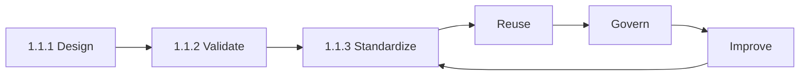

1.1.1 draws the map. 1.1.2 walks the dangerous parts with a small pack. 1.1.3 paves the trail so the next team does not bushwhack.

The central question:

> **How do we prevent every GenAI project from becoming a one-off architecture?**

One-off implementations look fast for Team A. At firm scale they produce:

- IAM that is “whatever the last engineer copied”
- logs that cannot be compared across apps
- Guardrails on one desk and prompt-only hope on another
- prompts as unversioned strings in application code
- five definitions of “accuracy”
- models that are expensive, unapproved, or wrong-Region
- cost that cannot be attributed
- incompatible `/generate` shapes
- duplicated Bedrock retry logic
- deploys that only one person can reproduce
- audits that take weeks
- upgrades that break half the estate

Standardization tries to buy, at the same time:

```text
Consistency
Reuse
Security
Speed
Governance
Operability
Auditability
Cost control
```

Those are not slogans. If Team B can stand up a RAG assistant in days because auth, logging, citations, and eval hooks already exist, you got **speed from consistency**, not despite it.

> **Exam tip:** Stems that say *standardize across teams*, *reusable components*, *golden path*, *align to AWS best practices*, *Well-Architected*, or *GenAI Lens* are 1.1.3. The pair AWS wants is **guidance (Lens) plus technical components (IaC / shared libraries)**, not a slide deck.

```recall
Q: What is the product of Skill 1.1.3?
A: Reusable technical components and an approved default path — not a wiki, and not one architecture for every workload.
```

---

## Invariants, variation, and golden paths

Standardize the machine parts. Configure the desk. A golden path is the approved default, not a prison.

### Standardize invariants. Configure legitimate variation.

Standardization does **not** mean:

> Every GenAI application must use exactly the same architecture.

A batch recap job and an interactive research blotter should not share a 10-second chat contract. A multimodal slide reader may need a model the text RAG path does not.

It does mean:

> Standardize the parts that should remain consistent. Expose **controlled configuration** for differences that are legitimate.

```text
Standard component:
RAG service

Fixed:
- authentication
- logging schema
- citation format
- evaluation hooks
- encryption
- deployment conventions

Configurable:
- data source
- chunking strategy
- embedding model
- metadata filters
- retrieval K
- reranking
- generation model (from an allowlist)
```

Semiconductors, software, and internet desks can all ride that component. Their corpora, tickers, and `top_k` differ. Their CloudWatch dimensions, IAM shape, and “what a citation is” do not.

That sentence is the retention rule for the whole skill:

> **Standardize invariants. Configure legitimate variation.**

A standard that cannot be configured becomes a **golden cage**. A configuration surface with no invariants is just copy/paste with YAML on top.

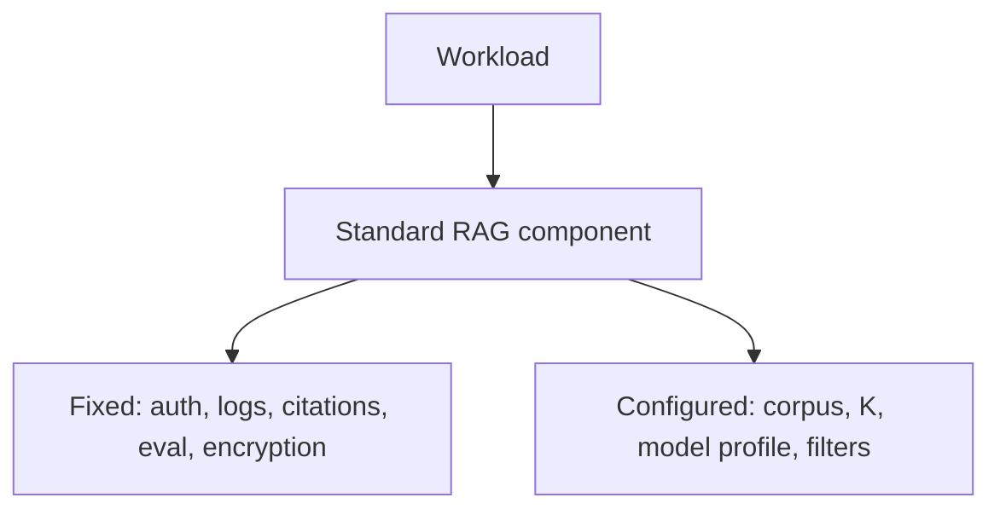

```fillin
Standardize the {{invariants}}. Configure the legitimate differences.
```

---

### What should become standardized?

Inconsistency is not equally dangerous everywhere. Taxonomy first, then why each category hurts at scale.

#### Infrastructure components

Networking (VPC endpoints), API exposure, compute (Lambda / Fargate), storage, queues, observability wiring, encryption defaults.

If every team invents PrivateLink and API Gateway differently, you cannot prove that Bedrock traffic stays on the AWS network, and you cannot rotate a TLS policy once.

#### GenAI components

Bedrock invocation wrappers, model allowlists, prompt templates and versions, retries, token limits, output validation, Guardrails, RAG retrieve interfaces, rerank, citation formatting, agent tool contracts.

If every team calls `Converse` with a homemade timeout, one desk will retry storms into 429s while another surfaces raw SDK errors to analysts.

#### Security components

IAM role templates, least-privilege policies, secrets, authentication, authorization, document-level retrieval filters, agent tool permissions, audit logging.

Security copied from a blog post into thirty Lambdas is how an intern’s role gets `bedrock:InvokeModel` on `*` and `s3:*` on the filings bucket.

#### Evaluation components

Golden-dataset format, eval runner, quality / latency / cost / safety metrics, regression gates.

Without this, “good” means whatever the last demo showed. You cannot compare Team A’s 93% to Team B’s 93%.

#### Operational components

Log schema, metrics, traces, dashboards, alarms, request IDs, cost attribution, incident fields.

Everyone “has logs.” Nobody can answer “which prompt version caused Friday’s faithfulness drop?”

#### Delivery components

IaC modules, CI/CD, environment config, deploy templates, rollback.

Console-clicked production cannot be reproduced for the software desk, and cannot be rolled back when a Guardrail change bricks completions.

| Category | Why one-offs fail at scale |
|----------|----------------------------|
| Infrastructure | Drift, unreviewable networking, snowflake accounts |
| GenAI runtime | Divergent retries, models, prompts, citations |
| Security | Uneven least privilege; un-auditable data access |
| Evaluation | No shared definition of quality |
| Operations | Dashboards that cannot be joined |
| Delivery | Unrepeatable deploys; slow onboarding |

You do not standardize **business logic** (how the internet desk phrases a thesis). You standardize the **machine** that runs that logic safely.

---

### Reusable building blocks

Documentation is guidance. 1.1.3 wants **things teams can actually consume**.

| Building block | What it is | Example |
|----------------|------------|---------|
| **Library** | Code imported into the app | Python Bedrock client with retries, token logs, guardrail ID |
| **Service / API** | A network call, not a copy of code | Central `/retrieve` or model gateway |
| **Infrastructure module** | CDK construct / CloudFormation nested stack | `DeskRagStack` that wires API Gateway, Lambda, IAM, logs |
| **Reference architecture** | A drawn, reviewed pattern | “Internal RAG assistant” diagram with extension points |
| **Deployment template** | How the module is rolled out | Pipeline that deploys the stack to `dev`/`prod` |
| **Policy template** | IAM / SCP / Guardrail floor | Invoke only tagged models; require `bedrock:GuardrailIdentifier` |
| **Prompt template** | Versioned artifact in Prompt Management | `earnings-summary@1.7` |
| **Evaluation harness** | Shared runner + schema | JSONL in, scores out, same metrics for every desk |

A **Bedrock invocation wrapper** is the smallest vivid example.

Without it:

```text
application
  → boto3.converse(...)
```

Thirty copies of retry, logging, and model IDs. Governance is a lecture.

With it:

```text
application
  → standardized model client
         ↓
   retry / backoff
   logging
   token tracking
   model allowlist
   timeout
   guardrail attachment
```

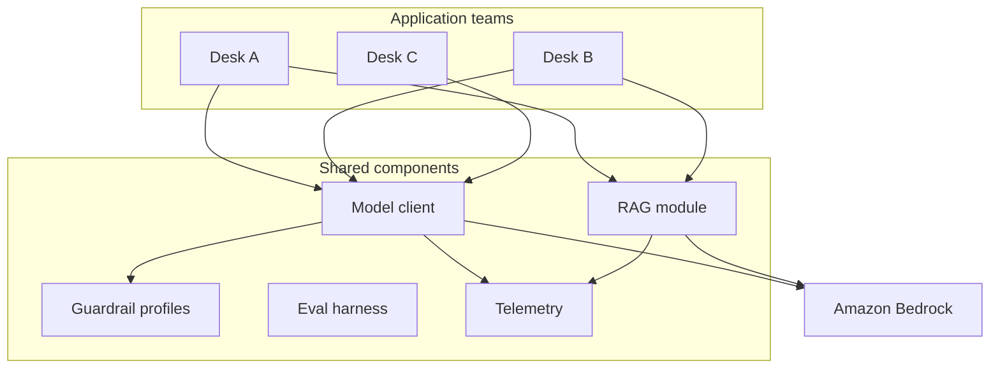

When Legal changes the Guardrail, you bump a profile version once. You do not hunt thirty repos.

---

### Golden paths

A **golden path** (paved road) is the approved *easy* default:

> If you are building an internal RAG assistant, start here.

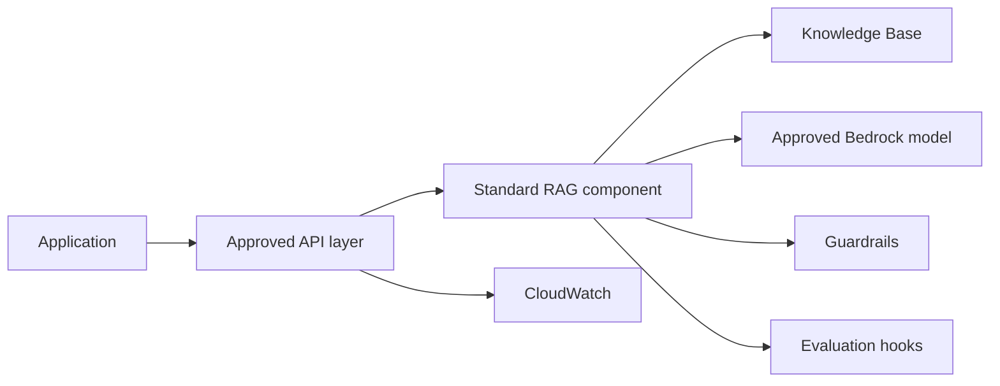

The point is not that deviation is illegal. The point is that the **secure, operable option is easier than the ad hoc option**. If the golden path takes a day and a homemade path takes three weeks of IAM, people use the path.

```text
Golden path
≠
mandatory architecture for every workload
```

A batch overnight recap may use the same model client and telemetry schema on a **different** path (SQS + Batch Inference). That is still standardization. It is not forcing chat UX onto a file of 10,000 prompts.

Skill 1.1.1 already named the company path as API Gateway → auth → shared invocation → Prompt Management → Guardrail → Bedrock → logs, with optional KB / AgentCore / SQS / Step Functions modules. 1.1.3 is how that diagram becomes something Team B can **deploy**, not something Team A **drew**.

> **Important:** If the approved path is painful, developers will bypass it. Usability is a security control.

```quickcheck
Q: Three IR desks each invented Lambda, logging, guardrails, and PrivateLink. Leadership wants AWS best-practice alignment and a path the next team can clone. What pair fits?
A: Well-Architected GenAI Lens reviews plus a reusable IaC golden path
B: Mandate one foundation model for the firm
C: Amazon Q Developer so everyone gets the same completions
D: Trusted Advisor weekly emails
correct: A
feedback: Guidance is the Lens. Standardization is reusable IaC. One model is not an architecture standard. Q Developer is an IDE product. Trusted Advisor is account checks, not a GenAI design review.
```

---

### Reference architectures vs reusable components

A **reference architecture** shows approved boundaries: services, data flows, security controls, failure handling, observability, deployment, and **extension points**. It is a recommended pattern.

A **reusable implementation component** is code or infrastructure a team can consume this week.

| | Reference architecture | Reusable component |
|--|------------------------|--------------------|
| Form | Diagram, decision records, Lens-aligned notes | Library, API, CDK module, template |
| Job | Teach the shape | Install the shape |
| Exam confusion | “We published a PDF” | “We published a construct” |

You want both. A diagram without a module will be copied wrong. A module without a reference architecture will be used for the wrong workload.

Useful GenAI reference families (names, not one mega-diagram):

| Family | When it is the default |
|--------|------------------------|
| Direct inference | Evidence is already in the prompt |
| Enterprise RAG assistant | Private, changing corpus + citations |
| Batch document processing | Overnight piles, hours of latency OK |
| Agentic application | Model must choose tools |
| Regulated workload | Same patterns plus stricter residency, audit, HITL |

Skill 1.1.1 chose among these. Skill 1.1.3 publishes the ones that **survived PoCs** as firm defaults.

---

## How the standard is encoded

If it is not in a template or a shared module, it is not a standard. It is folklore.

### Infrastructure as Code

Clicking the console is how PoCs start. It is how estates rot.

**Infrastructure as Code** (CloudFormation, CDK, reusable templates/constructs) encodes the architecture so it can be reviewed, versioned, and instantiated.

```text
Architecture standard
       ↓
Infrastructure as Code
       ↓
Repeatable deployment
       ↓
Dev / Test / Prod / Team A / Team B
```

Benefits that matter for 1.1.3:

- Repeatability (software desk gets the same IAM shape as semiconductors)
- Version control and review (a Guardrail change is a PR)
- Less configuration drift
- Automation and faster environments
- Rollback to a known module version

Example: an approved RAG stack provisions API Gateway, Lambda, IAM, CloudWatch, Bedrock permissions, S3 prefix, and optional Knowledge Base — parameterized by app name, model profile, Region, and Guardrail ID.

The exam does not need you to write CDK. It needs you to know that **standards that exist only in Confluence are not standardized technical components**.

```recall
Q: Why is a wiki insufficient for Skill 1.1.3?
A: Teams will not implement thirty IAM and logging details the same way. IaC and shared libraries encode the standard.
```

---

### Configuration vs code

Prefer **one implementation + configuration** over teams copying a repo and “just changing a few things.”

Copy/paste diverges. Six months later nobody can apply a retry fix everywhere.

```yaml
application:
  model: approved-sonnet
  max_tokens: 800

retrieval:
  top_k: 10
  reranking: true

security:
  guardrail: finance-standard-v3

observability:
  logging_level: standard
```

The RAG module stays the firm’s. The internet desk sets `top_k` and a different S3 prefix. They do not fork the Lambda.

When a value is not in the allowlist (a model Legal has not approved), configuration should **fail closed**, not silently call it.

This is the same idea as Skill 1.2’s “change models without rewriting the app” — AppConfig / Prompt Management aliases — lifted to the whole platform.

---

## The component catalog

These are the building blocks the next desk inherits. Invariants live here. Tickers and thesis wording do not.

### Model governance as a component

Thirty teams with raw `bedrock:InvokeModel` on `*` means:

```text
Team A → cheap model that fails the quality gate
Team B → largest model for classification
Team C → a Region that violates residency
Team D → a model not approved for client data
```

A standardized access layer enforces:

```text
approved models / profiles
region and geography rules
default inference parameters
token and timeout limits
fallback policy
usage tracking
cost attribution
```

It does **not** hard-code one universal model. That is the exam trap in the existing question bank: same model ≠ architectural standard.

```text
Approved set
+
selection criteria
+
configuration
```

The wrapper or gateway is where that policy lives. Applications ask for a **profile** (`interactive-rag`, `overnight-batch`, `extract-json`), not a raw model ID they found on a blog.

---

### Prompt standardization and versioning

Treat prompts as production artifacts, not string literals.

Hide them only in application code and you cannot answer which version ran, cannot eval before promote, and cannot roll back Friday’s “small wording tweak” that doubled unsupported claims.

Standardize:

- templates and system instructions
- variables and expected output schema
- version IDs and change history
- eval results tied to that version
- approved use cases (earnings summary ≠ trading advice)

```text
prompt_id: earnings-summary
version: 1.7

system:
  Answer only from retrieved passages...

inputs:
  ticker, quarter, retrieved_context

output:
  validated structured schema
```

```text
Prompt change
       ↓
Evaluation suite
       ↓
Approval
       ↓
Deployment (alias prod → 1.7)
```

Bedrock Prompt Management is the managed version of this. Skill 1.6 goes deeper on prompt engineering. 1.1.3 only needs: **prompts are versioned components on the golden path**, promoted like code.

The GenAI Lens failure mode you will see on the exam: output looks reasonable but is **subtly wrong**. Latency and 5xx will not catch it. Versioned prompts plus domain quality metrics will.

---

### Standardized RAG components

This is where most firms get leverage, because RAG is the repeated internal-assistant pattern.

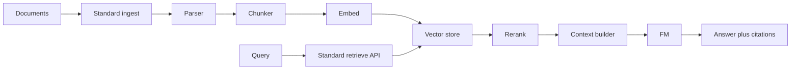

Standard **schemas** are how pieces stay swappable:

**Document**

```text
document_id
source
title
timestamp
security_attributes
metadata
content
```

**Chunk**

```text
chunk_id
document_id
text
source
metadata
access_attributes
```

**Retrieval result**

```text
chunk
score
source
citation
metadata
```

If every app invents its own citation JSON, the blotter UI, the eval harness, and Legal’s audit export all break when you change OpenSearch for pgvector.

With a stable retrieve contract:

```text
Change vector store
without rewriting the application interface.
```

Invariants: authn/authz filters on every retrieve, citation object shape, eval hooks, encryption. Configurable: corpus, chunker, embed model, `K`, rerank, generator profile — the same list as the opening RAG example.

Skill 1.4/1.5 own retrieval mechanics. 1.1.3 owns **not letting every desk reinvent the contract**.

---

### Standardized security controls

Highest-value standardization, because inconsistency here is an incident, not a style debate.

Reusable controls:

- IAM role templates (caller, KB, agent action)
- least-privilege policies (named models, named buckets)
- encryption defaults
- secrets in a standard store, never in prompts
- VPC interface endpoints for Bedrock
- document authorization filters (AuthN ≠ AuthZ — 1.1.1 already taught this)
- Guardrail attachment required by IAM condition
- agent tool permissions
- CloudTrail + invocation logging conventions

```text
Every GenAI application
       ↓
standard execution role
       ↓
only approved models
       ↓
only approved data
```

Developers should not rediscover “least privilege for Bedrock” any more than they rediscover TLS.

Enforcement is not the Lens. Enforcement is IAM, SCPs, required Guardrail identifiers, VPC endpoint policies. Guidance without enforcement is a poster.

---

### Standardized Guardrail profiles

Do not ask each team to design topic filters from scratch.

Ship **profiles**:

```text
general-internal-v2
finance-research-v3
customer-support-v1
healthcare-sensitive-v1
```

The app selects:

```text
guardrail_profile = finance-research-v3
```

Legal updates PII and denied-topic rules once. Eval packs for jailbreaks run against the profile, not against thirty homemade regexes.

Profiles can differ. That is configuration. The **attachment mechanism** (Converse + IAM condition) is invariant.

---

### Standardized agent tool interfaces

Agents fail at the tool boundary: credentials in code, unbounded loops, a Salesforce integration invented three times.

A tool contract should standardize:

```text
name
description
input schema
output schema
authentication
authorization
timeout
retry
audit logging
```

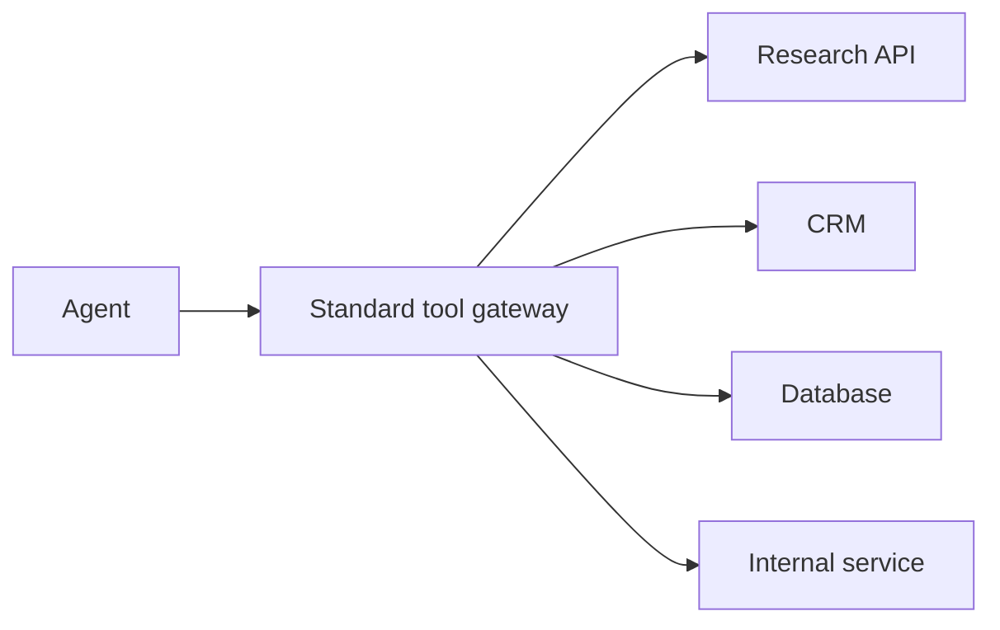

**AgentCore Gateway** is the managed connectivity layer between agents, tools, APIs, and models. **AgentCore Identity** is credentials for the *agent* to call systems — not a Cognito login screen for a human. Runtime hosts *your* agent code. 1.1.1 chose among Bedrock Agents, AgentCore, and Step Functions. 1.1.3 makes the **tool and identity path** a platform capability so Agent B does not store a second Salesforce token in a Lambda env var.

Application-specific: which tools this desk needs, the planner prompt, the business workflow. Shared: schema, auth, timeouts, audit, loop caps.

---

### Evaluation as a platform capability

One of the highest-leverage components. Skill 1.1.2 taught H-E-M-T-D for a single PoC. 1.1.3 makes that harness **the same object** every team runs.

Submit:

```text
input
output
expected behavior
retrieved evidence
configuration
```

Receive the same metric names:

```text
correctness
faithfulness
citation quality
retrieval quality
latency
cost
refusal behavior
safety
```

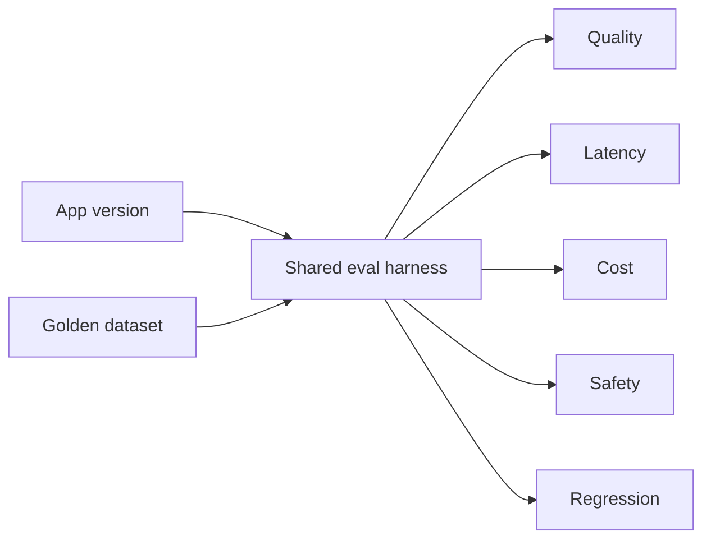

If Team A’s “accuracy” is human thumbs and Team B’s is an uncalibrated judge model, you cannot set a firm quality bar and you cannot detect regressions when you bump `rag-component` from v1 to v2.

CI should fail a prompt or retrieval change that drops a gate. That is how golden paths stay honest after week one.

---

### Standardized observability

Telemetry that cannot be joined is not a platform.

A GenAI request should carry, at minimum:

```text
request_id
application_id
user/session where appropriate
model_id / profile
prompt_version
retrieval_configuration
latency total and stages
input_tokens / output_tokens
guardrail result
tool calls
error type
cost estimate
```

If Team A reports “model latency” as SDK wall clock and Team B reports Bedrock-only time under a different name, the enterprise dashboard is fiction.

Standard dimensions enable the same alarms: P95, 429 rate, unsupported-answer rate, cost per successful task. CloudWatch on the caller; Bedrock invocation logging to S3 for prompt text; CloudTrail for *who called*. 1.1.1 distinguished those three. 1.1.3 puts them in the module so nobody ships an app that only logs `print(response)`.

---

### Standardized error handling

Each team inventing error semantics makes ops and UX diverge.

**Model calls:** retryable vs not, exponential backoff, retry cap, 429 handling, timeouts, fallback (smaller model, cached recap, “try again”), a stable user-facing error shape.

**Retrieval:** no evidence (refusal path), store down, partial results, stale-data flag.

**Agents:** tool unavailable, authorization failure, loop cap, malformed tool JSON.

The wrapper owns this. Applications handle **product** consequences (show the refusal; don’t open Jira). They should not each implement jittered backoff for `ThrottlingException`.

---

### Standardized APIs and schemas

Stable contracts decouple app teams from internals.

```text
POST /generate

request:
  task, model_profile, input, context, metadata

response:
  output, citations, model, prompt_version, latency, usage
```

The exact field names matter less than the idea: you can change model, retriever, vector store, or prompt implementation **behind** `/generate`. Consumers keep working.

That is how a platform earns the right to upgrade Sonnet or swap OpenSearch without a firm-wide rewrite.

---

### CI/CD for GenAI components

Not a generic DevOps chapter. The pipeline is how standards stay true after change.

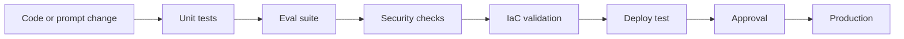

Gates that are GenAI-shaped: prompt regression vs golden set, retrieval Recall@K, Guardrail probes, IAM policy diff, module version compatibility. Rollback is “alias `prod` back to prompt 1.6” or “stack back to `rag-component@1.4`,” not “SSH and patch.”

If eval is optional in the pipeline, you have a documented standard and an unenforced one.

---

## Well-Architected as the review loop

Framework = pillars. Lens = GenAI questions. Tool = records the review. Findings that never become modules do not standardize anything.

### AWS Well-Architected Framework

The Framework is a **shared set of architectural questions**. It stops every team from defining “production quality” as whatever shipped.

Six pillars, with a GenAI example each:

| Pillar | GenAI-shaped question |
|--------|------------------------|
| **Operational excellence** | Can we see that a prompt/model/retrieval change made answers *subtly* worse? |
| **Security** | Can the model retrieve a chunk the user is not allowed to see? |
| **Reliability** | What happens on throttle, timeout, or a fluent wrong number? |
| **Performance efficiency** | Are we using an expensive model for a job a smaller one passes? |
| **Cost optimization** | Do we measure cost per successful task, not only tokens? |
| **Sustainability** | Are we keeping idle GPUs warm when on-demand Bedrock would do? |

The Framework is not a hosting service. It does not invoke models. It is not **Trusted Advisor** (automated account checks). When the stem says “align this design to AWS best practices,” you review against the Framework — and for GenAI, you attach the Lens.

---

### Generative AI Lens

The **Generative AI Lens** applies Well-Architected thinking to this kind of workload: model selection, prompts, RAG, agents, inference, evaluation, observability, cost, responsible AI, prompt injection, non-deterministic output.

```text
GenAI workload
      ↓
Well-Architected review
      ↓
Generative AI Lens questions
      ↓
Identify risks
      ↓
Improvement actions
      ↓
Feed improvements into standard architecture
```

The Lens is not a ceremony you run once after production. Findings are **inputs to reusable standards**. If five reviews find missing prompt versions, the golden-path module starts requiring Prompt Management. That is 1.1.3, not a ticket on Team C’s backlog forever.

---

### Well-Architected Tool

Keep the trio straight. The exam will flatten them.

| Piece | Job |
|-------|-----|
| **Framework** | Pillars and general principles |
| **Generative AI Lens** | Extra GenAI questions and best practices |
| **Well-Architected Tool** | Where you record the review, risks, and improvement plan |

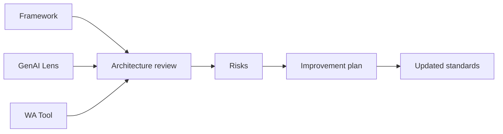

The Tool does not deploy your RAG stack. The Lens does not replace IAM. Together they **produce the punch list** that should change the CDK module.

> **Exam tip:** *Structured GenAI review across all considerations* → GenAI Lens. *Document the workload review* → WA Tool. *Encode the fix for the next team* → IaC / shared component.

---

### From review findings to standards

This is the heart of the skill.

Repeated finding: *inconsistent Bedrock retry logic.*

Wrong response: fix each Lambda as a one-off.

Right response:

```text
Review finding
      ↓
Repeated pattern
      ↓
Standard model client
      ↓
All applications inherit retry logic
```

Another: *nobody logs model and prompt versions.*

```text
Review finding
      ↓
Standard telemetry schema
      ↓
Shared middleware
```

Governance feedback → technical standardization. A Lens review that never changes a construct is theater.

---

## Platform, versioning, and exceptions

A usable golden path gets adopted. A three-week IAM ticket gets bypassed. Exceptions are documented, not tribal.

### An engineering design system

Frontend teams do not redraw buttons. They use a design system.

A mature GenAI org has the same idea:

```text
Bedrock client
RAG module
Agent tool interface
Guardrail profiles
Evaluation harness
Telemetry module
IAM templates
Deployment modules
```

Teams **assemble** approved components. They do not design encryption and citation JSON from zero. Workload-specific UI and research logic still live in the app — that is not the platform’s job.

---

### Platform engineering

When many teams consume the same capability **as a service**, you have a platform, not only a library.

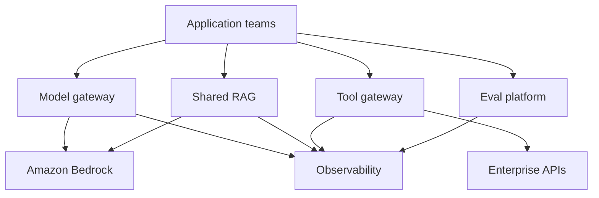

Possible capabilities: approved model access and routing, prompt registry, eval, RAG, security, tools, cost attribution, logging, deploy templates.

Tradeoff: centralize what benefits from consistency. Do not make every legitimate workload an exception ticket. A platform that requires a two-week review to change `top_k` will be bypassed.

---

### Local, shared, platform

Three levels of the same idea:

| Level | Meaning | Example |
|-------|---------|---------|
| **Local** | One app’s utility | Retry helper in Team A’s repo |
| **Shared component** | Many apps import/use the same implementation | `bedrock-client` Python package / CDK construct |
| **Platform capability** | Many teams call a service | Central model gateway |

```text
retry helper
  → shared Bedrock SDK wrapper
  → centralized model gateway
```

Move up the ladder when the problem is **repeated**, **critical**, and cheaper to operate once. Stay local when it is still an experiment (1.1.2) or truly unique business logic.

---

### Versioning reusable components

“Everyone always uses latest” is not an enterprise standard. Latest breaks consumers on a Tuesday.

Version:

- libraries and APIs (backward-compatible interfaces, deprecation windows)
- prompts, model profiles, Guardrail profiles
- IaC modules
- eval suites

```text
rag-component v1
      ↓
rag-component v2

Team A stays on v1 during earnings season
Team B adopts v2
```

Semantic versioning is the concept, not a product. The exam cares that **changes are explicit** and that old consumers are not silently mutated.

---

### Exceptions and escape hatches

Default: approved Model A.

A team shows evidence that Model B is required for a multimodal slide workload. The right system:

```text
Default
+
documented exception
+
review
+
evidence (a 1.1.2-shaped bake-off)
```

Not “no exceptions ever” (golden cage). Not “everyone does whatever they want” (the status quo 1.1.3 exists to end).

> **Governed flexibility beats both chaos and rigidity.**

Exceptions should expire or become a new **profile** if they repeat. Three desks needing multimodal is a candidate standard, not three snowflakes.

---

### Standardization lifecycle

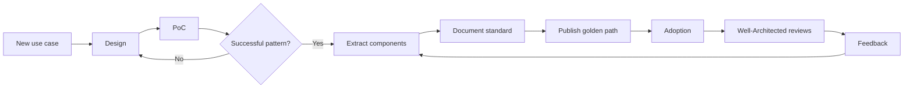

Standards evolve from production evidence. A PoC that just went GO is **not** automatically a firm-wide module. Extract after repetition and Lens-shaped risk show up.

---

### Decision framework: R-C-S-E

Memorize **R-C-S-E** — Repeat, Critical, Stable, Extensible.

#### Repeated

Does the problem show up across workloads?

#### Critical

Would inconsistency create security, reliability, cost, or operational risk?

#### Stable

Is the pattern understood well enough to encode (it survived 1.1.1 and 1.1.2)?

#### Extensible

Can it support legitimate variation without becoming a cage or a kitchen sink?

If all four are true, it is a strong candidate for a shared standard. If any is false, keep it local or wait.

```recall
Q: What does R-C-S-E ask?
A: Is the problem Repeated, Critical, Stable, and Extensible enough to encode as a standard?
```

---

### What not to standardize too early

```text
Repeated proven pattern  → candidate
One-off experiment       → not yet
```

Leave alone for now:

- a prompt that still changes daily in a PoC
- an unproven chunking trick from one corpus
- a model that won a single bake-off
- a novel agent graph with no production evidence
- premature abstractions (“universal GenAI OS”)
- workload-specific research logic

Standardizing an unproven pattern industrializes a guess. That is how 1.1.2 and 1.1.3 stay in order.

---

## Worked examples

### Worked example: enterprise RAG standard

Team A’s PoC passed. Three more investment teams want an assistant. Do **not** clone the notebook.

#### What becomes standard

| Piece | Standard |
|-------|----------|
| Data contract | `document_id`, ticker, type, timestamp, source, access classification |
| Ingest | Shared parser/chunker pipeline into the KB/store |
| Retrieve API | Query + metadata filters → ranked evidence + citation objects |
| Generation | Approved Bedrock client (allowlist, retries, tokens, Guardrail) |
| Security | Standard roles; document-level filters on every retrieve |
| Evaluation | Shared golden format and harness |
| Observability | Shared request schema |
| Delivery | CDK/CloudFormation `DeskRagStack` |

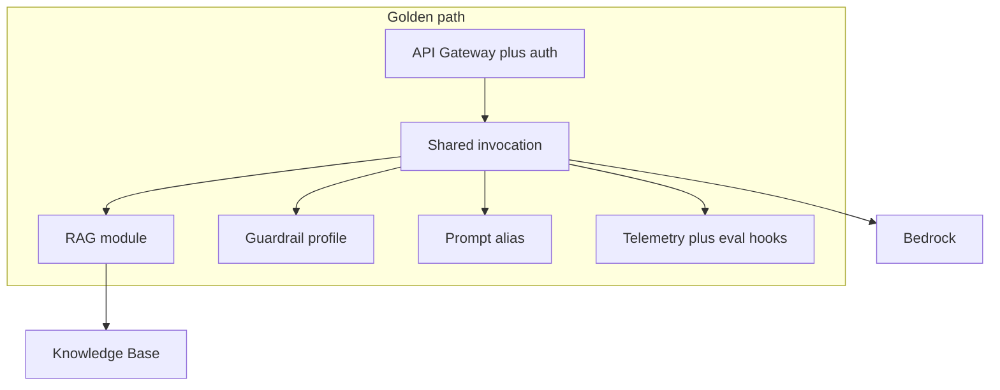

#### What stays configuration

```text
Team A: semiconductors corpus, k=8, sonnet profile
Team B: software corpus, k=12, rerank on
Team C: internet corpus, tighter ACL group

Same components. Different datasets and knobs.
```

Team C does not rewrite PrivateLink. They pass a prefix, a Guardrail profile, and a model profile into the stack.

---

### Worked example: agent platform

Several teams want agents over internal APIs.

Without a standard:

```text
Agent A: homemade Salesforce adapter, key in env
Agent B: another adapter, different error shape
Agent C: credentials in the prompt
```

With a standard:

```text
AgentCore Gateway / tool layer
standard tool schema
AgentCore Identity for outbound creds
audit logging
permissions, timeouts, loop caps
```

Shared: how a tool is exposed, authenticated, logged, and bounded. Application-specific: which tools this agent may call, the task prompt, HITL rules. If the path is always retrieve → summarize → Jira, 1.1.1 still says Step Functions — the platform should make that module as easy as the agent module, or people will use an agent because it is the only paved road.

---

## Anti-patterns, cues, and comparisons

### Anti-patterns

**Copy/paste architecture.** Clones diverge; fixes do not propagate.

**Golden cage.** The standard cannot express a legitimate multimodal or batch workload, so people leave.

**Lowest-common-denominator component.** Supporting every option in one blob makes it unusable. Split reference families.

**Central bottleneck.** Every `top_k` change waits on the platform team. Configuration exists for this.

**Standards without enforcement.** Beautiful ADRs; `InvokeModel` on `*` still ships.

**Enforcement without usability.** Painful path → shadow IT.

**One model for every workload.** Uniformity mistaken for architecture.

**One prompt for every use case.** Same mistake one layer up.

**No versioning.** Silent breakage.

**Security reimplemented in each app.** Thirty authorization bugs.

**Evaluation as afterthought.** Infra is shared; “good” is not.

**Logging without a schema.** Cross-app analysis is impossible.

**Standardizing an unproven pattern.** Skipping 1.1.2.

Each fails the same way: you either **fail to get consistency** or **fail to get adoption**. Skill 1.1.3 needs both.

---

### Exam recognition cues

| If the scenario says… | Think… |
|-----------------------|--------|
| Multiple teams independently implement the same capability | Reusable component |
| Enforce consistent infrastructure | IaC (CDK / CloudFormation) |
| Repeated architecture across workloads | Reference architecture |
| Approved default implementation | Golden path |
| Consistent model access | Wrapper / gateway + allowlist |
| Repeated RAG systems | Shared RAG component + schemas |
| Consistent safety controls | Guardrail profiles |
| Consistent quality measurement | Shared eval harness |
| Consistent logging | Telemetry schema |
| Review architecture against best practices | Well-Architected Framework |
| GenAI-specific architecture review | Generative AI Lens |
| Track a formal workload review | WA Tool |
| Controlled variation across teams | Configuration on a standard |
| Teams keep copying code | Shared library or service |
| Consistent environments | IaC / deploy templates |
| Align *and* enforce | Lens **and** templates, not one model |
| Account-level automated checks | Trusted Advisor — not this skill |

---

### Critical comparisons

#### Reference architecture vs reusable component

**Definitions.** Pattern vs installable implementation.  
**Example.** RAG diagram vs `DeskRagStack`.  
**Confusion.** A PDF is not a component.  
**Heuristic.** Can Team B deploy it this week?

#### Framework vs Lens vs Tool

**Definitions.** Pillars / GenAI questions / review recorder.  
**Example.** Reliability pillar → Lens question on 429s → Tool improvement item.  
**Confusion.** Tool hosts nothing; Lens is not Bedrock.  
**Heuristic.** Principles, extra questions, the form you fill.

#### Standard vs configuration

**Definitions.** Invariant vs approved knob.  
**Example.** Citation schema vs `top_k`.  
**Confusion.** Making the model a constant.  
**Heuristic.** Would inconsistency cause an incident? Standardize. Else configure.

#### Standardization vs governance

**Definitions.** Technical building blocks vs the process that reviews and enforces.  
**Example.** IAM module vs Lens review + SCP.  
**Confusion.** A policy PDF without a construct.  
**Heuristic.** Governance without components does not scale; components without governance drift.

#### Shared library vs shared service

**Definitions.** Import vs call.  
**Example.** Python client vs model gateway.  
**Confusion.** “Platform” when a package would do.  
**Heuristic.** Need a single control plane / quota / policy point → service; need local latency and simple reuse → library.

#### Golden path vs mandatory architecture

**Definitions.** Easy default vs only legal shape.  
**Example.** Internal RAG path vs forcing batch jobs through chat.  
**Confusion.** Paved road as prison.  
**Heuristic.** Defaults plus governed exceptions.

#### IaC vs console

**Definitions.** Encoded vs clicked.  
**Example.** CDK module vs “we set it up in us-east-1 last April.”  
**Confusion.** A runbook of console clicks.  
**Heuristic.** If you cannot instantiate it twice, it is not a standard.

#### Platform capability vs application logic

**Definitions.** Shared machine vs desk-specific behavior.  
**Example.** Retrieve API vs “internet thesis” prompt.  
**Confusion.** Putting research opinions in the platform.  
**Heuristic.** If only one desk cares, it is app logic.

#### Centralization vs decentralization

**Definitions.** One team owns the capability vs every app owns a copy.  
**Example.** Gateway vs thirty boto3 wrappers.  
**Confusion.** Centralize everything.  
**Heuristic.** R-C-S-E. If not repeated and critical, leave it.

#### Consistency vs flexibility

**Definitions.** Same invariants vs room to differ.  
**Example.** Same logs, different corpora.  
**Confusion.** Consistency = identical apps.  
**Heuristic.** Standardize invariants; configure the rest.

---

## AWS glossary for Skill 1.1.3

Targeted at reuse and review. Skill 1.1.1 already catalogued runtime architecture.

### Architecture governance

#### AWS Well-Architected Framework

**What it is.** Six-pillar review framework for workloads.

**Problem it solves.** A shared definition of production quality instead of thirty local ones.

**Where it sits.** Governance, not the request path.

**Typical use.** Design reviews that feed golden-path requirements.

**Pricing.** Guidance is free; your architecture still costs tokens and compute.

**Exam cue.** Align to AWS best practices (framework level).

**Do not confuse with.** Trusted Advisor or a model-hosting service.

#### AWS Well-Architected Generative AI Lens

**What it is.** Extra questions for prompts, RAG, agents, non-determinism, tokens, injection, eval.

**Problem it solves.** Classic pillars miss fluent-but-wrong and retrieval AuthZ.

**Where it sits.** Attached to a Well-Architected review.

**Typical use.** Review Team A’s RAG; turn findings into module requirements.

**Pricing.** None for the guidance.

**Exam cue.** Standardize / review GenAI across teams; structured GenAI-specific assessment.

**Do not confuse with.** Bedrock. The Lens does not invoke models.

#### AWS Well-Architected Tool

**What it is.** Console/API to record reviews, risks, and improvement plans.

**Problem it solves.** Track Lens findings so they become work, then standards.

**Where it sits.** Governance process.

**Typical use.** Document the research-assistant workload review.

**Pricing.** No charge for the tool.

**Exam cue.** Formal, tracked workload review.

**Do not confuse with.** The Lens content itself.

### Infrastructure and deployment

#### AWS CloudFormation

**What it is.** Declarative IaC templates.

**Problem it solves.** Repeatable stacks: IAM, logging, APIs, Bedrock permissions.

**Where it sits.** Delivery of the golden path.

**Typical use.** Nested stack for `DeskRag`.

**Pricing.** Service resources you launch; the template is free.

**Exam cue.** Shared templates that embed organizational standards.

**Do not confuse with.** A wiki architecture diagram.

#### AWS CDK

**What it is.** IaC in real languages; synthesizes CloudFormation.

**Problem it solves.** Reusable **constructs** (versioned modules) for the design system.

**Where it sits.** Same as CloudFormation, friendlier for shared libraries.

**Typical use.** `new DeskRagStack({ modelProfile, guardrail, prefix })`.

**Pricing.** Same as the deployed resources.

**Exam cue.** Reusable constructs / golden-path modules.

**Do not confuse with.** Application runtime (Lambda is what it deploys).

#### CI/CD (CodePipeline or equivalent)

**What it is.** Automated test → eval → deploy path.

**Problem it solves.** Prompt/IaC changes cannot skip quality and security gates.

**Where it sits.** Delivery.

**Typical use.** Eval harness in the pipeline before `prod` alias move.

**Pricing.** Pipeline and compute for jobs.

**Exam cue.** Consistent environments and rollback; eval as a gate.

**Do not confuse with.** Manual weekly output sampling as the only control.

### GenAI platform

#### Amazon Bedrock (as a platform substrate)

**What it is.** Managed FM API plus KB, Guardrails, Prompt Management, evaluations.

**Problem it solves.** Standardize on one invocation surface so wrappers and IaC stay simple.

**Where it sits.** The AI plane every golden path calls.

**Typical use.** Approved profiles via the shared client, not raw model IDs in each app.

**Pricing.** Tokens, KB, Guardrails, eval jobs as used.

**Exam cue.** Default FM access inside the standard — still not “one model.”

**Do not confuse with.** The Lens or WA Tool.

#### Bedrock Knowledge Bases

**What it is.** Managed RAG ingest/retrieve.

**Problem it solves.** A default retrieve implementation behind a stable interface.

**Where it sits.** Optional module on the RAG golden path.

**Typical use.** Team B points a prefix at the standard KB module.

**Pricing.** Embeddings, storage, retrieve/generate.

**Exam cue.** Repeated RAG systems — share the component, configure the corpus.

**Do not confuse with.** Fine-tuning as a knowledge standard.

#### Amazon Bedrock Guardrails

**What it is.** Named content policy on input/output.

**Problem it solves.** Profile-based safety instead of per-team filters.

**Where it sits.** Required attachment on the standard Converse call.

**Typical use.** `finance-research-v3` selected in config.

**Pricing.** Per text unit evaluated.

**Exam cue.** Consistent safety controls across apps.

**Do not confuse with.** IAM or retrieval ACLs.

#### Bedrock Prompt Management

**What it is.** Versioned prompts with aliases.

**Problem it solves.** Prompts as release artifacts on the golden path.

**Where it sits.** Between the wrapper and Runtime.

**Typical use.** `prod` alias promoted after eval.

**Pricing.** Low; tokens still bill on invoke.

**Exam cue.** Treat prompts as code; subtle quality failures.

**Do not confuse with.** AppConfig for *model IDs* (related, different object).

#### AgentCore Runtime, Gateway, and Identity

**What it is.** Host *your* agent; managed tool connectivity; outbound credentials.

**Problem it solves.** Standardize agent hosting and tool boundaries without each team rolling ECS + homemade OAuth.

**Where it sits.** Agentic golden path.

**Typical use.** Shared gateway to CRM/research APIs; Identity for the agent’s creds.

**Pricing.** Runtime and related AgentCore usage.

**Exam cue.** Multiple teams building agents against internal APIs.

**Do not confuse with.** Bedrock Agents (AWS-managed ReAct) or Cognito (human login).

### Security / operations

#### IAM

**What it is.** Who may call which APIs on which resources.

**Problem it solves.** Least privilege as a template, not a puzzle.

**Where it sits.** Every golden-path role.

**Typical use.** Named models; required Guardrail identifier; no `s3:*`.

**Pricing.** Free; misconfiguration is not.

**Exam cue.** Enforcement of standards.

**Do not confuse with.** Guardrails or the Lens.

#### Amazon CloudWatch

**What it is.** Metrics, logs, alarms.

**Problem it solves.** Shared telemetry schema actually queried the same way.

**Where it sits.** Standard wrapper and API layer.

**Typical use.** P95, 429s, token counts with `application_id`.

**Pricing.** Ingestion and storage.

**Exam cue.** Consistent logging / operability.

**Do not confuse with.** Quality scores (eval harness) or CloudTrail.

#### AWS CloudTrail

**What it is.** API audit log.

**Problem it solves.** Standard “who invoked / who changed” across apps.

**Where it sits.** Account/org trail; part of the security module.

**Typical use.** Audit of `InvokeModel` and template deploys.

**Pricing.** Trail and data events.

**Exam cue.** Auditability of the standard.

**Do not confuse with.** Prompt-text invocation logging.

---

## Practice questions

Pick an answer on every stem. The explanation appears after you choose — later questions stay unspoiled until you answer them.

```practice
Q: Five desks each built a Bedrock Lambda with different retry logic, logging, and IAM. Leadership wants the next desk to inherit a safe default. What should you create?
A: A wiki page listing recommended retries
B: A reusable invocation wrapper (library and/or IaC) with retries, telemetry, and least-privilege roles
C: A mandate that all desks use the same foundation model
D: Trusted Advisor for each account
correct: B
feedback: 1.1.3 wants consumable components. A wiki will not unify IAM. One model is the wrong invariant. Trusted Advisor is not a design standard.

Q: An enterprise wants GenAI standards that are both **reviewable against AWS best practices** and **actually deployed the same way**. Which pair best matches that?
A: Manual code review only, plus one shared notebook
B: Well-Architected GenAI Lens reviews plus shared CloudFormation/CDK templates
C: Amazon Q Developer completions for every engineer
D: A single firm-wide prompt for all use cases
correct: B
feedback: Guidance + encoded infrastructure. Completions and a universal prompt do not enforce architecture. Notebooks are not a platform.

Q: What is the Generative AI Lens?
A: A Bedrock API that hosts models more securely
B: GenAI-specific Well-Architected guidance and questions
C: An automated account scanner like Trusted Advisor
D: A vector store optimized for citations
correct: B
feedback: Lens = GenAI Well-Architected content. Not a host, not Trusted Advisor, not a vector DB.

Q: A team needs to **record** a workload review, risks, and improvement items. Which mechanism is that?
A: Amazon CloudWatch dashboards
B: AWS Well-Architected Tool
C: Bedrock Guardrails
D: AWS CloudFormation
correct: B
feedback: The Tool records reviews. CloudWatch is ops; Guardrails are content policy; CloudFormation deploys.

Q: Three RAG apps emit citations as free-text, as PDF page numbers, and as S3 URIs. Eval and Legal cannot compare them. What should be standardized first?
A: A single embedding model for the firm
B: A shared citation / retrieval-result schema on a standard retrieve interface
C: Provisioned Throughput
D: EKS so networking is consistent
correct: B
feedback: Invariant schema. One embed model or PT/EKS does not fix incomparable citations.

Q: The golden path requires Model Profile A. A multimodal team produces a PoC showing Profile B is required and still meets gates. What is the right move?
A: Forbid B forever so the standard stays clean
B: Let every team pick any model
C: Documented exception with review and evidence; promote a new profile if the need repeats
D: Rewrite the entire platform around B immediately
correct: C
feedback: Governed flexibility. A and B are cage vs chaos. D standardizes an exception globally without evidence it repeats.

Q: Repeated Well-Architected reviews find that apps do not log `prompt_version` or `model_id`. What should happen next?
A: Ask each team to remember
B: Encode a telemetry schema in the shared client/module so new apps inherit it
C: Disable invocation logging for latency
D: Switch all workloads to SageMaker for better logs
correct: B
feedback: Findings → shared telemetry. Memory, disabling logs, or SageMaker-for-logs miss the skill.

Q: Why is “everyone must use Claude” a poor 1.1.3 control?
A: Claude cannot be called from Lambda
B: Architectural standards are about invariant controls and reusable components, not one model for every task
C: The GenAI Lens forbids named models
D: Standardization always requires open-source models
correct: B
feedback: Configure models from an allowlist. A, C, D are false.

Q: Team A’s RAG PoC just passed 1.1.2 gates. Three other desks might want something similar next year. Should you publish it as the firm-wide module this afternoon?
A: Yes — any successful PoC is a standard
B: Not yet — wait until the pattern is repeated, stable, and encoded with configuration points (R-C-S-E)
C: Yes, but only as a PDF
D: Never standardize RAG; it is always bespoke
correct: B
feedback: Do not standardize experiments. R-C-S-E. PDFs are not components. RAG is a prime standard *once proven*.

Q: Developers bypass the approved path because it takes three weeks to get an IAM role, while a homemade Lambda takes a day. What failed?
A: The Lens, which should block deploys
B: Usability of the golden path — the secure option is not the easy option
C: Model selection, which must be reduced to one model
D: Evaluation, which is out of scope for 1.1.3
correct: B
feedback: Painful paths get bypassed. The Lens does not replace a usable module.

Q: You want to change the vector store without rewriting desk UIs. What design enables that?
A: Each UI queries OpenSearch with a custom DSL
B: A stable retrieve API/schema; swap the store behind it
C: Fine-tune so retrieval is unnecessary
D: Put vector SQL in every frontend
correct: B
feedback: Stable contracts. DSL-in-the-UI and fine-tune-as-library are 1.1.1 traps.

Q: What is the best description of a golden path?
A: The only architecture legally allowed in the company
B: An approved default that makes the sound implementation the easiest one, with governed exceptions
C: A Trusted Advisor rule
D: A single prompt shared by all applications
correct: B
feedback: Easy approved default, not a prison.

Q: A platform team puts research-thesis wording and ticker-specific business rules into the shared RAG module. Desk apps have nothing left to configure except the logo. What anti-pattern is this?
A: Platform capability mixed with application logic; the module becomes a lowest-common-denominator cage
B: Correct — business logic belongs in IaC
C: Missing Guardrails
D: Failure to use the WA Tool
correct: A
feedback: Keep desk logic in the app; keep machine invariants in the platform.

Q: Which pipeline step is most characteristic of **GenAI** standardization rather than generic CI?
A: Unit-testing a JSON parser
B: Running the shared eval harness (quality, retrieval, safety) before promoting a prompt alias
C: Linting Python
D: Building a container image
correct: B
feedback: Eval-as-gate is the GenAI-shaped pipeline. The others are generic.

Q: Agent teams each store CRM credentials differently; two leaked into logs. Which standardization is the direct fix?
A: A larger generator model
B: Standard tool gateway plus AgentCore Identity (or equivalent) with audit logging and least privilege
C: Turning off CloudTrail
D: One prompt for all agents
correct: B
feedback: Tool/identity standardization. Bigger models do not store secrets correctly.

Q: Framework vs Lens vs Tool — which mapping is correct?
A: Tool = pillars; Lens = recorder; Framework = Bedrock feature
B: Framework = pillars; Lens = GenAI questions; Tool = records the review
C: Lens = IAM; Tool = Guardrails; Framework = CDK
D: All three invoke models
correct: B
feedback: The trio you must not shuffle.

Q: Shared library or shared service? You need a **single** place to enforce model allowlists, quotas, and cost attribution for 40 apps.
A: A copy-pasted retry snippet
B: A centralized model gateway (platform capability), possibly plus a thin client
C: A new Region per team
D: Notebooks only
correct: B
feedback: Central control plane → service. Snippets diverge.

Q: Improvement items from Lens reviews sit in a spreadsheet. Six months later every app still has unique IAM. What was missing?
A: More pillars
B: Turning findings into versioned technical components (IaC/policies) that new workloads must use
C: A requirement that all teams use batch inference
D: Deleting the golden path
correct: B
feedback: Reviews that never become modules do not standardize anything.
```

---

## Scenario drills

### Scenario A

Five teams each have different Bedrock retry logic.

**Answer.** Repeated + critical (429 storms, user-visible failures) + stable pattern. Extract a standard model client (library or gateway) with backoff, caps, and telemetry. Do not write five runbooks.

### Scenario B

Every RAG app uses different citation formats and retrieval metrics.

**Answer.** Standardize the retrieval result / citation schema and put the shared eval harness on that schema (Recall@K, faithfulness, citation correctness). Corpora and `K` stay configurable.

### Scenario C

One business unit needs a model not in the standard set.

**Answer.** Do not change the global default on a hunch. Run a 1.1.2-style bake-off, file an exception, review residency/cost/safety. If two more units need it, add an approved **profile**, not a fork of the platform.

### Scenario D

Well-Architected reviews keep finding the same observability gap.

**Answer.** Stop fixing apps one by one as the primary strategy. Add the fields to the shared wrapper/module, version it, require it on the golden path, track adoption. Use the WA Tool so the improvement item closes when the construct ships.

---

## Final compressed review

### What Skill 1.1.3 means

Turn **proven** patterns into reusable technical components so multiple deployments stay consistent in security, eval, ops, and delivery.

### 1.1.1 → 1.1.2 → 1.1.3

Design the architecture. Prove it. Pave it.

### What to standardize

Invariants: auth, IAM shape, encryption, logging schema, citation contract, eval hooks, retries, Guardrail attachment, deploy modules.

### What to configure

Corpus, knobs (`K`, chunking, rerank), model **profile**, Guardrail **profile**, desk-specific prompts and business logic.

### Reference architecture vs component

Recommended pattern vs something Team B can deploy.

### Golden path

The easy approved default ≠ the only legal architecture.

### Why IaC

Standards that cannot be instantiated twice are documentation.

### Why shared eval

Otherwise every team invents “good,” and upgrades are blind.

### Framework vs Lens vs Tool

Pillars / GenAI questions / the recorder. Findings should change the module.

### R-C-S-E

Repeat, Critical, Stable, Extensible — or do not encode it yet.

### Ten exam cues

1. Multiple teams, same capability → reusable component  
2. Align to best practices → Well-Architected  
3. GenAI-specific review → Lens  
4. Record the review → WA Tool  
5. Enforce infrastructure → IaC  
6. Guidance **and** enforcement → Lens + templates (not one model)  
7. Not Trusted Advisor, not Q Developer  
8. AuthN ≠ chunk AuthZ still applies in the standard  
9. Prompts as versioned artifacts  
10. Fluent-but-wrong → quality metrics, not only 5xx  

### Ten mistakes

1. Wiki as the standard  
2. Standardizing a PoC  
3. One model / one prompt for all  
4. Golden cage  
5. Kitchen-sink component  
6. No enforcement  
7. Unusable path (bypass)  
8. No versioning  
9. Logs without a schema  
10. Reviews that never become code  

Walk every 1.1.3 stem with:

```text
successful pattern
  → reusable component
  → approved defaults
  → controlled configuration
  → consistent implementation
```

and

```text
Standardize invariants. Configure legitimate variation.
```

If you can explain how Team A’s research assistant becomes a stack Teams B–D configure — Lens-reviewed, IaC-provisioned, eval-gated — you are doing Skill 1.1.3.
