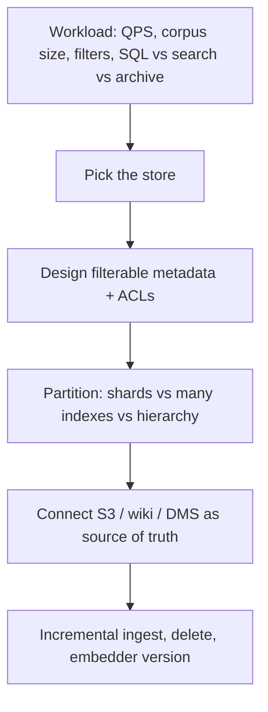
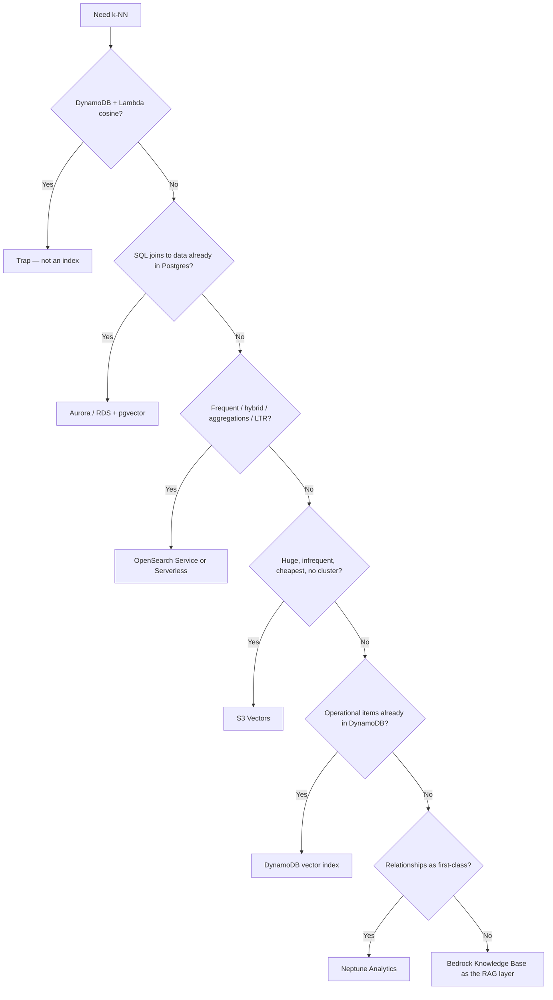
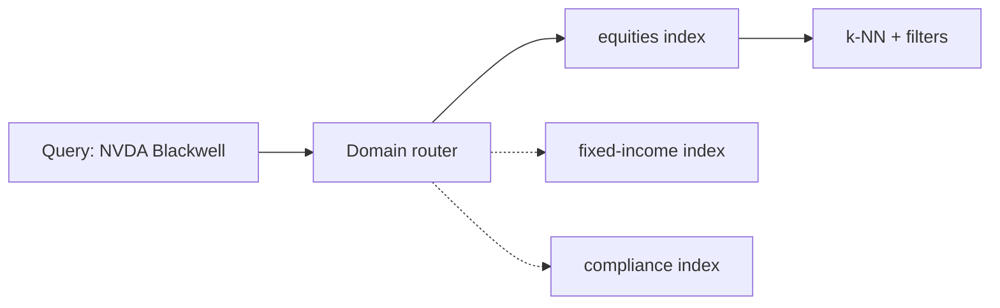

# Vector Store Solutions

**Domain 1 · Task 1.4 · Skills 1.4.1–1.4.5**

> **1.4.1** Create vector-database architectures for FM augmentation (Bedrock Knowledge Bases, OpenSearch Neural plugin, RDS + S3, DynamoDB beside a vector store).  
> **1.4.2** Build metadata frameworks that make retrieval precise (S3 object metadata, custom attributes, domain tags).  
> **1.4.3** Scale the index (OpenSearch sharding, multi-index domains, hierarchical indexing).  
> **1.4.4** Connect the index to real sources (document systems, knowledge bases, internal wikis).  
> **1.4.5** Keep the index current (incremental updates, change detection, sync, scheduled refresh).

This task is not “add RAG.” It tests whether you can pick **the shelf that holds the vectors**, label the boxes, partition the warehouse, hook it to the filing cabinet, and keep the copies honest.

Walk this scenario as you read:

> The research desk has tens of millions of earnings-call paragraphs plus 10-Ks, 8-Ks, and analyst notes in S3. Sometimes a PM pastes a Jensen line and asks who else sounded like that. That is infrequent archive search. A live blotter that must match ticker `NVDA` *and* meaning, all day, is a different shelf. IR will drop a new 10-K at 8:01am and delete yesterday’s FAQ at 8:02am. Technology analysts must never retrieve healthcare-only notes.

By the end you should be able to name which AWS product is the right *kind of shelf*, which labels must exist before k-NN runs, when one giant index is the wrong architecture, what the source of truth is, and which pipe updates the derived copy.

---

## What Task 1.4 actually tests

An **embedding** is a list of numbers that stands in for meaning. Similar sentences land near each other. A **vector store** keeps those lists and answers “what is closest to this?” (k-nearest neighbors).

```text
Where do vectors live?          →  1.4.1  pick the backend
What metadata lives beside them? →  1.4.2  filterable labels + ACLs
How does the index scale?       →  1.4.3  shards, many indexes, hierarchy
What feeds the index?           →  1.4.4  derived copy of S3 / wiki / DMS
How does it stay correct?       →  1.4.5  upsert, replace, delete, reindex
```



> **Exam tip:** Three logos can do k-NN. The stem asks who still bills you when nobody is searching — and whether you are even looking at an index.

---

## Skill 1.4.1 — Pick the backend from the workload

A **vector store** is the shelf that holds embeddings and answers “what is closest to this query vector?” k-nearest neighbors. Several AWS products can do that. The skill is not naming them. It is matching **this workload** to **this kind of shelf**.

Start from how the desk actually searches, not from “OpenSearch is for search.”

| What the workload looks like | Why that changes the shelf |
|------------------------------|----------------------------|
| A PM pastes a Jensen line twice a week across tens of millions of paragraphs | Huge corpus, **infrequent** lookup, you want almost no idle bill |
| 200 analysts filter `ticker = NVDA` all day, mix keyword `H100` with meaning | **Hot** QPS, hybrid search, aggregations — a staffed search engine |
| The facts already live in Postgres and you need SQL joins next to k-NN | Keep vectors **beside the tables** (pgvector), not a second search cluster |
| Items are already DynamoDB records and you need “similar to this item” | A **DynamoDB vector index** on those items — not Lambda cosine over scans |
| You want managed RAG (ingest, retrieve, cite) without operating an index | **Bedrock Knowledge Bases** as the RAG layer on top of a store |

Five questions decide the row: **how often** people search, **how large** the corpus is, **how tight** the latency budget is, **what you already store** (SQL vs objects vs items), and **which search features** you actually need (keyword + vector, filters, aggregations). Then pick. The flowchart below is that interview, not a product tour.

The one trap that is never a backend: scanning DynamoDB in Lambda and computing cosine yourself. That is an O(N) loop, not an index.



### Amazon S3 Vectors — warehouse with a doorbell

**S3 Vectors** is a different bucket type whose payload is vectors, not PDFs. Inside a **vector bucket** you create **vector indexes**. You pay for storage and the queries you run. AWS runs it. Writes are strongly consistent. Infrequent queries come back in under a second; hotter indexes around ~100 ms. IAM uses the `s3vectors` namespace, not `s3`.

This is the official pick when the stem is **huge scale + infrequent lookup + no infrastructure + most cost-effective** (50 million medical images; tens of millions of call paragraphs a PM searches twice a week).

```python
import boto3

s3vectors = boto3.client("s3vectors")
s3vectors.put_vectors(
    vectorBucketName="desk-vectors",
    indexName="transcripts",
    vectors=[{
        "key": "nvda-fy26-q1-p12",
        "data": {"float32": embedding},
        "metadata": {"ticker": "NVDA", "year": 2025, "document_type": "earnings_call"},
    }],
)
hits = s3vectors.query_vectors(
    vectorBucketName="desk-vectors",
    indexName="transcripts",
    queryVector={"float32": query_embedding},
    topK=8,
    filter={"ticker": "NVDA"},
)
```

S3 Vectors can sit **behind a Bedrock Knowledge Base**. You can also **export a snapshot** of an S3 vector index into OpenSearch Serverless when QPS climbs. That export is a **point-in-time copy**, not a live sync — later updates need their own strategy (1.4.5).

### OpenSearch — the staffed search desk

**OpenSearch Service** (managed cluster) and **OpenSearch Serverless** are search engines that also do k-NN. Keyword, filters, aggregations, faceting, and **hybrid** (BM25 + vector) live here. **Learning to Rank** reorders hits for what an analyst actually clicks.

Serverless still bills **OCUs** (OpenSearch Compute Units) to keep the desk ready. Frequent, low-latency, high-QPS search is what that bill is for: 200 analysts during market hours. It is the expensive wrong shape for occasional reference lookup.

**VECTORSEARCH** is the Serverless collection type for embeddings. **SEARCH** collections use inverted indexes and perform poorly for k-NN. **TIMESERIES** is logs. The exam loves “slow vector queries” caused by the wrong collection type.

```quickcheck
Q: OpenSearch Serverless is returning slow k-NN queries. The collection type is SEARCH. What is the fix?
A: Switch to a VECTORSEARCH collection
B: Add more Lambda concurrency in front of it
C: Change the collection type to TIMESERIES
correct: A
feedback: VECTORSEARCH collections are optimized for k-NN. SEARCH collections are keyword indexes. TIMESERIES is for logs.
```

#### Neural plugin — embed inside OpenSearch

Skill 1.4.1 names **OpenSearch Service with the Neural plugin** for Bedrock integration and **topic-based segmentation**.

The Neural plugin runs embeddings **inside OpenSearch** instead of you embedding in Lambda and stuffing k-NN queries by hand:

- Text query → OpenSearch calls a Bedrock embedding model → semantic pipeline
- Often combined with keyword in one hybrid query
- Topic-based segmentation = separate indexes or ingest pipelines per domain (equities vs fixed income vs compliance), then search the right one

```json
{
  "query": {
    "hybrid": {
      "queries": [
        { "match": { "content": "Blackwell supply" } },
        {
          "neural": {
            "content_embedding": {
              "query_text": "Blackwell supply",
              "model_id": "bedrock.titan-embed-text-v2",
              "k": 10
            }
          }
        }
      ]
    }
  }
}
```

Use the Neural plugin when you **own the OpenSearch cluster** and want Bedrock embeddings without a separate embedding Lambda. Use Bedrock Knowledge Bases when you do not want to operate OpenSearch at all. Hybrid **score fusion** and rerank live in [1.5](/learn/1/retrieval-mechanisms).

### Aurora / RDS PostgreSQL + pgvector — the SQL shop

**pgvector** adds a vector column and distance operators to PostgreSQL. Nearness *and* `JOIN` to revenue, ticker, patient id. You run instances (RDS) or Aurora and pay at 3am.

Official 1.4.1 also lists **Amazon RDS with Amazon S3 document repositories**: S3 holds the source files (PDFs, HTML, wikis); RDS holds embeddings plus foreign keys back to the S3 object.

```
S3 object (document, version, metadata)
        ↓ ingest
RDS/Aurora row: embedding, s3_uri, title, acl, updated_at
        ↓ query
k-NN in RDS → fetch bytes or a signed URL from S3 only for the hits
```

Use this when documents must stay in S3 (lifecycle, versioning, Object Lock) but you want SQL joins on the vector results. “RDS + S3” is the exam wording when the stem already has RDS. Aurora pgvector is the managed flavor of the same idea.

```sql
SELECT chunk_id, s3_uri,
       1 - (embedding <=> query_embedding) AS similarity
FROM call_chunks
JOIN fundamentals USING (ticker)
WHERE ticker = 'NVDA'
  AND fiscal_year >= 2025
ORDER BY embedding <=> query_embedding
LIMIT 8;
```

`<=>` is cosine distance, `<->` is L2, `<#>` is negative inner product.

```recall
Q: When is Aurora / RDS pgvector the right vector store?
A: When you already live in PostgreSQL and need k-NN plus SQL joins/filters on the same row. Not when the stem says no infrastructure and infrequent cheapest search.
```

### DynamoDB — three different jobs, one logo

DynamoDB is no longer “key-value only.” Split the stem:

| Pattern | What it is | Exam fate |
|---------|------------|-----------|
| **Lambda cosine over a table** | Page items, compute similarity in your code | **Always a trap.** Not an index. |
| **Native vector index** | ANN over an embedding attribute on items that already live in DynamoDB | Right when operational state is already here. Wrong for a huge, rarely queried archive. |
| **Metadata beside a vector store** | `doc_id →` ticker, ACL, URL after k-NN returns ids | The pairing the skill guide still names: DynamoDB **with** a vector database |

```
Query → vector DB (top-k IDs)
      → DynamoDB BatchGetItem(ids) for title, owner, ACL, s3_uri
      → filter/authorize
      → send surviving chunks to the FM
```

There is also a DynamoDB → OpenSearch **zero-ETL** path when you need richer full-text on top of the operational table.

> **Important:** An official sample still offers “DynamoDB + Lambda similarity.” That option is wrong even though native vector indexes now exist. Read the *option*, not the logo. Lambda cosine is never the engine. Native DynamoDB k-NN is still the wrong shelf for “50 million, infrequent, cheapest, no cluster.”

### Neptune Analytics — GraphRAG

Use it when **relationships** matter as much as similarity: `NVDA → uses → TSMC → CoWoS`. Do not reach for it when the job is “who else sounded like Jensen.”

### Bedrock Knowledge Bases — the librarian, not always the warehouse

A Knowledge Base is the **RAG layer**: connect a data source, chunk, embed, retrieve (and optionally generate). The vectors underneath may be **Bedrock-managed** or a store you name (OpenSearch Serverless, Aurora, S3 Vectors, Neptune, Pinecone, Redis, MongoDB Atlas, …).

> “KB = always a pointer, never a store” is no longer true. A Knowledge Base is the RAG layer. The infrastructure underneath may be managed or explicit.

Skill 1.4.1’s “hierarchical organization” here means: multiple data sources, S3 prefixes, and parent/child structure the KB can maintain. **Hierarchical chunking** (parent ~1000 tokens, child ~500) is the retrieval tactic — that lesson is [1.5](/learn/1/retrieval-mechanisms).

When the stem says **minimal operational overhead**, **two-week production RAG**, **no search experience**, start with a Knowledge Base and a managed vector store. When the stem needs shard formulas, Neural plugin pipelines, or billion-scale hybrid, you are in OpenSearch.

```fillin
Infrequent, huge, cheapest, no cluster → {{S3 Vectors}}. Frequent semantic + keyword / hybrid → OpenSearch. Existing SQL + vectors → Aurora / RDS pgvector.
```

### DocumentDB / MemoryDB / Kendra — adjacent, not the default

DocumentDB / MongoDB Atlas or MemoryDB appear when the application **already lives there**. They are not the default for a 50-million-vector archive.

**Amazon Kendra** is enterprise **document search** (files, FAQs, access control) — not the RAG vector store the blotter uses to ground an FM. If the stem is “search the intranet,” Kendra can win. If the stem is “retrieve chunks for generation,” it is a distractor.

---

## Skill 1.4.2 — Metadata is half the index

A vector without metadata is only half an index. The number list is meaning. The labels are ticker, year, document type, ACL. You need both.

**Semantic condition:** meaning ≈ “Blackwell supply constrained.”  
**Metadata condition:** `ticker == NVDA AND fiscal_year >= 2025 AND document_type == earnings_call`.

```text
Filter (ticker, ACL, date, type)  →  shrink the search space
Vector search                    →  closest meaning among what remains
Top K                            →  hits the blotter actually sees
```

The official insurance-style item is two steps, not one:

1. **Ingest** `policy_type` and `state` as metadata (S3 sidecar `.metadata.json`).
2. **Query** with `retrievalConfiguration.filter` on Retrieve / RetrieveAndGenerate.

Tagging without filtering still returns Texas home-insurance chunks for a California auto question. Filtering without tags has nothing to constrain. A bigger embedding model will not separate “auto claim” in CA from “auto claim” in TX — those sentences are semantically similar. Two hundred Knowledge Bases (one per type×state) is operational theater.

### Sidecar files on S3

```
filings/
  NVDA-FY26-10K.pdf
  NVDA-FY26-10K.pdf.metadata.json
```

```json
{
  "metadataAttributes": {
    "ticker": "NVDA",
    "document_type": "10-K",
    "fiscal_year": 2025,
    "access_level": "internal",
    "desk": "tech-research"
  }
}
```

S3 object metadata and tags can carry timestamps, authorship, and domain classification. Custom attributes on the vector (or in the sidecar) are what Bedrock KB actually filters on. Plan the schema **before** bulk ingest — adding a filter field later usually means re-processing.

### Filterable vs display / lineage

S3 Vectors (and similar stores) split metadata. Put **query predicates** in filterable fields (ticker, year, document_type, region, permission_group). Put **display / lineage** in non-filterable (long source description, display title, large provenance payload). Filterable fields have different limits and costs. Do not stuff a 4k provenance blob into the filter set.

Filter syntax is **backend-specific**. Learn the idea (metadata predicate AND vector similarity), not one universal JSON blob. Bedrock Knowledge Base retrieval filters support equality, comparison, inclusion, and logical combinations — not every operator on every store.

### Pre-filter vs post-filter

**Pre-filtering** narrows candidates, then runs k-NN. Faster, and the result set is already authorized.

**Post-filtering** (retrieve 50, Lambda-drop the wrong state) wastes retrieval budget. If the true CA auto chunks were #51–#60 semantically, you return nothing useful.

```recall
Q: Retrieval returns Texas home-insurance docs for a California auto question. Embeddings look fine. What two steps fix it?
A: (1) Add policy_type and state as metadata at ingest (`.metadata.json`). (2) Apply those filters on Retrieve/RetrieveAndGenerate. Not post-filter in Lambda, not 200 KBs, not a bigger embedder.
```

### ACLs constrain retrieval, not just the answer

Do not vector-search the whole corpus and redact afterward. Derive the allowed scope from the user identity, put that in the metadata filter, then search.

Document A: `allowed_groups = ["tech-research"]`. Document B: healthcare only. A technology analyst asking “what is management saying about AI demand?” must never retrieve B. Bedrock S3 data sources can carry document-level ACL metadata and incremental sync.

> **Exam tip:** Authorization constrains retrieval, not merely the answer text. Filter first. k-NN second.

---

## Skill 1.4.3 — Scale the index, do not just add hardware

One giant index is not always the answer. 150 million legal chunks across 40 practice areas, where **each query targets exactly one area**, should not scan 150 million vectors.

**Shards** partition an OpenSearch index so more data spreads across more workers. **Replicas** are copies for availability and read capacity. Sharding **parallelizes** the same search. It does not shrink the search space. If every query still evaluates all 150 million vectors, 40 shards instead of 3 just distributes the same work.

**Multi-index** is the 1.4.3 exam move when queries have a known domain: 40 indexes, router sends “immigration” to the immigration index (~3.75 million vectors). Smaller search space, domain-specific tuning, isolation, different retention and security, independent scaling.



Adding data nodes without changing index structure improves **throughput** (queries per second). It does not fix per-query latency when the bottleneck is search **scope**. Shrinking dimensions (1536 → 384) makes each comparison cheaper and can hurt quality — and you still scan 150 million vectors.

```quickcheck
Q: Each query targets one of 40 practice areas but the single index scans all 150 million vectors. p95 is 3.2s against a 500ms SLA. What change helps most?
A: Increase shards from 3 to 40 on the one index
B: Create one index per practice area and route each query
C: Reduce dimensions from 1536 to 384
D: Add data nodes and leave the index alone
correct: B
feedback: Scope reduction beats a faster full scan. More shards / nodes still evaluate 150 million vectors. Smaller dimensions still scan everything and can hurt legal retrieval quality.
```

### Hierarchical indexing is architecture, not chunking

A **hierarchical index** is: Company → Document → Section → Chunk, or a coarse index (which filing?) then a fine index (which passage?). Query → which company/document? → which section? → which chunk?

That is 1.4.3. **Hierarchical chunking** (parent/child token sizes inside a Knowledge Base) is 1.5.

### Hot archive + hot desk

Keep 2018–2025 transcripts on **S3 Vectors** (cheap / massive). Keep the current four quarters on **OpenSearch** (fast / hybrid / analytics). Export from S3 Vectors into OpenSearch Serverless if you need to promote a slice. Remember: export is a **snapshot**.

Traditional OpenSearch is keyword → BM25. Vector OpenSearch is embedding → k-NN. **Neural Search** is: text query → model embeds it → semantic pipeline, often combined with keyword.

HNSW vs IVF, `ef_search`, and Titan dimension knobs are how you **tune a chosen store**. They are not how you **choose** the store. Default production ANN is HNSW (handles updates). IVF is for large **static** sets or severe memory pressure. Deep tuning lives with [1.5](/learn/1/retrieval-mechanisms) and Domain 4.

---

## Skill 1.4.4 — The index is a derived copy

A production vector store is a **derived index**, not the source of truth. S3 filings, SharePoint / Confluence / wiki, research notes, and a document-management system feed an ingestion layer. That layer normalizes, embeds, and writes vectors.

If the index disappears, rebuild it. If the source disappears, you have a problem.

```fillin
The 10-K in S3 is the source. The embedding is a {{derived copy}}. Treat it like a cache you can rebuild, not like the filing.
```

Assign stable IDs: `document_id`, `chunk_id`, `embedding_version`, `source_uri`, `source_version`. That is how you dedupe, update, delete, reindex, migrate embedders, and keep lineage ([3.3](/learn/3/governance-compliance)).

Bedrock Knowledge Bases connectors cover S3, Confluence, SharePoint, Salesforce, web, and **custom** data sources. Skill 1.4.4 is the integration: the wiki stays the wiki; the KB is how GenAI reads it. Do not copy SharePoint into a second unmanaged pile “for AI” without a sync story (that is 1.4.5).

Custom data sources use the KnowledgeBaseDocuments APIs as the ingest path — there is no bucket to scan. S3 data sources use **both** a first `StartIngestionJob` and, later, either another sync or per-object ingest.

---

## Skill 1.4.5 — Keep the derived index honest

Vectors get stale. Object created → embed → upsert. Object changed → identify old chunks → delete or replace → re-embed. Object deleted → delete vectors.

Two clocks:

| Freshness | Pipe |
|-----------|------|
| **As soon as possible**, event-driven, resilient | S3 Event Notifications → **SQS** → Lambda → `IngestKnowledgeBaseDocuments` / `DeleteKnowledgeBaseDocuments` |
| **Within hours is fine** | EventBridge Scheduler → `StartIngestionJob` (incremental scan of the data source) |

`StartIngestionJob` **scans** the connected S3 data source and incrementally processes adds, changes, and deletes since last sync. Required after you **first** attach the bucket. Fine for nightly catch-up. Wrong when the stem says **as soon as possible** and **event-driven**.

`IngestKnowledgeBaseDocuments` / `DeleteKnowledgeBaseDocuments` name **this object**. No scan. That is the per-filing lever: `NVDA-FY26-10K.pdf` in, old FAQ out, now.

For an **S3 data source**, those two families are not interchangeable:

- Direct ingest writes the **vector store**. It does **not** write the object back into the bucket.
- The next `StartIngestionJob` **re-reads S3**. If you ingested a file that is not in the bucket (or deleted from the index but the object is still there), the sync can **overwrite** your direct change.
- Do **not** run `IngestKnowledgeBaseDocuments` and `StartIngestionJob` at the same time.

On the official “new and deleted documents as soon as possible, scalable, event-driven, resilient” stem:

| Option | Kill |
|--------|------|
| Scheduler every 5 min + `StartIngestionJob` | Clock + scan. Not ASAP, not event-driven. |
| Scheduler every 5 min + homemade S3 diff + Ingest/Delete | Right APIs, you reinvented S3 events, still wait 5 min. |
| S3 events → **Lambda only** | Event-driven, **not resilient**. No buffer; bursts can drop. |
| S3 events → **SQS** → Lambda → Ingest/Delete | The pick. Buffer, retries, per-object APIs. |

```quickcheck
Q: IR uploads a 10-K and deletes a FAQ. The assistant must reflect both immediately. The stem asks for scalable, event-driven, and resilient. Which pipe?
A: EventBridge Scheduler every 5 minutes calling StartIngestionJob
B: S3 events directly to Lambda calling Ingest/Delete APIs
C: S3 events to SQS, Lambda polls and calls IngestKnowledgeBaseDocuments / DeleteKnowledgeBaseDocuments
D: Recreate the Knowledge Base every 15 minutes
correct: C
feedback: ASAP + event-driven needs object events and per-object APIs. Resilient needs SQS between S3 and Lambda. A 5-minute scan is polling. Direct S3→Lambda can lose bursts. Recreating the KB is not incremental.
```

Managed S3 connectors can incrementally add, update, and delete on a sync. Metadata-only sidecar changes can sometimes update attributes **without** re-embedding (not CSV, no custom transform Lambda). Content changes re-parse, re-chunk, re-embed.

### Embedding version lives on the index

Do not pick Titan vs Cohere here ([1.5](/learn/1/retrieval-mechanisms)). Do record `embedding_model`, `embedding_dimensions`, and `embedding_version` on the index. Old vectors and a new query space do not compare.

Migration is a **new index**, not an in-place overwrite: `transcripts-v1` stays production while you rebuild `transcripts-v2` with the new embedder, evaluate, switch the alias, then retire v1. Same idea as model aliases in [1.2](/learn/1/model-selection). DynamoDB vector indexes likewise need matching dimensions / distance config and embeddings kept in sync with the item text.

> **Important:** Swapping the embedder without a new index is mixing two number-spaces. The neighbors will look confident and be wrong.

---

## When to use which

Workload first. Then metadata. Then how you keep the derived index honest.

| If the stem says… | Pick |
|-------------------|------|
| Infrequent, huge, cheapest, no cluster | **S3 Vectors** |
| Frequent / hybrid / aggregations / LTR / Neural plugin | **OpenSearch** (VECTORSEARCH if Serverless) |
| Existing PostgreSQL + joins; or “RDS + S3 repository” | **Aurora / RDS pgvector** |
| Operational items already in DynamoDB + similarity | **DynamoDB vector index** (never Lambda cosine) |
| Metadata / ACL lookup after k-NN ids | **DynamoDB beside** a real vector store |
| Relationships + vectors | **Neptune Analytics** |
| Fully managed standard RAG, minimal ops | **Bedrock Knowledge Base** (managed or named backend) |
| Hot + cold tiers | S3 Vectors archive + OpenSearch hot (export is a snapshot) |
| Cross-type / cross-state / ACL leakage | Filterable metadata **at ingest** + **at query** |
| Each query hits one domain of a giant corpus | **Multi-index**, not more shards on one index |
| New and deleted objects ASAP, resilient | **S3 → SQS → Lambda → Ingest/Delete APIs** |
| First connect or nightly catch-up | **`StartIngestionJob`** |
| Embedder change | **New index** → eval → switch alias |

---

## AWS service glossary

Services appear above in the architecture that needs them. This section is the lookup card: same facts, compressed.

### GenAI / AI

#### Amazon Bedrock Knowledge Bases

**What it is.** Managed RAG layer: connect a source, chunk, embed, retrieve, optionally generate.

**Problem it solves.** Ground an FM in *your* documents without assembling the whole pipeline.

**Where it sits.** Between the source (often S3) and the FM. Vectors may be managed or a store you name.

**Typical use.** Internal research assistant with citations; hierarchical organization of sources.

**Pricing.** Embedding/indexing plus retrieval/generation tokens; plus the backing vector store.

**Exam cue.** “Minimal operational overhead,” “managed RAG,” “S3 data source.”

**Do not confuse with.** The vector store itself — OpenSearch, Aurora, S3 Vectors, and others can sit underneath.

#### Amazon Titan / Bedrock embedding models

**What it is.** Models that turn text (or images) into vectors.

**Problem it solves.** Semantic similarity for retrieval.

**Where it sits.** Ingestion and query embedding. Which model is [1.5](/learn/1/retrieval-mechanisms); the version stamp on the index is 1.4.5.

**Typical use.** Titan Text Embeddings V2 for a Knowledge Base or OpenSearch Neural plugin.

**Pricing.** Tokens or characters embedded.

**Exam cue.** Same embedding space for query and corpus. Change the model → new index.

**Do not confuse with.** The chat FM that writes the answer (1.2).

### Data

#### Amazon S3 Vectors

**What it is.** Vector buckets and vector indexes on S3. Serverless k-NN.

**Problem it solves.** Store and query huge embedding piles without a search cluster.

**Where it sits.** Cheap archive / infrequent similarity. Can back a Knowledge Base.

**Typical use.** 50 million images or call paragraphs searched occasionally.

**Pricing.** Storage + queries you actually run. Not OCUs, not instance hours.

**Exam cue.** Infrequent + cost-effective + no infrastructure + billions/millions of vectors.

**Do not confuse with.** Ordinary S3 object buckets (`s3` IAM vs `s3vectors`). OpenSearch for hot hybrid search.

#### Amazon OpenSearch Service / Serverless

**What it is.** Search engine with k-NN, hybrid, aggregations, LTR. Serverless collection type for RAG is VECTORSEARCH.

**Problem it solves.** Frequent, low-latency semantic + keyword search you can shard and multi-index.

**Where it sits.** Hot retrieval desk. Neural plugin can call Bedrock embeddings inside the cluster.

**Typical use.** Live blotter; topic indexes per desk; hybrid query.

**Pricing.** Cluster instances, or **OCUs** for Serverless (readiness, not only per-query).

**Exam cue.** Hybrid, high QPS, sharding, Neural plugin, VECTORSEARCH vs SEARCH.

**Do not confuse with.** S3 Vectors (archive economics). “Serverless” here is not “free while idle.”

#### Amazon Aurora / RDS PostgreSQL with pgvector

**What it is.** PostgreSQL with a vector column and distance operators.

**Problem it solves.** k-NN next to SQL joins on data you already keep in Postgres. Often paired with S3 as the document repository.

**Where it sits.** Relational data plane.

**Typical use.** `ORDER BY embedding <=> $q` plus `JOIN fundamentals`.

**Pricing.** Instance (RDS) or Aurora capacity — on at 3am.

**Exam cue.** Existing PostgreSQL, SQL + vectors, RDS + S3 documents.

**Do not confuse with.** A cheap serverless archive. “No infrastructure management” kills it.

#### Amazon DynamoDB

**What it is.** Serverless key-value store. Can hold metadata beside a vector DB, or a **vector index** on operational items. Cannot be “Lambda cosine over 50 million rows.”

**Problem it solves.** Millisecond fetch by key; ANN when the item already lives here.

**Where it sits.** Application state / metadata — not the 50-million-vector warehouse.

**Typical use.** `doc_id →` ACL and URL after OpenSearch returns ids; similarity on blotter notes already in the table.

**Pricing.** Reads/writes; vector index storage/query as billed for that feature.

**Exam cue.** Lambda similarity = trap. Native vector index = operational table. Metadata sidecar = skill-guide pairing.

**Do not confuse with.** S3 Vectors (archive) or OpenSearch (search desk).

#### Amazon S3 (object buckets)

**What it is.** Object store. Source of truth for filings, wikis exports, `.metadata.json` sidecars.

**Problem it solves.** Durable documents the index is derived from.

**Where it sits.** Data warehouse. Event Notifications start the 1.4.5 pipe.

**Typical use.** Knowledge Base data source; RDS `s3_uri` pointer.

**Pricing.** Storage + requests.

**Exam cue.** Source of truth. Sidecar metadata. Object-created / object-deleted events.

**Do not confuse with.** S3 Vectors (a different bucket type).

#### Amazon Neptune Analytics

**What it is.** Graph analytics with vector search for GraphRAG.

**Problem it solves.** Similarity *and* multi-hop relationships.

**Where it sits.** When the data model is a graph, not a pile of chunks.

**Typical use.** Supplier / citation / entity graphs next to embeddings.

**Pricing.** Graph capacity.

**Exam cue.** Relationships as first-class. Not “who sounded like Jensen.”

**Do not confuse with.** OpenSearch k-NN for flat chunk retrieval.

### Integration / orchestration

#### Amazon SQS

**What it is.** Durable queue between S3 events and the ingest worker.

**Problem it solves.** Buffer, retries, burst absorption — the **resilient** word on 1.4.5.

**Where it sits.** S3 Event Notifications → SQS → Lambda.

**Typical use.** Fifty 8-Ks at 8:01am must not drop.

**Pricing.** Requests.

**Exam cue.** Event-driven **and** resilient. Direct S3→Lambda lacks this waiting room.

**Do not confuse with.** EventBridge Scheduler (a clock).

#### Amazon EventBridge Scheduler

**What it is.** Cron / rate schedules.

**Problem it solves.** Nightly or hourly `StartIngestionJob` when hours of delay are acceptable.

**Where it sits.** Time-based producer, not the object-created bell.

**Typical use.** Six-hour freshness SLO.

**Pricing.** Schedule invocations.

**Exam cue.** Polling. Fails “as soon as possible” and “event-driven.”

**Do not confuse with.** S3 Event Notifications.

#### AWS Lambda

**What it is.** Ingest worker: poll SQS, call Knowledge Base document APIs, or run a custom embed pipeline.

**Problem it solves.** Glue around create/update/delete.

**Where it sits.** Application plane on the sync path.

**Typical use.** `IngestKnowledgeBaseDocuments` / `DeleteKnowledgeBaseDocuments`.

**Pricing.** Requests + GB-seconds.

**Exam cue.** Worker, not the similarity engine. Lambda cosine over DynamoDB is the trap.

**Do not confuse with.** The vector store.

#### AWS Step Functions

**What it is.** Managed state machines for multi-step ingest (parse → embed → upsert → notify).

**Problem it solves.** Durable orchestration when ingest is more than one Lambda.

**Where it sits.** Optional wrapper around 1.4.5 pipelines.

**Typical use.** Reindex workflow; wait for a human on failed docs.

**Pricing.** State transitions (Standard) or request/duration (Express).

**Exam cue.** Named in the skill for automated synchronization workflows.

**Do not confuse with.** EventBridge Scheduler (time) or SQS (buffer).

---

## Practice questions

Pick an answer on every stem. The explanation appears after you choose — later questions stay unspoiled until you answer them.

```practice
Q: A diagnostic app must run similarity search across 50 million image embeddings, ingest new images daily, search **infrequently**, avoid infrastructure management, and minimize cost. Which store?
A: OpenSearch Serverless vector search
B: DynamoDB + Lambda cosine similarity
C: S3 vector bucket with vector indexes
D: RDS PostgreSQL + pgvector
correct: C
feedback: S3 Vectors is serverless k-NN billed for storage and queries you run. OpenSearch OCUs stay on. RDS is an instance. Lambda cosine is not an index.

Q: 200 analysts query all day: exact ticker `NVDA` **and** commentary that means “networking attach on AI clusters,” plus faceting. Infrequent archive search is not the job. Which store?
A: S3 Vectors alone
B: OpenSearch (hybrid / Neural plugin)
C: DynamoDB + Lambda cosine
D: EventBridge Scheduler
correct: B
feedback: Hot hybrid search is OpenSearch. S3 Vectors is the cheap archive. Lambda cosine is a trap. A scheduler is not a vector store.

Q: The team already runs PostgreSQL for fundamentals and wants “chunks near this quote AND ticker = NVDA AND revenue > $20B.” Documents stay in S3. Which pattern?
A: S3 Vectors only, no SQL
B: RDS / Aurora pgvector with S3 as the document repository
C: DynamoDB as the k-NN engine
D: Kendra
correct: B
feedback: Skill 1.4.1 names RDS + S3 document repositories: vectors and joins in Postgres, bytes in S3. Kendra is enterprise file search, not this SQL + k-NN join.

Q: Notes already live in DynamoDB. You want ANN next to that operational state. A teammate proposes scanning the table in Lambda and computing cosine. What is right?
A: Ship the Lambda cosine design — DynamoDB cannot do vectors
B: Use a DynamoDB vector index on the embedding attribute; never Lambda cosine
C: Move 80 million rarely queried archive chunks into DynamoDB for the cheap bill
D: Use TIMESERIES OpenSearch collections
correct: B
feedback: Native vector indexes are for data already in the table. Lambda cosine is always a trap. Huge infrequent archives belong on S3 Vectors, not DynamoDB.

Q: Agents retrieve Texas home-insurance chunks for a California auto question. Semantic similarity is real. What actually fixes retrieval?
A: Add policy_type and state via `.metadata.json` at ingest, and filter on RetrieveAndGenerate
B: Raise topK to 50 and post-filter in Lambda
C: Create 200 Knowledge Bases (type × state)
D: Switch to a 1024-dim embedder so geography separates in vector space
correct: A
feedback: Metadata must exist at ingest and be applied at query. Post-filter wastes k. 200 KBs are ops theater. Embeddings will not replace categorical filters.

Q: A technology analyst must never retrieve healthcare-only notes even if those notes are the nearest neighbors. Where does authorization run?
A: After generation, redact the answer text
B: Metadata / ACL filter first, then k-NN
C: Trust the model not to quote the wrong desk
D: Post-filter 5 hits in the UI only
correct: B
feedback: ACLs constrain retrieval, not just the answer. Filter the allowed set, then search.

Q: 150 million chunks, 40 practice areas, each query targets exactly one area, one index of 3 shards, p95 3.2s vs 500ms SLA. Root cause: every query scans all 150 million vectors. Best fix?
A: 40 shards on the same index
B: One index per practice area, route the query
C: Cut dimensions 1536 → 384
D: Add data nodes, keep one index
correct: B
feedback: Reduce search scope. More shards/nodes still scan 150 million vectors. Smaller dimensions still scan everything and can hurt quality.

Q: OpenSearch Serverless collection type is SEARCH. Vector queries are slow. What collection type should RAG use?
A: TIMESERIES
B: SEARCH with bigger OCUs
C: VECTORSEARCH
D: DynamoDB Global Tables
correct: C
feedback: VECTORSEARCH is the k-NN collection type. SEARCH is keyword. TIMESERIES is logs.

Q: You own an OpenSearch cluster and want Bedrock embeddings at query time without a separate embed Lambda, with topic-based indexes per desk. Which 1.4.1 feature?
A: SageMaker JumpStart
B: OpenSearch Neural plugin + Bedrock model id
C: Kendra thesaurus
D: Provisioned Throughput
correct: B
feedback: Neural plugin runs the embedder inside OpenSearch. Topic-based segmentation is multi-index / per-domain pipelines.

Q: IR uploads `NVDA-FY26-10K.pdf` and deletes an old FAQ. Need both reflected ASAP. Stem: scalable, event-driven, resilient. Which pipe?
A: Scheduler every 5 min + StartIngestionJob
B: Scheduler every 5 min + homemade S3 diff + Ingest/Delete
C: S3 events → SQS → Lambda → IngestKnowledgeBaseDocuments / DeleteKnowledgeBaseDocuments
D: S3 events → Lambda (no queue) → same APIs
correct: C
feedback: Object events + per-object APIs = ASAP and event-driven. SQS = resilient. Clocks are polling. Direct S3→Lambda can drop bursts.

Q: You just attached an S3 bucket as a Knowledge Base data source for the first time. What must run before queries see the corpus?
A: Only IngestKnowledgeBaseDocuments on one file
B: StartIngestionJob (initial sync)
C: Recreate the OpenSearch domain
D: Fine-tune Titan
correct: B
feedback: First connect requires a data-source sync. Direct APIs are for named objects later, and they do not replace the initial scan.

Q: You direct-ingest a PDF that is **not** in the S3 bucket, then someone runs StartIngestionJob. What can happen?
A: Nothing — the two APIs always merge
B: The sync re-reads S3 and can overwrite the direct change
C: S3 magically receives the PDF
D: DynamoDB stores a backup
correct: B
feedback: Direct ingest writes the vector store, not the bucket. The next scan believes S3. Do not run both at once.

Q: You change the embedding model (or dimensions) used for the transcript index. How do you migrate?
A: Overwrite vectors in place on the same index
B: Build transcripts-v2, eval, switch the alias, retire v1
C: Put a prompt prefix on queries so old vectors rotate
D: Raise temperature
correct: B
feedback: Different embedding spaces do not compare. New index, then switch. Same idea as 1.2 model aliases.

Q: The vector store vanished. The S3 bucket of 10-Ks is intact. What did you lose?
A: The source of truth
B: A derived index you can rebuild
C: The company’s filings forever
D: IAM
correct: B
feedback: 1.4.4 — the index is a cache of embeddings. Rebuild from the source. If S3 had vanished, you would have a real problem.

Q: “Slow vector search” on one index, queries already filtered in the application after retrieval, 97% of scanned vectors are the wrong domain. First architecture move?
A: Multi-index (or metadata pre-filter) to shrink candidates
B: Always IVF instead of HNSW
C: Put cosine in Lambda
D: Switch the collection type to TIMESERIES
correct: A
feedback: 1.4.2 and 1.4.3 are about not searching the wrong boxes. Algorithm trivia and Lambda cosine do not fix scope.
```

---

## Final compressed review

### What are the five knobs?

1. **Shelf** — S3 Vectors (cold/cheap), OpenSearch (hot/hybrid), pgvector (SQL), DynamoDB vector index (operational), Neptune (graph), Knowledge Base (RAG layer).
2. **Labels** — filterable metadata at ingest **and** at query; ACLs before k-NN.
3. **Layout** — shards spread work; **many indexes** shrink scope; hierarchical index is coarse-then-fine architecture.
4. **Feed** — source of truth in S3 / wiki / DMS; stable ids; derived vectors.
5. **Honesty** — S3 → SQS → Ingest/Delete for ASAP; `StartIngestionJob` for first sync / batch; new index when the embedder changes.

### What requirement words should trigger what choices?

Infrequent + cheapest + no servers → **S3 Vectors**. All-day hybrid → **OpenSearch VECTORSEARCH**. PostgreSQL joins / RDS + S3 → **pgvector**. “Lambda cosine” → **trap**. Cross-state leakage → **`.metadata.json` + API filter**. One domain per query, giant corpus → **multi-index**. ASAP add **and** delete + resilient → **S3 → SQS → KnowledgeBaseDocuments**. First attach → **StartIngestionJob**. Embedder swap → **new index**.

### What mistakes is AWS trying to tempt you into making?

Staffing OpenSearch OCUs for a PM who searches twice a week. Renting RDS overnight for the same job. Computing cosine in Lambda over DynamoDB. Filtering in a Lambda after top-K. Building 200 Knowledge Bases instead of two metadata fields. Adding shards when the query only needed 1/40 of the corpus. Calling SEARCH collections VECTORSEARCH. Treating a Knowledge Base as if it were never a store — or as if it replaced the S3 source of truth. Polling every five minutes on an “as soon as possible” stem. Direct S3→Lambda with no queue on a “resilient” stem. Mixing two embedding spaces on one index.

If you can walk the blotter out loud — S3 Vectors for the archive, OpenSearch for the live desk, ticker/ACL filters before k-NN, one index per desk when queries never cross, S3 as source of truth, SQS ingest when IR drops a 10-K — you are doing Task 1.4.

Chunking, embedder bake-offs, hybrid fusion, and rerank are next: [1.5 Retrieval Mechanisms](/learn/1/retrieval-mechanisms).
