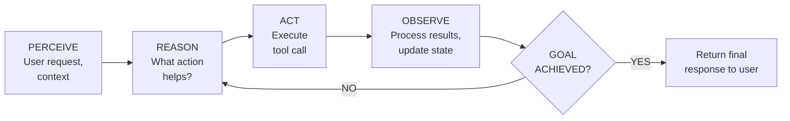
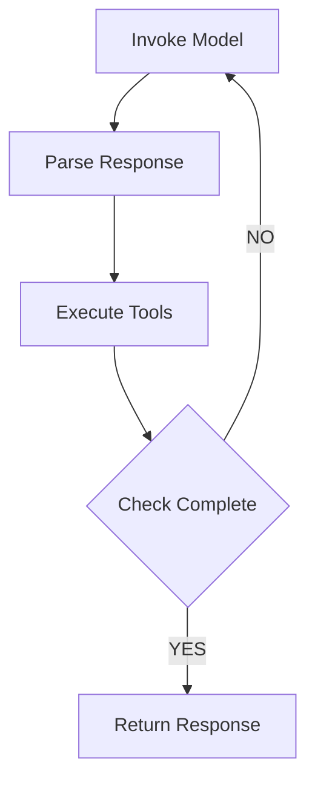
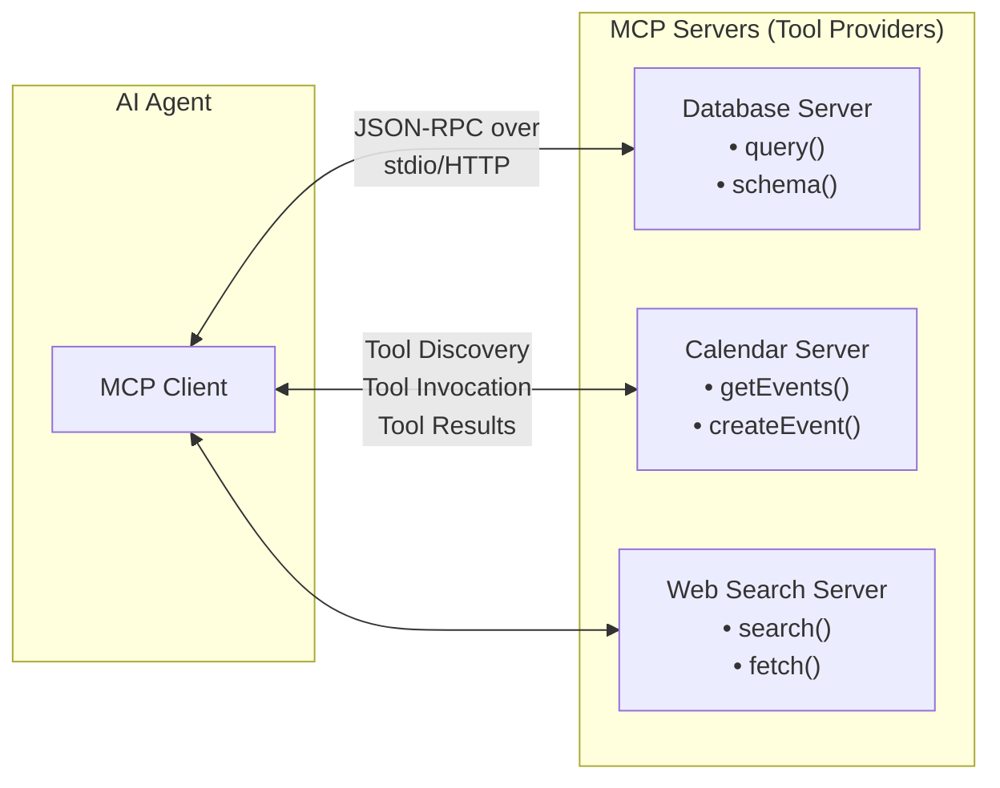
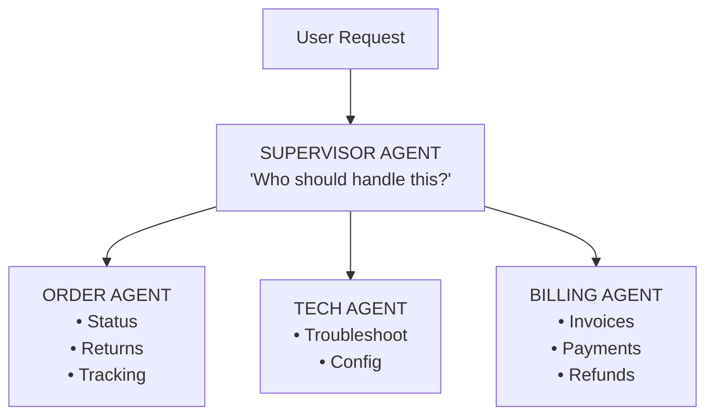
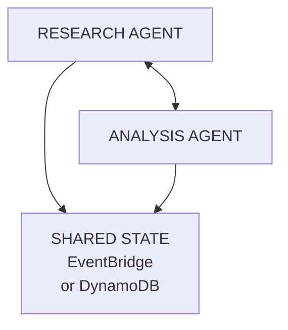

# Agentic AI Solutions

**Domain 2 | Task 2.1 | ~45 minutes**

---

## Why This Matters

Agentic AI represents a fundamental shift in what AI systems can accomplish. The GenAI applications most people are familiar with follow a simple pattern: user asks a question, model generates text, interaction ends. This works for chatbots, writing assistants, and content generation—but it barely scratches the surface of what's possible. The real power of foundation models emerges when they can **take action in the world**, not just generate text about it.

Think about the difference between asking a chatbot "What's the weather in Seattle?" versus asking "Book me the cheapest flight to Seattle next week, preferably in the morning, and add it to my calendar." The first is a simple lookup—the model retrieves or generates information and you're done. The second is a **multi-step task** that requires searching flight databases, comparing prices across airlines, understanding your preferences (morning flights, cheapest option), considering constraints (your calendar availability), making a purchase decision, interacting with a payment system, and finally updating your calendar. Each step might reveal new information that changes the approach. The flight search might show that afternoon flights are $200 cheaper—should the agent ask you, or just book the morning flight as requested? The calendar might show a conflict—what then?

This is **agentic AI**: systems that can autonomously plan, reason, use tools, and take multi-step actions to accomplish goals. These aren't hypothetical capabilities—they're what powers the most sophisticated AI deployments in enterprises today. Customer service agents that can actually resolve issues by accessing order systems, processing refunds, and scheduling callbacks. Document processing systems that read contracts, extract key terms, validate against business rules, and route for appropriate approval. Software development assistants that don't just suggest code but can run tests, commit changes, and create pull requests.

The business impact is substantial. A traditional chatbot might deflect 30% of customer inquiries to self-service. An agentic system that can actually resolve issues—check order status, process returns, update account information—might handle 70% or more without human intervention. The difference isn't just efficiency; it's capability. Problems that previously required human judgment and system access become automatable.

But agentic systems also introduce risks that simpler AI applications don't face. An agent that can take actions can take **wrong actions**. An agent with access to payment systems can process fraudulent refunds. An agent with email access can send inappropriate messages. The same autonomy that makes agents powerful makes them dangerous if not properly constrained. Understanding how to build agents that are both capable and safe is essential for anyone working with production AI systems.

---

## What Makes AI "Agentic"

The word "agent" gets used loosely in AI discussions, so let's be precise about what distinguishes agentic systems from other AI applications.

**Traditional AI applications are reactive.** A user submits input, the model processes it, and returns output. The model has no goals beyond generating a response to the immediate input. It doesn't remember what happened before (beyond what's in the context window), it doesn't plan for what comes next, and it can't take any action beyond producing text. This is the model most people think of when they imagine AI—a sophisticated autocomplete that generates plausible-sounding text.

**Agentic AI is proactive.** An agent has a **goal** it's trying to achieve and actively works toward that goal. It reasons about what actions would help accomplish the goal, takes those actions, observes the results, and adjusts its approach based on what it learns. The agent loop continues until the goal is achieved or the agent determines it can't proceed.

The defining characteristics of agentic systems are:

**Autonomy**: The agent makes decisions about what to do without step-by-step human guidance. You specify the goal ("resolve this customer's issue") not the steps ("first look up the order, then check the return policy, then..."). The agent figures out the steps itself.

**Tool use**: Agents can interact with external systems through **tools**—APIs, databases, file systems, web services. Without tools, an agent can only generate text. With tools, it can check inventory, process payments, send emails, query knowledge bases, or interact with any system that exposes an API. Tools are what transform agents from sophisticated chatbots into systems that can actually do things.

**Planning**: Complex tasks require breaking goals into sub-goals. An agent trying to "book a vacation" needs to decompose that into searching flights, finding hotels, checking availability, comparing prices, and confirming reservations. Good agents develop plans and execute them systematically.

**Reasoning**: Agents need to evaluate their progress, handle unexpected situations, and adjust their approach when things don't go as expected. If a flight search returns no results, the agent might try different dates, different airports, or ask the user to clarify constraints. This adaptive behavior is what makes agents robust in real-world conditions where things rarely go exactly as planned.

**Memory**: Effective agents maintain context across interactions. They remember what tools they've called, what results they've received, what the user has said, and what their current plan is. This memory enables coherent multi-step behavior rather than treating each action in isolation.

### The Agent Loop

All agentic systems share a common structure, often called the **agent loop**:



1. **Perceive**: The agent receives input—user request, current state, available tools, any constraints
2. **Reason**: The agent thinks about what action would help achieve the goal given current knowledge
3. **Act**: The agent executes an action, typically calling a tool
4. **Observe**: The agent processes the result of the action, updating its understanding
5. **Evaluate**: The agent determines whether the goal is achieved or more actions are needed
6. **Repeat or Respond**: Either loop back to reason about the next action, or provide a final response

### AWS Tools for Building Agents

AWS provides several services and frameworks for building agentic systems:

**Amazon Bedrock Agents** is the managed service approach. You define the agent's purpose, configure available action groups (tools backed by Lambda functions), optionally connect knowledge bases for RAG, and Bedrock handles the agent loop orchestration. The model reasons about which actions to take and calls your Lambda functions automatically.

**Strands Agents SDK** is AWS's framework for building custom agents with more control. It handles the complexity of the agent loop—prompt construction, tool calling, result parsing, conversation management—while letting you customize behavior. Strands works with any model that supports tool use.

**AWS Agent Squad** enables multi-agent systems where specialized agents collaborate. A supervisor agent coordinates, routing tasks to specialist agents with domain expertise. This pattern scales capabilities without making any single agent impossibly complex.

---

## The ReAct Pattern: Reasoning + Acting

**ReAct** (Reasoning + Acting) has become the dominant pattern for building effective agents. The key insight is elegant: instead of asking a model to solve a problem in one shot, let it **alternate between thinking and doing**. Each action provides new information that informs the next thought.

The pattern emerged from research showing that models perform better when they "think out loud" before acting, and that interleaving reasoning with actions produces better results than either alone. Reasoning without actions leaves the model unable to gather new information. Actions without reasoning lead to haphazard, uncoordinated behavior.

### The ReAct Structure

A ReAct agent generates a sequence of **Thought**, **Action**, and **Observation** steps:

```
User: What's the status of order #12345 and when will it arrive?

Thought: I need to look up order #12345 in the order management system
         to find its current status and shipping information.

Action: getOrderStatus(orderId="12345")

Observation: {"status": "shipped", "carrier": "UPS",
              "trackingNumber": "1Z999AA10123456784", "shipDate": "2024-03-10"}

Thought: The order has shipped via UPS. I have the tracking number.
         Now I need to get the delivery estimate from UPS.

Action: getTrackingInfo(carrier="UPS", trackingNumber="1Z999AA10123456784")

Observation: {"status": "In Transit", "estimatedDelivery": "2024-03-15",
              "lastLocation": "Chicago, IL", "lastUpdate": "2024-03-12 14:30"}

Thought: I now have all the information needed. The order shipped on March 10,
         is currently in transit through Chicago, and is estimated to arrive
         March 15.

Answer: Your order #12345 shipped on March 10 via UPS and is currently in
        transit. It was last scanned in Chicago, IL on March 12 at 2:30 PM.
        The estimated delivery date is March 15.
```

The explicit **Thought** steps serve multiple purposes:
- **Transparency**: You can see exactly what the agent is reasoning about
- **Debuggability**: When things go wrong, the thought trace shows where reasoning failed
- **Grounding**: The model articulates its plan before acting, reducing hallucination
- **Control**: Thoughts can reveal if the agent is going off track before it takes action

### Implementing ReAct with Bedrock

Here's a complete implementation using the Bedrock Converse API:

```python
import boto3
import json
from typing import Any, Callable

class ReActAgent:
    def __init__(self, model_id: str = 'anthropic.claude-3-sonnet-20240229-v1:0'):
        self.client = boto3.client('bedrock-runtime')
        self.model_id = model_id
        self.tools: dict[str, Callable] = {}
        self.tool_specs: list[dict] = []

    def register_tool(self, name: str, description: str,
                      parameters: dict, handler: Callable):
        """Register a tool the agent can use."""
        self.tools[name] = handler
        self.tool_specs.append({
            'toolSpec': {
                'name': name,
                'description': description,
                'inputSchema': {'json': parameters}
            }
        })

    def run(self, user_message: str, system_prompt: str = None,
            max_iterations: int = 10) -> str:
        """Execute the agent loop until goal is achieved or limit reached."""

        messages = [{'role': 'user', 'content': [{'text': user_message}]}]
        system = [{'text': system_prompt}] if system_prompt else None

        for iteration in range(max_iterations):
            # Call the model
            response = self.client.converse(
                modelId=self.model_id,
                messages=messages,
                system=system,
                toolConfig={'tools': self.tool_specs} if self.tool_specs else None
            )

            assistant_message = response['output']['message']
            messages.append(assistant_message)

            # Check if model wants to use a tool
            if response['stopReason'] == 'tool_use':
                tool_results = self._execute_tools(assistant_message['content'])
                messages.append({
                    'role': 'user',
                    'content': tool_results
                })
            else:
                # Model is done—extract final response
                for content in assistant_message['content']:
                    if 'text' in content:
                        return content['text']

        return "Maximum iterations reached without completing the task."

    def _execute_tools(self, content: list) -> list:
        """Execute all tool calls and return results."""
        results = []
        for item in content:
            if 'toolUse' in item:
                tool_use = item['toolUse']
                tool_name = tool_use['name']
                tool_input = tool_use['input']

                try:
                    result = self.tools[tool_name](**tool_input)
                    results.append({
                        'toolResult': {
                            'toolUseId': tool_use['toolUseId'],
                            'content': [{'json': result}]
                        }
                    })
                except Exception as e:
                    results.append({
                        'toolResult': {
                            'toolUseId': tool_use['toolUseId'],
                            'content': [{'json': {'error': str(e)}}],
                            'status': 'error'
                        }
                    })
        return results


# Usage example
agent = ReActAgent()

# Register tools
agent.register_tool(
    name='getOrderStatus',
    description='Look up the status of an order by order ID',
    parameters={
        'type': 'object',
        'properties': {
            'orderId': {'type': 'string', 'description': 'The order ID to look up'}
        },
        'required': ['orderId']
    },
    handler=lambda orderId: order_database.get(orderId)
)

agent.register_tool(
    name='getTrackingInfo',
    description='Get delivery tracking information for a shipment',
    parameters={
        'type': 'object',
        'properties': {
            'carrier': {'type': 'string', 'description': 'Shipping carrier (UPS, FedEx, etc.)'},
            'trackingNumber': {'type': 'string', 'description': 'Tracking number'}
        },
        'required': ['carrier', 'trackingNumber']
    },
    handler=lambda carrier, trackingNumber: tracking_api.get(carrier, trackingNumber)
)

# Run the agent
response = agent.run(
    user_message="What's the status of order #12345?",
    system_prompt="You are a helpful customer service agent. Use the available tools to help customers with their orders."
)
```

### Production Considerations

In production, the simple loop above needs additional capabilities:

**Step Functions for orchestration** provides retry logic, timeout handling, error catching, and audit trails that the simple Python loop lacks:



**Iteration limits** prevent runaway agents from looping indefinitely. Set reasonable maximums (10-20 iterations for most tasks) and handle the "max iterations exceeded" case gracefully.

**Timeout management** ensures agents don't hang waiting for tools that never respond. Each tool call should have a timeout; the overall agent execution should have a timeout.

**Token tracking** monitors costs. Each iteration consumes tokens; complex agent runs can use substantial amounts. Track and alert on token usage.

---

## Model Context Protocol (MCP)

Before the Model Context Protocol, every AI system had its own way of connecting to tools. Building a tool for OpenAI's function calling meant rewriting it for Anthropic's format, and again for Bedrock Agents' action groups. Tool ecosystems were fragmented, and every new AI system required recreating integrations from scratch.

**MCP standardizes how AI systems connect to tools and data sources.** Think of it as a universal adapter—any MCP-compatible agent can use any MCP-compatible tool, regardless of who built either one. This creates network effects: as more tools become MCP-compatible, every MCP-supporting agent gains capabilities. As more agents support MCP, there's more incentive to build MCP-compatible tools.

### MCP Architecture



**MCP Client**: Runs within the agent runtime. It handles connecting to MCP servers, discovering available tools, translating agent requests to MCP format, and parsing responses.

**MCP Server**: Exposes tools and resources through a standardized interface. Each server can provide multiple tools. A "database server" might expose query, schema inspection, and write operations. A "calendar server" might expose event retrieval, creation, and modification.

**Protocol**: Uses JSON-RPC for communication. The client sends requests; the server sends responses. The protocol defines message types for tool discovery, invocation, and result handling.

### Why Standardization Matters

Without MCP, you build tools for specific AI systems:
- Bedrock Agents: Action groups with OpenAPI specs and Lambda functions
- OpenAI: Function definitions in their specific JSON format
- Anthropic: Tool definitions in their format
- LangChain: Custom tool classes

Switching AI providers means rewriting all your tool integrations. Testing a new model requires building new integrations.

With MCP:
- Build a tool once as an MCP server
- Use it with any MCP-compatible agent
- Switch AI providers without touching tool code
- Access a growing ecosystem of pre-built MCP servers

### Hosting MCP Servers on AWS

**Lambda for stateless tools**: Most tools are stateless—receive a request, do some work, return a response. Lambda is perfect for this:

```python
# Lambda MCP Server for order lookups
import json

def handler(event, context):
    method = event.get('method')
    params = event.get('params', {})

    if method == 'tools/list':
        return {
            'tools': [
                {
                    'name': 'getOrderStatus',
                    'description': 'Look up order status by order ID',
                    'inputSchema': {
                        'type': 'object',
                        'properties': {
                            'orderId': {'type': 'string'}
                        },
                        'required': ['orderId']
                    }
                }
            ]
        }

    elif method == 'tools/call':
        tool_name = params.get('name')
        arguments = params.get('arguments', {})

        if tool_name == 'getOrderStatus':
            order = get_order_from_database(arguments['orderId'])
            return {'content': [{'type': 'text', 'text': json.dumps(order)}]}

    return {'error': {'code': -32601, 'message': 'Method not found'}}
```

**ECS for stateful tools**: Some tools need persistent connections—database connection pools, WebSocket connections to external services, or long-running operations. ECS provides the container runtime for these:

| Use Case | Lambda | ECS |
|----------|--------|-----|
| API calls to external services | Best choice | Overkill |
| Database queries | Works well | Needed for connection pooling |
| File processing < 15 min | Works | Works |
| File processing > 15 min | Not possible | Required |
| WebSocket connections | Not possible | Required |
| Large memory (> 10GB) | Not possible | Required |
| GPU acceleration | Not available | Available |

---

## Agent Collaboration Patterns

Complex tasks often exceed what any single agent can handle effectively. A customer service agent that's expert at order inquiries might struggle with technical troubleshooting. A research agent might excel at finding information but not at synthesizing it into reports. **Multi-agent systems** address this by having specialized agents collaborate.

### The Supervisor Pattern

The most common multi-agent architecture uses a **supervisor agent** that coordinates specialists:



**How it works:**
1. User request arrives at the supervisor
2. Supervisor analyzes the request and determines which specialist(s) to involve
3. Supervisor delegates to the appropriate specialist
4. Specialist handles the task, potentially calling tools
5. Specialist returns results to supervisor
6. Supervisor synthesizes results and responds to user (or delegates to another specialist)

**Advantages:**
- Clear accountability—supervisor owns the outcome
- Specialists can be optimized for their domain
- Easy to add new specialists without modifying existing ones
- Natural fit for organizational structures

**AWS Agent Squad** implements this pattern. You define a supervisor agent and register specialist agents. The supervisor automatically routes requests based on agent descriptions and capabilities.

### The Peer-to-Peer Pattern

In some scenarios, decentralized coordination works better. Agents communicate directly with each other, sharing information and delegating work as needed:



**How it works:**
1. Agents publish events describing their work, needs, or findings
2. Other agents subscribe to relevant event types
3. When an agent needs help, it publishes a request event
4. Capable agents pick up the request and respond
5. Results flow back through events or shared state

**Advantages:**
- No single point of failure
- Agents can self-organize based on capabilities
- Scales horizontally—add agents without bottlenecks
- Natural for exploratory or creative tasks

**AWS Implementation**: Use EventBridge for event routing and DynamoDB for shared state:

```python
import boto3
import json

events = boto3.client('events')

def research_agent_handler(event, context):
    """Research agent that can request help from other agents."""
    research_results = perform_research(event['query'])

    # If we need financial analysis, request help
    if needs_financial_analysis(research_results):
        events.put_events(
            Entries=[{
                'Source': 'agent.research',
                'DetailType': 'AnalysisRequest',
                'EventBusName': 'agent-collaboration',
                'Detail': json.dumps({
                    'correlationId': event['correlationId'],
                    'requestType': 'financial_analysis',
                    'data': research_results
                })
            }]
        )

    return research_results


def finance_agent_handler(event, context):
    """Finance agent that responds to analysis requests."""
    detail = json.loads(event['detail'])

    if detail['requestType'] == 'financial_analysis':
        analysis = perform_financial_analysis(detail['data'])

        # Publish results back
        events.put_events(
            Entries=[{
                'Source': 'agent.finance',
                'DetailType': 'AnalysisComplete',
                'EventBusName': 'agent-collaboration',
                'Detail': json.dumps({
                    'correlationId': detail['correlationId'],
                    'analysis': analysis
                })
            }]
        )
```

### Choosing a Pattern

| Factor | Supervisor | Peer-to-Peer |
|--------|------------|--------------|
| Accountability | Single owner (supervisor) | Distributed |
| Single point of failure | Yes (supervisor) | No |
| Coordination overhead | Lower | Higher |
| Debugging complexity | Easier to trace | Harder to follow |
| Scaling | Supervisor bottleneck | Horizontal |
| Best for | Structured workflows, customer service | Research, creative tasks, resilient systems |
| AWS Service | Agent Squad | EventBridge + Lambda |

Many production systems use **hybrid approaches**: a supervisor handles high-level routing, but specialist agents collaborate peer-to-peer within their domain.

---

## Agent Safety and Guardrails

The same autonomy that makes agents powerful makes them dangerous. An agent that can take actions can take **wrong actions** or **harmful actions**. When agents have access to customer databases, payment systems, or communication channels, mistakes don't just produce bad text—they cause real-world harm.

Consider what can go wrong:
- An agent processing refunds gets manipulated through prompt injection and issues fraudulent refunds
- An agent stuck in a loop makes thousands of API calls, accumulating massive costs
- An agent with email access sends inappropriate messages to customers
- An agent accessing customer data exposes PII through its responses

Production agents require **defense in depth**—multiple safety layers, each catching what others might miss.

### Layer 1: IAM Resource Boundaries

**Principle of least privilege** is your hard boundary. An agent can only do what its IAM role permits, regardless of what it tries to do. Design agent IAM roles narrowly:

```json
{
  "Version": "2012-10-17",
  "Statement": [
    {
      "Sid": "AllowOrderLookup",
      "Effect": "Allow",
      "Action": ["dynamodb:GetItem", "dynamodb:Query"],
      "Resource": "arn:aws:dynamodb:*:*:table/orders"
    },
    {
      "Sid": "DenyOrderModification",
      "Effect": "Deny",
      "Action": ["dynamodb:PutItem", "dynamodb:UpdateItem", "dynamodb:DeleteItem"],
      "Resource": "*"
    },
    {
      "Sid": "DenyOtherTables",
      "Effect": "Deny",
      "Action": ["dynamodb:*"],
      "Resource": "arn:aws:dynamodb:*:*:table/customers"
    }
  ]
}
```

Even if the agent's reasoning is compromised through prompt injection, it cannot exceed IAM permissions. This is your last line of defense.

### Layer 2: Operational Controls

Agents can malfunction in ways that aren't security breaches but still cause problems:

**Infinite loops**: Agent gets stuck, repeatedly calling tools without progress
**Retry storms**: Agent keeps retrying failed operations indefinitely
**Cost runaway**: Agent makes thousands of expensive API calls

Step Functions provides operational controls:

```yaml
# Step Functions state machine with safety controls
States:
  AgentLoop:
    Type: Task
    Resource: arn:aws:lambda:*:*:function:agent-reasoning
    Retry:
      - ErrorEquals: ["TransientError"]
        MaxAttempts: 3
        IntervalSeconds: 1
        BackoffRate: 2
    Catch:
      - ErrorEquals: ["States.ALL"]
        ResultPath: "$.error"
        Next: HandleError
    TimeoutSeconds: 300  # 5 minute timeout per iteration
    Next: CheckCompletion

  CheckCompletion:
    Type: Choice
    Choices:
      - Variable: "$.iterationCount"
        NumericGreaterThan: 20  # Maximum iterations
        Next: MaxIterationsExceeded
      - Variable: "$.complete"
        BooleanEquals: true
        Next: ReturnResponse
    Default: AgentLoop
```

### Layer 3: Human-in-the-Loop

Some actions should never be fully autonomous. Define thresholds:

| Action | Threshold | Requires Approval |
|--------|-----------|-------------------|
| Refund | > $100 | Yes |
| Account deletion | Always | Yes |
| Customer email | Always | Yes |
| Data export | > 1000 records | Yes |
| Order modification | After shipping | Yes |

Step Functions integrates with approval workflows:

```python
# Human approval state in Step Functions
{
    "Type": "Task",
    "Resource": "arn:aws:states:::lambda:invoke.waitForTaskToken",
    "Parameters": {
        "FunctionName": "SendApprovalRequest",
        "Payload": {
            "taskToken.$": "$$.Task.Token",
            "action.$": "$.pendingAction",
            "context.$": "$.context"
        }
    },
    "TimeoutSeconds": 86400,  # 24 hour timeout
    "Next": "ExecuteApprovedAction"
}
```

### Layer 4: Tool Parameter Validation

Even with IAM permissions, not all parameter values are valid. Validate within tools:

```python
def process_refund(order_id: str, amount: float, reason: str) -> dict:
    # Validate order exists
    order = get_order(order_id)
    if not order:
        return {'error': 'ORDER_NOT_FOUND', 'message': 'Order does not exist'}

    # Validate amount is reasonable
    if amount > order['total']:
        return {'error': 'INVALID_AMOUNT',
                'message': f'Refund {amount} exceeds order total {order["total"]}'}

    if amount < 0:
        return {'error': 'INVALID_AMOUNT', 'message': 'Refund amount must be positive'}

    # Validate order is refundable
    if order['status'] == 'refunded':
        return {'error': 'ALREADY_REFUNDED', 'message': 'Order already refunded'}

    if order['age_days'] > 30:
        return {'error': 'REFUND_WINDOW_EXPIRED',
                'message': 'Refund window has expired'}

    # Process the refund
    return execute_refund(order_id, amount, reason)
```

### Layer 5: Bedrock Guardrails

Guardrails filter both inputs and outputs:

**Input filtering**:
- Block prompt injection attempts
- Filter harmful content before it reaches the agent
- Prevent PII from being sent to the model

**Output filtering**:
- Block harmful or inappropriate responses
- Prevent PII from being returned to users
- Enforce topic boundaries

```python
# Apply guardrails to agent
agent_config = {
    'agentId': 'AGENT_ID',
    'guardrailConfiguration': {
        'guardrailIdentifier': 'my-guardrail-id',
        'guardrailVersion': 'DRAFT'
    }
}
```

---

## Tool Design Best Practices

The tools you give an agent define its capabilities. Poorly designed tools lead to confused agents, failed actions, and frustrated users. Well-designed tools enable reliable, predictable behavior.

### Clear, Unambiguous Descriptions

The agent decides which tool to use based on descriptions. Make them specific:

```python
# Bad: Vague description
{
    'name': 'getInfo',
    'description': 'Gets information'  # Too vague—what information?
}

# Good: Specific description
{
    'name': 'getOrderStatus',
    'description': 'Retrieves the current status, shipping information, and '
                   'estimated delivery date for a customer order. Use when '
                   'a customer asks about their order status, delivery timing, '
                   'or tracking information. Requires the order ID.'
}
```

### Predictable Return Formats

Agents need to understand tool outputs. Use consistent, documented structures:

```python
# Define a clear return schema
{
    'name': 'getOrderStatus',
    'description': '...',
    'outputSchema': {
        'type': 'object',
        'properties': {
            'orderId': {'type': 'string'},
            'status': {
                'type': 'string',
                'enum': ['pending', 'processing', 'shipped', 'delivered', 'cancelled']
            },
            'trackingNumber': {'type': 'string', 'nullable': True},
            'estimatedDelivery': {'type': 'string', 'format': 'date', 'nullable': True}
        }
    }
}
```

### Actionable Error Responses

When things go wrong, help the agent recover:

```python
def get_order_status(order_id: str) -> dict:
    try:
        order = database.get(order_id)
        if not order:
            return {
                'error': 'ORDER_NOT_FOUND',
                'message': f'No order found with ID {order_id}',
                'suggestion': 'Ask customer to verify the order number'
            }
        return {'success': True, 'data': order}

    except DatabaseConnectionError:
        return {
            'error': 'SERVICE_UNAVAILABLE',
            'message': 'Unable to access order database',
            'suggestion': 'Retry after a short delay',
            'retryable': True
        }

    except Exception as e:
        return {
            'error': 'INTERNAL_ERROR',
            'message': str(e),
            'suggestion': 'Escalate to human agent',
            'retryable': False
        }
```

---

## Exam Tips

| When you see... | Think... |
|-----------------|----------|
| "autonomous" or "multi-step tasks" | Bedrock Agents or Strands Agents SDK |
| "tool use" or "API integration" | Action Groups with Lambda |
| "coordinate multiple specialized agents" | Supervisor pattern with Agent Squad |
| "self-organizing agents" or "decentralized" | Peer-to-peer with EventBridge |
| "standardized tool interface" or "portable tools" | Model Context Protocol (MCP) |
| "prevent harmful actions" or "agent safety" | IAM least privilege + guardrails |
| "human approval for sensitive actions" | Step Functions callback pattern |
| "reasoning loop" or "Thought-Action-Observation" | ReAct pattern |
| "stateless tool hosting" | Lambda |
| "persistent connections" or "stateful tools" | ECS |
| "iteration limits" or "prevent runaway" | Step Functions with MaxAttempts |

---

## Key Takeaways

> **1. Agents are autonomous systems that plan, use tools, reason, and iterate to achieve goals.**
> This is fundamentally different from simple prompt-response interactions. Agents don't just generate text—they take actions in the world.

> **2. The ReAct pattern (Thought → Action → Observation → Repeat) is foundational.**
> Interleaving reasoning with actions produces better results than either alone. The thought trace provides transparency and debuggability.

> **3. MCP standardizes tool interfaces for portability across AI systems.**
> Build tools once as MCP servers, use them with any MCP-compatible agent. The ecosystem is growing and network effects compound.

> **4. Supervisor pattern for coordinated specialists; peer-to-peer for resilient collaboration.**
> Agent Squad implements supervisor pattern. EventBridge enables peer-to-peer. Choose based on accountability needs and failure tolerance.

> **5. Lambda for stateless tools, ECS for stateful or long-running tools.**
> Most tools are stateless API calls—Lambda is perfect. Move to ECS for persistent connections, large memory, or operations exceeding 15 minutes.

> **6. Agent safety requires defense in depth.**
> IAM boundaries, Step Functions operational controls, human-in-the-loop for sensitive actions, tool parameter validation, and Guardrails content filtering. No single layer is sufficient.

---

## Common Mistakes

| Mistake | Why It Matters |
|---------|----------------|
| **Building agents when simple prompting suffices** | Agents add complexity. If you just need Q&A, a ReAct loop is overkill. |
| **Broad IAM permissions for agents** | Violates least privilege. Compromised agents can only do what IAM permits. |
| **No iteration limits on agent loops** | Agents can get stuck, accumulating costs and taking repeated actions. |
| **Skipping human-in-the-loop for high-stakes actions** | Some actions are too consequential for full autonomy. |
| **Custom tool protocols instead of MCP** | Reinventing the wheel. MCP provides standardization and ecosystem. |
| **Vague tool descriptions** | Agent can't determine which tool to use, leading to wrong choices. |
| **No error handling in tools** | Agent can't recover from failures or help users when things go wrong. |
| **Ignoring tool parameter validation** | Valid IAM permissions don't mean valid parameter values. |
