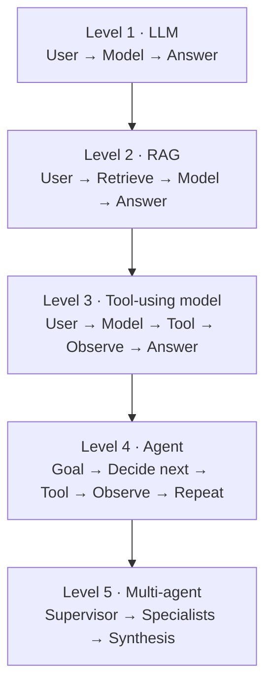
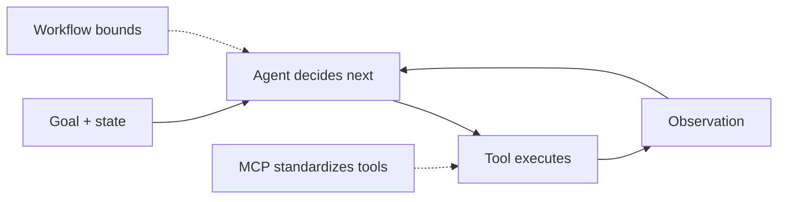
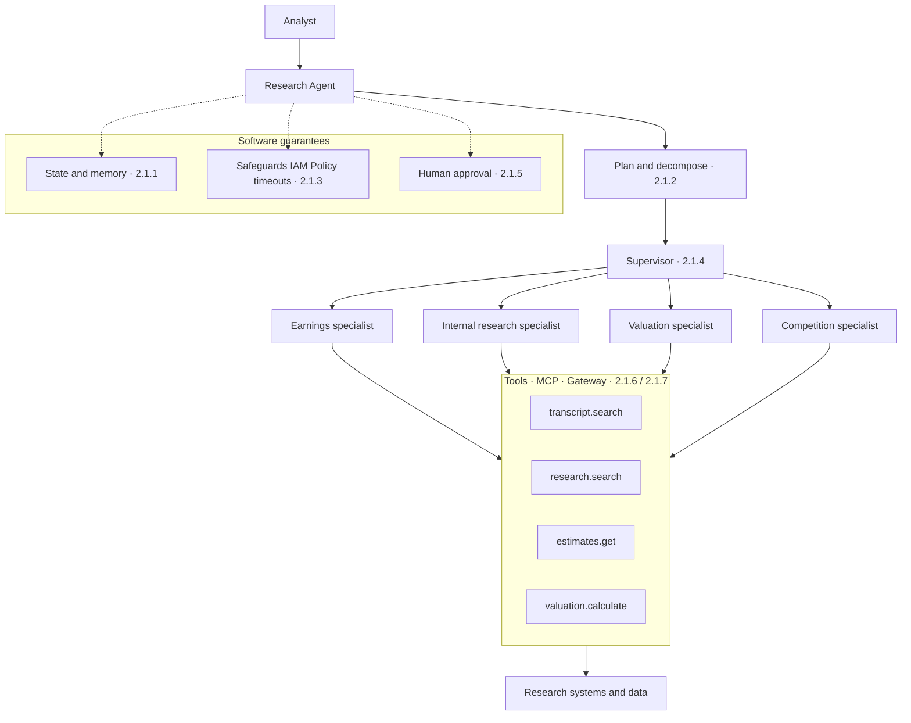
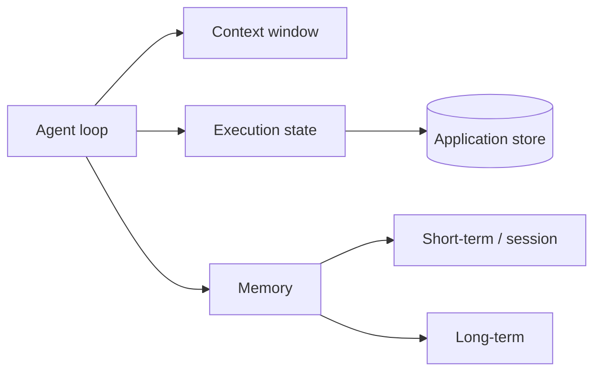
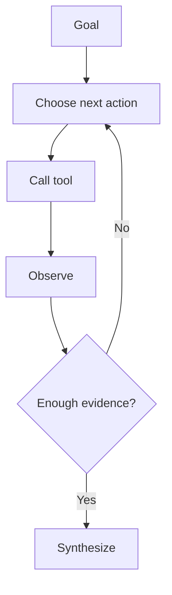
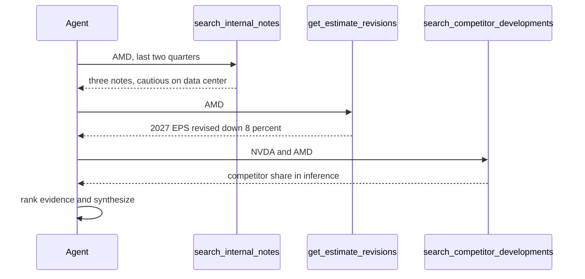
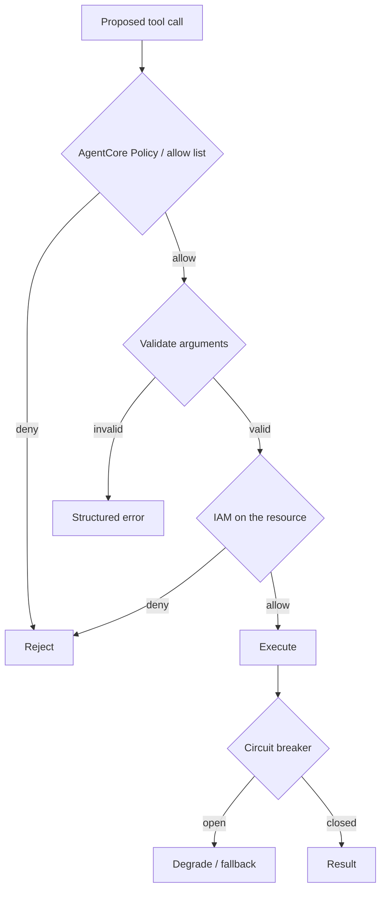
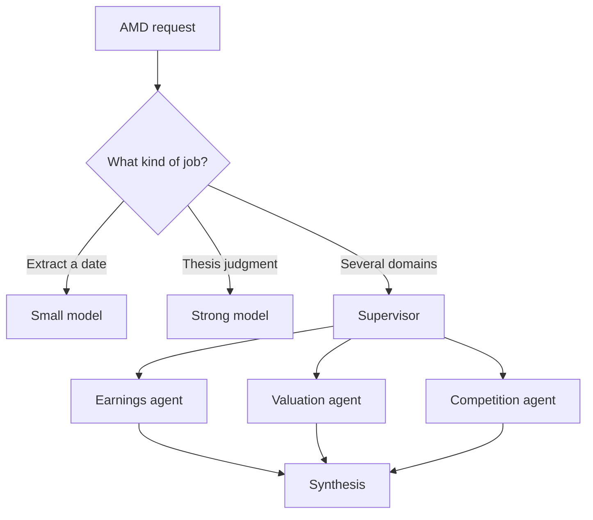
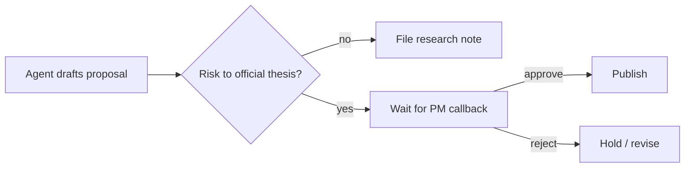
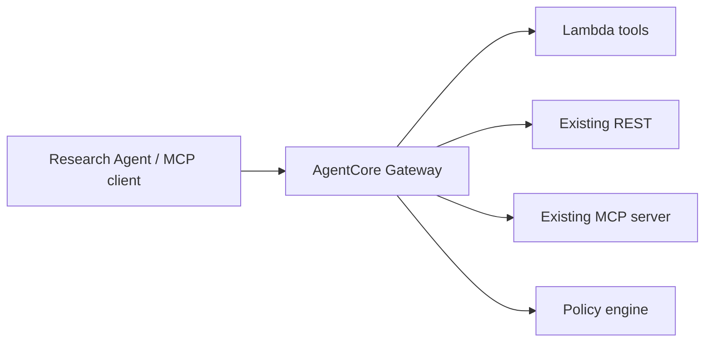

# Task 2.1 — Implement Agentic AI Solutions and Tool Integrations

**Domain 2 · Skills 2.1.1–2.1.7**

This task is not a catalog of AWS agent products. It is a design skill: given a messy research request, can you say what the system must *decide*, what software must *guarantee*, and which AWS pieces implement each part?

By the end you should be able to answer, out loud:

> What actually makes an AI system agentic, how do its major components fit together, what should the model decide versus what software must enforce, and which AWS technologies implement each part?

One application runs through every section.

> “What changed in the investment thesis on AMD over the last two quarters? Compare management commentary, internal research, valuation, estimate revisions, and competitive developments. Tell me what matters most and whether the evidence warrants a thesis review.”

That is not a chatbot prompt. It is a research assignment whose path depends on evidence. Task 2.1 is how you turn that assignment into a production system.

> **Exam tip vs current AWS:** The AIP-C01 blueprint still names **Strands Agents**, **AWS Agent Squad**, **MCP on Lambda and ECS**, **Step Functions**, **IAM**, and sometimes **Bedrock Agents / action groups**. Current AWS guidance for *new* agent architectures is **Amazon Bedrock AgentCore**. This guide teaches the architecture first, then maps **exam terminology** and **current platform** side by side. Do not silently substitute one for the other.

---

## What makes a system agentic?

An ordinary LLM answers from the prompt and stops. A **tool-using** model can call a function once or twice and then answer. An **agentic** system keeps a goal, looks at the current situation, and chooses the *next* action until the goal is met or a software boundary stops it.

**Agent** = Model + Instructions + Tools + State + Control loop.

The loop is the point. After every observation the system asks again: *given the goal and what I now know, what should I do next?*

Tool use alone does not make a system meaningfully agentic. If the code always calls `search_transcripts`, then `summarize`, then returns, that is a **workflow** with an LLM inside it. The model is generating text. Software already decided the path.

The AMD request is agentic because the next search depends on what the last search found. If internal notes already explain the caution, the agent may skip a second earnings pass. If valuation moved and competition did not, the next action is different. You cannot fully pre-write that graph without turning every branch into a brittle script.

> **Mental shortcut:** Agent = who decides next. Workflow = what governs execution. Tool = what can be done. MCP = how capabilities are standardized and exposed.

```recall
Q: A pipeline always retrieves, then summarizes, then emits JSON. The model never chooses a tool. Is this an agent?
A: No. It is a workflow with an LLM inside. Agentic means the next action is chosen from the goal and current state, not fully predetermined.
```

---

## From LLM to multi-agent

Each level adds a capability. It also adds failure modes. Do not climb the ladder because “agents are more advanced.” Climb it because the AMD question requires the extra degree of freedom.


```mermaid
flowchart TD
    L1["Level 1 · LLM<br/>User → Model → Answer"]
    L2["Level 2 · RAG<br/>User → Retrieve → Model → Answer"]
    L3["Level 3 · Tool-using model<br/>User → Model → Tool → Observe → Answer"]
    L4["Level 4 · Agent<br/>Goal → Decide next → Tool → Observe → Repeat"]
    L5["Level 5 · Multi-agent<br/>Supervisor → Specialists → Synthesis"]
    L1 --> L2 --> L3 --> L4 --> L5
```

**Level 1 — LLM.** The model answers from weights and the prompt. Fine for “what is EV/EBITDA.” Useless for “what changed in *our* AMD thesis.” The facts are not in the prompt and may not be in training data.

**Level 2 — RAG.** Retrieve internal notes, then generate. Fine for “find the latest AMD note.” The AMD task is not one retrieve. It is several evidence types, comparison, and a judgment about whether review is warranted. A single retrieve-then-answer pass will under-research or dump undifferentiated chunks.

**Level 3 — Tool-using model.** The model may call `get_estimates(AMD)` or `search_transcripts(AMD, last two quarters)` and then answer. Still often one-shot: call tools, write prose, stop. If the first transcript is incomplete, a tool-using model that is not looping may not decide to fetch Q2.

**Level 4 — Agent.** The system holds a goal, maintains state, and repeats decide → act → observe until it has enough, hits a limit, or must ask a human. *This* is the minimum architecture for the AMD request.

**Level 5 — Multi-agent.** A supervisor delegates earnings, internal research, valuation, and competition to specialists, then synthesizes. Use this when domains, prompts, models, permissions, or parallelism actually buy something — not as a default badge of sophistication.

> **Exam trap:** A stem that mentions tools is not automatically an agent question. Ask whether the *next* action is chosen dynamically. If the path is fixed, the answer is a workflow, Step Functions, or RAG — not “add more agents.”

---

## Agent vs workflow vs tool vs MCP

These four words get treated as synonyms. They are not.

| Idea | Plain meaning | AMD |
|------|---------------|-----|
| **Agent** | Chooses the next action from a goal and current state | “Valuation moved; I still need competitor filings.” |
| **Workflow** | Software defines or constrains how execution proceeds | Max 12 steps; publish cannot run until a PM approves |
| **Tool** | A callable capability with a contract | `search_earnings_transcripts(ticker, quarters)` |
| **MCP** | A standard way to discover and invoke those capabilities | Many agents share one Investment Research server |

Production systems combine them: **agent intelligence inside deterministic workflow boundaries, calling tools through standardized interfaces.**


```mermaid
flowchart LR
    Goal[Goal + state] --> Agent[Agent decides next]
    Agent --> Tool[Tool executes]
    Tool --> Observe[Observation]
    Observe --> Agent
    WF[Workflow bounds] -.-> Agent
    MCP[MCP standardizes tools] -.-> Tool
```

**If you see X, think Y:**

- Need the model to choose the next research action → agentic loop
- Need retries, timeouts, durable state, or a forced approval gate → workflow (usually Step Functions)
- Need the model to *do* something in software → a tool
- Need many agents to share the same capabilities without each team wrapping APIs differently → MCP

---

## The AMD research agent architecture

Keep this picture in your head. Every skill is a labeled piece of the same system, not a separate mini-product.


```mermaid
flowchart TB
    Analyst[Analyst] --> RA[Research Agent]
    RA --> Plan["Plan and decompose · 2.1.2"]
    Plan --> Sup["Supervisor · 2.1.4"]
    Sup --> Earn[Earnings specialist]
    Sup --> IR[Internal research specialist]
    Sup --> Val[Valuation specialist]
    Sup --> Comp[Competition specialist]
    Earn --> Tools
    IR --> Tools
    Val --> Tools
    Comp --> Tools
    subgraph Tools["Tools · MCP · Gateway · 2.1.6 / 2.1.7"]
        T1[transcript.search]
        T2[research.search]
        T3[estimates.get]
        T4[valuation.calculate]
    end
    Tools --> Data[Research systems and data]
    subgraph Cross["Software guarantees"]
        SM["State and memory · 2.1.1"]
        SG["Safeguards IAM Policy timeouts · 2.1.3"]
        HU["Human approval · 2.1.5"]
    end
    RA -.-> SM
    RA -.-> SG
    RA -.-> HU
```

The agent does not “know AMD.” It *works the problem*: establish ticker and window, gather evidence through tools, track what is done, stay inside permissions, and stop short of publishing an official thesis.

You will return to this diagram in every skill.

---

## The master rule: model judgment vs software guarantees

The model is good at judgment under uncertainty. Software is good at things that must not be optional.

| Requirement | Who controls it? |
|-------------|------------------|
| Decide which evidence matters | Model |
| Decide whether another source should be searched | Model |
| Rank competing explanations | Model |
| Synthesize contradictory evidence | Model |
| Maximum 12 agent iterations | Software |
| Prevent deletion of research | IAM |
| Validate quarter is 1–4 | Application / Lambda |
| Restrict which tools may be called | Authorization / AgentCore Policy |
| Retry failed API calls | Software |
| Require PM approval before publication | Workflow |

The prompt can *ask* the model to stop after 12 tools. A counter *makes* it stop. The prompt can *ask* it not to delete. IAM *makes* delete impossible.

> **Mental shortcut:** Use the model for judgment. Use software for guarantees.

This sentence is the spine of 2.1.1–2.1.7. Whenever a stem offers “put it in the system prompt” as the control plane, it is almost always the distractor.

```fillin
Use the model for {{judgment}}. Use software for guarantees.
```

---

## Skill 2.1.1 — State, context, and memory

**The question this skill answers:** What does the agent remember, and how does it know where it is?

Context, state, and memory are related. They are not the same thing. Mixing them is how systems “remember” the wrong facts and lose track of work.

**Concept.**

**Context** is what the model can see *right now* in this inference: system instructions, the user question, recent turns, the current tool result. It is a window, not a database. When the window fills, something drops out.

**State** is where *this execution* is. It is operational, usually structured, and owned by software.

```text
ticker = AMD
quarters = [Q1, Q2]
goal = explain_thesis_change
current_step = valuation
tools_called = 7
earnings_retrieved = true
valuation_complete = false
```

If the process crashes after tool 7, state is how you resume. The model does not have to “remember” that valuation is unfinished if DynamoDB already says so.

**Memory** is what you *intend* to remember. Split it:

| Kind | Scope | AMD |
|------|-------|-----|
| **Working / context** | This reasoning cycle | Q1 and Q2 excerpts in the current prompt |
| **Session / short-term** | This conversation | “Analyze AMD.” later “now compare NVDA.” |
| **Long-term** | Across conversations | This analyst wants EV/Sales in the table and an explicit bear case |

Then classify *what* you store:

| Type | Store as truth? | AMD |
|------|-----------------|-----|
| **FACT** | Yes, if sourced | AMD reported the quarter’s revenue |
| **PREFERENCE** | Yes, as preference | Analyst wants EV/Sales included |
| **USER OPINION** | Not as fact | “I think AMD will outperform NVDA” |
| **TRANSIENT STATE** | As state, not memory | Competition analysis not finished |

Indiscriminate long-term memory is dangerous. Yesterday’s hunch becomes tomorrow’s retrieved “knowledge.” The agent then treats opinion as evidence.

**Mental model.**

Context is the desk. State is the checklist. Memory is the filing cabinet. You do not dump the checklist into the cabinet, and you do not file a sticky note labeled “I have a feeling” under Facts.

**AMD example.**

The analyst said last month they prefer evidence-first summaries. That is a **preference** → long-term memory.

This run has already pulled earnings and internal notes; valuation is next. That is **state**.

The current prompt contains the last tool result (2027 EPS revised down). That is **context**.

The analyst also said “I think the AI narrative is overdone.” That is **opinion**. You may record it as *the user’s stated view*. You must not retrieve it later as if it were a research conclusion.

**Architecture.**


```mermaid
flowchart LR
    Loop[Agent loop] --> Ctx[Context window]
    Loop --> St[Execution state]
    Loop --> Mem[Memory]
    St --> DB[(Application store)]
    Mem --> STM[Short-term / session]
    Mem --> LTM[Long-term]
```

The loop reads state to know what is left, reads memory for how this analyst likes work presented, and packs a *bounded* context for the next model call. Software, not the prompt, decides what is eligible for long-term write.

**AWS implementation.**

**Exam terminology:** Strands Agents for the loop you write; AWS Agent Squad when the problem is classifying a request and routing it among specialists while keeping conversation context; MCP for how agents talk to tools.

**Current platform:** [Amazon Bedrock AgentCore](https://docs.aws.amazon.com/bedrock-agentcore/latest/devguide/what-is-bedrock-agentcore.html) is the managed operations layer. **Runtime** hosts *your* agent code (Strands, LangGraph, CrewAI, custom). **Memory** provides short-term (this conversation) and long-term (across sessions) stores with strategies you control — including scoping by actor so Alice’s preferences are not Bob’s. **Harness** is the managed loop: you declare model, instructions, and tools; AgentCore runs orchestration, memory, and tracing. Use the harness unless you have a reason to own the loop.

**Amazon Bedrock Agents Classic** (the 2023 managed agent: Knowledge Base + action groups + Bedrock-owned ReAct) is in [maintenance mode](https://docs.aws.amazon.com/bedrock/latest/userguide/agents-classic-maintenance-mode.html) as of 30 July 2026: closed to new customers, frozen model catalog, no new features. Existing allowlisted accounts can keep running it. Exam stems may still say “Bedrock Agents” and “action groups.” For *new* architectures, AWS points to AgentCore, not Classic.

**Agent Squad** is an **open-source** routing/orchestration framework (originated in AWS Labs as Multi-Agent Orchestrator; exam wording is still “AWS Agent Squad”). It is not a managed AWS service and is not interchangeable with AgentCore. You can run Squad-style routing *on* AgentCore Runtime.

**DynamoDB** (or any application database) is what you use when *you* own the schema: `ticker`, `iteration`, `valuation_complete`. AgentCore Memory is for conversational memory. Do not force one to do the other’s job.

> **Exam trap:** “Managed agent” in a stem may still mean Bedrock Agents Classic / action groups. “Host the agent I wrote” means AgentCore Runtime (or Lambda/ECS/EKS if the stem is about general compute). “40 specialists, classify and route, keep context” is supervisor routing / Agent Squad, not a Knowledge Base chunking question.

**Decision rules.**

- Need the model to choose the next action in code you control → Strands (or another framework) on AgentCore Runtime
- Need a declarative managed loop → AgentCore Harness (exam: Classic action-group agent)
- Need routing among many specialists with conversation context → supervisor pattern / Agent Squad, hosted wherever you host agents
- Need “where is this run right now?” → application state (DynamoDB), not the prompt
- Need “how does this analyst like notes formatted?” → long-term memory, typed as preference

**Failure mode.**

One giant context dump, no execution state, every turn written to long-term memory. The agent forgets that valuation is unfinished, “remembers” that AMD will outperform, and cannot resume after a timeout.

```quickcheck
Q: 40 specialists; classify the request, route it, keep conversation context. Which concept?
A: Knowledge Base chunking
B: Agent routing / orchestration, e.g. Agent Squad
C: Textract
D: Guardrail denied topics
correct: B
feedback: Classification + specialist routing + context is a supervisor/routing problem (exam: Agent Squad), not retrieval, OCR, or content filters.
```

```recall
Q: Context vs state vs memory — one sentence each, using AMD.
A: Context is the current excerpts in this model call. State is ticker=AMD, valuation not done, iteration 4. Memory is the analyst’s lasting preference for an explicit bear case — not their offhand opinion that AMD will outperform.
```

---

## Skill 2.1.2 — Decomposition and adaptive problem solving

**The question this skill answers:** How does the agent solve a problem whose solution path is not known in advance?

**Concept.**

The AMD question is not one retrieve. It is a *research program*. **Decomposition** turns a vague goal into work that can be assigned, parallelized, and checked off.

1. Define the time range (last two quarters).
2. Retrieve internal research notes.
3. Retrieve management commentary / transcripts.
4. Examine estimate revisions.
5. Examine valuation.
6. Examine competitors.
7. Identify what changed.
8. Rank evidence.
9. Decide whether a thesis review is warranted.

**Adaptive execution** means step 7 depends on what 2–6 returned. If internal notes already flag a missed product cycle and estimates barely moved, competition may matter less. If estimates moved and notes are silent, you dig differently.

**ReAct** (Reason → Act → Observe → repeat) is the usual loop shape. The model proposes an action, software runs a tool, the observation comes back, the model updates its plan. You do **not** need to store hidden chain-of-thought as an architectural requirement. You need **observable artifacts**: plan, tool call, tool result, decision, next action. That is what you debug, evaluate, and audit.

**Mental model.**

A human analyst does not open one PDF and write the note. They make a working list, pull a source, update the list, pull another. The agent is that working list plus the judgment of what to pull next — not a psychic transcript of private reasoning.


```mermaid
flowchart TD
    Goal[Goal] --> Choose[Choose next action]
    Choose --> Call[Call tool]
    Call --> Obs[Observe]
    Obs --> Enough{Enough evidence?}
    Enough -->|No| Choose
    Enough -->|Yes| Syn[Synthesize]
```

**AMD example.**


```mermaid
sequenceDiagram
    participant Agent
    participant Notes as search_internal_notes
    participant Est as get_estimate_revisions
    participant Comp as search_competitor_developments
    Agent->>Notes: AMD, last two quarters
    Notes-->>Agent: three notes, cautious on data center
    Agent->>Est: AMD
    Est-->>Agent: 2027 EPS revised down 8 percent
    Agent->>Comp: NVDA and AMD
    Comp-->>Agent: competitor share in inference
    Agent->>Agent: rank evidence and synthesize
```

The second call is not hardcoded. The notes made estimates worth checking. The estimate move made competition worth checking. That is adaptive.

**Architecture.**

The agent loop chooses research actions. A **workflow** can still surround that loop: start research → run agent with a step budget → if the agent proposes a thesis change, go to approval → otherwise file the note. Step Functions is excellent at those *predetermined* transitions. It is not, by itself, the intelligence that decides “I need Q2, not Q1 again.”

Inside the machine you still want explicit **Choice**, **Parallel** (earnings and competition can run together), **Retry**, **Catch**, **timeout**, and **callbacks**. The FM supplies judgment *inside* steps. The machine keeps durable workflow state.

**AWS implementation.**

**Exam terminology:** Step Functions to implement ReAct-style structured reasoning and chain-of-thought *approaches* — meaning durable steps, branching, and bounds, not “Step Functions is the agent.”

**Current platform:** The agent loop lives in AgentCore Harness or in framework code on AgentCore Runtime. Step Functions remains the right answer when the stem wants a *durable, auditable process* around the agent: parallel specialist invocations you can name in advance, retries, a forced stop, a wait for a human.

> **Exam trap:** A stem that needs autonomous research because the path depends on evidence, and the only proposal is “just Step Functions,” is incomplete. Step Functions scripts transitions you can name. An agent loop chooses unnamed next actions — often *inside* the machine.

**Decision rules.**

- Next action cannot be fully predetermined → agent loop (2.1.2)
- Transitions should be explicit and durable (validate → if risk high, approve → publish) → Step Functions
- Often both: reasoning inside a durable machine
- Need to debug why AMD went sideways → observable plan/tool/result/decision, not a 15-minute opaque trace

**Failure mode.**

One 20-minute “think” with no recorded tool calls. You cannot tell whether it skipped valuation, hallucinated an estimate, or looped. Opposite failure: a fully scripted Step Functions graph that cannot fetch Q2 when Q1 is missing, because nobody drew that branch.

```recall
Q: Agent vs Step Functions — when is each the 2.1.2 answer?
A: Agent when the next action cannot be fully predetermined (research why the thesis changed). Step Functions when transitions should be explicit (validate → if risk high, approve → publish). Often both: reasoning inside a durable machine.
```

---

## Skill 2.1.3 — Safeguards and controlled execution

**The question this skill answers:** What prevents the agent from running forever or doing something dangerous?

**Concept.**

Without independent boundaries an agent can loop, hammer APIs, invoke a destructive tool, leak data, and burn tokens. Production safety is **defense in depth**: several controls that do not trust each other.

| Mechanism | What it actually controls |
|-----------|---------------------------|
| **Prompt** | Desired model behavior. Influence, not enforcement. |
| **Guardrail** | Content / safety policy on what may be said or passed through |
| **IAM** | AWS resource permissions (can this role `s3:GetObject`? never `s3:DeleteObject`) |
| **Agent / tool authorization policy** | Whether *this agent* may call *this tool* under *these conditions* |
| **Application / Lambda validation** | Inputs and business rules (`quarter` in 1–4, ticker in the universe) |
| **Workflow (Step Functions)** | Execution guarantees: max steps, timeouts, retries, forced stop, approval |
| **Circuit breaker** | Stop calling a dying dependency; fail fast and degrade |

“Please never delete anything” is not a security architecture. The model can be jailbroken, confused, or simply wrong. Software must make delete impossible.

**Mental model.**

Think of doors, not lectures. The prompt is a sign on the door. IAM is a lock. Policy is the bouncer who checks *this* guest against *this* room. Validation is the form that rejects quarter = 7. The workflow is the building fire alarm that ends the party at midnight.

**AMD example.**

The research agent **may**:

- read transcripts
- read internal research
- calculate valuation
- draft a *proposal* that the thesis should be reviewed

The research agent **must not**:

- delete research
- modify source documents
- publish an official thesis
- alter IAM policies

If the market-data API starts returning 500s, a circuit breaker opens. The agent returns a partial note: earnings and internal research landed; live prices unavailable. It does not retry forever, and it does not page a PM on the first blip.

**Iteration / tool-call cap.** `MAX_AGENT_STEPS = 12`. Then stop, return partial, or escalate. The cap is a counter in software.

**Timeouts.** Lambda’s max invocation is 15 minutes. Step Functions `TimeoutSeconds` and heartbeats cover the workflow. A price quote expected in 300 ms that takes 10 s should abort and fall back.

**Retries and fallbacks.** Retry 3× with backoff, then another source, then degrade. Humans are for judgment, not for “the first HTTP 503.”

**Architecture.**


```mermaid
flowchart TD
    Call[Proposed tool call] --> Pol{AgentCore Policy / allow list}
    Pol -->|deny| Stop[Reject]
    Pol -->|allow| Val{Validate arguments}
    Val -->|invalid| Err[Structured error]
    Val -->|valid| IAM{IAM on the resource}
    IAM -->|deny| Stop
    IAM -->|allow| Run[Execute]
    Run --> CB{Circuit breaker}
    CB -->|open| Deg[Degrade / fallback]
    CB -->|closed| OK[Result]
```

Every layer can say no. The model does not get a vote on IAM.

**AWS implementation.**

**Exam terminology:** Step Functions for stopping conditions; Lambda timeouts; IAM resource boundaries; circuit breakers.

**Current platform:** [AgentCore Policy](https://docs.aws.amazon.com/bedrock-agentcore/latest/devguide/policy.html) attaches a policy engine to **AgentCore Gateway** and evaluates every tool call at the boundary — Cedar or natural-language rules, deterministic, outside the agent’s code. That is the “may this agent call `publish_thesis` at all?” control. It is **not** IAM (resource-level) and **not** Guardrails (content-level). Guardrails can still be invoked *from* those policies for content checks.

IAM still matters: the Lambda or data API the tool uses should be least-privilege even if Policy never lets the agent choose `delete`.

> **Warning:** Never rely on the prompt as the only security boundary. IAM enforces what AWS resources can be touched. AgentCore Policy enforces which tools may be invoked. Validation enforces business rules. The workflow enforces that the run ends.

**Decision rules.**

- “Must never delete the research bucket” → IAM deny on `s3:DeleteObject` (strongest resource lock)
- “This agent must not call publish” → tool allow-list / AgentCore Policy, plus do not attach a publish tool
- “Stop after 12 steps” → workflow counter, not a prompt
- “API is dying” → circuit breaker + fallback, not a larger model
- “Model said quarter = 7” → Lambda / application validation

**Failure mode.**

All safety in the system prompt. The demo looks aligned. In production a confused or adversarial turn calls `delete-research`. Opposite failure: page a human on the first retryable timeout.

```fillin
Never rely on the prompt as the only security boundary. {{IAM}} enforces what AWS resources the agent can touch.
```

```quickcheck
Q: An agent keeps calling a research API because it never considers the evidence enough. Best protection?
A: Increase temperature
B: Add more data to the prompt
C: Maximum iterations and a workflow timeout
D: A larger embedding model
correct: C
feedback: Unbounded loops are a safeguard/orchestration problem. Sampling, prompt stuffing, and embeddings do not stop the loop.
```

---

## Skill 2.1.4 — Model and agent coordination

**The question this skill answers:** Which model or specialist should perform which job?

**Concept.**

Do not send every AMD request to the largest model. Do not spin up five agents because the blog post did. Four patterns get confused; they are not the same.

**Routing.** Inspect the task, pick one model (or one specialist) up front.

```text
Easy / cheap  →  small, fast model     (classify ticker, extract a date)
Hard          →  stronger reasoning     (is a thesis review warranted?)
```

**Cascading.** Try the small model first; escalate only if confidence is insufficient.

```text
Small model
   ↓ if not confident
Larger model
```

“Which quarter did AMD report $X?” stays small. Three-year bull/base/bear across product, hyperscalers, competition, and valuation goes large.

**Ensemble.** Several models (or several specialist runs) in parallel, then a judge / aggregator. Costs tokens, latency, and failure points. Use when independent viewpoints are worth that cost.

```text
Model A ─┐
Model B ─┼→ Judge / aggregator
Model C ─┘
```

**Multi-agent specialization.** Separate *agents* with different tools, prompts, memory, and often permissions — not merely different models on the same toolbelt.

```text
Supervisor
 ├── Earnings
 ├── Valuation
 ├── Competition
 └── Internal research
        ↓
    Synthesis
```

**Why isn’t every multi-model system a multi-agent system?** Because swapping models is still one actor with one toolset and one permission boundary. Multi-agent is justified when you need **specialization**, **parallelism**, **permission isolation**, or **separate context** — and those benefits beat **latency, cost, coordination overhead, and failure propagation**.

> **Mental shortcut:** Multi-agent architecture should buy something. More agents is not a more advanced system.

**Mental model.**

Routing is picking the right person before the meeting. Cascading is asking the intern first, then the partner if needed. Ensemble is three analysts writing independently, then a PM judging. Multi-agent is four desks with different Bloomberg permissions, then a supervisor.

**AMD example.**

| Job | Pattern |
|-----|---------|
| Classify ticker / detect the question type | Routing to a small model |
| Extract KPIs from a transcript | Small / structured-output model |
| Summarize a 40-page 10-Q | Medium, long-context |
| Earnings vs valuation vs competition in parallel | Multi-agent (or Parallel in a workflow) |
| Final “does this warrant review?” | Strong synthesis model |
| Bull / base / bear write-ups then a judge | Ensemble — only if you will *use* disagreement |

One agent with several tools is enough when domains overlap, shared context helps, and latency/cost matter. Split agents when an earnings specialist should not have `publish_thesis`, when work is embarrassingly parallel, or when specialist prompts actually improve quality.

**Architecture.**


```mermaid
flowchart TD
    Q[AMD request] --> R{What kind of job?}
    R -->|Extract a date| S[Small model]
    R -->|Thesis judgment| L[Strong model]
    R -->|Several domains| Sup[Supervisor]
    Sup --> E[Earnings agent]
    Sup --> V[Valuation agent]
    Sup --> C[Competition agent]
    E --> Syn[Synthesis]
    V --> Syn
    C --> Syn
```

**AWS implementation.**

**Exam terminology:** specialized FMs, custom aggregation for ensembles, model selection frameworks; Agent Squad for specialist routing.

**Current platform:** Bedrock (or any provider AgentCore supports) for the models; your router can be a small classifier, a supervisor agent, or Agent Squad-style code on Runtime. Step Functions **Parallel** can fan out predetermined specialist jobs. AgentCore Gateway can expose specialists as tools (agent-as-tool). Full supervisor routing is still framework code — AWS notes that Classic-style multi-agent collaboration is not a 1:1 harness feature.

**Decision rules.**

- One domain, shared context, latency matters → one agent + tools
- Separate expertise, parallel work, or isolated permissions → multi-agent, and be able to say *what it buys*
- Cheap vs expensive by *task type* → routing
- Cheap first, expensive if needed → cascading
- Independent viewpoints worth the cost → ensemble
- “Add more agents” with no isolation or parallelism story → over-architecture

**Failure mode.**

Every token through Opus. Or eight agents that all share the same tools and then wait on a flaky supervisor, so you paid for coordination and got a slower single agent.

```quickcheck
Q: Three specialists independently analyze AMD earnings, valuation, and competition, then a synthesis step. Concept?
A: Chunking
B: Multi-agent coordination
C: Fine-tuning
D: Prompt caching
correct: B
feedback: Parallel specialists plus synthesis is 2.1.4 coordination. Chunking, fine-tuning, and prompt caching are other tasks.
```

---

## Skill 2.1.5 — Human oversight

**The question this skill answers:** When must a human retain authority?

**Concept.**

Agentic does not mean humans disappear. AI handles repetitive cognition. Humans handle accountability and high-risk actions.

| Pattern | Meaning | AMD |
|---------|---------|-----|
| **Human-in-the-loop** | Execution **cannot continue** until a human acts | Changing the *official* rating |
| **Human-on-the-loop** | System runs; humans monitor and can intervene | Auto-filing research summaries with a kill switch |
| **Human-out-of-the-loop** | Independent, because residual risk is acceptable | Tagging incoming PDFs as “earnings” vs “other” |

The research agent may assemble evidence, draft rationale, and **recommend** a thesis review. It may not **publish** the official investment thesis.

“Ask the PM before publishing” in a prompt is a request. A workflow that **cannot reach the publish state** until a callback/task token returns is a guarantee.

**Mental model.**

HITL is a locked gate. HOTL is a security camera with a big red button. HOOTL is an unlocked closet of low-risk supplies.

**AMD example.**

```text
Research agent:
“Evidence suggests the thesis should move from Positive to Neutral.”

AI may:
  assemble the packet
  draft the rationale
  recommend review

AI may not:
  write the official thesis
without:
  PM / analyst approval
```

After approval, software — not the model — performs or permits the write.

**Architecture.**

**Step Functions callback / task token** (often with API Gateway, Lambda, SNS): the state machine pauses in `WaitForPM`. It resumes only with a signed task-token success. The agent is not “remembering to ask.” The process literally cannot proceed.

API Gateway is the exam’s usual front door for collecting that approval or feedback.


```mermaid
flowchart LR
    Research[Agent drafts proposal] --> Gate{Risk to official thesis?}
    Gate -->|no| File[File research note]
    Gate -->|yes| Wait[Wait for PM callback]
    Wait -->|approve| Pub[Publish]
    Wait -->|reject| Hold[Hold / revise]
```

**AWS implementation.**

**Exam terminology:** Step Functions for review/approval; API Gateway for feedback collection; human augmentation patterns.

**Current platform:** same workflow pattern. AgentCore Harness **inline function tools** pause and return `tool_use` to client code for return-of-control (Classic’s “ask the user” analog). That is useful for eliciting a missing ticker. It is **not** a substitute for a durable approval on a thesis publish. High-risk mutations still belong in a state machine the agent cannot skip.

**Decision rules.**

- Official / irreversible / client-facing mutation → HITL in the workflow
- Low-risk automation with monitoring → HOTL
- Low impact, high volume, bounded tools → maybe HOOTL
- “Put ask the PM in the system prompt” → distractor

**Failure mode.**

The agent publishes because it “remembered” to be careful 99% of the time. Or the opposite: a human reviews every ticker classification, so the system is a slow UI.

```recall
Q: Agent proposes changing the official AMD thesis; a PM must authorize publication. Architecture?
A: Step Functions human-approval (callback / task token), not a larger model and not “please ask the PM” in the system prompt.
```

---

## Skill 2.1.6 — Tool design and integration

**The question this skill answers:** How does an LLM safely interact with software?

**Concept.**

A tool is a **software contract**, not “a Python function the model happens to call.” The model proposes arguments. Software decides whether they are legal, executes, and returns something the *next* decision can use.

A production tool defines:

- name and description (so the model picks the right one)
- purpose
- input schema and output schema
- permissions
- error conditions
- timeout behavior
- retry semantics
- whether it has **side effects**

Distinct names. Not three flavors of `search_data()`:

```text
search_earnings_transcripts()
retrieve_internal_research_notes()
get_estimate_revisions()
get_historical_prices()
calculate_valuation()
create_research_note()
```

**Never assume valid arguments.** The model will emit `ticker: "AAMD"` and `quarter: 7`. Lambda (or the tool runtime) rejects them. That is why the blueprint names Lambda for error handling and parameter validation.

**Structured errors** tell the loop what to do next:

```text
TRANSCRIPT_NOT_FOUND     retryable = false   → try Q2, or tell the user
MARKET_DATA_TIMEOUT      retryable = true    → retry / fallback source
```

“Something went wrong” is not a next action.

**Idempotency** matters when the tool has side effects. `send_research_note` succeeds; the response times out; the agent retries; the PM gets the note twice. A `request_id` makes the second call return the first result.

**Least privilege** lives on the implementation. If the model is jailbroken, IAM and Policy still define the blast radius. Do not attach `publish_thesis` “just in case.”

**Mental model.**

The tool is an API with a very gullible client. Design it the way you would design a public API: schema, errors, auth, idempotency keys.

**AMD example.**

`get_estimate_revisions(ticker, as_of)` validates the ticker, returns a typed list of revisions, or `ESTIMATES_UNAVAILABLE / retryable=true`.

`create_research_note(...)` is side-effecting: requires `request_id`, cannot overwrite an official thesis, writes a *draft* only.

**Architecture.**

**Exam:** Strands `@tool` / Strands API for custom behaviors and standardized function definitions; Lambda behind them for validation.

**Current:** same contracts, whether the function is a Strands tool, a Gateway target wrapping Lambda/OpenAPI, or an MCP server method. Bedrock Agents Classic **action groups** (OpenAPI + Lambda) still appear in exam language as the managed-agent way to attach tools.

**Decision rules.**

- Model might send garbage → validate in software
- Tool can send email / write / publish → idempotency key + least privilege
- Two searches that mean different corpora → two names, two descriptions
- Jailbreak concern → shrink the tool’s IAM, don’t add a longer sermon to the prompt

**Failure mode.**

One `do_anything(query: str)` tool with a stringly-typed error. The agent cannot tell a missing transcript from a timeout, retries the missing one, and double-sends a note.

```quickcheck
Q: A tool call times out after the note was actually sent. A retry would email the PM twice. What is missing?
A: A larger model
B: Higher temperature
C: Idempotency keyed by request_id
D: Prompt caching
correct: C
feedback: Side-effecting tools need an idempotency key. Model size, sampling, and cache do not stop a double send.
```

---

## Skill 2.1.7 — MCP and reusable tool infrastructure

**The question this skill answers:** How do we make tools reusable across agents and applications?

**Concept.**

Without a standard, every agent team wraps Bloomberg, transcripts, and the research DB differently. **MCP (Model Context Protocol)** is the open client/server protocol for discovering and invoking tools, prompts, and resources. USB for AI peripherals.

> **Tool = capability. MCP = protocol. Gateway = infrastructure that exposes existing stuff through that protocol.**

```text
Research Agent
      ↓
   MCP client     (lives with the agent: list tools, call X with Y)
      ↓
   MCP server     (exposes capabilities)
      ↓
search_transcript / get_estimates / get_price / calculate_valuation
```

MCP pays off as **many agents × many tools**, not **one agent × three tools**. The second agent should not re-implement `transcript.search`.

Hosting an MCP **server** is not the same as putting a **gateway** in front of APIs you already have. The server *is* the capability. The gateway *translates and governs* existing Lambdas, OpenAPI endpoints, and even other MCP servers so agents see one contract.

**Mental model.**

The kitchen (tools) should not be rebuilt for every waiter (agent). MCP is the ticket system. The gateway is the pass-through window from the old restaurant next door.

**AMD example.**

Investment Research MCP (or Gateway-fronted APIs) exposes `transcript.search`, `research.search`, `estimates.get`, `valuation.calculate`. The research agent, a later “earnings Q&A” agent, and an analyst’s desktop client can all call the same methods. IAM and AgentCore Policy still differ *per caller*.

**Architecture.**

Do **not** flatten compute to “stateless → Lambda, stateful → ECS.” That pair is on the exam, and it is a good first cut, but it is not the whole map.

| Requirement | First architectural thought |
|-------------|-----------------------------|
| Simple short-lived event-driven function | **Lambda** |
| Existing long-running container, connection pools, large deps, streaming MCP | **ECS** (often Fargate) |
| MCP server or agent workload you want hosted as an agent platform (session isolation, identity, observability) | **AgentCore Runtime** |
| Existing APIs / Lambdas / MCP servers need one governed, MCP-compatible front door | **AgentCore Gateway** |

Lambda still matches the exam’s “lightweight stateless MCP.” ECS still matches “complex / continuously running MCP.” AgentCore Runtime is the current first thought when the artifact *is* an agent or agent-oriented MCP server you are deploying onto the agent platform. Gateway is the current first thought when the artifact *already exists* as an API.

**AWS implementation.**

**Exam terminology:** Lambda for stateless MCP; ECS for complex MCP; MCP client libraries for consistent access.

**Current platform:** [AgentCore Gateway](https://docs.aws.amazon.com/bedrock-agentcore/latest/devguide/gateway.html) converts APIs, Lambdas, and existing services into MCP tools, fronts other MCP servers, and is where **Policy** intercepts calls. Runtime can host MCP servers as well as agents. Classic action groups are the old “wrap Lambda as a tool” path; Gateway is the current one.


```mermaid
flowchart LR
    Agent[Research Agent / MCP client] --> GW[AgentCore Gateway]
    GW --> L[Lambda tools]
    GW --> API[Existing REST]
    GW --> MCP[Existing MCP server]
    GW --> Pol[Policy engine]
```

> **Exam trap:** MCP is not a vector store and not a workflow. Gateway is not “the agent.” Runtime is not “the protocol.” If the stem is “many teams’ tools, one standard interface,” the concept is MCP (implementation may be Gateway). If the stem is “wrap our existing Lambdas for any agent,” think Gateway. If the stem is “stateless get_stock_price MCP,” think Lambda.

**Decision rules.**

- Reuse across agents → MCP
- Old API, new agents → Gateway
- Tiny bursty tool → Lambda
- Heavy long-lived process with pools / native libs / streaming → ECS
- Agent-platform hosting with isolation and identity → AgentCore Runtime

**Failure mode.**

Each agent has a private `search.py`. Or everything is forced onto Lambda until a 15-minute ceiling and a cold-start storm make the “simple” choice expensive. Or you buy Gateway and still let every agent call `publish_thesis` because Policy was never attached.

```fillin
Existing APIs exposed as agent tools → {{AgentCore Gateway}}.
```

```fillin
Lightweight stateless MCP on the exam → {{Lambda}}.
```

---

## End-to-end AMD walkthrough

This is the section to rehearse out loud. Same request, all seven skills.

> “What changed in the investment thesis on AMD over the last two quarters? …”

1. **User asks.** The research agent starts a run. **(2.1.1)** State: `ticker=AMD`, last two quarters, goal = explain deterioration and whether review is warranted. Memory may inject the analyst’s preference for an evidence-first summary and an explicit bear case — not their opinions.

2. **Decompose.** **(2.1.2)** Time range, internal notes, transcripts, estimates, valuation, competition, rank, recommend. The path is a working list, not a single retrieve.

3. **Coordinate.** **(2.1.4)** Supervisor fans out earnings, internal research, valuation, and competition (parallel where independent). A small model may extract KPIs; a strong model waits for synthesis.

4. **Tools fire through contracts.** **(2.1.6, 2.1.7)** Calls go through MCP / Gateway: `transcript.search`, `research.search`, `estimates.get`, `valuation.calculate`. Arguments are validated. Structured errors drive the next action. Side-effecting draft-note calls carry `request_id`.

5. **Software bounds the run.** **(2.1.3)** Iteration cap, timeouts, retries, circuit breaker on market data. IAM: read research, never delete. Policy: no `publish_thesis` tool for this agent.

6. **Observe and adapt.** **(2.1.2)** Notes are cautious on data center; estimates revised down; competition gained inference share. The agent decides it has enough — or it spends a remaining step on one more source. Observable log: plan → call → result → decision.

7. **Synthesize.** **(2.1.4)** Strong model ranks what *matters* (judgment) and answers whether evidence warrants a thesis review.

8. **Escalate.** **(2.1.5)** If the recommendation is “change the official thesis,” the workflow pauses on a PM callback. The agent does not publish. If the recommendation is “no change, here is the packet,” software files a research note.

Where the master rule showed up: ranking evidence is the model. Caps, IAM, Policy, validation, retries, and the publish gate are software.

```recall
Q: Walk AMD through 2.1.1–2.1.7 in one breath.
A: State/memory for ticker, window, preferences; decompose and ReAct through tools; cap/IAM/Policy/timeouts; specialists plus a strong synthesizer; HITL before official publish; validated idempotent tools; those tools reused via MCP/Gateway.
```

---

## Architecture decision tables

Use these when a stem looks like two right answers. Choose by *requirement*, not by which logo you studied last.

### 1. Agent vs workflow vs tool vs MCP

| If you need… | Choose |
|--------------|--------|
| Dynamic next action from goal + state | Agent |
| Named transitions, retries, approval, durable run | Workflow (Step Functions) |
| The model to cause an effect in software | Tool |
| One contract for many agents / teams | MCP |

### 2. Who owns the loop, who hosts it

| If you need… | Think | Status |
|--------------|--------|--------|
| Declarative managed loop (model + tools + instructions) | **AgentCore Harness** | Current default analog to Classic |
| You write the loop (Strands, LangGraph, custom) | Framework + **AgentCore Runtime** | Current |
| Exam says “Bedrock Agents / action groups” | **Bedrock Agents Classic** | Maintenance mode; know it for stems and existing systems |
| Classify and route among many specialists | **Agent Squad** (open source) or supervisor in your framework | Exam name: AWS Agent Squad. Not a managed service |

### 3. Prompt vs Guardrails vs Policy vs IAM vs validation

| If you need… | Control |
|--------------|---------|
| Tone, style, “try to cite sources” | Prompt |
| Block hate / PII / topic in the *content* | Bedrock Guardrails |
| This agent must not invoke `publish_thesis` | AgentCore Policy / tool allow-list |
| This role must not `s3:DeleteObject` | IAM |
| `quarter` must be 1–4 | Lambda / application validation |
| Run must end, retry, or wait for a human | Step Functions |

### 4. Lambda vs ECS vs Runtime vs Gateway

| If you need… | Think |
|--------------|--------|
| Tiny bursty stateless tool / exam “stateless MCP” | Lambda |
| Long-running, pools, large deps, streaming MCP | ECS |
| Host agent or MCP as an AgentCore workload | AgentCore Runtime |
| Wrap existing APIs/Lambdas/MCP as governed tools | AgentCore Gateway |

### 5. Routing vs cascading vs ensemble vs multi-agent

| If you need… | Pattern |
|--------------|---------|
| Pick the right-sized model up front | Routing |
| Cheap first, expensive if needed | Cascading |
| Independent answers then a judge | Ensemble |
| Separate tools, prompts, or permissions in parallel | Multi-agent |

### 6. Context vs state vs session memory vs long-term memory

| If you need… | Store |
|--------------|--------|
| This inference’s excerpts and last tool result | Context |
| Resume the run: what’s done, iteration, ticker | State (application DB) |
| Follow-ups in this conversation | Short-term / session memory |
| How this analyst likes notes, across weeks | Long-term memory (typed) |
| A user’s investment hunch | Do not store as fact |

---

## Concise AWS service glossary

### GenAI / AI

#### Strands Agents

**What it is.** Open-source model-first SDK: you write the agent loop, tools, and multi-agent patterns.

**Problem it solves.** Agent *behavior* in code, not a black-box orchestrator.

**Where it sits.** 2.1.1 / 2.1.6 when you need control of the loop.

**Typical use.** `@tool` on `search_earnings_transcripts`; deploy the process to AgentCore Runtime.

**Pricing.** Your compute plus model tokens.

**Exam cue.** Custom / open-source agent framework; Strands API for tool contracts.

**Do not confuse with.** AgentCore (hosting). Agent Squad (routing among specialists). Harness (managed loop).

#### Amazon Bedrock AgentCore Harness

**What it is.** Managed agent loop: declare model, system prompt, and tools; AgentCore runs orchestration, tool execution, memory, and tracing.

**Problem it solves.** Classic-style “don’t write the orchestrator” on the current platform.

**Where it sits.** New managed-agent work; migration target from Agents Classic.

**Typical use.** Research assistant with Gateway tools and built-in memory, without a custom framework.

**Pricing.** Underlying AgentCore consumption; no separate harness tax.

**Exam cue.** Stems that mean “managed agent” for *new* designs. Exam text may still say Bedrock Agents.

**Do not confuse with.** Runtime (hosts *your* code). Classic Agents (maintenance mode).

#### Amazon Bedrock Agents Classic

**What it is.** 2023 managed agent: Knowledge Base, action groups (OpenAPI + Lambda), Bedrock-owned ReAct.

**Problem it solves.** Low-code agents on the old API (`bedrock-agent`).

**Where it sits.** Exam stems and existing allowlisted accounts only.

**Typical use.** Legacy `search_transcripts` action group already in production.

**Pricing.** No Classic surcharge; you pay models and attached resources.

**Exam cue.** “Managed agent,” action groups. Closed to new customers 30 July 2026; frozen model catalog.

**Do not confuse with.** AgentCore. Do not recommend Classic for greenfield work.

#### Agent Squad

**What it is.** Open-source framework for classifying requests, routing to specialist agents, and keeping conversation context.

**Problem it solves.** Many specialists, one inbox.

**Where it sits.** 2.1.1 / 2.1.4 coordination. Exam name: AWS Agent Squad.

**Typical use.** Supervisor routes AMD earnings vs valuation vs competition.

**Pricing.** Your compute; not an AWS metered service.

**Exam cue.** Coordinate / route specialists; keep context across handoffs.

**Do not confuse with.** A managed AWS service. Strands (behavior of one agent). Step Functions (predetermined graph). AgentCore (operations platform you might *host* Squad on).

#### Model Context Protocol (MCP)

**What it is.** Open client/server protocol to discover and invoke tools, prompts, and resources.

**Problem it solves.** Many agents, one `transcript.search` contract.

**Where it sits.** 2.1.7 (and retrieval-as-tool in Domain 1).

**Typical use.** Investment Research server consumed by the AMD agent and an analyst IDE.

**Pricing.** Your compute.

**Exam cue.** Standardized tool access; MCP client libraries.

**Do not confuse with.** A vector store. A workflow. Gateway (infrastructure that *speaks* MCP).

#### Amazon Bedrock AgentCore Memory

**What it is.** Managed short-term and long-term memory with strategies and actor-level isolation.

**Problem it solves.** Conversational memory without designing the store from scratch.

**Where it sits.** 2.1.1 when the thing being remembered is *conversation*, not the run checklist.

**Typical use.** Remember that this analyst wants an explicit bear case; do not persist “AMD will outperform” as fact.

**Pricing.** AgentCore memory consumption.

**Exam cue.** Multi-turn / cross-session agent memory.

**Do not confuse with.** DynamoDB execution state. The prompt’s context window.

### Application / compute

#### Amazon Bedrock AgentCore Runtime

**What it is.** Serverless runtime built for agents and tools: session isolation, identity, long-running and real-time patterns, MCP/A2A.

**Problem it solves.** Host *your* agent or MCP server without becoming a container platform team.

**Where it sits.** Deploy path for Strands/LangGraph/custom; also MCP hosting.

**Typical use.** Run the AMD research agent you wrote in Strands.

**Pricing.** Runtime consumption.

**Exam cue.** Managed agent *runtime* for code you bring. “Lambda for agents” as an analogy — hosting, not a second definition of the loop.

**Do not confuse with.** Harness (managed loop). Gateway (tool front door). ECS (general containers).

#### AWS Lambda

**What it is.** Short-lived functions: tool backends, validators, exam’s **stateless MCP**.

**Problem it solves.** `get_company_price("AMD")`; reject `quarter=7`.

**Where it sits.** 2.1.6 / 2.1.7.

**Typical use.** Action-group or Gateway target; parameter validation.

**Pricing.** Invocations; 15-minute max.

**Exam cue.** Lightweight stateless MCP. Tool error handling and validation.

**Do not confuse with.** ECS for long-running MCP. Runtime when the unit of deploy is an agent.

#### Amazon ECS

**What it is.** Long-running containers for heavy MCP servers and custom runtimes.

**Problem it solves.** Connection pools, large libraries, persistent/streaming MCP.

**Where it sits.** 2.1.7 when Lambda’s model does not fit.

**Typical use.** Research MCP with many internal connectors on Fargate.

**Pricing.** Task compute.

**Exam cue.** Complex / continuously running MCP.

**Do not confuse with.** Lambda. AgentCore Runtime (agent-platform hosting).

### Integration / orchestration

#### Amazon Bedrock AgentCore Gateway

**What it is.** Managed front door that turns APIs, Lambdas, and existing MCP servers into governed, MCP-compatible tools.

**Problem it solves.** Don’t rewrite every backend for every agent.

**Where it sits.** 2.1.7; Policy attaches here.

**Typical use.** Wrap `get_company_guidance` Lambda so the AMD agent and others see one tool.

**Pricing.** Gateway consumption.

**Exam cue.** Existing APIs as agent tools; MCP for teams that already have services.

**Do not confuse with.** MCP the protocol. Runtime. The agent itself.

#### AWS Step Functions

**What it is.** Durable state machine: Choice, Parallel, Retry, Catch, timeout, callback / task token.

**Problem it solves.** Bound the agent; HITL pause; predetermined publish path.

**Where it sits.** 2.1.2, 2.1.3, 2.1.5.

**Typical use.** Research run with a step budget, then wait for PM approval before any official write.

**Pricing.** State transitions.

**Exam cue.** Explicit transitions, retries, human callback. Not the agent itself.

**Do not confuse with.** The agent loop. Prompt Flows. AgentCore Harness.

### Security / operations

#### AWS IAM (agent tools)

**What it is.** Least-privilege identity on the roles that call data APIs and Lambdas.

**Problem it solves.** Retrieve reports, never modify or delete them.

**Where it sits.** 2.1.3.

**Typical use.** Deny `s3:DeleteObject` on the research bucket.

**Pricing.** Free.

**Exam cue.** Strongest enforcement for “must never delete.” Not the system prompt.

**Do not confuse with.** Guardrails (content). AgentCore Policy (tool-call authorization). Prompts.

#### Amazon Bedrock AgentCore Policy

**What it is.** Deterministic tool-call authorization on Gateway, authored in Cedar or natural language.

**Problem it solves.** Fine-grained “this agent may call this tool under these conditions,” evaluated outside agent code.

**Where it sits.** 2.1.3 with Gateway.

**Typical use.** Permit `research.search` and `estimates.get`; never `publish_thesis`.

**Pricing.** AgentCore consumption.

**Exam cue.** Newer stems about tool-level agent permissions at a gateway. Classic stems still lean IAM + no tool attached.

**Do not confuse with.** IAM resource policy. Guardrails. The system prompt.

#### Amazon Bedrock Guardrails

**What it is.** Content safety filters (topics, PII, harmful content) on model I/O.

**Problem it solves.** What may be *said* or passed through, not which S3 action is allowed.

**Where it sits.** Complements 2.1.3; can be referenced from Gateway policies.

**Typical use.** Block the agent from echoing client PII found in a note.

**Pricing.** Guardrail checks.

**Exam cue.** Content / denied topics / PII. Not “must never delete the bucket.”

**Do not confuse with.** IAM. AgentCore Policy. Prompts as security.

---

## Level 1 — Recall

Pick an answer on every stem. Explanations appear after you choose.

```practice
Q: What makes a system agentic rather than merely tool-using?
A: It calls at least one Lambda
B: It chooses the next action from a goal and current state, repeatedly
C: It uses a vector store
D: It has a longer system prompt
correct: B
feedback: Tool use can be a single scripted call. Agentic means decide → act → observe → decide again.

Q: Context, state, and memory — which is “valuation is not done, iteration 4”?
A: Context
B: Long-term memory
C: Execution state
D: A Guardrail
correct: C
feedback: Operational progress of this run is state. Context is the current window. Memory is what you intend to keep.

Q: An agent may retrieve internal reports but must never modify them. Strongest enforcement?
A: System prompt
B: Few-shot examples
C: IAM permissions
D: Temperature 0
correct: C
feedback: Permission lives outside the model. Prompts influence; IAM enforces.

Q: Lightweight stateless MCP exposing get_stock_price and get_earnings_date. Exam-guide compute?
A: ECS cluster
B: Lambda
C: SageMaker training
D: Glue
correct: B
feedback: Blueprint: Lambda = lightweight stateless MCP. ECS = long-running / complex.

Q: Many agents, different teams’ tools, one standard interface. Concept?
A: MCP
B: Embeddings
C: Provisioned Throughput
D: Fine-tuning
correct: A
feedback: MCP is the client/server tool protocol. Gateway may implement it for existing APIs.

Q: Three specialists analyze earnings, valuation, and competition, then synthesis. Concept?
A: Chunking
B: Multi-agent coordination
C: Fine-tuning
D: Prompt caching
correct: B
feedback: Supervisor / specialists is 2.1.4. Caching and fine-tune are other tasks.

Q: 40 specialists; classify incoming requests and route while keeping conversational context.
A: Agent Squad / supervisor routing
B: Textract
C: Knowledge Base chunking
D: Guardrail denied topics
correct: A
feedback: Classification + routing + context is 2.1.1 / 2.1.4. Squad is open source; the exam still names it.

Q: Official thesis change needs a PM. Weakest design?
A: Step Functions callback / task token
B: “Ask the PM” in the system prompt
C: Do not attach a publish tool
D: AgentCore Policy deny on publish_thesis
correct: B
feedback: Prompts are not an approval control plane. A, C, and D are real guarantees.

Q: Persistent heavyweight MCP with connection pools and a custom environment. First compute thought on the blueprint?
A: Lambda
B: ECS
C: Glue crawler
D: S3 Vectors
correct: B
feedback: Long-running custom MCP → ECS. Lambda is the 15-minute stateless option.

Q: Existing internal REST APIs must become tools for several agents without rewriting each backend.
A: Fine-tune a model on the API handbook
B: Put the OpenAPI spec in the system prompt
C: AgentCore Gateway (MCP-compatible front door)
D: A larger embedding model
correct: C
feedback: Gateway turns existing APIs/Lambdas into governed MCP tools. Prompts and embeddings are not an integration layer.
```

---

## Level 2 — Architecture scenarios

These should not be solvable by matching one keyword to one service. After you pick, read why the other options fail.

```practice
Q: The AMD agent can read the research bucket (IAM allows GetObject, denies Delete and Put). It still has a publish_thesis tool. The prompt says to ask a PM first. What most directly guarantees unofficial publication cannot occur?
A: Lower temperature to 0 so it always obeys
B: Add few-shot examples of asking the PM
C: Remove or Policy-deny publish_thesis, and put official writes behind a Step Functions approval callback
D: Store “never publish” in long-term memory
correct: C
feedback: Correct: make publish impossible for the agent and require a workflow gate the agent cannot skip. A/B/D all still trust the model. IAM on the bucket does not stop a different publish API.

Q: Product wants autonomous AMD research because the next source depends on evidence. The proposed design is only a Step Functions graph with a Bedrock InvokeModel state and no agent loop. What is wrong?
A: Nothing — Step Functions is always the agent
B: Incomplete — Step Functions can bound and sequence, but it does not dynamically choose unnamed research actions; you still need an agent loop inside or beside it
C: They should use Textract instead
D: They should fine-tune instead of retrieving
correct: B
feedback: Classic trap. Durable workflow ≠ agent. A treats the state machine as intelligence. C/D are unrelated.

Q: After one timeout talking to market data, the run pages a PM. Earnings and notes already succeeded. Better architecture?
A: Correct as designed — any failure is HITL
B: Retry with backoff, circuit-break, return a partial note; reserve humans for thesis-level judgment
C: Raise temperature so the model invents the price
D: Add OpenSearch shards
correct: B
feedback: First failure is Retry/Catch/degrade (2.1.3), not HITL (2.1.5). C is hallucination. D is unrelated.

Q: Every AMD question, including “what quarter is this filing?”, goes to the largest reasoning model and three specialist agents. Main problem?
A: Missing Knowledge Base chunking
B: Coordination cost and latency without a justification — routing/cascading would handle the easy jobs; multi-agent should buy isolation or parallelism
C: Need Provisioned Throughput
D: Need a Guardrail denied topic
correct: B
feedback: 2.1.4: complexity should buy something. A/C/D do not address over-orchestration.

Q: Teams keep wrapping the same transcript API. Each agent has a slightly different search_data tool. What should you introduce first?
A: A bigger foundation model
B: MCP (and likely AgentCore Gateway in front of the existing API)
C: SageMaker training
D: Prompt caching
correct: B
feedback: The pain is many agents × one capability without a standard. Model size, training, and cache do not standardize tools.

Q: Long-term memory stores “Analyst thinks AMD will outperform NVDA” and later retrieves it as supporting evidence. What went wrong?
A: Nothing — memory should store everything
B: Opinion was persisted as if it were a fact; type memory (FACT vs OPINION vs PREFERENCE vs STATE) and do not retrieve hunches as research
C: They should have used a larger embedding dimension
D: They should have disabled IAM
correct: B
feedback: 2.1.1 failure mode. C/D are unrelated. A is the bug.

Q: A new AWS account in 2026 needs a managed agent with tools and memory. A teammate starts creating a Bedrock Agents Classic agent with action groups. What do you say?
A: Correct — Classic is the current default
B: Classic is in maintenance mode and closed to new customers; use AgentCore Harness (or code on Runtime) and Gateway for tools
C: Use Textract as the agent
D: Fine-tune instead of tools
correct: B
feedback: Current AWS guidance. Exam stems may still mention Classic/action groups for existing designs. A is outdated for greenfield.

Q: get_estimate_revisions sometimes receives quarter=7. The model is told in the prompt that quarters are 1–4. It still happens. Where does the fix belong?
A: A longer system prompt
B: Lambda / application schema validation returning a structured error
C: Increase top-p
D: Switch to Provisioned Throughput
correct: B
feedback: 2.1.6 — never trust tool arguments. Prompt is influence. Sampling and throughput are unrelated.

Q: You need an MCP server that keeps warm connection pools to three internal research DBs and streams large filings. A reviewer says “the exam says Lambda for MCP, so Lambda.” What is the better first thought?
A: Lambda anyway — 15 minutes is plenty
B: ECS (or Runtime if you want AgentCore hosting) because the workload is long-running and dependency-heavy; Lambda is the exam’s *stateless lightweight* example, not a universal rule
C: S3 Vectors
D: Guardrails
correct: B
feedback: Don’t oversimplify 2.1.7 into Lambda-only. Match compute to the requirement.

Q: AgentCore Gateway is in place. IAM on the research bucket is tight. The agent can still call a Gateway tool that emails clients. What layer was skipped?
A: Prompt engineering
B: AgentCore Policy / tool authorization (and possibly not exposing that tool)
C: A larger embedding model
D: Knowledge Base chunk overlap
correct: B
feedback: IAM protects AWS resources named in the policy. Tool-level “may this agent invoke email_clients” is Policy / allow-list. A/C/D do not bind the tool.
```

---

## Explain it aloud

Say these without looking. Then reveal.

```recall
Q: Explain the difference between an agent and Step Functions in 60 seconds.
A: An agent chooses the next action from a goal and current state — the AMD research path is not fully known up front. Step Functions is a durable workflow: named transitions, retries, timeouts, parallel, callbacks. Use the agent for judgment about what to research next; use Step Functions to bound that loop and to force approval before publish. Often the agent runs inside the machine.
```

```recall
Q: When would you use one agent with several tools versus several specialist agents?
A: One agent when domains overlap, shared context helps, and latency/cost matter. Several agents when you need separate prompts or models, parallel work, or permission isolation — and you can name what that complexity buys. More agents is not automatically better.
```

```recall
Q: Explain IAM versus Guardrails versus AgentCore Policy.
A: IAM is AWS resource permission (cannot DeleteObject). Guardrails are content policy (cannot emit PII / denied topics). AgentCore Policy is tool-call authorization at Gateway (this agent cannot invoke publish_thesis). Prompts influence all three and enforce none of them.
```

```recall
Q: Tool vs MCP vs AgentCore Gateway vs AgentCore Runtime.
A: Tool = a capability with a contract. MCP = the protocol to discover and call capabilities. Gateway = infrastructure that exposes existing APIs/Lambdas/MCP servers through that protocol and enforces Policy. Runtime = where you host the agent (or an MCP server) as an AgentCore workload.
```

```recall
Q: Walk the AMD thesis request through Skills 2.1.1–2.1.7.
A: 2.1.1 state/memory (AMD, two quarters, preferences). 2.1.2 decompose and ReAct. 2.1.3 caps, IAM, Policy, timeouts, breakers. 2.1.4 specialists + strong synthesis. 2.1.5 PM callback before official thesis. 2.1.6 validated, idempotent tools. 2.1.7 those tools shared via MCP/Gateway.
```

---

## Final compressed review

An **agent** uses a model to decide what to do next. It maintains **state** (where this run is) and typed **memory** (what should last), not a junk drawer of opinions. It **decomposes** problems and loops through **observable** tool calls. It **coordinates** models and, only when it buys something, specialists. It calls **tools** that are real contracts — validated, least-privilege, idempotent when they have side effects — ideally reused through **MCP**. All of that sits inside **software guarantees**: iteration caps, timeouts, retries, circuit breakers, IAM, tool policy, and **human approval** for irreversible writes.

**Model = judgment. Software = guarantees.**

**If you see X, think Y:**

```text
Need dynamic next action            → agentic loop (Strands / Harness)
Named retry + callback + durable    → Step Functions
Reusable standardized tools         → MCP
Existing APIs as agent tools        → AgentCore Gateway
Hard AWS resource permission        → IAM
Tool-level agent authorization      → AgentCore Policy
Must never continue until a human   → HITL callback, not a prompt
Stateless tiny MCP (exam)           → Lambda
Long-running heavy MCP (exam)       → ECS
Host the agent I wrote              → AgentCore Runtime
“Managed Bedrock Agents / action groups” → Classic (exam / legacy), not greenfield
40 specialists, route, keep context → supervisor / Agent Squad
```

If you can walk the AMD request through all seven skills without glancing at a service list, you are doing Task 2.1.
