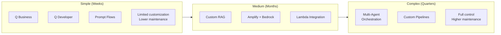
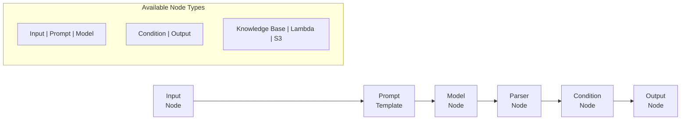
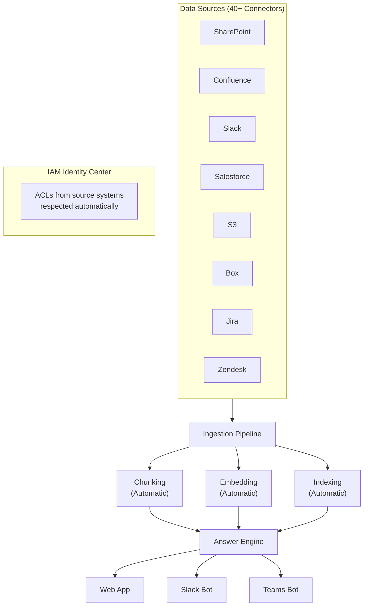
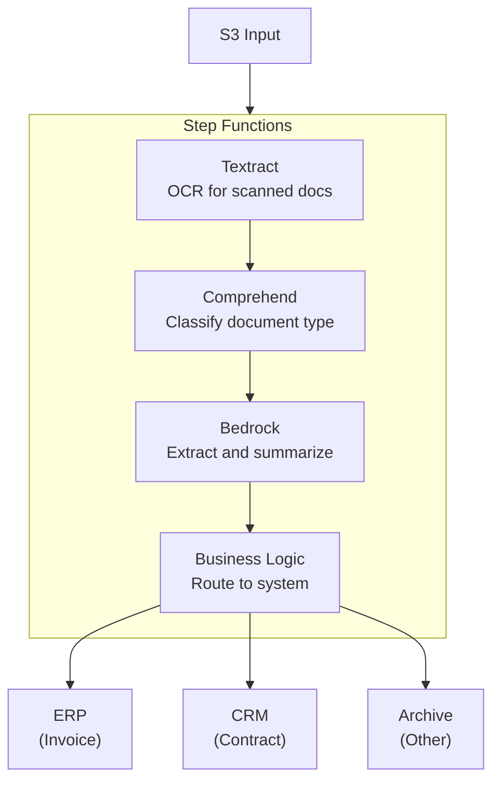
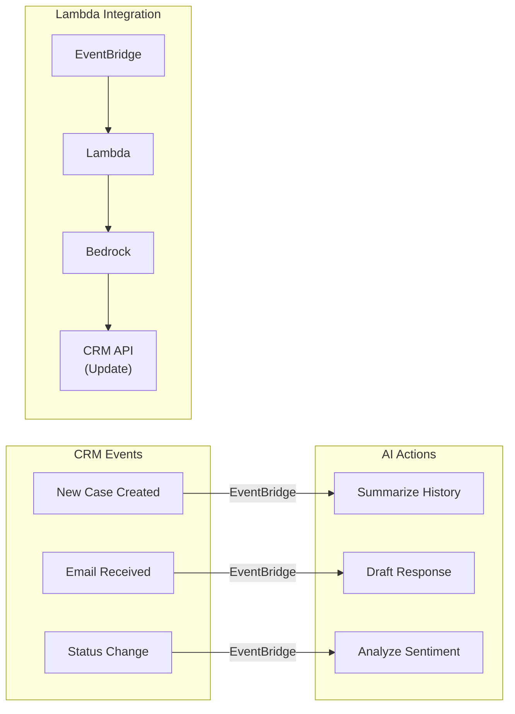
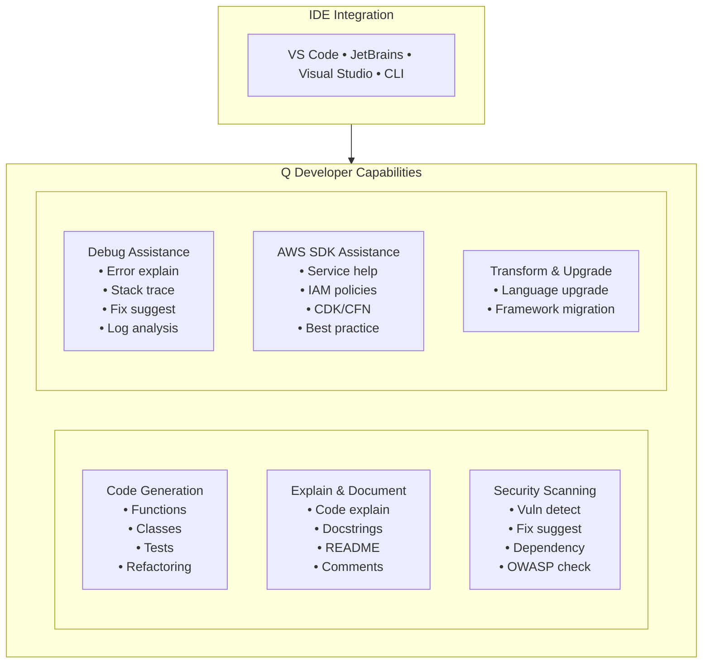
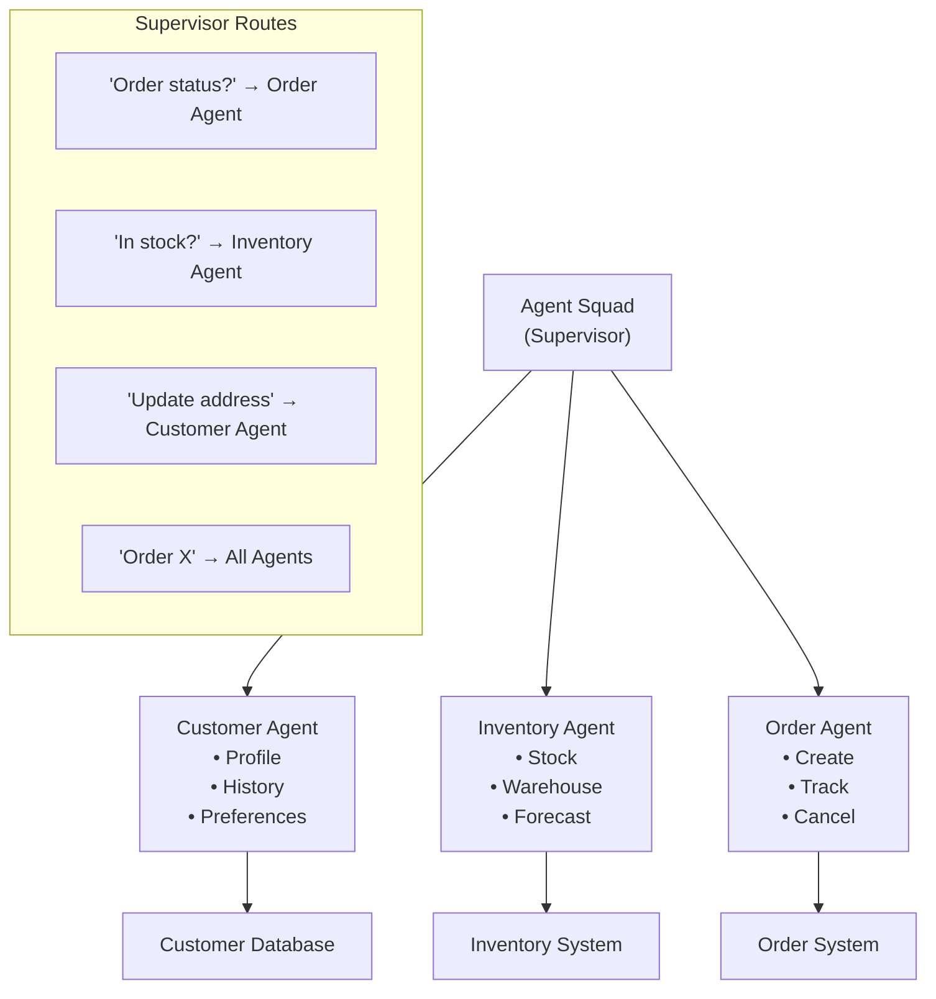

# Application Integration Patterns

**Domain 2 | Task 2.5 | ~45 minutes**

---

## Why This Matters

Building GenAI into applications requires more than calling an API. You need **UI components** that handle streaming text, **business system integrations** that connect AI to where work happens, and **developer tooling** that accelerates building these systems.

The challenge isn't technical capability—modern foundation models can do remarkable things. The challenge is **integration**: how do you surface AI capabilities in ways users naturally interact with? How do you connect AI to the 47 different systems your enterprise already uses? How do you debug when something goes wrong in a probabilistic system?

AWS provides managed services for common integration patterns—from Amplify UI components to Q Business for enterprise knowledge to Q Developer for code assistance. Understanding when to use these managed services versus building custom solutions determines whether you ship in weeks or months.

**The Integration Spectrum**:



---

## Building GenAI User Interfaces

User interfaces for GenAI applications have unique requirements that differ from traditional web applications. Understanding these requirements is essential for building applications users actually want to use.

### What Makes GenAI UIs Different

Traditional web applications display complete data once it's ready. GenAI applications must handle **progressive content generation** where responses emerge token by token over several seconds.

| Requirement | Traditional Apps | GenAI Apps | Implementation |
|-------------|------------------|------------|----------------|
| **Response display** | Show complete when ready | Stream as tokens arrive | SSE, WebSockets |
| **Loading indication** | Spinner until done | Typing indicator, partial text | Progressive rendering |
| **Context management** | Session state | Conversation history | State management + context window |
| **Source attribution** | Links | Inline citations from RAG | Citation components |
| **Confidence display** | N/A | Visual uncertainty indicators | Confidence scoring UI |
| **Alternative responses** | Refresh page | Regenerate button | Multiple response handling |
| **Error handling** | Error messages | Graceful degradation | Fallback responses |

### Streaming Implementation Pattern

```python
# Backend: Flask/FastAPI SSE endpoint
from flask import Flask, Response, stream_with_context
import boto3
import json

app = Flask(__name__)
bedrock = boto3.client('bedrock-runtime')

@app.route('/api/chat', methods=['POST'])
def chat():
    prompt = request.json['prompt']
    conversation_id = request.json.get('conversation_id')

    def generate():
        response = bedrock.invoke_model_with_response_stream(
            modelId='anthropic.claude-3-sonnet-20240229-v1:0',
            body=json.dumps({
                'anthropic_version': 'bedrock-2023-05-31',
                'max_tokens': 4096,
                'messages': [{'role': 'user', 'content': prompt}]
            })
        )

        for event in response['body']:
            chunk_data = event.get('chunk', {}).get('bytes')
            if chunk_data:
                chunk = json.loads(chunk_data)
                if chunk['type'] == 'content_block_delta':
                    text = chunk['delta'].get('text', '')
                    # Server-Sent Events format
                    yield f"data: {json.dumps({'text': text, 'done': False})}\n\n"
                elif chunk['type'] == 'message_stop':
                    yield f"data: {json.dumps({'text': '', 'done': True})}\n\n"

    return Response(
        stream_with_context(generate()),
        mimetype='text/event-stream',
        headers={
            'Cache-Control': 'no-cache',
            'X-Accel-Buffering': 'no'  # Disable nginx buffering
        }
    )
```

```typescript
// Frontend: React streaming component
import { useState, useCallback } from 'react';

interface Message {
  role: 'user' | 'assistant';
  content: string;
  isStreaming?: boolean;
}

function ChatInterface() {
  const [messages, setMessages] = useState<Message[]>([]);
  const [isLoading, setIsLoading] = useState(false);

  const sendMessage = useCallback(async (prompt: string) => {
    // Add user message
    setMessages(prev => [...prev, { role: 'user', content: prompt }]);

    // Add empty assistant message for streaming
    setMessages(prev => [...prev, {
      role: 'assistant',
      content: '',
      isStreaming: true
    }]);

    setIsLoading(true);

    const eventSource = new EventSource(`/api/chat?prompt=${encodeURIComponent(prompt)}`);

    eventSource.onmessage = (event) => {
      const data = JSON.parse(event.data);

      if (data.done) {
        // Mark streaming complete
        setMessages(prev => {
          const updated = [...prev];
          updated[updated.length - 1].isStreaming = false;
          return updated;
        });
        eventSource.close();
        setIsLoading(false);
      } else {
        // Append streamed text
        setMessages(prev => {
          const updated = [...prev];
          updated[updated.length - 1].content += data.text;
          return updated;
        });
      }
    };

    eventSource.onerror = () => {
      eventSource.close();
      setIsLoading(false);
    };
  }, []);

  return (
    <div className="chat-container">
      {messages.map((msg, i) => (
        <div key={i} className={`message ${msg.role}`}>
          {msg.content}
          {msg.isStreaming && <span className="cursor-blink">▌</span>}
        </div>
      ))}
    </div>
  );
}
```

### AWS Amplify for AI Interfaces

**AWS Amplify** provides React components specifically designed for AI interfaces, eliminating the need to build complex streaming and state management from scratch.

**Amplify Gen2 AI Capabilities**:

| Feature | Description | Benefit |
|---------|-------------|---------|
| **AI Kit** | Pre-built conversation components | Production-ready chat UI |
| **Bedrock Integration** | Direct connection to Bedrock models | No middleware required |
| **Conversation Management** | Multi-turn context handling | Automatic history |
| **Streaming Display** | Token-by-token rendering | Better UX |
| **Authentication** | Cognito integration | Secure access |
| **Backend Routes** | Server-side Bedrock calls | API key protection |

```typescript
// Amplify Gen2 AI conversation setup
import { defineBackend } from '@aws-amplify/backend';
import { defineConversationHandler } from '@aws-amplify/backend-ai/conversation';

// Define the AI conversation handler
export const aiHandler = defineConversationHandler({
  name: 'SupportAssistant',
  systemPrompt: `You are a helpful customer support assistant for TechCorp.
    You have access to product documentation and can help with:
    - Product questions
    - Troubleshooting
    - Account inquiries
    Be concise and helpful.`,

  model: {
    resourcePath: 'anthropic.claude-3-sonnet-20240229-v1:0',
    region: 'us-east-1'
  },

  inferenceConfiguration: {
    maxTokens: 2048,
    temperature: 0.7,
    topP: 0.9
  }
});

// Frontend usage
import { generateClient } from 'aws-amplify/api';
import { createAIConversation } from '@aws-amplify/ui-react-ai';

const client = generateClient();

function SupportChat() {
  const [
    { messages, isLoading },
    handleSendMessage
  ] = createAIConversation(client, 'SupportAssistant');

  return (
    <AIConversation
      messages={messages}
      isLoading={isLoading}
      onSendMessage={handleSendMessage}
      avatars={{
        user: { src: '/user-avatar.png' },
        ai: { src: '/bot-avatar.png' }
      }}
    />
  );
}
```

### Bedrock Prompt Flows

**Bedrock Prompt Flows** enables **non-developers** to build AI workflows visually, accelerating experimentation by removing the developer bottleneck for simple automation.



**Prompt Flow Node Types**:

| Node Type | Purpose | Use Case |
|-----------|---------|----------|
| **Input** | Accept user input | Start of flow |
| **Prompt** | Template with variables | Reusable prompts |
| **Model** | Invoke foundation model | Generate response |
| **Knowledge Base** | RAG retrieval | Ground responses |
| **Condition** | Branch logic | Route by content |
| **Lambda** | Custom code | Complex processing |
| **Output** | Return result | End of flow |

**When to Use Prompt Flows vs Code**:

| Prompt Flows | Custom Code |
|--------------|-------------|
| Business user prototyping | Production systems |
| Simple linear workflows | Complex branching |
| Quick experimentation | Fine-grained control |
| No deployment infrastructure | CI/CD integration |
| Limited error handling | Comprehensive error handling |

### OpenAPI for API Contracts

**OpenAPI specifications** define your GenAI API contracts, providing a single source of truth for frontend-backend integration.

```yaml
# GenAI API Contract - openapi.yaml
openapi: 3.0.3
info:
  title: GenAI Application API
  version: 1.0.0
  description: API for AI-powered customer support application

paths:
  /api/chat:
    post:
      operationId: sendMessage
      summary: Send a chat message and receive AI response
      requestBody:
        required: true
        content:
          application/json:
            schema:
              $ref: '#/components/schemas/ChatRequest'
      responses:
        '200':
          description: Streaming AI response
          content:
            text/event-stream:
              schema:
                $ref: '#/components/schemas/StreamChunk'
        '429':
          description: Rate limit exceeded
          content:
            application/json:
              schema:
                $ref: '#/components/schemas/RateLimitError'

  /api/conversations/{conversationId}:
    get:
      operationId: getConversation
      summary: Retrieve conversation history
      parameters:
        - name: conversationId
          in: path
          required: true
          schema:
            type: string
            format: uuid
      responses:
        '200':
          description: Conversation history
          content:
            application/json:
              schema:
                $ref: '#/components/schemas/Conversation'

components:
  schemas:
    ChatRequest:
      type: object
      required:
        - message
      properties:
        message:
          type: string
          maxLength: 10000
        conversationId:
          type: string
          format: uuid
        temperature:
          type: number
          minimum: 0
          maximum: 1
          default: 0.7

    StreamChunk:
      type: object
      properties:
        text:
          type: string
        done:
          type: boolean
        citations:
          type: array
          items:
            $ref: '#/components/schemas/Citation'

    Citation:
      type: object
      properties:
        source:
          type: string
        text:
          type: string
        confidence:
          type: number

    RateLimitError:
      type: object
      properties:
        error:
          type: string
        retryAfter:
          type: integer
          description: Seconds until retry allowed
```

---

## Integrating with Business Systems

GenAI adds intelligence to business processes across the enterprise. The key is connecting AI capabilities to **where work actually happens** rather than creating separate AI applications.

### Amazon Q Business Architecture

**Q Business** provides enterprise knowledge assistance **without requiring you to build custom RAG pipelines**.



**What Q Business handles automatically:**

| Component | Q Business | Custom RAG |
|-----------|------------|------------|
| **Data connectors** | 40+ pre-built | Build per source |
| **Document parsing** | PDFs, Office, HTML | Custom parsers |
| **Chunking strategy** | Optimized defaults | Design and tune |
| **Embedding generation** | Managed | Choose model, deploy |
| **Vector storage** | Managed | OpenSearch, Aurora, etc. |
| **Retrieval ranking** | Built-in | Implement reranking |
| **Access control** | From source systems | Implement manually |
| **Response generation** | Configured model | Prompt engineering |

### Q Business vs Custom RAG Decision Framework

| Factor | Choose Q Business | Choose Custom RAG |
|--------|-------------------|-------------------|
| **Time to deploy** | Weeks | Months |
| **Data sources** | Standard enterprise systems | Proprietary systems |
| **Chunking needs** | Default works | Domain-specific required |
| **Embedding model** | Default sufficient | Custom/fine-tuned needed |
| **Access control** | Enterprise ACLs | Complex custom rules |
| **Response format** | Standard Q&A | Structured extraction |
| **Cost model** | Predictable per-user | Variable per-query |

**When Q Business is ideal:**
- Employee questions about internal docs
- HR policy lookups
- IT support knowledge base
- Sales enablement content
- Cross-department information access

**When Custom RAG is required:**
- Specific chunking strategies (code, legal documents)
- Custom embedding models (domain-specific vocabulary)
- Multi-modal retrieval (images, diagrams)
- Complex re-ranking logic
- Structured output extraction

### Bedrock Data Automation

**Bedrock Data Automation** addresses document-heavy workflows, transforming manual document processing into automated pipelines.



**Document Processing Implementation**:

```python
import boto3
import json
from enum import Enum

class DocumentType(Enum):
    INVOICE = "invoice"
    CONTRACT = "contract"
    FORM = "form"
    CORRESPONDENCE = "correspondence"
    UNKNOWN = "unknown"

class DocumentProcessor:
    """Intelligent document processing with AWS AI services."""

    def __init__(self):
        self.textract = boto3.client('textract')
        self.comprehend = boto3.client('comprehend')
        self.bedrock = boto3.client('bedrock-runtime')

    def process_document(self, bucket: str, key: str) -> dict:
        """Complete document processing pipeline."""

        # Step 1: Extract text with Textract
        text, tables, forms = self._extract_content(bucket, key)

        # Step 2: Classify document type
        doc_type = self._classify_document(text)

        # Step 3: Extract structured data based on type
        extracted_data = self._extract_structured_data(text, tables, doc_type)

        # Step 4: Generate summary
        summary = self._generate_summary(text, doc_type)

        return {
            'documentType': doc_type.value,
            'extractedData': extracted_data,
            'summary': summary,
            'confidence': self._calculate_confidence(extracted_data)
        }

    def _extract_content(self, bucket: str, key: str) -> tuple:
        """Extract text, tables, and forms from document."""
        response = self.textract.analyze_document(
            Document={'S3Object': {'Bucket': bucket, 'Name': key}},
            FeatureTypes=['TABLES', 'FORMS']
        )

        text_blocks = []
        tables = []
        forms = {}

        for block in response['Blocks']:
            if block['BlockType'] == 'LINE':
                text_blocks.append(block['Text'])
            elif block['BlockType'] == 'TABLE':
                tables.append(self._parse_table(block, response['Blocks']))
            elif block['BlockType'] == 'KEY_VALUE_SET':
                key, value = self._parse_form_field(block, response['Blocks'])
                if key:
                    forms[key] = value

        return '\n'.join(text_blocks), tables, forms

    def _classify_document(self, text: str) -> DocumentType:
        """Classify document using Comprehend custom classifier."""
        # Use keywords and patterns for classification
        text_lower = text.lower()

        if any(kw in text_lower for kw in ['invoice', 'bill to', 'amount due', 'payment terms']):
            return DocumentType.INVOICE
        elif any(kw in text_lower for kw in ['agreement', 'whereas', 'parties agree', 'terms and conditions']):
            return DocumentType.CONTRACT
        elif any(kw in text_lower for kw in ['please fill', 'signature:', 'date of birth']):
            return DocumentType.FORM
        else:
            return DocumentType.CORRESPONDENCE

    def _extract_structured_data(self, text: str, tables: list, doc_type: DocumentType) -> dict:
        """Extract structured data using Bedrock based on document type."""

        extraction_prompts = {
            DocumentType.INVOICE: """Extract the following from this invoice:
                - Invoice number
                - Invoice date
                - Due date
                - Vendor name
                - Total amount
                - Line items (description, quantity, unit price, total)

                Return as JSON. Document text:
                {text}""",

            DocumentType.CONTRACT: """Extract the following from this contract:
                - Contract parties
                - Effective date
                - Term/duration
                - Key obligations
                - Termination conditions
                - Total value (if specified)

                Return as JSON. Document text:
                {text}"""
        }

        prompt = extraction_prompts.get(doc_type, "Extract key information as JSON:\n{text}")

        response = self.bedrock.invoke_model(
            modelId='anthropic.claude-3-sonnet-20240229-v1:0',
            body=json.dumps({
                'anthropic_version': 'bedrock-2023-05-31',
                'max_tokens': 2048,
                'messages': [{
                    'role': 'user',
                    'content': prompt.format(text=text[:8000])  # Truncate for context limit
                }]
            })
        )

        result = json.loads(response['body'].read())
        return json.loads(result['content'][0]['text'])

    def _generate_summary(self, text: str, doc_type: DocumentType) -> str:
        """Generate executive summary of document."""
        response = self.bedrock.invoke_model(
            modelId='anthropic.claude-3-haiku-20240307-v1:0',  # Faster model for summaries
            body=json.dumps({
                'anthropic_version': 'bedrock-2023-05-31',
                'max_tokens': 256,
                'messages': [{
                    'role': 'user',
                    'content': f"Summarize this {doc_type.value} in 2-3 sentences:\n{text[:4000]}"
                }]
            })
        )

        result = json.loads(response['body'].read())
        return result['content'][0]['text']
```

### CRM Integration Pattern

Lambda functions call Bedrock from CRM triggers, enabling AI enhancement of existing business processes:



```python
import boto3
import json
from datetime import datetime

class CRMIntegration:
    """AI-enhanced CRM operations via Lambda + Bedrock."""

    def __init__(self):
        self.bedrock = boto3.client('bedrock-runtime')
        # Your CRM client here

    def handle_new_case(self, event: dict) -> dict:
        """Process new support case with AI enhancement."""
        case_id = event['detail']['caseId']
        customer_id = event['detail']['customerId']
        subject = event['detail']['subject']
        description = event['detail']['description']

        # Get customer history
        history = self._get_customer_history(customer_id)

        # Generate case summary and recommendations
        analysis = self._analyze_case(subject, description, history)

        # Update CRM with AI insights
        self._update_crm_case(case_id, {
            'aiSummary': analysis['summary'],
            'suggestedCategory': analysis['category'],
            'urgencyScore': analysis['urgency'],
            'suggestedResponse': analysis['draft_response'],
            'relatedCases': analysis['similar_cases']
        })

        return {'statusCode': 200, 'caseId': case_id}

    def _analyze_case(self, subject: str, description: str, history: list) -> dict:
        """Comprehensive case analysis using Bedrock."""

        history_text = self._format_history(history)

        prompt = f"""Analyze this customer support case and provide structured insights.

SUBJECT: {subject}

DESCRIPTION:
{description}

CUSTOMER HISTORY (last 5 interactions):
{history_text}

Provide analysis in the following JSON format:
{{
  "summary": "2-3 sentence summary of the issue",
  "category": "one of: billing, technical, account, general",
  "urgency": "1-5 where 5 is critical",
  "urgency_reason": "why this urgency level",
  "sentiment": "positive, neutral, negative, or frustrated",
  "draft_response": "suggested agent response",
  "similar_cases": ["case patterns that might be related"],
  "recommended_actions": ["specific steps to resolve"]
}}"""

        response = self.bedrock.invoke_model(
            modelId='anthropic.claude-3-sonnet-20240229-v1:0',
            body=json.dumps({
                'anthropic_version': 'bedrock-2023-05-31',
                'max_tokens': 1024,
                'messages': [{'role': 'user', 'content': prompt}]
            })
        )

        result = json.loads(response['body'].read())
        return json.loads(result['content'][0]['text'])

    def draft_email_response(self, case_id: str, tone: str = 'professional') -> str:
        """Generate email response draft for support case."""
        case = self._get_case(case_id)

        prompt = f"""Draft a {tone} customer support email response.

CUSTOMER ISSUE:
{case['description']}

CUSTOMER NAME: {case['customerName']}

RESOLUTION STATUS: {case.get('resolution', 'pending')}

Guidelines:
- Address the customer by name
- Acknowledge their concern
- Provide clear next steps or resolution
- Maintain {tone} tone throughout
- Keep under 200 words"""

        response = self.bedrock.invoke_model(
            modelId='anthropic.claude-3-sonnet-20240229-v1:0',
            body=json.dumps({
                'anthropic_version': 'bedrock-2023-05-31',
                'max_tokens': 512,
                'messages': [{'role': 'user', 'content': prompt}]
            })
        )

        result = json.loads(response['body'].read())
        return result['content'][0]['text']
```

---

## Developer Productivity with GenAI

GenAI transforms developer workflows just as it transforms end-user applications.

### Amazon Q Developer

**Q Developer** integrates AI coding assistance directly into IDEs, understanding your codebase context to provide relevant suggestions.



**Q Developer Feature Comparison**:

| Feature | Benefit | Example Use Case |
|---------|---------|------------------|
| **Code generation** | Describe intent, receive implementation | "Create a function to validate email addresses" |
| **Inline completion** | Context-aware suggestions as you type | Autocomplete based on your patterns |
| **Code explanation** | Understand unfamiliar code | "What does this regex do?" |
| **Refactoring** | Improve code quality | "Refactor this to use async/await" |
| **Test generation** | Create unit tests automatically | Generate tests for existing functions |
| **Documentation** | Generate docstrings and READMEs | Document APIs consistently |
| **Security scanning** | Find vulnerabilities as you code | SQL injection, XSS detection |
| **Debug assistance** | Explain errors, suggest fixes | Parse CloudWatch logs for solutions |
| **AWS SDK help** | Navigate service complexity | IAM policy generation, CDK patterns |

### Error Pattern Recognition

Q Developer excels at AWS-specific error diagnosis:

```python
# Example: User pastes this CloudWatch error into Q Developer

"""
[ERROR] 2024-03-15T14:22:33.456Z AccessDeniedException: User:
arn:aws:iam::123456789012:user/dev-user is not authorized to perform:
bedrock:InvokeModel on resource:
arn:aws:bedrock:us-east-1::foundation-model/anthropic.claude-3-sonnet-20240229-v1:0
because no identity-based policy allows the bedrock:InvokeModel action
"""

# Q Developer response:
# "This error indicates your IAM user lacks permission to invoke Bedrock models.
# Add this policy to the user or their role:
#
# {
#   "Version": "2012-10-17",
#   "Statement": [{
#     "Effect": "Allow",
#     "Action": "bedrock:InvokeModel",
#     "Resource": "arn:aws:bedrock:us-east-1::foundation-model/anthropic.claude-3-*"
#   }]
# }
#
# Alternatively, use the managed policy: AmazonBedrockFullAccess
# (Note: For production, use more restrictive custom policies)"
```

### Security Scanning in CI/CD

```yaml
# GitHub Actions workflow with Q Developer security scanning
name: Security Scan

on:
  pull_request:
    branches: [main]

jobs:
  security-scan:
    runs-on: ubuntu-latest
    steps:
      - uses: actions/checkout@v4

      - name: Configure AWS credentials
        uses: aws-actions/configure-aws-credentials@v4
        with:
          role-to-assume: ${{ secrets.AWS_ROLE_ARN }}
          aws-region: us-east-1

      - name: Run Q Developer Security Scan
        run: |
          aws codewhisperer start-code-scan \
            --artifacts-type "SOURCE_CODE" \
            --language "python" \
            --client-token "$(uuidgen)"

      - name: Check Scan Results
        run: |
          # Poll for scan completion and check results
          SCAN_ID=$(aws codewhisperer list-code-scan-findings --query 'codeScanJobId')
          aws codewhisperer get-code-scan --code-scan-job-id $SCAN_ID
```

---

## Advanced Application Patterns

Complex applications combine multiple AI capabilities into sophisticated workflows.

### Multi-Agent Systems

**Strands Agents SDK** combined with **Agent Squad** enables specialized agents collaborating:



### Prompt Chaining

Sequence multiple model calls for complex tasks:

```python
class PromptChain:
    """Sequential prompt chain with intermediate validation."""

    def __init__(self):
        self.bedrock = boto3.client('bedrock-runtime')

    async def process_customer_request(self, request: str) -> dict:
        """Four-step chain: Extract → Classify → Generate → Validate."""

        # Step 1: Extract entities
        entities = await self._extract_entities(request)
        print(f"Extracted entities: {entities}")

        # Step 2: Classify intent based on entities
        intent = await self._classify_intent(request, entities)
        print(f"Classified intent: {intent}")

        # Step 3: Generate response appropriate to intent
        response = await self._generate_response(request, entities, intent)
        print(f"Generated response: {response[:100]}...")

        # Step 4: Validate output before returning
        validation = await self._validate_response(response, intent)

        if not validation['valid']:
            # Retry with feedback
            response = await self._generate_response(
                request, entities, intent,
                feedback=validation['issues']
            )

        return {
            'entities': entities,
            'intent': intent,
            'response': response,
            'validation': validation
        }

    async def _extract_entities(self, text: str) -> dict:
        """Step 1: Entity extraction with Haiku (fast)."""
        response = self.bedrock.invoke_model(
            modelId='anthropic.claude-3-haiku-20240307-v1:0',
            body=json.dumps({
                'anthropic_version': 'bedrock-2023-05-31',
                'max_tokens': 256,
                'messages': [{
                    'role': 'user',
                    'content': f"""Extract entities from this customer request. Return JSON:
{{"product": "...", "action": "...", "quantity": ..., "customer_info": {{}}}}

Request: {text}"""
                }]
            })
        )
        result = json.loads(response['body'].read())
        return json.loads(result['content'][0]['text'])

    async def _classify_intent(self, text: str, entities: dict) -> str:
        """Step 2: Intent classification."""
        response = self.bedrock.invoke_model(
            modelId='anthropic.claude-3-haiku-20240307-v1:0',
            body=json.dumps({
                'anthropic_version': 'bedrock-2023-05-31',
                'max_tokens': 64,
                'messages': [{
                    'role': 'user',
                    'content': f"""Classify the intent. Options: purchase, inquiry, complaint, return, support

Request: {text}
Entities: {json.dumps(entities)}

Intent (one word):"""
                }]
            })
        )
        result = json.loads(response['body'].read())
        return result['content'][0]['text'].strip().lower()
```

### Workflow Patterns

| Pattern | Description | Implementation | Use Case |
|---------|-------------|----------------|----------|
| **Sequential** | Each step depends on previous output | Chain of Lambda functions | Multi-step analysis |
| **Parallel** | Independent steps run simultaneously | Step Functions Parallel state | Reduce latency |
| **Conditional** | Branch based on intermediate results | Step Functions Choice state | Route by classification |
| **Loop** | Iterate until quality threshold met | Step Functions with condition | Refine until acceptable |
| **Human-in-the-loop** | Pause for approval | Step Functions with callback | Sensitive actions |
| **Fan-out/Fan-in** | Distribute work, aggregate results | Step Functions Map state | Batch processing |

### Prompt Flows vs Step Functions

| Capability | Prompt Flows | Step Functions |
|------------|--------------|----------------|
| **Target user** | Business analysts | Developers |
| **Learning curve** | Low | Medium |
| **Visual builder** | Yes | Yes (Workflow Studio) |
| **Error handling** | Basic | Comprehensive (catch, retry) |
| **Parallel execution** | Limited | Full support |
| **Human approval** | No | Yes (callback patterns) |
| **Custom code** | Lambda nodes | Lambda, ECS, any AWS service |
| **Version control** | Console | IaC (CDK, CloudFormation) |
| **Testing** | Built-in testing | Integration with test frameworks |
| **Monitoring** | Basic | CloudWatch, X-Ray integration |
| **Cost** | Per flow execution | Per state transition |

---

## Troubleshooting GenAI Applications

GenAI applications have **unique failure modes** beyond traditional application troubleshooting.

### What Makes GenAI Debugging Different

| Traditional Apps | GenAI Apps |
|------------------|------------|
| Binary pass/fail | Subtly wrong responses |
| Deterministic errors | Probabilistic issues |
| Clear error messages | Quality degradation |
| CPU/memory bottlenecks | Token limit issues |
| Network failures | Rate limiting cascades |
| Reproducible bugs | Non-reproducible issues |

### CloudWatch Logs Insights Queries

```sql
-- Find slow requests with low user ratings
fields @timestamp, request_id, model_id, response_time_ms, user_rating
| filter response_time_ms > 10000 and user_rating < 3
| sort @timestamp desc
| limit 50

-- Token usage anomalies
fields @timestamp, user_id, input_tokens, output_tokens,
       (input_tokens + output_tokens) as total_tokens
| filter total_tokens > 10000
| stats count(*) as high_token_requests,
        sum(total_tokens) as total_token_usage
  by bin(1h)

-- Error rate by model
fields @timestamp, model_id, error_type
| filter ispresent(error_type)
| stats count(*) as error_count by model_id, error_type
| sort error_count desc

-- Cache hit analysis
fields @timestamp, cache_hit, response_time_ms
| stats count(*) as requests,
        sum(case when cache_hit then 1 else 0 end) as cache_hits,
        avg(response_time_ms) as avg_latency
  by bin(5m)

-- Guardrail interventions
fields @timestamp, user_id, input_text, guardrail_action, guardrail_reason
| filter guardrail_action = 'BLOCKED'
| sort @timestamp desc
| limit 100

-- RAG retrieval quality
fields @timestamp, query, num_results, max_similarity_score,
       avg_similarity_score
| filter avg_similarity_score < 0.7
| sort @timestamp desc
| limit 50
```

### X-Ray Tracing

Visualize request flow through your GenAI pipeline:

```python
from aws_xray_sdk.core import xray_recorder, patch_all

# Patch all supported libraries
patch_all()

class TracedGenAIPipeline:
    """Full X-Ray tracing for GenAI requests."""

    @xray_recorder.capture('ProcessRequest')
    def process(self, query: str) -> dict:
        """Traced end-to-end request processing."""

        segment = xray_recorder.current_segment()
        segment.put_annotation('query_length', len(query))

        # Trace embedding generation
        with xray_recorder.in_subsegment('GenerateEmbedding') as subseg:
            start = time.time()
            embedding = self._generate_embedding(query)
            subseg.put_metadata('embedding_dim', len(embedding))
            subseg.put_annotation('embedding_time_ms',
                                  int((time.time() - start) * 1000))

        # Trace vector search
        with xray_recorder.in_subsegment('VectorSearch') as subseg:
            start = time.time()
            results = self._search_vectors(embedding)
            subseg.put_annotation('num_results', len(results))
            subseg.put_annotation('search_time_ms',
                                  int((time.time() - start) * 1000))
            subseg.put_metadata('top_score', results[0]['score'] if results else 0)

        # Trace LLM invocation
        with xray_recorder.in_subsegment('InvokeModel') as subseg:
            start = time.time()
            response = self._invoke_model(query, results)
            subseg.put_annotation('model', 'claude-3-sonnet')
            subseg.put_annotation('invoke_time_ms',
                                  int((time.time() - start) * 1000))
            subseg.put_metadata('input_tokens', response.get('input_tokens'))
            subseg.put_metadata('output_tokens', response.get('output_tokens'))

        return response
```

**Sample X-Ray Trace Visualization**:
```
API Gateway ──► Lambda ──► Knowledge Base ──► Bedrock ──► Post-processing
   100ms         50ms         800ms           3500ms         100ms
                                │
                                └── OpenSearch: 650ms
                                    Rerank: 150ms
```

### Common Issues and Solutions

| Issue | Symptoms | Likely Cause | Solution |
|-------|----------|--------------|----------|
| **Token limit exceeded** | 400 error, truncated responses | Prompts too long | Truncate input, summarize context |
| **Rate limiting** | 429 errors, timeouts | Too many requests | Backoff, quota increase, caching |
| **Low quality outputs** | User complaints, low ratings | Prompt issues | Review prompts, add examples |
| **Slow responses** | High p99 latency | Model choice, no streaming | Smaller model, streaming, optimization |
| **Retrieval misses** | Irrelevant answers | RAG config | Review chunking, embeddings, search params |
| **Cost spikes** | Unexpected bills | Token waste, retries | Budgets, caching, prompt optimization |
| **Hallucinations** | Factually incorrect | No grounding | Add RAG, guardrails, citations |
| **Inconsistent behavior** | Works sometimes | Temperature, random seed | Lower temperature, set seed |

---

## Exam Tips

| When you see... | Think... |
|-----------------|----------|
| "enterprise knowledge assistant" | Amazon Q Business |
| "employee questions about internal docs" | Amazon Q Business |
| "40+ data source connectors" | Amazon Q Business |
| "developer productivity" or "code assistance" | Amazon Q Developer |
| "security scanning during development" | Amazon Q Developer |
| "no-code AI workflow" | Bedrock Prompt Flows |
| "business users building AI workflows" | Bedrock Prompt Flows |
| "troubleshooting GenAI" | CloudWatch Logs Insights + X-Ray |
| "document processing automation" | Bedrock Data Automation + Step Functions |
| "streaming user interface" | SSE + Amplify AI components |
| "multi-agent collaboration" | Agent Squad (supervisor pattern) |
| "OCR + AI summarization" | Textract + Bedrock |

---

## Key Takeaways

> **1. Amplify provides pre-built AI UI components for rapid development.**
> Don't build streaming chat interfaces from scratch. Use Amplify Gen2's AI Kit for production-ready conversation components with built-in Bedrock integration.

> **2. Q Business is the managed enterprise knowledge assistant with minimal setup.**
> 40+ data source connectors, enterprise access controls, no RAG pipeline to build. Choose Q Business when standard enterprise knowledge access meets your needs.

> **3. Q Developer assists developers with code generation, debugging, and security.**
> Context-aware suggestions based on your codebase. AWS SDK assistance and security scanning included. Integrates with CI/CD pipelines.

> **4. Prompt Flows enables no-code AI workflow building for non-developers.**
> Accelerate experimentation without developer bottleneck. Use for prototyping, then migrate to Step Functions for production complexity.

> **5. CloudWatch Logs Insights + X-Ray = GenAI observability and debugging.**
> Query logs for patterns. Trace requests to identify bottlenecks. Build dashboards for operational visibility.

> **6. Business system integration follows event-driven patterns.**
> Use EventBridge to connect CRM events to Lambda functions that call Bedrock. AI enhances existing workflows without disrupting them.

---

## Common Mistakes

| Mistake | Why It Matters |
|---------|----------------|
| **Building custom RAG when Q Business would suffice** | Weeks of development for something that's managed. Evaluate Q Business first for standard enterprise knowledge needs. |
| **Not using streaming for user-facing AI interfaces** | Users perceive non-streaming responses as broken. Always stream responses over 2-3 seconds. |
| **Manual debugging instead of X-Ray and Logs Insights** | Can't trace issues across distributed services. Instrument from day one. |
| **Over-engineering simple workflows** | Prompt Flows handles many use cases without code. Start simple, add complexity only when needed. |
| **Ignoring Q Developer for AWS coding** | Missing context-aware AWS SDK assistance and security scanning. Productivity multiplier for AWS development. |
| **Skipping OpenAPI contract definition** | Frontend-backend mismatches, manual SDK maintenance. Define contracts first for type-safe integration. |
| **Not tracing token usage** | Cost spirals undetected. Monitor and alert on token consumption per user and per request. |
