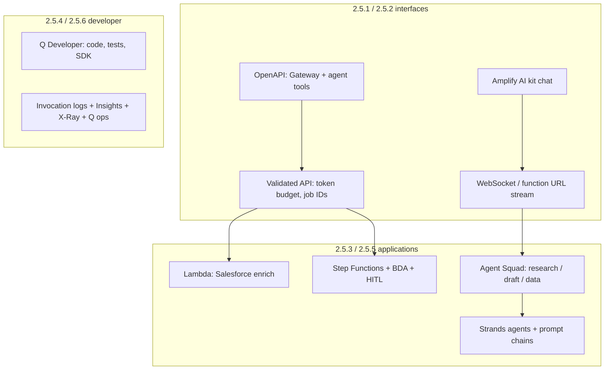

# Task 2.5 — Implement Application Integration Patterns and Development Tools

**Domain 2 · Skills 2.5.1–2.5.6**

[Task 2.4](/learn/2/fm-api-integrations) was **the wire**. [Task 2.3](/learn/2/enterprise-integration) was **the enterprise**. This task is **the workbench**: the interfaces applications and developers actually touch, the business workflows GenAI improves, the frameworks for composing agentic apps, and the tools for building and debugging all of it faster.

The six skills are three pairs. That pairing is the whole mental model.

| Pair | Skills | Lens |
|------|--------|------|
| **Interfaces** | 2.5.1 design the API around GenAI physics; 2.5.2 make it consumable | In |
| **Applications** | 2.5.3 embed in business systems; 2.5.5 compose agentic apps | Out |
| **Developer** | 2.5.4 AI to *build* faster; 2.5.6 observability to *debug* faster | Around |

This task **overlaps on purpose**. Streaming and retries showed up in 2.4.2/2.4.3. Step Functions in 2.4.4 and 2.1. X-Ray in 2.4.3. Exam stems here are framed as *application requirements* (“the team needs…”, “developers must…”) rather than raw invoke mechanics. Read the repeats as the same facts at the **contract and workbench** layer.

By the end you should be able to answer, out loud:

> How is the copilot’s API shaped around tokens and 29-second ceilings, who gets Amplify vs Flows vs OpenAPI, which AWS shape enriches Salesforce vs extracts 10-Ks, which framework is the agent, and how do we see the prompt that went wrong?

One application runs through every section.

> **Technology Investment Research Copilot.** Front-end wants a React chat with auth *this sprint*. Platform publishes an OpenAPI contract that agents also use as tools. Salesforce leads need a draft on create. 10-Ks need extract → review → deliver. Analysts talk to research, drafting, and data specialists. Engineers write Bedrock SDK code in the IDE and debug “the answer was wrong.”

> **Exam tip:** Blueprint names **streaming / tokens / retries** (2.5.1), **Amplify / OpenAPI / Bedrock Flows** (2.5.2), **Lambda CRM / Step Functions docs / BDA** plus **Q Business / Quick** (2.5.3), **Q Developer** (and **Kiro / Unified Studio**) (2.5.4), **Strands / Agent Squad / Step Functions / chaining** (2.5.5), **Logs Insights / X-Ray / Q ops** (2.5.6).

---

## Skill 2.5.1 — FM API interfaces

**The question this skill answers:** Ordinary REST assumes small payloads, sub-second responses, stateless calls. GenAI violates all three. How do you design the *contract* around that?

**Concept.** Three named concerns: **streaming through the API layer**, **token limit management**, **retry strategies for model timeouts**. You already met the transports in [2.4.2](/learn/2/fm-api-integrations). Here the exam asks whether the *interface* respects them.

**Mental model.** The AMD chat API is not `GET /ticker` with a 200 ms JSON body.

**Streaming as an interface decision.** Default **API Gateway REST/HTTP buffers**. HTTP APIs still do not stream. REST integrations still **hard-timeout around 29 seconds** unless you change the pattern. REST *can* stream if `responseTransferMode=STREAM` (2.4.2) — stems that say “REST timed out at ~29s” are still testing the default ceiling.

Decision tree:

| Need | Interface |
|------|-----------|
| Interactive stream over plain HTTP | **Lambda function URL** response streaming (optional CloudFront) |
| Bidirectional / long-lived / cancel | **API Gateway WebSocket API** |
| REST *must* front it and generation is long | **Async contract**: accept, return **job ID**, poll / SSE / WebSocket push |

Design the **chunk contract** as carefully as the transport: delta text, finish reason, usage in a terminal event — so every consumer parses the stream the same way.

**Token limit management — three points.**

- **Input:** estimate/count before invoke. API Gateway JSON Schema catches gross size (2.4.1); Lambda does token math. RAG: explicit **context budget** — system + chunks + history + user must fit. Trim by policy (oldest history first, then lowest-ranked chunks).
- **Output:** set `max_tokens` *per use case*, not the model maximum. Surface **stop reason** so clients distinguish finished vs truncated.
- **Accounting:** return usage metadata; log per caller. That feeds [2.3.5](/learn/2/enterprise-integration) cost attribution and [2.4.3](/learn/2/fm-api-integrations) quotas.

**Retries vs timeouts.** A long generation can outrun the *client*, Lambda, or the 29 s Gateway ceiling. Blindly retrying a *slow-but-succeeding* call **doubles cost**. Design responses:

1. Extend SDK **read timeouts** (defaults are for fast APIs).
2. Align the chain **outermost longest**: client > API > Lambda > SDK — or inner success is discarded as outer failure.
3. Retry **idempotently**: client request ID → return the cached first result.
4. Prefer **streaming as timeout defense** — first token in seconds keeps idle timeouts from firing.
5. If it will not fit interactive limits, **change the pattern** (SQS async, 2.4.1) — do not keep raising one timeout.

Backoff-and-jitter from 2.4.3 still applies to *genuine* failures (`ThrottlingException`, 5xx). Do not confuse “it was slow” with “it failed.”

**Failure mode.** REST proxy, 29 s default, no job ID, retry on timeout with no idempotency key — you pay twice and the analyst sees an error after a successful generation.

```quickcheck
Q: REST API Gateway in front of a 40 s AMD thesis generation. Users see 29 s timeouts; retries double the bill.
A: Raise temperature
B: Do not pretend REST is a 60 s stream — function URL / WebSocket / REST STREAM, or async job ID; align timeouts; idempotent retries
C: Put the weights on Lambda
D: Disable max_tokens
correct: B
feedback: 2.5.1 is the contract. 2.4.2 is the transport. Same 29 s fact, application-requirements stem.
```

```fillin
Context window overflow is an API design problem: enforce an explicit {{context budget}} (system + chunks + history + user).
```

---

## Skill 2.5.2 — Accessible AI interfaces

**The question this skill answers:** Adoption is throttled by how hard FM capability is to consume. Which mechanism for which audience?

**Concept.** Three layers. Matching **mechanism to audience** is what the exam tests.

| Mechanism | Audience | What it hides |
|-----------|----------|----------------|
| **Amplify AI kit** | Front-end developers | Auth, APIs, streaming, conversation history |
| **OpenAPI / API-first** | API teams *and* agent builders | Contract drift; hand-written clients, docs, **tool defs** |
| **Bedrock Flows** (exam: **Prompt Flows**) | Non-coders, rapid prototypers | Code — visual prompts / KBs / Lambdas / agents / conditions |

**Amplify.** Declare auth/data/hosting in TypeScript. The **AI kit** adds conversation or generation routes plus React chat/streaming components wired to Bedrock. Cognito, streaming, and history are handled. Trigger: “front-end team,” “React app,” “fastest path to a chat UI with authentication.”

**OpenAPI.** Write the **contract before the implementation**. Generate clients, stubs, docs, mocks. Two GenAI-specific reasons it is on the blueprint: **API Gateway can import the spec** (including request-validation models — loop closed with 2.4.1), and OpenAPI schemas are how **Bedrock Agents action groups** (and similar tool contracts) learn what they can call. A clean spec is simultaneously human docs and **machine-consumable tools**. That dual use is a favorite stem.

**Bedrock Flows.** Visual builder: drag prompt, Knowledge Base, Lambda, agent, condition nodes; test in console; publish a **versioned, invokable** resource. Trigger: “business analysts / minimal coding / visual workflow.” Developers may prototype a chain on the canvas, then harden in code.

**Flows vs Step Functions.** Flows is **FM-native and no-code**, inside Bedrock’s world. **Step Functions** is general-purpose orchestration when the workflow spans arbitrary AWS services, needs enterprise retry/HITL, or exceeds the canvas (2.5.5).

**Failure mode.** Platform team writes a custom chat Lambda “because we might need it later” while the stem says the front-end team must ship this sprint with Cognito. Or skip OpenAPI and discover the agent’s action group does not match the live API.

```quickcheck
Q: Front-end team needs an authenticated AMD chat UI this sprint. They will not own Lambda.
A: Hand-roll WebSockets and boto3 in React
B: AWS Amplify AI kit (Cognito, streaming, history)
C: SageMaker training job
D: DMS
correct: B
feedback: 2.5.2 audience match. Custom streaming is 2.4.2/2.5.1 when you *must* own the wire.
```

---

## Skill 2.5.3 — Business system enhancements

**The question this skill answers:** 2.3.2 said “embed.” This skill names **three shapes** of business app. Exam scenarios are variations on these.

**Concept.**

| Shape | When | Named implementation |
|-------|------|----------------------|
| Discrete event on one record | Enrich / draft / classify when something happens | **Lambda** (+ EventBridge or webhook — 2.3.2) |
| Multi-stage document pipeline + HITL | Ingest → extract → classify → summarize → review → deliver | **Step Functions** (Map, Retry/Catch, `waitForTaskToken`) |
| Unstructured → structured, minimal custom code | Documents, images, audio, video → JSON fields | **Bedrock Data Automation (BDA)** blueprints |

**Lambda for CRM.** New Salesforce lead (webhook / partner event) → Lambda pulls the record → Bedrock scores, summarizes, or drafts follow-up → write back via CRM API. Short, **stateless**, event-shaped. Intelligence is one well-prompted call; engineering is auth, idempotency, write-back.

**Step Functions for documents.** 10-Ks land in S3. **Map** fans out pages/files. Per-state retry so one bad PDF does not kill the batch. **`waitForTaskToken`** pauses for a reviewer on low confidence (2.1 HITL, now an application pipeline). Visual history is the audit trail. Standard workflows for long batches; Express for short high-volume.

**BDA.** Managed transform of **multimodal** unstructured content into structured output. Standard outputs (summary, transcript, scene, document text) or **blueprints** (“invoice number, total, dates”) with **confidence scores** for review routing. Also a Knowledge Base **parser** for complex documents.

**Exam decision:** custom logic, mixed services, human approval → **Step Functions**. “Extract structured fields from docs/media with minimal code” → **BDA**. Real systems **nest**: Step Functions calls BDA as the extract state, then HITL.

**Also named on the blueprint (do not skip).** These are *products*, not pipelines you assemble:

| Product | Trigger |
|---------|---------|
| **Amazon Q Business** | Employee chat over company data (SharePoint, wikis) with **source ACLs** — do not build that RAG yourself |
| **Q Business Apps** | No-code internal apps on that same indexed corpus |
| **Amazon Quick** | Agentic workspace: chat / research / **actions** across enterprise data |
| **Amazon QuickSight** (often “Quick Sight”) | **Dashboards**, NLQ over metrics, embedded BI |

> **Exam trap:** Q Developer is the **IDE**. Q Business is **company knowledge + ACLs**. QuickSight is **charts**. Quick (workspace) is **actions from chat**. BDA is **structured extraction**, not chat.

**Failure mode.** Build a custom agent + Knowledge Base to answer “what is our travel policy?” with SharePoint ACLs — the stem wanted Q Business. Or hand-roll Textract + three Lambdas when BDA blueprints would emit the invoice JSON.

```quickcheck
Q: 10k AMD 10-K PDFs → invoice-like fields as JSON, minimal custom code. Low-confidence rows still need a human.
A: One mega Converse prompt per filing, no orchestration
B: BDA blueprints for extract; Step Functions around it for Map + waitForTaskToken review
C: Amplify AI kit
D: Q Developer in the IDE
correct: B
feedback: 2.5.3 nest BDA inside Step Functions when you need HITL. Amplify and Q Dev are other skills.
```

```fillin
Low-confidence contract review in a document pipeline → Step Functions {{waitForTaskToken}}.
```

---

## Skill 2.5.4 — Developer productivity (Q Developer)

**The question this skill answers:** Use a GenAI assistant to **build** GenAI applications faster. Named tool: **Amazon Q Developer**.

**Concept.** Four threads the blueprint likes to isolate (distractors: CodeGuru, DevOps Guru, “just call Bedrock”).

1. **Code generation and refactoring** — IDE / CLI / console. Inline and chat. Agentic multi-file features. Large **code transformations** (flagship: Java version upgrades).
2. **API assistance** — trained on AWS APIs. Scaffolds **correct boto3/Converse/stream/error handling** (Task 2.4), with citations.
3. **AI component testing** — generates unit tests: mocked Bedrock, stream assembly, retry paths, malformed output. Pair with [2.3.5](/learn/2/enterprise-integration) eval suites: Q writes *deterministic* tests; eval covers *non-deterministic* model behavior.
4. **Performance / review** — N+1 calls, missing pagination, sequential work that should be concurrent, oversized prompts, **hardcoded credentials** (echo of 2.3.3).

**2.5.4 vs 2.5.6.** Same product, different hat. Here it is **build-time**. When the scenario is operating/debugging a running app, you have crossed into 2.5.6.

**Also named.** **Kiro** — AWS agentic IDE; spec-driven, plan-and-edit across files. Use when the stem wants an AWS-native agentic *coding environment*; Q Developer when they stay in VS Code/JetBrains. Kiro does **not** replace production Strands/AgentCore. **SageMaker Unified Studio** — unified web IDE for SageMaker data/train/eval/deploy. Not Prompt Management, not Q Developer.

**Failure mode.** “Use Bedrock Agents to autocomplete the IDE.” Or CodeGuru Reviewer as the only answer when the stem is conversational AWS-API scaffolding.

```quickcheck
Q: Engineers need inline completions, correct Converse streaming snippets, and generated tests for mocked Bedrock.
A: Amazon Q Business
B: Amazon Q Developer (build-time)
C: Amazon QuickSight
D: Bedrock Data Automation
correct: B
feedback: Two Qs. Developer = IDE. Business = company docs + ACLs.
```

---

## Skill 2.5.5 — Advanced GenAI applications

**The question this skill answers:** Prompt-in, answer-out is not enough. Which **composition** tool for which shape? This is [Task 2.1](/learn/2/agentic-ai) with an *application-framework* lens.

**Concept.** Three tools plus one pattern.

| Tool | Orchestration style | Trigger |
|------|---------------------|---------|
| **Strands Agents** | Model-driven loop, **code-first** (model + prompt + tools/MCP) | Custom agent in code; custom tools/MCP |
| **AWS Agent Squad** | Classifier **routes among specialized agents**, keeps **cross-agent context** | Many specialists, right agent, don’t lose history |
| **Step Functions** | Explicit, auditable state machine | Deterministic agent workflow; HITL; enterprise error handling |
| **Prompt chaining** | Linear decomposition (code, Flows, or SF) | Multi-step task; **right-size the model per step** |

**Strands.** OSS AWS-native agent SDK. The LLM plans, calls tools, observes, iterates. **Model-driven** — the model owns the control flow, not a hard-coded graph. Works with Bedrock and beyond. Host it on **AgentCore Runtime** (current platform; see 2.1) — exam still says Strands.

**Agent Squad.** OSS (ex Multi-Agent Orchestrator). **Not a managed service.** 2.4.4 routed among *models*; Squad routes among *agents*. You can run Squad-style routing on AgentCore Runtime.

**Step Functions agent patterns.** ReAct as iterate-until-done: reason → Choice → tool → observe. Orchestrator–worker: plan, then Map/Parallel to specialists, aggregate. Guardrails as timeouts and breakers in states. **SF = inspectable control flow; Strands = the model decides.** Combine: SF as durable outer workflow, agents as steps.

**Prompt chaining.** Extract → analyze → draft → critique. Each step simpler, testable, cacheable, and can use a **cheaper model** (2.4.4 cost logic). Implement in code, **Flows** (2.5.2), or Step Functions when you need branches and Catch.

> **Exam trap:** Agent Squad ≠ Intelligent Prompt Routing. One is agents; one is models in a family. Flows ≠ Step Functions. Strands ≠ AgentCore (framework vs hosting).

**Failure mode.** One 8k-token mega-prompt for extract+thesis+draft. Or a Step Functions Standard graph for a two-tool agent that Strands should own. Or treating Squad as a Bedrock console checkbox.

```quickcheck
Q: Analysts switch among research, drafting, and data specialists in one conversation. Keep history. Custom tools per agent.
A: Intelligent Prompt Routing only
B: Strands (or equivalent) per specialist; Agent Squad / supervisor to classify-and-route with shared context
C: Glue crawler
D: QuickSight
correct: B
feedback: 2.5.5 multi-agent routing. Prompt routing is modelIds (2.4.4).
```

---

## Skill 2.5.6 — Troubleshooting FM applications

**The question this skill answers:** Hard failures (errors, throttles, timeouts) vs **soft** failures (HTTP 200, answer wrong / off-policy / slow). What telemetry distinguishes them?

**Concept.** Three named tools: **what** happened, **where** it happened, **what it means**.

| Tool | Question | Notes |
|------|----------|--------|
| **CloudWatch Logs Insights** over **Bedrock invocation logging** | What was the prompt/response? | Invocation logging is **off by default**. “We can’t see which prompt produced the bad output” means it was not enabled. Logs hold user data — 2.3 retention/ACL applies. |
| **X-Ray** | Which hop? | API Gateway → Lambda → retrieval → Bedrock subsegment. Annotate `model_id`, `route`, `tenant`. In 2.5.5 agents, the trace is often the only picture of a dozen tool calls. |
| **Q Developer (ops)** | What does this error mean? | Same product as 2.5.4. Console: explain throttles, IAM `bedrock:InvokeModel` denials, correlate alarms/metrics/logs. |

**Composite workflow to memorize:** alarm (CloudWatch metrics) → localize hop (**X-Ray**) → inspect exact prompt (**Logs Insights** on invocation logs) → interpret (**Q Developer**).

**Failure mode.** Debug a bad AMD thesis with Lambda ERROR logs only — the model returned 200. Or skip invocation logging then ask X-Ray to show the prompt (traces are timing, not payloads).

```quickcheck
Q: Analysts complain the copilot “answered the wrong AMD year.” Traces show 200s. Nobody can retrieve the prompt.
A: Enable Bedrock model invocation logging, then Logs Insights
B: SageMaker Model Monitor as the only tool
C: Disable X-Ray
D: Switch to Textract
correct: A
feedback: Soft failure. Invocation logging is off by default. X-Ray localizes hops; it does not store the prompt.
```

```fillin
“Can’t see which prompt produced the bad output” → enable Bedrock {{invocation logging}}.
```

---

## One reference architecture


```mermaid
flowchart TB
    subgraph IF["2.5.1 / 2.5.2 interfaces"]
        Amp[Amplify AI kit chat]
        Spec[OpenAPI: Gateway + agent tools]
        Amp --> WS[WebSocket / function URL stream]
        Spec --> API[Validated API: token budget, job IDs]
    end
    subgraph APP["2.5.3 / 2.5.5 applications"]
        CRM[Lambda: Salesforce enrich]
        Docs[Step Functions + BDA + HITL]
        Squad[Agent Squad: research / draft / data]
        Strands[Strands agents + prompt chains]
        Squad --> Strands
    end
    WS --> Squad
    API --> CRM
    API --> Docs
    subgraph DX["2.5.4 / 2.5.6 developer"]
        Qb[Q Developer: code, tests, SDK]
        Ops[Invocation logs + Insights + X-Ray + Q ops]
    end
```

- **Amplify** for the React chat; **OpenAPI** as the shared contract and action-group def (2.5.2).
- Stream and token-budget the API; 29 s REST is not a 40 s thesis (2.5.1).
- **Lambda** on CRM events; **SF + BDA + waitForTaskToken** on filings (2.5.3).
- **Squad** routes specialists built with **Strands** and chained prompts (2.5.5).
- **Q Developer** writes the SDK tests; **invocation logs + Insights + X-Ray + Q** operate it (2.5.4, 2.5.6).

---

## Architecture decision tables

### Interface vs product vs framework

| Stem | Answer |
|------|--------|
| Front-end chat + auth, this sprint | Amplify AI kit |
| Contract first / generate clients / agent tools | OpenAPI |
| Analysts, no code, visual prompt chain | Bedrock Flows (Prompt Flows) |
| Arbitrary AWS + HITL + audit | Step Functions |
| Company wiki Q&A with ACLs | Q Business |
| Dashboards / NLQ over metrics | QuickSight |
| IDE completions / Bedrock SDK / tests | Q Developer |
| Extract fields from 50k PDFs | BDA |
| Custom agent + MCP in code | Strands |
| Route among agents, keep context | Agent Squad |

### Do not confuse with other tasks

| This stem | Task |
|-----------|------|
| Agent loop, memory, HITL theory, AgentCore | **2.1** |
| On-demand vs PT vs host | **2.2** |
| Events, SSO, Outposts, GenAI gateway | **2.3** |
| Converse, SQS, WebSocket mechanics, modelId routing | **2.4** |
| API *contract*, Amplify/Flows, CRM/BDA shapes, Q Dev, composition *choice*, debug workflow | **2.5** |

---

## Concise AWS service glossary

### Interfaces

#### AWS Amplify AI kit

**What it is.** Declarative full-stack + React chat/generation components on Bedrock.

**Problem it solves.** Front-end ships authenticated streaming chat without owning Lambda/API/SDK.

**Where it sits.** 2.5.2 accessibility.

**Typical use.** AMD copilot React app with Cognito and history this sprint.

**Pricing.** Amplify hosting + Bedrock tokens.

**Exam cue.** Front-end team, React, fastest path to chat UI with auth.

**Do not confuse with.** Hand-rolled WebSocket (2.4.2) when you must own the wire. Q Business (employee knowledge, not your product UI).

#### OpenAPI (API-first)

**What it is.** Contract-first spec: endpoints, schemas, auth.

**Problem it solves.** Parallel work, generated clients, **and** agent action-group / tool definitions.

**Where it sits.** 2.5.2; imports into API Gateway (2.4.1 validation).

**Typical use.** Internal AMD API spec is also the tool catalog for Strands / Classic action groups.

**Pricing.** Free artifact.

**Exam cue.** Define the contract first; generate clients; agent tool defs.

**Do not confuse with.** Flows (visual FM graph). Ad-hoc JSON in a wiki.

#### Amazon Bedrock Flows (Prompt Flows)

**What it is.** Visual, versioned orchestration of prompts, KBs, Lambdas, agents, conditions.

**Problem it solves.** No-code / rapid prototype of FM-native chains.

**Where it sits.** 2.5.2; a way to implement 2.5.5 chaining.

**Typical use.** Analyst-built “extract then draft” AMD flow; later hardened in code.

**Pricing.** Node transitions + underlying model/KB.

**Exam cue.** Non-developers, visual workflow builder. Exam wording often **Prompt Flows**.

**Do not confuse with.** Step Functions (general AWS, HITL, enterprise Catch). Prompt Management (version prompts, not the graph).

### Business systems

#### Lambda CRM enhancement

**What it is.** Short stateless function: event → Bedrock → write back to CRM.

**Problem it solves.** Enrich/draft/classify **one record when something happens**.

**Where it sits.** 2.5.3; uses 2.3.2 EventBridge/webhooks.

**Typical use.** Salesforce lead created → score + draft AMD outreach.

**Pricing.** Invocations + tokens.

**Exam cue.** CRM enhancement on an event.

**Do not confuse with.** Step Functions document pipeline. Q Business.

#### AWS Step Functions (document / agent patterns)

**What it is.** State machine: Map, Retry/Catch, `waitForTaskToken`, Standard vs Express.

**Problem it solves.** Auditable multi-stage pipelines and deterministic agent graphs.

**Where it sits.** 2.5.3 documents; 2.5.5 explicit agent flow.

**Typical use.** 10-K batch with BDA extract and human review; or ReAct as states.

**Pricing.** State transitions.

**Exam cue.** Document pipeline with human review; auditable deterministic agent workflow.

**Do not confuse with.** Strands (model-driven). Flows (Bedrock canvas). 2.4.4 Choice for *modelId* routing.

#### Amazon Bedrock Data Automation (BDA)

**What it is.** Managed unstructured multimodal → structured JSON; blueprints + confidence.

**Problem it solves.** Extract fields from documents/images/audio/video with minimal custom code.

**Where it sits.** 2.5.3; often a state inside Step Functions; KB parser.

**Typical use.** 10-K table fields; invoice-like research extras.

**Pricing.** Per-page / per-minute of media (plus storage).

**Exam cue.** Structured extraction, blueprints, minimal code.

**Do not confuse with.** One-shot Converse on a single file. Textract-only (text/forms, not the FM blueprint layer). Q Business chat.

#### Amazon Q Business / Q Business Apps

**What it is.** Managed enterprise Q&A over connected sources with **identity-aware ACLs**; Apps = no-code apps on that index.

**Problem it solves.** “Chat our SharePoint” without building RAG + permission mapping.

**Where it sits.** 2.5.3 productized enhancement.

**Typical use.** IR policy questions; not the AMD thesis copilot’s custom tools.

**Pricing.** Users / index.

**Exam cue.** Internal docs, connectors, don’t build a RAG pipeline, ACLs.

**Do not confuse with.** Q Developer. Custom Knowledge Bases when you need custom chunking. AgentCore.

#### Amazon Quick / QuickSight

**What it is.** Quick ≈ agentic workspace and actions; QuickSight ≈ dashboards and generative BI.

**Problem it solves.** Employees acting from chat vs visualizing metrics.

**Where it sits.** 2.5.3.

**Typical use.** Ops dashboard of eval scores (QuickSight); workspace that files a ticket from chat (Quick).

**Pricing.** Readers/authors / sessions.

**Exam cue.** Dashboards vs AI workspace vs Q Business docs.

**Do not confuse with.** Q Developer. BDA.

### Composition

#### Strands Agents

**What it is.** OSS code-first agent SDK: model + prompt + tools/MCP; model-driven loop.

**Problem it solves.** Custom agent behavior you write.

**Where it sits.** 2.5.5; 2.1 loop. Host on AgentCore Runtime.

**Typical use.** AMD research agent with internal APIs as tools.

**Pricing.** Compute + tokens (you host it).

**Exam cue.** Code-first custom agent with tools/MCP.

**Do not confuse with.** AgentCore (hosting). Agent Squad (routing among agents). Harness (managed loop).

#### AWS Agent Squad

**What it is.** OSS classifier/router across specialized agents with shared conversation context.

**Problem it solves.** Many specialists, one conversation, don’t drop history.

**Where it sits.** 2.5.5; 2.1.4. Not a managed AWS service.

**Typical use.** Research vs drafting vs data agent for the copilot.

**Pricing.** Your compute.

**Exam cue.** Route user requests to the right agent; preserve context across agents.

**Do not confuse with.** Intelligent Prompt Routing (models). A console-managed product. Strands (one agent’s loop).

### Developer / operations

#### Amazon Q Developer

**What it is.** IDE/CLI/console assistant: generate, refactor, AWS API help, tests, review; ops investigations.

**Problem it solves.** Build GenAI apps faster (2.5.4) and interpret runtime errors (2.5.6).

**Where it sits.** Both developer skills; hat depends on the stem.

**Typical use.** Scaffold ConverseStream; later explain `AccessDeniedException` on InvokeModel.

**Pricing.** Subscription tiers.

**Exam cue.** Generate/refactor/tests/Bedrock SDK = build. Explain this error / correlate alarms = run.

**Do not confuse with.** Q Business. CodeGuru as the conversational AWS-API tutor. Kiro (agentic IDE environment).

#### Bedrock model invocation logging + Logs Insights

**What it is.** Optional record of prompts, completions, tokens, model IDs to CloudWatch Logs and/or S3; Insights queries them.

**Problem it solves.** Soft failures — you cannot debug a bad generation without the exact prompt.

**Where it sits.** 2.5.6. **Off by default.**

**Typical use.** “Which prompt produced the wrong AMD year?”

**Pricing.** Log ingest/storage.

**Exam cue.** Can’t see which prompt produced the bad output.

**Do not confuse with.** X-Ray (timing/hops, not payload). CloudTrail (API who/when, not full prompt body).

#### AWS X-Ray (app debug)

**What it is.** Distributed traces; Bedrock as a subsegment; annotations.

**Problem it solves.** Which hop is slow or failing in a multi-step app.

**Where it sits.** 2.5.6; same tool as 2.4.3 with a debugging lens.

**Typical use.** TTFT vs retrieval vs serialized tool calls in the agent.

**Pricing.** Traces stored.

**Exam cue.** Which hop — retrieval, our code, or the model?

**Do not confuse with.** Invocation logs (the text). Guardrails.

---

## Level 1 — Recall

```practice
Q: REST API times out at ~29s while streaming thesis tokens. First interface move?
A: Raise temperature
B: Function URL / WebSocket / REST STREAM, or async job ID — do not treat default REST as a long stream
C: Glue
D: Outposts
correct: B
feedback: 2.5.1 contract + 2.4.2 transport.

Q: Context window overflows after RAG + chat history.
A: Disable the system prompt
B: Enforce a context budget; trim history then low-ranked chunks; set max_tokens; surface stop reason
C: Wavelength
D: CodeGuru
correct: B
feedback: Token management at input, output, accounting.

Q: Front-end team, React, Cognito chat this sprint, no Lambda ownership.
A: Amplify AI kit
B: SageMaker training
C: DMS
D: Direct Connect
correct: A
feedback: 2.5.2 audience = front-end.

Q: Contract first so mobile, backend, and Bedrock Agents action groups stay aligned.
A: A Slack thread
B: OpenAPI spec imported into API Gateway (and used as tool defs)
C: BDA
D: QuickSight
correct: B
feedback: Dual use is the exam angle.

Q: Business analysts, visual, no code, prompt + KB + Lambda.
A: Step Functions Standard only
B: Bedrock Flows / Prompt Flows
C: AgentCore Memory
D: Macie
correct: B
feedback: Flows vs SF: FM-native canvas vs general orchestration.

Q: Salesforce lead created → draft a note. One event, one record.
A: Step Functions + waitForTaskToken for every lead
B: Lambda enhancement on EventBridge/webhook
C: Amplify hosting
D: Provisioned Throughput
correct: B
feedback: 2.5.3 CRM shape.

Q: Extract structured fields from 50k filings with minimal custom code.
A: Q Developer
B: Bedrock Data Automation blueprints
C: Site-to-Site VPN
D: SSE
correct: B
feedback: BDA. Step Functions wraps it when you need HITL/Map.

Q: Inline completions and correct boto3 Converse scaffolding in VS Code.
A: Q Business
B: Q Developer
C: Q Business Apps
D: Textract
correct: B
feedback: Two Qs.

Q: Route among research/draft/data agents; keep conversation context.
A: Intelligent Prompt Routing
B: AWS Agent Squad / supervisor pattern
C: AppFlow
D: S3 lifecycle
correct: B
feedback: Agents not models.

Q: Can’t retrieve the prompt behind a bad 200 OK answer.
A: Enable Bedrock invocation logging → Logs Insights
B: VPC Flow Logs
C: Disable CloudWatch
D: Glue Data Catalog
correct: A
feedback: Off by default. Soft failure.
```

---

## Level 2 — Architecture scenarios

```practice
Q: REST 29s timeout; client retries; Bedrock actually finished at 35s; bill doubles.
A: Ideal
B: Align timeouts outermost-longest, idempotent request IDs, stream or go async — do not retry a slow success
C: Delete max_tokens
D: Use Textract
correct: B
feedback: 2.5.1 timeout class ≠ throttle class.

Q: Analysts must ship a visual extract-then-draft chain this week; production later needs HITL and Catch across Textract, BDA, and DynamoDB.
A: Flows forever; never Step Functions
B: Prototype in Flows; production pipeline in Step Functions (BDA as a state, waitForTaskToken)
C: Only Amplify
D: Only Q Business
correct: B
feedback: 2.5.2 then 2.5.3/2.5.5. Canvas vs enterprise graph.

Q: IR wants SharePoint Q&A with existing ACLs. Platform almost built a custom KB + agent.
A: Correct — always custom
B: Q Business (or Quick workspace if they also need actions); custom RAG if chunking/multimodal is special
C: Q Developer in the IDE is the employee chat
D: Wavelength
correct: B
feedback: Product vs pipeline. 2.5.3 extras.

Q: Document pipeline: BDA extract, then humans approve low-confidence AMD contracts, then write CRM.
A: One Lambda loop with Thread.sleep
B: Step Functions Map + BDA + waitForTaskToken + write-back
C: Amplify AI kit
D: Kiro
correct: B
feedback: Nested 2.5.3.

Q: Custom MCP tools, model-driven loop, hosted as *our* code.
A: Agent Squad as a managed checkbox
B: Strands (or other SDK) on AgentCore Runtime — exam name Strands
C: Prompt Flows only
D: QuickSight
correct: B
feedback: 2.5.5 + 2.1 hosting distinction.

Q: Same conversation hops research agent → drafting agent. Prompt Routing between Haiku/Sonnet is the proposed “fix.”
A: Correct — models = agents
B: Wrong layer: Squad/supervisor for agents; Prompt Routing for same-family models
C: Use DMS
D: Use PrivateLink as a router
correct: B
feedback: Favorite conflation with 2.4.4.

Q: Team wants AWS-native agentic *IDE* that plans across files, not a production agent runtime.
A: AgentCore Harness
B: Kiro (Q Developer if they stay in VS Code)
C: BDA
D: EventBridge
correct: B
feedback: 2.5.4 extra. Kiro ≠ Strands in prod.

Q: “The app is slow.” Need to know if retrieval, Lambda JSON, or Bedrock TTFT.
A: Invocation logging only
B: X-Ray subsegments + annotations; logs for the prompt text
C: Guardrail denied topics
D: AppFlow
correct: B
feedback: 2.5.6 where vs what.

Q: OpenAPI is “extra paperwork.” Action groups drift from the live AMD API and agents call the wrong shape.
A: Fine
B: Spec is the tool definition — import into API Gateway and feed agents; drift is a 2.5.2 failure
C: Fix with temperature 0
D: Use Outposts
correct: B
feedback: Dual use of OpenAPI.

Q: Q Developer generated mocked Bedrock tests. Prod answers still regress after a prompt change with HTTP 200.
A: Unit tests were sufficient
B: Keep Q’s deterministic tests and add 2.3.5 eval gates; debug with invocation logs
C: Delete X-Ray
D: Switch to SOAP
correct: B
feedback: 2.5.4 tests ≠ non-deterministic quality. 2.5.6 + 2.3.5.
```

---

## Explain it aloud

```recall
Q: Why is 2.5.1 not just a copy of 2.4.2/2.4.3?
A: Same physics — streams, 29s REST, throttles — but the stem is the *API contract*: chunk format, context budget, max_tokens and stop reason, aligned timeouts, idempotent retries, when to flip to async. 2.4 is how you invoke; 2.5.1 is how you expose that to applications.
```

```recall
Q: Amplify vs OpenAPI vs Flows — pick by audience.
A: Front-end React+auth → Amplify AI kit. API teams and agent tool defs → OpenAPI (Gateway import). Non-coders / visual FM chain → Bedrock Flows (Prompt Flows). Step Functions when the graph is enterprise AWS + HITL, not a Bedrock canvas.
```

```recall
Q: Three 2.5.3 shapes, plus Q Business vs BDA vs QuickSight.
A: Event on one CRM record → Lambda. Multi-stage docs + review → Step Functions. Unstructured to JSON with little code → BDA (often inside SF). Employee chat+ACLs → Q Business. Charts → QuickSight. Workspace/actions → Amazon Quick. Nested BDA-in-SF is the production pattern.
```

```recall
Q: Strands vs Agent Squad vs Step Functions vs chaining vs 2.1.
A: Strands = code-first model-driven *one* agent (host on AgentCore). Squad = route among agents, keep context (OSS, not a service). SF = explicit auditable flow / HITL. Chaining = decompose prompts and right-size models (code, Flows, or SF). 2.1 is the theory; 2.5.5 is which framework the app uses.
```

```recall
Q: Debug workflow for a wrong AMD answer that returned 200.
A: Invocation logging must be on. Logs Insights for the exact prompt. X-Ray for which hop. Q Developer (ops hat) to interpret IAM/throttle/context-window errors. Q Developer (build hat) wrote the tests — different skill.
```

---

## Final compressed review

2.5 is the **workbench**: interfaces, business shapes, developer loop.

**2.5.1** — Stream/async around **29 s REST**; **token budget**; **aligned, idempotent** retries.

**2.5.2** — **Amplify** (front-end), **OpenAPI** (contract + agent tools), **Flows/Prompt Flows** (visual).

**2.5.3** — **Lambda** CRM events; **Step Functions** doc + HITL; **BDA** blueprints. Also **Q Business / Apps / Quick / QuickSight**.

**2.5.4** — **Q Developer** to build (and **Kiro / Unified Studio** when named).

**2.5.5** — **Strands** / **Agent Squad** / **Step Functions** / **chaining**. Agents ≠ model routing.

**2.5.6** — **Invocation logs + Insights** (what), **X-Ray** (where), **Q ops** (meaning). Logging **off by default**.

**If you see X, think Y:**

```text
REST ~29s / buffered stream          → function URL, WebSocket, STREAM, or async job
Context overflow / runaway output    → token budget, max_tokens, stop reason
Retries doubled a slow success       → idempotency + aligned timeouts
Front-end chat + auth, fast          → Amplify AI kit
Contract first / agent tools         → OpenAPI
Non-dev visual FM workflow           → Bedrock Flows (Prompt Flows)
CRM record on an event               → Lambda
Docs + human review                  → Step Functions waitForTaskToken
Extract fields, minimal code         → BDA blueprints
SharePoint Q&A + ACLs                → Q Business
Dashboards                           → QuickSight
IDE / boto3 / tests                  → Q Developer (build)
Custom agent + MCP in code           → Strands
Route among agents, keep context     → Agent Squad
Auditable deterministic agent graph  → Step Functions
Can’t see the bad prompt             → invocation logging + Logs Insights
Which hop is slow                    → X-Ray
Explain this runtime error           → Q Developer (ops)
```
