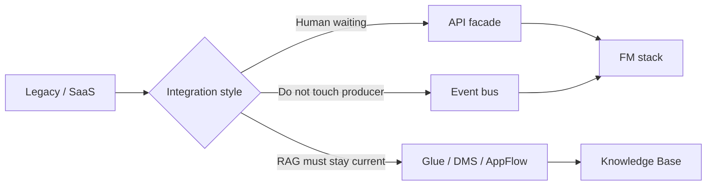
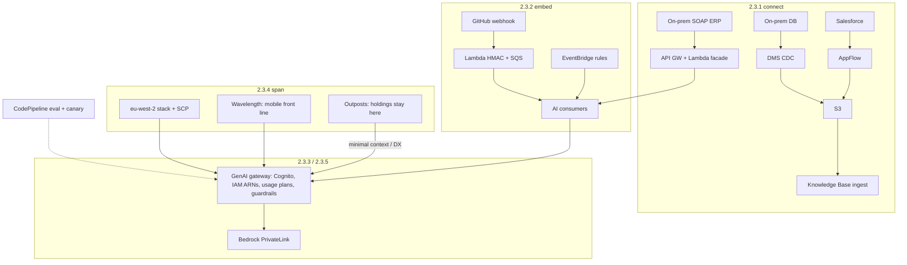

# Task 2.3 — Design and Implement Enterprise Integration Architectures

**Domain 2 · Skills 2.3.1–2.3.5**

An enterprise is not a greenfield app. It is a 20-year pile of ERPs, CRMs, SOAP, country-specific compliance, on-prem data that cannot leave the building, and change management that (rightly) will not let anyone push straight to production. This task is how you insert generative AI into that world **without breaking it**.

| Skill | Question it answers |
|-------|---------------------|
| **2.3.1 Connect** | How does the FM talk to systems that were never designed for an LLM? |
| **2.3.2 Embed** | How do I add AI *inside* apps the enterprise already runs, with minimal surgery? |
| **2.3.3 Secure** | Who are you, what may you invoke, and what may retrieval see? |
| **2.3.4 Span** | Where is data allowed to live — on-prem, edge, another country? |
| **2.3.5 Industrialize** | How do we ship GenAI the same way we ship everything else — and consume models through **one** front door? |

**Connect → embed → secure → span → industrialize.** Hold that spine. Every named service in this task slots into one of those five.

By the end you should be able to answer, out loud:

> How does the copilot attach to Salesforce and the on-prem blotter without rewriting them, how do analysts SSO, what stays in London, and why does every team call a gateway instead of Bedrock directly?

One application runs through every section.

> **Technology Investment Research Copilot.** A multinational asset manager. Analysts live in Salesforce. The order blotter is an on-prem SOAP ERP. Research PDFs sit in a DC the firm will not vacate. Okta is the IdP. London books cannot leave the EU. Traveling PMs want a fast mobile brief. Five product teams must not each invent their own Bedrock client.

This task is **how the FM sits in the company**. [Task 2.4](/learn/2/fm-api-integrations) is **how you invoke** the model (Converse, SQS, WebSockets). [Task 2.2](/learn/2/model-deployment) is **where the model is served**. [Task 2.1](/learn/2/agentic-ai) is **who decides the next action**. Do not mix those four.

> **Exam tip:** The blueprint names **API / events / data sync** (2.3.1), **microservices / webhooks / EventBridge** (2.3.2), **federation / RBAC / least privilege** (2.3.3), **Outposts / Wavelength / hybrid routing** (2.3.4), and **CodePipeline + a GenAI gateway** (2.3.5). Teach the integration style first. Map the service names second.

---

## Three enterprise integration styles

Nearly every stem in this task is one of these. Learn them as vocabulary before any AWS logo.

**Request/response (API).** System A calls system B and waits. Simple, tight coupling: A must know B’s location; if B is down, A fails. Right when a human needs the AI result *in this click*.

**Event-driven.** Systems publish (“ticket created,” “10-K landed”) to a broker. Consumers react independently. Producers do **not** know consumers — **loose coupling**. You can bolt an AI consumer onto an existing stream **without modifying the producing system**. That single property is why events are the star of enterprise AI integration (2.3.1 and 2.3.2).

**Data synchronization.** Replicate operational data into a place the AI stack can use (S3, a vector store), batch or continuously. Not a call at request time — a copy that RAG can ingest.

| Style | Coupling | Latency | Typical FM use |
|-------|----------|---------|----------------|
| API request/response | Tight | Immediate | “Summarize this Salesforce record *now*” |
| Event-driven | **Loose** | Near-real-time | Enrich, classify, draft on business events |
| Data sync | Decoupled | Batch → CDC | Keep Knowledge Bases current with source systems |

> **Mental shortcut:** “Without modifying the existing system” / “minimize impact on legacy” → **events or data-sync**. “User needs the AI result in the moment” → **API**.


```mermaid
flowchart LR
    Legacy[Legacy / SaaS] --> Style{Integration style}
    Style -->|Human waiting| API[API facade]
    Style -->|Do not touch producer| Ev[Event bus]
    Style -->|RAG must stay current| Sync[Glue / DMS / AppFlow]
    API --> FM[FM stack]
    Ev --> FM
    Sync --> KB[Knowledge Base]
```

---

## Skill 2.3.1 — Enterprise connectivity

**The question this skill answers:** How do I bridge FM capabilities to mainframes, ERPs, SOAP, and databases with no API?

**Concept.** Three named mechanisms: an **API facade** over legacy, **event-driven** loose coupling, and **data synchronization** so RAG is not reading last quarter’s CRM.

**Mental model.** The AMD copilot must not speak COBOL. Wrap the blotter. Subscribe to “filing published.” Sync Salesforce coverage notes into S3 for the Knowledge Base.

**API facade (adapter).** Legacy rarely speaks REST/JSON. Put **API Gateway + Lambda** in front: REST in, SOAP/XML or a DB/queue call out, clean JSON back. The FM app (and any agent tool) integrates against the facade and never touches the protocol behind it. That is an *anti-corruption layer*: one stable contract even if the system is 1998. On-prem backends: the Lambda reaches them over the private path in 2.3.4 (VPN or Direct Connect), often with API Gateway **VPC links** so nothing traverses the public internet.

The reverse direction: a mainframe will not call `Converse`. Expose AI behind the same kind of HTTP facade — which is the miniature of the **GenAI gateway** in 2.3.5.

**Event-driven loose coupling.** Existing system emits events → **Amazon EventBridge** matches by content and fans out → an AI consumer (usually Lambda → Bedrock) processes → results go back as new events or writes. **SNS** for simple pub/sub; **SQS** as the durable buffer (visibility timeout, DLQ, load leveling — same mechanics as [2.4.1](/learn/2/fm-api-integrations)). The producer is **untouched**. “Loose coupling” in a stem is pointing here.

**Data synchronization — three freshness tiers.**

| Freshness | Service | When |
|-----------|---------|------|
| Batch | **AWS Glue** ETL into S3 | Slow corpora: policy PDFs, product catalogs |
| Near-real-time rows | **AWS DMS** CDC | Operational DBs without hammering the source |
| SaaS objects | **Amazon AppFlow** | Salesforce, ServiceNow, Slack → S3/Redshift, no custom connector |

**Last mile for RAG:** objects landing in S3 feed **Bedrock Knowledge Bases ingest/sync**, which re-chunks and re-embeds. A **stale vector store** is the failure mode the exam likes: the fix is CDC or **event-triggered re-ingestion**, not “sync more data” as a slogan.

**AMD architecture.**

```text
Salesforce coverage  --AppFlow-->  S3  -->  Knowledge Base sync
On-prem blotter SOAP  --API Gateway + Lambda facade-->  copilot tools
S3 10-K landed        --EventBridge-->  Lambda classify / draft
```

**Decision rules.**

| If | Then |
|----|------|
| Legacy SOAP / no modern API | API Gateway + Lambda facade |
| Do not modify the producer | EventBridge (+ SQS/DLQ) |
| CRM/SaaS → lake without custom code | AppFlow |
| Source is a database that changes all day | DMS CDC |
| Policies change monthly | Glue batch is enough |
| RAG answers last quarter’s thesis | Fix ingest/CDC, not the model |

**Failure mode.** Point the agent’s tools at the SOAP ERP and “let the model figure out XML.” Or copy Salesforce to S3 once at go-live and never sync the Knowledge Base.

```quickcheck
Q: AMD coverage notes live in Salesforce. The Knowledge Base must stay current without writing a Salesforce connector.
A: Custom scraping Lambda on a cron only
B: Amazon AppFlow into S3, then Knowledge Base ingest
C: Direct Converse to Salesforce SOAP
D: Wavelength
correct: B
feedback: 2.3.1 SaaS sync is AppFlow. Glue is batch ETL you write; DMS is databases.
```

```fillin
“Do not modify the existing ticketing system” → bolt an AI consumer onto {{EventBridge}}.
```

---

## Skill 2.3.2 — Enhancing existing applications

**The question this skill answers:** Where 2.3.1 built plumbing, how do I *insert a feature* — drafted emails in the CRM, auto-triage in the ticketing tool — with minimal surgery on the host app?

**Concept.** Three insertion points: an **AI microservice** the host can HTTP-call, a **webhook handler** when the host cannot be changed but can fire callbacks, and **EventBridge** when the trigger is already an event (or a schedule, or a SaaS partner source).

**Mental model.** Strangler-fig for AI: grow the new capability *alongside* the CRM, do not rewrite Salesforce.

**API Gateway microservice.** Package each capability as `POST /summarize`, `POST /draft-reply`: API Gateway → Lambda → Bedrock. The host app adds **one HTTP call**, the same way it calls any internal service. You can version, canary, secure, and swap the model without the host knowing — a miniature of the 2.3.5 gateway.

**Lambda webhook handlers.** GitHub, Slack, Jira, Stripe, Salesforce outbound messages: they POST to **API Gateway or a function URL** → Lambda verifies the **webhook signature** (HMAC) → Bedrock → write back via the SaaS API. Two operational facts: the endpoint is public, so **verify signatures**; if inference exceeds the sender’s timeout, **ack immediately and process on SQS** (2.4.1 again).

**EventBridge, extended.** **Partner event sources** let Zendesk, Datadog, Shopify, and others publish *directly* onto your bus — webhook infrastructure you do not host. **EventBridge Scheduler** drives nightly AMD digests. **Content-based rules** send only `priority = high` tickets to the expensive model so spend tracks value.

**Choosing among the three.**

| Host can… | Insert at |
|-----------|-----------|
| Make an HTTP call at the right moment | AI microservice (API Gateway) |
| Not be changed, but emits webhooks | Lambda webhook handler |
| Already emit events / has a partner source / needs a schedule | EventBridge |

**Failure mode.** Rewrite the CRM “so AI is native.” Or skip signature verification on a public webhook and let the internet summarize your PRs. Or hold the GitHub webhook open for 40 seconds of generation.

```quickcheck
Q: GitHub cannot be modified. On pull-request-opened, post an AI summary as a comment. Inference may exceed GitHub’s timeout.
A: Rewrite GitHub
B: Webhook → API Gateway → Lambda verifies HMAC, enqueues SQS, acks; worker calls Bedrock and comments
C: DMS CDC from git
D: Outposts
correct: B
feedback: 2.3.2 webhook insertion + 2.4.1 async when the sender will not wait.
```

---

## Skill 2.3.3 — Secure access frameworks

**The question this skill answers:** Humans, applications, and agents all need models; models need enterprise data. Who are you, what may your role invoke, and what is the ceiling?

**Concept.** Three layers, all resolving to IAM: **identity federation** (who), **RBAC/ABAC** on models *and* retrieval (what), **least privilege + private network + audit** (how far).

**Mental model.** Okta is the source of truth. No long-lived keys in the copilot. The intern’s role cannot invoke the frontier model. RAG must not return the other team’s HR file.

**Federation.** The firm already has Entra ID / Okta / AD. AWS **trusts that IdP** (SAML 2.0 or OIDC). **STS** issues **temporary credentials** for an IAM role.

| Who | AWS anchor |
|-----|------------|
| Workforce in the AWS console / accounts | **IAM Identity Center** |
| Users of the GenAI *application* | **Amazon Cognito** (federated to the corporate IdP); identity pools exchange the login for scoped temp AWS credentials |

Exam-grade: **no long-lived access keys in applications, ever.** Temporary credentials via STS role assumption answer nearly every “how should the app authenticate to Bedrock” stem. Disable the user in Okta and FM access dies with them.

**RBAC — two axes questions love to conflate.**

- **Model access:** IAM on **specific model ARNs** (`bedrock:InvokeModel`). Data-science may hit the frontier model; the general copilot role only the small workhorse; nobody gets `Resource: "*"`. Tags / **ABAC** scale this (`team=support` may invoke support-tagged models).
- **Data access:** what retrieval may *see* on a user’s behalf. For RAG that is **Knowledge Base metadata filtering** so the query only returns documents the role is entitled to. Without it, RAG is a data-leak amplifier. “Employees query HR docs they shouldn’t see” is a **retrieval-filter** problem, not a model problem.

**Least privilege, concretely.** Separate roles per component (ingest Lambda writes the vector store and cannot invoke models; inference Lambda invokes *one* model and reads nothing else). Explicit ARNs, not wildcards. Deny-by-default for customization and Provisioned Throughput purchase. **Network:** **VPC interface endpoints (PrivateLink)** for Bedrock — traffic never hits the public internet; endpoint policies are a second gate. **CloudTrail** logs every Bedrock API call for the audit trail compliance will ask for.

| Layer | Mechanism | Named services |
|-------|-----------|----------------|
| Identity (who) | Federation, temp credentials | IAM Identity Center, Cognito, STS, SAML/OIDC |
| Authorization (what) | RBAC/ABAC on models and data | IAM on model ARNs, KB metadata filters |
| Boundary (how far) | Least privilege + private path | Scoped roles, PrivateLink, CloudTrail |

> **Exam trap:** A longer system prompt is not an access-control plane. IAM and metadata filters enforce; prompts influence.

**Failure mode.** `bedrock:*` on `*` for the copilot role. Or federation done, but Knowledge Base retrieval unfiltered — the intern asks “what is Alice’s bonus?”

```fillin
App authenticates to Bedrock with {{temporary credentials}} from STS — not long-lived access keys.
```

```quickcheck
Q: Analysts SSO with Okta. RAG must not return restricted compensation memos to the general research role.
A: A stern system prompt
B: Cognito (federated) + IAM on model ARNs + Knowledge Base metadata filtering on retrieval
C: Disable CloudTrail
D: Wavelength
correct: B
feedback: 2.3.3 is identity + model RBAC + retrieval ACL. Prompts are not the control.
```

---

## Skill 2.3.4 — Cross-environment AI

**The question this skill answers:** Data legally cannot leave a country or a facility, or latency demands compute at the edge. Where does the work live?

**Concept.** Either move **minimal data to the model**, or move **compute toward the data** — chosen by what compliance and latency permit.

**Mental model.** London books stay in `eu-west-2`. Client holdings stay in the firm’s DC. A PM on 5G wants TTFT, not a hop to Virginia.

**AWS Outposts.** AWS-managed racks **in the enterprise DC** — same APIs, same IAM. Pattern: sensitive data and pre-processing stay on Outposts; the app sends only the **smallest necessary context** (redacted prompt, anonymized extract, embeddings) to **Bedrock in the parent Region**. Be honest on the exam: **Outposts holds the data plane on-prem; managed Bedrock inference runs in the Region.** Fully local generation is self-hosted open-weight on on-prem GPU (SageMaker-on-Outposts / your boxes) — a valid distractor, not “Bedrock lives in the rack.”

**AWS Wavelength.** Compute **inside a telco 5G network**. Host the interactive front line (pre-process, cache, small/local inference, session) in the Wavelength zone; call Regional Bedrock for heavyweight generation.

> **Mental shortcut:** “5G / mobile / ultra-low latency at the edge” → **Wavelength**. “Data must remain in our facility” → **Outposts**. Metro latency without a telco tie → **Local Zones** (common distractor).

**Secure routing.** **Site-to-Site VPN** — encrypted over the internet, fast to stand up, variable performance. **Direct Connect** — dedicated private circuit, consistent latency/bandwidth for production volumes. **Transit Gateway** when many VPCs and on-prem networks hub together. **PrivateLink / VPC endpoints** so even in-cloud hops to Bedrock stay private.

**Multi-jurisdiction.** Deploy per Region so EU data hits EU models; region-scoped IAM / SCP conditions to block cross-border invokes. Tension with [2.4.3 cross-Region inference](/learn/2/fm-api-integrations): resilience wants requests to roam; residency may forbid it. **Geographic-scoped inference profiles** are how you reconcile the two — do not blindly pick CRI when the stem says “must not leave the EU.”

**Decision rules.**

| Stem | Placement |
|------|-----------|
| Cannot leave our DC | Outposts + minimal context to Region |
| 5G / mobile ultra-low latency | Wavelength front line |
| Same city, not a telco | Local Zones (distractor vs Wavelength) |
| Production hybrid volume | Direct Connect |
| Stand up private path this week | VPN |
| Must not traverse the public internet | PrivateLink to Bedrock |
| Must not leave the EU | Regional deploy + SCP; not unbounded CRI |

**Failure mode.** Copy the London book to `us-east-1` “because the model is better,” or treat Outposts as if Bedrock weights are in the rack.

```quickcheck
Q: Client holdings cannot leave the firm’s data center. Analysts still need Bedrock summaries.
A: Replicate the book to S3 in us-east-1
B: Keep source data on Outposts; send redacted/minimal context to Regional Bedrock over Direct Connect / PrivateLink
C: Wavelength because it is on-prem
D: Disable IAM
correct: B
feedback: 2.3.4 Outposts = data gravity on-prem. Wavelength is 5G edge, not “our facility.”
```

---

## Skill 2.3.5 — CI/CD and the GenAI gateway

**The question this skill answers:** How does the firm go from five teams’ ad-hoc Bedrock experiments to a **platform** — shipping safely, consuming through one controlled door?

**Concept.** Two halves: **CI/CD** for GenAI artifacts, and a **GenAI gateway** (centralized abstraction) so every app hits models the same way.

**Mental model.** A prompt change is a deploy. Five teams must not each embed keys, routing, and logging.

**CI/CD.** **CodePipeline** orchestrates **CodeBuild** (build/test) through to deploy. GenAI changes *what is gated*:

- **Prompt regression:** prompts, model IDs, RAG config are versioned artifacts. Golden datasets + LLM-as-judge or metric scores (faithfulness, relevance). The pipeline **fails the build on quality regression**, not on exact strings (non-deterministic).
- **Security scans:** usual SAST/deps, plus prompt-injection probes, guardrail config checks, secrets scanning.
- **Rollback:** Lambda AI services behind **aliases with canary/linear traffic (CodeDeploy)**. CloudWatch alarms on errors, latency, **and eval scores** — a prompt can degrade quality with zero 5xx. Auto-rollback on breach.

**GenAI gateway.** A **single internal front door** for every application to every model. Architecturally it is the 2.3.2 microservice promoted to platform: **API Gateway + Lambda (or containers) between all consumers and all providers**. It centralizes:

- **Abstraction:** one stable internal API; the gateway maps to Bedrock / SageMaker / external providers. [2.4.4 routing](/learn/2/fm-api-integrations) lives **once**, not N times.
- **Security:** federated auth (2.3.3), per-team authorization, **guardrails on every request/response**.
- **Control:** unified prompt/response logging, X-Ray through the gateway, **usage plans** per team, **cost attribution** (tokens metered per app) so finance is not staring at one opaque Bedrock bill.

> **Exam tip:** “Multiple teams,” “consistent controls,” “central visibility into model usage,” “avoid duplicating integration logic” → **GenAI gateway / centralized abstraction layer.** It is a **pattern**, not a product named Amazon GenAI Gateway.

Trade-off: a shared dependency. Manage it with the [2.4.3](/learn/2/fm-api-integrations) toolkit (scale, cache, fallback). That is why this skill comes last: it **composes** connect, embed, and secure.

**Do not confuse.** 2.4.4 is *which modelId*. 2.3.5 is *one enterprise door* that also does auth, quotas, guardrails, and cost. 2.5 is Amplify / Q Developer / Prompt Flows as *productized* app tooling — not this gateway pattern.

**Failure mode.** Each squad copies a boto3 snippet with a long-lived key. Or promote a prompt on Friday because “it looked better in the playground,” with no eval gate and no canary.

```quickcheck
Q: Five research squads each call Bedrock with their own IAM users. Finance cannot attribute tokens. Security wants one guardrail and one audit trail.
A: Tell them to use temperature 0
B: A GenAI gateway (API Gateway + compute) with federation, usage plans, guardrails, logging, cost attribution
C: Five more SageMaker notebooks
D: Glue crawlers
correct: B
feedback: 2.3.5 named pattern: centralized abstraction. Not a new FM.
```

```fillin
Prompt/model/guardrail changes ship through CodePipeline; fail the build on {{quality regression}}, not exact string match.
```

---

## One reference architecture

If you can draw this and justify each box with **coupling, compliance, or control**, you have the task.


```mermaid
flowchart TB
    subgraph Sources["2.3.1 connect"]
        SF[Salesforce]
        ERP[On-prem SOAP ERP]
        DB[On-prem DB]
        SF --> AF[AppFlow]
        ERP --> Facade[API GW + Lambda facade]
        DB --> DMS[DMS CDC]
        AF --> S3[S3]
        DMS --> S3
        S3 --> KB[Knowledge Base ingest]
    end
    subgraph Embed["2.3.2 embed"]
        GH[GitHub webhook]
        EB[EventBridge rules]
        GH --> WH[Lambda HMAC + SQS]
        EB --> AI[AI consumers]
        Facade --> AI
        WH --> AI
    end
    subgraph Door["2.3.3 / 2.3.5"]
        GW[GenAI gateway: Cognito, IAM ARNs, usage plans, guardrails]
        AI --> GW
        GW --> BR[Bedrock PrivateLink]
    end
    subgraph Place["2.3.4 span"]
        OP[Outposts: holdings stay here]
        WL[Wavelength: mobile front line]
        EU[eu-west-2 stack + SCP]
        OP -->|minimal context / DX| GW
        WL --> GW
        EU --> GW
    end
    CP[CodePipeline eval + canary] -.-> GW
```

- **AppFlow / DMS / Glue + KB sync** so RAG is not stale (2.3.1).
- **Facade** over SOAP; **EventBridge / webhooks** so producers stay untouched (2.3.1, 2.3.2).
- **Gateway** for identity, model RBAC, quotas, guardrails, cost (2.3.3, 2.3.5).
- **Outposts / Wavelength / region lock** for gravity and latency (2.3.4).
- **PrivateLink + CloudTrail** as the boundary and the audit (2.3.3).
- **CodePipeline** with eval gates and canary rollback (2.3.5).

---

## Architecture decision tables

### How do I attach?

| Constraint | Pattern |
|------------|---------|
| Human waiting in the CRM | API microservice |
| Cannot change the producer | EventBridge or webhook |
| SOAP / mainframe | API Gateway + Lambda facade |
| Salesforce → lake | AppFlow |
| OLTP DB → lake | DMS CDC |
| Monthly PDF dump | Glue |

### Where does it run?

| Constraint | Pattern |
|------------|---------|
| Must stay in the facility | Outposts; minimal context to Region |
| 5G mobile TTFT | Wavelength front line |
| Must stay in the EU | Regional stack + SCP; not unbounded CRI |
| Hybrid production pipes | Direct Connect + PrivateLink |

### Do not confuse with other tasks

| This stem | Task |
|-----------|------|
| Agent loop, tools, HITL | **2.1** |
| On-demand vs PT vs SageMaker host | **2.2** |
| Events, SSO, Outposts, GenAI gateway, CodePipeline eval | **2.3** |
| Converse, SQS jobs, WebSocket TTFT, X-Ray, modelId routing | **2.4** |
| Amplify UI, Prompt Flows, Q Developer | **2.5** |

---

## Concise AWS service glossary

### Integration / data

#### Amazon EventBridge

**What it is.** Event bus with content rules, SaaS partner sources, and Scheduler.

**Problem it solves.** Loose coupling: add an AI consumer without modifying the producer.

**Where it sits.** 2.3.1 connectivity and 2.3.2 insertion.

**Typical use.** “10-K landed” or `priority=high` ticket → Lambda → gateway → Bedrock.

**Pricing.** Events matched / ingested.

**Exam cue.** Without modifying the existing system; loose coupling.

**Do not confuse with.** Direct API calls (tight). SQS (buffer, not the router). Partner sources vs home-grown webhooks.

#### Amazon API Gateway + Lambda facade

**What it is.** REST in, SOAP/XML or private NLB out; VPC links for on-prem.

**Problem it solves.** Anti-corruption layer so agents and FMs see clean JSON.

**Where it sits.** 2.3.1; also the shape of a 2.3.5 gateway.

**Typical use.** On-prem AMD blotter SOAP wrapped for copilot tools.

**Pricing.** API calls + Lambda.

**Exam cue.** Legacy system with no modern API.

**Do not confuse with.** Calling COBOL from the prompt. WebSocket streaming (2.4.2).

#### Amazon AppFlow

**What it is.** Managed SaaS → AWS data movement (Salesforce, ServiceNow, Slack, …).

**Problem it solves.** Sync CRM/ITSM into S3 without a custom connector.

**Where it sits.** 2.3.1 data synchronization.

**Typical use.** Coverage notes from Salesforce into the Knowledge Base path.

**Pricing.** Flows and volume.

**Exam cue.** SaaS sync, no homemade scraper.

**Do not confuse with.** DMS (databases). Glue (you build the ETL). EventBridge partner events (signals, not bulk objects).

#### AWS DMS (CDC)

**What it is.** Continuous row-level replication from operational databases.

**Problem it solves.** Near-real-time AI-side copy without polling the OLTP system.

**Where it sits.** 2.3.1 sync.

**Typical use.** Research warehouse tables → S3 → KB ingest.

**Pricing.** Instance + data.

**Exam cue.** CDC, keep KB current with a database.

**Do not confuse with.** Glue batch. AppFlow SaaS.

#### AWS Glue

**What it is.** Serverless ETL, often scheduled, into S3/data catalog.

**Problem it solves.** Batch sync for slowly changing corpora.

**Where it sits.** 2.3.1 batch tier.

**Typical use.** Monthly policy PDF normalize into the lake.

**Pricing.** DPU time.

**Exam cue.** Scheduled ETL, not CDC, not Salesforce.

**Do not confuse with.** DMS. AppFlow. Knowledge Base ingest (the last mile after S3).

### Identity / security

#### IAM Identity Center

**What it is.** Workforce SSO into AWS accounts and apps, federated from the corporate IdP.

**Problem it solves.** One identity for humans using AWS, centrally revocable.

**Where it sits.** 2.3.3 identity layer.

**Typical use.** Analysts and platform engineers, not the copilot’s end-user pool.

**Pricing.** Included with IAM.

**Exam cue.** Workforce federation into AWS.

**Do not confuse with.** Cognito (application users). Long-lived IAM users.

#### Amazon Cognito (federated)

**What it is.** User pools + identity pools; federate Okta/Entra; exchange for temporary AWS creds.

**Problem it solves.** App users authenticate; the app calls Bedrock without embedded keys.

**Where it sits.** 2.3.3; often in front of the GenAI gateway.

**Typical use.** Copilot login via Okta → scoped role → gateway.

**Pricing.** MAUs.

**Exam cue.** Corporate credentials / SSO for the AI *application*.

**Do not confuse with.** IAM Identity Center. Putting access keys in the mobile binary.

#### AWS STS temporary credentials

**What it is.** Short-lived credentials from assuming an IAM role.

**Problem it solves.** No long-lived access keys in applications.

**Where it sits.** Under every 2.3.3 “how does the app call Bedrock” answer.

**Typical use.** Cognito identity pool → role with one model ARN.

**Pricing.** Free.

**Exam cue.** Temporary credentials, never long-lived keys.

**Do not confuse with.** IAM user access keys. API keys as Bedrock auth.

#### Knowledge Base metadata filtering

**What it is.** Retrieval constrained by document metadata (role, desk, jurisdiction).

**Problem it solves.** RAG must not leak documents the user cannot see.

**Where it sits.** 2.3.3 data-access axis.

**Typical use.** General research role cannot retrieve compensation memos.

**Pricing.** Same as KB retrieval.

**Exam cue.** Employees retrieve HR docs they shouldn’t — filter retrieval, don’t “prompt harder.”

**Do not confuse with.** Guardrails (content policy). IAM on `InvokeModel` (model axis, not document ACL).

#### AWS PrivateLink / Bedrock VPC endpoints

**What it is.** Interface endpoints so Bedrock calls stay on the Amazon network; optional endpoint policies.

**Problem it solves.** “Traffic must not traverse the public internet.”

**Where it sits.** 2.3.3 boundary; 2.3.4 hybrid.

**Typical use.** Gateway in a VPC invokes Bedrock privately; Outposts path via DX.

**Pricing.** Endpoint hours + data.

**Exam cue.** No public internet to the FM.

**Do not confuse with.** NAT Gateway “privacy.” Guardrails.

### Hybrid / edge

#### AWS Outposts

**What it is.** AWS racks in *your* DC; same APIs.

**Problem it solves.** Data residency / data gravity: keep source data on-prem.

**Where it sits.** 2.3.4.

**Typical use.** Holdings stay on Outposts; redacted context to Regional Bedrock.

**Pricing.** Capacity reservation.

**Exam cue.** Data must remain in our facility.

**Do not confuse with.** Wavelength (5G). Bedrock weights running in the rack. Local Zones.

#### AWS Wavelength

**What it is.** AWS compute inside a telco 5G network.

**Problem it solves.** Ultra-low latency from mobile/IoT to the first hop.

**Where it sits.** 2.3.4 edge.

**Typical use.** Traveling PM app: preprocess/cache in-zone, heavy Converse in Region.

**Pricing.** Zone compute.

**Exam cue.** 5G, mobile, ultra-low latency at the edge.

**Do not confuse with.** Outposts (facility). Local Zones (metro, not telco).

#### AWS Direct Connect vs Site-to-Site VPN

**What it is.** Dedicated private circuit vs encrypted tunnel over the internet.

**Problem it solves.** Hybrid path from DC/Outposts to Region.

**Where it sits.** 2.3.4 routing.

**Typical use.** Production filing sync and facade traffic on DX; VPN to stand up fast.

**Pricing.** Port hours + data (DX); VPN is cheaper and noisier.

**Exam cue.** Reliable consistent hybrid → Direct Connect. Speed of setup → VPN.

**Do not confuse with.** PrivateLink (in-AWS private to a service). Transit Gateway (hub).

### Platform / delivery

#### GenAI gateway (pattern)

**What it is.** Central API Gateway + compute in front of all model providers.

**Problem it solves.** One place for auth, routing, guardrails, quotas, logging, cost attribution.

**Where it sits.** 2.3.5 capstone; composes 2.3.2–2.3.3 and 2.4 routing.

**Typical use.** Every AMD squad calls `/v1/complete`; finance sees tokens per team.

**Pricing.** Gateway + downstream tokens.

**Exam cue.** Multiple teams, consistent controls, central visibility, don’t duplicate integration logic.

**Do not confuse with.** Amazon product of that name (there isn’t one). 2.4.4 routing alone. 2.5 Q Developer.

#### AWS CodePipeline / CodeBuild / CodeDeploy

**What it is.** Orchestrate build, GenAI eval gates, canary/linear Lambda aliases, auto-rollback.

**Problem it solves.** Prompt/model/guardrail changes are production deploys.

**Where it sits.** 2.3.5 shipping half.

**Typical use.** Fail the pipeline when faithfulness drops; canary 10% then roll back on eval alarm.

**Pricing.** Pipelines + build minutes.

**Exam cue.** Test prompt/model changes; roll back on quality regression — not just 5xx.

**Do not confuse with.** Playground “Ship it.” SageMaker Pipelines (training/hosting jobs, 2.2).

---

## Level 1 — Recall

```practice
Q: Stem says add AI without modifying the legacy ticketing system.
A: Rewrite the ticket DB schema
B: EventBridge (or webhook) consumer
C: Put Claude in the mainframe
D: Disable IAM
correct: B
feedback: 2.3.1/2.3.2 loose coupling. Producers stay untouched.

Q: On-prem blotter speaks only SOAP. Copilot tools need JSON.
A: Prompt the model with raw XML
B: API Gateway + Lambda facade (adapter)
C: AppFlow
D: Wavelength
correct: B
feedback: 2.3.1 anti-corruption layer.

Q: Salesforce objects into S3 for Knowledge Base ingest, no custom connector.
A: DMS
B: Amazon AppFlow
C: Direct Connect as a CRM API
D: Guardrails
correct: B
feedback: AppFlow = SaaS sync. DMS = databases. Glue = ETL you build.

Q: Operational research DB must stay near-real-time in the lake.
A: Annual Glue job only
B: AWS DMS CDC
C: Cognito
D: CodeDeploy
correct: B
feedback: CDC is the 2.3.1 database tier.

Q: Host CRM can add one HTTP call at send-email time.
A: Outposts
B: AI microservice behind API Gateway
C: Partner EventBridge only
D: Fine-tune
correct: B
feedback: 2.3.2 strangler insertion: one internal POST.

Q: App must use corporate Okta, never long-lived keys, to call Bedrock.
A: IAM user keys in the binary
B: Federation (Cognito / Identity Center) + STS temporary credentials
C: API key as the only Bedrock auth
D: S3 public ACL
correct: B
feedback: 2.3.3 identity. Temporary credentials almost always.

Q: General role retrieves compensation PDFs via RAG.
A: Raise temperature
B: Knowledge Base metadata filtering (and IAM on models separately)
C: More tokens in the system prompt as the only control
D: Glue crawler
correct: B
feedback: Data axis ≠ model axis. Retrieval ACL.

Q: Traffic to Bedrock must not traverse the public internet.
A: NAT Gateway is enough
B: PrivateLink / VPC interface endpoints
C: Disable CloudTrail
D: SSE
correct: B
feedback: 2.3.3 network boundary.

Q: Data must remain in the firm’s facility; still need Regional Bedrock.
A: Wavelength
B: Outposts for data/pre-process; send minimal context to the Region
C: Unbounded cross-Region inference
D: Copy the book to us-east-1
correct: B
feedback: Outposts = facility. Wavelength = 5G.

Q: Many teams, one audit trail, cost per squad, swap models without app changes.
A: Each team’s own boto3 + IAM user
B: GenAI gateway (centralized abstraction)
C: Textract
D: Local Zones
correct: B
feedback: 2.3.5 named pattern.
```

---

## Level 2 — Architecture scenarios

```practice
Q: Knowledge Base answers last quarter’s AMD thesis. Salesforce is the system of record.
A: Buy Provisioned Throughput
B: AppFlow (or CDC) + event-triggered Knowledge Base re-ingest — stale vectors, not a “smarter” model
C: Raise max tokens
D: Switch to InvokeModel native
correct: B
feedback: 2.3.1 last mile. Sync failure mode.

Q: GitHub webhook times out while Bedrock writes a PR summary.
A: Hold the HTTP request for 30s
B: Verify HMAC, ack fast, SQS worker, then comment via GitHub API
C: Put GitHub on Outposts
D: Use batch inference for the webhook
correct: B
feedback: 2.3.2 + 2.4.1. Sender timeout ≠ generation time.

Q: Intern role can InvokeModel on `*` and the KB has no metadata filters.
A: Fine — federation is enough
B: Scope model ARNs per role and filter retrieval; federation does not replace RBAC
C: Delete CloudTrail
D: Move to Wavelength
correct: B
feedback: 2.3.3 two axes plus least privilege.

Q: Resilience team enables unbounded cross-Region inference for London books.
A: Always correct per 2.4.3
B: Residency may forbid it — geographic profiles / regional stack + SCP; CRI is not free
C: Outposts runs Bedrock weights locally so CRI is irrelevant
D: Use Textract
correct: B
feedback: 2.3.4 vs 2.4.3 tension. Say it out loud.

Q: Traveling PMs on 5G need a snappy first paint; heavy thesis still hits Regional Claude.
A: Outposts in the phone
B: Wavelength front line (pre-process/cache) + Regional Bedrock
C: Glue
D: IAM user keys
correct: B
feedback: Wavelength trigger phrases are 5G/mobile/edge latency.

Q: Hybrid production volume, variable VPN jitter breaks DMS.
A: Stay on VPN forever
B: Direct Connect for consistent pipes; VPN was the stand-up path
C: EventBridge Scheduler as a network
D: Cognito
correct: B
feedback: 2.3.4 DX vs VPN.

Q: Prompt tweak ships Friday, eval score drops, 5xx stay flat, no rollback.
A: Working as designed
B: Treat prompts as artifacts; eval gates in CodePipeline; canary alarms on quality, not only 5xx
C: Only CloudTrail can roll back
D: Fine-tune immediately
correct: B
feedback: 2.3.5 CI/CD is GenAI-specific because quality ≠ HTTP errors.

Q: Five squads duplicate routing, guardrails, and logging in Lambda.
A: Required for least privilege
B: Promote to a GenAI gateway; put 2.4.4 routing in one place; usage plans + attribution
C: Five SageMaker endpoints named gateway
D: Disable federation
correct: B
feedback: Gateway composes 2.3 and 2.4. It is a pattern.

Q: Agent tools call the SOAP ERP with a 6 MB XML sample in the prompt “for context.”
A: Ideal tool design
B: Facade to a thin JSON contract; least privilege on the tool role; do not dump the mainframe into the window
C: Wavelength
D: Partner EventBridge
correct: B
feedback: 2.3.1 facade + 2.3.3 least privilege. Not a 2.1 memory trick.

Q: EU stack must not invoke us-east-1 models even if a developer passes that modelId.
A: Trust the prompt
B: Region-scoped IAM/SCP (and gateway allow-list); optionally geographic inference profiles
C: Metadata filter on the model
D: AppFlow
correct: B
feedback: Placement and identity conditions, not RAG filters.
```

---

## Explain it aloud

```recall
Q: Three integration styles in 20 seconds.
A: API when a human is waiting (tight). Events when you must not modify the producer (loose — EventBridge). Data sync when RAG needs a copy (Glue batch, DMS CDC, AppFlow SaaS) plus Knowledge Base ingest.
```

```recall
Q: Three ways to insert AI into an existing app (2.3.2).
A: Microservice HTTP call if the host can call you. Webhook Lambda (verify HMAC, async if slow) if it can only fire callbacks. EventBridge — including partner sources and Scheduler — if the trigger is already an event.
```

```recall
Q: Federation vs model RBAC vs RAG leak.
A: Cognito/Identity Center + STS temp creds = who. IAM on specific model ARNs = which FM. Knowledge Base metadata filters = which documents. A system prompt is none of those. PrivateLink + CloudTrail close the boundary and the audit.
```

```recall
Q: Outposts vs Wavelength vs Local Zones vs CRI.
A: Outposts = our facility, data stays, Bedrock still Regional with minimal context. Wavelength = 5G edge front line. Local Zones = metro, not telco. CRI helps capacity; residency may forbid unbounded roaming — geographic profiles / SCPs.
```

```recall
Q: What is a GenAI gateway, and how is it not 2.4 or 2.5?
A: One internal front door: auth, allow-lists, guardrails, usage plans, logging, cost per team, and a single place for model routing. 2.4.4 is the routing mechanic; 2.3.5 is the enterprise door. 2.5 is Amplify/Q/Prompt Flows as products. Prompts ship through CodePipeline with eval gates and canary rollback.
```

---

## Final compressed review

An enterprise is **legacy + identity + jurisdiction + change control**. GenAI is a new consumer of all four.

**2.3.1** — Facade SOAP; **EventBridge** so producers stay untouched; **AppFlow / DMS / Glue** + KB ingest so RAG is current.

**2.3.2** — Insert via **microservice**, **webhook**, or **EventBridge** (partner/schedule). Ack webhooks fast.

**2.3.3** — **Federation + STS**. IAM on **model ARNs**. **Metadata filters** on retrieval. **PrivateLink**. **CloudTrail**.

**2.3.4** — **Outposts** (facility), **Wavelength** (5G), **DX vs VPN**, region lock vs CRI.

**2.3.5** — **CodePipeline** eval + canary. **GenAI gateway** so five teams are a platform, not five keys.

**If you see X, think Y:**

```text
Without modifying legacy              → EventBridge / webhook
SOAP / no modern API                  → API Gateway + Lambda facade
Salesforce → lake, no connector       → AppFlow
DB CDC → lake                         → DMS
Stale Knowledge Base                  → sync + re-ingest, not a bigger model
One HTTP call from the CRM            → AI microservice
Corporate SSO / no long-lived keys    → Cognito or Identity Center + STS
Wrong people see RAG docs             → KB metadata filtering
No public internet to Bedrock         → PrivateLink
Must stay in our DC                   → Outposts + minimal context
5G / mobile ultra-low latency         → Wavelength
Consistent hybrid pipes               → Direct Connect
Many teams, one control plane         → GenAI gateway
Prompt change / quality regression    → CodePipeline eval + canary rollback
```
