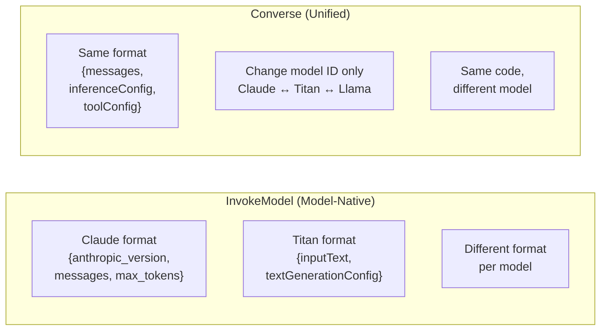
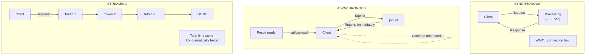
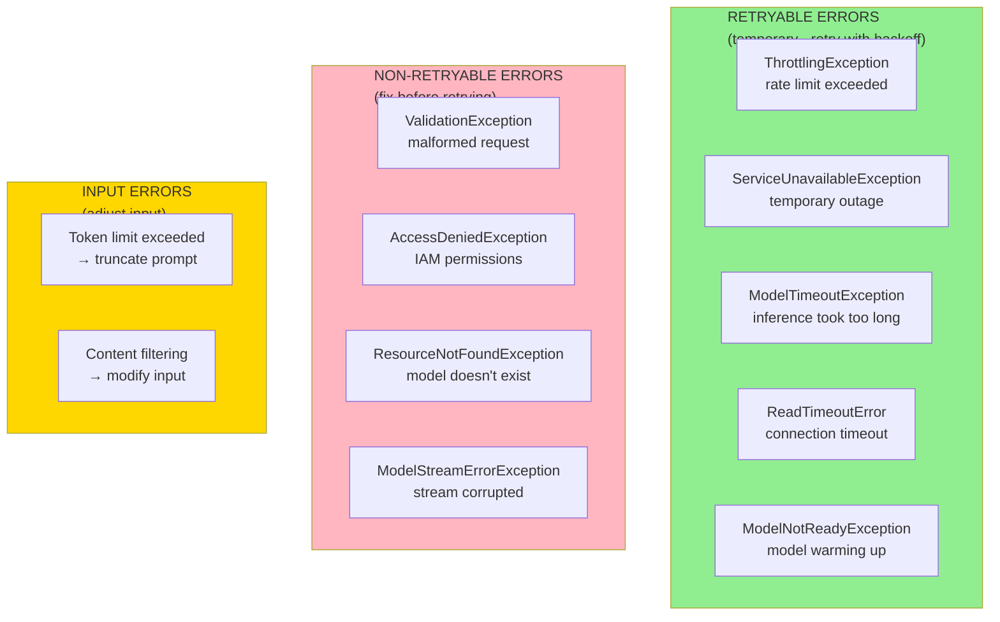

# FM API Integrations

**Domain 2 | Task 2.4 | ~45 minutes**

---

## Why This Matters

Calling foundation models correctly is fundamental to building production GenAI applications. A simple API call to Bedrock might work perfectly in development—but production introduces **rate limits**, **timeouts**, **capacity constraints**, and **occasional failures** that can cripple an application if not handled properly.

Consider this scenario: Your customer-facing chatbot works flawlessly during testing. Launch day arrives, traffic spikes, and suddenly users see error messages because you didn't implement retry logic. Or worse—your application hangs indefinitely because you set no timeouts, creating a cascade of blocked requests that eventually brings down the entire service.

Understanding **synchronous vs asynchronous patterns**, **streaming responses**, **error handling**, and **intelligent routing** determines whether your application is **reliable and performant** or **frustrating and flaky**. The patterns in this section ensure your application handles reality gracefully rather than crashing at the first sign of trouble.

This section covers the full spectrum of API integration: from choosing between InvokeModel and Converse, through streaming implementations, to building resilient systems that route intelligently and recover from failures.

---

## Understanding Bedrock's API Options

Bedrock provides two distinct APIs for model invocation. Choosing the right one affects code portability, feature availability, and maintenance burden.

### The Two API Paradigms



### InvokeModel API

**InvokeModel** is the original, model-native interface. You construct request bodies in the **exact format each model provider specifies**:

```python
import boto3
import json

client = boto3.client('bedrock-runtime')

# ============================================
# Claude format - Anthropic's native structure
# ============================================
claude_body = json.dumps({
    'anthropic_version': 'bedrock-2023-05-31',
    'max_tokens': 1024,
    'temperature': 0.7,
    'top_p': 0.9,
    'messages': [
        {
            'role': 'user',
            'content': 'Explain quantum computing in simple terms'
        }
    ]
})

response = client.invoke_model(
    modelId='anthropic.claude-3-sonnet-20240229-v1:0',
    body=claude_body,
    contentType='application/json',
    accept='application/json'
)

result = json.loads(response['body'].read())
print(result['content'][0]['text'])


# ============================================
# Titan format - completely different structure
# ============================================
titan_body = json.dumps({
    'inputText': 'Explain quantum computing in simple terms',
    'textGenerationConfig': {
        'maxTokenCount': 1024,
        'temperature': 0.7,
        'topP': 0.9,
        'stopSequences': []
    }
})

response = client.invoke_model(
    modelId='amazon.titan-text-express-v1',
    body=titan_body,
    contentType='application/json'
)

result = json.loads(response['body'].read())
print(result['results'][0]['outputText'])


# ============================================
# Llama format - yet another structure
# ============================================
llama_body = json.dumps({
    'prompt': 'Explain quantum computing in simple terms',
    'max_gen_len': 1024,
    'temperature': 0.7,
    'top_p': 0.9
})

response = client.invoke_model(
    modelId='meta.llama3-70b-instruct-v1:0',
    body=llama_body,
    contentType='application/json'
)
```

**InvokeModel Advantages:**
- Access to **every parameter** each model supports
- Provider-specific features available immediately
- No abstraction layer overhead

**InvokeModel Disadvantages:**
- Switching models requires **rewriting request construction code**
- Different error handling per provider
- Different response parsing per model
- Harder to maintain multi-model applications

### Converse API

**Converse** provides a **unified interface** across all models. Same message structure regardless of which model you're calling:

```python
import boto3

client = boto3.client('bedrock-runtime')

# This EXACT code works with ANY supported model
# Just change the modelId parameter

def invoke_with_converse(model_id: str, user_message: str) -> str:
    """
    Model-agnostic inference using Converse API.
    Same code works for Claude, Titan, Llama, Mistral, etc.
    """
    response = client.converse(
        modelId=model_id,
        messages=[
            {
                'role': 'user',
                'content': [{'text': user_message}]
            }
        ],
        inferenceConfig={
            'maxTokens': 1024,
            'temperature': 0.7,
            'topP': 0.9
        }
    )

    return response['output']['message']['content'][0]['text']


# Same code, different models
claude_response = invoke_with_converse(
    'anthropic.claude-3-sonnet-20240229-v1:0',
    'Explain quantum computing'
)

titan_response = invoke_with_converse(
    'amazon.titan-text-express-v1',
    'Explain quantum computing'
)

llama_response = invoke_with_converse(
    'meta.llama3-70b-instruct-v1:0',
    'Explain quantum computing'
)
```

### Tool Calling with Converse

**Tool calling** demonstrates where Converse excels. The API provides a **standardized `toolConfig` parameter** that works identically across models:

```python
import boto3
import json

client = boto3.client('bedrock-runtime')

# Define tools using standardized format
tools = [
    {
        'toolSpec': {
            'name': 'get_weather',
            'description': 'Get current weather for a location',
            'inputSchema': {
                'json': {
                    'type': 'object',
                    'properties': {
                        'location': {
                            'type': 'string',
                            'description': 'City name, e.g., "Seattle, WA"'
                        },
                        'unit': {
                            'type': 'string',
                            'enum': ['celsius', 'fahrenheit'],
                            'description': 'Temperature unit'
                        }
                    },
                    'required': ['location']
                }
            }
        }
    },
    {
        'toolSpec': {
            'name': 'search_database',
            'description': 'Search product database',
            'inputSchema': {
                'json': {
                    'type': 'object',
                    'properties': {
                        'query': {
                            'type': 'string',
                            'description': 'Search query'
                        },
                        'category': {
                            'type': 'string',
                            'description': 'Product category filter'
                        }
                    },
                    'required': ['query']
                }
            }
        }
    }
]

def process_with_tools(user_query: str, model_id: str) -> dict:
    """
    Process query with tool use - works with any model supporting tools.
    """
    response = client.converse(
        modelId=model_id,
        messages=[
            {'role': 'user', 'content': [{'text': user_query}]}
        ],
        toolConfig={'tools': tools}
    )

    # Check if model wants to use a tool
    output = response['output']['message']

    for content in output['content']:
        if 'toolUse' in content:
            tool_use = content['toolUse']
            tool_name = tool_use['name']
            tool_input = tool_use['input']
            tool_use_id = tool_use['toolUseId']

            return {
                'action': 'tool_call',
                'tool': tool_name,
                'input': tool_input,
                'tool_use_id': tool_use_id
            }

    # No tool call - direct response
    return {
        'action': 'response',
        'text': output['content'][0]['text']
    }


# Works with Claude
result = process_with_tools(
    "What's the weather in Seattle?",
    'anthropic.claude-3-sonnet-20240229-v1:0'
)

# Same code works with other tool-capable models
# Just change the model ID
```

### When to Use Each API

| Use Case | Recommended API | Reason |
|----------|-----------------|--------|
| Multi-model applications | **Converse** | Single code path for all models |
| Tool calling / agents | **Converse** | Standardized tool format across models |
| Model switching / A/B testing | **Converse** | Change model ID only |
| Model-specific features | **InvokeModel** | Access all provider parameters |
| Multimodal (images, vision) | **Converse** | Unified content handling |
| Maximum control | **InvokeModel** | Full access to native API |

**Streaming equivalents:**
- `InvokeModelWithResponseStream` ↔ `ConverseStream`

---

## Synchronous and Asynchronous FM Calls

Foundation model APIs operate in fundamentally different modes. Understanding when to use each pattern is essential for building applications that perform well under real-world conditions.

### Understanding the Patterns



### Synchronous Calls

Your application sends a request, the connection stays open while the model processes, and you receive the complete response when generation finishes.

```python
import boto3
import json
from typing import Optional

client = boto3.client('bedrock-runtime')

def synchronous_inference(
    prompt: str,
    model_id: str = 'anthropic.claude-3-sonnet-20240229-v1:0',
    max_tokens: int = 1024,
    timeout_seconds: int = 60
) -> Optional[str]:
    """
    Synchronous model invocation.
    Caller blocks until response is complete.
    """
    try:
        # Configure client with timeout
        config = boto3.session.Config(
            read_timeout=timeout_seconds,
            connect_timeout=10
        )
        client_with_timeout = boto3.client('bedrock-runtime', config=config)

        response = client_with_timeout.converse(
            modelId=model_id,
            messages=[
                {'role': 'user', 'content': [{'text': prompt}]}
            ],
            inferenceConfig={
                'maxTokens': max_tokens
            }
        )

        return response['output']['message']['content'][0]['text']

    except client.exceptions.ModelTimeoutException:
        print("Model inference timed out")
        return None
    except Exception as e:
        print(f"Inference failed: {e}")
        return None
```

**Synchronous works well for:**
- Interactive applications where users expect immediate responses
- Situations where users can tolerate seconds of latency
- Simple request-response patterns
- Backend processing where latency isn't critical

**Synchronous challenges:**
- Inference times of **10-30 seconds** are common for complex prompts
- API Gateway imposes a **29-second timeout**
- Users staring at loading spinners may abandon the application
- Thread/connection resources held during processing

### Asynchronous Patterns with SQS

Decouple request submission from response delivery when synchronous doesn't work:

```python
import boto3
import json
import uuid
from datetime import datetime

sqs = boto3.client('sqs')
dynamodb = boto3.resource('dynamodb')
bedrock = boto3.client('bedrock-runtime')

# Request submission (fast - returns immediately)
def submit_inference_request(prompt: str, callback_url: str = None) -> str:
    """
    Submit inference request to queue.
    Returns request ID immediately - doesn't wait for inference.
    """
    request_id = str(uuid.uuid4())

    message = {
        'request_id': request_id,
        'prompt': prompt,
        'callback_url': callback_url,
        'submitted_at': datetime.utcnow().isoformat()
    }

    sqs.send_message(
        QueueUrl='https://sqs.us-east-1.amazonaws.com/123456789012/inference-queue',
        MessageBody=json.dumps(message),
        MessageAttributes={
            'RequestId': {
                'DataType': 'String',
                'StringValue': request_id
            }
        }
    )

    return request_id


# Queue processor (Lambda triggered by SQS)
def process_inference_queue(event, context):
    """
    Process queued inference requests.
    Triggered by SQS - can take full Lambda timeout (15 minutes).
    """
    table = dynamodb.Table('inference-results')

    for record in event['Records']:
        message = json.loads(record['body'])
        request_id = message['request_id']

        try:
            # This can take as long as needed
            response = bedrock.converse(
                modelId='anthropic.claude-3-sonnet-20240229-v1:0',
                messages=[
                    {'role': 'user', 'content': [{'text': message['prompt']}]}
                ],
                inferenceConfig={'maxTokens': 2048}
            )

            result = response['output']['message']['content'][0]['text']

            # Store result
            table.put_item(Item={
                'request_id': request_id,
                'status': 'completed',
                'result': result,
                'completed_at': datetime.utcnow().isoformat()
            })

            # Notify via callback if provided
            if message.get('callback_url'):
                import requests
                requests.post(message['callback_url'], json={
                    'request_id': request_id,
                    'status': 'completed'
                })

        except Exception as e:
            table.put_item(Item={
                'request_id': request_id,
                'status': 'failed',
                'error': str(e),
                'failed_at': datetime.utcnow().isoformat()
            })


# Result retrieval
def get_inference_result(request_id: str) -> dict:
    """
    Poll for inference result.
    """
    table = dynamodb.Table('inference-results')
    response = table.get_item(Key={'request_id': request_id})

    if 'Item' not in response:
        return {'status': 'pending'}

    return response['Item']
```

**Asynchronous advantages:**
- SQS absorbs bursts that would overwhelm synchronous processing
- Messages persist until successfully processed
- Failed messages return to queue for reprocessing (with dead-letter queue)
- No timeout constraints beyond Lambda's 15-minute maximum
- Scales naturally with Lambda concurrency

### Batch Inference

For bulk processing scenarios—document analysis, data enrichment, offline content generation:

```python
import boto3
import json

bedrock = boto3.client('bedrock')

def create_batch_job(
    input_s3_uri: str,
    output_s3_uri: str,
    job_name: str,
    model_id: str = 'anthropic.claude-3-haiku-20240307-v1:0'
) -> str:
    """
    Create batch inference job.

    Input format (JSONL):
    {"recordId":"1","modelInput":{"anthropic_version":"bedrock-2023-05-31","max_tokens":256,"messages":[...]}}
    {"recordId":"2","modelInput":{"anthropic_version":"bedrock-2023-05-31","max_tokens":256,"messages":[...]}}

    Returns job ARN for monitoring.
    """
    response = bedrock.create_model_invocation_job(
        jobName=job_name,
        modelId=model_id,
        roleArn='arn:aws:iam::123456789012:role/BedrockBatchRole',
        inputDataConfig={
            's3InputDataConfig': {
                's3Uri': input_s3_uri,
                's3InputFormat': 'JSONL'
            }
        },
        outputDataConfig={
            's3OutputDataConfig': {
                's3Uri': output_s3_uri
            }
        }
    )

    return response['jobArn']


def monitor_batch_job(job_arn: str) -> dict:
    """
    Monitor batch job status.
    """
    response = bedrock.get_model_invocation_job(jobIdentifier=job_arn)

    return {
        'status': response['status'],  # InProgress, Completed, Failed, etc.
        'message': response.get('message'),
        'input_count': response.get('inputDataConfig', {}).get('s3InputDataConfig', {}).get('s3Uri'),
        'output_uri': response.get('outputDataConfig', {}).get('s3OutputDataConfig', {}).get('s3Uri')
    }
```

**Batch inference benefits:**
- **~50% cost savings** vs on-demand
- No timeout constraints
- Process millions of records
- Results delivered to S3 when complete

---

## Streaming FM Responses

Streaming fundamentally changes the user experience. Instead of waiting for the entire response, users see text appear in **real-time** as the model produces it.

### Why Streaming Matters

Foundation models produce tokens **sequentially**—each word depends on the previous ones. A 500-token response might take several seconds to fully generate:

- **Without streaming**: Users see nothing during this entire time, then suddenly the full response appears
- **With streaming**: Text appears character by character as it's generated

Psychologically, streaming feels **dramatically faster** even though total time might be identical. Users see immediate progress rather than wondering if the system froze.

### Implementing Streaming

```python
import boto3
import json
from typing import Generator

client = boto3.client('bedrock-runtime')

def stream_response(
    prompt: str,
    model_id: str = 'anthropic.claude-3-sonnet-20240229-v1:0'
) -> Generator[str, None, None]:
    """
    Stream model response token by token.
    Yields text chunks as they arrive.
    """
    response = client.invoke_model_with_response_stream(
        modelId=model_id,
        body=json.dumps({
            'anthropic_version': 'bedrock-2023-05-31',
            'messages': [{'role': 'user', 'content': prompt}],
            'max_tokens': 1024
        })
    )

    for event in response['body']:
        chunk = json.loads(event['chunk']['bytes'])

        # Handle different event types
        if chunk['type'] == 'content_block_start':
            # New content block starting
            pass
        elif chunk['type'] == 'content_block_delta':
            # Actual content - yield it
            if 'text' in chunk['delta']:
                yield chunk['delta']['text']
        elif chunk['type'] == 'message_delta':
            # Usage information
            pass
        elif chunk['type'] == 'message_stop':
            # Stream complete
            break


# Usage - print as tokens arrive
for chunk in stream_response("Explain quantum computing"):
    print(chunk, end='', flush=True)
print()  # Final newline


# Or collect full response while still streaming to user
def stream_with_callback(prompt: str, on_chunk: callable) -> str:
    """
    Stream response, calling callback for each chunk.
    Returns complete response when done.
    """
    full_response = []

    for chunk in stream_response(prompt):
        on_chunk(chunk)
        full_response.append(chunk)

    return ''.join(full_response)


# Example with callback
def display_chunk(chunk):
    print(chunk, end='', flush=True)

complete = stream_with_callback("Explain quantum computing", display_chunk)
print(f"\n\nComplete response length: {len(complete)} characters")
```

### Streaming with Converse API

```python
import boto3

client = boto3.client('bedrock-runtime')

def stream_converse(
    messages: list,
    model_id: str = 'anthropic.claude-3-sonnet-20240229-v1:0'
) -> Generator[dict, None, None]:
    """
    Stream using Converse API - model-agnostic streaming.
    Yields events with type information.
    """
    response = client.converse_stream(
        modelId=model_id,
        messages=messages,
        inferenceConfig={
            'maxTokens': 1024,
            'temperature': 0.7
        }
    )

    for event in response['stream']:
        if 'contentBlockDelta' in event:
            delta = event['contentBlockDelta']['delta']
            if 'text' in delta:
                yield {'type': 'text', 'content': delta['text']}

        elif 'messageStop' in event:
            yield {'type': 'stop', 'reason': event['messageStop'].get('stopReason')}

        elif 'metadata' in event:
            yield {'type': 'metadata', 'usage': event['metadata'].get('usage')}


# Usage
for event in stream_converse([
    {'role': 'user', 'content': [{'text': 'Explain quantum computing'}]}
]):
    if event['type'] == 'text':
        print(event['content'], end='', flush=True)
    elif event['type'] == 'stop':
        print(f"\n\nStopped: {event['reason']}")
    elif event['type'] == 'metadata':
        print(f"Tokens used: {event['usage']}")
```

### Delivering Streams to Web Clients

| Transport | Direction | Complexity | Best For |
|-----------|-----------|------------|----------|
| **Server-Sent Events (SSE)** | Server → Client | Simple | FM responses to web clients |
| **WebSockets** | Bidirectional | Complex | Interactive chat with user input during streaming |
| **Polling** | Client pulls | Simplest | Legacy clients |

**SSE is typically the best choice** for foundation model responses—standard HTTP, works through proxies and load balancers, simple server-push model.

```python
# FastAPI example with SSE
from fastapi import FastAPI
from fastapi.responses import StreamingResponse
import asyncio

app = FastAPI()

async def generate_sse_stream(prompt: str):
    """
    Generate Server-Sent Events from Bedrock stream.
    """
    for chunk in stream_response(prompt):
        # SSE format: data: <content>\n\n
        yield f"data: {chunk}\n\n"
        await asyncio.sleep(0)  # Allow other async tasks

    yield "data: [DONE]\n\n"


@app.get("/stream")
async def stream_endpoint(prompt: str):
    """
    SSE endpoint for streaming responses.
    """
    return StreamingResponse(
        generate_sse_stream(prompt),
        media_type="text/event-stream",
        headers={
            "Cache-Control": "no-cache",
            "Connection": "keep-alive"
        }
    )
```

### When NOT to Stream

Stream when you can display content directly to users. **Don't stream** when:

- You need to **validate or filter** output before displaying (wait for complete response)
- You're **extracting structured data** that needs to be complete
- You're using the response in a **pipeline** where the next step needs full text
- The client **can't handle streaming** (legacy systems, some API gateways)

---

## Building Resilient FM Integrations

Foundation model APIs can experience failures. Models might be temporarily unavailable, requests might timeout, or rate limits might be exceeded. Production applications must handle these situations gracefully.

### Error Types and Handling



### Exponential Backoff with Jitter

When a request fails, wait before retrying—but wait **longer after each successive failure**:

```python
import time
import random
from functools import wraps
from typing import Callable, Any, List, Type

class RetryConfig:
    def __init__(
        self,
        max_retries: int = 3,
        base_delay: float = 1.0,
        max_delay: float = 60.0,
        jitter: bool = True
    ):
        self.max_retries = max_retries
        self.base_delay = base_delay
        self.max_delay = max_delay
        self.jitter = jitter


def retry_with_backoff(
    config: RetryConfig,
    retryable_exceptions: List[Type[Exception]]
) -> Callable:
    """
    Decorator for retry with exponential backoff and jitter.
    """
    def decorator(func: Callable) -> Callable:
        @wraps(func)
        def wrapper(*args, **kwargs) -> Any:
            last_exception = None

            for attempt in range(config.max_retries + 1):
                try:
                    return func(*args, **kwargs)

                except tuple(retryable_exceptions) as e:
                    last_exception = e

                    if attempt == config.max_retries:
                        raise

                    # Calculate delay with exponential backoff
                    delay = min(
                        config.base_delay * (2 ** attempt),
                        config.max_delay
                    )

                    # Add jitter to prevent thundering herd
                    if config.jitter:
                        delay = random.uniform(0, delay)

                    print(f"Attempt {attempt + 1} failed: {e}. "
                          f"Retrying in {delay:.2f}s...")
                    time.sleep(delay)

            raise last_exception

        return wrapper
    return decorator


# Usage
import boto3
from botocore.exceptions import ClientError, ReadTimeoutError

client = boto3.client('bedrock-runtime')

RETRYABLE_ERRORS = [
    client.exceptions.ThrottlingException,
    client.exceptions.ServiceUnavailableException,
    client.exceptions.ModelTimeoutException,
    ReadTimeoutError
]

@retry_with_backoff(
    config=RetryConfig(max_retries=3, base_delay=1.0),
    retryable_exceptions=RETRYABLE_ERRORS
)
def invoke_bedrock(prompt: str) -> str:
    """
    Invoke Bedrock with automatic retry on transient failures.
    """
    response = client.converse(
        modelId='anthropic.claude-3-sonnet-20240229-v1:0',
        messages=[{'role': 'user', 'content': [{'text': prompt}]}],
        inferenceConfig={'maxTokens': 1024}
    )

    return response['output']['message']['content'][0]['text']
```

### Circuit Breakers

When a service is consistently failing, **stop calling it** to give it time to recover and avoid wasting resources:

```python
import time
from enum import Enum
from dataclasses import dataclass
from threading import Lock
from typing import Callable, Any

class CircuitState(Enum):
    CLOSED = "closed"      # Normal operation
    OPEN = "open"          # Failing - reject requests immediately
    HALF_OPEN = "half_open"  # Testing recovery

@dataclass
class CircuitBreakerConfig:
    failure_threshold: int = 5      # Failures before opening
    recovery_timeout: float = 30.0  # Seconds before trying recovery
    success_threshold: int = 2      # Successes needed to close

class CircuitBreaker:
    """
    Circuit breaker pattern for FM API calls.
    Prevents cascading failures when service is unhealthy.
    """

    def __init__(self, config: CircuitBreakerConfig = None):
        self.config = config or CircuitBreakerConfig()
        self.state = CircuitState.CLOSED
        self.failure_count = 0
        self.success_count = 0
        self.last_failure_time = 0
        self._lock = Lock()

    def call(self, func: Callable, *args, **kwargs) -> Any:
        """
        Execute function through circuit breaker.
        """
        with self._lock:
            if self.state == CircuitState.OPEN:
                # Check if recovery timeout has passed
                if time.time() - self.last_failure_time > self.config.recovery_timeout:
                    self.state = CircuitState.HALF_OPEN
                    self.success_count = 0
                else:
                    raise CircuitOpenException(
                        f"Circuit breaker is OPEN. "
                        f"Retry after {self.config.recovery_timeout}s"
                    )

        try:
            result = func(*args, **kwargs)

            with self._lock:
                if self.state == CircuitState.HALF_OPEN:
                    self.success_count += 1
                    if self.success_count >= self.config.success_threshold:
                        self.state = CircuitState.CLOSED
                        self.failure_count = 0
                        print("Circuit breaker CLOSED - service recovered")
                elif self.state == CircuitState.CLOSED:
                    self.failure_count = 0  # Reset on success

            return result

        except Exception as e:
            with self._lock:
                self.failure_count += 1
                self.last_failure_time = time.time()

                if self.state == CircuitState.HALF_OPEN:
                    # Recovery failed - back to open
                    self.state = CircuitState.OPEN
                    print("Circuit breaker OPEN - recovery failed")
                elif self.failure_count >= self.config.failure_threshold:
                    self.state = CircuitState.OPEN
                    print(f"Circuit breaker OPEN after {self.failure_count} failures")

            raise


class CircuitOpenException(Exception):
    pass


# Usage
breaker = CircuitBreaker(CircuitBreakerConfig(
    failure_threshold=3,
    recovery_timeout=30.0
))

def call_bedrock_with_circuit_breaker(prompt: str) -> str:
    """
    Call Bedrock through circuit breaker.
    Fast-fails if service is known to be down.
    """
    return breaker.call(invoke_bedrock, prompt)
```

### Fallback Strategies

When primary inference fails, have backup options:

```python
from typing import Optional, List
from dataclasses import dataclass

@dataclass
class ModelFallback:
    model_id: str
    description: str

class FallbackChain:
    """
    Try models in sequence until one succeeds.
    Implements graceful degradation.
    """

    def __init__(self, fallbacks: List[ModelFallback]):
        self.fallbacks = fallbacks
        self.client = boto3.client('bedrock-runtime')

    def invoke(self, prompt: str, max_tokens: int = 1024) -> dict:
        """
        Try each model in the fallback chain.
        Returns result with metadata about which model succeeded.
        """
        errors = []

        for fallback in self.fallbacks:
            try:
                response = self.client.converse(
                    modelId=fallback.model_id,
                    messages=[
                        {'role': 'user', 'content': [{'text': prompt}]}
                    ],
                    inferenceConfig={'maxTokens': max_tokens}
                )

                return {
                    'success': True,
                    'model_used': fallback.model_id,
                    'response': response['output']['message']['content'][0]['text'],
                    'fallback_level': self.fallbacks.index(fallback)
                }

            except Exception as e:
                errors.append({
                    'model': fallback.model_id,
                    'error': str(e)
                })
                continue

        return {
            'success': False,
            'errors': errors,
            'message': 'All models failed'
        }


# Usage
fallback_chain = FallbackChain([
    ModelFallback(
        'anthropic.claude-3-sonnet-20240229-v1:0',
        'Primary - best quality'
    ),
    ModelFallback(
        'anthropic.claude-3-haiku-20240307-v1:0',
        'Fallback - faster, lower cost'
    ),
    ModelFallback(
        'amazon.titan-text-express-v1',
        'Emergency fallback'
    )
])

result = fallback_chain.invoke("Explain quantum computing")
if result['success']:
    print(f"Used: {result['model_used']}")
    print(result['response'])
else:
    print("All models failed:", result['errors'])
```

---

## Intelligent Request Routing

Not every request should go to the same model. Different queries have different requirements—complexity, speed, cost sensitivity.

### Static Routing

Use predefined rules that don't change based on request content:

```python
from fastapi import FastAPI, Query
from enum import Enum

app = FastAPI()

class Tier(Enum):
    SIMPLE = "simple"
    STANDARD = "standard"
    COMPLEX = "complex"

TIER_MODELS = {
    Tier.SIMPLE: 'anthropic.claude-3-haiku-20240307-v1:0',
    Tier.STANDARD: 'anthropic.claude-3-sonnet-20240229-v1:0',
    Tier.COMPLEX: 'anthropic.claude-3-opus-20240229-v1:0'
}

@app.post("/inference/{tier}")
async def static_routing(tier: Tier, prompt: str):
    """
    Route to model based on endpoint tier.
    Caller chooses complexity level.
    """
    model_id = TIER_MODELS[tier]

    response = client.converse(
        modelId=model_id,
        messages=[{'role': 'user', 'content': [{'text': prompt}]}]
    )

    return {
        'tier': tier.value,
        'model': model_id,
        'response': response['output']['message']['content'][0]['text']
    }
```

### Content-Based Dynamic Routing

Analyze request content to make routing decisions at runtime:

```python
from dataclasses import dataclass
from typing import Tuple
import re

@dataclass
class RoutingDecision:
    model_id: str
    reason: str
    estimated_cost: str

class ContentRouter:
    """
    Route requests to appropriate models based on content analysis.
    """

    COMPLEXITY_INDICATORS = {
        'simple': [
            r'\b(what is|define|list|who is|when did)\b',
            r'\b(simple|quick|brief|short)\b'
        ],
        'complex': [
            r'\b(analyze|compare|evaluate|synthesize|critique)\b',
            r'\b(comprehensive|detailed|thorough|in-depth)\b',
            r'\b(strategy|architecture|design|implement)\b'
        ]
    }

    MODELS = {
        'simple': 'anthropic.claude-3-haiku-20240307-v1:0',
        'medium': 'anthropic.claude-3-sonnet-20240229-v1:0',
        'complex': 'anthropic.claude-3-opus-20240229-v1:0'
    }

    def analyze_complexity(self, prompt: str) -> Tuple[str, str]:
        """
        Analyze prompt to determine complexity level.
        Returns (complexity, reason).
        """
        prompt_lower = prompt.lower()
        word_count = len(prompt.split())

        # Check for complex indicators first
        for pattern in self.COMPLEXITY_INDICATORS['complex']:
            if re.search(pattern, prompt_lower):
                return 'complex', f"Complex indicator: {pattern}"

        # Check for simple indicators
        for pattern in self.COMPLEXITY_INDICATORS['simple']:
            if re.search(pattern, prompt_lower):
                return 'simple', f"Simple indicator: {pattern}"

        # Use length as secondary signal
        if word_count < 20:
            return 'simple', f"Short prompt ({word_count} words)"
        elif word_count > 200:
            return 'complex', f"Long prompt ({word_count} words)"

        return 'medium', "Default to medium complexity"

    def route(self, prompt: str) -> RoutingDecision:
        """
        Determine optimal model for this prompt.
        """
        complexity, reason = self.analyze_complexity(prompt)
        model_id = self.MODELS[complexity]

        cost_estimates = {
            'simple': 'low (~$0.25/M tokens)',
            'medium': 'medium (~$3/M tokens)',
            'complex': 'high (~$15/M tokens)'
        }

        return RoutingDecision(
            model_id=model_id,
            reason=reason,
            estimated_cost=cost_estimates[complexity]
        )


# Usage
router = ContentRouter()

# Simple query → Haiku
decision = router.route("What is the capital of France?")
print(f"Route to: {decision.model_id} ({decision.reason})")

# Complex query → Opus
decision = router.route("""
    Analyze the economic implications of transitioning to renewable energy,
    comparing the approaches of Germany, China, and the United States.
    Consider both short-term costs and long-term benefits.
""")
print(f"Route to: {decision.model_id} ({decision.reason})")
```

### Metric-Based Routing

Route based on **current system state** rather than request content:

```python
import boto3
from datetime import datetime, timedelta

cloudwatch = boto3.client('cloudwatch')

class MetricRouter:
    """
    Route based on real-time service health metrics.
    """

    def __init__(self):
        self.primary_model = 'anthropic.claude-3-sonnet-20240229-v1:0'
        self.fallback_model = 'anthropic.claude-3-haiku-20240307-v1:0'

    def get_latency_p99(self, model_id: str) -> float:
        """
        Get P99 latency for model over last 5 minutes.
        """
        response = cloudwatch.get_metric_statistics(
            Namespace='AWS/Bedrock',
            MetricName='InvocationLatency',
            Dimensions=[
                {'Name': 'ModelId', 'Value': model_id}
            ],
            StartTime=datetime.utcnow() - timedelta(minutes=5),
            EndTime=datetime.utcnow(),
            Period=300,
            Statistics=['p99']
        )

        if response['Datapoints']:
            return response['Datapoints'][0]['p99']
        return 0

    def get_error_rate(self, model_id: str) -> float:
        """
        Get error rate for model over last 5 minutes.
        """
        # Get invocation count
        invocations = cloudwatch.get_metric_statistics(
            Namespace='AWS/Bedrock',
            MetricName='InvocationCount',
            Dimensions=[{'Name': 'ModelId', 'Value': model_id}],
            StartTime=datetime.utcnow() - timedelta(minutes=5),
            EndTime=datetime.utcnow(),
            Period=300,
            Statistics=['Sum']
        )

        # Get error count
        errors = cloudwatch.get_metric_statistics(
            Namespace='AWS/Bedrock',
            MetricName='InvocationClientErrors',
            Dimensions=[{'Name': 'ModelId', 'Value': model_id}],
            StartTime=datetime.utcnow() - timedelta(minutes=5),
            EndTime=datetime.utcnow(),
            Period=300,
            Statistics=['Sum']
        )

        inv_count = invocations['Datapoints'][0]['Sum'] if invocations['Datapoints'] else 0
        err_count = errors['Datapoints'][0]['Sum'] if errors['Datapoints'] else 0

        if inv_count == 0:
            return 0
        return err_count / inv_count

    def choose_model(self) -> str:
        """
        Choose model based on current metrics.
        """
        primary_latency = self.get_latency_p99(self.primary_model)
        primary_errors = self.get_error_rate(self.primary_model)

        # Switch to fallback if primary is unhealthy
        if primary_latency > 10000 or primary_errors > 0.05:  # 10s or 5% errors
            print(f"Primary unhealthy (latency={primary_latency}ms, "
                  f"errors={primary_errors:.2%}). Using fallback.")
            return self.fallback_model

        return self.primary_model
```

---

## Exam Tips

| When you see... | Think... |
|-----------------|----------|
| "model-agnostic" or "switch models easily" | Converse API |
| "model-specific parameters" | InvokeModel API |
| "real-time token streaming" | InvokeModelWithResponseStream + SSE |
| "handle FM API failures gracefully" | Exponential backoff + circuit breakers + fallbacks |
| "route requests to different models" | Content-based or metric-based routing |
| "distributed tracing" | AWS X-Ray |
| "bulk processing" or "offline inference" | Batch inference (50% savings) |
| "decouple request from response" | SQS + Lambda async pattern |

---

## Key Takeaways

> **1. Converse API for model-agnostic code; InvokeModel for model-specific features.**
> Use Converse when you want to switch models easily or standardize tool calling. Use InvokeModel when you need provider-specific parameters.

> **2. InvokeModel for sync, SQS + Lambda for async, InvokeModelWithResponseStream for streaming.**
> Match the pattern to latency tolerance. Sync for simple interactive; async for background; streaming for user-facing long responses.

> **3. SSE is the standard for streaming FM responses to web clients.**
> Simpler than WebSockets, works through proxies, provides server-to-client push for generated tokens.

> **4. Exponential backoff + circuit breakers + fallbacks = resilient integration.**
> The AWS SDK handles basic retries, but production systems need circuit breakers to avoid overwhelming failing services and fallbacks to maintain availability.

> **5. X-Ray traces requests across services for debugging.**
> Essential for understanding latency and failures in complex GenAI pipelines.

> **6. Route intelligently based on content complexity or system health.**
> Not every request needs your most expensive model. Dynamic routing optimizes cost and performance.

---

## Common Mistakes

| Mistake | Why It Matters |
|---------|----------------|
| **Not using streaming for user-facing applications** | Poor UX—users stare at blank screens for seconds |
| **Missing timeout configuration** | Default timeouts may be too short for FM inference (can take 30+ seconds) |
| **No fallback strategy when FM calls fail** | Application crashes instead of degrading gracefully |
| **Polling instead of SSE/WebSocket for streaming** | Inefficient, higher latency, more complex client code |
| **Hardcoding model selection** | Can't adapt to failures or optimize costs dynamically |
| **Ignoring X-Ray for debugging** | Can't trace latency or failures across distributed services |
| **Retrying non-retryable errors** | Wasted effort and potential for loops on validation errors |
| **No circuit breaker pattern** | Hammering a failing service instead of fast-failing |
