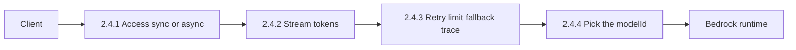
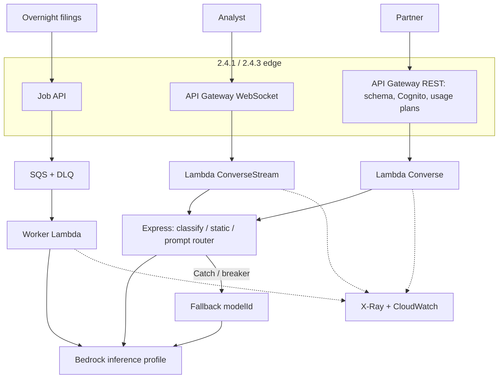

# Task 2.4 — Implement FM API Integrations

**Domain 2 · Skills 2.4.1–2.4.4**

A foundation model is an API endpoint — an *unusual* one. It is slow relative to a database (seconds, not milliseconds). It produces output incrementally. It is throttled hard. Different models have wildly different cost and capability. Every skill in this task is a response to one of those four properties.

| Skill | Question it answers |
|-------|---------------------|
| **2.4.1 Flexibility** | How do different clients and compute environments talk to the model — sync or async? |
| **2.4.2 Real-time** | Generation is slow. How do I show tokens as they arrive? |
| **2.4.3 Resilience** | What happens when the API throttles, fails, or degrades? |
| **2.4.4 Routing** | Models differ. How do I send each request to the *right* one? |

**Access → speed → reliability → selection.** You cannot stream from a model you cannot invoke. You cannot route intelligently until each invocation path is resilient.

By the end you should be able to answer, out loud:

> How does the copilot call Bedrock, how do tokens reach the analyst, what happens on `ThrottlingException`, and which model ID should this request use?

One application runs through every section.

> **Technology Investment Research Copilot.** Analysts chat about AMD earnings and thesis quality. Overnight jobs summarize 10,000 filings. A partner app submits research questions over HTTPS. Easy lookups and hard thesis questions should not hit the same model.

This task is **how you call the model**. [Task 2.2](/learn/2/model-deployment) is **where the model is served** (on-demand, Provisioned Throughput, SageMaker). [Task 2.1](/learn/2/agentic-ai) is **who decides the next action**. Do not mix those three.

> **Exam tip:** The blueprint names **Bedrock APIs + SDKs + SQS + API Gateway validation** (2.4.1), **streaming APIs + WebSockets/SSE + chunked transfer** (2.4.2), **SDK backoff + API Gateway rate limits + fallback + X-Ray** (2.4.3), and **static routing + Step Functions content routing + metrics routing + API Gateway transformations** (2.4.4).

---

## The Bedrock runtime surface

Nearly every stem in this task is some combination of these primitives plus AWS services wrapped around them.

| API | Delivery | Request format | Best for |
|-----|----------|----------------|----------|
| **`InvokeModel`** | Full body at once | Provider-native JSON | Simple sync; provider-specific features |
| **`InvokeModelWithResponseStream`** | Chunks | Provider-native JSON | Streaming with a native payload |
| **`Converse`** | Full body at once | Unified messages | Portable code, multi-model, tool use |
| **`ConverseStream`** | Chunks | Unified messages | Chat UIs — default streaming choice |
| **Batch inference** | Job via S3 | JSONL in S3 | Large offline, cheaper, latency-insensitive |

[Converse](https://docs.aws.amazon.com/bedrock/latest/userguide/conversation-inference.html) is model-agnostic: the same message structure works across providers. Switching models is a `modelId` change, not a payload rewrite. That is why Converse shows up in **2.4.4 routing** and **2.4.3 fallback**. Unique parameters still go in `additionalModelRequestFields`. IAM: `bedrock:InvokeModel` for Converse; `bedrock:InvokeModelWithResponseStream` for ConverseStream.

> **Exam tip:** “Switching between models,” “multiple providers,” “minimize code changes” → **Converse family**. Provider-specific or legacy payloads → **`InvokeModel`**.


```mermaid
flowchart LR
    Client[Client] --> Access["2.4.1 Access sync or async"]
    Access --> Stream["2.4.2 Stream tokens"]
    Stream --> Resilient["2.4.3 Retry limit fallback trace"]
    Resilient --> Route["2.4.4 Pick the modelId"]
    Route --> BR[Bedrock runtime]
```

---

## Skill 2.4.1 — Flexible model interaction

**The question this skill answers:** How do different callers — Lambda, ECS, a notebook, a partner app — reach the model, synchronously or asynchronously?

**Concept.** “Flexible” means the FM integration should not care *who* is calling or *from where*. It must support **sync** (call and wait) and **async** (submit and collect later), because real workloads need both.

**Mental model.** Interactive AMD chat holds a connection. Overnight 10k filings must not.

**Synchronous SDK access.** Every AWS SDK exposes `bedrock-runtime`. The call looks the same from Lambda, EC2, ECS/Fargate, or a laptop. Auth is **IAM** on the caller’s role, scoped to model ARNs. Use this when the caller genuinely needs the answer before proceeding.

The weakness is coupling: the caller holds the connection for the full generation, handles throttling itself, and is capped by the quota *right now*. That is what async solves.

**Asynchronous with Amazon SQS.** Decouple submission from processing:

1. Producer writes an inference message to **SQS** and returns a job ID immediately.
2. Consumers — **Lambda with an SQS event source**, or a polling container — call Bedrock and write results to DynamoDB or S3.
3. The client polls a status API, or is notified via SNS, EventBridge, or a WebSocket push.

You buy **load leveling** (spikes sit in the queue instead of slamming quotas), **durability** (visibility timeout + retry after crash or throttle), and **failure isolation** (**DLQ** for poison messages). Set visibility timeout **longer than worst-case model latency**, or in-flight work is redelivered and run twice.

**Does a human need the output *now*?** Chat → sync (usually streaming, 2.4.2). Document pipelines, enrichment, “requests per day” → SQS async **or** Bedrock **batch inference**.

**API Gateway for custom clients.** Direct SDK is fine *inside* your account. Partners, mobile, and browsers need an API. **API Gateway → Lambda → Bedrock** is the sync pattern. Know these by name:

- **Request validation** against a **JSON Schema model** *before* any backend — the blueprint’s named feature. Garbage prompts never reach Lambda or Bedrock spend.
- **Auth:** API keys, IAM, **Cognito** user-pool authorizers, Lambda authorizers.
- **Mapping templates** reshape payloads (returns in 2.4.4 as a router).
- **Usage plans and throttling** (full story in 2.4.3).

**AMD architecture.**

```text
Sync chat:
  Analyst → API Gateway (validate + auth) → Lambda → Converse / ConverseStream → Bedrock

Async filings:
  Job API → Lambda → SQS → worker Lambda → Bedrock → S3 / DynamoDB
  (+ DLQ)
```

**Decision rules.**

| If | Then |
|----|------|
| Caller needs the answer to continue | Sync SDK / API Gateway |
| Human is not waiting | SQS or Bedrock batch |
| External / partner client | API Gateway in front |
| Malformed prompts wasting tokens | API Gateway JSON Schema validation |
| Spike would 429 Bedrock | Queue and drain |

**Failure mode.** Nightly 10k Converse calls from one Lambda loop with no queue — you eat the quota, retry in lockstep, and block the chat path. Or skip validation and let empty 200k-token “prompts” hit Bedrock.

```quickcheck
Q: Partner apps must submit AMD questions. Malformed bodies should never invoke Lambda or Bedrock.
A: Validate inside the model prompt
B: API Gateway request validation against a JSON Schema model
C: An SQS delay queue as a schema
D: X-Ray sampling
correct: B
feedback: 2.4.1 — schema validation at the front door. The blueprint names it.
```

---

## Skill 2.4.2 — Real-time interaction (streaming)

**The question this skill answers:** Generation can take 10–30+ seconds. How do I give *immediate* feedback?

**Concept.** The model often emits the **first tokens in a second or two**. Streaming turns perceived latency from “time to full answer” into **time to first token (TTFT)**. Total generation time does not change. The UX does. That is the whole skill.

**Mental model.** Prefill then decode (you met this in 2.2). 2.4.2 is the *transport* of decode chunks to the analyst.

**Bedrock streaming.** `InvokeModelWithResponseStream` and **`ConverseStream`** return an event stream: text chunks, then metadata (stop reason, usage). Your backend iterates and **forwards**. Forwarding is the engineering problem. The blueprint names three transports.

| Transport | Direction | AWS implementation | Choose when |
|-----------|-----------|--------------------|-------------|
| **SSE** | Server → client | Lambda **function URL** response streaming, ALB + container, or REST API Gateway in **STREAM** mode | One-way token dump to a browser (`EventSource`) |
| **WebSockets** | Bidirectional | **API Gateway WebSocket API** + Lambda `@connections` | Chat, cancel mid-stream, long-lived session |
| **Chunked HTTP** | Server → client | Same plumbing under SSE: function URL, ALB, REST `responseTransferMode=STREAM` | Generic HTTP streaming |

**Exam vs current AWS.** Older stems (and many labs) treat **API Gateway REST/HTTP as buffered** — the client waits for the full Lambda response. That is still the **default** (`BUFFERED`). **HTTP APIs still do not stream.** [REST APIs can stream](https://docs.aws.amazon.com/apigateway/latest/developerguide/response-transfer-mode.html) if you set `responseTransferMode` to `STREAM` and use Lambda’s streaming invoke URI. **Lambda function URLs with response streaming** remain the simple AWS-native HTTP stream. For **bidirectional serverless chat**, the answer is still **API Gateway WebSocket**.

> **Mental shortcut:** Immediate feedback / tokens as generated → `ConverseStream` on the backend. Interactive bidirectional serverless chat → **API Gateway WebSocket**. Stream plain HTTP from Lambda → **function URL** (or REST STREAM). Default REST/HTTP proxy → assume **buffered** unless the stem says STREAM.

**AMD.** Analyst chat: WebSocket API → Lambda → `ConverseStream` → push chunks on the connection ID. A simple internal SSE page: function URL. Do not put interactive AMD Q&A behind a buffered REST method and call it “real-time.”

**Failure mode.** REST API Gateway (buffered) in front of ConverseStream — Lambda streams from Bedrock, API Gateway waits, the analyst stares at a spinner for 25 seconds. Opposite: WebSockets for a one-shot “summarize this paragraph” where SSE would do.

```quickcheck
Q: Serverless AMD chat must show tokens as they arrive and allow cancel. Best front door?
A: API Gateway REST (default buffered) + Converse
B: API Gateway WebSocket API + Lambda + ConverseStream
C: SQS poll every 5 seconds
D: Bedrock batch inference
correct: B
feedback: Bidirectional + incremental = WebSocket. REST default buffers. SQS and batch are not TTFT.
```

```recall
Q: Why doesn’t ConverseStream by itself solve “display text as it’s generated” in a browser behind default API Gateway REST?
A: Bedrock can stream to Lambda while API Gateway still buffers the Lambda response. You need WebSocket, function-URL streaming, REST STREAM mode, or ALB — something that actually forwards chunks.
```

---

## Skill 2.4.3 — Resilient FM systems

**The question this skill answers:** The API will throttle, 5xx, time out, or get slow. How does the copilot keep working?

**Concept.** Characteristic failures: **`ThrottlingException`** (RPM/TPM quotas), transient 5xx/timeouts, regional capacity, slow degradation. Layer the defense: retry transients, limit clients, fall back when the preferred path is dead, observe so you can tell which is happening.

**Mental model.** SDK protects you from Bedrock. API Gateway protects Bedrock (and your bill) from clients. Fallback protects the analyst from a dead model. X-Ray tells you which hop hurt.

**Exponential backoff + jitter.** Immediate retries synchronize a thundering herd. Backoff (1s, 2s, 4s…) plus **jitter** spreads them. **The AWS SDK already does this.** *Standard* retry mode: transient + throttle errors, exponential backoff and jitter. *Adaptive* mode: client-side token bucket that slows send rate when it sees throttling. Your job is configuration (max attempts, long read timeouts for generation) — not rewriting backoff unless you are retrying a **different model** (that is fallback).

**Rate limiting at API Gateway.** Stage/method **rate** + **burst** (token bucket). Excess → `429` **before** Lambda or Bedrock. **Usage plans + API keys:** per-client rates and monthly **quotas**. For FMs this is stability *and* cost control — every request is tokens.

**Fallback ladder** (best remaining experience → worst):

1. **Cross-Region inference profiles** — Bedrock routes across Regions’ on-demand capacity. First-line managed answer for regional throttle/capacity. (This is still **on-demand**; it is not Provisioned Throughput — see [2.2](/learn/2/model-deployment).)
2. **Model fallback chain** — after retries, Converse the same messages to a secondary `modelId`. Converse makes this a one-line change.
3. **Cached / canned** — yesterday’s AMD summary, or “assistant is busy.”
4. **Queue and defer** — accept into SQS, notify later.

A **circuit breaker** stops calling a primary you already know is down (N failures → cool-down → probe). Don’t burn TTFT and retry budget on a corpse.

**X-Ray.** API Gateway → Lambda → Bedrock is undiagnosable as “the app is slow” without traces. X-Ray: **segments/subsegments**, **service map**, trace ID across hops. Enable active tracing on API Gateway and Lambda; instrument the SDK so Bedrock is a subsegment; **annotate** `model_id` / `route`. Pair with CloudWatch on latency, errors, throttles, token usage.

| Defense | Feature | Against |
|---------|---------|---------|
| Retry + backoff + jitter | SDK standard / adaptive | Transient, momentary throttle |
| Rate + quota | API Gateway throttling, usage plans | Client overload, runaway spend |
| Cross-Region | Inference profiles | Regional capacity / throttle |
| Fallback / breaker | App + Converse | Sustained model outage |
| Tracing | X-Ray | Blindness across hops |

**Decision rules.**

| If you see | Think |
|------------|--------|
| `ThrottlingException`, retries | SDK backoff — don’t write your own timer first |
| Per-client monthly cap | Usage plans + API keys |
| Region is hot | Inference profile, then fallback model |
| “Is it my Lambda or Bedrock?” | X-Ray |
| Preferred model down for 20 minutes | Circuit breaker + fallback, not infinite retry |

**Failure mode.** Custom retry with zero jitter that DDOSes Bedrock harder. Or no usage plan, one partner script burns the monthly token budget by noon.

```fillin
ThrottlingException retries → AWS SDK {{exponential backoff}}.
```

```fillin
Per-client monthly FM caps → API Gateway {{usage plans}}.
```

```quickcheck
Q: Traces needed across API Gateway → Lambda → Bedrock to see whether latency is inference or your code.
A: VPC Flow Logs only
B: AWS X-Ray with Bedrock as a subsegment and model_id annotations
C: SageMaker Model Monitor
D: Guardrail denied topics
correct: B
feedback: 2.4.3 names X-Ray for observability across service boundaries.
```

---

## Skill 2.4.4 — Intelligent model routing

**The question this skill answers:** Given cost and capability differences, how do I send *this* request to the right model?

**Concept.** A frontier model can cost an order of magnitude more per token than a small fast one — and for many AMD lookups the small answer is enough. Routing = **cheapest model that can handle it well**. This is **which `modelId` to pass to Converse**, not Task 2.1’s specialist *agents*, and not Task 2.2’s *hosting* choice.

The blueprint names four mechanisms.

**1. Static routing in application code.** Map request *type* → model ID (code, env, AppConfig, Parameter Store). `summarize → small; thesis → frontier; extract-kpis → cheap structured model`. With Converse, the route is the `modelId` string. Zero extra latency, blind to content. Right when categories are known (separate API paths). Externalize the map so you repoint without a redeploy.

**2. Dynamic content-based routing with Step Functions.** When the route depends on *what the request contains*: classify (cheap FM or Lambda heuristics: length, keywords) then **Choice** to the invocation. Why Step Functions on the exam: **direct Bedrock SDK integration** (`InvokeModel` as a state, no Lambda required), **Retry/Catch per state** (2.4.3 layered on the primary → fallback state), visual history, **Express** workflows for short high-volume interactive routing. Cost: an extra hop.

**3. Metrics-based / managed intelligent routing.** Route on p99 latency, throttle rate, spend vs budget, quality score — or let Bedrock do it. [**Intelligent Prompt Routing**](https://docs.aws.amazon.com/bedrock/latest/userguide/prompt-routing.html) predicts quality vs cost and routes between **two models in the same family** (e.g. Claude Haiku vs Sonnet, Nova Lite vs Pro). Managed shortcut when the stem says “optimize cost without managing routing logic.” Not a replacement for Step Functions when you must branch on *your* business taxonomy (“earnings vs legal”).

**4. API Gateway transformations.** Path or header to different integrations (`/v1/fast` vs `/v1/quality`, `x-model-tier`). **VTL mapping templates** inject `modelId` or reshape payload **at the edge**. Pairs with per-route usage plans (premium clients get the premium route). Keeps trivial routing out of compute.

| Mechanism | Decision basis | Extra latency | Best fit |
|-----------|----------------|---------------|----------|
| Static config | Known request type | None | Predictable categories |
| Step Functions Choice | **Content** (classifier) | One step | Complexity depends on the question |
| Metrics / prompt router | Latency, cost, predicted quality | Small | Cost/quality without your taxonomy |
| API Gateway transform | Path, headers | None (edge) | Client-tier, keep logic out of Lambda |

**AMD.** “What is AMD’s ticker?” static or prompt-router → small model. “Has the thesis deteriorated vs NVDA?” Choice after a classifier → frontier. Partner `x-model-tier: premium` → header route. Daily spend cap → metrics downgrade.

**Decision rules.**

| If | Then |
|----|------|
| Categories known at the URL | Static or API Gateway path |
| Must read the question | Step Functions classifier + Choice |
| Same family, cost vs quality, no custom taxonomy | Bedrock Intelligent Prompt Routing |
| Premium vs free clients | Header/path + usage plans |
| Minimize payload rewrites when falling back | Converse |

**Failure mode.** Every AMD token through the frontier model “for quality” (you already failed 2.2.3). Or a Step Functions Standard workflow with a 1-second classifier tax on every chat turn when Express or static would do.

```quickcheck
Q: Route AMD queries by *content* complexity, with Catch to a cheaper model if the primary throttles. Named orchestrator?
A: EventBridge Scheduler
B: Step Functions Choice + Retry/Catch (often Express) and Converse
C: SageMaker Pipelines
D: OpenSearch k-NN
correct: B
feedback: 2.4.4 names Step Functions for dynamic content-based routing; Catch is 2.4.3 on the same machine.
```

---

## One reference architecture

If you can draw this and say *why* each box exists, you have the task.


```mermaid
flowchart TB
    subgraph Front["2.4.1 / 2.4.3 edge"]
        AG[API Gateway REST: schema, Cognito, usage plans]
        WS[API Gateway WebSocket]
        Job[Job API]
    end
    Analyst[Analyst] --> WS
    Partner[Partner] --> AG
    Batch[Overnight filings] --> Job
    WS --> Chat[Lambda ConverseStream]
    AG --> Sync[Lambda Converse]
    Job --> Q[SQS + DLQ]
    Q --> Worker[Worker Lambda]
    Chat --> SF[Express: classify / static / prompt router]
    Sync --> SF
    Worker --> BR[Bedrock inference profile]
    SF --> BR
    SF -->|Catch / breaker| FB[Fallback modelId]
    FB --> BR
    Chat -.-> XR[X-Ray + CloudWatch]
    Sync -.-> XR
    Worker -.-> XR
```

- **API Gateway** validates, authorizes, usage-plans (2.4.1, 2.4.3).
- **WebSocket** + **ConverseStream** for chat TTFT (2.4.2).
- **SQS + DLQ** for bulk (2.4.1).
- **SDK adaptive retries**, **inference profile**, **fallback Catch** (2.4.3).
- **Express classifier / static map / Intelligent Prompt Routing** (2.4.4).
- **X-Ray** annotated with `model_id` (2.4.3).

---

## Architecture decision tables

### Sync vs async vs stream vs batch

| Need | Path |
|------|------|
| Analyst waiting on a sentence | Sync **stream** (`ConverseStream` + WS / function URL) |
| Analyst waiting on a short JSON extract | Sync `Converse` |
| Nobody waiting | SQS async or Bedrock batch |
| Partner HTTPS + schema | API Gateway REST → Lambda |

### Where routing lives

| Need | Where |
|------|--------|
| Known task type | App config / AppConfig / Parameter Store |
| Must read the prompt | Step Functions Choice |
| Same family, managed cost/quality | Intelligent Prompt Routing |
| Client tier at the edge | API Gateway path/header/VTL |

### Do not confuse with other tasks

| This stem | Task |
|-----------|------|
| On-demand vs PT vs SageMaker host | **2.2** |
| Agent loop, tools, HITL | **2.1** |
| Which Converse `modelId`, SQS, WebSocket, X-Ray | **2.4** |
| Amplify UI, Prompt Flows, Q Developer | **2.5** |

---

## Concise AWS service glossary

### GenAI / AI

#### Amazon Bedrock Converse / ConverseStream

**What it is.** Unified message APIs on `bedrock-runtime`; Stream returns chunks.

**Problem it solves.** One payload shape across models — routing and fallback without rewrites.

**Where it sits.** Default 2.4 invoke; streaming chat (2.4.2).

**Typical use.** AMD copilot chat via ConverseStream; fallback is a different `modelId`.

**Pricing.** Tokens on the model you actually hit.

**Exam cue.** Multiple models, minimize code changes, portable tool use.

**Do not confuse with.** InvokeModel (native JSON). Intelligent Prompt Routing (a router in front of models).

#### Amazon Bedrock InvokeModel / InvokeModelWithResponseStream

**What it is.** Provider-native request/response (and stream).

**Problem it solves.** Features or payloads Converse does not wrap.

**Where it sits.** Legacy or provider-specific 2.4.1/2.4.2.

**Typical use.** A Claude-only field you must send natively.

**Pricing.** Same token bill as Converse for that model.

**Exam cue.** Native format; not the “switch models easily” answer.

**Do not confuse with.** Converse. Batch inference.

#### Amazon Bedrock batch inference

**What it is.** JSONL in S3 in, results out, cheaper, hours not seconds.

**Problem it solves.** High-volume, latency-insensitive AMD filing dumps.

**Where it sits.** 2.4.1 async extreme.

**Typical use.** Overnight 10k summaries.

**Pricing.** Discount vs on-demand.

**Exam cue.** Offline / S3 / not interactive.

**Do not confuse with.** SQS near-real-time async. ConverseStream.

#### Amazon Bedrock Intelligent Prompt Routing

**What it is.** Managed router between two models in one family on predicted quality vs cost.

**Problem it solves.** Cost/quality routing without your own classifier.

**Where it sits.** 2.4.4 metrics / managed.

**Typical use.** Haiku vs Sonnet for mixed AMD questions when you do not own the taxonomy.

**Pricing.** Tokens on the chosen model.

**Exam cue.** Optimize cost without managing routing logic.

**Do not confuse with.** Step Functions content Choice. Cross-Region inference profiles.

### Application / compute

#### AWS SDK retry modes (standard / adaptive)

**What it is.** Built-in exponential backoff and jitter; adaptive adds a client token bucket.

**Problem it solves.** `ThrottlingException` and transient 5xx without a thundering herd.

**Where it sits.** 2.4.3 first line.

**Typical use.** boto3 `bedrock-runtime` with longer read timeouts for generation.

**Pricing.** Free (you still pay retried tokens).

**Exam cue.** SDK exponential backoff — do not hand-roll first.

**Do not confuse with.** API Gateway 429 of *your* clients. Model fallback.

#### Lambda function URL response streaming

**What it is.** HTTPS URL on a function that can flush HTTP chunks.

**Problem it solves.** Plain-HTTP SSE-style token delivery without WebSockets.

**Where it sits.** 2.4.2 when the stem is Lambda HTTP streaming.

**Typical use.** Internal AMD demo page with EventSource.

**Pricing.** Lambda duration.

**Exam cue.** Stream HTTP from Lambda; REST default still buffers.

**Do not confuse with.** API Gateway WebSocket. Buffered REST proxy.

### Integration / orchestration

#### Amazon SQS (FM jobs)

**What it is.** Queue between submit and Bedrock invoke; DLQ for poison.

**Problem it solves.** Spikes, retries, decoupling from chat quota.

**Where it sits.** 2.4.1 async.

**Typical use.** Filing-summarize jobs; visibility timeout > generation time.

**Pricing.** Requests.

**Exam cue.** Decouple, absorb spikes, process later.

**Do not confuse with.** Streaming TTFT. Batch inference (managed S3 jobs).

#### Amazon API Gateway REST (FM façade)

**What it is.** HTTP API front door: JSON Schema validation, Cognito/IAM/keys, usage plans, VTL.

**Problem it solves.** Custom clients, schema, per-client quotas, edge routing.

**Where it sits.** 2.4.1 and 2.4.3; 2.4.4 transformations.

**Typical use.** Partner AMD API; reject bad bodies; 10k req/month plan.

**Pricing.** API calls.

**Exam cue.** Request validation; rate limiting; mapping templates.

**Do not confuse with.** WebSocket API. HTTP API (no REST streaming, weaker extras). Default BUFFERED vs STREAM.

#### Amazon API Gateway WebSocket API

**What it is.** Managed bidirectional connections; Lambda pushes via `@connections`.

**Problem it solves.** Serverless streaming chat and cancel.

**Where it sits.** 2.4.2.

**Typical use.** Analyst AMD chat; ConverseStream chunks posted to connection IDs.

**Pricing.** Messages + connection minutes.

**Exam cue.** Bidirectional real-time chat, serverless.

**Do not confuse with.** REST. SSE function URLs.

#### AWS Step Functions (model routing)

**What it is.** Classify then Choice to Converse; Catch to fallback; Express for chat-scale.

**Problem it solves.** Content-based model selection with durable retries.

**Where it sits.** 2.4.4; layers 2.4.3.

**Typical use.** Heuristic or cheap-FM classify AMD query → small vs frontier invoke.

**Pricing.** State transitions (Express cheaper for short high-volume).

**Exam cue.** Dynamic content-based routing to specialized FMs.

**Do not confuse with.** AgentCore / agent loop (2.1). Intelligent Prompt Routing (managed, same family).

### Security / operations

#### AWS X-Ray (FM traces)

**What it is.** Distributed traces: service map, segments, indexed annotations.

**Problem it solves.** “Slow copilot” — Lambda vs Bedrock vs downstream.

**Where it sits.** 2.4.3 observability.

**Typical use.** Annotate `model_id`; Bedrock SDK call as subsegment.

**Pricing.** Traces stored.

**Exam cue.** Observability across API Gateway → Lambda → Bedrock.

**Do not confuse with.** CloudWatch metrics alone. Guardrails.

---

## Level 1 — Recall

```practice
Q: Stem says switching models with minimal code changes. Which API family?
A: InvokeModel native JSON
B: Converse / ConverseStream
C: SageMaker InvokeEndpoint only
D: Textract
correct: B
feedback: Unified messages. Native InvokeModel is the opposite cue.

Q: Malformed partner prompts must not reach Lambda or Bedrock.
A: A longer system prompt
B: API Gateway JSON Schema request validation
C: SQS redrive
D: Temperature 0
correct: B
feedback: Blueprint 2.4.1 validation at the front door.

Q: Decouple overnight AMD filing summaries from interactive chat quota.
A: ConverseStream on the chat WebSocket
B: SQS + worker Lambda + DLQ (or Bedrock batch)
C: Raise temperature
D: X-Ray sampling 1%
correct: B
feedback: Async 2.4.1. Streaming is TTFT for humans waiting.

Q: Bidirectional serverless chat with token-by-token display and cancel.
A: Default buffered REST API Gateway
B: API Gateway WebSocket + Lambda + ConverseStream
C: Bedrock batch
D: Glue
correct: B
feedback: 2.4.2 WebSocket. REST default buffers.

Q: Stream plain HTTP tokens from a Lambda with no WebSocket.
A: Lambda function URL response streaming
B: Step Functions Standard wait
C: DynamoDB streams
D: Macie
correct: A
feedback: Exam cue for HTTP streaming from Lambda.

Q: ThrottlingException from Bedrock. First retry tool?
A: Hand-written tight loop with no jitter
B: AWS SDK exponential backoff and jitter (standard/adaptive)
C: Recreate the IAM user
D: Switch to Textract
correct: B
feedback: 2.4.3 — SDK already implements this.

Q: Per-client monthly cap on the partner AMD API.
A: Guardrail denied topics
B: API Gateway usage plans and API keys
C: S3 lifecycle
D: Prompt caching
correct: B
feedback: Rate/quota at the edge. Cost and stability.

Q: Trace whether 8 s is Bedrock or your Lambda.
A: VPC Flow Logs
B: X-Ray with Bedrock subsegments and model_id annotations
C: SageMaker Clarify
D: Comprehend PII
correct: B
feedback: 2.4.3 X-Ray across service boundaries.

Q: Route by the *text* of the AMD question to small vs frontier, with Catch on throttle.
A: EventBridge Scheduler
B: Step Functions Choice after a classifier
C: OpenSearch k-NN
D: CloudTrail
correct: B
feedback: 2.4.4 content-based routing.

Q: Optimize cost vs quality automatically inside one model family, no custom taxonomy.
A: Hand-built ECS router only
B: Bedrock Intelligent Prompt Routing
C: IAM policy
D: S3 Vectors
correct: B
feedback: Managed 2.4.4 shortcut. Not IAM, not vectors.
```

---

## Level 2 — Architecture scenarios

```practice
Q: Chat and overnight 10k filings share one Lambda that Converse-loops. Earnings morning, chat 429s. What changes?
A: Bigger Lambda memory hosts the FM
B: Split: WebSocket/ConverseStream for chat; SQS or batch for filings so chat does not share the drain path
C: Put filings on InvokeModel native so they skip quotas
D: Disable IAM
correct: B
feedback: 2.4.1 flexibility: sync stream vs async. Lambda does not host the FM (2.2).

Q: Team puts ConverseStream behind default REST API Gateway and wonders why TTFT is 20 s.
A: Bedrock cannot stream
B: REST default BUFFERED waits for the full Lambda response — use WebSocket, function URL streaming, or REST STREAM mode
C: Need Provisioned Throughput to stream
D: Need tensor parallelism
correct: B
feedback: 2.4.2 transport. PT and GPUs are 2.2.

Q: Custom retry sleeps 0 ms on every ThrottlingException from 200 chat Lambdas.
A: Ideal — fastest recovery
B: Thundering herd; use SDK backoff/jitter and API Gateway usage plans so clients 429 first
C: Switch all traffic to batch inference for chat
D: Add a Guardrail
correct: B
feedback: 2.4.3. Chat is not batch.

Q: Primary Sonnet throttles for 15 minutes. App retries Sonnet only.
A: Correct — never change modelId
B: After SDK retries, Converse the same messages to a fallback modelId and/or inference profile; consider a circuit breaker
C: Store retries in long-term agent memory
D: Use Textract
correct: B
feedback: Fallback ladder. Converse makes the payload portable.

Q: Distinct URLs /v1/extract vs /v1/thesis already encode complexity. Someone adds a Step Functions classifier to every call.
A: Always required
B: Static or API Gateway path routing is enough; Choice adds latency you are not using
C: Must use Intelligent Prompt Routing
D: Must use WebSockets
correct: B
feedback: 2.4.4 — pick the cheapest mechanism that fits. Classifier when content is unknown.

Q: Need content-based routing AND per-state retry to Haiku if Sonnet Catch-throttles.
A: SQS FIFO only
B: Step Functions (Express for interactive) Choice + Catch, Converse both states
C: Prompt Flows as the only legal router
D: SageMaker Pipelines
correct: B
feedback: Named 2.4.4 orchestrator plus 2.4.3 Catch.

Q: Partner A gets 100 RPM; internal desk unlimited within account limits. Where is that enforced?
A: Temperature
B: API Gateway usage plans (and keys) at the edge
C: Tensor parallelism
D: AgentCore Memory
correct: B
feedback: 2.4.3 per-client limits. Not serving physics, not agents.

Q: “Is Bedrock slow or is classification slow?” on a Step Functions Express + Converse path.
A: Only CloudWatch Lambda duration, no traces
B: X-Ray service map / subsegments; annotate route and model_id
C: Macie
D: S3 access logs
correct: B
feedback: Observability across boundaries.

Q: HTTP API (not REST) in front of streaming Lambda. Tokens still arrive in one blob.
A: Bug in Claude
B: HTTP APIs do not offer REST STREAM mode — function URL, WebSocket, ALB, or REST with STREAM
C: Enable Provisioned Throughput
D: Add jitter
correct: B
feedback: Current API Gateway: streaming is REST STREAM or not-HTTP-API paths.

Q: Routing logic is “premium header → frontier; else small.” Keep it out of Lambda.
A: SageMaker endpoint mapping
B: API Gateway request transformation / path-header routing + usage plans
C: DynamoDB Streams
D: Glue crawler
correct: B
feedback: 2.4.4 edge transformations.
```

---

## Explain it aloud

```recall
Q: InvokeModel vs Converse in 30 seconds.
A: InvokeModel uses each provider’s JSON. Converse/ConverseStream use one message shape, so routing and fallback are a modelId swap. Unique knobs go in additionalModelRequestFields. “Minimize code changes across models” is Converse.
```

```recall
Q: When is SQS the 2.4.1 answer vs ConverseStream?
A: SQS when a human is not waiting — load level, retry, DLQ. ConverseStream when TTFT matters. Overnight filings vs AMD chat.
```

```recall
Q: Three streaming transports and the API Gateway trap.
A: SSE one-way; WebSocket bidirectional serverless chat; chunked HTTP via function URL/ALB/REST STREAM. Default REST/HTTP buffers. Blueprint still says chunked transfer via API Gateway — know buffered vs STREAM vs WebSocket.
```

```recall
Q: Resilience ladder after ThrottlingException.
A: SDK backoff/jitter; Gateway usage plans so clients 429 first; inference profile for regional capacity; Converse fallback modelId; circuit breaker; cache/queue. X-Ray to see which hop failed.
```

```recall
Q: Four 2.4.4 routers, and how they differ from Task 2.1.
A: Static config; Step Functions content Choice; metrics or Intelligent Prompt Routing; API Gateway VTL/path. 2.4.4 picks a Converse modelId. 2.1 picks tools/agents/HITL. 2.2 picks where the model is hosted.
```

---

## Final compressed review

An FM is a **slow, streaming, throttled, heterogeneous** API.

**2.4.1** — SDKs from any compute; **API Gateway** validates custom clients; **SQS** (or batch) when nobody is waiting.

**2.4.2** — **`ConverseStream`** for tokens; **WebSocket API** for serverless chat; **function URL / REST STREAM** for HTTP; default Gateway **buffers**.

**2.4.3** — **SDK backoff**; **usage plans**; **inference profiles** then **fallback**; **X-Ray**.

**2.4.4** — Cheapest adequate **modelId**: static, **Step Functions Choice**, **Intelligent Prompt Routing**, or **Gateway transforms**. Converse makes fallback and routing cheap.

**If you see X, think Y:**

```text
Multiple models / less code churn     → Converse family
Decouple / spikes / later             → SQS + DLQ (or batch)
Validate before backend               → API Gateway JSON Schema
Tokens as generated                   → ConverseStream
Bidirectional serverless chat         → API Gateway WebSocket
HTTP stream from Lambda               → function URL (REST default buffers)
ThrottlingException retries           → SDK backoff + jitter
Per-client quota                      → usage plans + API keys
Region/model capacity                 → inference profile, then fallback
Latency across hops                   → X-Ray
Route by content                      → Step Functions Choice
Cost vs quality, same family          → Intelligent Prompt Routing
Route by header/path                  → API Gateway transformations
```
