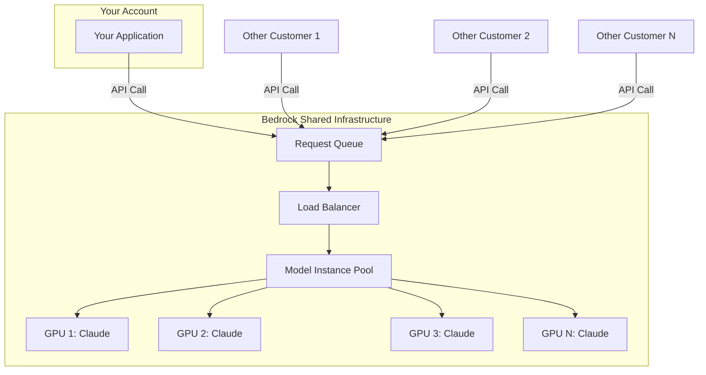
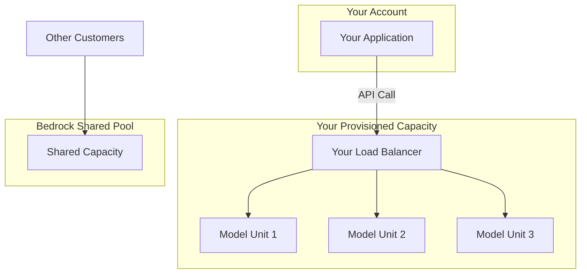
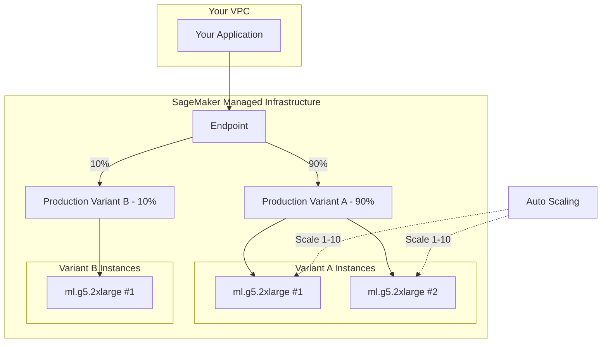
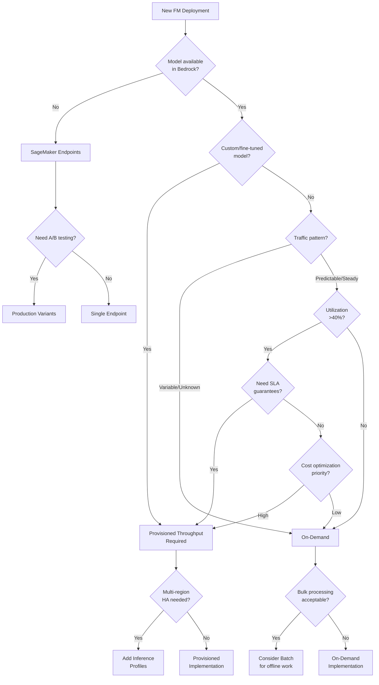

# Model Deployment Strategies

**Domain 2 | Task 2.2 | ~45 minutes**

---

## Why This Matters

Every foundation model application faces a fundamental question: **how do you run the model?** The answer determines your cost structure, latency profile, operational burden, and ultimately whether your application succeeds in production.

Consider this scenario: A startup launches a customer service chatbot using Lambda with Bedrock on-demand. Perfect for development—zero infrastructure, pay only for what you use. Six months later, they're processing 50,000 conversations daily. On-demand pricing now costs $15,000/month. Switching to provisioned throughput would cut that to $8,000. But they didn't architect for it, and migration requires significant refactoring.

The reverse mistake is equally costly. An enterprise provisions massive capacity for a projected rollout, pays $25,000/month for guaranteed throughput, then discovers adoption is slower than expected. They're utilizing 15% of paid capacity while burning budget.

**Model deployment isn't a one-time decision—it's an evolving strategy** that should match your application's lifecycle:
- **Development**: On-demand for experimentation
- **Early production**: On-demand with monitoring
- **Growth**: Evaluate provisioned throughput economics
- **Scale**: Optimize with cascading, batch processing, and committed capacity

This section covers the full spectrum: from the simplest Lambda-based deployments through enterprise-grade container orchestration, including the optimization patterns that separate cost-effective systems from money pits.

---

## Under the Hood: How Model Deployment Actually Works

Understanding what happens behind the scenes helps you make better deployment decisions and debug issues when they arise.

### Bedrock On-Demand: The Shared Pool

When you call Bedrock without provisioned throughput, you're using **shared infrastructure**:



**What this means:**
- Your requests compete with all other AWS customers for the same GPU pool
- During high demand, you may be throttled (`ThrottlingException`)
- Latency varies based on current pool utilization
- AWS manages all scaling, maintenance, and availability
- You pay only for tokens consumed—nothing during idle time

### Bedrock Provisioned Throughput: Dedicated Capacity

With provisioned throughput, you get **dedicated model units** that only serve your requests:



**What this means:**
- Dedicated GPU capacity reserved for your account only
- No competition with other customers—consistent latency
- No throttling (within your provisioned capacity)
- You pay hourly whether you use it or not
- Capacity measured in "model units" (throughput per minute)

### SageMaker Endpoints: Full Infrastructure Control

SageMaker gives you actual EC2 instances running your model:



**What this means:**
- You select instance types (GPU, memory, CPU)
- You control scaling policies
- You can run multiple model versions simultaneously (A/B testing)
- You can deploy any model (not just Bedrock-supported ones)
- You pay for instances running, not tokens consumed
- More operational responsibility (updates, monitoring, capacity planning)

### Why This Matters for Decision-Making

| Aspect | On-Demand | Provisioned | SageMaker |
|--------|-----------|-------------|-----------|
| **Who manages GPUs?** | AWS completely | AWS, dedicated to you | AWS, configured by you |
| **Capacity model** | Shared pool | Reserved capacity | Instance-based |
| **Cold starts** | Possible (rare) | None | None (if instances running) |
| **Model loading** | Pre-loaded | Pre-loaded | You control |
| **Instance types** | Hidden | Hidden | You choose |
| **Scaling** | Automatic (throttle) | Fixed (add units) | Auto-scaling policies |

---

## Understanding the Deployment Landscape

Before diving into specific patterns, understand the key dimensions that differentiate deployment options:

### Deployment Decision Factors

| Factor | Questions to Answer |
|--------|---------------------|
| **Model source** | Using Bedrock's models or your own trained models? |
| **Traffic pattern** | Predictable steady-state or highly variable spikes? |
| **Latency requirements** | Sub-second interactive or minutes-acceptable batch? |
| **Cost structure preference** | Pay-per-use flexibility or committed savings? |
| **Operational capacity** | Minimal management or full control needed? |
| **Compliance requirements** | Data residency, isolation, audit needs? |

### The Deployment Spectrum

| Complexity | Option | Trade-off |
|------------|--------|-----------|
| **Low** | Lambda + On-Demand | Zero infrastructure, pay per token |
| **Medium** | Bedrock Provisioned | Some commitment, guaranteed capacity |
| **High** | SageMaker Endpoints | Full control, more operational burden |
| **Highest** | ECS/EKS Custom | Maximum flexibility, maximum responsibility |

**Direction**: Low complexity → High complexity = More flexibility, more operational burden

---

## Lambda + Bedrock On-Demand: The Starting Point

The simplest deployment pattern combines **AWS Lambda** with Bedrock's **on-demand pricing**. This is where most applications should start—and where many should stay.

### Architecture Pattern

**Request Flow:**
1. **API Gateway** receives requests
2. Routes to specialized **Lambda functions**: Chat, Search, Summarization
3. All Lambdas call **Bedrock (On-Demand)** - shared capacity, pay per token only

### Implementation

```python
import boto3
import json
from typing import Optional

# Initialize client outside handler for connection reuse
bedrock = boto3.client('bedrock-runtime')

def lambda_handler(event: dict, context) -> dict:
    """
    Simple Lambda handler for Bedrock inference.
    Uses on-demand capacity - no provisioning required.
    """
    user_message = event.get('body', {}).get('message', '')

    try:
        response = bedrock.converse(
            modelId='anthropic.claude-3-haiku-20240307-v1:0',
            messages=[
                {'role': 'user', 'content': [{'text': user_message}]}
            ],
            inferenceConfig={
                'maxTokens': 1024,
                'temperature': 0.7
            }
        )

        assistant_message = response['output']['message']['content'][0]['text']

        return {
            'statusCode': 200,
            'body': json.dumps({
                'response': assistant_message,
                'usage': response['usage']  # Track token consumption
            })
        }

    except bedrock.exceptions.ThrottlingException as e:
        # On-demand can throttle during high demand
        return {
            'statusCode': 429,
            'body': json.dumps({'error': 'Rate limited, please retry'})
        }
    except bedrock.exceptions.ModelTimeoutException as e:
        # Complex prompts may timeout
        return {
            'statusCode': 504,
            'body': json.dumps({'error': 'Request timed out'})
        }
```

### Lambda Configuration for GenAI

GenAI workloads have specific Lambda configuration needs:

| Setting | Recommendation | Why |
|---------|----------------|-----|
| **Memory** | 512MB-1024MB | More memory = more CPU = faster boto3 processing |
| **Timeout** | 60-120 seconds | FM inference can take 10-30 seconds |
| **Reserved concurrency** | Set limits | Prevent runaway costs and rate limiting |
| **Provisioned concurrency** | For latency-critical | Eliminates cold starts |

### When On-Demand Excels

**Perfect for:**
- **Variable traffic**: Pay nothing during quiet periods
- **Development/staging**: No commitment while iterating
- **Unpredictable usage**: Can't forecast token consumption
- **Cost-sensitive startups**: No upfront commitment
- **Multi-model experimentation**: Test different models freely

**Challenges:**
- **Shared capacity**: Competes with all AWS customers
- **Potential throttling**: During high-demand periods
- **Higher per-token cost**: Premium for flexibility
- **Cold starts**: Lambda + Bedrock connection overhead

### The Economics of On-Demand

```
Cost = Input Tokens × Input Price + Output Tokens × Output Price

Example: Claude 3 Haiku on-demand
- Input:  $0.00025 per 1K tokens
- Output: $0.00125 per 1K tokens

10,000 requests/day × 500 input + 200 output tokens each:
- Input cost:  10,000 × 500 ÷ 1000 × $0.00025 = $1.25/day
- Output cost: 10,000 × 200 ÷ 1000 × $0.00125 = $2.50/day
- Total: $3.75/day = ~$112/month
```

At this volume, on-demand is clearly correct. The break-even with provisioned throughput depends on consistent utilization levels.

---

## Bedrock Provisioned Throughput: Committed Capacity

**Provisioned Throughput** reserves dedicated model capacity. You commit to a throughput level measured in **model units**, paying hourly regardless of actual usage.

### How Provisioned Throughput Works

**Your Dedicated Capacity:**
- Model Unit 1, 2, 3... (Reserved Compute)
- You don't compete with the shared pool

**Benefits:**
- No throttling
- Consistent latency
- Guaranteed capacity
- Lower per-token cost at scale

### Creating Provisioned Throughput

```python
import boto3

bedrock = boto3.client('bedrock')

# Create provisioned throughput
response = bedrock.create_provisioned_model_throughput(
    modelUnits=1,  # Number of model units
    provisionedModelName='my-production-capacity',
    modelId='anthropic.claude-3-sonnet-20240229-v1:0',
    commitmentDuration='OneMonth'  # Or 'SixMonths' for additional discount
)

provisioned_arn = response['provisionedModelArn']

# Use the provisioned ARN for inference
runtime = boto3.client('bedrock-runtime')

inference_response = runtime.converse(
    modelId=provisioned_arn,  # Use ARN, not model ID
    messages=[
        {'role': 'user', 'content': [{'text': 'Hello'}]}
    ]
)
```

### Model Units Explained

A **model unit** provides a specific throughput capacity measured in tokens per minute. The exact capacity varies by model:

| Model | Approximate Throughput per Model Unit |
|-------|---------------------------------------|
| Claude 3 Haiku | Higher (faster model) |
| Claude 3 Sonnet | Medium |
| Claude 3 Opus | Lower (more compute per token) |

**Planning capacity:**
1. Estimate tokens per minute at peak
2. Add 20-30% headroom
3. Divide by model unit capacity
4. Round up to nearest unit

### Commitment Options

| Commitment | Discount | Best For |
|------------|----------|----------|
| No commitment | 0% | Testing, uncertain future |
| 1 month | ~15% | Proven workloads, flexibility needed |
| 6 months | ~30% | Stable production workloads |

### When Provisioned Throughput Makes Sense

**Use provisioned when:**
- **Predictable, sustained traffic** (40-60%+ utilization)
- **SLA requirements** (can't tolerate throttling)
- **Consistent latency required** (customer-facing production)
- **Custom models** (required—no on-demand option)
- **Cost optimization at scale** (high-volume applications)

**Avoid provisioned when:**
- Traffic is highly variable
- You're still experimenting with models
- Utilization would be below 30-40%
- Budget constraints prevent commitment

### Custom Models Require Provisioned Throughput

This is a critical exam point: **fine-tuned and custom models have no on-demand option**. If you've customized a model through:
- Continued pre-training
- Fine-tuning
- Custom model import

You **must** deploy on provisioned throughput. Factor this into any customization decision.

---

## SageMaker Endpoints: Full Control

**Amazon SageMaker endpoints** provide managed infrastructure for hosting ML models with full control over the underlying compute.

### When SageMaker Is Required

**Do you need any of these?**
- Custom model (not available in Bedrock)
- Specific instance types (GPU, memory)
- A/B testing between model versions
- Multi-model endpoints (multiple models, shared infra)
- Model version management and rollbacks
- Custom inference containers
- Integration with SageMaker ML pipelines

**Yes** → Use **SageMaker Endpoints**
**No** → Consider **Bedrock**

### SageMaker Endpoint Architecture

**Endpoint Configuration:**

| Variant | Traffic | Model | Instances |
|---------|---------|-------|-----------|
| **Production Variant A** | 90% | Model v2.1 | ml.g5.2xlarge × 2 |
| **Production Variant B (canary)** | 10% | Model v2.2 | ml.g5.2xlarge × 1 |

**Auto Scaling:** 2-10 instances based on InvocationsPerInstance metric

### Deploying a Model to SageMaker

```python
import boto3
from sagemaker.huggingface import HuggingFaceModel

# Deploy a HuggingFace model to SageMaker
huggingface_model = HuggingFaceModel(
    model_data='s3://my-bucket/model.tar.gz',  # Your model artifacts
    role='arn:aws:iam::123456789012:role/SageMakerRole',
    transformers_version='4.26',
    pytorch_version='1.13',
    py_version='py39'
)

# Deploy with specific instance type
predictor = huggingface_model.deploy(
    initial_instance_count=2,
    instance_type='ml.g5.2xlarge',
    endpoint_name='my-llm-endpoint'
)

# Invoke the endpoint
response = predictor.predict({
    'inputs': 'Summarize the following document: ...',
    'parameters': {
        'max_new_tokens': 256,
        'temperature': 0.7
    }
})
```

### Instance Selection for LLMs

| Instance Family | GPU | Memory | Best For |
|-----------------|-----|--------|----------|
| **ml.g5.xlarge** | 1× A10G | 24GB | Small models (7B parameters) |
| **ml.g5.2xlarge** | 1× A10G | 24GB | Medium models, better CPU |
| **ml.g5.12xlarge** | 4× A10G | 96GB | Large models (70B parameters) |
| **ml.p4d.24xlarge** | 8× A100 | 320GB | Very large models, training |
| **ml.inf2.xlarge** | 2× Inferentia2 | 32GB | Cost-optimized inference |

### A/B Testing with Production Variants

```python
import boto3

sagemaker = boto3.client('sagemaker')

# Create endpoint config with multiple variants
sagemaker.create_endpoint_config(
    EndpointConfigName='ab-test-config',
    ProductionVariants=[
        {
            'VariantName': 'model-v1',
            'ModelName': 'my-model-v1',
            'InstanceType': 'ml.g5.2xlarge',
            'InitialInstanceCount': 2,
            'InitialVariantWeight': 90  # 90% of traffic
        },
        {
            'VariantName': 'model-v2',
            'ModelName': 'my-model-v2',
            'InstanceType': 'ml.g5.2xlarge',
            'InitialInstanceCount': 1,
            'InitialVariantWeight': 10  # 10% of traffic (canary)
        }
    ]
)
```

### Auto Scaling for SageMaker Endpoints

```python
import boto3

autoscaling = boto3.client('application-autoscaling')

# Register scalable target
autoscaling.register_scalable_target(
    ServiceNamespace='sagemaker',
    ResourceId='endpoint/my-llm-endpoint/variant/AllTraffic',
    ScalableDimension='sagemaker:variant:DesiredInstanceCount',
    MinCapacity=1,
    MaxCapacity=10
)

# Create scaling policy based on invocations per instance
autoscaling.put_scaling_policy(
    PolicyName='invocations-scaling',
    ServiceNamespace='sagemaker',
    ResourceId='endpoint/my-llm-endpoint/variant/AllTraffic',
    ScalableDimension='sagemaker:variant:DesiredInstanceCount',
    PolicyType='TargetTrackingScaling',
    TargetTrackingScalingPolicyConfiguration={
        'TargetValue': 100,  # Target invocations per instance
        'PredefinedMetricSpecification': {
            'PredefinedMetricType': 'SageMakerVariantInvocationsPerInstance'
        },
        'ScaleInCooldown': 300,
        'ScaleOutCooldown': 60
    }
)
```

---

## Model Cascading: The Cost Optimization Secret

**Model cascading** is one of the most impactful cost optimization patterns available. The insight is simple but powerful: **most queries don't need your most capable model**.

### The Power Law of Query Complexity

| Complexity | Frequency | Examples |
|------------|-----------|----------|
| **Simple** | 70% | FAQ lookups, basic generation, formatting |
| **Medium** | 20% | Multi-step reasoning, analysis, longer generation |
| **Complex** | 10% | Expert reasoning, nuanced understanding, creativity |

### Cascading Architecture

**Flow:**
1. **User Query** → Query Complexity Classifier
2. Classifier analyzes: keyword patterns, query length, reasoning depth, domain complexity

**Routing:**

| Classification | Model | Cost |
|----------------|-------|------|
| Simple | Haiku | $0.25/M tokens |
| Medium | Sonnet | $3.00/M tokens |
| Complex | Opus | $15/M tokens |

**Confidence Check (for Haiku responses):**
- High confidence → Return fast, low-cost response
- Low confidence → Escalate to Sonnet for quality response

### Complete Cascading Implementation

```python
import boto3
import json
from dataclasses import dataclass
from typing import Literal, Optional
from enum import Enum

class Complexity(Enum):
    SIMPLE = "simple"
    MEDIUM = "medium"
    COMPLEX = "complex"

@dataclass
class CascadeResult:
    response: str
    model_used: str
    complexity: Complexity
    escalated: bool
    estimated_cost: float

class ModelCascade:
    """
    Intelligent model routing based on query complexity.
    Routes simple queries to cheap models, escalates when needed.
    """

    MODELS = {
        Complexity.SIMPLE: {
            'id': 'anthropic.claude-3-haiku-20240307-v1:0',
            'name': 'Haiku',
            'input_cost': 0.00025,   # per 1K tokens
            'output_cost': 0.00125
        },
        Complexity.MEDIUM: {
            'id': 'anthropic.claude-3-sonnet-20240229-v1:0',
            'name': 'Sonnet',
            'input_cost': 0.003,
            'output_cost': 0.015
        },
        Complexity.COMPLEX: {
            'id': 'anthropic.claude-3-opus-20240229-v1:0',
            'name': 'Opus',
            'input_cost': 0.015,
            'output_cost': 0.075
        }
    }

    # Indicators that suggest higher complexity
    COMPLEXITY_INDICATORS = {
        'simple': ['what is', 'define', 'list', 'how many', 'when did'],
        'complex': ['analyze', 'compare and contrast', 'evaluate',
                   'synthesize', 'critique', 'design', 'recommend strategy']
    }

    UNCERTAINTY_PHRASES = [
        "i'm not sure", "i don't know", "unclear", "might be",
        "possibly", "i cannot determine", "insufficient information"
    ]

    def __init__(self):
        self.client = boto3.client('bedrock-runtime')

    def classify_complexity(self, query: str) -> Complexity:
        """Classify query complexity based on content analysis."""
        query_lower = query.lower()

        # Check for complex indicators first
        for indicator in self.COMPLEXITY_INDICATORS['complex']:
            if indicator in query_lower:
                return Complexity.COMPLEX

        # Check for simple indicators
        for indicator in self.COMPLEXITY_INDICATORS['simple']:
            if indicator in query_lower:
                return Complexity.SIMPLE

        # Default to medium for uncertain cases
        # Production: use ML classifier here
        word_count = len(query.split())
        if word_count < 10:
            return Complexity.SIMPLE
        elif word_count > 50:
            return Complexity.COMPLEX
        return Complexity.MEDIUM

    def invoke_model(self, model_id: str, query: str) -> tuple[str, dict]:
        """Invoke a model and return response with usage stats."""
        response = self.client.converse(
            modelId=model_id,
            messages=[{'role': 'user', 'content': [{'text': query}]}],
            inferenceConfig={'maxTokens': 1024, 'temperature': 0.7}
        )

        text = response['output']['message']['content'][0]['text']
        usage = response['usage']
        return text, usage

    def is_confident(self, response: str) -> bool:
        """Check if response indicates confidence."""
        response_lower = response.lower()
        return not any(phrase in response_lower
                      for phrase in self.UNCERTAINTY_PHRASES)

    def calculate_cost(self, usage: dict, complexity: Complexity) -> float:
        """Calculate cost based on token usage."""
        model = self.MODELS[complexity]
        input_cost = (usage['inputTokens'] / 1000) * model['input_cost']
        output_cost = (usage['outputTokens'] / 1000) * model['output_cost']
        return input_cost + output_cost

    def process(self, query: str) -> CascadeResult:
        """Process query with intelligent model cascading."""

        # Classify query complexity
        complexity = self.classify_complexity(query)
        model = self.MODELS[complexity]

        # Try initial model
        response, usage = self.invoke_model(model['id'], query)
        cost = self.calculate_cost(usage, complexity)

        # Check if we need to escalate
        escalated = False
        if complexity == Complexity.SIMPLE and not self.is_confident(response):
            # Escalate to medium
            complexity = Complexity.MEDIUM
            model = self.MODELS[complexity]
            response, usage = self.invoke_model(model['id'], query)
            cost += self.calculate_cost(usage, complexity)
            escalated = True

        return CascadeResult(
            response=response,
            model_used=model['name'],
            complexity=complexity,
            escalated=escalated,
            estimated_cost=cost
        )

# Usage
cascade = ModelCascade()
result = cascade.process("What is the capital of France?")  # Simple -> Haiku
result = cascade.process("Analyze the economic implications...")  # Complex -> Opus
```

### Cost Impact Analysis

| Traffic Volume | All Sonnet | Cascaded (70/20/10) | Monthly Savings |
|----------------|------------|---------------------|-----------------|
| 100K queries/mo | $4,500 | $1,620 | $2,880 (64%) |
| 500K queries/mo | $22,500 | $8,100 | $14,400 (64%) |
| 1M queries/mo | $45,000 | $16,200 | $28,800 (64%) |

---

## Cross-Region Inference with Inference Profiles

**Inference Profiles** enable automatic cross-region routing for high availability. Instead of calling a model in a specific region, you call an inference profile that routes to available capacity.

### How Inference Profiles Work

**Example: `us.claude-sonnet` profile**

| Region | Status | Routed? |
|--------|--------|---------|
| us-east-1 | Healthy | Yes |
| us-west-2 | Healthy | Yes |
| us-east-2 | Busy | No |

**Geographic Scopes:**
- `us.*` → Routes within US regions
- `eu.*` → Routes within EU regions
- Respects data residency requirements automatically

### Using Inference Profiles

```python
import boto3
import json

client = boto3.client('bedrock-runtime')

# Using inference profile for cross-region availability
response = client.invoke_model(
    modelId='us.anthropic.claude-3-sonnet-20240229-v1:0',  # Note: us. prefix
    body=json.dumps({
        'anthropic_version': 'bedrock-2023-05-31',
        'max_tokens': 1024,
        'messages': [{'role': 'user', 'content': 'Hello'}]
    })
)

# Or using full ARN format
response = client.invoke_model(
    modelId='arn:aws:bedrock:us-east-1:123456789012:inference-profile/us.anthropic.claude-3-sonnet-20240229-v1:0',
    body=json.dumps({
        'anthropic_version': 'bedrock-2023-05-31',
        'max_tokens': 1024,
        'messages': [{'role': 'user', 'content': 'Hello'}]
    })
)
```

### Inference Profiles vs Provisioned Throughput

This distinction is a common exam topic:

| Aspect | Inference Profiles | Provisioned Throughput |
|--------|-------------------|------------------------|
| **Purpose** | High availability, cross-region | Guaranteed capacity, cost savings |
| **Capacity** | Shared (on-demand) | Dedicated |
| **Geographic** | Routes across regions | Single region |
| **Cost model** | Pay per token | Hourly commitment |
| **Throttling** | Possible (shared) | No (dedicated) |
| **Custom models** | No | Yes (required) |

**Key exam point**: Inference profiles provide **availability** through geographic redundancy. Provisioned throughput provides **capacity guarantees** through dedicated resources. They solve different problems.

---

## Batch Inference: Bulk Processing at Scale

**Batch inference** processes large volumes asynchronously at approximately **50% discount** compared to on-demand. Trade latency for cost efficiency.

### Batch Inference Architecture

**Step 1: Prepare Input (JSONL)**
- Upload to `s3://bucket/input/batch-job-001.jsonl`
- Format: `{"recordId":"1","modelInput":{...}}` per line

**Step 2: Create Batch Job**
- Call `CreateModelInvocationJob`
- Specify: jobName, modelId, inputDataConfig, outputDataConfig

**Step 3: Processing (Asynchronous)**
- Status: InProgress → Completed
- Monitor via `GetModelInvocationJob`

**Step 4: Retrieve Results**
- Results appear at `s3://bucket/output/batch-job-001/`
- Format: `{"recordId":"1","modelOutput":{...}}` per line

### Complete Batch Processing Example

```python
import boto3
import json
import time
from typing import List, Dict

class BatchInferenceManager:
    """Manages batch inference jobs for bulk processing."""

    def __init__(self, bucket: str, role_arn: str):
        self.bedrock = boto3.client('bedrock')
        self.s3 = boto3.client('s3')
        self.bucket = bucket
        self.role_arn = role_arn

    def prepare_input(self, documents: List[Dict], job_id: str) -> str:
        """
        Convert documents to JSONL format and upload to S3.

        Each document should have 'id' and 'content' fields.
        """
        jsonl_lines = []

        for doc in documents:
            record = {
                "recordId": doc['id'],
                "modelInput": {
                    "anthropic_version": "bedrock-2023-05-31",
                    "max_tokens": 256,
                    "messages": [{
                        "role": "user",
                        "content": f"Summarize this document in 2-3 sentences:\n\n{doc['content']}"
                    }]
                }
            }
            jsonl_lines.append(json.dumps(record))

        # Upload to S3
        input_key = f"batch-jobs/{job_id}/input.jsonl"
        self.s3.put_object(
            Bucket=self.bucket,
            Key=input_key,
            Body='\n'.join(jsonl_lines)
        )

        return f"s3://{self.bucket}/{input_key}"

    def create_job(
        self,
        job_name: str,
        input_s3_uri: str,
        model_id: str = 'anthropic.claude-3-haiku-20240307-v1:0'
    ) -> str:
        """Create batch inference job."""

        response = self.bedrock.create_model_invocation_job(
            jobName=job_name,
            modelId=model_id,
            roleArn=self.role_arn,
            inputDataConfig={
                's3InputDataConfig': {
                    's3Uri': input_s3_uri,
                    's3InputFormat': 'JSONL'
                }
            },
            outputDataConfig={
                's3OutputDataConfig': {
                    's3Uri': f"s3://{self.bucket}/batch-jobs/{job_name}/output/"
                }
            }
        )

        return response['jobArn']

    def wait_for_completion(self, job_arn: str, poll_interval: int = 60) -> str:
        """Poll job status until completion."""

        while True:
            response = self.bedrock.get_model_invocation_job(
                jobIdentifier=job_arn
            )

            status = response['status']

            if status == 'Completed':
                return response['outputDataConfig']['s3OutputDataConfig']['s3Uri']
            elif status == 'Failed':
                raise Exception(f"Batch job failed: {response.get('message')}")
            elif status in ['Stopping', 'Stopped']:
                raise Exception(f"Batch job was stopped")

            print(f"Job status: {status}. Waiting {poll_interval}s...")
            time.sleep(poll_interval)

    def get_results(self, output_s3_uri: str) -> List[Dict]:
        """Retrieve and parse batch results from S3."""

        # Parse S3 URI
        bucket = output_s3_uri.split('/')[2]
        prefix = '/'.join(output_s3_uri.split('/')[3:])

        # List output files
        response = self.s3.list_objects_v2(Bucket=bucket, Prefix=prefix)

        results = []
        for obj in response.get('Contents', []):
            if obj['Key'].endswith('.jsonl'):
                file_response = self.s3.get_object(Bucket=bucket, Key=obj['Key'])
                content = file_response['Body'].read().decode('utf-8')

                for line in content.strip().split('\n'):
                    if line:
                        results.append(json.loads(line))

        return results

# Usage
manager = BatchInferenceManager(
    bucket='my-batch-bucket',
    role_arn='arn:aws:iam::123456789012:role/BedrockBatchRole'
)

# Prepare documents
documents = [
    {'id': '1', 'content': 'Long document 1...'},
    {'id': '2', 'content': 'Long document 2...'},
    # ... thousands more
]

input_uri = manager.prepare_input(documents, 'job-001')
job_arn = manager.create_job('summarization-job', input_uri)
output_uri = manager.wait_for_completion(job_arn)
results = manager.get_results(output_uri)
```

### Batch Inference Use Cases

| Use Case | Volume | Why Batch |
|----------|--------|-----------|
| **Document summarization** | 10,000+ docs | No real-time need, 50% savings |
| **Data enrichment** | Millions of records | Background processing acceptable |
| **Content generation** | Bulk marketing content | Quality over speed |
| **Sentiment analysis** | Historical data analysis | Offline processing |
| **Model evaluation** | Test datasets | No latency requirement |

---

## Container-Based Deployment: Maximum Control

For workloads requiring complete control over infrastructure, **ECS** or **EKS** deployments host custom model serving.

### Memory and GPU Considerations

LLMs have unique resource requirements:

**LLM Memory Requirements (FP16):**

| Model Size | GPU Memory Required |
|------------|---------------------|
| 7B parameters | ~14 GB |
| 13B parameters | ~26 GB |
| 33B parameters | ~66 GB |
| 70B parameters | ~140 GB |

**Memory Formula:** Parameters × 2 bytes (FP16) + Activation overhead + KV cache (grows with sequence length)

**Optimization Techniques:**

| Technique | Memory Reduction | Trade-off |
|-----------|------------------|-----------|
| INT8 quantization | ~50% | Minor quality impact |
| INT4 quantization | ~75% | Noticeable quality impact |
| Model sharding | Distributed | Requires multi-GPU |
| Paged attention | Dynamic | Better memory efficiency |

### ECS Task Definition for LLM Serving

```json
{
  "family": "llm-inference",
  "requiresCompatibilities": ["EC2"],
  "containerDefinitions": [
    {
      "name": "llm-server",
      "image": "123456789012.dkr.ecr.us-east-1.amazonaws.com/llm-serving:latest",
      "memory": 32768,
      "cpu": 4096,
      "resourceRequirements": [
        {
          "type": "GPU",
          "value": "1"
        }
      ],
      "portMappings": [
        {
          "containerPort": 8080,
          "protocol": "tcp"
        }
      ],
      "environment": [
        {"name": "MODEL_NAME", "value": "my-custom-model"},
        {"name": "MAX_BATCH_SIZE", "value": "4"},
        {"name": "MAX_SEQUENCE_LENGTH", "value": "4096"}
      ],
      "healthCheck": {
        "command": ["CMD-SHELL", "curl -f http://localhost:8080/health || exit 1"],
        "interval": 30,
        "timeout": 5,
        "retries": 3
      },
      "logConfiguration": {
        "logDriver": "awslogs",
        "options": {
          "awslogs-group": "/ecs/llm-inference",
          "awslogs-region": "us-east-1",
          "awslogs-stream-prefix": "llm"
        }
      }
    }
  ]
}
```

### Scaling Based on Token Throughput

```python
import boto3

cloudwatch = boto3.client('cloudwatch')
autoscaling = boto3.client('application-autoscaling')

# Publish custom metric: tokens per second
cloudwatch.put_metric_data(
    Namespace='LLM/Inference',
    MetricData=[
        {
            'MetricName': 'TokensPerSecond',
            'Dimensions': [
                {'Name': 'Service', 'Value': 'llm-inference'},
                {'Name': 'ClusterName', 'Value': 'production'}
            ],
            'Value': current_tokens_per_second,
            'Unit': 'Count/Second'
        },
        {
            'MetricName': 'QueueDepth',
            'Dimensions': [
                {'Name': 'Service', 'Value': 'llm-inference'},
                {'Name': 'ClusterName', 'Value': 'production'}
            ],
            'Value': pending_requests,
            'Unit': 'Count'
        }
    ]
)

# Scale based on queue depth (better than request count for LLMs)
autoscaling.put_scaling_policy(
    PolicyName='queue-depth-scaling',
    ServiceNamespace='ecs',
    ResourceId='service/production/llm-inference',
    ScalableDimension='ecs:service:DesiredCount',
    PolicyType='StepScaling',
    StepScalingPolicyConfiguration={
        'AdjustmentType': 'ChangeInCapacity',
        'StepAdjustments': [
            {'MetricIntervalLowerBound': 0, 'MetricIntervalUpperBound': 50, 'ScalingAdjustment': 1},
            {'MetricIntervalLowerBound': 50, 'MetricIntervalUpperBound': 100, 'ScalingAdjustment': 2},
            {'MetricIntervalLowerBound': 100, 'ScalingAdjustment': 3}
        ],
        'Cooldown': 120
    }
)
```

---

## Decision Framework: Choosing Your Deployment Strategy

Use this framework to systematically evaluate deployment options for your use case.

### Quick Reference

| Scenario | Choose | Why |
|----------|--------|-----|
| New application, uncertain traffic | **Bedrock On-Demand** | Zero commitment, pay per token |
| Production app, steady 10K+ req/day | **Evaluate Provisioned** | Likely cost savings, no throttling |
| Custom/fine-tuned model | **Provisioned Throughput** | Required—no on-demand option |
| Model not in Bedrock | **SageMaker** | Full flexibility for any model |
| Need A/B testing model versions | **SageMaker** | Production variants support this |
| Bulk processing (not real-time) | **Batch Inference** | 50% cost savings |
| Multi-region high availability | **Inference Profiles** | Automatic failover |

### Decision Tree



### Trade-off Analysis

| Factor | On-Demand | Provisioned | SageMaker | Batch |
|--------|-----------|-------------|-----------|-------|
| **Cost Model** | Per token | Hourly | Per instance | Per token (50% off) |
| **Cost at Low Volume** | Lowest | Higher | Highest | Lowest |
| **Cost at High Volume** | Higher | Lower | Variable | Lowest |
| **Latency** | Variable | Consistent | Consistent | Hours |
| **Throttling Risk** | Yes | No | No | N/A |
| **Operational Burden** | None | Low | Medium-High | Low |
| **Model Flexibility** | Bedrock only | Bedrock + custom | Any | Bedrock only |
| **Scaling** | Automatic | Manual (add units) | Auto-scaling | N/A |
| **Exam Signal** | "serverless", "pay-per-use" | "guaranteed", "SLA" | "custom", "A/B test" | "bulk", "offline" |

### Break-Even Analysis: When to Switch

**On-Demand vs Provisioned Throughput:**

The crossover point depends on your utilization. At approximately **40-50% utilization**, provisioned becomes more cost-effective:

| Monthly Spend (On-Demand) | Likely Better Option |
|---------------------------|---------------------|
| < $2,000 | Stay on-demand (flexibility > savings) |
| $2,000 - $5,000 | Evaluate provisioned (run the numbers) |
| > $5,000 | Likely provisioned (significant savings) |

**When to consider SageMaker over Bedrock:**
- You need a model not available in Bedrock
- You need to A/B test model versions
- You need specific instance types for performance tuning
- You need multi-model endpoints (cost optimization)
- Compliance requires infrastructure in your VPC

---

## Exam Tips

| When you see... | Think... |
|-----------------|----------|
| "least operational overhead" + FM access | Lambda + Bedrock on-demand |
| "custom model" or "fine-tuned" | SageMaker endpoints (or Provisioned Throughput) |
| "high availability" or "cross-region failover" | Inference Profiles |
| "bulk processing" or "offline inference" | Batch Inference (~50% savings) |
| "cost optimization" with variable query complexity | Model cascading |
| "predictable production traffic" + cost savings | Provisioned Throughput |
| "GPU utilization" or "container optimization" | Batch requests, scale on tokens/second |
| "A/B testing" model versions | SageMaker production variants |
| "multi-model" shared infrastructure | SageMaker multi-model endpoints |

---

## Key Takeaways

> **1. Lambda + Bedrock on-demand is the starting point for most applications.**
> Zero infrastructure, pay only for tokens used. Accept shared capacity variability and potential cold starts. Perfect for development and variable-traffic production.

> **2. Provisioned Throughput guarantees capacity for predictable production workloads.**
> Commit to capacity for consistent latency, no throttling, and lower per-token costs. Required for custom models. Economics favor 40%+ utilization.

> **3. SageMaker provides full control when Bedrock doesn't meet requirements.**
> Custom models, specific instance types, A/B testing, multi-model endpoints. Higher operational overhead justified by flexibility.

> **4. Model cascading can reduce costs by 50-70% through intelligent routing.**
> Most queries don't need your most capable model. Classify complexity, route to appropriate tier, escalate when confidence is low.

> **5. Inference profiles provide geographic redundancy for high availability.**
> Automatic cross-region routing to healthy capacity. Not the same as provisioned throughput—solves availability, not capacity guarantees.

> **6. Batch inference saves ~50% for any workload that doesn't require real-time response.**
> Prepare JSONL in S3, create job, retrieve results. Use for document processing, data enrichment, content generation at scale.

---

## Common Mistakes

| Mistake | Why It Matters |
|---------|----------------|
| **Using provisioned throughput for variable traffic** | Paying for unused capacity. On-demand is better for unpredictable workloads. |
| **Using SageMaker when Bedrock would suffice** | Unnecessary operational overhead. Use managed services when they meet requirements. |
| **Not implementing model cascading** | Missing 50-70% cost savings when query complexity varies. |
| **Confusing inference profiles with provisioned throughput** | Different purposes: availability (geographic redundancy) vs. capacity (dedicated resources). |
| **Using on-demand for bulk processing** | Batch inference saves 50%. Always evaluate for non-real-time workloads. |
| **Under-provisioning container memory for LLMs** | Models need ~2 bytes per parameter (FP16) plus overhead. OOM errors cause failed requests. |
| **Scaling containers on request count instead of tokens** | A few long-output requests can saturate capacity. Scale on tokens/second or queue depth. |
| **Not considering commitment discounts at scale** | 1-month and 6-month commitments offer 15-30% savings on provisioned throughput. |
