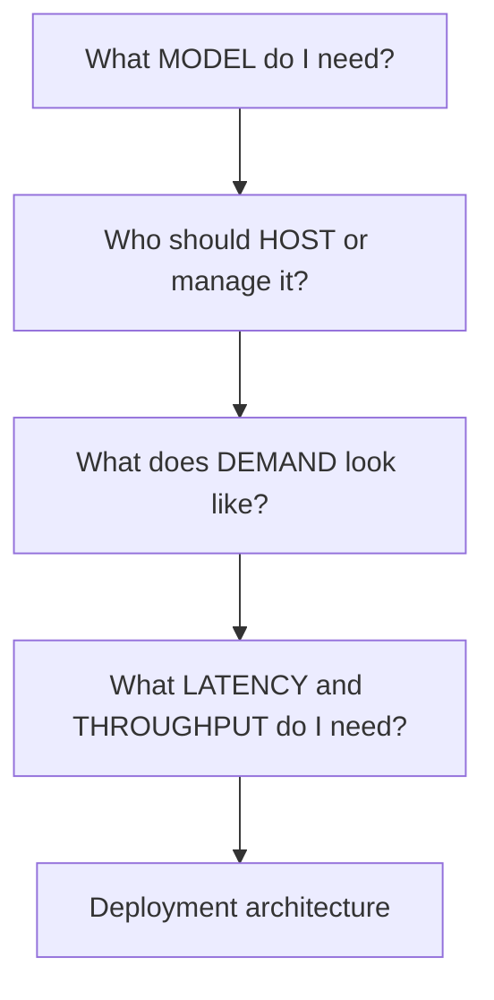
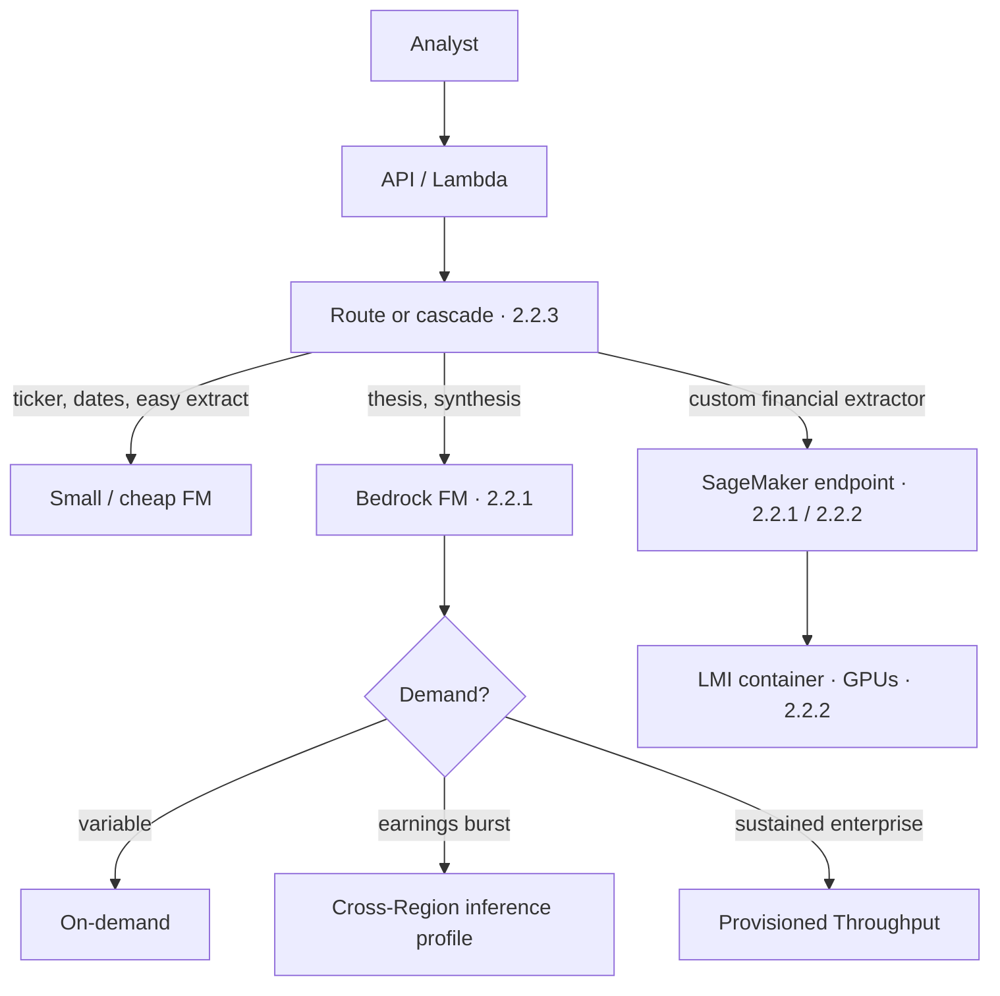
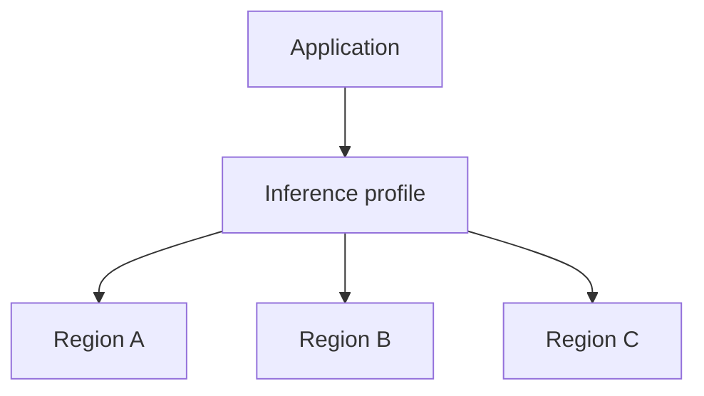
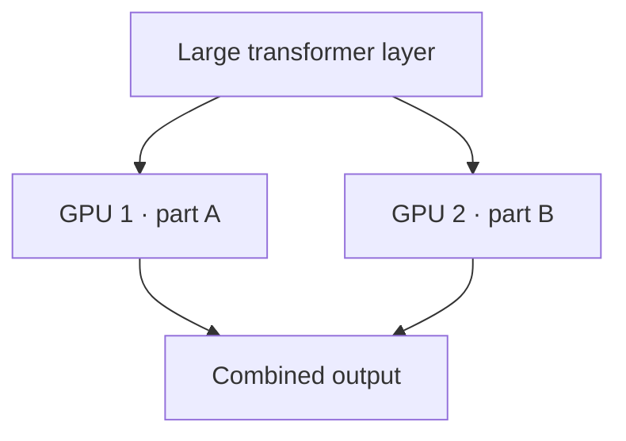

# Task 2.2 — Implement Model Deployment Strategies

**Domain 2 · Skills 2.2.1–2.2.3**

The easiest way to misunderstand this task is to think:

> Deployment means putting a model on a server.

For GenAI, deployment is a **capacity-and-serving architecture** problem:

> Which model should serve this workload, who manages the infrastructure, how much capacity do I need, and how do I meet latency and throughput requirements without wasting money?

The AIP-C01 blueprint frames three skills: choose the deployment strategy, handle what makes LLM infrastructure different from ordinary ML, and optimize the model/capacity mix.

By the end you should be able to answer, out loud:

> Given this workload, should I invoke a managed foundation model or host one myself — and how do I serve it efficiently without buying more model or GPU than the task needs?

One application runs through every section.

> **Technology Investment Research Copilot.** Analysts ask questions about earnings calls, internal research, valuation, competitors, and portfolio companies — including: “What changed in the investment thesis on AMD over the last two quarters?”

That request is not one kind of work. Ticker lookup, transcript summary, and thesis judgment have different model, latency, and capacity needs. Task 2.2 is how you serve all of them.

> **Exam tip:** The blueprint names **Lambda for on-demand invocation**, **Bedrock Provisioned Throughput**, **SageMaker AI endpoints for hybrid solutions**, **container-based patterns** (memory, GPU, token processing, specialized loading), and **smaller models plus API-based cascading**. Teach the architecture first. Map those names second.

---

## Deployment is not “put it on a server”

A 50 MB classifier on a CPU is a hosting problem. A foundation model is a **capacity** problem: tokens, concurrency, GPU memory, and who pays when nobody is asking questions.

If you start with “SageMaker or Bedrock?” you will skip the questions that actually pick the architecture.


```mermaid
flowchart TD
    Q1[What MODEL do I need?] --> Q2[Who should HOST or manage it?]
    Q2 --> Q3[What does DEMAND look like?]
    Q3 --> Q4[What LATENCY and THROUGHPUT do I need?]
    Q4 --> Arch[Deployment architecture]
```

| Answers | First architecture |
|---------|-------------------|
| Occasional analyst query + commercial FM + traffic varies + no GPU ownership | **Bedrock on-demand** |
| Hundreds of concurrent users + known FM + sustained predictable load + dedicated capacity | **Bedrock Provisioned Throughput** |
| Custom / open-weight model + special inference libraries + GPU and container control | **SageMaker AI endpoint** (or containers you operate) |

That table is Skill 2.2.1. The rest of the task is why LLMs make those choices harder, and how not to over-serve.

---

## Invoke versus host

Get this distinction down before any service name. It explains most of Task 2.2.

**Managed model invocation (Amazon Bedrock)**

```text
Your application
      ↓
Bedrock API  (Converse / ConverseStream / InvokeModel)
      ↓
Foundation model
```

AWS operates the inference infrastructure. Your application does **not** load weights onto a GPU. You **invoke**. AWS currently recommends **Converse** / **ConverseStream** for conversational apps because the interface is consistent across supported models; `InvokeModel` is the lower-level path.

**Model hosting (SageMaker AI)**

```text
Model artifacts + container + compute
      ↓
SageMaker endpoint
      ↓
Your application invokes the endpoint
```

Now you care about container image, GPU type and memory, instance count, model loading, inference engine, batching, and model parallelism. SageMaker provisions infrastructure and deploys artifacts onto it. **Inference components** can pin CPU / accelerator / memory per model and let more than one model share an endpoint.

> **Mental shortcut:** Bedrock = invoke a managed FM. SageMaker = deploy and operate a model-serving endpoint.

```recall
Q: An analyst hits Claude twice per hour through a Lambda. Where is Claude deployed?
A: Not on Lambda. Lambda is application compute. Inference runs in Amazon Bedrock.
```

---

## The AMD copilot architecture

Keep this picture. Each skill is a labeled piece of the same system.


```mermaid
flowchart TB
    Analyst[Analyst] --> API[API / Lambda]
    API --> Router["Route or cascade · 2.2.3"]
    Router -->|ticker, dates, easy extract| Small[Small / cheap FM]
    Router -->|thesis, synthesis| Bedrock["Bedrock FM · 2.2.1"]
    Router -->|custom financial extractor| SM["SageMaker endpoint · 2.2.1 / 2.2.2"]
    Bedrock --> Cap{Demand?}
    Cap -->|variable| OD[On-demand]
    Cap -->|earnings burst| CRI[Cross-Region inference profile]
    Cap -->|sustained enterprise| PT[Provisioned Throughput]
    SM --> LMI["LMI container · GPUs · 2.2.2"]
```

Lambda is in the picture as **the app**, not as the place the 70B model lives.

---

## Skill 2.2.1 — Choose the right deployment strategy

**The question this skill answers:** Given traffic, latency, model, and control requirements, how should I make inference available to my application?

There is no universally correct deployment. You are balancing latency, throughput, cost, traffic predictability, model choice, infrastructure control, and operational complexity.

**Concept.** Pick *where inference happens* and *how capacity is paid for*. Application compute (Lambda, containers, ECS) is a separate decision from model serving.

**Mental model.** Shared elastic capacity versus reserved capacity versus “I run the GPUs.” Same cloud question as always; the unit of work is tokens, not HTTP hits.

### Bedrock on-demand

The copilot has 40 analysts. Most of the day: a few questions, idle, a small spike after earnings, idle again. Dedicated GPUs running all day are waste.

The app invokes Bedrock only when someone asks. **Lambda is not hosting the foundation model.** Lambda receives the request, validates, calls Bedrock, and returns the result. Bedrock performs inference.

**Good fit:** unpredictable traffic; low or moderate volume; experimentation; no dedicated-capacity requirement; teams that do not want to manage GPUs.

> **Note:** Current Bedrock on-demand has **Flex / Standard / Priority** service tiers (cost vs availability vs throttling). The exam still thinks in **on-demand vs Provisioned Throughput**. Use tiers as current ops nuance, not as a replacement for that distinction.

### On-demand bursts and cross-Region inference

AMD reports at 4:15 PM. Fifty analysts hit “Summarize AMD earnings versus our thesis.” Traffic jumps.

On-demand is still subject to **quotas** and peak availability. [Cross-Region inference profiles](https://docs.aws.amazon.com/bedrock/latest/userguide/cross-region-inference.html) route requests across Regions in a profile to increase available **on-demand** throughput (geographic profiles stay inside a geography; global profiles can route worldwide, often cheaper, with different residency implications).


```mermaid
flowchart TD
    App[Application] --> Prof[Inference profile]
    Prof --> A[Region A]
    Prof --> B[Region B]
    Prof --> C[Region C]
```

Do **not** confuse this with Provisioned Throughput. Cross-Region inference is still an on-demand capacity strategy. AWS currently states that **inference profiles do not support Provisioned Throughput**.

### Bedrock Provisioned Throughput

The copilot is now enterprise-wide: 1,000 users, constant queries, predictable business-hour load, a latency SLO. Shared on-demand may not be the capacity story you want.

[Provisioned Throughput](https://docs.aws.amazon.com/bedrock/latest/userguide/prov-throughput.html) purchases **model units**: a specified throughput level at a **fixed hourly** cost. You reserve capacity.

If you **customized** a Bedrock model, you **must** purchase Provisioned Throughput to invoke it. That is a current platform rule, not just a cost optimization.

| | On-demand | Provisioned |
|--|-----------|-------------|
| Demand | Variable | Sustained / predictable |
| Capacity | Shared / elastic | Dedicated amount |
| Cost | Usage-oriented | Fixed provisioned capacity |
| Idle | Attractive | Potential waste |
| Ops | Low | Capacity planning |

This is: should I share elastic capacity, or reserve it because I know I will use it?

> **Exam trap:** Provisioned Throughput does **not** mean “a faster model.” It addresses **capacity / throughput availability**. Do not conflate reserved capacity with per-request model speed.

### Latency is not throughput

**Latency** — how long *one* request takes (`request → 2.3 s → response`).

**Throughput** — how much work the system processes over time: requests/second, **tokens/second**, concurrent requests.

A system can have excellent per-request latency and terrible aggregate throughput, or the reverse. Task 2.2 is often about balancing both. For LLMs, “requests per second” without tokens is a lying metric. Two “one request” jobs — “What’s AMD’s ticker?” vs “Read 50,000 tokens and write a 4,000-token memo” — are not the same work.

### SageMaker AI endpoint

The desk has a specialized financial model: open-weight, fine-tuned, particular inference engine, GPU-level control, custom container dependencies. Bedrock is no longer the right abstraction.

You deploy to a **SageMaker AI inference endpoint**: model/container, instance type, count. That is hosting.

SageMaker inference **modes** (not the center of 2.2, but know the map):

| Mode | When |
|------|------|
| **Real-time** | Interactive, low latency, sustained traffic. Copilot Q&A. |
| **Serverless** | Intermittent traffic, tolerate cold starts, pay for use. Poor fit for large multi-GPU LLMs (no GPU story like real-time + LMI). |
| **Asynchronous** | Large payloads / long jobs; client does not need the answer on the HTTP call. Queue, write to S3. |
| **Batch transform** | Offline, data already in hand. Nightly 10,000 filings. |

Interactive AMD Q&A → real-time. Nightly corpus scoring → do not assume a real-time GPU endpoint.

### Hybrid: Bedrock *and* SageMaker

The blueprint explicitly names SageMaker endpoints to implement **hybrid** solutions. You are not forced to pick one logo.

**Bedrock:** complex reasoning and natural-language synthesis (Claude on the AMD thesis question).

**SageMaker:** a specialized financial extractor you trained and need to control.

That is hybrid model deployment. Lambda (or API Gateway + compute) still sits in front as application logic.

**Decision rules.**

| Requirement | First thought |
|-------------|---------------|
| Variable / unpredictable FM requests | Bedrock on-demand |
| Burst traffic across supported Regions | Bedrock cross-Region inference |
| Stable high-volume FM traffic | Bedrock Provisioned Throughput |
| Custom Bedrock model you fine-tuned | Provisioned Throughput (required to invoke) |
| Custom inference stack / GPU / container | SageMaker AI |
| Different workload types | Hybrid Bedrock + SageMaker |
| Small event-driven backend invoking an FM | Lambda → Bedrock |

**Failure mode.** “Use Lambda to deploy the foundation model.” Lambda invokes; Bedrock (or a SageMaker endpoint) serves. Opposite failure: provision dedicated capacity for a 40-analyst prototype that is idle 20 hours a day.

```quickcheck
Q: A research assistant gets 50–100 queries per day with long idle periods. The team wants a managed FM and does not want to operate GPUs.
A: SageMaker multi-GPU endpoint
B: Bedrock on-demand
C: Bedrock Provisioned Throughput
D: Dedicated ECS GPU cluster
correct: B
feedback: Variable demand and no infrastructure-control requirement. Provisioned and GPU clusters waste idle capacity.
```

---

## Skill 2.2.2 — Why LLM deployment is different

**The question this skill answers:** Why can’t I deploy a 70-billion-parameter LLM exactly like an ordinary classifier?

**Concept.** Traditional ML inference might be a 50 MB model, a CPU, 30 numbers in, a class out. LLM inference is tens or hundreds of GB of weights, one or many GPUs, thousands of input tokens, hundreds or thousands of generated tokens, and many concurrent users. The infrastructure question changes from “does a service run?” to “can this hardware **hold, feed, and generate from** the model at the required concurrency?”

The blueprint’s examples are **container-based** patterns optimized for **memory**, **GPU utilization**, and **token processing**, plus **specialized model loading**. On AWS that is usually a **SageMaker LMI** container on a real-time endpoint. You can also run a serving stack yourself on **ECS / EKS / Fargate** if you already operate containers — higher ops, same physics.

**Mental model.** Traditional deployment asks whether a process can start. LLM deployment asks whether accelerators can keep the weights resident, the KV cache bounded, and the token pipeline busy.

### The model may not fit on one GPU

A fictional model needs 140 GB; one accelerator has 80 GB. You cannot `load model → GPU`. You **split** the model. That is **model parallelism**. The exam-relevant flavor is **tensor parallelism**: partition weights/operations of a layer across devices, combine the result.


```mermaid
flowchart TD
    Layer[Large transformer layer] --> G1[GPU 1 · part A]
    Layer --> G2[GPU 2 · part B]
    G1 --> Out[Combined output]
    G2 --> Out
```

> **Mental shortcut:** Doesn’t fit on one GPU → tensor / model parallelism. **Not** “autoscale more replicas.” Extra copies of a model that cannot load on one device still cannot load.

SageMaker [LMI containers](https://docs.aws.amazon.com/sagemaker/latest/dg/large-model-inference-container-docs.html) set this with `option.tensor_parallel_degree` (often `max`).

### Loading an LLM is expensive

A web app may start in seconds. A large model: start instance → download artifacts → load weights → allocate GPU memory → initialize the inference engine → become healthy. AWS exposes larger **model download and container startup timeouts** on SageMaker LMI endpoints because this can take a long time and a lot of disk.

**Cold start** for tiny Lambda ≈ initialize a runtime. For a large model it is compute + artifacts + tens of GB of weights + accelerator init + model server. Scale-to-zero saves money; reload time can blow a latency SLO. That tradeoff is why “just serverless / scale to zero” is not automatic for LLM endpoints.

### Token processing is the unit of work

LLM work is not `one request = one unit`. Prefill processes the prompt; decode emits token 1, token 2, … Long prompts delay **time to first token**. Long answers stretch **inter-token latency**. Size endpoints on **tokens and concurrency**, not generic HTTP RPS.

### GPU memory is more than weights

```text
GPU memory ≈ weights + runtime + activations + KV cache
```

The **KV cache** stores state for autoregressive generation. Long context + many concurrent generations = memory pressure. An endpoint that *fits the model* can still OOM under load.

### GPUs are expensive — batching and continuous batching

Idle GPU time is wasted money. **Batching** runs multiple requests together to raise throughput. Classic *fixed* batches are awkward for LLMs: generations finish at different lengths (40 vs 500 vs 900 tokens). **Continuous batching** (rolling batch) adds/removes sequences as they complete. LMI containers support continuous batching, tensor parallelism, and quantization for this reason.

### Quantization

Store/compute weights in fewer bits (e.g. 16-bit → 8-bit / 4-bit). Less memory, sometimes faster, lower infra cost — and possible quality loss. The question is not “can I shrink it?” It is “how much quality can I keep?”

### Specialized containers, not a from-scratch GPU scheduler

You generally should not reinvent distributed inference, tensor parallelism, continuous batching, model loading, and request serving. **LMI** bundles a model server (vLLM, TensorRT-LLM, and related backends) for SageMaker.

If the stem is “container-based, we already run EKS, custom serving,” **ECS / EKS / Fargate** is the exam’s general-container answer. The *physics* (memory, GPU, tokens, loading) do not change. You just own more of the platform.

**Decision rules.**

| If you see | Think |
|------------|--------|
| Huge self-hosted LLM on SageMaker | LMI container |
| Model larger than one accelerator | Tensor / model parallelism |
| GPU memory pressure under concurrency | Weights vs KV cache vs quantization vs less concurrency |
| Poor GPU utilization | Batching / continuous batching |
| Interactive Q&A | Real-time endpoint |
| Long / large / not interactive | Async or batch |
| Container platform we already operate | ECS / EKS / Fargate + a proper LLM server |

**Failure mode.** Treat a 70B model like a sklearn pickle: one CPU task, scale on request count, 30-second health check. Or “autoscale” a model that cannot fit on the instance type.

```quickcheck
Q: A 70B custom model cannot fit on one GPU. Best concept?
A: Cross-Region inference
B: Prompt caching
C: Tensor / model parallelism
D: Lambda concurrency
correct: C
feedback: Partition the model across accelerators. More Regions, cache, or Lambda concurrency do not shrink a single replica’s memory footprint.
```

```fillin
Doesn't fit on one GPU → {{tensor parallelism}}.
```

---

## Skill 2.2.3 — Optimize model deployment

**The question this skill answers:** How do I meet quality requirements without using more model and infrastructure than necessary?

**Concept.** Bigger model ≠ better architecture. Use the **cheapest / smallest deployment that reliably satisfies the task**. The blueprint names **appropriate model selection**, **smaller pretrained models for specific tasks**, and **API-based cascading** for routine queries.

**Mental model.** The optimization triangle: quality, cost, latency. You rarely move all three independently. Deployment *is* the business tradeoff.

```text
             QUALITY
               ▲
              / \
             /   \
            /     \
           /       \
          /         \
         ─────────────
       COST        LATENCY
```

Same firm, different points: ticker classification favors cost + latency; final thesis favors quality; earnings night favors latency + throughput; overnight documents favor cost + throughput.

### Start with the task, not the model

| Copilot task | Difficulty |
|--------------|------------|
| Identify ticker | Tiny |
| Classify document | Small |
| Extract reported revenue | Small / medium |
| Summarize transcript | Medium |
| Compare two quarters | Medium / high |
| Judge thesis deterioration | High |
| Portfolio-level synthesis | High |

Sending every one of these to the most expensive reasoning model is a deployment failure, not a quality strategy.

**Right-size.** If Model A is cheap, fast, and 95% on ticker classification, and Model B is expensive, slow, and 96% on the same job, use A. For “has AMD’s competitive positioning deteriorated versus our thesis?” B may earn its keep.

**Rule:** match model capability to task complexity.

### Routing versus cascading

**Routing** chooses *before* inference: classification task → small model; deep thesis → large model.

**Cascading** tries cheap first; escalates if confidence is insufficient: small model → if not good enough → large model.

> **Mental shortcut:** Routing decides before inference. Cascading escalates after an initial attempt.

“What date was AMD’s last earnings call?” → small model or deterministic retrieval. “Why have we become more cautious on AMD?” → stronger model.

### Optimize in this order

A cost problem is often the *model*, not the GPU fleet.

```text
Task
 ↓
Model choice
 ↓
Routing / cascading
 ↓
Prompt + token usage
 ↓
Deployment mode (on-demand / PT / endpoint)
 ↓
Infrastructure utilization
 ↓
Low-level serving (quantize, batch, parallel)
```

Moving 80% of requests off a giant model can beat squeezing 10% more tokens/sec from that giant model.

**Context length is a deployment decision.** Sending 100,000 tokens to answer something that needs 8,000 relevant tokens burns cost, prefill latency, and capacity. Retrieval and context construction are serving optimizations. Sometimes the fix is not “buy more throughput.” It is “send less work to the model.”

### Autoscaling versus provisioned capacity

SageMaker can **autoscale** replicas with demand. Remember LLM **load time**: 1 GPU → 8 GPUs is not instant if each replica downloads and loads a huge model. Scaling policy must include load time, traffic shape, and the latency target.

**Provisioned** (Bedrock model units, or warm SageMaker instances) = how much dedicated capacity you *reserve*. **Autoscaling** = how you *adjust* deployed compute. Do not reduce every capacity problem to “just autoscale.” Predictable load often wants warm capacity.

Throughput knobs all have tradeoffs: smaller model, quantization, batching, more replicas, better accelerators, tensor parallelism, shorter prompts, shorter `max_tokens`. Bigger batches raise throughput and can hurt per-request latency. Quantization saves memory and can cost quality. More GPUs cost money. No free optimization.

**Decision rules.**

| If you see | Think |
|------------|--------|
| Routine questions eat the expensive model | Smaller model / routing / cascading |
| Traffic doubled | More *capacity*, not automatically a smarter model |
| Idle reserved MUs | Maybe on-demand was right |
| Scale-from-zero misses SLO | Keep warm replicas; account for load time |
| Huge prompts, tiny needed context | Retrieval / trim tokens, not only more GPUs |

**Failure mode.** “Use the most powerful model for everything.” Or “traffic doubled, so upgrade the FM.” Model *capability* and serving *capacity* are different problems.

```quickcheck
Q: Ninety percent of queries are straightforward facts. Ten percent need investment reasoning. Best optimization?
A: Send all to the largest model
B: Send all to the smallest model
C: Model cascading / routing
D: Double every context window
correct: C
feedback: 2.2.3 — reserve expensive capability for the 10%. A wastes money. B fails the hard 10%. D increases token work.
```

---

## End-to-end: AMD after earnings

Walk one request through all three skills.

> “What changed in AMD’s thesis following earnings?”

**2.2.1 — Where does it run?** Interactive, still a variable desk. Application (Lambda / API) → **Bedrock on-demand** for synthesis. If a custom extractor exists, that piece is a **SageMaker** real-time endpoint. Hybrid is allowed.

Usage grows to 1,000 analysts, all day. Re-evaluate on-demand vs **cross-Region inference profiles** (still on-demand, burst / quota) vs **Provisioned Throughput** (sustained dedicated FMs). They are not the same lever.

**2.2.2 — Can we serve the custom model?** LMI container, GPU memory, tensor parallelism if it will not fit, continuous batching for concurrent generations, quantization if quality holds, honest load timeouts, autoscaling that includes cold-start time.

**2.2.3 — Stop wasting the big model.** Ticker and “what date was the call?” never touch the thesis-class FM. Route or cascade. Do not paste the entire research corpus when retrieval already has the two-quarter window.

A harder but realistic mix: 1,000 users, 5,000 normal queries/day, earnings spikes, standard FM for synthesis, custom extractor, ~10 s user latency. Then optimize **independently**: Bedrock capacity path, SageMaker serving path, application routing. That is Task 2.2 as one architecture.

```recall
Q: Traffic doubled on the copilot. Do you automatically switch to a larger FM?
A: No. More users are a capacity problem (replicas, PT, inference profiles). A larger FM is a capability choice for harder tasks (2.2.3), not a substitute for throughput.
```

---

## Architecture decision tables

### Bedrock vs SageMaker

| | Amazon Bedrock | SageMaker AI |
|--|----------------|--------------|
| Mental model | Managed FM API | Model hosting platform |
| GPUs / containers / serving stack | Abstracted | You configure more |
| On-demand FM | Strong fit | Different abstraction |
| Dedicated FM capacity | Provisioned Throughput | Endpoint compute |
| Custom / open hosting | Only if Bedrock supports it | Strong fit |
| LLM serving knobs | Mostly managed | LMI / container tuning |
| Ops burden | Lower | Higher |

**Exam shortcut:** Need easy managed FM access → Bedrock. Need control over hosting/infrastructure → SageMaker. Need both → hybrid.

### On-demand vs Provisioned Throughput vs cross-Region

| | On-demand | Cross-Region profile | Provisioned Throughput |
|--|-----------|----------------------|------------------------|
| What it is | Shared elastic invoke | On-demand routed across Regions | Reserved model units |
| Solves | Variable traffic | Burst / quota / availability (on-demand) | Sustained dedicated capacity |
| With PT? | — | **No** — profiles do not support PT | — |
| Idle cost | Low | Low (still usage) | You pay for the reservation |

### Scaling techniques

| Technique | Solves |
|-----------|--------|
| Smaller model | Excess model cost |
| Routing | Different task complexities up front |
| Cascading | Most queries easy, some hard |
| Quantization | Memory / compute pressure |
| Tensor parallelism | Model does not fit one accelerator |
| Continuous batching | Poor GPU utilization |
| More replicas | Concurrent load (if each replica *can* load) |
| Provisioned Throughput | Dedicated Bedrock capacity |
| Cross-Region inference | On-demand burst capacity |
| Prompt / context reduction | Excess token processing |
| Warm capacity vs scale-to-zero | Load-time vs idle cost |

---

## Concise AWS service glossary

### GenAI / AI

#### Amazon Bedrock on-demand inference

**What it is.** Invoke a managed FM via Converse / InvokeModel; AWS runs the GPUs.

**Problem it solves.** FM access without owning serving infrastructure.

**Where it sits.** 2.2.1 default for variable copilot traffic.

**Typical use.** Lambda handles the AMD question and calls Bedrock; idle hours cost nothing in GPU reservation.

**Pricing.** Token / usage oriented (current tiers: Flex, Standard, Priority).

**Exam cue.** On-demand invocation; Lambda as the caller, not the host.

**Do not confuse with.** Provisioned Throughput. SageMaker hosting. “Deploy the FM on Lambda.”

#### Amazon Bedrock Provisioned Throughput

**What it is.** Purchased model units: specified throughput at a fixed hourly cost.

**Problem it solves.** Dedicated Bedrock capacity for sustained, predictable load; required to invoke custom Bedrock models.

**Where it sits.** 2.2.1 when on-demand shared capacity is the wrong bet.

**Typical use.** 1,000 analysts, all-day AMD copilot, known token volume.

**Pricing.** Hourly model units, commitment options.

**Exam cue.** Provisioned throughput configurations; dedicated capacity — not “faster model.”

**Do not confuse with.** Cross-Region inference profiles. SageMaker instance counts.

#### Amazon Bedrock inference profiles / cross-Region inference

**What it is.** Route on-demand requests across Regions in a geographic or global profile.

**Problem it solves.** More on-demand throughput / availability (and sometimes cost) during bursts.

**Where it sits.** 2.2.1 earnings-spike capacity without buying PT.

**Typical use.** 4:15 PM AMD print, 50 concurrent summaries.

**Pricing.** On-demand (global profiles may be cheaper; residency differs).

**Exam cue.** Burst / quota / multi-Region on-demand. Not Provisioned Throughput.

**Do not confuse with.** Provisioned Throughput (not supported on inference profiles).

#### Amazon SageMaker AI real-time endpoint

**What it is.** Persistent hosted inference: you pick container, instance, scale.

**Problem it solves.** Custom/open models and serving control, including hybrid with Bedrock.

**Where it sits.** 2.2.1 hosting; 2.2.2 LMI; interactive copilot extractors.

**Typical use.** Fine-tuned financial NER beside Bedrock synthesis.

**Pricing.** Instances (and extras) while the endpoint exists.

**Exam cue.** SageMaker endpoints; hybrid solutions.

**Do not confuse with.** Bedrock invoke. Batch transform. “Serverless GPU LLM” as a default.

#### SageMaker LMI containers

**What it is.** AWS large-model inference images (DJL serving + vLLM / TensorRT-LLM, etc.).

**Problem it solves.** Tensor parallelism, continuous batching, quantization, long load times — without writing a GPU scheduler.

**Where it sits.** 2.2.2 for self-hosted LLMs on SageMaker.

**Typical use.** 70B extractor that needs `tensor_parallel_degree` and rolling batch.

**Pricing.** Underlying endpoint compute.

**Exam cue.** Container-based LLM serving; memory / GPU / token optimizations; specialized loading.

**Do not confuse with.** Bedrock. A generic nginx container.

### Application / compute

#### AWS Lambda (FM invocation)

**What it is.** Event-driven application compute that *calls* a model API.

**Problem it solves.** On-demand copilot backend without servers.

**Where it sits.** 2.2.1: Lambda → Bedrock.

**Typical use.** Validate the AMD query, invoke Converse, return the answer.

**Pricing.** Invocations; 15-minute cap. Not GPU rental.

**Exam cue.** Lambda functions for on-demand invocation.

**Do not confuse with.** Hosting the foundation model.

#### Amazon ECS / EKS / Fargate

**What it is.** Containers you operate, including custom LLM servers.

**Problem it solves.** Container-based deployment when you already run a platform or need a stack SageMaker LMI does not give you.

**Where it sits.** 2.2.2 exam examples: memory, GPU, token processing in containers.

**Typical use.** Team standardizes on EKS GPUs and vLLM instead of a SageMaker endpoint.

**Pricing.** Tasks / nodes.

**Exam cue.** Container-based patterns; more ops than Bedrock or managed SageMaker.

**Do not confuse with.** Bedrock on-demand. Lambda as the GPU host.

### Integration / orchestration

#### SageMaker asynchronous inference / batch transform

**What it is.** Queue large/long jobs (async, up to large payloads) or offline batch when data is already available.

**Problem it solves.** Work that must not sit on an interactive real-time SLO.

**Where it sits.** 2.2.1 modes; overnight 10k-document scoring.

**Typical use.** Nightly AMD filing pass; analysts get results in S3, not a 200 ms chat.

**Pricing.** Compute while processing; async can scale toward zero.

**Exam cue.** Not real-time; large / long / offline.

**Do not confuse with.** Bedrock on-demand chat. Real-time LMI for Q&A.

---

## Level 1 — Recall

```practice
Q: A research assistant receives 50–100 queries per day with long idle periods. Managed FM, no GPU ops. Best first thought?
A: SageMaker multi-GPU endpoint
B: Bedrock on-demand
C: Bedrock Provisioned Throughput
D: Dedicated ECS GPU cluster
correct: B
feedback: Variable demand. Reserved GPUs and PT waste idle capacity.

Q: Claude is invoked twice per hour from Lambda. Where does inference run?
A: Inside the Lambda execution environment
B: Amazon Bedrock
C: An ECS task that Lambda starts
D: SageMaker Batch Transform
correct: B
feedback: Lambda is application compute. Bedrock serves the FM.

Q: Highly predictable sustained Bedrock traffic and a need for dedicated model capacity.
A: Larger Lambda
B: Provisioned Throughput
C: Tensor parallelism
D: SageMaker Batch Transform
correct: B
feedback: PT is dedicated Bedrock capacity. Tensor parallelism is a self-hosted fit problem. Lambda size is not FM capacity.

Q: A 70B custom model cannot fit on one GPU. Best concept?
A: Cross-Region inference
B: Prompt caching
C: Tensor / model parallelism
D: Lambda concurrency
correct: C
feedback: Split the model across accelerators. Autoscale/Lambda/Regions do not change one device’s memory.

Q: Self-hosted LLM on SageMaker; many concurrent generations; GPUs look idle between requests. Best technique?
A: Continuous batching
B: More system prompt text
C: IAM policy
D: Cross-Region Bedrock inference
correct: A
feedback: LMI continuous / rolling batch raises GPU utilization. D is a Bedrock on-demand burst tool.

Q: Ninety percent straightforward facts, ten percent hard reasoning. Best optimization?
A: All to largest model
B: All to smallest model
C: Cascading / routing
D: Double context windows
correct: C
feedback: 2.2.3 — right-size. D increases token work.

Q: Earnings-hour throttling on Bedrock on-demand. You do not want to buy Provisioned Throughput yet.
A: Tensor parallelism
B: Cross-Region inference profile
C: Attach a SageMaker serverless GPU
D: Raise temperature
correct: B
feedback: Inference profiles increase on-demand capacity across Regions and do not equal PT.

Q: Traffic doubled. First instinct that is usually wrong?
A: Add serving capacity appropriate to tokens and concurrency
B: Switch everyone to a larger FM
C: Check quotas and throttling
D: Consider PT or more replicas
correct: B
feedback: More users ≠ need a smarter model. Capability and capacity are different.

Q: Nightly scoring of 10,000 filings. Interactive SageMaker real-time GPU endpoint is proposed as the only path.
A: Correct — real-time is always required
B: Incomplete — batch or async is the usual fit when the client does not need a chat SLO
C: Use Provisioned Throughput on Lambda
D: Use Guardrails instead of a model
correct: B
feedback: Real-time is for interactive latency. Offline bulk work is batch/async.

Q: Inference profile plus Provisioned Throughput in one Bedrock setup.
A: Supported — profiles wrap PT
B: Not currently — profiles do not support Provisioned Throughput; they are on-demand routing
C: Required for custom models
D: The same as tensor parallelism
correct: B
feedback: AWS documents them as separate. Custom Bedrock models need PT, not profiles.
```

---

## Level 2 — Architecture scenarios

```practice
Q: Copilot: 1,000 users, earnings spikes, Claude for synthesis, a custom financial extractor, 10-second chat SLO. Teammate says “put both models on one Lambda.” What is wrong?
A: Nothing — Lambda hosts both FMs
B: Lambda should invoke Bedrock for Claude and a SageMaker real-time endpoint for the extractor; Lambda does not host either GPU model
C: Both must use Provisioned Throughput
D: Both must use EKS
correct: B
feedback: Hybrid 2.2.1. Lambda is the app. C/D may appear later; they are not implied by “two models.”

Q: Custom 70B on SageMaker OOMs on one GPU. Reviewer: “autoscale to 8 instances of the same type.”
A: Correct — eight copies fix fit
B: Incomplete — if one replica cannot load, eight copies still cannot; use tensor parallelism, a larger accelerator, and/or quantization
C: Switch the 70B to Lambda
D: Use a Bedrock inference profile for the 70B weights
correct: B
feedback: Trap: autoscale ≠ model parallelism. D is Bedrock on-demand routing, not self-hosted weights.

Q: Provisioned Throughput purchased “to make Claude faster for ticker lookup.”
A: Correct — PT reduces TTFT by definition
B: Misaligned — PT buys capacity, not a smaller/faster model; ticker lookup should be a smaller model / routing (2.2.3), not reserved Opus units
C: Use tensor parallelism on Bedrock
D: Disable IAM
correct: B
feedback: Trap 5: PT ≠ faster model. Trap 4: most powerful model for everything.

Q: Scale SageMaker LMI to zero overnight to save money. First user at 7:05 AM waits a minute.
A: Unexpected — LLM cold start is like a 100 ms Lambda init
B: Expected — load includes artifact download, weight load, GPU init; keep warm capacity or accept the SLO hit
C: Fix by raising temperature
D: Fix with cross-Region Bedrock on the SageMaker endpoint
correct: B
feedback: 2.2.2 loading/cold start. D does not apply to a SageMaker-hosted model.

Q: Easy AMD date questions and hard thesis questions all go to the largest FM “for quality.” Cost explodes; latency on earnings morning is still poor.
A: Buy more of the same model
B: Route/cascade by task; separately fix Bedrock capacity (profile or PT) and token/context size
C: Move the FM onto Lambda
D: Add a Guardrail
correct: B
feedback: 2.2.3 plus 2.2.1. Quality on hard tasks does not require the giant model on easy tasks. Capacity is a different lever.

Q: Team wants container-based LLM serving, already standardizes on EKS GPUs, and needs continuous batching. SageMaker is politically blocked.
A: Impossible — only SageMaker can serve LLMs
B: Valid 2.2.2 path — ECS/EKS/Fargate with a proper LLM server; you own more ops; the memory/GPU/token physics stay the same
C: Use Bedrock PT as the container
D: Use Batch Transform for chat
correct: B
feedback: Blueprint lists container patterns. SageMaker LMI is the paved AWS path, not the only physics.

Q: Custom Bedrock fine-tune is ready. They try to call it on-demand like Claude.
A: Works — all Bedrock models are on-demand
B: Custom Bedrock models require Provisioned Throughput to invoke
C: They must deploy it to Lambda
D: They must use SageMaker Batch Transform
correct: B
feedback: Current Bedrock rule. Hosting on SageMaker is a different customization path.

Q: GPU utilization is ~25% on a busy chat endpoint. Sequences are 40–800 tokens. Fixed batch size 8.
A: Add IAM roles
B: Continuous batching so finished short sequences give way to new ones
C: Switch to CPU
D: Provisioned Throughput on Bedrock for this SageMaker box
correct: B
feedback: 2.2.2. Fixed batches stall on long generations. D is the wrong product.

Q: Context is 100k tokens of AMD research for a question retrieval already answered in 8k. They buy more PT.
A: Correct first step
B: Incomplete — cut tokens first (retrieval/trim); PT buys capacity, not exemption from prefill cost
C: Tensor-parallel the prompt
D: Use Textract
correct: B
feedback: Context length is a deployment decision (2.2.3).

Q: Need both a managed FM for thesis prose and a GPU-hosted extractor. Someone claims SageMaker is always better because it gives control.
A: Always true — more control is always better
B: Control is a cost: use SageMaker where you need hosting; use Bedrock where managed invoke is enough; hybrid is the blueprint pattern
C: Never use SageMaker
D: Never use Bedrock
correct: B
feedback: Trap 6. Choose control when it solves a requirement.
```

---

## Explain it aloud

```recall
Q: Explain invoke versus host in 45 seconds.
A: Bedrock: application calls an API; AWS runs the FM; you do not load GPUs. SageMaker: you deploy artifacts and a container onto instances you size. Lambda is usually the caller, not the host.
```

```recall
Q: On-demand vs cross-Region inference vs Provisioned Throughput.
A: On-demand = shared elastic invoke. Cross-Region profiles = still on-demand, routed across Regions for burst/availability — they do not wrap PT. PT = reserved model units, hourly, for sustained dedicated capacity (and for custom Bedrock models).
```

```recall
Q: Why isn’t a 70B LLM deployed like a small classifier?
A: Weights may not fit one GPU (tensor parallelism), load time is long, work is tokens not requests, GPU RAM includes KV cache, and generations finish at different lengths (continuous batching). Containers (LMI or ECS/EKS) exist to handle that.
```

```recall
Q: Routing vs cascading, and why both are deployment optimization.
A: Routing picks the model before inference. Cascading tries a cheap model and escalates. Both stop routine AMD lookups from consuming thesis-class capacity. That is 2.2.3, not a prompt trick.
```

```recall
Q: Walk the AMD earnings question through 2.2.1–2.2.3.
A: 2.2.1: Lambda/API invokes Bedrock for synthesis; custom extractor on SageMaker if needed; re-evaluate on-demand vs profile vs PT as traffic grows. 2.2.2: if hosted, LMI, memory, parallelism, batching, load time. 2.2.3: do not send ticker/date questions to the biggest model; trim context; scale capacity separately from model IQ.
```

---

## Final compressed review

**Task 2.2 = how do I serve the model?**

**2.2.1 — Where / how should it run?** Variable managed FM → Bedrock on-demand (Lambda invokes). Burst on-demand → inference profiles. Predictable dedicated FM → Provisioned Throughput. Custom hosting / GPUs → SageMaker (hybrid allowed).

**2.2.2 — What makes an LLM hard to run?** Memory, GPUs, load time, token workloads, concurrency, batching, parallelism. Think LMI or serious containers — not a 50 MB CPU pattern.

**2.2.3 — How do I run only as much as I need?** Right-size the model to the task, route/cascade, cut tokens, then tune serving capacity. Bigger model is not a capacity plan.

**If you see X, think Y:**

```text
Unpredictable FM traffic              → Bedrock on-demand
Peak bursts                           → cross-Region inference profile
Stable high-volume Bedrock            → Provisioned Throughput
Custom container / GPU control        → SageMaker AI endpoint
Huge LLM                              → LMI container
Doesn't fit one GPU                   → tensor / model parallelism
GPU memory pressure                   → size / quantize / parallel / less concurrency
Poor GPU utilization                  → continuous batching
Routine questions on an expensive FM  → smaller model / routing / cascading
Interactive low latency               → real-time serving
Long / offline jobs                   → async or batch
Managed FM + specialized hosted model → hybrid
```

One sentence: **match model capability and inference infrastructure to the workload** — managed on-demand when flexibility matters, provision when demand justifies it, host when you need control, and optimize LLM serving around memory, GPUs, tokens, concurrency, and model right-sizing.
