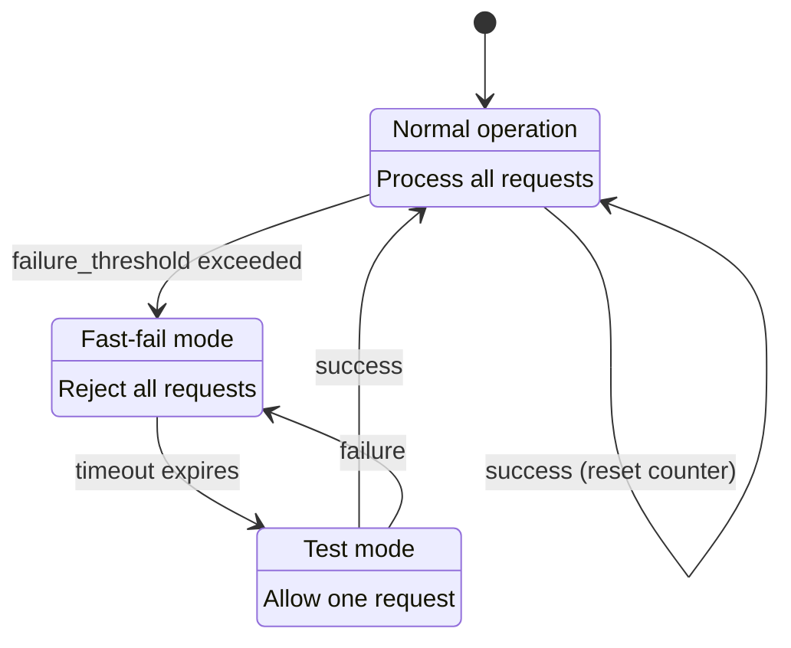
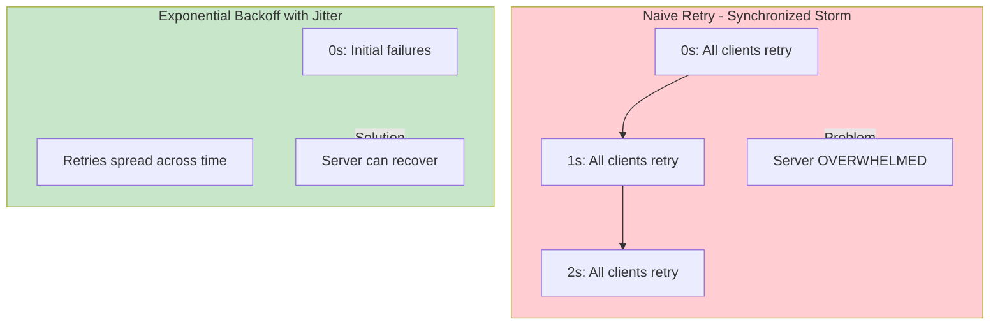
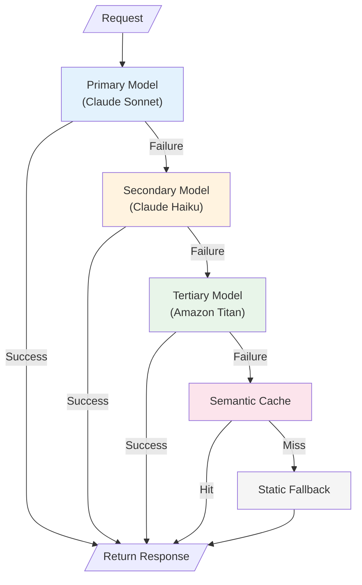
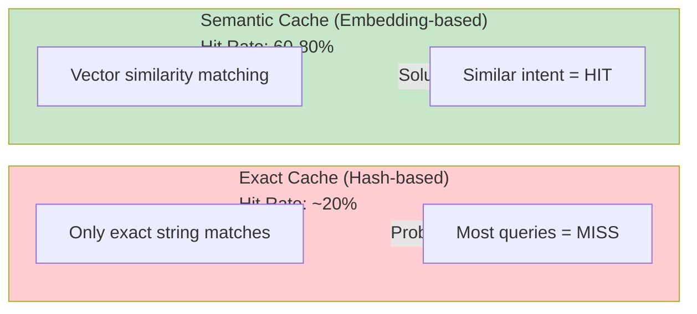
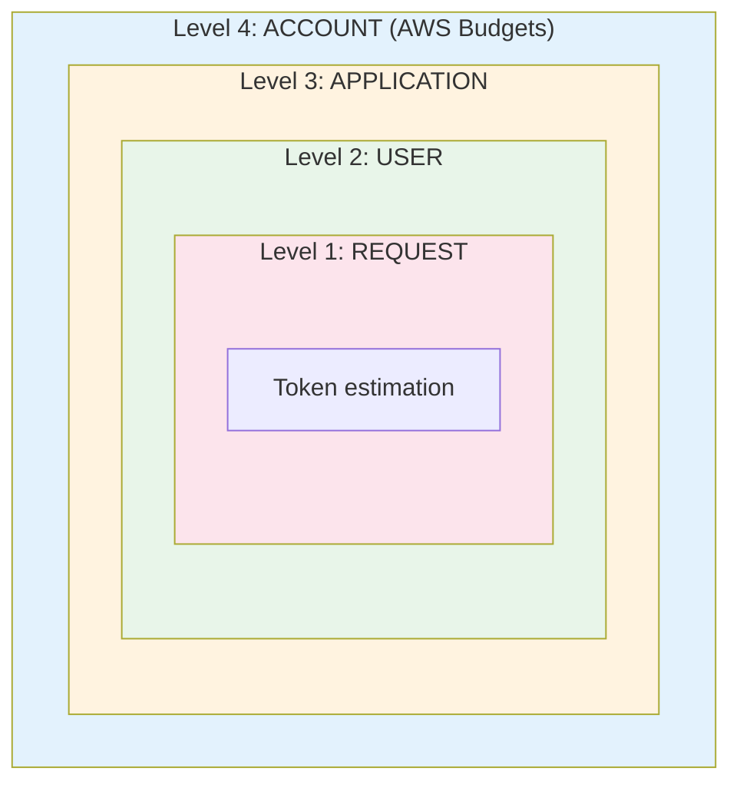
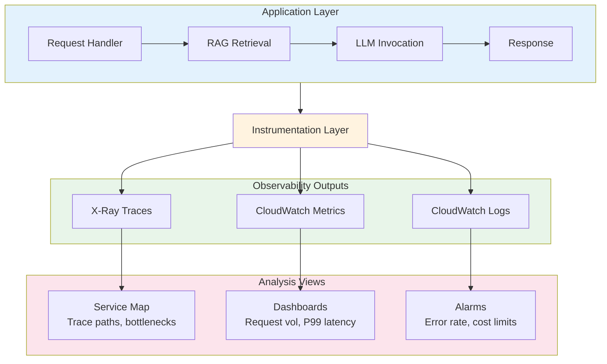
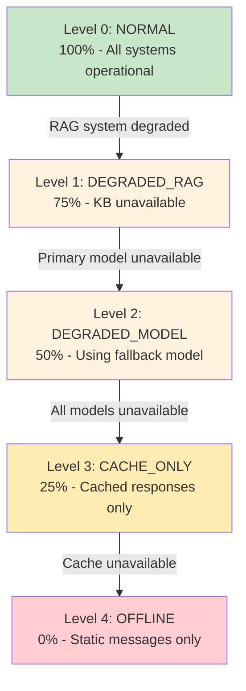
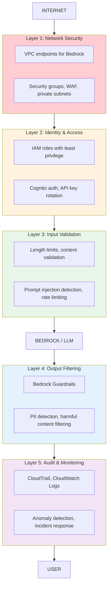

# Production GenAI Patterns Deep Dive

**Domain 2 | Task 2.7 | ~60 minutes**

---

## Why This Matters

Building a GenAI proof-of-concept that impresses stakeholders is surprisingly easy. Building a production system that handles real traffic, fails gracefully, stays within budget, and maintains quality over time? That's where **90% of GenAI projects struggle**.

**The Production Reality**: Most GenAI failures in production aren't model failures—they're **system failures**. Token limits hit unexpectedly, rate limits cause cascading timeouts, costs spiral due to retry storms, and users abandon apps waiting for responses.

```mermaid
flowchart LR
    subgraph PoC["PROOF OF CONCEPT"]
        P1["• Single model call"]
        P2["• No error handling"]
        P3["• Unlimited budget"]
        P4["• One happy path"]
        P5["• Manual testing"]
        P6["• Dev machine only"]
        P7["• Print debugging"]
        P8["• No security"]
    end

    Gap["THE GAP<br/>This section<br/>bridges it"]

    subgraph Prod["PRODUCTION SYSTEM"]
        R1["• Fallback chains"]
        R2["• Circuit breakers"]
        R3["• Token quotas"]
        R4["• Graceful degrade"]
        R5["• Auto quality QA"]
        R6["• Auto-scaling"]
        R7["• Distributed trace"]
        R8["• Defense in depth"]
    end

    PoC --> Gap --> Prod

    style PoC fill:#ffcdd2
    style Gap fill:#fff3e0
    style Prod fill:#c8e6c9
```



This deep dive bridges that gap. We'll explore the patterns that distinguish prototype code from production-grade systems, with specific AWS implementations for each.

---

## Pattern 1: Resilient API Integration

Every interaction with a foundation model is an API call that can fail. Production systems need multiple layers of resilience.

### Circuit Breaker Pattern

When a model endpoint starts failing, continuing to send requests **makes things worse**. Circuit breakers prevent cascade failures by "opening" when failures exceed a threshold.



**Circuit Breaker Implementation**:

```python
import time
from enum import Enum
from dataclasses import dataclass, field
from threading import Lock
from typing import Callable, Any, Optional
import boto3

class CircuitState(Enum):
    CLOSED = "closed"       # Normal operation
    OPEN = "open"           # Failing fast
    HALF_OPEN = "half_open" # Testing recovery

@dataclass
class CircuitBreakerConfig:
    failure_threshold: int = 5          # Failures before opening
    success_threshold: int = 3          # Successes to close from half-open
    timeout_seconds: float = 30.0       # Time before testing recovery
    half_open_max_calls: int = 1        # Concurrent calls in half-open

@dataclass
class CircuitBreakerState:
    state: CircuitState = CircuitState.CLOSED
    failure_count: int = 0
    success_count: int = 0
    last_failure_time: float = 0
    half_open_calls: int = 0
    lock: Lock = field(default_factory=Lock)

class CircuitBreaker:
    """Circuit breaker for resilient API calls."""

    def __init__(self, name: str, config: CircuitBreakerConfig = None):
        self.name = name
        self.config = config or CircuitBreakerConfig()
        self._state = CircuitBreakerState()

    @property
    def state(self) -> CircuitState:
        with self._state.lock:
            if self._state.state == CircuitState.OPEN:
                if self._should_attempt_reset():
                    self._state.state = CircuitState.HALF_OPEN
                    self._state.half_open_calls = 0
            return self._state.state

    def _should_attempt_reset(self) -> bool:
        elapsed = time.time() - self._state.last_failure_time
        return elapsed >= self.config.timeout_seconds

    def call(self, func: Callable, *args, **kwargs) -> Any:
        """Execute function with circuit breaker protection."""

        current_state = self.state

        # Fast-fail if circuit is open
        if current_state == CircuitState.OPEN:
            raise CircuitOpenError(
                f"Circuit '{self.name}' is OPEN. "
                f"Will retry after {self.config.timeout_seconds}s timeout."
            )

        # Limit concurrent calls in half-open state
        if current_state == CircuitState.HALF_OPEN:
            with self._state.lock:
                if self._state.half_open_calls >= self.config.half_open_max_calls:
                    raise CircuitOpenError(
                        f"Circuit '{self.name}' is HALF-OPEN with max test calls."
                    )
                self._state.half_open_calls += 1

        try:
            result = func(*args, **kwargs)
            self._on_success()
            return result
        except Exception as e:
            self._on_failure()
            raise

    def _on_success(self):
        with self._state.lock:
            if self._state.state == CircuitState.HALF_OPEN:
                self._state.success_count += 1
                if self._state.success_count >= self.config.success_threshold:
                    self._state.state = CircuitState.CLOSED
                    self._state.failure_count = 0
                    self._state.success_count = 0
            else:
                # Reset failure count on success in closed state
                self._state.failure_count = 0

    def _on_failure(self):
        with self._state.lock:
            self._state.failure_count += 1
            self._state.last_failure_time = time.time()

            if self._state.state == CircuitState.HALF_OPEN:
                # Any failure in half-open returns to open
                self._state.state = CircuitState.OPEN
                self._state.success_count = 0
            elif self._state.failure_count >= self.config.failure_threshold:
                self._state.state = CircuitState.OPEN


class CircuitOpenError(Exception):
    """Raised when circuit breaker is open."""
    pass


# Usage with Bedrock
bedrock_circuit = CircuitBreaker(
    name='bedrock-sonnet',
    config=CircuitBreakerConfig(
        failure_threshold=3,
        timeout_seconds=60.0
    )
)

def invoke_bedrock_with_circuit_breaker(prompt: str) -> str:
    def _invoke():
        bedrock = boto3.client('bedrock-runtime')
        response = bedrock.invoke_model(
            modelId='anthropic.claude-3-sonnet-20240229-v1:0',
            body=json.dumps({
                'anthropic_version': 'bedrock-2023-05-31',
                'max_tokens': 1024,
                'messages': [{'role': 'user', 'content': prompt}]
            })
        )
        return json.loads(response['body'].read())['content'][0]['text']

    return bedrock_circuit.call(_invoke)
```

### Exponential Backoff with Jitter

Retrying failed requests is essential, but naive retries create **retry storms** that overwhelm both your system and the model endpoint.



**Formula:** `delay = base_delay × (2 ^ attempt) × random(0.5, 1.5)`

| Attempt | Base Delay | Jitter Range | Actual Delay |
|---------|------------|--------------|--------------|
| 1 | 1s | × 0.5-1.5 | 0.5s - 1.5s |
| 2 | 2s | × 0.5-1.5 | 1.0s - 3.0s |
| 3 | 4s | × 0.5-1.5 | 2.0s - 6.0s |
| 4 | 8s | × 0.5-1.5 | 4.0s - 12.0s |

**Implementation with Decorators**:

```python
import time
import random
import functools
from dataclasses import dataclass
from typing import List, Type, Callable

@dataclass
class RetryConfig:
    max_retries: int = 3
    base_delay: float = 1.0
    max_delay: float = 60.0
    exponential_base: float = 2.0
    jitter_range: tuple = (0.5, 1.5)  # Multiplier range

# Retryable exceptions for Bedrock
BEDROCK_RETRYABLE = [
    'ThrottlingException',
    'ServiceUnavailableException',
    'ModelNotReadyException',
    'InternalServerException',
    'ReadTimeoutError'
]

def retry_with_backoff(
    config: RetryConfig = None,
    retryable_exceptions: List[str] = None
) -> Callable:
    """Decorator for exponential backoff with jitter."""

    config = config or RetryConfig()
    retryable = retryable_exceptions or BEDROCK_RETRYABLE

    def decorator(func: Callable) -> Callable:
        @functools.wraps(func)
        def wrapper(*args, **kwargs):
            last_exception = None

            for attempt in range(config.max_retries + 1):
                try:
                    return func(*args, **kwargs)
                except Exception as e:
                    exception_name = type(e).__name__

                    # Check if retryable
                    if not any(r in str(e) or r == exception_name
                              for r in retryable):
                        raise  # Non-retryable, raise immediately

                    last_exception = e

                    if attempt < config.max_retries:
                        # Calculate delay with exponential backoff
                        exponential_delay = (
                            config.base_delay *
                            (config.exponential_base ** attempt)
                        )

                        # Apply jitter
                        jitter = random.uniform(*config.jitter_range)
                        delay = min(
                            exponential_delay * jitter,
                            config.max_delay
                        )

                        print(f"Attempt {attempt + 1} failed: {exception_name}. "
                              f"Retrying in {delay:.2f}s...")
                        time.sleep(delay)

            # All retries exhausted
            raise last_exception

        return wrapper
    return decorator


# Usage
@retry_with_backoff(
    config=RetryConfig(max_retries=3, base_delay=1.0),
    retryable_exceptions=BEDROCK_RETRYABLE
)
def invoke_model_with_retry(prompt: str, model_id: str) -> str:
    """Model invocation with automatic retry."""
    bedrock = boto3.client('bedrock-runtime')

    response = bedrock.invoke_model(
        modelId=model_id,
        body=json.dumps({
            'anthropic_version': 'bedrock-2023-05-31',
            'max_tokens': 1024,
            'messages': [{'role': 'user', 'content': prompt}]
        })
    )

    result = json.loads(response['body'].read())
    return result['content'][0]['text']
```

### Model Fallback Chain

Production systems shouldn't depend on a single model:



**Model Priority Configuration:**

| # | Model | Characteristics |
|---|-------|-----------------|
| 1 | Claude 3 Sonnet | Primary - best quality/cost balance |
| 2 | Claude 3 Haiku | Secondary - faster, cheaper |
| 3 | Amazon Titan | Tertiary - different provider |
| 4 | Semantic Cache | If similar query exists (< 100ms) |
| 5 | Static Fallback | "Service temporarily unavailable" |

```python
from dataclasses import dataclass
from typing import List, Optional, Callable
import boto3
import json

@dataclass
class ModelConfig:
    model_id: str
    name: str
    timeout: int = 30
    max_tokens: int = 1024

class ModelFallbackChain:
    """Execute requests with automatic model fallback."""

    def __init__(self, models: List[ModelConfig]):
        self.models = models
        self.bedrock = boto3.client('bedrock-runtime')
        self.metrics = {model.model_id: {'attempts': 0, 'failures': 0}
                       for model in models}

    def invoke(self, prompt: str, system: str = None) -> dict:
        """Invoke models in priority order until one succeeds."""

        last_error = None

        for model in self.models:
            self.metrics[model.model_id]['attempts'] += 1

            try:
                response = self._invoke_model(prompt, model, system)
                return {
                    'text': response,
                    'model_used': model.name,
                    'model_id': model.model_id,
                    'fallback_used': model != self.models[0]
                }
            except Exception as e:
                self.metrics[model.model_id]['failures'] += 1
                last_error = e
                print(f"Model {model.name} failed: {e}. Trying next...")
                continue

        # All models failed - try cache
        cached = self._check_cache(prompt)
        if cached:
            return {
                'text': cached,
                'model_used': 'cache',
                'model_id': None,
                'fallback_used': True,
                'cached': True
            }

        # Complete failure
        raise ModelChainExhaustedError(
            f"All {len(self.models)} models failed. Last error: {last_error}"
        )

    def _invoke_model(self, prompt: str, model: ModelConfig,
                      system: str = None) -> str:
        """Invoke a specific model."""
        messages = [{'role': 'user', 'content': prompt}]

        body = {
            'anthropic_version': 'bedrock-2023-05-31',
            'max_tokens': model.max_tokens,
            'messages': messages
        }

        if system:
            body['system'] = system

        response = self.bedrock.invoke_model(
            modelId=model.model_id,
            body=json.dumps(body)
        )

        result = json.loads(response['body'].read())
        return result['content'][0]['text']

    def _check_cache(self, prompt: str) -> Optional[str]:
        """Check semantic cache for similar queries."""
        # Implementation depends on your caching strategy
        return None

    def get_health_metrics(self) -> dict:
        """Return health metrics for monitoring."""
        return {
            model_id: {
                'success_rate': 1 - (m['failures'] / max(m['attempts'], 1)),
                **m
            }
            for model_id, m in self.metrics.items()
        }


class ModelChainExhaustedError(Exception):
    """All models in the chain have failed."""
    pass


# Usage
fallback_chain = ModelFallbackChain([
    ModelConfig('anthropic.claude-3-sonnet-20240229-v1:0', 'Sonnet'),
    ModelConfig('anthropic.claude-3-haiku-20240307-v1:0', 'Haiku'),
    ModelConfig('amazon.titan-text-premier-v1:0', 'Titan')
])

result = fallback_chain.invoke("Explain quantum computing")
print(f"Response from {result['model_used']}: {result['text'][:100]}...")
```

---

## Pattern 2: Semantic Caching

LLM calls are expensive and slow. Traditional caching requires exact matches, but semantic caching recognizes when **different prompts have the same intent**.

### Why Semantic Caching?



**Exact Cache Example:**
| Query | Result |
|-------|--------|
| "What's the weather in NYC?" | MISS (first query) |
| "What's the weather in NYC?" | HIT (exact match) |
| "Tell me NYC weather" | MISS (different string) |

**Semantic Cache Example:**
| Query | Result |
|-------|--------|
| "What's the weather in NYC?" | MISS (store + embedding) |
| "Tell me NYC weather" | HIT (similarity: 0.94) |
| "NYC weather?" | HIT (similarity: 0.91) |

**Impact:**
- **Cost savings:** 60-80% reduction in model invocations
- **Latency:** Cache hits < 100ms vs 2-5s model calls
- **Scalability:** Handle 10x traffic without proportional cost

### Implementation with OpenSearch

```python
import boto3
import json
import hashlib
from datetime import datetime, timedelta
from typing import Optional, Tuple
import numpy as np

class SemanticCache:
    """Semantic caching using embeddings and vector similarity."""

    def __init__(self,
                 opensearch_endpoint: str,
                 index_name: str = 'semantic-cache',
                 similarity_threshold: float = 0.92,
                 ttl_hours: int = 24):
        self.bedrock = boto3.client('bedrock-runtime')
        self.opensearch = self._create_opensearch_client(opensearch_endpoint)
        self.index_name = index_name
        self.similarity_threshold = similarity_threshold
        self.ttl_hours = ttl_hours

    async def get_or_invoke(self, prompt: str, model_id: str,
                            invoke_fn: callable) -> dict:
        """Get cached response or invoke model and cache result."""

        # Generate embedding for the prompt
        prompt_embedding = await self._generate_embedding(prompt)

        # Search for similar cached prompts
        cached = await self._search_cache(prompt_embedding, model_id)

        if cached:
            return {
                'response': cached['response'],
                'cached': True,
                'similarity': cached['similarity'],
                'original_prompt': cached['original_prompt']
            }

        # Cache miss - invoke model
        response = await invoke_fn(prompt)

        # Store in cache
        await self._store_in_cache(
            prompt=prompt,
            response=response,
            embedding=prompt_embedding,
            model_id=model_id
        )

        return {
            'response': response,
            'cached': False,
            'similarity': 1.0
        }

    async def _generate_embedding(self, text: str) -> list:
        """Generate embedding using Titan Embeddings."""
        response = self.bedrock.invoke_model(
            modelId='amazon.titan-embed-text-v2:0',
            body=json.dumps({
                'inputText': text,
                'dimensions': 1024,
                'normalize': True
            })
        )
        result = json.loads(response['body'].read())
        return result['embedding']

    async def _search_cache(self, embedding: list,
                            model_id: str) -> Optional[dict]:
        """Search for semantically similar cached prompts."""
        ttl_cutoff = (datetime.utcnow() -
                      timedelta(hours=self.ttl_hours)).isoformat()

        query = {
            'size': 1,
            'query': {
                'script_score': {
                    'query': {
                        'bool': {
                            'must': [
                                {'term': {'model_id': model_id}},
                                {'range': {'timestamp': {'gte': ttl_cutoff}}}
                            ]
                        }
                    },
                    'script': {
                        'source': "cosineSimilarity(params.query_vector, 'embedding') + 1.0",
                        'params': {'query_vector': embedding}
                    }
                }
            }
        }

        response = self.opensearch.search(
            index=self.index_name,
            body=query
        )

        if response['hits']['hits']:
            hit = response['hits']['hits'][0]
            # Score is cosine + 1.0, so convert back to similarity
            similarity = hit['_score'] - 1.0

            if similarity >= self.similarity_threshold:
                return {
                    'response': hit['_source']['response'],
                    'similarity': similarity,
                    'original_prompt': hit['_source']['prompt']
                }

        return None

    async def _store_in_cache(self, prompt: str, response: str,
                              embedding: list, model_id: str):
        """Store prompt-response pair in cache."""
        doc = {
            'prompt': prompt,
            'response': response,
            'embedding': embedding,
            'model_id': model_id,
            'timestamp': datetime.utcnow().isoformat(),
            'prompt_hash': hashlib.sha256(prompt.encode()).hexdigest()
        }

        self.opensearch.index(
            index=self.index_name,
            body=doc
        )


# Simpler exact-match cache with ElastiCache
import redis

class ExactMatchCache:
    """Fast exact-match cache using ElastiCache Redis."""

    def __init__(self, redis_host: str, ttl_seconds: int = 3600):
        self.redis = redis.Redis(host=redis_host, port=6379)
        self.ttl = ttl_seconds

    def get_or_set(self, key: str, compute_fn: callable) -> Tuple[str, bool]:
        """Get cached value or compute and cache."""
        # Create deterministic cache key
        cache_key = f"genai:response:{hashlib.sha256(key.encode()).hexdigest()}"

        # Check cache
        cached = self.redis.get(cache_key)
        if cached:
            return cached.decode('utf-8'), True

        # Compute value
        result = compute_fn()

        # Store in cache
        self.redis.setex(cache_key, self.ttl, result)

        return result, False
```

### Caching Strategy Comparison

| Strategy | Hit Rate | Latency Added | Cost | Best For |
|----------|----------|---------------|------|----------|
| **Exact (Redis)** | Low (20%) | <1ms | Low | Repeated identical queries |
| **Semantic (OpenSearch)** | High (60-80%) | 50-100ms | Medium | Variable phrasing |
| **Prompt caching (Bedrock)** | Medium | Built-in | Included | Repeated system prompts |
| **Edge (CloudFront)** | N/A | Fast | Low | Static content only |
| **Hybrid** | Highest | Variable | Medium | Production systems |

---

## Pattern 3: Token Budget Management

Token costs can spiral without proper guardrails. Production systems need token budget management at multiple levels.

### Token Budget Architecture



**Level Details:**

| Level | Scope | Controls |
|-------|-------|----------|
| **Level 1: Request** | Per-request | Estimate tokens, truncate context, set max_tokens, reject oversized |
| **Level 2: User** | Per-user | Daily/monthly quotas, tiered limits, real-time tracking |
| **Level 3: Application** | Per-app | Total budget, cost allocation, anomaly detection, kill switch |
| **Level 4: Account** | AWS account | AWS Budgets, Service Quotas, Cost Explorer, billing alarms |

### Request-Level Token Budgets

```python
import tiktoken
from dataclasses import dataclass
from typing import Optional

@dataclass
class TokenBudget:
    max_input_tokens: int = 8000
    max_output_tokens: int = 4096
    reserved_tokens: int = 500  # For system prompts, formatting
    context_ratio: float = 0.6  # 60% of remaining budget for context

class TokenBudgetManager:
    """Manage token budgets at request level."""

    def __init__(self, budget: TokenBudget = None):
        self.budget = budget or TokenBudget()
        # Approximate tokenizer (actual may vary by model)
        self.tokenizer = tiktoken.get_encoding("cl100k_base")

    def estimate_tokens(self, text: str) -> int:
        """Estimate token count for text."""
        return len(self.tokenizer.encode(text))

    def prepare_request(self, user_prompt: str, system_prompt: str,
                        context: str = None) -> dict:
        """Prepare request within token budget."""

        system_tokens = self.estimate_tokens(system_prompt)
        user_tokens = self.estimate_tokens(user_prompt)
        reserved = self.budget.reserved_tokens

        # Calculate available budget for context
        used_tokens = system_tokens + user_tokens + reserved
        available_for_context = self.budget.max_input_tokens - used_tokens

        if available_for_context < 0:
            raise TokenBudgetExceededError(
                f"Prompt exceeds budget. System: {system_tokens}, "
                f"User: {user_tokens}, Available: {self.budget.max_input_tokens}"
            )

        # Process context within budget
        processed_context = None
        context_tokens = 0

        if context:
            context_tokens = self.estimate_tokens(context)
            max_context = int(available_for_context * self.budget.context_ratio)

            if context_tokens > max_context:
                # Truncate context to fit
                processed_context = self._truncate_to_tokens(context, max_context)
                context_tokens = max_context
            else:
                processed_context = context

        # Calculate appropriate max_tokens for response
        total_input = system_tokens + user_tokens + context_tokens + reserved
        max_output = min(
            self.budget.max_output_tokens,
            self.budget.max_input_tokens - total_input
        )

        return {
            'system_prompt': system_prompt,
            'user_prompt': user_prompt,
            'context': processed_context,
            'max_tokens': max_output,
            'token_estimate': {
                'system': system_tokens,
                'user': user_tokens,
                'context': context_tokens,
                'reserved': reserved,
                'total_input': total_input,
                'max_output': max_output
            }
        }

    def _truncate_to_tokens(self, text: str, max_tokens: int) -> str:
        """Truncate text to fit within token limit."""
        tokens = self.tokenizer.encode(text)
        if len(tokens) <= max_tokens:
            return text

        # Truncate and decode
        truncated_tokens = tokens[:max_tokens]
        return self.tokenizer.decode(truncated_tokens)


class TokenBudgetExceededError(Exception):
    pass
```

### User-Level Token Quotas

```python
import boto3
from datetime import datetime, date
from decimal import Decimal

dynamodb = boto3.resource('dynamodb')

@dataclass
class UserQuota:
    tier: str
    daily_tokens: int
    monthly_tokens: int

USER_QUOTAS = {
    'free': UserQuota('free', 10_000, 100_000),
    'pro': UserQuota('pro', 100_000, 1_000_000),
    'enterprise': UserQuota('enterprise', 1_000_000, 10_000_000)
}

class UserQuotaManager:
    """Manage per-user token quotas."""

    def __init__(self, table_name: str = 'UserQuotas'):
        self.table = dynamodb.Table(table_name)

    def check_and_consume(self, user_id: str, tier: str,
                          tokens_to_consume: int) -> dict:
        """Check quota and atomically consume tokens if available."""
        quota = USER_QUOTAS.get(tier, USER_QUOTAS['free'])
        today = date.today().isoformat()
        month = today[:7]  # YYYY-MM

        try:
            # Atomic update with condition check
            response = self.table.update_item(
                Key={
                    'pk': f'USER#{user_id}',
                    'sk': f'QUOTA#{today}'
                },
                UpdateExpression='''
                    SET dailyTokens = if_not_exists(dailyTokens, :zero) + :tokens,
                        monthlyTokens = if_not_exists(monthlyTokens, :zero) + :tokens,
                        #month = :month,
                        lastUpdated = :now
                ''',
                ConditionExpression='''
                    (attribute_not_exists(dailyTokens) OR dailyTokens < :daily_limit)
                    AND (attribute_not_exists(monthlyTokens) OR monthlyTokens < :monthly_limit)
                ''',
                ExpressionAttributeNames={
                    '#month': 'month'
                },
                ExpressionAttributeValues={
                    ':tokens': Decimal(str(tokens_to_consume)),
                    ':zero': Decimal('0'),
                    ':daily_limit': Decimal(str(quota.daily_tokens)),
                    ':monthly_limit': Decimal(str(quota.monthly_tokens)),
                    ':month': month,
                    ':now': datetime.utcnow().isoformat()
                },
                ReturnValues='ALL_NEW'
            )

            attrs = response['Attributes']
            return {
                'allowed': True,
                'daily_used': int(attrs['dailyTokens']),
                'daily_remaining': quota.daily_tokens - int(attrs['dailyTokens']),
                'monthly_used': int(attrs['monthlyTokens']),
                'monthly_remaining': quota.monthly_tokens - int(attrs['monthlyTokens'])
            }

        except dynamodb.meta.client.exceptions.ConditionalCheckFailedException:
            # Quota exceeded
            current = self._get_current_usage(user_id, today)
            return {
                'allowed': False,
                'daily_used': current.get('dailyTokens', 0),
                'daily_remaining': 0,
                'monthly_used': current.get('monthlyTokens', 0),
                'monthly_remaining': 0,
                'error': 'Quota exceeded'
            }

    def _get_current_usage(self, user_id: str, date_str: str) -> dict:
        """Get current usage for a user."""
        response = self.table.get_item(
            Key={
                'pk': f'USER#{user_id}',
                'sk': f'QUOTA#{date_str}'
            }
        )
        return response.get('Item', {})

    def get_usage_summary(self, user_id: str, tier: str) -> dict:
        """Get usage summary for user."""
        today = date.today().isoformat()
        current = self._get_current_usage(user_id, today)
        quota = USER_QUOTAS.get(tier, USER_QUOTAS['free'])

        daily_used = int(current.get('dailyTokens', 0))
        monthly_used = int(current.get('monthlyTokens', 0))

        return {
            'tier': tier,
            'daily': {
                'used': daily_used,
                'limit': quota.daily_tokens,
                'remaining': max(0, quota.daily_tokens - daily_used),
                'percentage': (daily_used / quota.daily_tokens) * 100
            },
            'monthly': {
                'used': monthly_used,
                'limit': quota.monthly_tokens,
                'remaining': max(0, quota.monthly_tokens - monthly_used),
                'percentage': (monthly_used / quota.monthly_tokens) * 100
            }
        }
```

---

## Pattern 4: Streaming for User Experience

Users perceive streaming responses as **significantly faster**, even when total time is similar. Production apps should always stream long-form responses.

```mermaid
gantt
    title Response Timeline Comparison
    dateFormat X
    axisFormat %s

    section Buffered
    Waiting (blank screen)    :0, 5
    Response arrives          :5, 5

    section Streaming
    First token (200ms)       :0, 0.2
    25% complete              :0.2, 1.5
    50% complete              :1.5, 3
    75% complete              :3, 4
    100% complete             :4, 5
```



**Buffered Response:**
- User sees blank screen for 5 seconds
- User thinks: "Is it broken?" - abandons after 2-3 seconds

**Streaming Response:**
- First token appears at ~200ms
- Words appear in real-time like human typing
- User stays engaged throughout

**Key Metrics:**
| Metric | Improvement |
|--------|-------------|
| Time to first token | ~200ms (vs 5000ms buffered) |
| User engagement | +40% completion rate |
| Perceived speed | Users rate streaming 3x faster |

### Full Streaming Implementation

```python
import boto3
import json
from typing import Generator, AsyncGenerator
import asyncio

class StreamingHandler:
    """Handle streaming responses from Bedrock."""

    def __init__(self):
        self.bedrock = boto3.client('bedrock-runtime')

    def stream_response(self, prompt: str,
                        model_id: str = 'anthropic.claude-3-sonnet-20240229-v1:0'
                       ) -> Generator[dict, None, None]:
        """Stream response chunks with metadata."""

        response = self.bedrock.invoke_model_with_response_stream(
            modelId=model_id,
            body=json.dumps({
                'anthropic_version': 'bedrock-2023-05-31',
                'max_tokens': 4096,
                'messages': [{'role': 'user', 'content': prompt}]
            })
        )

        input_tokens = 0
        output_tokens = 0

        for event in response['body']:
            chunk = event.get('chunk')
            if not chunk:
                continue

            chunk_data = json.loads(chunk['bytes'])
            event_type = chunk_data.get('type')

            if event_type == 'message_start':
                input_tokens = chunk_data.get('message', {}).get(
                    'usage', {}).get('input_tokens', 0)
                yield {
                    'type': 'start',
                    'input_tokens': input_tokens
                }

            elif event_type == 'content_block_delta':
                text = chunk_data.get('delta', {}).get('text', '')
                if text:
                    yield {
                        'type': 'text',
                        'text': text
                    }

            elif event_type == 'message_delta':
                output_tokens = chunk_data.get('usage', {}).get(
                    'output_tokens', 0)
                yield {
                    'type': 'usage',
                    'output_tokens': output_tokens
                }

            elif event_type == 'message_stop':
                yield {
                    'type': 'end',
                    'input_tokens': input_tokens,
                    'output_tokens': output_tokens,
                    'total_tokens': input_tokens + output_tokens
                }


# FastAPI SSE endpoint
from fastapi import FastAPI, Request
from fastapi.responses import StreamingResponse
from sse_starlette.sse import EventSourceResponse

app = FastAPI()

@app.post("/api/chat")
async def chat_endpoint(request: Request):
    body = await request.json()
    prompt = body.get('prompt')

    async def generate():
        handler = StreamingHandler()
        for chunk in handler.stream_response(prompt):
            if chunk['type'] == 'text':
                yield {
                    'event': 'message',
                    'data': json.dumps({'text': chunk['text']})
                }
            elif chunk['type'] == 'end':
                yield {
                    'event': 'done',
                    'data': json.dumps({
                        'tokens': chunk['total_tokens']
                    })
                }

    return EventSourceResponse(generate())


# Express.js equivalent
'''
app.post('/api/chat', async (req, res) => {
  res.setHeader('Content-Type', 'text/event-stream');
  res.setHeader('Cache-Control', 'no-cache');
  res.setHeader('Connection', 'keep-alive');

  const { prompt } = req.body;

  const response = await bedrock.invokeModelWithResponseStream({
    modelId: 'anthropic.claude-3-sonnet-20240229-v1:0',
    body: JSON.stringify({
      anthropic_version: 'bedrock-2023-05-31',
      max_tokens: 4096,
      messages: [{ role: 'user', content: prompt }]
    })
  });

  for await (const event of response.body) {
    const chunk = JSON.parse(event.chunk.bytes);
    if (chunk.type === 'content_block_delta') {
      res.write(`data: ${JSON.stringify({ text: chunk.delta.text })}\n\n`);
    }
  }

  res.write('data: [DONE]\n\n');
  res.end();
});
'''
```

---

## Pattern 5: Observability Stack

You can't improve what you can't measure. Production GenAI systems need comprehensive observability.

### GenAI Observability Architecture



**Instrumentation Captures:**
| Source | Data Collected |
|--------|----------------|
| X-Ray traces | Distributed request tracing |
| CloudWatch metrics | Latency, tokens, errors, costs |
| CloudWatch Logs | Prompts, responses, quality scores |
| Custom dimensions | User, model, feature segmentation |

### Comprehensive Metrics Implementation

```python
import boto3
import time
from dataclasses import dataclass, field
from typing import Optional
from contextlib import contextmanager

cloudwatch = boto3.client('cloudwatch')

@dataclass
class GenAIMetrics:
    """Metrics for a single GenAI request."""
    request_id: str
    model_id: str
    feature: str = 'default'
    user_id: Optional[str] = None

    # Timing
    start_time: float = field(default_factory=time.time)
    embedding_time_ms: float = 0
    retrieval_time_ms: float = 0
    llm_time_ms: float = 0
    total_time_ms: float = 0

    # Tokens
    input_tokens: int = 0
    output_tokens: int = 0
    context_tokens: int = 0

    # Quality
    cache_hit: bool = False
    retrieval_count: int = 0
    retrieval_score: float = 0
    guardrail_triggered: bool = False
    user_rating: Optional[int] = None

    # Status
    success: bool = True
    error_type: Optional[str] = None


class MetricsCollector:
    """Collect and publish GenAI metrics to CloudWatch."""

    NAMESPACE = 'GenAI/Production'

    def __init__(self, application: str):
        self.application = application

    @contextmanager
    def track_request(self, request_id: str, model_id: str,
                      feature: str = 'default', user_id: str = None):
        """Context manager for tracking a complete request."""
        metrics = GenAIMetrics(
            request_id=request_id,
            model_id=model_id,
            feature=feature,
            user_id=user_id
        )

        try:
            yield metrics
            metrics.success = True
        except Exception as e:
            metrics.success = False
            metrics.error_type = type(e).__name__
            raise
        finally:
            metrics.total_time_ms = (time.time() - metrics.start_time) * 1000
            self._publish_metrics(metrics)

    @contextmanager
    def track_phase(self, metrics: GenAIMetrics, phase: str):
        """Track timing for a specific phase."""
        start = time.time()
        try:
            yield
        finally:
            elapsed_ms = (time.time() - start) * 1000
            setattr(metrics, f'{phase}_time_ms', elapsed_ms)

    def _publish_metrics(self, metrics: GenAIMetrics):
        """Publish metrics to CloudWatch."""
        dimensions = [
            {'Name': 'Application', 'Value': self.application},
            {'Name': 'ModelId', 'Value': metrics.model_id},
            {'Name': 'Feature', 'Value': metrics.feature}
        ]

        metric_data = [
            # Latency metrics
            {
                'MetricName': 'RequestLatency',
                'Dimensions': dimensions,
                'Value': metrics.total_time_ms,
                'Unit': 'Milliseconds'
            },
            {
                'MetricName': 'LLMLatency',
                'Dimensions': dimensions,
                'Value': metrics.llm_time_ms,
                'Unit': 'Milliseconds'
            },

            # Token metrics
            {
                'MetricName': 'InputTokens',
                'Dimensions': dimensions,
                'Value': metrics.input_tokens,
                'Unit': 'Count'
            },
            {
                'MetricName': 'OutputTokens',
                'Dimensions': dimensions,
                'Value': metrics.output_tokens,
                'Unit': 'Count'
            },
            {
                'MetricName': 'TotalTokens',
                'Dimensions': dimensions,
                'Value': metrics.input_tokens + metrics.output_tokens,
                'Unit': 'Count'
            },

            # Cost metrics (estimated)
            {
                'MetricName': 'EstimatedCostCents',
                'Dimensions': dimensions,
                'Value': self._estimate_cost(metrics),
                'Unit': 'None'
            },

            # Quality metrics
            {
                'MetricName': 'CacheHit',
                'Dimensions': dimensions,
                'Value': 1 if metrics.cache_hit else 0,
                'Unit': 'Count'
            },
            {
                'MetricName': 'Success',
                'Dimensions': dimensions,
                'Value': 1 if metrics.success else 0,
                'Unit': 'Count'
            }
        ]

        # Add error metric if failed
        if not metrics.success:
            metric_data.append({
                'MetricName': 'Errors',
                'Dimensions': dimensions + [
                    {'Name': 'ErrorType', 'Value': metrics.error_type or 'Unknown'}
                ],
                'Value': 1,
                'Unit': 'Count'
            })

        cloudwatch.put_metric_data(
            Namespace=self.NAMESPACE,
            MetricData=metric_data
        )

    def _estimate_cost(self, metrics: GenAIMetrics) -> float:
        """Estimate cost in cents based on token usage."""
        # Pricing per 1K tokens (approximate, varies by model)
        pricing = {
            'anthropic.claude-3-sonnet': {'input': 0.3, 'output': 1.5},
            'anthropic.claude-3-haiku': {'input': 0.025, 'output': 0.125},
            'amazon.titan-text': {'input': 0.05, 'output': 0.1}
        }

        # Find matching pricing
        model_pricing = None
        for model_prefix, prices in pricing.items():
            if metrics.model_id.startswith(model_prefix):
                model_pricing = prices
                break

        if not model_pricing:
            return 0

        input_cost = (metrics.input_tokens / 1000) * model_pricing['input']
        output_cost = (metrics.output_tokens / 1000) * model_pricing['output']

        return (input_cost + output_cost) * 100  # Convert to cents


# Usage example
collector = MetricsCollector(application='customer-support-bot')

async def handle_request(prompt: str, user_id: str):
    request_id = str(uuid.uuid4())

    with collector.track_request(
        request_id=request_id,
        model_id='anthropic.claude-3-sonnet-20240229-v1:0',
        feature='chat',
        user_id=user_id
    ) as metrics:

        # Track embedding phase
        with collector.track_phase(metrics, 'embedding'):
            embedding = generate_embedding(prompt)

        # Track retrieval phase
        with collector.track_phase(metrics, 'retrieval'):
            context = search_knowledge_base(embedding)
            metrics.retrieval_count = len(context)
            metrics.retrieval_score = context[0]['score'] if context else 0

        # Track LLM phase
        with collector.track_phase(metrics, 'llm'):
            response = invoke_model(prompt, context)
            metrics.input_tokens = response['usage']['input_tokens']
            metrics.output_tokens = response['usage']['output_tokens']

        return response
```

### X-Ray Distributed Tracing

```python
from aws_xray_sdk.core import xray_recorder, patch_all
from aws_xray_sdk.core import xray_recorder

# Patch AWS SDK calls automatically
patch_all()

class TracedGenAIPipeline:
    """GenAI pipeline with full X-Ray tracing."""

    @xray_recorder.capture('HandleRequest')
    def handle_request(self, prompt: str, user_id: str) -> dict:
        """Traced end-to-end request handling."""

        # Add annotations for filtering
        segment = xray_recorder.current_segment()
        segment.put_annotation('user_id', user_id)
        segment.put_annotation('prompt_length', len(prompt))

        # Check cache
        with xray_recorder.in_subsegment('CheckCache') as subseg:
            cached = self._check_cache(prompt)
            subseg.put_annotation('cache_hit', cached is not None)
            if cached:
                return cached

        # Generate embedding
        with xray_recorder.in_subsegment('GenerateEmbedding') as subseg:
            start = time.time()
            embedding = self._generate_embedding(prompt)
            subseg.put_annotation('embedding_time_ms',
                                 int((time.time() - start) * 1000))

        # Search knowledge base
        with xray_recorder.in_subsegment('SearchKnowledgeBase') as subseg:
            start = time.time()
            results = self._search_knowledge_base(embedding)
            subseg.put_annotation('result_count', len(results))
            subseg.put_annotation('search_time_ms',
                                 int((time.time() - start) * 1000))
            subseg.put_metadata('top_scores',
                               [r['score'] for r in results[:3]])

        # Invoke model
        with xray_recorder.in_subsegment('InvokeModel') as subseg:
            start = time.time()
            response = self._invoke_model(prompt, results)
            subseg.put_annotation('model', 'claude-3-sonnet')
            subseg.put_annotation('invoke_time_ms',
                                 int((time.time() - start) * 1000))
            subseg.put_metadata('input_tokens',
                               response.get('usage', {}).get('input_tokens'))
            subseg.put_metadata('output_tokens',
                               response.get('usage', {}).get('output_tokens'))

        # Store in cache
        with xray_recorder.in_subsegment('StoreCache'):
            self._store_cache(prompt, response)

        return response
```

---

## Pattern 6: Graceful Degradation

When systems fail—and they will—production apps should degrade gracefully rather than crash.

### Degradation Levels



**Degradation Level Details:**

| Level | Status | Features | Latency |
|-------|--------|----------|---------|
| **0: NORMAL** | All operational | Full RAG + streaming + citations | < 3s |
| **1: DEGRADED_RAG** | KB unavailable | Direct model (no retrieval) | < 2s |
| **2: DEGRADED_MODEL** | Using fallback | Basic responses + streaming | < 1s |
| **3: CACHE_ONLY** | Models unavailable | Semantic cache lookup only | < 100ms |
| **4: OFFLINE** | Complete failure | Static fallback messages | immediate |

### Implementation

```python
from enum import Enum
from dataclasses import dataclass
from typing import Optional, Callable
import asyncio

class DegradationLevel(Enum):
    NORMAL = 0
    DEGRADED_RAG = 1
    DEGRADED_MODEL = 2
    CACHE_ONLY = 3
    OFFLINE = 4

@dataclass
class DegradedResponse:
    response: str
    level: DegradationLevel
    notice: Optional[str] = None
    cached: bool = False

class GracefulDegradationHandler:
    """Handle requests with graceful degradation."""

    NOTICES = {
        DegradationLevel.NORMAL: None,
        DegradationLevel.DEGRADED_RAG:
            "Response generated without knowledge base context.",
        DegradationLevel.DEGRADED_MODEL:
            "Using backup model. Quality may vary.",
        DegradationLevel.CACHE_ONLY:
            "Showing a similar previous response.",
        DegradationLevel.OFFLINE:
            "Service temporarily unavailable. Please try again later."
    }

    FALLBACK_MESSAGE = (
        "I apologize, but I'm unable to process your request at the moment. "
        "Please try again in a few minutes, or contact support if the issue persists."
    )

    def __init__(self):
        self.rag_handler = RAGHandler()
        self.model_handler = ModelHandler()
        self.cache_handler = CacheHandler()

    async def handle_query(self, query: str,
                          user_id: str = None) -> DegradedResponse:
        """Handle query with automatic degradation."""

        # Level 0: Try full RAG pipeline
        try:
            response = await self._full_rag_response(query, user_id)
            return DegradedResponse(
                response=response,
                level=DegradationLevel.NORMAL
            )
        except RAGUnavailableError:
            pass  # Fall through to next level
        except Exception as e:
            # Log but continue to degradation
            print(f"Full RAG failed: {e}")

        # Level 1: Try direct model (no RAG)
        try:
            response = await self._direct_model_response(query)
            return DegradedResponse(
                response=response,
                level=DegradationLevel.DEGRADED_RAG,
                notice=self.NOTICES[DegradationLevel.DEGRADED_RAG]
            )
        except ModelUnavailableError:
            pass
        except Exception as e:
            print(f"Direct model failed: {e}")

        # Level 2: Try fallback model
        try:
            response = await self._fallback_model_response(query)
            return DegradedResponse(
                response=response,
                level=DegradationLevel.DEGRADED_MODEL,
                notice=self.NOTICES[DegradationLevel.DEGRADED_MODEL]
            )
        except Exception as e:
            print(f"Fallback model failed: {e}")

        # Level 3: Try semantic cache
        try:
            cached = await self._semantic_cache_response(query)
            if cached:
                return DegradedResponse(
                    response=cached,
                    level=DegradationLevel.CACHE_ONLY,
                    notice=self.NOTICES[DegradationLevel.CACHE_ONLY],
                    cached=True
                )
        except Exception as e:
            print(f"Cache lookup failed: {e}")

        # Level 4: Complete offline
        return DegradedResponse(
            response=self.FALLBACK_MESSAGE,
            level=DegradationLevel.OFFLINE,
            notice=self.NOTICES[DegradationLevel.OFFLINE]
        )

    async def _full_rag_response(self, query: str, user_id: str) -> str:
        """Full RAG pipeline with retrieval."""
        embedding = await self.rag_handler.generate_embedding(query)
        context = await self.rag_handler.retrieve(embedding)
        return await self.model_handler.invoke_primary(query, context)

    async def _direct_model_response(self, query: str) -> str:
        """Direct model call without RAG."""
        return await self.model_handler.invoke_primary(query, context=None)

    async def _fallback_model_response(self, query: str) -> str:
        """Use fallback (simpler/cheaper) model."""
        return await self.model_handler.invoke_fallback(query)

    async def _semantic_cache_response(self, query: str) -> Optional[str]:
        """Search semantic cache for similar queries."""
        return await self.cache_handler.semantic_search(query)


# Usage in API endpoint
handler = GracefulDegradationHandler()

@app.post("/api/query")
async def query_endpoint(request: QueryRequest):
    result = await handler.handle_query(
        query=request.query,
        user_id=request.user_id
    )

    response = {
        'response': result.response,
        'status': result.level.name
    }

    if result.notice:
        response['notice'] = result.notice

    if result.cached:
        response['cached'] = True

    return response
```

---

## Pattern 7: Security in Production

Production GenAI systems face unique security challenges including prompt injection, data leakage, and misuse.

### Security Layers



**Security Layer Details:**

| Layer | Purpose | Key Controls |
|-------|---------|--------------|
| **1: Network** | Perimeter defense | VPC endpoints, security groups, WAF, private subnets |
| **2: Identity** | Access control | IAM least privilege, Cognito, API key rotation |
| **3: Input** | Request validation | Length limits, prompt injection detection, rate limiting |
| **4: Output** | Response safety | Guardrails, PII redaction, harmful content filtering |
| **5: Audit** | Visibility | CloudTrail, CloudWatch Logs, anomaly detection |

### Input Validation Pipeline

```python
import re
import boto3
from dataclasses import dataclass
from typing import List, Optional

comprehend = boto3.client('comprehend')
bedrock = boto3.client('bedrock-runtime')

@dataclass
class ValidationResult:
    valid: bool
    sanitized_input: Optional[str] = None
    reason: Optional[str] = None
    risk_level: str = 'low'

class InputValidator:
    """Comprehensive input validation for GenAI applications."""

    # Common prompt injection patterns
    INJECTION_PATTERNS = [
        r'ignore\s+(all\s+)?previous\s+instructions',
        r'disregard\s+(all\s+)?prior\s+instructions',
        r'forget\s+(everything|all)',
        r'you\s+are\s+now\s+',
        r'new\s+instructions:',
        r'system\s*:\s*you\s+are',
        r'\[\s*INST\s*\]',
        r'<\|im_start\|>',
        r'```system',
        r'<!--.*?-->',  # HTML comments
        r'<script.*?>',  # Script injection
    ]

    MAX_LENGTH = 10000

    def __init__(self, guardrail_id: str):
        self.guardrail_id = guardrail_id
        self.injection_regex = re.compile(
            '|'.join(self.INJECTION_PATTERNS),
            re.IGNORECASE | re.DOTALL
        )

    async def validate(self, user_input: str) -> ValidationResult:
        """Run full validation pipeline."""

        # Step 1: Length check
        if len(user_input) > self.MAX_LENGTH:
            return ValidationResult(
                valid=False,
                reason=f'Input exceeds maximum length ({self.MAX_LENGTH} chars)',
                risk_level='medium'
            )

        # Step 2: Injection pattern detection
        if self.injection_regex.search(user_input):
            return ValidationResult(
                valid=False,
                reason='Potentially malicious input detected',
                risk_level='high'
            )

        # Step 3: PII detection
        pii_result = await self._detect_pii(user_input)
        sanitized = user_input
        if pii_result['contains_sensitive_pii']:
            sanitized = self._redact_pii(user_input, pii_result['entities'])

        # Step 4: Guardrail check
        guardrail_result = await self._check_guardrail(sanitized)
        if guardrail_result['blocked']:
            return ValidationResult(
                valid=False,
                reason=guardrail_result['reason'],
                risk_level='high'
            )

        return ValidationResult(
            valid=True,
            sanitized_input=sanitized,
            risk_level='low'
        )

    async def _detect_pii(self, text: str) -> dict:
        """Detect PII using Comprehend."""
        response = comprehend.detect_pii_entities(
            Text=text,
            LanguageCode='en'
        )

        sensitive_types = [
            'SSN', 'CREDIT_DEBIT_NUMBER', 'BANK_ACCOUNT_NUMBER',
            'DRIVER_ID', 'PASSPORT_NUMBER'
        ]

        entities = response.get('Entities', [])
        contains_sensitive = any(
            e['Type'] in sensitive_types
            for e in entities
        )

        return {
            'entities': entities,
            'contains_sensitive_pii': contains_sensitive
        }

    def _redact_pii(self, text: str, entities: List[dict]) -> str:
        """Redact PII from text."""
        # Sort by offset (descending) to preserve positions
        sorted_entities = sorted(
            entities,
            key=lambda e: e['BeginOffset'],
            reverse=True
        )

        result = text
        for entity in sorted_entities:
            start = entity['BeginOffset']
            end = entity['EndOffset']
            pii_type = entity['Type']
            result = result[:start] + f'[{pii_type}]' + result[end:]

        return result

    async def _check_guardrail(self, text: str) -> dict:
        """Check text against Bedrock Guardrail."""
        response = bedrock.apply_guardrail(
            guardrailIdentifier=self.guardrail_id,
            guardrailVersion='DRAFT',
            source='INPUT',
            content=[{
                'text': {'text': text}
            }]
        )

        action = response.get('action', 'NONE')

        if action == 'GUARDRAIL_INTERVENED':
            outputs = response.get('outputs', [])
            reason = outputs[0].get('text', 'Content policy violation') if outputs else 'Content policy violation'
            return {'blocked': True, 'reason': reason}

        return {'blocked': False}
```

---

## Production Deployment Checklist

| Category | Checkpoint | AWS Service | Priority |
|----------|------------|-------------|----------|
| **Resilience** | Circuit breakers implemented | Custom / Step Functions | P0 |
| **Resilience** | Exponential backoff with jitter | SDK config / Custom | P0 |
| **Resilience** | Model fallback chain | Custom routing | P0 |
| **Resilience** | Graceful degradation levels | Custom | P1 |
| **Performance** | Streaming enabled | Bedrock ResponseStream | P0 |
| **Performance** | Semantic caching | OpenSearch / ElastiCache | P1 |
| **Performance** | Token budgets | Custom | P1 |
| **Security** | VPC endpoints | VPC / PrivateLink | P0 |
| **Security** | Input validation | Comprehend + Custom | P0 |
| **Security** | Output filtering | Guardrails | P0 |
| **Security** | IAM least privilege | IAM | P0 |
| **Observability** | Custom CloudWatch metrics | CloudWatch | P0 |
| **Observability** | X-Ray tracing | X-Ray | P1 |
| **Observability** | Alerting thresholds | CloudWatch Alarms | P0 |
| **Cost** | Per-user quotas | DynamoDB + Custom | P1 |
| **Cost** | Anomaly detection | Cost Explorer | P1 |
| **Cost** | Budget alerts | AWS Budgets | P0 |

---

## Exam Tips

| Scenario | Solution |
|----------|----------|
| "502 errors during peak load" | Caching + rate limiting + circuit breakers |
| "Users complain about slow responses" | Streaming + model cascading |
| "Prevent single user consuming all resources" | Token quotas + rate limiting |
| "Cost-effective handling of repeated queries" | Semantic caching with OpenSearch |
| "Graceful handling of model failures" | Fallback chain + degradation levels |
| "Prevent prompt injection" | Input validation + Guardrails |
| "Track request paths through system" | X-Ray distributed tracing |
| "Alert on cost anomalies" | CloudWatch + AWS Budgets |

---

## Key Takeaways

> **1. Resilience is non-negotiable.**
> Implement circuit breakers, retries with jitter, and fallback chains from day one. Single-model dependency is a production anti-pattern.

> **2. Cache aggressively.**
> Semantic caching dramatically reduces costs and latency for similar queries. Combine exact-match (Redis) with semantic (OpenSearch) for best results.

> **3. Observe everything.**
> You can't debug production without comprehensive metrics and X-Ray traces. Instrument latency, tokens, costs, and quality from the start.

> **4. Degrade gracefully.**
> Every feature should have a fallback path. Plan for failure modes explicitly with defined degradation levels.

> **5. Secure at every layer.**
> Network, identity, input validation, and output filtering—defense in depth. Prompt injection is a real threat.

> **6. Budget defensively.**
> Token costs can spiral. Implement per-user quotas and cost monitoring early. Set alerts before you need them.

---

## Common Mistakes

| Mistake | Why It Matters |
|---------|----------------|
| **No circuit breakers** | Failed services get hammered with retries, slowing recovery and increasing costs |
| **Missing retry jitter** | Synchronized retries create traffic spikes that overwhelm recovering services |
| **Single model dependency** | Complete outage when that model has issues; no fallback path |
| **No token budgets** | Costs spiral from runaway prompts, long contexts, or malicious users |
| **Skipping streaming** | Users perceive multi-second waits as broken; abandonment increases |
| **Missing observability** | Can't debug production issues; problems discovered by users not monitoring |
| **No graceful degradation** | Complete failure vs partial functionality; users get errors instead of fallbacks |
| **Ignoring security layers** | Prompt injection, data leakage, and misuse go undetected |
