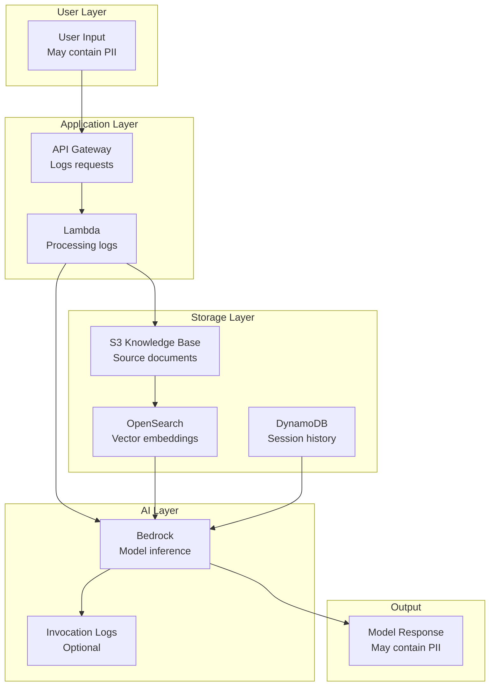
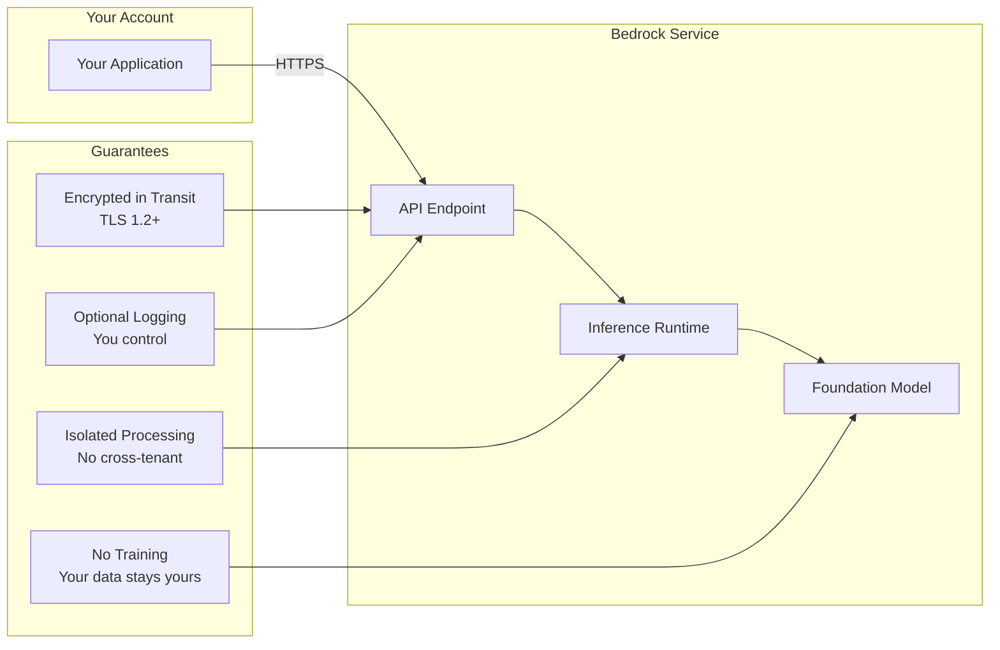
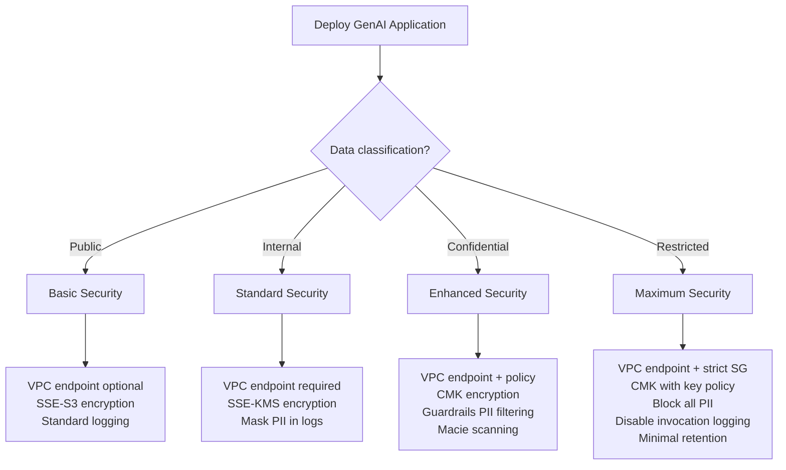

# Data Security and Privacy for GenAI

**Domain 3 | Task 3.2 | ~35 minutes**

---

## Why This Matters

GenAI applications are data-hungry by design. They process customer conversations, analyze business documents, and generate responses that might include sensitive information. A single misconfiguration can expose customer PII to unauthorized users, leak proprietary data to model providers, or create compliance violations that result in significant fines.

The stakes are high because the attack surface is large. Data flows through multiple systems: user inputs travel to preprocessing services, context documents are retrieved from knowledge bases, model responses are logged for analysis. At every step, sensitive data could be exposed, leaked, or mishandled. Traditional application security wasn't designed for these patterns.

Understanding data security for GenAI means knowing where sensitive data lives, how to protect it in transit and at rest, and how to minimize exposure throughout the pipeline. It means understanding what AWS guarantees about data handling and what additional controls you need to implement. Get this right and you can deploy GenAI with confidence. Get it wrong and you're one audit away from serious trouble.

---

## Under the Hood: Where Data Lives in GenAI Systems

Understanding the data flow helps you identify where to apply security controls.

### The GenAI Data Flow

A typical RAG application has sensitive data at multiple points:



### Where Sensitive Data Can Leak

| Location | What's Exposed | Risk | Mitigation |
|----------|---------------|------|------------|
| **API Gateway logs** | User queries, responses | Medium | Disable/mask logging |
| **Lambda logs** | Full request/response | High | Comprehend pre-processing |
| **S3 source docs** | Original documents | High | Macie scanning, encryption |
| **Vector store** | Embeddings + metadata | Medium | Encryption, access control |
| **Session history** | Conversation context | Medium | TTL, encryption |
| **Model invocation logs** | Prompts + completions | High | Optional, encrypted, restricted |

### Bedrock's Data Guarantees

When you call Bedrock, your data is protected by several guarantees:



**Key points:**
- Your prompts/responses are NOT used to train foundation models
- Data is encrypted in transit (TLS) and at rest
- Your data is logically isolated from other customers
- You control whether invocation logs are stored

---

## Decision Framework: Security by Data Sensitivity

Different data requires different security controls. Match controls to sensitivity.

### Quick Reference

| Data Sensitivity | Network | Encryption | PII Handling | Logging | Retention |
|------------------|---------|------------|--------------|---------|-----------|
| **Public** (FAQs, docs) | VPC endpoint optional | SSE-S3 | Not needed | Standard | Normal |
| **Internal** (policies) | VPC endpoint | SSE-KMS | Mask in logs | Redacted | 1 year |
| **Confidential** (customer data) | VPC endpoint + endpoint policy | SSE-KMS CMK | Block high-risk, mask other | Minimal | Per policy |
| **Restricted** (PII, financial) | VPC endpoint + strict SG | SSE-KMS CMK | Block all PII | Disabled | Minimal |

### Decision Tree



### Control Selection by Compliance Requirement

| Requirement | Required Controls |
|-------------|------------------|
| **HIPAA** | VPC endpoints, CMK encryption, BAA, audit logging, access controls |
| **PCI-DSS** | VPC endpoints, CMK encryption, PII blocking, strict access, audit trail |
| **GDPR** | PII handling policy, data retention limits, right to deletion, consent tracking |
| **SOC 2** | Access controls, audit logging, change management, encryption |
| **Internal only** | VPC endpoints recommended, SSE-KMS, standard logging |

### Trade-off Analysis

| Control | Security Benefit | Operational Cost | Performance Impact |
|---------|-----------------|------------------|-------------------|
| VPC endpoints | High (no public internet) | Low (one-time setup) | None |
| CMK encryption | High (you control keys) | Medium (key management) | Minimal |
| Guardrails PII | High (runtime protection) | Low | +100-200ms latency |
| Comprehend pre-process | Medium (early detection) | Medium | +50-100ms |
| Macie scanning | High (discovery) | Medium (scheduled jobs) | None (async) |
| Disable logging | High (no data retention) | Low | None |
| Endpoint policies | Medium (additional layer) | Low | None |

### What to Implement First

**Priority order for new deployments:**

1. **VPC endpoints** - Immediate, high impact, low effort
2. **SSE-KMS encryption** - Required for any sensitive data
3. **IAM least privilege** - Limit blast radius of any breach
4. **Guardrails PII filtering** - Runtime protection
5. **Macie scanning** - Discover what's in your data
6. **Invocation log controls** - Decide what to retain
7. **Endpoint policies** - Additional defense layer

---

## Network Isolation: Keeping Traffic Private

Production GenAI workloads should never traverse the public internet. Every API call to Bedrock or SageMaker that travels over the public internet is an opportunity for interception, a potential compliance violation, and an unnecessary risk. VPC endpoints solve this by creating private connections between your VPC and AWS services.

### VPC Endpoints for Bedrock

When you create an interface VPC endpoint for Bedrock, traffic between your application and Bedrock stays entirely within the AWS network. No internet gateway required. No NAT gateway. No public IP addresses on your compute resources. The connection is private by design.

```typescript
// CDK example: Creating VPC endpoint for Bedrock
const bedrockEndpoint = new ec2.InterfaceVpcEndpoint(this, 'BedrockEndpoint', {
  vpc: vpc,
  service: ec2.InterfaceVpcEndpointAwsService.BEDROCK_RUNTIME,
  subnets: { subnetType: ec2.SubnetType.PRIVATE_ISOLATED },
  securityGroups: [bedrockSecurityGroup],
  privateDnsEnabled: true
});

// Also create endpoint for Bedrock Agent Runtime if using agents
const bedrockAgentEndpoint = new ec2.InterfaceVpcEndpoint(this, 'BedrockAgentEndpoint', {
  vpc: vpc,
  service: ec2.InterfaceVpcEndpointAwsService.BEDROCK_AGENT_RUNTIME,
  subnets: { subnetType: ec2.SubnetType.PRIVATE_ISOLATED },
  securityGroups: [bedrockSecurityGroup],
  privateDnsEnabled: true
});
```

With `privateDnsEnabled: true`, your code doesn't need to change. The same API calls that would normally route to public endpoints automatically route to your private endpoint instead. The SDK resolves `bedrock-runtime.us-east-1.amazonaws.com` to your endpoint's private IP addresses.

### Endpoint Policies: Additional Access Control

VPC endpoints can have resource policies that control which principals can use them and what actions they can perform. This adds a layer of network-level access control beyond IAM.

```json
{
  "Version": "2012-10-17",
  "Statement": [
    {
      "Sid": "AllowSpecificRoles",
      "Effect": "Allow",
      "Principal": {
        "AWS": [
          "arn:aws:iam::123456789012:role/GenAIAppRole",
          "arn:aws:iam::123456789012:role/DataScienceRole"
        ]
      },
      "Action": [
        "bedrock:InvokeModel",
        "bedrock:InvokeModelWithResponseStream"
      ],
      "Resource": [
        "arn:aws:bedrock:us-east-1::foundation-model/anthropic.claude-3-sonnet*",
        "arn:aws:bedrock:us-east-1::foundation-model/anthropic.claude-3-haiku*"
      ]
    }
  ]
}
```

This policy restricts the endpoint to specific IAM roles and specific models. Even if someone gains access to your VPC, they can't use this endpoint unless they're using an allowed role and calling an allowed model. Defense in depth.

### VPC Endpoints for SageMaker

If you're running custom models on SageMaker, the same principles apply. Create interface endpoints for SageMaker Runtime to keep inference traffic private.

```typescript
const sagemakerEndpoint = new ec2.InterfaceVpcEndpoint(this, 'SageMakerEndpoint', {
  vpc: vpc,
  service: ec2.InterfaceVpcEndpointAwsService.SAGEMAKER_RUNTIME,
  subnets: { subnetType: ec2.SubnetType.PRIVATE_ISOLATED },
  securityGroups: [sagemakerSecurityGroup],
  privateDnsEnabled: true
});
```

For SageMaker notebooks and training jobs, additional endpoints may be needed: SageMaker API, SageMaker Studio, S3 gateway endpoints for training data access.

### Security Groups: Controlling Endpoint Access

Security groups on your VPC endpoints control which resources can connect. Lock these down to only the compute resources that need Bedrock access.

```typescript
const bedrockSecurityGroup = new ec2.SecurityGroup(this, 'BedrockEndpointSG', {
  vpc: vpc,
  description: 'Security group for Bedrock VPC endpoint',
  allowAllOutbound: false
});

// Only allow inbound from application security group
bedrockSecurityGroup.addIngressRule(
  appSecurityGroup,
  ec2.Port.tcp(443),
  'Allow HTTPS from application'
);
```

---

## IAM Policies: Fine-Grained Access Control

IAM policies control who can access what data and services. For GenAI workloads, this means controlling access to models, knowledge bases, and the underlying data stores.

### Principle of Least Privilege

Every role should have exactly the permissions it needs—no more. A Lambda function that only invokes Claude Sonnet doesn't need access to Titan models. A data pipeline that only reads from S3 doesn't need write permissions.

```json
{
  "Version": "2012-10-17",
  "Statement": [
    {
      "Sid": "InvokeSpecificModels",
      "Effect": "Allow",
      "Action": "bedrock:InvokeModel",
      "Resource": [
        "arn:aws:bedrock:us-east-1::foundation-model/anthropic.claude-3-sonnet-20240229-v1:0",
        "arn:aws:bedrock:us-east-1::foundation-model/anthropic.claude-3-haiku-20240307-v1:0"
      ]
    },
    {
      "Sid": "QuerySpecificKnowledgeBase",
      "Effect": "Allow",
      "Action": "bedrock:Retrieve",
      "Resource": "arn:aws:bedrock:us-east-1:123456789012:knowledge-base/KB12345678"
    }
  ]
}
```

### IAM Condition Keys for Enhanced Control

IAM condition keys enable context-aware access control. Restrict access based on source VPC, require specific tags, enforce MFA for sensitive operations.

```json
{
  "Version": "2012-10-17",
  "Statement": [
    {
      "Sid": "RequireVPCEndpoint",
      "Effect": "Allow",
      "Action": "bedrock:InvokeModel",
      "Resource": "*",
      "Condition": {
        "StringEquals": {
          "aws:SourceVpce": "vpce-1234567890abcdef0"
        }
      }
    },
    {
      "Sid": "RequireResourceTag",
      "Effect": "Allow",
      "Action": "bedrock:Retrieve",
      "Resource": "*",
      "Condition": {
        "StringEquals": {
          "aws:ResourceTag/Environment": "production"
        }
      }
    }
  ]
}
```

The `aws:SourceVpce` condition ensures requests must come through your VPC endpoint—even if credentials are compromised, they can't be used from outside your network. Tag-based conditions let you manage access at scale without updating policies for each resource.

### Lake Formation for Data Lake Governance

When your knowledge base sources from a data lake, Lake Formation provides centralized governance. Define fine-grained access controls—column-level, row-level—that apply across all services accessing the data.

```
┌────────────────────────────────────────────────────────────────┐
│                     Lake Formation                              │
│  ┌──────────────────────────────────────────────────────────┐  │
│  │ Data Permissions                                          │  │
│  │ • GenAIRole: SELECT on products table (all columns)       │  │
│  │ • GenAIRole: SELECT on customers table (name, email only) │  │
│  │ • GenAIRole: No access to financial_records table         │  │
│  └──────────────────────────────────────────────────────────┘  │
└────────────────────────────────────────────────────────────────┘
                              │
                              ▼
┌─────────────────┐  ┌─────────────────┐  ┌─────────────────┐
│  Glue ETL Jobs  │  │  Athena Queries │  │  Bedrock KB     │
│  (same perms)   │  │  (same perms)   │  │  (same perms)   │
└─────────────────┘  └─────────────────┘  └─────────────────┘
```

With Lake Formation, you define permissions once and they apply everywhere. Your GenAI application can only access the data it's been granted—regardless of which service it uses to access that data.

---

## PII Detection and Protection

Personally identifiable information requires special handling throughout the GenAI pipeline. You need to know where PII exists, protect it from unauthorized access, and handle it appropriately when it appears in model inputs and outputs.

### Amazon Comprehend: Detecting PII in Text

Comprehend's PII detection identifies sensitive information in text content. Use it for pre-processing before model calls, post-processing validation, or batch analysis of datasets.

```typescript
import { ComprehendClient, DetectPiiEntitiesCommand } from '@aws-sdk/client-comprehend';

const comprehend = new ComprehendClient({ region: 'us-east-1' });

async function detectPii(text: string): Promise<PiiEntity[]> {
  const response = await comprehend.send(new DetectPiiEntitiesCommand({
    Text: text,
    LanguageCode: 'en'
  }));

  return response.Entities?.map(entity => ({
    type: entity.Type,
    score: entity.Score,
    beginOffset: entity.BeginOffset,
    endOffset: entity.EndOffset,
    text: text.substring(entity.BeginOffset!, entity.EndOffset!)
  })) || [];
}

// Example usage
const piiEntities = await detectPii(
  "Contact John Smith at john.smith@email.com or 555-123-4567"
);

// Returns:
// [
//   { type: 'NAME', score: 0.99, text: 'John Smith' },
//   { type: 'EMAIL', score: 0.99, text: 'john.smith@email.com' },
//   { type: 'PHONE', score: 0.98, text: '555-123-4567' }
// ]
```

Comprehend detects a wide range of PII types:
- **Identity**: Names, addresses, dates of birth, ages
- **Contact**: Email addresses, phone numbers, URLs
- **Financial**: Credit card numbers, bank account numbers
- **Government IDs**: SSN, passport numbers, driver's license numbers
- **Health**: Medical record numbers (when using Comprehend Medical)

Use the detection results to decide how to handle the content: block it, mask it, route it for special handling, or proceed with appropriate logging.

### Amazon Macie: Discovering PII in S3

While Comprehend analyzes text you send it, Macie proactively discovers sensitive data in your S3 buckets. It scans your data stores and creates findings when it discovers PII or other sensitive content.

Macie is essential for GenAI because you need to understand your data before feeding it to models. That S3 bucket you're using as a knowledge base source—does it contain customer SSNs? Credit card numbers? Employee salaries? Macie tells you.

```typescript
// Macie job to scan knowledge base source bucket
const macieJob = new macie.CfnClassificationJob(this, 'ScanKnowledgeBase', {
  jobType: 'ONE_TIME',
  s3JobDefinition: {
    bucketDefinitions: [{
      accountId: this.account,
      buckets: ['my-knowledge-base-source']
    }],
    scoping: {
      includes: {
        and: [{
          simpleScopeTerm: {
            comparator: 'STARTS_WITH',
            key: 'OBJECT_KEY',
            values: ['documents/']
          }
        }]
      }
    }
  },
  managedDataIdentifierSelector: 'ALL',  // Detect all PII types
  name: 'KnowledgeBasePIIScan'
});
```

Review Macie findings before deploying your knowledge base. If sensitive data exists, decide whether to remove it, redact it, or implement additional access controls.

### Bedrock's Built-In Privacy Guarantees

Amazon Bedrock provides important privacy guarantees that you should understand and communicate to stakeholders:

1. **Your data is NOT used to train foundation models**: When you invoke Claude through Bedrock, your prompts and responses are not used to improve or train the underlying models. This is different from using consumer AI products.

2. **Data encryption**: All data is encrypted in transit (TLS 1.2+) and at rest (AWS-managed keys or customer-managed KMS keys).

3. **Customer data isolation**: Your data is logically isolated from other customers. No cross-tenant data access.

4. **AWS compliance certifications**: Bedrock is covered by AWS compliance programs including SOC, ISO, HIPAA eligibility, and more.

5. **Optional model invocation logging**: You control whether invocation logs are stored and where. Logs can be sent to S3 or CloudWatch with your encryption keys.

```typescript
// Enable model invocation logging with your KMS key
const loggingConfig = {
  loggingConfig: {
    cloudWatchConfig: {
      logGroupName: '/aws/bedrock/model-invocations',
      roleArn: loggingRoleArn
    },
    s3Config: {
      bucketName: 'my-bedrock-logs',
      keyPrefix: 'invocations/',
      kmsKeyId: customerManagedKeyArn
    }
  }
};
```

### Guardrails PII Filtering

Bedrock Guardrails provide runtime PII filtering for model inputs and outputs. This complements Comprehend (pre-processing) with integrated filtering during inference.

```typescript
const guardrailConfig = {
  sensitiveInformationPolicyConfig: {
    piiEntitiesConfig: [
      // Block requests/responses containing highly sensitive PII
      { type: 'SSN', action: 'BLOCK' },
      { type: 'CREDIT_DEBIT_CARD_NUMBER', action: 'BLOCK' },
      { type: 'BANK_ACCOUNT_NUMBER', action: 'BLOCK' },

      // Mask less sensitive PII to allow conversation to continue
      { type: 'EMAIL', action: 'ANONYMIZE' },
      { type: 'PHONE', action: 'ANONYMIZE' },
      { type: 'NAME', action: 'ANONYMIZE' },
      { type: 'ADDRESS', action: 'ANONYMIZE' }
    ],
    // Custom regex patterns for domain-specific sensitive data
    regexesConfig: [
      {
        name: 'employee_id',
        description: 'Internal employee ID format',
        pattern: 'EMP-[0-9]{6}',
        action: 'ANONYMIZE'
      }
    ]
  }
};
```

The `ANONYMIZE` action replaces PII with placeholders like `[EMAIL]` or `[NAME]`, allowing the conversation to continue without exposing actual values. The `BLOCK` action rejects the entire request or response when highly sensitive PII is detected.

---

## Data Anonymization Strategies

Sometimes you need to work with data without exposing identifying information. Anonymization techniques remove or obscure PII while preserving the data's analytical value.

### Data Masking

Masking replaces real values with fake but realistic values. The format and structure remain intact, but the actual data is synthetic.

**Original**: "Contact John Smith at john.smith@acme.com, phone 555-123-4567"
**Masked**: "Contact Alice Brown at alice.brown@example.com, phone 555-987-6543"

Masking is useful when you need realistic test data, when you're sharing data with third parties, or when training systems that need to handle PII without using real PII.

```typescript
async function maskPii(text: string): Promise<string> {
  const entities = await detectPii(text);
  let masked = text;

  // Process entities in reverse order to preserve offsets
  const sortedEntities = entities.sort((a, b) => b.beginOffset - a.beginOffset);

  for (const entity of sortedEntities) {
    const replacement = generateFakeValue(entity.type);
    masked = masked.substring(0, entity.beginOffset)
           + replacement
           + masked.substring(entity.endOffset);
  }

  return masked;
}

function generateFakeValue(piiType: string): string {
  switch (piiType) {
    case 'NAME': return faker.person.fullName();
    case 'EMAIL': return faker.internet.email();
    case 'PHONE': return faker.phone.number();
    case 'ADDRESS': return faker.location.streetAddress();
    default: return '[REDACTED]';
  }
}
```

### Tokenization

Tokenization replaces sensitive values with tokens (random identifiers). A separate secure system maintains the mapping between tokens and real values.

**Original**: SSN 123-45-6789
**Tokenized**: SSN TKN-a1b2c3d4

The advantage of tokenization over masking is reversibility. When you need the real value (with proper authorization), you can look up the token. This is useful for audit trails, customer service scenarios, or any case where you might need to de-tokenize.

The token vault must be highly secured—it's the keys to your kingdom. Use encryption, strict access controls, and comprehensive audit logging.

### Redaction

Redaction simply removes PII, replacing it with generic placeholders.

**Original**: "Contact John Smith at john.smith@email.com"
**Redacted**: "Contact [NAME] at [EMAIL]"

Redaction is simpler than masking and can't be reversed. Use it when you don't need realistic values and want the simplest possible approach.

### When to Anonymize

Apply anonymization at these points in the GenAI pipeline:

1. **Before storing in training datasets**: Any data used for fine-tuning should be anonymized unless PII handling is specifically what you're training for.

2. **Before logging**: Invocation logs often end up in systems with broader access. Anonymize before logging to prevent PII accumulation in logs.

3. **Before sharing with third parties**: Vendor integrations, debugging assistance, or analytics sharing all require anonymization.

4. **Before less-privileged systems access data**: Development environments, test systems, and analytics platforms typically shouldn't have access to production PII.

---

## S3 Data Protection

S3 buckets often serve as the source for knowledge bases, the destination for logs, and storage for training data. Protecting S3 data is critical for GenAI security.

### Encryption Configuration

Always enable encryption. Use SSE-KMS with customer-managed keys for sensitive data.

```typescript
const dataBucket = new s3.Bucket(this, 'KnowledgeBaseData', {
  encryption: s3.BucketEncryption.KMS,
  encryptionKey: new kms.Key(this, 'DataKey', {
    description: 'Key for knowledge base data encryption',
    enableKeyRotation: true
  }),
  blockPublicAccess: s3.BlockPublicAccess.BLOCK_ALL,
  enforceSSL: true,
  versioning: true
});
```

### Lifecycle Policies for Data Retention

Data shouldn't live forever. Implement lifecycle policies that align with your retention requirements.

```typescript
dataBucket.addLifecycleRule({
  id: 'DeleteOldLogs',
  prefix: 'logs/',
  expiration: Duration.days(90),  // Delete logs after 90 days
});

dataBucket.addLifecycleRule({
  id: 'ArchiveOldDocuments',
  prefix: 'archive/',
  transitions: [{
    storageClass: s3.StorageClass.GLACIER,
    transitionAfter: Duration.days(365)
  }],
  expiration: Duration.days(2555)  // Delete after 7 years
});
```

### Access Logging

Enable access logging to track who accessed what data and when.

```typescript
const logBucket = new s3.Bucket(this, 'AccessLogs', {
  encryption: s3.BucketEncryption.S3_MANAGED,
  blockPublicAccess: s3.BlockPublicAccess.BLOCK_ALL,
  enforceSSL: true
});

dataBucket.addToResourcePolicy(new iam.PolicyStatement({
  actions: ['s3:PutObject'],
  resources: [`${logBucket.bucketArn}/*`],
  principals: [new iam.ServicePrincipal('logging.s3.amazonaws.com')],
  conditions: {
    StringEquals: {
      'aws:SourceAccount': this.account
    }
  }
}));

// Enable logging
(dataBucket.node.defaultChild as s3.CfnBucket).loggingConfiguration = {
  destinationBucketName: logBucket.bucketName,
  logFilePrefix: 'access-logs/'
};
```

---

## Monitoring for Security Anomalies

Security monitoring detects unusual patterns that might indicate breaches, misuse, or misconfiguration.

### CloudWatch Metrics and Alarms

Track access patterns and set alarms for anomalies.

```typescript
// Alarm for unusual invocation volume
new cloudwatch.Alarm(this, 'HighInvocationAlarm', {
  metric: new cloudwatch.Metric({
    namespace: 'AWS/Bedrock',
    metricName: 'Invocations',
    dimensionsMap: {
      ModelId: 'anthropic.claude-3-sonnet-20240229-v1:0'
    },
    statistic: 'Sum',
    period: Duration.minutes(5)
  }),
  threshold: 1000,  // Alert if > 1000 invocations in 5 minutes
  evaluationPeriods: 1,
  alarmDescription: 'Unusually high Bedrock invocation volume'
});
```

### CloudTrail for API Auditing

CloudTrail logs all AWS API calls. For security, ensure CloudTrail is enabled, logs are protected, and log file validation detects tampering.

```typescript
const trail = new cloudtrail.Trail(this, 'SecurityTrail', {
  bucket: auditBucket,
  enableFileValidation: true,  // Detect log tampering
  includeGlobalServiceEvents: true,
  isMultiRegionTrail: true
});

// Log Bedrock data events
trail.addEventSelector({
  includeManagementEvents: true,
  readWriteType: cloudtrail.ReadWriteType.ALL,
  dataResources: [{
    type: 'AWS::Bedrock::Model',
    values: ['arn:aws:bedrock:*:*:foundation-model/*']
  }]
});
```

---

## Key Services Summary

| Service | Role in Data Security | When to Use |
|---------|----------------------|-------------|
| **VPC Endpoints** | Network isolation | Private connectivity to Bedrock/SageMaker without internet |
| **IAM** | Access control | Fine-grained permissions with conditions |
| **Lake Formation** | Data governance | Column/row-level access control for data lakes |
| **Comprehend** | PII detection | Pre-processing text analysis before model calls |
| **Macie** | Data discovery | Find sensitive data in S3 buckets |
| **Guardrails** | Runtime PII filtering | Block or mask PII in model inputs/outputs |
| **CloudTrail** | Audit logging | Track all API calls for security review |
| **KMS** | Encryption | Customer-managed keys for data at rest |

---

## Exam Tips

- **"Private connectivity"** or **"no internet"** → VPC endpoints for Bedrock/SageMaker
- **"Discover sensitive data in S3"** → Amazon Macie
- **"Detect PII in text"** → Amazon Comprehend for preprocessing, Guardrails for runtime
- **"Data NOT used for training"** → This is a Bedrock guarantee you should know
- **"Fine-grained data access"** → Lake Formation for column/row-level control

---

## Common Mistakes to Avoid

1. **Running GenAI workloads over public internet** instead of VPC endpoints
2. **Not knowing where PII exists** before starting GenAI projects—use Macie to discover
3. **Forgetting Bedrock's privacy guarantees** (data not used for training, encryption, isolation)
4. **Applying the same anonymization to all PII** regardless of sensitivity level
5. **No data retention policies** for GenAI logs and outputs—data accumulates indefinitely
