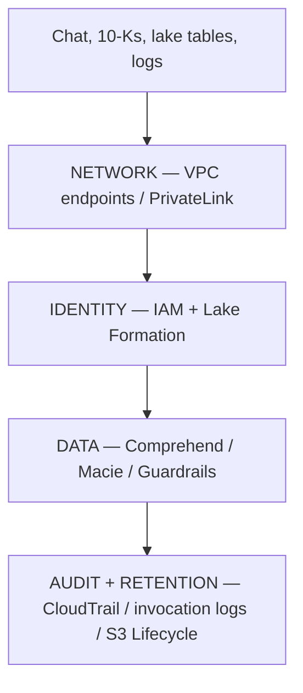

# Implement Data Security and Privacy Controls

**Domain 3 · Task 3.2 · Skills 3.2.1–3.2.3**

Task 3.1 surrounds the FM so untrusted strings never become the answer. Task 3.2 is a different question: **who can reach the model and the data, over which path, and does a phone number ever need to be there?**

The running example is still the earnings desk. Client chat contains a sell-side cell number. Fine-tuning JSONL sits in S3. A text-to-SQL agent reads the lake. Invocation logs will hold whatever you sent. The exam is not a feature list. It is *which service, at which layer, for which threat*.

Classify the stem by layer first, then pick the logo.

```text
NETWORK     traffic never traverses the public internet
IDENTITY    who may invoke which model, read which bucket, see which column
DATA        detect, classify, mask, redact — before the FM and at rest in S3
LIFECYCLE   prove who accessed what; do not keep it longer than you must
```


```mermaid
flowchart TD
    T[Chat, 10-Ks, lake tables, logs] --> N[NETWORK — VPC endpoints / PrivateLink]
    N --> I[IDENTITY — IAM + Lake Formation]
    I --> D[DATA — Comprehend / Macie / Guardrails]
    D --> L[AUDIT + RETENTION — CloudTrail / invocation logs / S3 Lifecycle]
```

| Layer | If the stem says… | Reach for |
|-------|-------------------|-----------|
| **Network** | “must not traverse the public internet” | Interface VPC endpoint (PrivateLink) |
| **Identity** | “analysts only see certain columns” | Lake Formation |
| **Identity** | “only approved models / only through this path” | IAM model ARNs, `aws:SourceVpce`, SCPs |
| **Data** | “phone numbers must never reach the model” | Comprehend or Guardrails PII on **input** |
| **Data** | “which buckets hold PANs?” | Macie |
| **Lifecycle** | “delete chat logs after 90 days” | S3 Lifecycle expiration |
| **Audit** | “which users invoked models” | CloudTrail |
| **Audit** | “what prompt was sent” | Bedrock **invocation logging** |

Read the article as those four layers. **3.2.1** builds the protected environment (network, IAM, lake, monitoring). **3.2.2** is privacy on the live FM path and at rest. **3.2.3** is how you keep utility while you strip identifiers.

> **Exam tip:** A private network is not authorization. IAM still decides *who*. Lake Formation still decides *which column*. Comprehend still has to kill the SSN **before** the index sees it.

---

## Skill 3.2.1 — Build a protected AI environment

**Protected** means the blotter’s traffic, identities, and lake permissions are not “TLS over the open internet plus `bedrock:InvokeModel` on `*`.” Four controls in this skill: VPC endpoints, IAM, Lake Formation, CloudWatch (and the audit cousins).

### Network — keep Bedrock and S3 off the public internet

By default, Bedrock API calls leave your VPC to a **public** service endpoint. TLS is on. The packets still exit your boundary. Regulated desks often cannot accept that.

An **interface VPC endpoint** (AWS **PrivateLink**) places an ENI with a private IP in your subnets. Calls to Bedrock resolve there and stay on the AWS network.

Bedrock is several endpoints. Inference working from a private subnet while **agent / Knowledge Base** calls fail is a classic trap: you attached `bedrock-runtime` and forgot `bedrock-agent-runtime`.

```text
bedrock-runtime          InvokeModel, Converse, streams
bedrock                  control plane — list models, customizations
bedrock-agent            Agents / KB *build* time
bedrock-agent-runtime    InvokeAgent, Retrieve, RetrieveAndGenerate
```

**Private DNS** makes `bedrock-runtime.us-east-1.amazonaws.com` resolve to those private IPs. Apps need no code change.

**Endpoint policies** are resource-based IAM on the endpoint itself — what is allowed *through this path*. Allow `bedrock:InvokeModel` only on approved model ARNs, or only principals in your org (`aws:PrincipalOrgID`). The network path becomes a second chokepoint.

S3 (training data, RAG sources, invocation logs) is different:

| S3 endpoint | When |
|-------------|------|
| **Gateway** | Free, route-table based, **S3 and DynamoDB only**, in-VPC. Cost-sensitive, everything already in the VPC. |
| **Interface** | Hourly ENI cost. **On-prem** over Direct Connect / VPN. Private DNS + endpoint policies. |

Security groups on endpoint ENIs: HTTPS 443 from app subnets only. Sensitive tiers: no IGW, no NAT. Fine-tuning jobs can run **in your VPC** so S3 training reads stay private.

```quickcheck
Q: Inference from a private subnet works. InvokeAgent / Retrieve fails. What is missing?
A: An internet gateway on the app subnet
B: The `bedrock-agent-runtime` interface endpoint (runtime alone is not enough)
C: Lake Formation LF-Tags
D: Macie on the VPC
correct: B
feedback: Bedrock Runtime ≠ Agents runtime. PrivateLink is per service name. Lake Formation and Macie are other layers.
```

### Identity — IAM least privilege for FM workloads

Scope `bedrock:InvokeModel` to **specific model ARNs**, not `*`. That is “only approved models.”

Condition keys the exam actually uses:

```text
aws:SourceVpce        request arrived through this VPC endpoint
aws:PrincipalOrgID    identity is in your Organization
```

Pair `aws:SourceVpce` with an S3 bucket **Deny** when the condition is *not* met: this bucket is only reachable privately.

SCPs at the org can ban Bedrock outside approved regions. Member-account IAM cannot override an SCP.

Distinguish **who is missing the permission**. Exam stems love a red herring:

| Role | Needs |
|------|--------|
| App / Lambda / ECS **task role** | `InvokeModel` on approved models; S3 read of *its* context |
| **Knowledge Base service role** | Read source bucket + vector store. Not the caller’s identity. |
| **Customization role** | Read training prefix; write output prefix |

If Retrieve fails with AccessDenied on S3, check the **service role**, not the analyst’s user.

Inference profiles have their own ARNs and tags — ABAC and cost attribution per team.

```recall
Q: A bucket policy should make filings reachable only through the Bedrock VPC endpoint. What condition?
A: Deny S3 when `aws:SourceVpce` is not that endpoint. PrivateLink is the path; IAM is still the door.
```

### Lake Formation — columns the model must never see

S3 bucket policies grant objects. They cannot say “this role may read `transactions` but not `ssn`, and only rows where `region = 'US'`.” That is **Lake Formation** on the Glue Data Catalog: database / table / **column** / **row** / **cell**, enforced for Athena, Redshift Spectrum, Glue, EMR.

```text
Column-level    drop PII columns from a principal’s view — no duplicate table
Row-level       data filters / predicates — US desk vs EU desk
Cell-level      both
LF-Tags         tag `classification=confidential`; policies on tags
```

**Hundreds of tables** / “scalable governance” → **LF-Tags**, not a grant per table.

FM pattern: the text-to-SQL agent or fine-tune prep job assumes a role Lake Formation already stripped. The model cannot leak **salary** if the querying identity was never allowed to read it. Masking downstream is a second line, not the only line.

Lake Formation is **not** a Converse permission. It does not replace Guardrails.

```fillin
Bucket policies cannot hide a column. {{Lake Formation}} can. LF-Tags scale when you have hundreds of tables.
```

### Monitoring — prove the controls

Three different questions. Do not mash them.

| Question | Service |
|----------|---------|
| **Who** called `InvokeModel`, from which role / IP? | **CloudTrail** (runtime calls are **data events** — enable them) |
| **What** prompt and completion flowed? | Bedrock **model invocation logging** (off by default → your CW Logs and/or S3) |
| **How many** / how slow / throttled? | **CloudWatch** metrics and alarms |

Invocation logs **are PII**. Encrypt, restrict, Lifecycle-expire them. Controls compound.

S3 object-level reads of training data: S3 server access logs or CloudTrail **S3 data events**.

| Stem | Pick |
|------|------|
| Continuous **compliance posture** (encryption off, public bucket) | **AWS Config** |
| **Active threat** / anomalous S3 access | **GuardDuty** (S3 protection) |
| Audit trail of API callers | CloudTrail |
| Metrics and alarms | CloudWatch |
| Prompt contents | Invocation logging |

Alarm on invocation spikes from one role (stolen creds or injection-driven abuse). Metric filters on guardrail interventions or S3 AccessDenied.

```quickcheck
Q: Security wants to know which IAM role invoked Claude last Tuesday. Legal wants the prompt text. Which pair?
A: CloudTrail for the caller; Bedrock invocation logging for the payload
B: CloudWatch metrics for both
C: Macie for both
D: Lake Formation for both
correct: A
feedback: CloudTrail is who/when. Invocation logging is what was said. Metrics have no prompt body. Macie is S3-at-rest. Lake Formation is lake grants.
```

---

## Skill 3.2.2 — Privacy on the FM path and at rest

**Privacy-preserving** means sensitive content is found and handled *before* it becomes a prompt, an index chunk, or a seven-year log. Four tools: Comprehend, Macie, Bedrock’s native privacy + Guardrails PII, S3 Lifecycle.

### Comprehend vs Macie — where the bytes live

Both find sensitive data. The discriminator is **where it lives and when you scan**.

**Amazon Comprehend** is NLP on **text you send it** (real time or batch).

| API | Returns | Use |
|-----|---------|-----|
| **`DetectPiiEntities`** | Type, **offsets**, confidence | Programmatic redact / mask — you know which spans to replace |
| **`ContainsPiiEntities`** | Document-level “is this type present?” — no locations | Cheap triage: does this file need the redaction pipeline? |

Async jobs over S3 can write redacted copies (masks or type labels). Email bodies already in S3 are **text**. Textract is for **scans**.

**Amazon Macie** discovers and classifies sensitive data **at rest in S3**. Bucket inventory, public/encryption posture, managed + custom identifiers. It produces **findings**. It does **not** redact objects. EventBridge / Security Hub for remediation.

```text
Live chat about to hit Bedrock          → Comprehend (or Guardrails PII)
KB / Kendra ingest of mail              → Comprehend redact, then index the copy
Which buckets in the estate hold PANs?  → Macie
Fine-tune prefix — any credit cards?    → Macie (then Comprehend if you must clean)
```

Macie audits the corpus at rest. Comprehend redacts the document in the pipe. Both in one design is legitimate. **Macie is not a black marker.**

Once a phone number is in OpenSearch or Kendra, IAM will not “un-say” it. **Redact then index.** A system prompt after retrieval is an honor system. Guardrails PII on Converse does not clean an index you already poisoned.

```quickcheck
Q: Support email in S3 contains PANs. A mobile app must answer “wire cutoff?” in English and must never return a card number. What pipeline?
A: Kendra on the raw bucket + a Bedrock prompt to strip PII
B: Comprehend redact in S3, then Kendra (or a KB) on the **processed** copy
C: Macie findings as the search index
D: Textract + DocumentDB
correct: B
feedback: Email is already text (not Textract). Macie finds, it does not redact. Prompts are not redaction. DocumentDB is not NL enterprise search.
```

### What Bedrock already promises

Know these so true/false distractors die:

- Prompts, completions, and customization data are **not** used to train the provider’s FM and are **not** shared with third-party model providers.
- Inputs/outputs are **not stored** after processing unless **you** turn on something that stores them (invocation logging lands **in your account**).
- Fine-tune = **private copy** of the base model. Your data does not improve the shared model. Other customers cannot use your custom model.
- TLS in transit. At rest: custom models, agents, KB data — **CMKs** when you need key policy and rotation.
- HIPAA eligibility / GDPR alignment / SOC / ISO for regulated stems.
- PrivateLink (3.2.1) extends the privacy story to the path.

Your remaining jobs: what **you** log, what **you** put in the prompt, who **you** authorize.

### Guardrails sensitive information — live I/O

Guardrails (task 3.1) still belong here for **PII on the turn**. Sensitive-information filter:

| Mode | Effect |
|------|--------|
| **Block** | Reject the request or response |
| **Mask** | Replace with `{NAME}` / `{EMAIL}` — conversation continues |

Canonical design: **mask on input** so the model never sees raw IDs; **block on output** so it cannot leak stored personal data.

`ApplyGuardrail` can wrap text even for models **outside** Bedrock. Pin production to a **version**, not DRAFT. Interventions → canned message + CloudWatch telemetry.

Guardrails masking is **one-way type tags**. It is not reversible pseudonymization. That is 3.2.3.

### S3 Lifecycle — not keeping is a privacy control

GDPR storage limitation: delete or tier on a clock.

**S3 Lifecycle** rules (prefix / tags / size): **transition** to cheaper classes, or **expire** (delete) after N days.

Patterns: expire invocation logs after the audit window; expire raw uploads after processing; abort **incomplete multipart** uploads; expire **noncurrent versions**.

Versioned bucket trap: expiring the **current** version writes a **delete marker**. You still need **`NoncurrentVersionExpiration`** to purge history.

| Stem | Pick |
|------|------|
| Automatically **delete** logs after 1 year | **Lifecycle** expiration |
| Logs **cannot be deleted or modified** for 1 year | **S3 Object Lock** (WORM) |
| Keep object history | **Versioning** |
| 3 years retained, **immutable for year 1** | Object Lock (1y) **+** Lifecycle expire at 3y |

Object Lock is the opposite of deletion. Do not confuse a legal hold with a retention clock.

```recall
Q: Chat logs must be immutable for one year and gone at three. Which two S3 features?
A: Object Lock for the WORM window; Lifecycle expiration at three years. Versioning alone does not auto-delete. Lifecycle alone is not immutability.
```

```fillin
Macie finds PANs in S3. It does not emit a {{redacted}} corpus. Comprehend (or a redact job) does.
```

---

## Skill 3.2.3 — Protect privacy without killing utility

**3.2.3** is the design question on top of 3.2.2’s tools. Blocking every request that contains a name is private and useless. Passing everything through is useful and reckless. The exam wants the **least destructive** transform that still satisfies the requirement.

### De-identification vocabulary

Precision here is points.

| Technique | What it does | Utility | Reversible? |
|-----------|--------------|---------|-------------|
| **Redaction** | Replace the span with `[REDACTED]` | Field gone | No |
| **Masking** | `****-****-****-4242` — shape / last-four remain | Partial | Usually no |
| **Pseudonymization** | `John Smith` → `PERSON_1` **consistently** | Model can still talk about “PERSON_1’s account” | **Yes**, via a secure map |
| **Tokenization** | Same idea with a token vault (payments) | High | Yes, vault |
| **Anonymization** | Irreversible; individual not reasonably re-identifiable | Analytics / training | **No** |
| **Generalization** | Age 47 → `40–49`; ZIP → prefix | Some | No |
| **k-anonymity** | Each record indistinguishable from ≥ k−1 others | Statistical | No |
| **Differential privacy** | Calibrated noise, mathematical bound | Queries | No |
| **Synthetic data** | Fake rows with real-ish distributions | Train / test | n/a (never real) |

Quasi-identifiers (ZIP + birthdate + gender) can re-identify. “We dropped the name” is not anonymization.

Rule the exam rewards:

```text
Must act on the real person later     → pseudonymize / tokenize; map stays off the model
Train, analytics, long retain         → anonymize / synthesize — irreversible
Last-four is enough                   → mask
Field has no utility at all           → redact
```

### The privacy sandwich

On the way **in**: Comprehend `DetectPiiEntities` → replace with **consistent** pseudonyms. Store the map in DynamoDB or session memory, encrypted, **never** in the prompt. Send the sanitized text to Bedrock with a Guardrail as defense-in-depth (mask anything the first stage missed; prompt-attack).

On the way **out**: Guardrails output PII filter. Optionally **re-substitute** real values for the **authorized** user. Utility for the human. The model and invocation logs never held raw PII.

| Layer | What it can do | What it cannot |
|-------|----------------|----------------|
| **Comprehend pre-process** | Offsets, custom logic, **reversible** pseudonyms | You own the code |
| **Guardrails** | Managed I/O, every invocation, model-agnostic | Masking is one-way type tags — not a re-id map |
| **Lake Formation** | Never **retrieve** the salary column | Not a chat filter |
| **Macie** | Continuously verify corpora and **logs** at rest | Not live redaction |

“Defense in depth” → several of these. “Least operational overhead” for PII on the turn → **Guardrails alone**.

### Judgments worth rehearsing

- **Fine-tune data** — anonymize or pseudonymize **before** training. Whatever enters training can be regurgitated. **Macie the bucket first.**
- **RAG / Kendra** — redact **at ingest**, not only at output. Retrieval surfaces raw chunks.
- **Memory and invocation logs** are stored FM data: encryption, IAM, Lifecycle, Macie.
- **Consent / purpose** — “improve the product” is a different purpose than “answer this ticket.” Retention and IAM should match the purpose.

```quickcheck
Q: The blotter must show the client their own name in the UI, but Claude must never see it, and logs must not hold it. Least-destructive technique?
A: Redact every NAME and leave it gone
B: Consistent pseudonymization with a server-side map; re-substitute after Guardrails for the authorized user
C: Macie on the laptop
D: Disable invocation logging and hope
correct: B
feedback: 3.2.3 is utility. Redaction destroys the name for the UI. The map never goes to the FM. Macie does not sit on a chat turn. Skipping logs is not a de-id strategy.
```

---

## When to use which

| Requirement | Reach for |
|-------------|-----------|
| Traffic must not traverse the public internet | Interface VPC endpoints for `bedrock-runtime` (and agent-runtime if needed) |
| On-prem private S3 | S3 **interface** endpoint |
| In-VPC S3, cost matters | S3 **gateway** endpoint |
| Only approved models; only through this path | IAM model ARNs; endpoint policies; `aws:SourceVpce`; `aws:PrincipalOrgID`; SCPs |
| Column / row / cell on the lake; hundreds of tables | Lake Formation (data filters, **LF-Tags**) |
| Who called the API | CloudTrail |
| Prompt / completion audit | Invocation logging (then protect + expire it) |
| Metrics / alarms | CloudWatch |
| Compliance drift | Config |
| Anomalous access | GuardDuty |
| Sensitive data **at rest in S3** | **Macie** |
| PII in **text**, offsets, redact | Comprehend `DetectPiiEntities` |
| Cheap “is there PII?” | `ContainsPiiEntities` |
| Live I/O PII mask or block | Guardrails sensitive-information |
| Auto-delete after N days | S3 Lifecycle |
| Cannot delete for N days | S3 Object Lock |
| Reversible, keep referential integrity | Pseudonymization / tokenization |
| Irreversible train / analytics | Anonymization, k-anonymity, synthetic |
| NL search over mail, no PAN in hits | Comprehend **then** Kendra / KB |

---

## AWS service glossary

### Network / identity

#### Interface VPC endpoint (PrivateLink)

**What it is.** ENI with a private IP; AWS APIs stay on the AWS network.

**Problem it solves.** Bedrock / agent-runtime / S3 (interface) without a public hop.

**Where it sits.** Network layer of 3.2.1.

**Typical use.** `com.amazonaws.us-east-1.bedrock-runtime` + private DNS; endpoint policy on model ARNs.

**Pricing.** Hourly per AZ + data processing. S3 **gateway** endpoints are free.

**Exam cue.** “Must not traverse the public internet.” Agent calls need **agent-runtime**, not only runtime.

**Do not confuse with.** IAM (who). NAT Gateway (still egress to public APIs).

#### AWS IAM / Organizations SCPs

**What it is.** Identity policies; org guardrails that member accounts cannot override.

**Problem it solves.** Approved models, private-path-only buckets, region lock.

**Where it sits.** Identity layer.

**Typical use.** `InvokeModel` on one Claude ARN; Deny S3 unless `aws:SourceVpce`; SCP bans Bedrock in `ap-south-1`.

**Pricing.** None for the policy.

**Exam cue.** Service **role** vs caller. SourceVpce. GuardrailIdentifier is 3.1.

**Do not confuse with.** Lake Formation (columns). Endpoint policy (the path).

#### AWS Lake Formation

**What it is.** Grant/revoke on Glue Catalog: table, column, row, cell, **LF-Tags**.

**Problem it solves.** Text-to-SQL / lake RAG must not retrieve `ssn` or `salary`.

**Where it sits.** Identity on **analytical** data, not on Converse.

**Typical use.** HR role sees salary; blotter role does not. Tags at hundreds of tables.

**Pricing.** Generally no extra charge on top of the query engine.

**Exam cue.** Column-level. LF-Tags when “scale.” Model never saw what the role cannot read.

**Do not confuse with.** S3 bucket policies. Guardrails. Macie.

### Data / privacy

#### Amazon Comprehend

**What it is.** NLP on a text payload: PII detect / redact, entities, sentiment.

**Problem it solves.** Kill the phone number **before** KB ingest or the prompt.

**Where it sits.** Data layer; 3.2.2 live and batch; 3.2.3 offsets for pseudonyms.

**Typical use.** `DetectPiiEntities` offsets → `[PHONE]`; async redact job over mail.

**Pricing.** Units of text.

**Exam cue.** Text you already have. Redact **then** index. Not Macie.

**Do not confuse with.** Macie (S3 findings). Guardrails (model I/O). Textract (OCR).

#### Amazon Macie

**What it is.** Sensitive-data discovery **at rest in S3**. Findings, not rewritten objects.

**Problem it solves.** “Does last quarter’s fine-tune prefix contain PANs?”

**Where it sits.** Data-at-rest audit.

**Typical use.** Job on `s3://desk-ft/`; Security Hub; then a Comprehend clean if needed.

**Pricing.** Bucket eval + jobs.

**Exam cue.** Inventory / posture. Not the search-pipeline redactor.

**Do not confuse with.** Comprehend. Guardrails.

#### Amazon Bedrock Guardrails (PII)

**What it is.** Sensitive-information **block** or **mask** on live input and output.

**Problem it solves.** Chat turn must not send or emit an SSN, with almost no code.

**Where it sits.** Data layer on the **call** (also 3.1).

**Typical use.** Mask input, block output; version pin.

**Pricing.** Guardrail units.

**Exam cue.** Least ops for live PII. Does not un-index a poisoned KB. Mask ≠ reversible pseudonym.

**Do not confuse with.** Comprehend corpus jobs. Invocation logging.

### Audit / retention

#### AWS CloudTrail

**What it is.** API audit: who, when, from where, which action.

**Problem it solves.** Which role invoked Bedrock.

**Where it sits.** Observability. Enable **data events** for runtime.

**Typical use.** Investigate stolen-key InvokeModel.

**Pricing.** Management events vs data events.

**Exam cue.** Who accessed. Not the prompt body.

**Do not confuse with.** Invocation logging. CloudWatch metrics.

#### Bedrock model invocation logging

**What it is.** Optional capture of prompts, completions, tokens → CW Logs and/or S3 **in your account**.

**Problem it solves.** Reconstruct what was said.

**Where it sits.** Observability — and a new PII store you must encrypt, IAM, Lifecycle, maybe Macie.

**Typical use.** 90-day prompt audit, then expire.

**Pricing.** Log ingest / S3.

**Exam cue.** Off by default. Payload, not caller identity (that is Trail).

**Do not confuse with.** Guardrail trace (which policy). CloudTrail.

#### Amazon CloudWatch

**What it is.** Metrics, logs, alarms.

**Problem it solves.** Spike in invocations; count of AccessDenied; operational latency.

**Where it sits.** Named in 3.2.1 beside the environment.

**Typical use.** Alarm on one role’s InvokeModel rate.

**Pricing.** Metrics / logs.

**Exam cue.** How many / how fast — not “what did they type.”

**Do not confuse with.** CloudTrail. Config.

#### Amazon S3 Lifecycle / Object Lock

**What it is.** Lifecycle = auto transition/expire. Object Lock = WORM retention.

**Problem it solves.** Delete logs at 90 days vs cannot delete for 1 year.

**Where it sits.** Lifecycle layer of 3.2.2.

**Typical use.** Expire invocation-log prefix; Object Lock COMPLIANCE mode for year one.

**Pricing.** Storage class + lock is still S3 storage.

**Exam cue.** Delete → Lifecycle. Cannot delete → Object Lock. Versioned expire needs NoncurrentVersionExpiration.

**Do not confuse with.** Each other. Macie.

#### AWS Config / Amazon GuardDuty

**What it is.** Config = continuous resource compliance. GuardDuty = threat intel / anomalous access.

**Problem it solves.** “Is encryption still on?” vs “is this S3 get weird?”

**Where it sits.** Monitoring family in 3.2.1.

**Typical use.** Config rule on public-access block; GuardDuty S3 protection.

**Pricing.** Config items / GuardDuty per GB analyzed.

**Exam cue.** Posture vs active threat.

**Do not confuse with.** CloudTrail (audit log). Macie (sensitive *content* discovery).

---

## Practice questions

Pick an answer on every stem. The explanation appears after you choose — later questions stay unspoiled until you answer them.

```practice
Q: A healthcare chatbot on Bedrock: patient messages must never leave the AWS network, and SSNs must be masked before the model. Name the two controls and their layers.
A: NAT Gateway + a system prompt
B: Interface VPC endpoint (network) + Comprehend or Guardrails PII mask on input (data)
C: Macie + CloudTrail
D: Lake Formation + Object Lock
correct: B
feedback: Public-internet ban is PrivateLink. SSN on a live turn is Comprehend offsets or Guardrails mask. Macie is S3-at-rest. Lake Formation is columns.

Q: Security asks whether last quarter’s fine-tuning dataset in S3 contained credit card numbers. Why not Comprehend first?
A: Comprehend cannot see numbers
B: The bytes are at rest in S3 across a prefix — Macie discovery jobs. Comprehend is text you send it (use it after, if you need a redacted copy)
C: Only GuardDuty can read S3
D: You must use Textract on JSONL
correct: B
feedback: Macie is S3-at-rest inventory. Comprehend is a payload API / S3 redact job you point at specific objects.

Q: Chat logs retained exactly three years, immutable for the first one. Which pair?
A: Versioning only
B: S3 Object Lock for year one + Lifecycle expiration at three years
C: Macie + GuardDuty
D: Glacier Deep Archive with no expire rule
correct: B
feedback: Cannot-delete is Object Lock. Auto-delete at three is Lifecycle. Versioning keeps history; it does not WORM or expire by itself.

Q: An agent answers HR questions from the lake but must never surface the salary column to non-HR users. Where do you enforce so the model cannot leak what it never saw?
A: A system prompt “do not mention salary”
B: Lake Formation column (or LF-Tag) grants on the querying role
C: Guardrails word filter “salary”
D: CloudWatch alarm on the word salary
correct: B
feedback: Authorization layer. If the role cannot read the column, retrieval never gets it. Prompts and word lists are after the leak.

Q: Distinguish CloudTrail vs invocation logging on a Bedrock incident.
A: Both store the prompt
B: CloudTrail: which principal called which API. Invocation logging: prompt and completion payloads
C: CloudTrail is PII redaction
D: Invocation logging is VPC flow logs
correct: B
feedback: Who vs what. Enable data events for runtime. Invocation logs are a PII store of their own.

Q: “Traffic to Converse must not traverse the public internet.” Least extra machinery?
A: Private NAT to 0.0.0.0/0
B: Interface VPC endpoint for bedrock-runtime, private DNS
C: Macie on the ENI
D: SCP that denies 443
correct: B
feedback: PrivateLink. NAT still goes to public endpoints. Macie is not a network path.

Q: On-prem analysts over Direct Connect must read the filings bucket privately. Gateway endpoint is proposed. Why might that fail?
A: Gateway endpoints are IPv6-only
B: S3 gateway endpoints are route-table / in-VPC; on-prem needs an S3 **interface** endpoint
C: Direct Connect cannot reach AWS
D: You must use Macie as a proxy
correct: B
feedback: Gateway = VPC route tables. Interface = ENI reachable from on-prem.

Q: Hundreds of lake tables, tag `classification=confidential`, scalable grants. What?
A: One S3 bucket policy per object
B: Lake Formation LF-Tags
C: Guardrails denied topics
D: ContainsPiiEntities
correct: B
feedback: LF-Tags are the scale pattern. Bucket policies cannot do columns. Guardrails are the FM call.

Q: RetrieveAndGenerate fails with S3 AccessDenied. The analyst’s IAM user can GetObject in the console. What is the usual miss?
A: CloudTrail is off
B: The Knowledge Base **service role** lacks S3 read — the caller’s user is a red herring
C: Need Object Lock
D: Need a bigger model
correct: B
feedback: 3.2.1 role split. KB reads as the service role.

Q: Live chat, least operational overhead, mask emails on input and block SSN on output.
A: Homemade Lambda regex only
B: Bedrock Guardrails sensitive-information filter (mask vs block)
C: Macie every message
D: Lake Formation on DynamoDB
correct: B
feedback: Least ops on the turn is Guardrails. Macie is S3. Lake Formation is the catalog.

Q: You need character offsets to build consistent PERSON_1 pseudonyms. Which API?
A: ContainsPiiEntities
B: DetectPiiEntities
C: Macie GetFindings
D: CloudWatch GetMetricData
correct: B
feedback: Offsets come from DetectPiiEntities. ContainsPii is yes/no triage. Macie findings are object-level.

Q: Versioned log bucket. Lifecycle expires current objects at 90 days. Old versions remain. Why?
A: Lifecycle cannot expire
B: Current-version expiration writes a delete marker; add NoncurrentVersionExpiration
C: You needed Macie
D: Object Lock prevents all Lifecycle
correct: B
feedback: Versioning trap the exam likes. Object Lock would block deletes only if a retention period is on.

Q: Defense-in-depth for PII: lake agent + chat + S3 corpus. Which stack?
A: Prompt only
B: Lake Formation (never retrieve PII columns) + Comprehend at ingest + Guardrails on Converse + Macie on logs
C: CloudTrail only
D: Raise temperature
correct: B
feedback: 3.2.3 layering. Each control catches a different store.

Q: Fine-tuning on real customer chats. What is the 3.2.3 order?
A: Train first, Macie later
B: Macie the prefix, anonymize or pseudonymize before training, private Bedrock copy still does not excuse raw PII in the JSONL
C: Guardrails on the training job replace dataset hygiene
D: Object Lock the JSONL so PII cannot be read
correct: B
feedback: Training data can be regurgitated. Bedrock’s “not used to train the *provider* model” does not mean your copy is PII-free.
```

---

## Final compressed review

### What are the four layers?

1. **Network** — interface endpoints (`bedrock-runtime`, `bedrock-agent-runtime`, S3 interface for on-prem). Gateway S3 when in-VPC and cheap. Endpoint policies + private DNS.
2. **Identity** — model ARNs, `aws:SourceVpce`, org SCPs, **service role vs caller**, Lake Formation columns / LF-Tags.
3. **Data** — Comprehend on text (offsets, redact then index); Macie on S3 at rest; Guardrails PII on the live call; Bedrock does not train the provider model on your prompts.
4. **Audit + retention** — CloudTrail who; invocation logs what; CloudWatch how many; Config posture; GuardDuty threats; Lifecycle delete; Object Lock cannot-delete.

### What requirement words should trigger what choices?

No public internet → **PrivateLink**. On-prem S3 → **interface**. Columns / hundreds of tables → **Lake Formation / LF-Tags**. Who invoked → **CloudTrail**. Prompt body → **invocation logging**. PANs in a bucket → **Macie**. Spans in a string → **DetectPiiEntities**. Live mask/block → **Guardrails**. Delete after N → **Lifecycle**. WORM → **Object Lock**. NL search, no PII in hits → **Comprehend then Kendra/KB**. Keep the name for the UI → **pseudonymize**, do not redact.

### What mistakes is AWS trying to tempt you into making?

Treating TLS-to-public-Bedrock as “private.” Forgetting agent-runtime. Checking the caller when the **KB role** is blind. Bucket policies instead of column grants. Macie as a redactor. Kendra on the raw mail + a polite prompt. Textract on email. DocumentDB as enterprise search. CloudTrail when they asked for the prompt. Lifecycle when they asked for immutability (or the reverse). Guardrails as a cleaner for an index. Calling dropped-name “anonymization.”

If you can walk the desk out loud — PrivateLink to Converse, IAM on the model ARN, Lake Formation hiding salary, Comprehend before the KB, Macie on the fine-tune prefix, Guardrails on the turn, logs expired at 90 days — you are doing Task 3.2.

How you prove it to auditors is next: [3.3 AI Governance and Compliance](/learn/3/governance-compliance). Safety of the *content* of the call is [3.1](/learn/3/input-output-safety).
