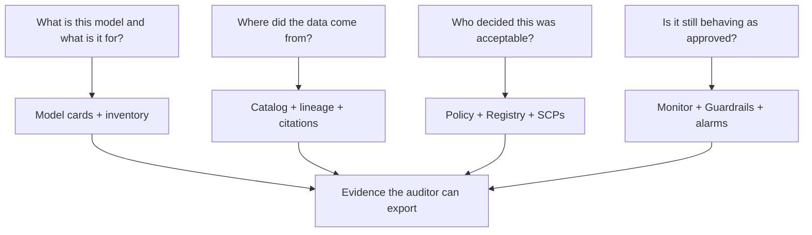

# Implement AI Governance and Compliance Mechanisms

**Domain 3 · Task 3.3 · Skills 3.3.1–3.3.4**

Task 3.2 *protects* the data. Task 3.3 *proves and sustains* trustworthy operation. A regulator asks: show the intended use, the 10-K paragraph that grounded yesterday’s NVDA summary, who approved the deployment, and whether the assistant has drifted since launch. If you cannot, the summary does not matter.

Governance answers four questions that security alone does not:

```text
WHAT IS IT FOR?     documentation — model cards, inventories
WHERE DID DATA GO?  lineage — Glue Catalog, tags, citations, CloudTrail
WHO SAID YES?       oversight — policies, boards, SCPs, Audit Manager
STILL APPROVED?     continuous assurance — drift, misuse, EventBridge loops
```



A useful compression: **compliance is a claim; governance is the system that makes the claim true; evidence is what makes it auditable.** Nearly every service in this task generates, organizes, or acts on evidence. “The auditor asks…” / “demonstrate to the regulator…” means: which *artifact*, produced automatically so it does not rot.

You will rarely be quizzed on legal text. You will be asked which AWS mechanism satisfies a requirement *shaped like* the **EU AI Act** (risk-tiered docs and transparency), **GDPR** (minimization, explanation, erasure), **HIPAA** / **SR 11-7** model-risk management, **NIST AI RMF** (Govern, Map, Measure, Manage), or **ISO/IEC 42001**.

Read the article as those four questions. **3.3.1** produces the compliance pack. **3.3.2** traces sources into generated answers. **3.3.3** is the operating model at org scale. **3.3.4** keeps the envelope after launch.

> **Exam tip:** CloudTrail is who clicked. Invocation logs are what was said. Glue Catalog + output tags are which *pile* a generated fact came from. Clarify is why a *tabular* score moved. Do not swap those drawers.

---

## Skill 3.3.1 — Compliance frameworks for FM deployments

Four artifacts, produced as the work runs, not reconstructed in a wiki the week of the audit: **model cards**, **Glue lineage**, **tags**, **decision logs**.

### SageMaker Model Cards — programmatic documentation

A **model card** is the canonical document: what it is, what data trained or grounded it, how it was evaluated, where it may and may not be used, who is accountable. **SageMaker Model Cards** are an API resource, not a Confluence page. Intended uses and out-of-scope uses, risk rating, training details, metrics, ethical caveats, owner/approver. Create and update them **in CI/CD** — documentation generated *as part of the ML workflow*.

Lifecycle status: `draft` → `pending review` → `approved` → `archived`. Export **PDF** for the risk committee.

For a Bedrock FM you did not train, the card still documents *your application*: intended use (“summarizes public filings; not advice”), eval results, guardrail version, risk rating. Governance attaches to **deployment and use**, not only to training.

Do not mash the neighbors:

| Stem | Pick |
|------|------|
| Documentation for the risk committee / intended use / limitations | **Model Card** |
| Block deploy until someone approves; version the artifact | **Model Registry** approval status |
| Fleet-wide view: which models lack cards or monitors | **SageMaker Model Dashboard** |
| Least-privilege personas in the ML platform | **SageMaker Role Manager** |

```quickcheck
Q: A regulator wants intended use, evaluation results, and approval history for the blotter assistant, kept current in CI/CD. Which artifact?
A: A wiki page the intern updates after launch
B: SageMaker Model Card (status + PDF), updated in the pipeline; Registry if the stem is the *deploy gate*
C: CloudTrail LookupEvents
D: Macie findings
correct: B
feedback: Cards are programmatic evidence. Registry is the promotion gate. Trail is who called an API. Macie is S3 content discovery.
```

### Glue — make the data known, then track what touched it

“What data trained or grounded this model, and what transformations did it undergo?”

| Piece | Job |
|-------|-----|
| **Glue Data Catalog** | Technical metadata: databases, tables, schemas, locations. Crawlers infer schema from S3 / JDBC. |
| **Glue ETL jobs** | Pipeline lineage: what they read and wrote; bookmarks; job-run history → dataset version ↔ code version. |
| **SageMaker ML Lineage** | ML-artifact graph: dataset → processing → training → model → endpoint. |
| **DataZone / SageMaker Catalog** | Business metadata, glossaries, **subscription / approval** to share an asset. |

Registration in the catalog is the foundational act of making a source *governable*. Then you can tag it, Lake-Formation it (3.2), and point KB syncs at a known table.

**Source lineage** on this exam is often **input inventory + output sticker**, least ops: register curated vs scraped piles in the **Glue Data Catalog**, and **tag FM outputs** with source metadata so a reviewer sees `source=curated` / the S3 URI on the generated quiz card. CloudTrail of “who approved” is people, not credibility. Clarify SHAP is the wrong kind of “why.” Joining invocation logs to S3 keys is extra ops.

```recall
Q: Reviewers must verify whether a generated quiz fact came from a 10-K or a scrape, least operational overhead. What pair?
A: Glue Data Catalog on the input datasets + tags on the FM outputs. Not CloudTrail of the Approve click, not Clarify, not a homemade join of invocation logs.
```

### Metadata tagging — attribution that scales

Taxonomy on resources: `data-classification`, `data-owner`, `source-system`, `retention-period`, `approved-use`. Enables ABAC, cost allocation, Config rules (“any untagged bucket feeding a KB”). **Organizations tag policies** keep the vocabulary consistent across accounts. Catalog / **LF-Tags** classify tables and columns so “approved for training” is queryable, not tribal.

When the stem says *systematically* attribute sources across a large estate: **catalog + tags**, because tags scale where enumerating ARNs does not.

### CloudWatch Logs — decision records

A decision log is each consequential turn: input, retrieved context, model + version, guardrail interventions, output, disposition (shown / escalated / blocked). **CloudWatch Logs** is the collection point: app logs, Bedrock **invocation logs**, guardrail telemetry. **Logs Insights** for “blocked outputs for user X in March.”

Emit **JSON** with correlation IDs (request, session, model version, guardrail version). That is **traceability of individual outcomes**. Log-group retention = audit window. These logs are Task 3.2 data: KMS, IAM, Lifecycle; export to S3 + Object Lock when WORM is mandated.

```text
Model cards     document the model
Glue + catalog  document the data and pipeline lineage
Tags            bind classification and ownership
CW Logs         record the runtime decisions
```

Together they produce, automatically, the evidence a compliance framework requires.

```fillin
A Model Card documents. The Model Registry {{gates deployment}}. The Dashboard shows which models are missing either.
```

---

## Skill 3.3.2 — Trace sources into generated answers

GenAI adds a dimension classical ML lacks: attributing *this completion* to *these documents*.

### Catalog as system of record

Every feed — KB corpora, text-to-SQL tables, fine-tune JSONL — should exist in the **Glue Data Catalog** with schema, location, classification, owner. Crawlers keep schemas current. Catalog **versioning** answers “what did the data look like *when* we trained.” Downstream KB syncs, Glue jobs, Athena agent queries then reference **cataloged** entities. Ungoverned S3 prefixes are invisible to the auditor.

### Attribution on the output

Two mechanisms:

1. **RAG citations.** Knowledge Bases return retrieved chunks and source URIs with the answer. Show them to the user. **Log them with the decision record.** That is per-response provenance — the expected answer when the stem asks how to verify *where an answer came from*. Ingest metadata (author, system, classification, effective date) rides on chunks and can **filter retrieval** to approved, current sources — a governance control, not just UX.
2. **Provenance of the artifact.** Watermark / label as AI-generated (image models embed watermarks; text is application labeling + stored generation metadata). Guardrails **contextual grounding** rejects answers the sources do not support. Attribution names the source; grounding enforces that the text follows from it.

Glue Catalog / job lineage is the **lake ETL** chain. Model **weights** have no footnote. If you need a source, you **retrieved** it (or tagged the generated card).

```quickcheck
Q: Trace an FM answer back to the documents that grounded it, and prove those objects were not altered since ingest. Two trails?
A: CloudWatch metrics + Macie
B: Citation / retrieved-reference records on the response (content trail) + CloudTrail (and S3 integrity / Object Lock) on who mutated the KB or bucket
C: SageMaker Clarify SHAP
D: SCP alone
correct: B
feedback: Citations are which chunk. Trail is who changed the store. Clarify does not emit an S3 URI. Metrics have no document.
```

### CloudTrail on the traceability chain

Tamper-evident **who** registered a catalog table, who edited a KB or guardrail, who invoked, who changed IAM or a model card.

| Feature | When the stem wants it |
|---------|------------------------|
| Management events | Control plane (on by default) |
| **Data events** | `InvokeModel`, S3 GetObject — **enable** |
| **Log file integrity validation** | Cryptographic proof the trail files were not altered |
| **CloudTrail Lake** | SQL-queryable, immutable store, multi-year — audit without building a log pipeline |
| Organization trail | One trail, all accounts |

Discriminator from 3.2, reused here: CloudTrail = who did what to which **resource**. Invocation / decision logs = what **content** flowed. You need both: Trail shows the KB was not quietly swapped; citations show which 10-K produced the sentence.

---

## Skill 3.3.3 — Organizational governance systems

Zoom out from one model to the *operating model*. Controls without oversight are a toolbox.

### The framework components

```text
Policies        acceptable use, risk tiers, approved models/regions, data rules
Accountability  board / committee, model owner, risk officer — named RACI
Risk-tiered review   rights/finance/health → HITL + stricter monitors; internal FAQ → lighter path
Inventory       you cannot govern what you have not enumerated (Dashboard, cards, tags, Config)
Lifecycle gates approval before build, before deploy, periodic re-review (card status, Registry, pipeline)
Culture         people know the policy and the escalation
```

Proportionality (EU AI Act / NIST RMF) is a favorite: do not put a credit-adjacent assistant on the same path as a ticker glossary bot.

### Map policy → principle → mechanism → evidence

AWS responsible-AI dimensions, each with a concrete hook:

| Dimension | Mechanism | Evidence |
|-----------|-----------|----------|
| Fairness | Clarify bias + bias-drift monitor | Metrics vs baseline |
| Explainability | Clarify attributions, model cards | SHAP / card fields |
| Privacy / security | Task 3.2 | VPC, Macie, Lifecycle… |
| Safety | Guardrails, HITL | Intervention logs |
| Veracity | Grounding, eval jobs | Grounding fail rate, eval reports |
| Transparency | Cards, citations, AI-generated labels | PDF card, citation log |
| Governance | Review process itself | Registry status, board minutes |

“Align FM implementations with organizational policies, regulatory requirements, and responsible AI principles” wants that **mapping**, not a single logo.

### Enforcement at org scale — prevent, detect, evidence, decide

Consistency is structural, not a memo.

| Layer | Service |
|-------|---------|
| **Prevent** — no team can bypass | **SCPs** / Organizations: Bedrock only in approved regions, only approved families, required tags. **Control Tower** landing zones. |
| **Detect** | **Config** conformance packs: encryption on, logging on, no public buckets |
| **Evidence** | **Audit Manager** continuously gathers Config snapshots, CloudTrail, control evidence into **framework-mapped** assessment reports |
| **Pose / decide** | **Security Hub** aggregates findings; the **governance board** still decides |

```quickcheck
Q: Distinguish Config, Audit Manager, and CloudTrail in one sentence each.
A: Config: is the resource still compliant. Audit Manager: automated evidence pack mapped to a standard. CloudTrail: who called which API when.
B: All three store prompts
C: Audit Manager is a VPC endpoint
D: Config replaces SCPs
correct: A
feedback: Prevent is SCP. Detect is Config. Evidence pack is Audit Manager. Who is Trail. None of them is invocation logging.
```

```fillin
Automated audit evidence collection mapped to a framework is {{AWS Audit Manager}}. Config only flags the resource; it does not assemble the assessment report.
```

---

## Skill 3.3.4 — Continuous monitoring and advanced controls

Approval at deploy is a snapshot. Two things move: the **world** (data / concept / quality / **bias drift**) and the **usage** (jailbreaks, new abuse, app changes). Continuous monitoring converts “approved once” into “still inside the envelope.”

### Drift and bias — SageMaker vs FM

For **SageMaker endpoints**, **Model Monitor** has four jobs. Keep them straight:

| Monitor | Compares | Needs |
|---------|----------|--------|
| **Data quality** | Live inputs vs training baseline | Captured traffic |
| **Model quality** | Accuracy etc. vs baseline | **Ground-truth labels** |
| **Bias drift** | Fairness metrics vs baseline | Clarify + live traffic |
| **Feature attribution drift** | Which features drive predictions | Clarify (SHAP) |

Schedule on captured traffic → violations to **CloudWatch** → alarms / EventBridge.

**Clarify** itself: pre-training bias (class imbalance), post-training bias (outcome gaps), SHAP explainability. Bias *drift* is those metrics **operationalized in Model Monitor**.

```text
“Bias emerging in production over time”     → Model Monitor + Clarify bias drift
“Explain why the model predicted X”         → Clarify attributions
“Check the training set before we train”    → Clarify pre-training
```

FMs often have **no label stream**. Watch **LLM quality signals**: Bedrock **model evaluation** (automatic metrics, human eval, LLM-as-judge on production samples), guardrail intervention rate, grounding-failure rate, user thumbs, token/topic mix as input-drift proxies. A doubling of blocked prompts *is* the drift/misuse signal.

A bank asking whether a credit-adjacent assistant has developed demographic bias since launch: **Model Monitor + Clarify bias drift against the launch baseline** (or, for a pure FM, scheduled eval + sliced metrics — not a one-time card).

### Misuse and policy filters

**Guardrails** are the inline **AI output policy filter**: prompt-attack, denied topics, content filters, PII. Intervention events *are* detection telemetry.

**Token-level redaction** = mask the violating span, do not nuke the whole reply. Guardrails **mask** mode (`{SSN}`) is the managed form; Comprehend offsets are the custom form. Governance value: the answer stays useful; the token never reaches the user or the log.

**Response logging** (invocation + structured app logs with model version and guardrail verdict) is the substrate for sampling audits and incident reconstruction.

Patterns across requests, not one call: CloudWatch **anomaly detection** on invocation spikes, token burn, off-hours, per-user block rate. **GuardDuty** for stolen creds around the infra. Layering: Guardrails per request; log analytics for behavior.

### Close the loop — alert → remediate, keep a human when risk is high

Canonical wiring:

```text
CloudWatch alarm or Model Monitor violation
        ↓
  EventBridge rule
        ↓
  notify SNS  /  ticket ITSM  /  Lambda: stricter guardrail version, flag off, throttle
        /  contain: revoke Bedrock, drain endpoint, Registry rollback
```

Model Monitor → **SageMaker Pipelines** retrain → evaluate → **Registry re-approve** → redeploy. Keep the human gate on high-risk models.

GenAI analog: guardrail block-rate doubles → alert → **human reviews a sample** → new guardrail or prompt version **pinned**.

“Automated remediation” → EventBridge + Lambda / Step Functions. “Human oversight for high-risk” → **deliberately not** fully automatic. Knowing when *not* to automate is the competency.

```quickcheck
Q: Guardrail block rate doubles overnight. Design the loop, then name the step you keep human.
A: CloudWatch alarm → EventBridge → SNS + Lambda can pin a stricter guardrail or throttle; a reviewer inspects sampled logs before a production prompt/guardrail version change for a high-risk desk
B: Disable CloudTrail
C: Delete the model card
D: Raise temperature
correct: A
feedback: 3.3.4 wants EventBridge wiring plus a retained HITL on policy changes. Metrics without EventBridge is a dashboard, not a loop.
```

Regulatory readiness as an **ongoing state**: Audit Manager evidence current; CloudTrail Lake immutable; cards and Dashboard show coverage; Monitor / eval within tolerance; guardrail versions + intervention logs; alarm history. An audit is an **export**, not a scramble.

---

## When to use which

| Requirement | Reach for |
|-------------|-----------|
| Programmatic, exportable model docs + approval status | **Model Cards** |
| Gate deploy; version artifacts | **Model Registry** |
| Fleet view / missing monitors | **Model Dashboard** |
| Register sources; schemas | **Glue Data Catalog** + crawlers |
| Pipeline lineage | Glue job tracking |
| ML artifact graph | SageMaker **ML Lineage** |
| Business share / subscribe | **DataZone** / SageMaker Catalog |
| Systematic classification at scale | Tags, tag policies, **LF-Tags** |
| Source lineage on generated quiz/content, least ops | Catalog **inputs** + **tags on outputs** |
| Per-response RAG provenance | KB **citations** logged with the decision |
| Tamper-evident who/what/when | CloudTrail (integrity; **Lake** for long SQL) |
| Reconstruct the turn (content) | CW Logs + **invocation logging** |
| Org-wide cannot-bypass | **SCPs** / Control Tower |
| Resource still compliant | **Config** conformance packs |
| Automated evidence mapped to a standard | **Audit Manager** |
| Data / quality / bias / attribution drift on an endpoint | **Model Monitor** (+ **Clarify** for bias & SHAP) |
| Explain this prediction | Clarify attributions |
| Inline output policy / PII mask | **Guardrails** (token-level redaction = mask) |
| FM quality without labels | Bedrock **eval** / LLM-as-judge |
| Alert → automated action | Alarm → **EventBridge** → Lambda / Step Functions / SNS |

---

## AWS service glossary

### Documentation / inventory

#### SageMaker Model Cards

**What it is.** API-managed model documentation: intended use, data, metrics, limits, owner, lifecycle status; PDF export.

**Problem it solves.** Auditor asks what this deployment is for — and it must not be a stale wiki.

**Where it sits.** 3.3.1 evidence pack. Update in CI/CD.

**Typical use.** Blotter card: “public filings only; not advice”; pending-review → approved.

**Pricing.** Generally no extra charge for the card resource.

**Exam cue.** Documentation. Bedrock apps still get a card for *use*. CI/CD, not after-the-fact.

**Do not confuse with.** Model Registry (deploy gate). Dashboard (fleet). Clarify (bias/SHAP).

#### SageMaker Model Registry / Model Dashboard

**What it is.** Registry = versioned artifacts + approval. Dashboard = coverage of cards and monitors.

**Problem it solves.** Block prod until approved; see gaps across dozens of models.

**Where it sits.** Gates (3.3.3) and inventory.

**Typical use.** Pipeline cannot deploy `Rejected`. Dashboard flags endpoints with no Model Monitor.

**Pricing.** SageMaker platform.

**Exam cue.** Approval status vs documentation vs visibility.

**Do not confuse with.** Model Cards.

### Lineage / catalog

#### AWS Glue Data Catalog

**What it is.** Central technical metadata: tables, schemas, S3 locations. Crawlers fill it.

**Problem it solves.** Make every KB / fine-tune / lake source *known*.

**Where it sits.** 3.3.1 / 3.3.2 system of record for data.

**Typical use.** Register `curated-10k` vs `scraped-blogs`; reviewers look up origin.

**Pricing.** Catalog storage + crawler DPU.

**Exam cue.** Input inventory half of source lineage. Least ops with output tags.

**Do not confuse with.** CloudTrail (people). Clarify (features). Invocation-log joins.

#### SageMaker ML Lineage Tracking

**What it is.** Auto graph of ML entities: data → train → model → endpoint.

**Problem it solves.** Trace this endpoint to the exact training job.

**Where it sits.** ML-artifact lineage, beside Glue’s *pipeline* lineage.

**Typical use.** Which dataset version trained the credit ranker now in prod.

**Pricing.** SageMaker.

**Exam cue.** SageMaker-hosted models. Not RAG citations.

**Do not confuse with.** KB retrievedReferences. Glue crawlers.

#### Amazon DataZone / SageMaker Catalog

**What it is.** Business catalog: glossaries, publish, subscribe, approve access.

**Problem it solves.** Controlled sharing, not just technical schema.

**Where it sits.** Business governance.

**Typical use.** Risk team subscribes to `filings_curated` after owner approval.

**Pricing.** DataZone domain / users.

**Exam cue.** Subscription workflow. Glue is technical; this is business.

**Do not confuse with.** Glue Data Catalog.

### Org / evidence

#### AWS Organizations SCPs / Control Tower

**What it is.** Org-level prevent: deny APIs no member IAM can override. Control Tower = governed accounts.

**Problem it solves.** Bedrock only in `us-east-1`; only approved model families; required tags.

**Where it sits.** 3.3.3 prevent layer.

**Typical use.** SCP `Deny bedrock:*` outside allowlisted regions.

**Pricing.** Organizations is free; Control Tower has setup.

**Exam cue.** Cannot-bypass. Config cannot prevent; it detects.

**Do not confuse with.** IAM in one account. Audit Manager.

#### AWS Config

**What it is.** Continuous resource compliance; conformance packs.

**Problem it solves.** Encryption still on? Logging still on? Public block still set?

**Where it sits.** Detect layer of 3.3.3.

**Typical use.** Flag KB source buckets without tags or encryption.

**Pricing.** Config items / rules.

**Exam cue.** Posture now. Not the assessment report (Audit Manager). Not who (Trail).

**Do not confuse with.** Audit Manager. CloudTrail. GuardDuty.

#### AWS Audit Manager

**What it is.** Automated evidence collection mapped to audit frameworks; assessment reports.

**Problem it solves.** Regulatory readiness as an export, not a scramble.

**Where it sits.** Evidence layer of 3.3.3 / 3.3.4.

**Typical use.** Continuous pack from Config + CloudTrail for a SOC/AI control set.

**Pricing.** Per assessment / evidence.

**Exam cue.** “Automated audit evidence collection.” The exam’s readiness-reporting pick.

**Do not confuse with.** Config (the raw compliance bit). Security Hub (finding rollup).

#### AWS CloudTrail (Lake, integrity)

**What it is.** API audit log. Lake = queryable immutable store. Integrity validation = tamper evidence on log files.

**Problem it solves.** Who changed the KB, the card, the IAM policy.

**Where it sits.** 3.3.2 / 3.3.3.

**Typical use.** Org trail + data events for InvokeModel.

**Pricing.** Ingest; Lake store.

**Exam cue.** Who/when/which resource. Not prompt body. Not source URI on a quiz card.

**Do not confuse with.** Invocation logging. Glue lineage.

### Continuous

#### SageMaker Model Monitor + Clarify

**What it is.** Scheduled monitors on endpoint traffic vs baseline. Clarify = bias metrics + SHAP.

**Problem it solves.** Drift after launch: data, quality, **bias**, attribution.

**Where it sits.** 3.3.4 for SageMaker-hosted models.

**Typical use.** Bias-drift alarm on a credit-adjacent ranker vs launch baseline.

**Pricing.** Processing jobs + Clarify.

**Exam cue.** Production *over time* = Monitor + Clarify bias drift. One-shot “why this score” = Clarify SHAP. Pre-train data check = Clarify pre-training.

**Do not confuse with.** Glue lineage. Bedrock eval (FM, often unlabeled).

#### Amazon Bedrock Guardrails / Evaluations

**What it is.** Inline policy filter (incl. mask = token-level redaction). Eval jobs / LLM-as-judge for unlabeled FM quality.

**Problem it solves.** Per-request policy; scheduled quality without ground truth.

**Where it sits.** 3.3.4 misuse + FM drift proxies. Also 3.1 / 5.1.

**Typical use.** Alarm on intervention rate; pin a new guardrail version after review.

**Pricing.** Guardrail units; eval jobs.

**Exam cue.** “AI output policy filter.” Rising block rate *is* the signal.

**Do not confuse with.** Model Monitor (endpoints + labels). Audit Manager.

#### Amazon EventBridge + CloudWatch alarms

**What it is.** The wire from detection to notify / constrain / contain.

**Problem it solves.** Drift or block-rate spike must not die on a dashboard.

**Where it sits.** 3.3.4 remediation loop.

**Typical use.** Alarm → EventBridge → Lambda pins stricter guardrail; SNS to the board channel; HITL before prompt v-next.

**Pricing.** Events / alarm.

**Exam cue.** “Automated remediation” includes EventBridge. High-risk keeps a human on the Registry / prompt pin.

**Do not confuse with.** Config (detect only). The FM itself.

---

## Practice questions

Pick an answer on every stem. The explanation appears after you choose — later questions stay unspoiled until you answer them.

```practice
Q: A regulator asks for documentation of a production model’s intended use, evaluation results, and approval history, kept current in CI/CD. Which artifact?
A: SageMaker Model Card updated in the pipeline (Registry if they also need a deploy gate)
B: Glue crawler
C: GuardDuty
D: S3 inventory
correct: A
feedback: Cards are the compliance document. Registry is the promotion lock. Crawlers catalog data, not intended use.

Q: Generated quiz items mix curated 10-Ks and scraped blogs. Reviewers must see source credibility with least ops. Select the right idea.
A: CloudTrail of Approve clicks
B: Glue Data Catalog on the input datasets + tags on FM outputs
C: Clarify SHAP on each quiz item
D: Invocation logs joined by hand to S3 keys
correct: B
feedback: Source lineage = inventory + sticker. Trail is people. Clarify is feature bias. Log-join is extra ops.

Q: Trace an FM answer to the grounding docs and prove the bucket was not quietly swapped. Two trails?
A: Citations / retrievedReferences on the response + CloudTrail (integrity) on KB/S3 mutations
B: Macie + temperature
C: SCP + Word filter
D: Model Dashboard only
correct: A
feedback: Content provenance vs control-plane tamper evidence. You need both.

Q: A bank must show a credit-adjacent assistant has not developed demographic bias since launch. Combination and baseline?
A: One model card written at launch
B: SageMaker Model Monitor with Clarify bias drift vs the launch / training baseline
C: CloudTrail Lake SQL
D: Object Lock
correct: B
feedback: Bias *over time* is Monitor + Clarify. A card is a snapshot. Trail is who. Lock is WORM.

Q: Config vs Audit Manager vs CloudTrail?
A: Config = resource still compliant; Audit Manager = framework-mapped evidence pack; CloudTrail = who called which API
B: All three are invocation logging
C: Audit Manager prevents API calls
D: Config stores prompts
correct: A
feedback: Detect / evidence / who. SCPs prevent. Invocation logging is content.

Q: Block deployment of a new blotter ranker until the risk officer approves. Documentation already exists.
A: Model Card PDF only
B: Model Registry approval status as the pipeline gate
C: Glue job bookmark
D: ContainsPiiEntities
correct: B
feedback: Cards document. Registry gates. The stem split those jobs.

Q: Org-wide: nobody may call Bedrock outside two regions, including new accounts. What cannot be bypassed by member IAM?
A: A wiki policy
B: SCP (optionally Control Tower)
C: A Lambda in one account
D: A model card field
correct: B
feedback: 3.3.3 prevent layer. Config would only detect after the call path exists.

Q: Automated evidence collection mapped to an audit standard, continuously. Which service?
A: AWS Audit Manager
B: Amazon Macie
C: SageMaker Role Manager
D: Step Functions Express
correct: A
feedback: That is Audit Manager’s job. Macie is sensitive S3 content. Role Manager is personas.

Q: FM chatbot, no labels. Quality may be decaying. What do you watch?
A: Model quality monitor that requires ground truth you do not have
B: Bedrock evaluation / LLM-as-judge samples, guardrail intervention rate, grounding failures
C: LF-Tags
D: DataZone glossary
correct: B
feedback: Unlabeled GenAI uses eval + policy telemetry as drift proxies. Model quality monitor wants labels.

Q: “AI output policy filter” plus token-level redaction so the rest of the answer survives.
A: Delete the whole completion in Lambda always
B: Guardrails (content / topic / PII) with **mask** mode for spans
C: CloudTrail Lake
D: Model Dashboard
correct: B
feedback: 3.3.4 names Guardrails as the policy filter; mask is token-level redaction.

Q: Guardrail block rate doubles overnight. Automated loop plus the human step.
A: Ignore it
B: CloudWatch alarm → EventBridge → SNS/Lambda (stricter version, throttle); reviewer samples logs before pinning a new prod prompt/guardrail on a high-risk desk
C: Disable invocation logging
D: Raise maxTokens
correct: B
feedback: EventBridge is the wire. High-risk policy change stays HITL.

Q: Fleet of models; leadership wants missing cards and missing monitors in one place.
A: SageMaker Model Dashboard
B: Amazon Comprehend
C: VPC endpoint policy
D: S3 Transfer Acceleration
correct: A
feedback: Dashboard is inventory/coverage. Cards are per-model docs.

Q: Business users must request access to a curated filings asset and wait for owner approval. Technical schema already lives in Glue.
A: Another crawler
B: DataZone / SageMaker Catalog subscription workflow
C: InvokeModel
D: Textract
correct: B
feedback: Glue = technical. DataZone = business publish/subscribe.
```

---

## Final compressed review

### What are the four questions?

1. **What is it for?** Model Card (CI/CD, status, PDF). Registry gates deploy. Dashboard shows gaps.
2. **Where did the data go?** Glue Catalog + crawlers; Glue jobs / SageMaker lineage; tags; RAG **citations** in the decision log. Least-ops generated-content lineage = catalog inputs + tag outputs.
3. **Who said yes, against what standard?** Policies, risk-tiered review, RACI. SCPs prevent; Config detects; Audit Manager evidences; board decides. Map policy → RAI dimension → mechanism → artifact.
4. **Still inside the envelope?** Model Monitor + Clarify (data/quality/bias/attribution). FMs: eval + guardrail rates. Alarm → EventBridge → notify/constrain/contain. Keep HITL on high-risk pins.

### What requirement words should trigger what choices?

“Documentation / intended use” → **Model Card**. “Block until approved” → **Registry**. “Missing monitors” → **Dashboard**. “Register datasets / schemas” → **Glue Catalog**. “Source lineage, least ops” → **catalog + output tags**. “Where did this answer come from” → **KB citations**. “Who changed the KB” → **CloudTrail** (+ integrity / Lake). “What was said” → **invocation / decision logs**. “No team can bypass” → **SCP**. “Still encrypted?” → **Config**. “Evidence pack for the auditor” → **Audit Manager**. “Bias since launch” → **Monitor + Clarify drift**. “Why this score” → **Clarify SHAP**. “Output policy / mask spans” → **Guardrails**. “Auto remediate” → **EventBridge**.

### What mistakes is AWS trying to tempt you into making?

Wiki cards after the fact. Registry when they asked for a PDF for the committee (or the reverse). CloudTrail as source lineage. Clarify as a 10-K footnote. Homemade invocation-log joins on a least-ops stem. Config as the assessment report. Audit Manager as a prevent control. Model quality monitor when you have no labels. Fully automating a high-risk prompt change. Treating a launch-time card as bias monitoring.

If you can walk the desk out loud — card in CI/CD, catalog of curated vs scraped, citations on the NVDA answer, SCP on region, Audit Manager export, Monitor on the ranker, EventBridge on block-rate with a human pin — you are doing Task 3.3.

Fairness, transparency, and accountability as *principles* (not just artifacts) are next: [3.4 Responsible AI](/learn/3/responsible-ai). Privacy of the bytes is [3.2](/learn/3/data-security-privacy).
