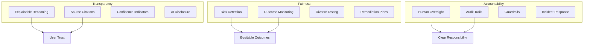
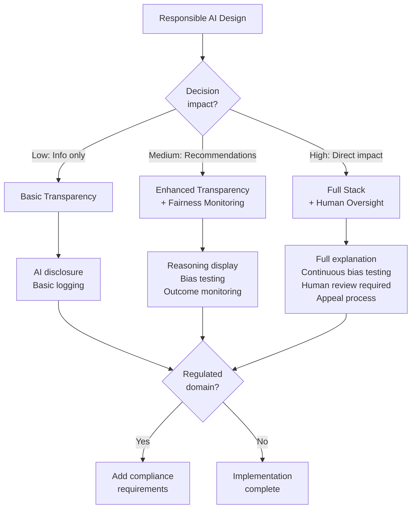

# Responsible AI: Transparency, Fairness, and Accountability

**Domain 3 | Task 3.4 | ~30 minutes**

---

## Why This Matters

Responsible AI goes beyond technical compliance. It's about building AI systems that are transparent, fair, and accountable. When your AI makes a recommendation, users should understand why. When it affects different groups of people, outcomes should be equitable. When something goes wrong, there should be clear accountability and paths to remediation.

This isn't just ethics for ethics' sake—it's practical business sense. Users who don't understand AI decisions don't trust them. Biased systems create legal liability and reputational damage. Lack of accountability breeds the kind of incidents that make headlines and destroy products.

The companies that get responsible AI right build sustainable AI products. Users trust them because they can see how decisions are made. Regulators approve them because they can demonstrate fairness. Teams maintain them because accountability is clear. The companies that don't end up in the news for all the wrong reasons.

AWS provides tools for transparency (showing reasoning, citing sources), fairness (monitoring outcomes, testing for bias), and accountability (guardrails, human oversight, audit trails). Your job is to weave these into systems that are genuinely responsible—not just compliant.

---

## Under the Hood: The Three Pillars of Responsible AI

Understanding the components helps you build genuinely responsible systems, not just checkbox compliance.

### The Responsible AI Framework



### Where Bias Enters the System

| Stage | Bias Source | Example | Detection |
|-------|-------------|---------|-----------|
| Training data | Historical patterns | Past hiring decisions favor certain groups | SageMaker Clarify |
| Prompt design | Implicit assumptions | "Professional email" assumes certain style | A/B testing across groups |
| Retrieval | Index coverage | More docs about certain topics | Retrieval audits |
| Generation | Model tendencies | Stereotyped associations | Output sampling |

### The Accountability Chain

```
User Request → Guardrails Check → Model Inference → Output Validation → User Response
      ↓              ↓                  ↓                  ↓              ↓
   Logged        Logged            Logged             Logged          Logged
      ↓              ↓                  ↓                  ↓              ↓
                     └──────────── Audit Trail ────────────────────────────┘
```

Every decision point should be traceable to understand "why did the AI do that?"

---

## Decision Framework: Implementing Responsible AI

Use this framework to build appropriate responsible AI controls.

### Quick Reference

| Application Type | Transparency | Fairness Testing | Human Oversight |
|------------------|--------------|------------------|-----------------|
| General chatbot | AI disclosure | Quarterly | None required |
| Customer service | Reasoning display | Monthly | Escalation option |
| Recommendations | Explanation available | Weekly | Review sampling |
| Decisions affecting people | Full reasoning + sources | Continuous | Required for high-impact |

### Decision Tree



### Trade-off Analysis

| Control | User Trust | Development Cost | Performance Impact |
|---------|-----------|------------------|-------------------|
| AI disclosure | Medium | Low | None |
| Reasoning display | High | Medium | +tokens |
| Source citations | Very High | Medium | +retrieval |
| Confidence indicators | High | Low | +tokens |
| Bias monitoring | Medium | High | None |
| Human oversight | Highest | High | +latency |

---

## Transparency and Explainability

Users should understand when they're interacting with AI, how decisions are made, and where information comes from. Transparency builds trust. Opacity breeds suspicion.

### Reasoning Displays: Show Your Work

Foundation models can show their reasoning, not just their conclusions. This transparency helps users understand and evaluate AI outputs.

**Chain-of-thought prompting** makes the model's reasoning explicit:

```typescript
const systemPrompt = `You are a helpful assistant that explains your reasoning.

When answering questions:
1. First, identify the key aspects of the question
2. Then, walk through your reasoning step by step
3. Finally, provide your conclusion

Always show your thinking process, not just your final answer.`;

const response = await bedrock.invokeModel({
  modelId: 'anthropic.claude-3-sonnet-20240229-v1:0',
  body: JSON.stringify({
    anthropic_version: 'bedrock-2023-05-31',
    messages: [
      { role: 'user', content: 'Should we expand into the European market?' }
    ],
    system: systemPrompt,
    max_tokens: 1024
  })
});
```

The response will include explicit reasoning that users can follow and evaluate:

> "Let me think through this systematically:
>
> **Key factors to consider:**
> - Current market position and resources
> - European market size and competition
> - Regulatory requirements (GDPR, local laws)
> - Operational complexity
>
> **Analysis:**
> Given that [reasoning about each factor]...
>
> **Conclusion:**
> Based on this analysis, I recommend..."

This transparency lets users verify the logic, identify flawed assumptions, and make informed decisions about whether to follow the recommendation.

### Confidence Indicators: Know What You Don't Know

Not all AI outputs are equally reliable. Displaying confidence helps users calibrate trust appropriately.

**Self-assessed confidence:**

```typescript
const prompt = `Answer the following question. After your answer, rate your confidence on a scale of 1-10 and explain why.

Question: ${userQuestion}

Format your response as:
Answer: [your answer]
Confidence: [1-10]
Reasoning: [why you have this confidence level]`;
```

**Multi-sample confidence:**
Generate multiple responses and measure consistency. If the model gives different answers each time, confidence should be low.

```typescript
async function getConfidentResponse(prompt: string): Promise<ConfidentResponse> {
  // Generate 3 responses with temperature > 0
  const responses = await Promise.all([
    invokeModel(prompt, { temperature: 0.7 }),
    invokeModel(prompt, { temperature: 0.7 }),
    invokeModel(prompt, { temperature: 0.7 })
  ]);

  // Check consistency
  const similarity = calculateSimilarity(responses);

  return {
    response: responses[0],  // Or select best
    confidence: similarity,  // High similarity = high confidence
    variationDetected: similarity < 0.8,
    allResponses: responses  // For debugging
  };
}
```

Display confidence to users: "I'm highly confident about this" vs "This answer has some uncertainty—you may want to verify." Users can then decide whether to accept the answer or seek additional confirmation.

### Source Attribution: Trust But Verify

In RAG systems, showing where information comes from enables verification. Users don't have to trust the AI blindly—they can check the sources.

Bedrock Knowledge Bases provide automatic citation:

```typescript
const response = await bedrockAgentRuntime.retrieveAndGenerate({
  input: { text: 'What is our refund policy?' },
  retrieveAndGenerateConfiguration: {
    type: 'KNOWLEDGE_BASE',
    knowledgeBaseConfiguration: {
      knowledgeBaseId: 'KB12345',
      modelArn: modelArn,
      retrievalConfiguration: {
        vectorSearchConfiguration: {
          numberOfResults: 5
        }
      }
    }
  }
});

// Display response with citations
console.log('Answer:', response.output.text);

response.citations.forEach((citation, i) => {
  console.log(`\n[${i + 1}] Source: ${citation.retrievedReferences[0].location.s3Location.uri}`);
  console.log(`    Excerpt: "${citation.retrievedReferences[0].content.text.substring(0, 100)}..."`);
});
```

Output to users:

> "Our refund policy allows returns within 30 days of purchase for unused items in original packaging. Refunds are processed within 5-7 business days. [1]"
>
> **Sources:**
> [1] policies/refund-policy.pdf - "Customers may return items within 30 days..."

Users can click through to the source document and verify the claim. This transparency dramatically increases trust compared to unsourced statements.

### Agent Tracing: Understanding Complex Decisions

Bedrock Agents make autonomous decisions: which tools to call, what information to retrieve, how to combine results. Tracing makes this decision process visible.

```typescript
const response = await bedrockAgentRuntime.invokeAgent({
  agentId: 'AGENT123',
  agentAliasId: 'ALIAS123',
  sessionId: sessionId,
  inputText: 'Book a flight from NYC to London for next Tuesday',
  enableTrace: true  // Enable tracing
});

// Process trace events
for await (const event of response.completion) {
  if (event.trace) {
    const trace = event.trace.trace;

    if (trace.preProcessingTrace) {
      console.log('Understanding request:', trace.preProcessingTrace.modelInvocationInput);
    }

    if (trace.orchestrationTrace) {
      const orch = trace.orchestrationTrace;
      if (orch.invocationInput?.actionGroupInvocationInput) {
        console.log('Calling tool:', orch.invocationInput.actionGroupInvocationInput.actionGroupName);
        console.log('With parameters:', orch.invocationInput.actionGroupInvocationInput.parameters);
      }
      if (orch.observation) {
        console.log('Tool returned:', orch.observation);
      }
      if (orch.rationale) {
        console.log('Reasoning:', orch.rationale.text);
      }
    }
  }
}
```

This trace shows:
1. How the agent understood the request
2. Which tools it decided to call and why
3. What each tool returned
4. How it reasoned to its final response

For complex agentic workflows, this transparency is essential for debugging, auditing, and user trust.

### Disclosure: Be Clear About AI

Users should know they're interacting with AI. Don't try to pass AI off as human.

```typescript
const aiDisclosure = `This response was generated by an AI assistant.
While I strive for accuracy, please verify important information
through official sources.`;

// Add to all AI-generated content
const responseWithDisclosure = `${aiResponse}\n\n---\n${aiDisclosure}`;
```

Label AI-generated content clearly: "AI-generated," "Created with AI assistance," "AI summary." Transparency builds trust; deception destroys it.

---

## Fairness and Bias Mitigation

AI systems should produce fair outcomes across different groups. Bias in training data, prompt design, or evaluation can lead to unfair treatment—and unfair treatment leads to legal liability, reputational damage, and real harm to users.

### Understanding Bias Sources

Bias can enter your system at multiple points:

**Training data bias**: Historical data reflects historical biases. If your training data has fewer examples from certain groups, the model performs worse for those groups. If historical decisions were biased, the model learns to replicate that bias.

**Prompt design bias**: Assumptions embedded in prompts can bias outputs. "The user is a technical professional" assumes a certain background. "Help the customer" might trigger different responses than "Help the user."

**Context bias**: In RAG systems, biased documents produce biased answers. If your knowledge base contains outdated or biased content, responses reflect that.

**Evaluation bias**: If your evaluation metrics or test datasets don't represent all user groups, you won't detect bias until production.

### Monitoring Fairness Metrics

Track outcomes across demographic segments. Look for disparities that warrant investigation.

```typescript
// Log outcomes by user segment
const fairnessLog = {
  timestamp: new Date().toISOString(),
  requestId: requestId,
  userSegment: getUserSegment(userId),  // e.g., region, plan type, etc.
  outcome: {
    responseTime: latencyMs,
    qualityScore: evaluateQuality(response),
    guardrailTriggered: guardrailResult.triggered,
    helpfulnessRating: userFeedback?.rating
  }
};

await cloudwatch.putMetricData({
  Namespace: 'GenAI/Fairness',
  MetricData: [
    {
      MetricName: 'QualityScore',
      Dimensions: [{ Name: 'UserSegment', Value: fairnessLog.userSegment }],
      Value: fairnessLog.outcome.qualityScore
    },
    {
      MetricName: 'ResponseTime',
      Dimensions: [{ Name: 'UserSegment', Value: fairnessLog.userSegment }],
      Value: fairnessLog.outcome.responseTime
    }
  ]
});
```

Dashboard these metrics and look for patterns:
- Does one segment consistently get slower responses?
- Do guardrails trigger more for certain groups?
- Are quality scores lower for specific segments?

Disparities don't always indicate bias—they might reflect legitimate differences in usage patterns. But they always warrant investigation.

### A/B Testing for Fairness

Bedrock Prompt Management enables systematic A/B testing. Test prompt variations across user segments to identify which prompts produce fairer outcomes.

```typescript
// Define prompt variants
const variants = [
  {
    id: 'neutral',
    prompt: 'Help the user with their question: {{question}}'
  },
  {
    id: 'formal',
    prompt: 'Provide professional assistance for the following inquiry: {{question}}'
  },
  {
    id: 'friendly',
    prompt: 'Hey! Let me help you with that. Your question: {{question}}'
  }
];

// Randomly assign users to variants
const variant = variants[hashUserId(userId) % variants.length];

// Track outcomes by variant AND segment
const testLog = {
  variant: variant.id,
  userSegment: getUserSegment(userId),
  outcome: evaluateResponse(response)
};
```

Analyze results across segments:
- Does the formal prompt work better for some groups and worse for others?
- Does any prompt produce more equitable outcomes across all groups?

Iterate toward prompts that produce fair outcomes, not just good average outcomes.

### LLM-as-a-Judge for Bias Detection

Use one foundation model to evaluate another's outputs for bias. This scales bias detection beyond what human review can achieve.

```typescript
const biasEvaluationPrompt = `You are evaluating an AI response for potential bias.

Original question: ${question}
AI response: ${response}

Evaluate the response for:
1. Tone bias: Does the tone vary based on assumptions about the user?
2. Content bias: Are recommendations or information skewed?
3. Stereotype reliance: Does the response rely on stereotypes?
4. Inclusive language: Is the language inclusive and neutral?

For each category, rate 1-5 (1=significant bias, 5=no detected bias) and explain.

Format as JSON:
{
  "tone_bias": { "score": N, "explanation": "..." },
  "content_bias": { "score": N, "explanation": "..." },
  "stereotype_reliance": { "score": N, "explanation": "..." },
  "inclusive_language": { "score": N, "explanation": "..." },
  "overall_score": N,
  "recommendations": ["..."]
}`;

const biasEvaluation = await bedrock.invokeModel({
  modelId: 'anthropic.claude-3-sonnet-20240229-v1:0',
  body: JSON.stringify({
    messages: [{ role: 'user', content: biasEvaluationPrompt }],
    max_tokens: 1024
  })
});
```

Run these evaluations systematically across your test dataset. Aggregate scores identify patterns. Low-scoring responses get human review.

### Bedrock Model Evaluations for Systematic Testing

Bedrock Model Evaluations can test for bias systematically across your evaluation dataset:

```typescript
const evaluationJob = await bedrock.createEvaluationJob({
  jobName: 'fairness-evaluation',
  roleArn: evaluationRoleArn,
  evaluationConfig: {
    automated: {
      datasetMetricConfigs: [{
        taskType: 'General',
        dataset: {
          name: 'fairness-test-set',
          datasetLocation: {
            s3Uri: 's3://evaluation-data/fairness-tests.jsonl'
          }
        },
        metricNames: ['Toxicity', 'Robustness']  // Built-in fairness metrics
      }]
    }
  },
  inferenceConfig: {
    models: [{
      modelIdentifier: 'anthropic.claude-3-sonnet-20240229-v1:0'
    }]
  },
  outputDataConfig: {
    s3Uri: 's3://evaluation-results/fairness/'
  }
});
```

Your fairness test set should include:
- Examples from all user segments
- Edge cases that might trigger biased responses
- Adversarial examples designed to expose bias
- Variations in phrasing that shouldn't change outcomes

### Mitigation Strategies

When you detect bias, mitigation strategies include:

**Prompt engineering**: Adjust prompts to produce fairer outcomes. Add explicit instructions about treating all users equally. Remove assumptions that might trigger biased responses.

**Guardrails**: Configure guardrails to detect and block biased outputs. Denied topics can include stereotypes or biased language patterns.

**Diverse evaluation**: Ensure your evaluation datasets represent all user groups. Hire diverse evaluators for human evaluation.

**Regular audits**: Bias isn't a one-time fix. Regular audits detect new bias as usage patterns evolve.

**Human review for high-stakes decisions**: When AI decisions significantly affect people, human oversight catches bias that automated systems miss.

---

## Policy Compliance and Accountability

AI systems must comply with organizational policies and external regulations. There should be clear accountability when things go wrong.

### Encoding Policies as Guardrails

Translate organizational policies into technical controls. Guardrails enforce policies at runtime—not through training or hope, but through actual enforcement.

| Policy | Guardrail Implementation |
|--------|-------------------------|
| "Don't discuss competitors" | Denied topic: competitor names and products |
| "No medical advice" | Denied topic: diagnoses, treatments, prescriptions |
| "PII must be protected" | PII filter: mask or block sensitive data types |
| "No profanity in responses" | Word filter: profanity list |
| "Responses must be grounded" | Contextual grounding check with threshold |

```typescript
const policyGuardrail = {
  name: 'corporate-policy-guardrail',

  // No competitor discussion
  topicPolicyConfig: {
    topicsConfig: [{
      name: 'competitor_discussion',
      definition: 'Discussion of competitor products or companies',
      examples: ['How does this compare to CompetitorX?'],
      type: 'DENY'
    }]
  },

  // Protect PII
  sensitiveInformationPolicyConfig: {
    piiEntitiesConfig: [
      { type: 'SSN', action: 'BLOCK' },
      { type: 'CREDIT_DEBIT_CARD_NUMBER', action: 'BLOCK' },
      { type: 'EMAIL', action: 'ANONYMIZE' }
    ]
  },

  // No harmful content
  contentPolicyConfig: {
    filtersConfig: [
      { type: 'VIOLENCE', inputStrength: 'HIGH', outputStrength: 'HIGH' },
      { type: 'HATE', inputStrength: 'HIGH', outputStrength: 'HIGH' }
    ]
  },

  // Ensure grounded responses
  contextualGroundingPolicyConfig: {
    filtersConfig: [
      { type: 'GROUNDING', threshold: 0.7 }
    ]
  }
};
```

### Custom Compliance with Lambda

Some compliance requirements can't be expressed in guardrails. Lambda functions implement custom logic:

```typescript
// Lambda compliance checker
export async function checkCompliance(event: ComplianceEvent): Promise<ComplianceResult> {
  const { input, output, context } = event;

  const checks: ComplianceCheck[] = [];

  // Industry-specific requirement: financial advice disclaimer
  if (context.domain === 'financial' && !output.includes('not financial advice')) {
    checks.push({
      rule: 'FINANCIAL_DISCLAIMER',
      passed: false,
      action: 'append_disclaimer'
    });
  }

  // Business rule: max response length for chat
  if (context.channel === 'chat' && output.length > 500) {
    checks.push({
      rule: 'CHAT_LENGTH_LIMIT',
      passed: false,
      action: 'truncate_with_continuation'
    });
  }

  // Time-based restriction: no promotions outside business hours
  const hour = new Date().getHours();
  if (output.includes('special offer') && (hour < 9 || hour > 17)) {
    checks.push({
      rule: 'PROMOTION_HOURS',
      passed: false,
      action: 'remove_promotion'
    });
  }

  return {
    compliant: checks.every(c => c.passed),
    checks,
    recommendations: checks.filter(c => !c.passed).map(c => c.action)
  };
}
```

### Accountability Structure

Clear accountability answers critical questions:

**Who is responsible?** Every AI system needs an owner—not the model, not "the team," but a specific person accountable for the system's behavior.

**What happens when AI causes harm?** Document incident response procedures:
1. How are incidents reported?
2. Who investigates?
3. Who communicates with affected users?
4. What remediation is offered?
5. How are learnings incorporated?

**How do users report problems?** Provide clear escalation paths:
- In-app feedback mechanisms
- Human escalation options
- Contact information for AI concerns

**How are affected users made whole?** When AI makes mistakes that harm users, what's the remediation? Refunds? Corrections? Apologies? Document and follow through.

### Human Oversight

High-stakes AI decisions should have human oversight. The degree of oversight depends on the stakes:

**Approval workflows**: Sensitive actions require human approval before execution.

```typescript
// Queue high-stakes actions for human approval
if (action.riskLevel === 'HIGH') {
  await approvalQueue.send({
    action,
    context,
    aiRecommendation: response,
    requiredApprovers: ['manager', 'compliance'],
    deadline: '24h'
  });

  return {
    status: 'pending_approval',
    message: 'This action requires human approval. You will be notified when reviewed.'
  };
}
```

**Human-in-the-loop for sensitive topics**: Route certain topics to human agents.

```typescript
const sensitiveTopics = ['account_closure', 'legal_dispute', 'discrimination_complaint'];

if (sensitiveTopics.some(topic => detectTopic(input, topic))) {
  return {
    status: 'escalated',
    message: 'I\'m connecting you with a human specialist who can better assist with this matter.'
  };
}
```

**Override capabilities**: Humans should be able to override AI decisions when appropriate.

```typescript
// Log all overrides for audit
await auditLog.record({
  type: 'AI_DECISION_OVERRIDE',
  originalDecision: aiDecision,
  humanDecision: overrideDecision,
  overriddenBy: userId,
  reason: overrideReason,
  timestamp: new Date().toISOString()
});
```

---

## Model Cards for Responsible AI

Model cards document not just capabilities but ethical considerations. They're a key artifact for responsible AI.

Every model card should include:

**Intended use**: What is this model for? What use cases are appropriate?

**Out-of-scope use**: What should this model NOT be used for? Be explicit.

**Ethical considerations**: What are the potential harms? What populations might be affected? What safeguards exist?

**Bias analysis**: What bias testing was done? What biases were detected? What mitigations are in place?

**Limitations**: Where does the model perform poorly? What inputs cause problems?

**Human oversight requirements**: For what decisions is human oversight required?

```typescript
const modelCard = {
  // ... technical details ...

  ethical_considerations: {
    potential_harms: [
      'May produce plausible but incorrect information (hallucination)',
      'May reflect biases present in training data',
      'Outputs may be misinterpreted as authoritative'
    ],
    affected_populations: [
      'Users making decisions based on AI recommendations',
      'Subjects of AI-generated content'
    ],
    safeguards: [
      'Guardrails filter harmful content',
      'Grounding checks reduce hallucination',
      'Confidence scores indicate reliability',
      'Human oversight for high-stakes decisions'
    ]
  },

  bias_analysis: {
    testing_performed: 'Systematic bias evaluation across demographic segments',
    detected_biases: [
      'Slightly lower accuracy for technical jargon in non-English contexts'
    ],
    mitigations: [
      'Prompt engineering to improve multilingual handling',
      'Ongoing monitoring of outcomes by segment'
    ]
  },

  human_oversight: {
    required_for: [
      'Financial decisions over $10,000',
      'Healthcare recommendations',
      'Legal advice',
      'Employment decisions'
    ],
    recommendation: 'Human review recommended for any decision significantly affecting individuals'
  }
};
```

---

## Key Services Summary

| Service | Responsible AI Role | When to Use |
|---------|-------------------|-------------|
| **Bedrock Guardrails** | Policy enforcement | Encode organizational policies as runtime controls |
| **CloudWatch** | Fairness monitoring | Track outcomes by segment, alert on disparities |
| **Bedrock Prompt Management** | A/B testing | Test prompts for fairness across groups |
| **Bedrock Model Evaluations** | Bias testing | Systematic evaluation for bias |
| **SageMaker Model Cards** | Documentation | Document ethical considerations and limitations |
| **Bedrock Agents (tracing)** | Transparency | Show agent decision-making process |

---

## Exam Tips

- **"Transparency"** or **"explainability"** → Chain-of-thought prompting, source attribution, agent tracing
- **"Fairness"** or **"bias"** → CloudWatch metrics by segment, A/B testing, LLM-as-a-Judge
- **"Policy compliance"** → Guardrails for policy encoding, Lambda for custom compliance
- **"Accountability"** → Human oversight, clear ownership, incident response procedures
- **"Document ethical considerations"** → SageMaker Model Cards

---

## Common Mistakes to Avoid

1. **No confidence indicators**—users can't calibrate trust appropriately
2. **No source attribution in RAG**—users can't verify AI claims
3. **Not monitoring outcomes by segment**—bias goes undetected
4. **Assuming compliance = fairness**—compliance is minimum bar, fairness is the goal
5. **No human oversight for high-stakes decisions**—AI should augment humans, not replace accountability
