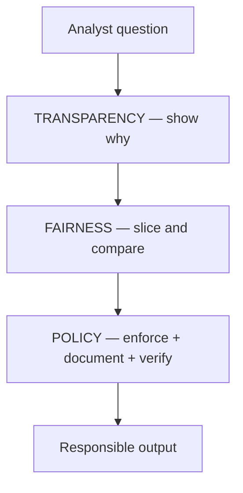

# Implement Responsible AI Principles

**Domain 3 · Task 3.4 · Skills 3.4.1–3.4.3**

Safety is the bouncer ([3.1](/learn/3/input-output-safety)). Privacy is who may see the bytes ([3.2](/learn/3/data-security-privacy)). Governance is the archive the auditor exports ([3.3](/learn/3/governance-compliance)). Task 3.4 is whether the *product* is **understandable**, **measured for bias**, and **honest about what it is not** — and whether those claims are wired to AWS artifacts, not a values slide.

The running example is still the blotter. Two tickers, same prompt: the assistant is harsher on one sector for no reason in the filings. An analyst asks “why this NVDA summary?” A board asks “show that we do not give personal trading advice.” A bigger model is not “more responsible.” Process is.

Three jobs, in that order:

```text
SHOW WHY      reasoning the user can see, uncertainty you can quantify, sources, agent traces
MEASURE FAIR  sliced metrics, systematic A/B, LLM-as-a-judge
LOCK POLICY   Guardrails from the written policy, cards for limitations, Lambda that checks they still match
```


```mermaid
flowchart TD
    U[Analyst question] --> T[TRANSPARENCY — show why]
    T --> F[FAIRNESS — slice and compare]
    F --> P[POLICY — enforce + document + verify]
    P --> A[Responsible output]
```

| Skill | Official examples | Exam tell |
|-------|-------------------|-----------|
| **3.4.1** Transparency | Reasoning displays; CloudWatch confidence / uncertainty; evidence / source attribution; Bedrock **agent tracing** | User or debugger must *see the path* |
| **3.4.2** Fairness | CloudWatch fairness metrics; Prompt Management + **Prompt Flows** A/B; Bedrock **LLM-as-a-judge** evals | Same prompt, different groups / variants, scored |
| **3.4.3** Policy compliance | Guardrails from policy; **model cards** for FM limits; **Lambda** automated compliance checks | Document + enforce + *verify they still agree* |

> **Exam tip:** Asking the model “explain yourself” is not a trace. `enableTrace` on `InvokeAgent` is. A PDF of principles is not 3.4.3. Guardrails + cards + Lambda that diffs config against the card is.

---

## Skill 3.4.1 — Make FM outputs transparent

**Transparency** is an artifact in the UI or the debug stream, not a paragraph in a design doc. The skill names four: reasoning displays, confidence metrics in CloudWatch, source evidence, agent traces.

### Reasoning displays — show work the user can evaluate

Foundation models can emit a conclusion with no path. A **reasoning display** is the user-facing walk: what was asked, which facts were used, how the conclusion follows. Chain-of-thought *prompting* is one way to get that text. It is a **product choice**. Some desks forbid leaking the scratchpad (trading, legal). Then you show a *structured* explanation (bullets, cited claims), not the raw internal monologue.

Do not confuse three “whys”:

| Artifact | What it actually shows |
|----------|------------------------|
| User-facing reasoning / CoT | A narrative the model wrote. Can be fluent and wrong. |
| **Agent trace** (`enableTrace`) | What the agent **did**: preprocess, orchestration, which tool, observation, final answer. |
| Clarify SHAP | Which *feature* moved a tabular score. Not a 10-K URI. |

If the stem is “trace agent decision-making / which tool / why retrieve,” pick **tracing**. Self-explanation adds tokens and may not match the real path. CloudWatch **metrics** are aggregates, not one turn’s path.

```python
resp = agents.invoke_agent(
    agentId="blotter",
    agentAliasId="prod",
    sessionId=session,
    inputText="Why did we cut the NVDA target?",
    enableTrace=True,
)
# orchestrationTrace: action groups, observations — the real path
```

### CloudWatch — quantify uncertainty, do not just print “I’m 80% sure”

Skill 3.4.1 names **CloudWatch to collect confidence metrics and quantify uncertainty**. That means you **emit numbers** per turn (or per batch) and alarm when they move:

```text
grounding_score          Guardrails contextual grounding / your citation check
self_confidence          if you ask the model — treat as a signal, not truth
citation_density         claims with a retrieved URI / total claims
refusal_rate             “not in the filings” vs invented answers
low_confidence_escalations   routed to a human
```

Put custom metrics on a dashboard. An analyst seeing “low grounding — I don’t have that in the 10-K” is transparency. A silent fluent paragraph is not.

Uncertainty you cannot measure is theater. Log the score with the request id (3.3 decision log). Restrict who sees traces that contain tool arguments.

### Evidence presentation — source attribution

RAG citations are the user-facing half of 3.3.2. Here they are a **responsible-AI control**: show the chunk, the URI, the date. “According to NVDA FY26 Q1 10-K, Item 7…” beats a confident tone. If retrieval is empty, the honest display is **insufficient evidence**, not a quieter hallucination.

Metadata on chunks (effective date, classification) can drive what you are even allowed to show.

```quickcheck
Q: The blotter agent called three tools and the analyst wants to know *which* and in what order. A teammate adds “think step by step” to the system prompt. What does 3.4.1 want?
A: The CoT paragraph is sufficient
B: `enableTrace=True` on InvokeAgent (orchestration / tool traces). Optional: a cleaned reasoning display in the UI that cites sources
C: CloudTrail LookupEvents
D: SageMaker Clarify
correct: B
feedback: Tracing is the decision path. CoT is a story. Trail is who called the API. Clarify is tabular features.
```

```recall
Q: Where do confidence and uncertainty live for this skill?
A: Custom CloudWatch metrics (grounding, refusal, citation density) you emit and alarm — not a vibe in the prose.
```

```fillin
Agent tracing requires {{enableTrace}} on InvokeAgent. CloudWatch metrics will not reconstruct one tool path.
```

---

## Skill 3.4.2 — Evaluate fairness, do not assume it

**Fairness** here is *unbiased FM outputs* across groups and variants — not only SageMaker Clarify on a credit ranker (that pairing is 3.3.4). The blueprint names three mechanisms: **pre-defined fairness metrics in CloudWatch**, **Prompt Management + Prompt Flows for systematic A/B**, **Bedrock LLM-as-a-judge** for automated eval.

Two tickers, same prompt. Slice the golden set: NVDA vs a small-cap, US vs non-US issuer, male vs female coded names in a résumé copilot. Compare faithfulness, refusal rate, toxicity, “insufficient evidence” rate. If one slice is punished or hallucinated more, that is the finding.

### CloudWatch fairness metrics

Define the metric **before** you collect it. Examples you actually put on a dashboard:

| Metric | Slice |
|--------|--------|
| Refusal / hedging rate | issuer size, sector, geography |
| Toxicity / insult scores | demographic cues in the prompt |
| Grounding failure rate | language of the filing |
| Escalation to human | user cohort |

Emit `FairnessRefusal` with a dimension `slice=small_cap`. Alarm when the gap vs the reference slice exceeds a threshold. That is “pre-defined fairness metrics in CloudWatch” — you own the definition; CloudWatch stores, graphs, and alarms.

Clarify remains the right logo when the stem is a **tabular SageMaker endpoint** and bias *drift vs training baseline*. Do not reach for Clarify to score two Claude wordings.

### Systematic A/B — Prompt Management and Prompt Flows

Playground vibes are not an experiment.

**Prompt Management:** **variants compete, versions preserve.** Up to three variants (wording A vs B, Nova vs Claude, temperature 0.1 vs 0.2) on the same variables. Score them on the **sliced** golden set. Promote a **version** only if the fairness bar holds, not just mean accuracy. There is no `prod` alias on prompts — the app pins a version ARN.

**Prompt Flows:** the GenAI graph (prompts, conditions, KB, Lambda). Use it to **route traffic or eval batches** through variant nodes, collect outputs, and keep the experiment in one governed flow (Flows **do** have aliases). Systematic A/B is a graph + a scoreboard, not two Lambdas someone forgot to turn off.

A/B without a golden set is two anecdotes. A golden set without slices hides the bias.

### LLM-as-a-judge — automated model evaluations

**Amazon Bedrock model evaluations** (and the LLM-as-a-judge pattern) score outputs against a **pinned rubric**: correctness, completeness, harm, faithfulness to the filing, “did we refuse personal advice?” Run on the sliced set. Humans still sample harm and tone; the judge scales the rest.

Pin the judge model and the rubric version. A judge that drifts is a new bias source. Use it for **unlabeled** FM quality (3.3.4 said the same for drift proxies). Do not use the *same* model as generator and sole judge on a high-stakes fairness claim without a human sample.

```quickcheck
Q: You must check that a prompt rewrite is not harsher on small-cap names, systematically. Least “two intern laptops.”
A: Ship it; eyeball five examples
B: Prompt Management variants (or a Flow) A/B’d on a sliced golden set; Bedrock LLM-as-a-judge on the rubric; CloudWatch metrics per slice
C: SageMaker Clarify SHAP on the prompt text
D: Disable Guardrails so the judge sees everything
correct: B
feedback: 3.4.2 is that trio. Clarify is the wrong why. Guardrails stay on; they are not the fairness experiment.
```

```recall
Q: Variants vs versions in Prompt Management?
A: Variants compete (the A/B). Versions preserve (the snapshot you pin). Fail fairness on a slice → do not promote.
```

---

## Skill 3.4.3 — Policy-compliant systems: document, enforce, verify

Responsible practice is a **written policy** (no personal trading advice, no medical diagnosis, disclose AI, cite or refuse). 3.4.3 is the three-piece machine that makes the policy true at runtime and still true next quarter.

The board stem on this exam wants **all three**, working together:

| Piece | Job | AWS |
|-------|-----|-----|
| **Document** limitations and intended use | What this FM deployment is and is not | **SageMaker Model Cards** |
| **Enforce** at every invocation | Denied topics, content, PII, prompt-attack | **Bedrock Guardrails** mapped *from the policy* |
| **Verify** continuously | Config in prod still matches the card / policy | **Lambda** compliance checks |

A PDF of principles is documentation without teeth. Guardrails alone are teeth without an intended-use record. Weekly human sampling is neither automated nor complete.

### Guardrails based on policy requirements

Start from the policy sentence, then pick the policy *type* (3.1):

```text
“No personalized investment advice”     → denied topic + examples
“No hate / harassment in the blotter”   → content filters
“Do not echo client PANs”               → sensitive information block/mask
“Do not follow jailbreaks”              → prompt-attack filter
```

Pin a **version**. Attach on Converse / Agent / Flow. Least ops for runtime policy is native Guardrails, not a homemade moderator (3.1.4).

### Model cards for FM limitations

Same artifact as 3.3.1, used here as a **responsible-AI** control: out-of-scope uses (“not investment advice”), known failure modes (weak on small-caps, no live quotes), eval slices, guardrail ID + version, owner. For a Bedrock base model you did not train, the card still documents **your application**. Update it in CI/CD when the prompt or guardrail version moves.

### Lambda — automated compliance checks

The skill’s Lambda is not “rewrite the essay.” It is **deterministic verification** that runtime still matches paper, for example:

- Guardrail `DRAFT` is not what prod pins; prod ARN equals the card field
- Denied-topic list still contains “personalized trading advice”
- Every completion includes the required disclaimer
- A required citation block is present, or the turn was a documented refusal
- Invoke `GetGuardrail` / list attachments and fail the pipeline if drift

```python
DISCLAIMER = "Not investment advice. Based on public filings only."

def enforce(text: str) -> str:
    if DISCLAIMER not in text:
        return text.rstrip() + "\n\n" + DISCLAIMER
    return text
```

Structural checks belong in Lambda. Semantic “is this actually advice?” still wants Guardrails + eval. Together: Guardrails on the call, Lambda on the contract, card for the human reader.

```quickcheck
Q: Board wants documentation of limits, runtime prevention of harmful outputs, and automated proof that enforcement still matches the docs. One governed system.
A: A beautiful PDF
B: Guardrails only
C: Guardrails + SageMaker Model Cards + Lambda checks that config matches the card
D: A compliance officer sampling Fridays
correct: C
feedback: Official 3.4.3 trio. PDF and sampling fail “automated verification.” Guardrails alone skip documentation and drift-from-doc.
```

```fillin
Lambda compliance checks are deterministic (disclaimer present, guardrail version == card). They do not replace {{Guardrails}} for semantic policy on the live call.
```

---

## When to use which

| Stem | Pick |
|------|------|
| User must see *why* / sources | Reasoning display + **citations** |
| Which tool did the agent call? | **`enableTrace`** on InvokeAgent |
| Quantify uncertainty / confidence | **CloudWatch** custom metrics |
| Fairness across groups for an FM | Sliced golden set + **CW metrics** + judge |
| Tabular endpoint bias over time | Model Monitor + **Clarify** (3.3.4) |
| Systematic prompt A/B | **Prompt Management variants** and/or **Prompt Flows** |
| Score unlabeled outputs at scale | Bedrock **LLM-as-a-judge** / model eval |
| Runtime “must not” | **Guardrails** from the policy |
| Intended use / limitations | **Model Card** |
| Config still matches the card | **Lambda** compliance check |
| Document + enforce + verify | **Cards + Guardrails + Lambda** |

---

## AWS service glossary

### Transparency

#### Reasoning display (application)

**What it is.** User-visible explanation: steps, cited claims, or structured “because.”

**Problem it solves.** Opaque completions erode trust and fail “explain this output.”

**Where it sits.** 3.4.1 UI layer. Prompt for CoT or post-process a summary of the trace.

**Typical use.** Blotter: three bullets from Item 7, then the conclusion.

**Pricing.** Extra output tokens if you ask for CoT.

**Exam cue.** Show work. Not a substitute for `enableTrace`. Some policies forbid raw scratchpads.

**Do not confuse with.** Agent traces. Clarify SHAP. CloudTrail.

#### Amazon Bedrock Agents (`enableTrace`)

**What it is.** Orchestration trace: preprocess, reasoning, action-group calls, observations.

**Problem it solves.** The real decision path for an agentic blotter.

**Where it sits.** 3.4.1 (also 2.1 / 4.3 / 5.2 debug).

**Typical use.** `enableTrace=True`; parse `orchestrationTrace` for tool names.

**Pricing.** Same as the agent invoke; traces can contain sensitive tool args — IAM the logs.

**Exam cue.** “Trace agent decision-making.” Metrics are aggregates. Self-explanation is unreliable.

**Do not confuse with.** Guardrail trace (which policy fired). X-Ray (latency hops).

#### Amazon CloudWatch (confidence / fairness metrics)

**What it is.** Custom metrics and alarms you define: grounding, confidence, refusal-by-slice.

**Problem it solves.** Quantify uncertainty (3.4.1) and fairness gaps (3.4.2).

**Where it sits.** Both skills. Dashboards + anomaly detection.

**Typical use.** Dimension `ticker_cap=small`; alarm if refusal gap > 10 pp.

**Pricing.** Custom metrics / dashboards.

**Exam cue.** Pre-defined fairness metrics *in CloudWatch* — you emit them.

**Do not confuse with.** CloudTrail. Invocation logging (bodies). Clarify (SageMaker bias job).

### Fairness / eval

#### Amazon Bedrock Prompt Management

**What it is.** Versioned prompts, variables, **variants** (compete), versions (preserve).

**Problem it solves.** Systematic A/B of wording / model / temperature on a golden set.

**Where it sits.** 3.4.2 (and 1.6).

**Typical use.** Three variants, sliced eval, pin version ARN if fairness holds.

**Pricing.** Prompt storage; inference still bills the FM.

**Exam cue.** Variants = experiment. No `prod` alias.

**Do not confuse with.** Prompt Flows (graph + alias). Guardrails.

#### Amazon Bedrock Prompt Flows

**What it is.** Visual / graph orchestration of prompts, conditions, KB, Lambda; **aliases**.

**Problem it solves.** Repeatable A/B or routing inside one governed flow.

**Where it sits.** 3.4.2 systematic testing; 1.6.6 workflows.

**Typical use.** Eval traffic split across two prompt nodes; alias `fairness-exp`.

**Pricing.** Flow runs + downstream FM.

**Exam cue.** Named next to Prompt Management for A/B. Alias exists here.

**Do not confuse with.** Step Functions (durable app workflow). Agents (model picks the next tool).

#### Amazon Bedrock Model Evaluations (LLM-as-a-judge)

**What it is.** Automatic / human / model-as-judge jobs on a dataset and rubric.

**Problem it solves.** Scale fairness and quality scoring without a label factory.

**Where it sits.** 3.4.2; drift proxies in 3.3.4 / 5.1.

**Typical use.** Pinned judge + rubric on NVDA vs small-cap golden set.

**Pricing.** Judge tokens + job.

**Exam cue.** Automated model evaluations. Pin the judge. Human-sample harm.

**Do not confuse with.** Guardrail trace. Clarify.

### Policy

#### Amazon Bedrock Guardrails

**What it is.** Runtime policy on I/O, mapped from the written responsible-AI policy.

**Problem it solves.** Enforcement in 3.4.3 (and all of 3.1).

**Where it sits.** Enforce piece of document / enforce / verify.

**Typical use.** Denied topic “personalized investment advice,” version pinned in the card.

**Pricing.** Guardrail units.

**Exam cue.** Runtime prevention. Not the card. Not the Lambda diff.

**Do not confuse with.** A system prompt. Lambda disclaimer-only.

#### SageMaker Model Cards

**What it is.** Intended use, **limitations**, eval, guardrail version, owner.

**Problem it solves.** Documentation piece of 3.4.3 (and 3.3.1).

**Where it sits.** What the board reads; what Lambda compares against.

**Typical use.** “Not advice; public filings only; weak on illiquid names.”

**Pricing.** Card resource.

**Exam cue.** FM *application* limitations even when you did not train the base model.

**Do not confuse with.** Registry (deploy gate). A one-off PDF outside CI/CD.

#### AWS Lambda (compliance checks)

**What it is.** Deterministic post-check or pipeline check: disclaimer, citation present, GetGuardrail vs card.

**Problem it solves.** Automated verification that enforcement still matches documentation.

**Where it sits.** 3.4.3 verify piece.

**Typical use.** CI: fail if prod guardrail version ≠ card; runtime: append disclaimer.

**Pricing.** Invocations.

**Exam cue.** Automated compliance checks. Together with Guardrails + cards.

**Do not confuse with.** LLM-as-a-judge (semantic). The exclusive Bedrock proxy (3.1 trap).

---

## Practice questions

Pick an answer on every stem. The explanation appears after you choose — later questions stay unspoiled until you answer them.

```practice
Q: Analysts must see which Knowledge Base chunks grounded the NVDA summary. What 3.4.1 control?
A: CloudTrail only
B: Evidence presentation / citations in the UI (and in the decision log)
C: SCP
D: Macie
correct: B
feedback: Source attribution is the transparency artifact. Trail is who invoked. Macie is S3-at-rest.

Q: Debug which action group the blotter agent invoked. CoT in the user answer is proposed.
A: CoT is the official trace
B: enableTrace on InvokeAgent; parse orchestration traces
C: CloudWatch CPU
D: Model Registry
correct: B
feedback: Agent tracing is the skill example. CoT may not match tools used.

Q: Quantify uncertainty so low-grounding answers escalate. Where do the numbers go?
A: A Slack vibe check
B: CloudWatch confidence / grounding metrics + alarms
C: Lake Formation
D: Object Lock
correct: B
feedback: 3.4.1 names CloudWatch for confidence metrics.

Q: Same prompt, harsher refusals on small-cap names. How do you measure, not argue?
A: Ship a bigger FM
B: Slice the set; emit CloudWatch fairness metrics by dimension; LLM-as-a-judge on a pinned rubric
C: Deny all small-cap tickers in IAM
D: Disable citations
correct: B
feedback: 3.4.2 is sliced metrics + automated eval. Bigger is not fairer.

Q: Systematic A/B of two prompt wordings before prod. Tools named in the skill?
A: Two forgotten notebooks
B: Prompt Management variants and/or Prompt Flows, scored on the golden set
C: SageMaker Training
D: Direct Connect
correct: B
feedback: Variants compete; Flows can graph the experiment. Notebooks are not systematic.

Q: Board requires documentation of limits, runtime policy enforcement, and automated verification that configs still match the docs.
A: PDF only
B: Guardrails only
C: Guardrails + Model Cards + Lambda compliance checks
D: Quarterly sampling only
correct: C
feedback: Official 3.4.3 combination. All three capabilities in one governed system.

Q: Policy says no personalized trading advice. First runtime control?
A: A longer hope in the system prompt only
B: Guardrails denied topic (plus examples) from that policy sentence
C: Glue crawler
D: DataZone glossary
correct: B
feedback: Map policy → guardrail type. Prompts are not the seatbelt.

Q: Lambda’s job in 3.4.3 vs Guardrails?
A: Lambda replaces Guardrails
B: Lambda verifies contracts (disclaimer, version == card); Guardrails enforce semantic policy on the call
C: Lambda trains the FM
D: They are the same API
correct: B
feedback: Deterministic check vs managed I/O policy. You want both.

Q: Clarify vs CloudWatch fairness metrics on this task?
A: Always Clarify for Claude chat
B: CloudWatch custom fairness metrics (and Bedrock eval) for FM slices; Clarify (+ Monitor) for tabular SageMaker bias drift
C: Clarify tags S3
D: CloudWatch is only CPU
correct: B
feedback: Don’t steal 3.3.4’s endpoint stack for a prompt-fairness stem.

Q: LLM-as-a-judge with no pinned rubric and the same model as the generator. Risk?
A: None
B: The judge can drift or share the generator’s bias; pin rubric/model and human-sample harm
C: It violates Object Lock
D: It disables tracing
correct: B
feedback: Automated eval still needs a pinned bar. Humans still sample.

Q: Model card for a Bedrock app you did not train. Still required for 3.4.3?
A: No — cards are only for SageMaker Training
B: Yes — document *this deployment’s* intended use, limits, guardrail version
C: Only if you fine-tune
D: Replace it with CloudTrail
correct: B
feedback: Governance attaches to use. 3.3.1 said the same.

Q: Prompt v4 wins mean accuracy but tanks refusals on one demographic slice. Promote?
A: Yes — mean is what A/B is for
B: No — fairness bar is part of 3.4.2; do not promote
C: Yes if latency is better
D: Convert to an SCP
correct: B
feedback: Variants compete on the full sliced scoreboard, like 1.6 prompt QA.
```

---

## Final compressed review

### What are the three knobs?

1. **Transparency (3.4.1)** — reasoning the user can check; CloudWatch numbers for confidence/uncertainty; citations as evidence; `enableTrace` for the agent’s real path.
2. **Fairness (3.4.2)** — define slice metrics in CloudWatch; A/B with Prompt Management variants and Prompt Flows; Bedrock LLM-as-a-judge on a pinned rubric; humans still sample harm.
3. **Policy (3.4.3)** — write the rule → Guardrails enforce it → card documents limits → Lambda proves config still matches the card.

### What requirement words should trigger what choices?

“Show why / explain the output” → reasoning display + citations. “Which tool / agent path” → **enableTrace**. “Confidence / uncertainty” → **CloudWatch** metrics. “Unbiased / sliced / demographic” → fairness metrics + judge + A/B. “Systematic A/B of prompts” → **Prompt Management / Flows**. “Document + enforce + verify” → **cards + Guardrails + Lambda**. “Not investment advice” → denied topic from policy, then Lambda disclaimer check.

### What mistakes is AWS trying to tempt you into making?

CoT as a substitute for traces. Metrics as a substitute for one-turn traces. Clarify on a chat A/B. Promoting a prompt on mean score while a slice breaks. A PDF instead of the 3.4.3 trio. Guardrails without a card (or a card without runtime teeth). Lambda as the only semantic moderator. A bigger FM as a fairness strategy.

If you can walk the blotter out loud — citations on the summary, traces on the agent, grounding on a CloudWatch graph, an A/B that does not punish small-caps, a denied topic plus a card plus a Lambda that fails CI when versions drift — you own Task 3.4.

Domain 3 closes here. Operations and cost are Domain 4: [4.1 Cost Optimization](/learn/4/cost-optimization). Evaluation machinery in depth is [5.1](/learn/5/evaluation-systems).
