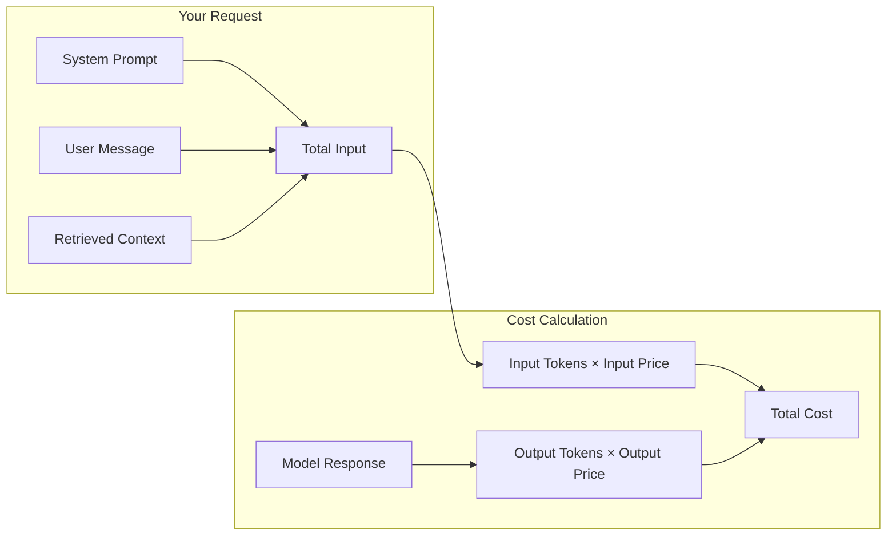
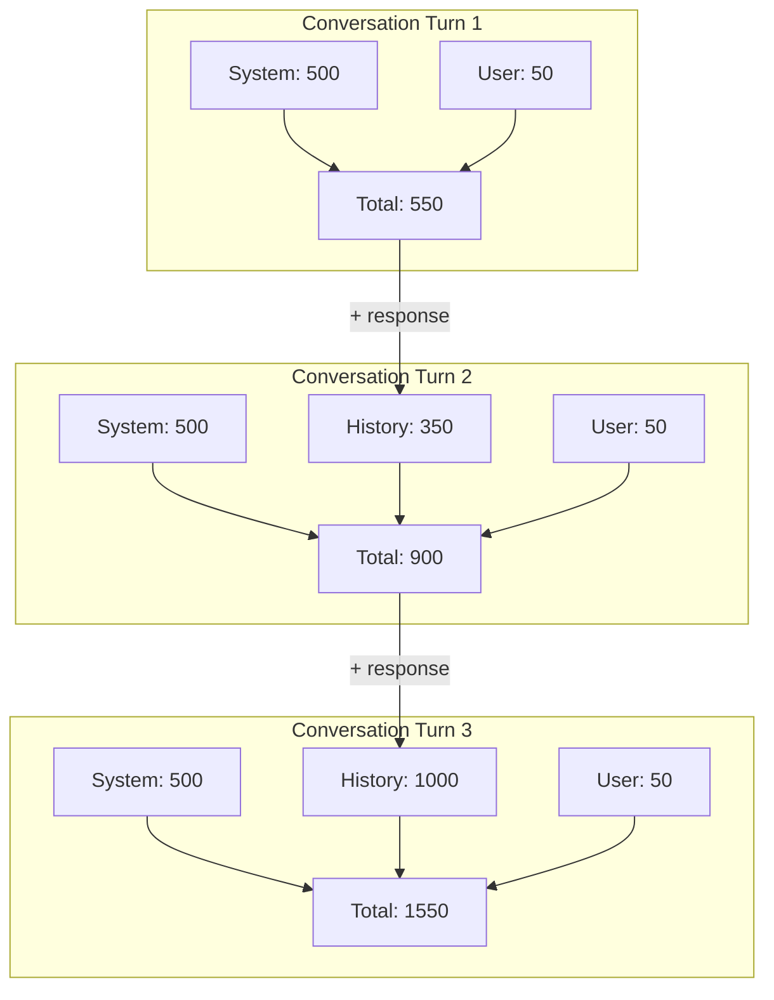
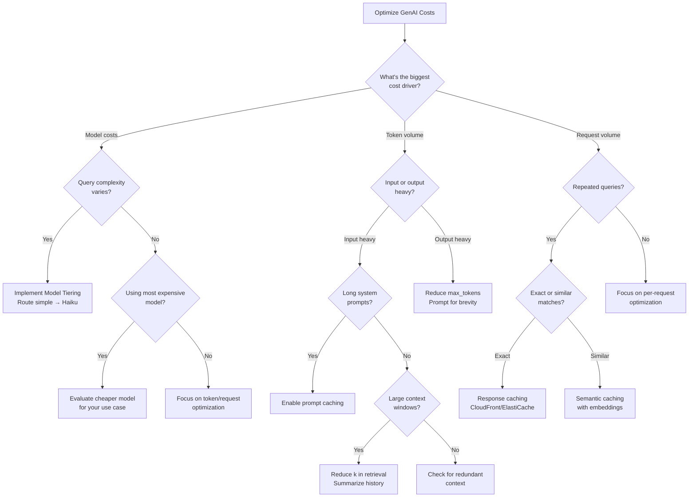

# Cost Optimization for GenAI Applications

**Domain 4 | Task 4.1 | ~35 minutes**

---

## Why This Matters

GenAI costs can spiral out of control faster than you'd believe possible. A single poorly-designed prompt that's 10x longer than necessary multiplies your costs by 10x. A conversational application that includes the entire conversation history in every request accumulates costs exponentially. A system that uses Claude Opus for simple FAQ queries burns money that could be spent on complex tasks where quality matters.

The difference between a well-optimized GenAI application and a naive one can be 10-100x in cost. That's not hyperbole—it's arithmetic. Token costs compound. Model choices compound. Caching opportunities missed compound. Organizations that don't actively optimize find themselves explaining to finance why their AI budget exploded.

The good news is that optimization is systematic. You measure token usage, identify waste, and apply specific techniques: model tiering routes queries to appropriate models, caching prevents redundant computation, prompt engineering reduces input tokens, and response controls limit output tokens. AWS provides the tools—Bedrock pricing tiers, CloudWatch metrics, ElastiCache for caching, prompt caching—but you need to apply them strategically.

This isn't about being cheap. It's about being smart. Every dollar saved on redundant computation is a dollar available for more sophisticated AI capabilities, better user experiences, or simply sustainable unit economics.

---

## Under the Hood: How GenAI Billing Actually Works

Understanding what drives costs helps you optimize systematically.

### The Cost Formula

Every Bedrock API call has this cost structure:



```
Total Cost = (Input Tokens × Input Price) + (Output Tokens × Output Price)
```

### Why Output Tokens Cost More

Output tokens are 3-5x more expensive because they require **sequential generation**:

| Phase | Processing | Cost Driver |
|-------|-----------|-------------|
| Input processing | Parallel (fast) | One forward pass |
| Output generation | Sequential (slow) | One forward pass **per token** |

A 1000-token response requires 1000 forward passes through the model. A 1000-token input requires just 1 forward pass. This fundamental asymmetry is why output costs more.

### Where Your Money Actually Goes

For a typical RAG query:

```
Input breakdown:
├── System prompt:     ~500 tokens  (fixed per request)
├── Retrieved context: ~2000 tokens (variable by k)
├── Conversation history: ~300 tokens (grows over time)
└── User query:        ~50 tokens   (small)
Total input: ~2850 tokens

Output: ~300 tokens (controllable via max_tokens)

With Claude 3.5 Sonnet:
- Input cost:  2850 × $3.00/1M = $0.00855
- Output cost: 300 × $15.00/1M = $0.0045
- Total: $0.01305 per query

With Claude 3.5 Haiku:
- Input cost:  2850 × $0.80/1M = $0.00228
- Output cost: 300 × $4.00/1M = $0.0012
- Total: $0.00348 per query

Haiku saves 73% while potentially delivering equivalent quality for simple queries.
```

### The Compounding Effect

Costs compound in ways that aren't obvious:



By turn 10, you might be sending 5000+ tokens per request—even though the user's message is still just 50 tokens.

### Prompt Caching Economics

Bedrock's prompt caching stores processed prompt prefixes. The economics:

| Scenario | Input Cost |
|----------|-----------|
| No caching | Full price |
| Cache write (first request) | Full price + small write cost |
| Cache read (subsequent) | ~90% discount on cached portion |

**Break-even:** If your system prompt is 1000 tokens and you make 10+ requests with the same prefix, prompt caching pays off.

---

## Decision Framework: Which Optimization to Apply

Use this framework to prioritize cost optimization efforts.

### Quick Reference

| Situation | Best Optimization | Expected Savings |
|-----------|------------------|------------------|
| Simple queries using expensive models | **Model tiering** | 50-90% |
| Repeated identical/similar queries | **Semantic caching** | Up to 100% (cache hits) |
| Long system prompts shared across requests | **Prompt caching** | 70-90% on cached portion |
| Long conversation histories | **Context summarization** | 30-60% |
| Unnecessarily verbose responses | **max_tokens + prompt instructions** | 20-50% |
| Bulk processing not time-sensitive | **Batch inference** | ~50% |
| High steady-state utilization | **Provisioned throughput** | 20-40% |

### Decision Tree



### Optimization Priority by Application Type

| Application Type | Priority 1 | Priority 2 | Priority 3 |
|------------------|-----------|-----------|-----------|
| Customer support chatbot | Model tiering | Semantic caching | Context summarization |
| Document Q&A (RAG) | Reduce retrieval k | Prompt caching | Model tiering |
| Content generation | Output token control | Model selection | Batch processing |
| Code assistant | Model tiering | Prompt caching | Response streaming |
| Bulk classification | Batch inference | Cheapest viable model | Parallel processing |

### Trade-off Analysis

| Optimization | Cost Savings | Implementation Effort | Quality Risk |
|--------------|-------------|----------------------|--------------|
| Model tiering | High (50-90%) | Medium | Medium (if misrouted) |
| Semantic caching | High (cache hits) | Medium-High | Low |
| Prompt caching | Medium (70-90% on prefix) | Low | None |
| Context reduction | Medium (30-60%) | Low | Medium (if over-reduced) |
| max_tokens limits | Low-Medium (20-50%) | Low | Low (if set appropriately) |
| Provisioned throughput | Medium (20-40%) | Low | None |
| Batch inference | Medium (~50%) | Medium | None (same quality) |

### When NOT to Optimize

**Don't optimize prematurely:**
- Small-scale applications where total spend is < $100/month
- Early prototyping where requirements are still changing
- When quality is paramount and you haven't validated cheaper alternatives work

**Don't over-optimize:**
- Saving $0.001 per request isn't worth hours of engineering if you have 100 requests/day
- Cache infrastructure costs can exceed savings for low-volume applications

---

## Token Economics: Understanding What You're Paying For

Tokens are the fundamental unit of GenAI cost. Every character you send to a model costs tokens. Every character the model generates costs tokens. Understanding token economics is step one for optimization.

### How Tokens Work

Tokens aren't characters or words—they're pieces that tokenizers use to break down text. A rough approximation: 1 token ≈ 4 characters or 0.75 words. But this varies:
- Common words might be single tokens ("the", "and")
- Uncommon words might be multiple tokens ("optimization" = 2-3 tokens)
- Code often tokenizes inefficiently (special characters, formatting)

**Input tokens** are what you send: system prompts, user messages, retrieved context, conversation history. Input tokens are processed in parallel (fast) and typically cost less.

**Output tokens** are what the model generates. Output tokens are generated sequentially (slower) and typically cost more—often 3-5x more than input tokens.

### Bedrock Pricing Model

Bedrock uses pay-per-token pricing with different rates per model:

| Model | Input (per 1M tokens) | Output (per 1M tokens) |
|-------|----------------------|------------------------|
| Claude 3.5 Haiku | $0.80 | $4.00 |
| Claude 3.5 Sonnet | $3.00 | $15.00 |
| Claude 3 Opus | $15.00 | $75.00 |
| Titan Text Lite | $0.15 | $0.20 |
| Titan Text Express | $0.20 | $0.60 |

The 5x ratio between Haiku and Sonnet, and 5x again between Sonnet and Opus, means model selection has massive cost implications. A query that costs $0.001 with Haiku costs $0.025 with Opus—25x more.

### Tracking Token Usage

You can't optimize what you don't measure. CloudWatch metrics track token usage automatically for Bedrock:

```typescript
// CloudWatch metrics available for Bedrock
const metrics = [
  'InputTokenCount',      // Tokens in request
  'OutputTokenCount',     // Tokens in response
  'InvocationCount',      // Number of API calls
  'InvocationLatency',    // Time per request
];

// Create a dashboard for token visibility
const tokenDashboard = new cloudwatch.Dashboard(this, 'TokenDashboard', {
  dashboardName: 'GenAI-Token-Usage'
});

tokenDashboard.addWidgets(
  new cloudwatch.GraphWidget({
    title: 'Daily Token Usage',
    left: [
      new cloudwatch.Metric({
        namespace: 'AWS/Bedrock',
        metricName: 'InputTokenCount',
        statistic: 'Sum',
        period: Duration.days(1)
      }),
      new cloudwatch.Metric({
        namespace: 'AWS/Bedrock',
        metricName: 'OutputTokenCount',
        statistic: 'Sum',
        period: Duration.days(1)
      })
    ]
  })
);
```

Go further with custom metrics that track tokens by application, feature, or user segment:

```typescript
// Custom token tracking with dimensions
await cloudwatch.putMetricData({
  Namespace: 'GenAI/Tokens',
  MetricData: [
    {
      MetricName: 'TokensConsumed',
      Dimensions: [
        { Name: 'Application', Value: 'CustomerSupport' },
        { Name: 'Feature', Value: 'ChatBot' },
        { Name: 'Model', Value: 'claude-3-sonnet' }
      ],
      Value: inputTokens + outputTokens,
      Unit: 'Count'
    }
  ]
});
```

---

## Token Optimization Techniques

Once you're tracking tokens, optimize them systematically.

### Context Window Optimization

Context windows have limits (8K to 200K+ tokens depending on model), but more importantly, they have costs. Every token in context costs money. Don't waste context on irrelevant information.

**Selective Context Inclusion:**
Don't dump everything into context. For RAG systems, retrieve only the most relevant chunks. For conversation history, include recent turns in full but summarize older turns.

```typescript
// Good: Selective context
const relevantChunks = await retrieveTopK(query, k=3);  // Only top 3
const context = relevantChunks.map(c => c.text).join('\n\n');

// Bad: Dump everything
const allChunks = await retrieveTopK(query, k=20);  // Way more than needed
```

**Context Summarization:**
For long conversations, summarize older turns instead of including them verbatim:

```typescript
function buildConversationContext(history: Message[]): string {
  const recentTurns = history.slice(-4);  // Last 4 turns in full
  const olderTurns = history.slice(0, -4);

  if (olderTurns.length === 0) {
    return formatMessages(recentTurns);
  }

  // Summarize older turns
  const summary = `Previous conversation summary: The user asked about ${extractTopics(olderTurns)}. Key points discussed: ${extractKeyPoints(olderTurns)}.`;

  return summary + '\n\n' + formatMessages(recentTurns);
}
```

### Prompt Compression

Shorter prompts cost less. Compress without losing clarity.

**Remove Redundancy:**
```
// Verbose (45 tokens)
"You are a helpful AI assistant. Your job is to help users with their questions.
When answering questions, please be helpful and informative. Make sure to provide
accurate information in your responses."

// Compressed (15 tokens)
"You are a helpful assistant. Provide accurate, informative answers."
```

**Use Structured Formats:**
```
// Verbose instruction
"Please analyze the following text and identify any named entities such as
people, organizations, and locations. For each entity you find, provide the
entity text and its type."

// Structured format
"Extract entities from the text:
- Format: {entity: string, type: PERSON|ORG|LOCATION}
- Return JSON array"
```

**Abbreviate When Clear:**
Models understand common abbreviations. "Respond in 2-3 sentences" works as well as "Please provide a response that is between two and three sentences in length."

### Response Size Controls

Output tokens cost more than input tokens. Control response length explicitly.

**Set max_tokens:**
```typescript
const response = await bedrock.invokeModel({
  modelId: 'anthropic.claude-3-sonnet-20240229-v1:0',
  body: JSON.stringify({
    messages: [{ role: 'user', content: query }],
    max_tokens: 256,  // Limit response length
    // ...
  })
});
```

Choose max_tokens based on actual needs:
- Simple answers: 100-256 tokens
- Explanations: 256-512 tokens
- Detailed analysis: 512-1024 tokens
- Long-form content: 1024+ tokens

**Prompt for Brevity:**
```
"Answer in 2-3 sentences."
"Provide a brief summary."
"List the top 3 points only."
```

The model follows these instructions, generating fewer (and cheaper) tokens.

---

## Model Tiering: Right Model for the Right Job

Not every query needs your most capable (and expensive) model. Model tiering routes queries to appropriate models based on complexity.

### The Tiering Strategy

Think of models in tiers:

**Tier 1 - Simple (Haiku/Titan Lite):**
- FAQ responses
- Simple classification
- Basic summarization
- Routine formatting

**Tier 2 - Moderate (Sonnet/Titan Express):**
- Multi-step reasoning
- Code generation
- Analysis tasks
- Content creation

**Tier 3 - Complex (Opus):**
- Novel problem-solving
- Expert-level analysis
- Complex multi-turn reasoning
- High-stakes decisions

### Building a Query Router

Route queries to appropriate tiers automatically:

```typescript
async function routeQuery(query: string): Promise<ModelTier> {
  // Simple heuristics for routing
  const queryLength = query.split(' ').length;
  const hasCodeMarkers = /```|function|class|def /.test(query);
  const hasReasoningMarkers = /why|how|explain|analyze|compare/.test(query.toLowerCase());
  const isSimpleQuestion = /^(what is|who is|when|where)/.test(query.toLowerCase());

  // Simple questions -> Tier 1
  if (isSimpleQuestion && queryLength < 20 && !hasReasoningMarkers) {
    return 'tier1';  // Haiku
  }

  // Code or analysis -> Tier 2
  if (hasCodeMarkers || hasReasoningMarkers) {
    return 'tier2';  // Sonnet
  }

  // Complex or ambiguous -> Tier 2 (default)
  // Only escalate to Tier 3 for explicitly complex tasks
  return 'tier2';
}

const modelMap = {
  tier1: 'anthropic.claude-3-haiku-20240307-v1:0',
  tier2: 'anthropic.claude-3-5-sonnet-20241022-v2:0',
  tier3: 'anthropic.claude-3-opus-20240229-v1:0'
};
```

### Classifier-Based Routing

For more sophisticated routing, train a classifier:

```typescript
// Use a cheap model to classify query complexity
async function classifyComplexity(query: string): Promise<'simple' | 'moderate' | 'complex'> {
  const classifierPrompt = `Classify this query's complexity:
- simple: factual questions, basic requests
- moderate: requires reasoning or analysis
- complex: requires expert knowledge or multi-step reasoning

Query: "${query}"

Classification (one word):`;

  const response = await bedrock.invokeModel({
    modelId: 'anthropic.claude-3-haiku-20240307-v1:0',  // Cheap classifier
    body: JSON.stringify({
      messages: [{ role: 'user', content: classifierPrompt }],
      max_tokens: 10
    })
  });

  return parseClassification(response);
}
```

The classifier costs fractions of a cent and saves dollars on misrouted queries.

### Price-to-Performance Analysis

Cheaper isn't always more cost-effective. Consider total cost:

```
Scenario: Query with 30% error rate on Haiku, 5% error rate on Sonnet

Haiku: $0.001 per query
- 70% success: 0.7 × $0.001 = $0.0007
- 30% retry with Sonnet: 0.3 × ($0.001 + $0.005) = $0.0018
- Total expected cost: $0.0025

Sonnet: $0.005 per query
- 95% success: 0.95 × $0.005 = $0.00475
- 5% manual handling: varies
- Total expected cost: ~$0.005

For this query type, Haiku with fallback is still cheaper.
But if retry rate were 60%:
- Haiku path: 0.4 × $0.001 + 0.6 × $0.006 = $0.004
- Sonnet direct: $0.005
Now they're nearly equivalent, and Sonnet gives better UX.
```

Measure error rates per query type. Route based on actual performance data.

---

## Caching Strategies: Don't Compute Twice

Why pay to generate the same response twice? Caching stores and reuses results.

### Semantic Caching

Semantic caching matches queries by meaning, not exact text. "What's the capital of France?" and "Tell me France's capital" should return the same cached response.

```typescript
import { createClient } from 'redis';

class SemanticCache {
  private redis: RedisClient;
  private embedder: EmbeddingFunction;
  private similarityThreshold = 0.95;

  async get(query: string): Promise<CachedResponse | null> {
    const queryEmbedding = await this.embedder.embed(query);

    // Search for similar queries in cache
    const results = await this.redis.call(
      'FT.SEARCH', 'idx:queries',
      `*=>[KNN 1 @embedding $vec AS score]`,
      'PARAMS', '2', 'vec', queryEmbedding.buffer,
      'RETURN', '2', 'response', 'score'
    );

    if (results.length > 0 && results[0].score >= this.similarityThreshold) {
      return {
        response: results[0].response,
        cached: true,
        similarity: results[0].score
      };
    }

    return null;
  }

  async set(query: string, response: string): Promise<void> {
    const embedding = await this.embedder.embed(query);
    const key = `query:${generateId()}`;

    await this.redis.hSet(key, {
      query,
      response,
      embedding: embedding.buffer,
      timestamp: Date.now()
    });
  }
}
```

Use ElastiCache with Redis for the cache backend. Vector similarity search finds matching queries.

### Prompt Caching in Bedrock

Bedrock prompt caching stores processed prompt prefixes. When multiple requests share a common system prompt, significant savings apply.

```typescript
// Requests with shared system prompt benefit from prompt caching
const systemPrompt = `You are a customer service agent for Acme Corp.
[... 2000 tokens of instructions, policies, product details ...]`;

// First request: full processing
const response1 = await bedrock.invokeModel({
  modelId: 'anthropic.claude-3-5-sonnet-20241022-v2:0',
  body: JSON.stringify({
    system: systemPrompt,  // Cached after first use
    messages: [{ role: 'user', content: 'What is your return policy?' }]
  })
});

// Subsequent requests: cached prefix
const response2 = await bedrock.invokeModel({
  modelId: 'anthropic.claude-3-5-sonnet-20241022-v2:0',
  body: JSON.stringify({
    system: systemPrompt,  // Cache hit - reduced processing
    messages: [{ role: 'user', content: 'How do I track my order?' }]
  })
});
```

Prompt caching is automatic when prompts match. Organize applications so requests share common prefixes.

### Edge Caching with CloudFront

For geographically distributed users with common queries, CloudFront caches responses at edge locations:

```typescript
// API Gateway + CloudFront for edge caching
const api = new apigateway.RestApi(this, 'GenAIApi');

const distribution = new cloudfront.Distribution(this, 'CDN', {
  defaultBehavior: {
    origin: new origins.RestApiOrigin(api),
    cachePolicy: new cloudfront.CachePolicy(this, 'GenAICachePolicy', {
      cachePolicyName: 'GenAI-Query-Cache',
      defaultTtl: Duration.minutes(15),
      maxTtl: Duration.hours(1),
      minTtl: Duration.minutes(1),
      queryStringBehavior: cloudfront.CacheQueryStringBehavior.all(),
      headerBehavior: cloudfront.CacheHeaderBehavior.none(),
      cookieBehavior: cloudfront.CacheCookieBehavior.none(),
    })
  }
});
```

Edge caching works best for:
- Deterministic queries (same input = same output)
- Common queries (FAQs, popular questions)
- Read-heavy workloads

### Cache Invalidation

Cached responses become stale. Implement cache invalidation:

```typescript
class CacheManager {
  // TTL-based expiration
  async setWithTTL(key: string, value: string, ttlSeconds: number): Promise<void> {
    await this.redis.setEx(key, ttlSeconds, value);
  }

  // Event-based invalidation
  async invalidateOnDataChange(dataSource: string): Promise<void> {
    const pattern = `cache:${dataSource}:*`;
    const keys = await this.redis.keys(pattern);
    if (keys.length > 0) {
      await this.redis.del(keys);
    }
  }

  // Version-based invalidation
  async setWithVersion(key: string, value: string, version: string): Promise<void> {
    await this.redis.hSet(`${key}:${version}`, { value, timestamp: Date.now() });
  }
}
```

Set TTLs appropriate to your data freshness requirements. Trigger invalidation when underlying data changes.

---

## Capacity Planning and Resource Utilization

Right-sizing infrastructure prevents both waste (over-provisioning) and failures (under-provisioning).

### Provisioned Throughput

Bedrock provisioned throughput commits to capacity for lower per-token costs:

```typescript
// Create provisioned throughput commitment
const provisionedCapacity = await bedrock.createProvisionedModelThroughput({
  modelUnits: 1,  // Capacity units
  provisionedModelName: 'my-sonnet-capacity',
  modelId: 'anthropic.claude-3-5-sonnet-20241022-v2:0',
  commitmentDuration: 'OneMonth'  // or 'SixMonths'
});
```

**When provisioned throughput makes sense:**
- Predictable, sustained workloads
- Utilization above 40-60% of committed capacity
- Cost savings justify commitment risk

**Calculate break-even:**
```
On-demand: $3.00 per million input tokens
Provisioned: ~$1.50 per million tokens (varies by commitment)

If you process 100M tokens/month:
- On-demand: $300
- Provisioned: $150 + commitment risk

Break-even: When savings exceed commitment risk
```

### Batching for Efficiency

Batch requests to maximize throughput:

**SageMaker Batch Transform** for offline bulk processing:
```typescript
const batchJob = await sagemaker.createTransformJob({
  TransformJobName: 'bulk-inference-job',
  ModelName: 'my-model',
  TransformInput: {
    DataSource: {
      S3DataSource: {
        S3DataType: 'S3Prefix',
        S3Uri: 's3://bucket/input/'
      }
    },
    ContentType: 'application/json'
  },
  TransformOutput: {
    S3OutputPath: 's3://bucket/output/'
  },
  TransformResources: {
    InstanceType: 'ml.g5.xlarge',
    InstanceCount: 2
  },
  BatchStrategy: 'MultiRecord',
  MaxPayloadInMB: 6
});
```

**Request batching** for interactive workloads:
```typescript
class RequestBatcher {
  private pending: Array<{ query: string; resolve: Function }> = [];
  private batchTimeout: NodeJS.Timeout | null = null;

  async query(text: string): Promise<string> {
    return new Promise((resolve) => {
      this.pending.push({ query: text, resolve });

      if (!this.batchTimeout) {
        this.batchTimeout = setTimeout(() => this.flush(), 50);  // 50ms window
      }
    });
  }

  private async flush(): Promise<void> {
    const batch = this.pending.splice(0);
    this.batchTimeout = null;

    // Process batch together
    const responses = await this.processBatch(batch.map(b => b.query));

    batch.forEach((item, i) => item.resolve(responses[i]));
  }
}
```

### Auto-Scaling

Scale capacity based on GenAI-relevant metrics:

```typescript
// SageMaker endpoint auto-scaling
const scalingTarget = new applicationAutoscaling.ScalableTarget(this, 'ScalingTarget', {
  serviceNamespace: applicationAutoscaling.ServiceNamespace.SAGEMAKER,
  resourceId: `endpoint/${endpoint.attrEndpointName}/variant/AllTraffic`,
  scalableDimension: 'sagemaker:variant:DesiredInstanceCount',
  minCapacity: 1,
  maxCapacity: 10
});

// Scale on invocations per instance
scalingTarget.scaleToTrackMetric('InvocationScaling', {
  targetValue: 100,  // Target invocations per instance
  customMetric: new cloudwatch.Metric({
    namespace: 'AWS/SageMaker',
    metricName: 'InvocationsPerInstance',
    dimensionsMap: {
      EndpointName: endpoint.attrEndpointName,
      VariantName: 'AllTraffic'
    },
    statistic: 'Average',
    period: Duration.minutes(1)
  }),
  scaleInCooldown: Duration.minutes(5),
  scaleOutCooldown: Duration.minutes(2)
});
```

Scale on GenAI-specific metrics, not just CPU:
- Invocations per instance
- Queue depth
- Token processing rate
- Response latency

---

## Key Services Summary

| Service | Cost Optimization Role | When to Use |
|---------|----------------------|-------------|
| **Amazon Bedrock** | Pay-per-token pricing, prompt caching, provisioned throughput | Model invocation with cost control |
| **Amazon CloudWatch** | Token usage tracking, cost dashboards | Monitoring and optimization visibility |
| **Amazon ElastiCache** | Semantic caching to avoid redundant computation | High-volume applications with repeated queries |
| **Amazon CloudFront** | Edge caching for geographically distributed users | Global applications with common queries |
| **Amazon SageMaker** | Batch transform for bulk processing, endpoint auto-scaling | Custom models or bulk workloads |

---

## Exam Tips

- **"Reduce GenAI costs"** → Model tiering (cheap for simple, expensive for complex), caching (semantic, prompt, edge), token optimization
- **"Variable traffic"** → On-demand Bedrock; provisioned throughput only with 40%+ utilization
- **"Avoid redundant computation"** → Semantic caching (ElastiCache), prompt caching (Bedrock), edge caching (CloudFront)
- **"Track token usage"** → CloudWatch metrics with custom dimensions by application/feature

---

## Common Mistakes to Avoid

1. **Not measuring before optimizing**—you can't optimize what you don't track
2. **Using the most capable model for all queries**—tiering saves 5-25x on simple queries
3. **No caching strategy**—redundant computation is pure waste
4. **Provisioned throughput with low utilization**—commitment without sufficient usage burns money
5. **Ignoring output token costs**—output tokens cost 3-5x more than input; control response length
