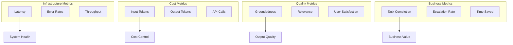
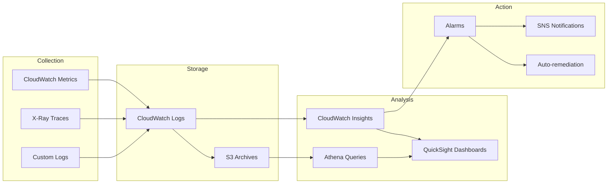
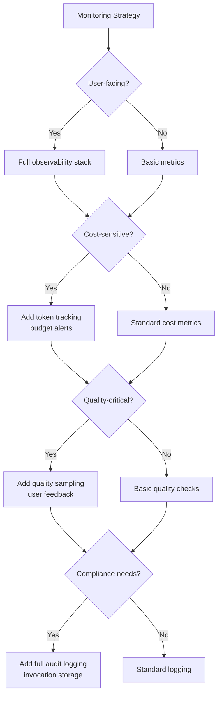

# Monitoring and Observability for GenAI Systems

**Domain 4 | Task 4.3 | ~40 minutes**

---

## Why This Matters

You can't optimize what you don't measure. You can't debug what you can't see. You can't maintain quality you don't monitor.

GenAI systems have unique monitoring challenges. Traditional application metrics—latency, error rates, throughput—still matter, but they're not enough. You need to track token usage (cost), output quality (correctness), hallucination rates (reliability), and prompt effectiveness (optimization opportunity). A system might have perfect uptime and sub-second latency while producing garbage outputs that damage user trust.

The challenge compounds with complexity. Agentic systems make autonomous decisions. RAG systems depend on retrieval quality. Multi-model architectures route between services. Without proper observability, debugging becomes guesswork. "The model gave a wrong answer" could mean: wrong prompt, wrong context, wrong model, wrong parameters, or perfectly correct behavior given bad inputs.

Good monitoring catches issues before users do. It enables optimization through data. It provides audit trails for compliance. It turns "the AI is being weird" into actionable insights with specific causes and solutions.

---

## Under the Hood: GenAI Metrics That Matter

Understanding which metrics to track and why helps you build effective monitoring.

### The GenAI Metrics Hierarchy



### What Each Metric Tells You

| Metric | Healthy Range | Alert Threshold | What It Indicates |
|--------|---------------|-----------------|-------------------|
| p50 Latency | < 2s | > 5s | Typical user experience |
| p99 Latency | < 10s | > 30s | Worst-case experience |
| Error Rate | < 1% | > 5% | System stability |
| Input Tokens/req | Stable | +50% | Prompt bloat or attack |
| Output Tokens/req | Stable | +100% | Unexpected verbosity |
| Guardrail Interventions | < 1% | > 5% | Content issues |
| User Feedback Score | > 4.0/5 | < 3.5/5 | Quality perception |

### The Observability Stack



---

## Decision Framework: Building Your Monitoring Strategy

Use this framework to prioritize what to monitor.

### Quick Reference

| Application Stage | Priority Metrics | Alerting |
|-------------------|------------------|----------|
| Development | Error rates, basic latency | Email |
| Staging | + Quality metrics, token usage | Slack |
| Production | All metrics, user feedback | PagerDuty |
| Optimization | + Cost breakdown, A/B metrics | Dashboard review |

### Decision Tree



### Monitoring Priority by Metric Type

| Phase | Must Have | Should Have | Nice to Have |
|-------|-----------|-------------|--------------|
| MVP | Error rates, latency | Token counts | - |
| Production | + Throughput, cost | + Quality sampling | Distributed tracing |
| Scale | + Per-user metrics | + Anomaly detection | Predictive alerts |
| Optimization | + A/B metrics | + Cost attribution | Custom dimensions |

### Trade-off Analysis

| Monitoring Level | Visibility | Storage Cost | Operational Overhead |
|------------------|-----------|--------------|---------------------|
| Basic (CloudWatch defaults) | Limited | Low | Low |
| Standard (+ custom metrics) | Good | Medium | Medium |
| Comprehensive (+ logs + traces) | Excellent | High | High |
| Full audit (+ I/O logging) | Complete | Very High | Very High |

---

## GenAI Observability Foundations

GenAI observability combines traditional infrastructure monitoring with AI-specific metrics.

### CloudWatch: The Metrics Foundation

CloudWatch automatically collects metrics from Bedrock and SageMaker:

**Bedrock Metrics:**
- `InvocationLatency`: Time per model call
- `InputTokenCount`: Tokens sent to model
- `OutputTokenCount`: Tokens generated
- `InvocationCount`: Number of API calls
- `InvocationClientErrors`: 4xx errors
- `InvocationServerErrors`: 5xx errors

**SageMaker Endpoint Metrics:**
- `Invocations`: Calls to endpoint
- `ModelLatency`: Inference time
- `OverheadLatency`: Non-inference overhead
- `CPUUtilization`, `MemoryUtilization`: Resource usage

Create dashboards combining these metrics:

```typescript
const operationalDashboard = new cloudwatch.Dashboard(this, 'GenAIOps', {
  dashboardName: 'GenAI-Operations'
});

operationalDashboard.addWidgets(
  new cloudwatch.GraphWidget({
    title: 'Invocation Latency',
    left: [
      new cloudwatch.Metric({
        namespace: 'AWS/Bedrock',
        metricName: 'InvocationLatency',
        dimensionsMap: { ModelId: 'anthropic.claude-3-sonnet-*' },
        statistic: 'p50',
        period: Duration.minutes(1)
      }),
      new cloudwatch.Metric({
        namespace: 'AWS/Bedrock',
        metricName: 'InvocationLatency',
        dimensionsMap: { ModelId: 'anthropic.claude-3-sonnet-*' },
        statistic: 'p99',
        period: Duration.minutes(1)
      })
    ],
    width: 12
  }),
  new cloudwatch.GraphWidget({
    title: 'Token Usage',
    left: [
      new cloudwatch.Metric({
        namespace: 'AWS/Bedrock',
        metricName: 'InputTokenCount',
        statistic: 'Sum',
        period: Duration.hours(1)
      }),
      new cloudwatch.Metric({
        namespace: 'AWS/Bedrock',
        metricName: 'OutputTokenCount',
        statistic: 'Sum',
        period: Duration.hours(1)
      })
    ],
    width: 12
  })
);
```

### X-Ray: Distributed Tracing

X-Ray traces requests across service boundaries. See exactly where time is spent in the request path.

```typescript
import * as AWSXRay from 'aws-xray-sdk';

// Instrument the AWS SDK
const bedrockClient = AWSXRay.captureAWSv3Client(
  new BedrockRuntimeClient({ region: 'us-east-1' })
);

// Add custom subsegments for detailed tracing
async function processRAGQuery(query: string): Promise<Response> {
  const segment = AWSXRay.getSegment();

  // Trace embedding generation
  const embeddingSegment = segment.addNewSubsegment('generate_embedding');
  const embedding = await generateEmbedding(query);
  embeddingSegment.addMetadata('embedding_model', 'titan-embed-text-v2');
  embeddingSegment.close();

  // Trace retrieval
  const retrievalSegment = segment.addNewSubsegment('retrieve_documents');
  const docs = await searchVectorDB(embedding);
  retrievalSegment.addAnnotation('docs_retrieved', docs.length);
  retrievalSegment.close();

  // Trace model inference
  const inferenceSegment = segment.addNewSubsegment('model_inference');
  inferenceSegment.addAnnotation('model', 'claude-3-sonnet');
  const response = await invokeModel(query, docs);
  inferenceSegment.addMetadata('tokens', {
    input: response.inputTokens,
    output: response.outputTokens
  });
  inferenceSegment.close();

  return response;
}
```

X-Ray service map shows:
- Request flow through services
- Latency at each hop
- Error rates per service
- Dependencies and bottlenecks

### Bedrock Model Invocation Logging

Bedrock can log detailed request/response data:

```typescript
// Enable model invocation logging
await bedrock.putModelInvocationLoggingConfiguration({
  loggingConfig: {
    cloudWatchConfig: {
      logGroupName: '/aws/bedrock/model-invocations',
      roleArn: loggingRoleArn,
      largeDataDeliveryS3Config: {
        bucketName: 'bedrock-invocation-logs',
        keyPrefix: 'large-payloads/'
      }
    },
    s3Config: {
      bucketName: 'bedrock-invocation-logs',
      keyPrefix: 'invocations/'
    },
    textDataDeliveryEnabled: true,
    imageDataDeliveryEnabled: true,
    embeddingDataDeliveryEnabled: true
  }
});
```

Invocation logs capture:
- Full request content (prompts)
- Full response content
- Model parameters used
- Timestamps and latency
- Token counts

Use for:
- Debugging unexpected outputs
- Quality analysis
- Compliance auditing
- Cost attribution

---

## GenAI-Specific Metrics

Beyond infrastructure metrics, GenAI needs application-level measurement.

### Token Usage Tracking

Track tokens with dimensions for analysis:

```typescript
interface TokenMetrics {
  inputTokens: number;
  outputTokens: number;
  model: string;
  application: string;
  feature: string;
  userId?: string;
}

async function recordTokenUsage(metrics: TokenMetrics): Promise<void> {
  await cloudwatch.putMetricData({
    Namespace: 'GenAI/Tokens',
    MetricData: [
      {
        MetricName: 'InputTokens',
        Dimensions: [
          { Name: 'Application', Value: metrics.application },
          { Name: 'Feature', Value: metrics.feature },
          { Name: 'Model', Value: metrics.model }
        ],
        Value: metrics.inputTokens,
        Unit: 'Count'
      },
      {
        MetricName: 'OutputTokens',
        Dimensions: [
          { Name: 'Application', Value: metrics.application },
          { Name: 'Feature', Value: metrics.feature },
          { Name: 'Model', Value: metrics.model }
        ],
        Value: metrics.outputTokens,
        Unit: 'Count'
      },
      {
        MetricName: 'EstimatedCost',
        Dimensions: [
          { Name: 'Application', Value: metrics.application }
        ],
        Value: calculateCost(metrics),
        Unit: 'None'  // Dollar amount
      }
    ]
  });
}
```

Dashboard by application, feature, model:
- Which features consume most tokens?
- Which users drive costs?
- How do different models compare?

### Prompt Effectiveness Measurement

Measure how well prompts achieve their goals:

```typescript
interface PromptEffectivenessMetrics {
  promptVersion: string;
  taskCompleted: boolean;
  userSatisfaction?: number;  // 1-5 rating
  requiresFollowUp: boolean;
  errorOccurred: boolean;
}

async function recordPromptEffectiveness(metrics: PromptEffectivenessMetrics): Promise<void> {
  await cloudwatch.putMetricData({
    Namespace: 'GenAI/PromptEffectiveness',
    MetricData: [
      {
        MetricName: 'SuccessRate',
        Dimensions: [
          { Name: 'PromptVersion', Value: metrics.promptVersion }
        ],
        Value: metrics.taskCompleted ? 1 : 0,
        Unit: 'Count'
      },
      {
        MetricName: 'UserSatisfaction',
        Dimensions: [
          { Name: 'PromptVersion', Value: metrics.promptVersion }
        ],
        Value: metrics.userSatisfaction || 0,
        Unit: 'None'
      },
      {
        MetricName: 'FollowUpRate',
        Dimensions: [
          { Name: 'PromptVersion', Value: metrics.promptVersion }
        ],
        Value: metrics.requiresFollowUp ? 1 : 0,
        Unit: 'Count'
      }
    ]
  });
}
```

Compare prompt versions:
- Which performs better?
- What's the success rate?
- How often do users need to clarify?

### Hallucination Rate Tracking

Track when outputs contain incorrect or unsupported claims:

```typescript
interface HallucinationCheckResult {
  responseId: string;
  hallucinated: boolean;
  groundingScore: number;  // 0-1, how well grounded in context
  claims: Array<{
    claim: string;
    supported: boolean;
    source?: string;
  }>;
}

async function recordHallucinationMetrics(result: HallucinationCheckResult): Promise<void> {
  await cloudwatch.putMetricData({
    Namespace: 'GenAI/Quality',
    MetricData: [
      {
        MetricName: 'HallucinationDetected',
        Value: result.hallucinated ? 1 : 0,
        Unit: 'Count'
      },
      {
        MetricName: 'GroundingScore',
        Value: result.groundingScore,
        Unit: 'None'
      },
      {
        MetricName: 'UnsupportedClaims',
        Value: result.claims.filter(c => !c.supported).length,
        Unit: 'Count'
      }
    ]
  });
}
```

High hallucination rates indicate problems:
- Poor retrieval quality
- Inadequate grounding instructions
- Wrong model for the task
- Insufficient context

### Anomaly Detection

Detect unusual patterns automatically:

```typescript
// CloudWatch anomaly detection alarm
const anomalyAlarm = new cloudwatch.Alarm(this, 'TokenAnomalyAlarm', {
  alarmName: 'GenAI-Token-Anomaly',
  metric: new cloudwatch.Metric({
    namespace: 'GenAI/Tokens',
    metricName: 'TotalTokens',
    statistic: 'Sum',
    period: Duration.hours(1)
  }),
  threshold: 0,  // Anomaly detection doesn't use fixed threshold
  evaluationPeriods: 2,
  comparisonOperator: cloudwatch.ComparisonOperator.GREATER_THAN_UPPER_THRESHOLD,
  treatMissingData: cloudwatch.TreatMissingData.BREACHING
});

// Use ANOMALY_DETECTION_BAND for the metric
```

Anomaly detection catches:
- Sudden cost spikes
- Unusual error patterns
- Quality degradation
- Potential abuse or attacks

---

## Integrated Dashboards

Different audiences need different views.

### Operational Dashboard

For engineering and on-call teams:

```typescript
const opsDashboard = new cloudwatch.Dashboard(this, 'OpsDashboard');

opsDashboard.addWidgets(
  // Health Overview
  new cloudwatch.SingleValueWidget({
    title: 'Error Rate (1h)',
    metrics: [errorRateMetric],
    width: 6
  }),
  new cloudwatch.SingleValueWidget({
    title: 'P99 Latency',
    metrics: [latencyP99Metric],
    width: 6
  }),
  new cloudwatch.SingleValueWidget({
    title: 'Invocations/min',
    metrics: [invocationRateMetric],
    width: 6
  }),
  new cloudwatch.SingleValueWidget({
    title: 'Active Alarms',
    metrics: [alarmCountMetric],
    width: 6
  }),

  // Detailed Graphs
  new cloudwatch.GraphWidget({
    title: 'Latency Distribution',
    left: [latencyP50, latencyP95, latencyP99],
    width: 12
  }),
  new cloudwatch.GraphWidget({
    title: 'Error Breakdown',
    left: [clientErrors, serverErrors, throttles],
    width: 12
  })
);
```

### Business Impact Dashboard

For leadership and product teams:

```typescript
const businessDashboard = new cloudwatch.Dashboard(this, 'BusinessDashboard');

businessDashboard.addWidgets(
  // Cost and Usage
  new cloudwatch.SingleValueWidget({
    title: 'Daily Token Cost',
    metrics: [dailyCostMetric],
    width: 8
  }),
  new cloudwatch.SingleValueWidget({
    title: 'Queries Today',
    metrics: [dailyQueriesMetric],
    width: 8
  }),
  new cloudwatch.SingleValueWidget({
    title: 'Cost per Query',
    metrics: [costPerQueryMetric],
    width: 8
  }),

  // User Experience
  new cloudwatch.GraphWidget({
    title: 'User Satisfaction Trend',
    left: [satisfactionMetric],
    width: 12
  }),
  new cloudwatch.GraphWidget({
    title: 'Task Completion Rate',
    left: [completionRateMetric],
    width: 12
  }),

  // ROI Metrics
  new cloudwatch.TextWidget({
    markdown: `## Automation Metrics
- Tasks automated: **${automatedTasks}**/day
- Estimated savings: **$${estimatedSavings}**/month
- Human escalation rate: **${escalationRate}%**`,
    width: 24
  })
);
```

### Compliance Dashboard

For governance and security teams:

```typescript
const complianceDashboard = new cloudwatch.Dashboard(this, 'ComplianceDashboard');

complianceDashboard.addWidgets(
  // Guardrail Activity
  new cloudwatch.GraphWidget({
    title: 'Guardrail Triggers',
    left: [
      guardrailContentFilterTriggers,
      guardrailPIITriggers,
      guardrailDeniedTopicTriggers
    ],
    width: 12
  }),

  // Audit Coverage
  new cloudwatch.SingleValueWidget({
    title: 'Invocations Logged',
    metrics: [invocationsLoggedMetric],
    width: 6
  }),
  new cloudwatch.SingleValueWidget({
    title: 'Log Completeness',
    metrics: [logCompletenessMetric],
    width: 6
  }),

  // Recent Audit Events
  new cloudwatch.LogQueryWidget({
    title: 'Recent Guardrail Blocks',
    logGroupNames: ['/aws/bedrock/guardrails'],
    queryString: `
      fields @timestamp, @message
      | filter action = 'BLOCKED'
      | sort @timestamp desc
      | limit 20
    `,
    width: 24
  })
);
```

---

## Tool and Agent Observability

Agentic systems require specialized monitoring.

### Tool Call Tracking

Log every tool invocation:

```typescript
interface ToolCallLog {
  requestId: string;
  agentId: string;
  toolName: string;
  parameters: Record<string, any>;
  result: 'success' | 'failure' | 'timeout';
  latencyMs: number;
  errorMessage?: string;
}

async function logToolCall(log: ToolCallLog): Promise<void> {
  // CloudWatch Logs for detailed records
  console.log(JSON.stringify({
    ...log,
    timestamp: new Date().toISOString(),
    type: 'TOOL_CALL'
  }));

  // CloudWatch Metrics for aggregates
  await cloudwatch.putMetricData({
    Namespace: 'GenAI/Agents',
    MetricData: [
      {
        MetricName: 'ToolInvocations',
        Dimensions: [
          { Name: 'AgentId', Value: log.agentId },
          { Name: 'ToolName', Value: log.toolName }
        ],
        Value: 1,
        Unit: 'Count'
      },
      {
        MetricName: 'ToolLatency',
        Dimensions: [
          { Name: 'ToolName', Value: log.toolName }
        ],
        Value: log.latencyMs,
        Unit: 'Milliseconds'
      },
      {
        MetricName: 'ToolFailures',
        Dimensions: [
          { Name: 'ToolName', Value: log.toolName }
        ],
        Value: log.result === 'failure' ? 1 : 0,
        Unit: 'Count'
      }
    ]
  });
}
```

Track patterns:
- Which tools are called most?
- Which tools fail most often?
- What's the average tool latency?
- How many tool calls per agent invocation?

### Bedrock Agent Tracing

Enable tracing for Bedrock Agents:

```typescript
const response = await bedrockAgentRuntime.invokeAgent({
  agentId: 'AGENT123',
  agentAliasId: 'ALIAS123',
  sessionId: sessionId,
  inputText: userQuery,
  enableTrace: true  // Enable detailed tracing
});

// Process trace events
for await (const event of response.completion) {
  if (event.trace?.trace) {
    const trace = event.trace.trace;

    // Pre-processing trace
    if (trace.preProcessingTrace) {
      console.log('Pre-processing:', {
        input: trace.preProcessingTrace.modelInvocationInput
      });
    }

    // Orchestration trace
    if (trace.orchestrationTrace) {
      const orch = trace.orchestrationTrace;

      if (orch.rationale) {
        console.log('Reasoning:', orch.rationale.text);
      }

      if (orch.invocationInput?.actionGroupInvocationInput) {
        console.log('Tool call:', {
          actionGroup: orch.invocationInput.actionGroupInvocationInput.actionGroupName,
          parameters: orch.invocationInput.actionGroupInvocationInput.parameters
        });
      }

      if (orch.observation) {
        console.log('Observation:', orch.observation);
      }
    }

    // Post-processing trace
    if (trace.postProcessingTrace) {
      console.log('Post-processing:', trace.postProcessingTrace);
    }
  }
}
```

Agent traces show:
- How the agent understood the request
- What reasoning led to tool selection
- What each tool returned
- How the final response was generated

### Usage Baselines and Alerting

Establish normal patterns and alert on deviation:

```typescript
// Baseline: Average tool calls per request
const baselineToolCalls = 2.5;

// Alert when significantly different
new cloudwatch.Alarm(this, 'ToolCallAnomaly', {
  metric: new cloudwatch.MathExpression({
    expression: 'toolCalls / invocations',
    usingMetrics: {
      toolCalls: toolCallsMetric,
      invocations: agentInvocationsMetric
    }
  }),
  threshold: baselineToolCalls * 2,  // Alert at 2x baseline
  evaluationPeriods: 3,
  alarmDescription: 'Agent making unusually many tool calls - possible confusion'
});
```

Anomalies to watch:
- Sudden increase in tool calls (agent confusion)
- Sudden decrease (broken tools)
- New tool usage patterns (behavior change)
- Tool timeout spikes (external service issues)

---

## Troubleshooting with Monitoring Data

Good monitoring enables efficient troubleshooting.

### Golden Datasets

Maintain test queries with known-good responses:

```typescript
interface GoldenTestCase {
  id: string;
  query: string;
  expectedResponse: string;
  requiredElements: string[];
  forbiddenElements: string[];
}

async function runGoldenDatasetTests(testCases: GoldenTestCase[]): Promise<TestResults> {
  const results = [];

  for (const testCase of testCases) {
    const response = await invokeModel(testCase.query);

    const passed = evaluateResponse(response, testCase);

    results.push({
      testId: testCase.id,
      passed,
      actualResponse: response,
      issues: passed ? [] : identifyIssues(response, testCase)
    });
  }

  // Publish results as metrics
  await cloudwatch.putMetricData({
    Namespace: 'GenAI/Quality',
    MetricData: [{
      MetricName: 'GoldenDatasetPassRate',
      Value: results.filter(r => r.passed).length / results.length,
      Unit: 'None'
    }]
  });

  return results;
}
```

Run golden tests:
- After prompt changes
- After model updates
- On a schedule (daily/weekly)

Regression is immediately visible.

### Output Diffing

Compare outputs across changes:

```typescript
interface OutputDiff {
  query: string;
  oldOutput: string;
  newOutput: string;
  similarity: number;
  addedContent: string[];
  removedContent: string[];
  changedTone: boolean;
}

async function compareOutputs(
  queries: string[],
  oldConfig: ModelConfig,
  newConfig: ModelConfig
): Promise<OutputDiff[]> {
  const diffs = [];

  for (const query of queries) {
    const oldOutput = await invokeWithConfig(query, oldConfig);
    const newOutput = await invokeWithConfig(query, newConfig);

    diffs.push({
      query,
      oldOutput,
      newOutput,
      similarity: calculateSimilarity(oldOutput, newOutput),
      addedContent: findAdditions(oldOutput, newOutput),
      removedContent: findRemovals(oldOutput, newOutput),
      changedTone: detectToneChange(oldOutput, newOutput)
    });
  }

  return diffs;
}
```

Use diffing to understand:
- Impact of prompt changes
- Effect of model upgrades
- Behavior across different parameters

### Reasoning Path Tracing

For chain-of-thought or agent systems, trace the reasoning:

```typescript
interface ReasoningStep {
  step: number;
  thought: string;
  action?: string;
  observation?: string;
}

async function traceReasoning(query: string): Promise<ReasoningStep[]> {
  const prompt = `Think through this step by step.
Format each step as:
THOUGHT: [your reasoning]
ACTION: [what you'll do, if any]
OBSERVATION: [what you learned]

Query: ${query}`;

  const response = await invokeModel(prompt);
  return parseReasoningSteps(response);
}
```

When outputs are wrong, trace back:
- Where did reasoning go wrong?
- What assumption was incorrect?
- What information was missing?

### Vector Store Monitoring

Monitor retrieval infrastructure:

```typescript
// OpenSearch health metrics
const vectorStoreMetrics = [
  'SearchLatency',
  'IndexingLatency',
  'JVMMemoryPressure',
  'FreeStorageSpace',
  'ClusterStatus.green',
  'ClusterStatus.yellow',
  'ClusterStatus.red'
];

// Custom retrieval quality metrics
async function monitorRetrievalQuality(
  query: string,
  results: Document[],
  userFeedback?: 'helpful' | 'not_helpful'
): Promise<void> {
  await cloudwatch.putMetricData({
    Namespace: 'GenAI/Retrieval',
    MetricData: [
      {
        MetricName: 'ResultsReturned',
        Value: results.length,
        Unit: 'Count'
      },
      {
        MetricName: 'AverageRelevanceScore',
        Value: results.reduce((sum, r) => sum + r.score, 0) / results.length,
        Unit: 'None'
      },
      {
        MetricName: 'UserFeedbackPositive',
        Value: userFeedback === 'helpful' ? 1 : 0,
        Unit: 'Count'
      }
    ]
  });
}
```

Watch for:
- Degrading search latency
- Falling relevance scores
- Increasing cluster warnings
- Storage pressure

---

## Key Services Summary

| Service | Monitoring Role | When to Use |
|---------|----------------|-------------|
| **Amazon CloudWatch** | Metrics, dashboards, alarms, anomaly detection | Core monitoring infrastructure |
| **AWS X-Ray** | Distributed tracing across services | Bottleneck identification, latency analysis |
| **CloudWatch Logs** | Application-level logging | Detailed debugging, audit trails |
| **CloudWatch Logs Insights** | Log querying and analysis | Ad-hoc investigation, pattern finding |
| **Bedrock Invocation Logging** | Detailed FM request/response capture | Quality analysis, compliance auditing |
| **AWS CloudTrail** | API-level audit logging | Security auditing, compliance |

---

## Exam Tips

- **"Distributed tracing"** or **"bottleneck identification"** → X-Ray
- **"GenAI-specific metrics"** → Custom CloudWatch metrics (tokens, quality, hallucination)
- **"Detect quality regression"** → Golden datasets with automated testing
- **"Detailed FM interaction data"** → Bedrock invocation logging
- **"Different dashboards for different audiences"** → Operational (eng), Business (leadership), Compliance (governance)

---

## Common Mistakes to Avoid

1. **Only monitoring infrastructure metrics**—GenAI needs quality, token, and effectiveness metrics too
2. **No golden datasets**—can't detect regression without known-good baselines
3. **Skipping X-Ray tracing**—makes bottleneck identification nearly impossible
4. **Not enabling invocation logging**—missing detailed data for debugging and compliance
5. **Same dashboard for everyone**—different audiences need different views
