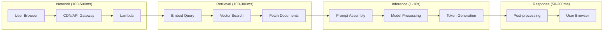
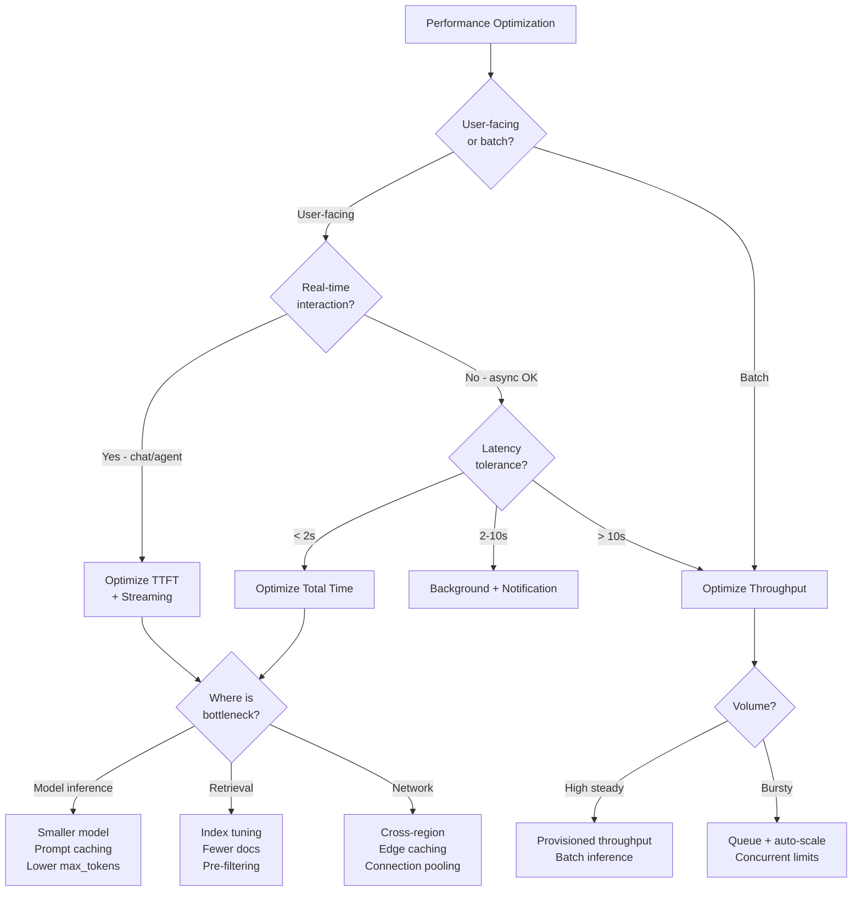

# Performance Optimization for GenAI Applications

**Domain 4 | Task 4.2 | ~40 minutes**

---

## Why This Matters

GenAI latency is measured in seconds, not milliseconds. A database query that takes 100ms feels instant. A model inference that takes 5 seconds feels slow. At 10 seconds, users wonder if something broke. At 15 seconds, they've left.

The challenge is that GenAI latency comes from everywhere: network round trips, document retrieval, embedding generation, model inference, response streaming. Each component adds time. A naive implementation might spend 500ms retrieving documents, 200ms generating embeddings, 3 seconds in model inference, and 500ms in post-processing—4.2 seconds total, and that's before network latency.

Performance optimization for GenAI requires understanding where time goes and applying targeted improvements. Streaming dramatically improves perceived latency even when total time stays the same. Pre-computation eliminates inference time for predictable queries. Parallel execution prevents serialization of independent operations. Retrieval optimization speeds up the RAG pipeline.

The goal isn't theoretical speed—it's user experience. Users don't care about p50 latency if their query hit p99. They don't care about server-side metrics if the browser rendering is slow. Optimize for what users actually experience.

---

## Under the Hood: Where GenAI Latency Comes From

Understanding the latency components helps you target optimizations effectively.

### Anatomy of a GenAI Request

A typical RAG request has multiple latency components:



### Time-to-First-Token vs Total Time

These are different metrics requiring different optimizations:

| Metric | What It Measures | User Impact |
|--------|------------------|-------------|
| **Time-to-First-Token (TTFT)** | Time until first output token appears | Perceived responsiveness |
| **Total Time** | Time until complete response | Overall task completion |
| **Tokens per Second** | Generation speed | Reading pace |

**TTFT breakdown:**
```
Network to Bedrock:     50-200ms
Request queuing:        0-500ms (depends on load)
Prompt processing:      200-1000ms (scales with input length)
First token generation: 50-100ms
Network back:           50-200ms
────────────────────────────────
Total TTFT:            350ms - 2s typical
```

### Why Output Generation Is Sequential

Input tokens are processed in parallel—the entire prompt is fed through the model at once. But output tokens are generated **one at a time**:

```
Input:  [Token1, Token2, ..., Token1000] → Processed in ONE forward pass
Output: Token1 → Token2 → Token3 → ... → TokenN (N forward passes)
```

This is why:
- A 100-token response takes ~10x longer than a 10-token response
- Streaming helps perceived latency (show tokens as generated)
- max_tokens limits directly impact total time

### Latency By Model Size

Larger models = slower inference:

| Model | TTFT | Tokens/sec | 500-token Response |
|-------|------|------------|-------------------|
| Claude 3 Haiku | ~300ms | ~100 | ~5.3s |
| Claude 3.5 Sonnet | ~600ms | ~70 | ~7.7s |
| Claude 3 Opus | ~1500ms | ~40 | ~14s |

---

## Decision Framework: Optimizing for Your Workload

Different applications need different optimization strategies.

### Quick Reference

| Scenario | Primary Optimization | Secondary |
|----------|---------------------|-----------|
| Chat interface | Streaming + TTFT | Model tiering |
| Document Q&A | Retrieval speed | Caching |
| Bulk classification | Batch inference | Throughput |
| Global users | Cross-region + CDN | Pre-computation |
| Real-time agent | Parallel execution | Smaller models |
| Offline processing | Batch + cheap models | Max throughput |

### Decision Tree



### Trade-off Analysis

| Optimization | Latency Impact | Throughput Impact | Cost Impact | Implementation Effort |
|--------------|---------------|-------------------|-------------|----------------------|
| Streaming | ↑ Perceived only | None | None | Low |
| Smaller model | ↑ 2-5x faster | ↑ Higher | ↓ Lower | Low |
| Prompt caching | ↑ 20-40% | ↑ Higher | ↓ Lower | Low |
| Pre-computation | ↑ 100x (cache hit) | N/A | ↑ Batch cost | Medium |
| Parallel execution | ↑ Depends on deps | ↑ Higher | None | Medium |
| Cross-region | ↑ 100-300ms | None | ↑ Slightly | Medium |
| Index tuning | ↑ 10-50% | ↑ Higher | None | Medium |
| Batch inference | ↓ Much slower | ↑ Much higher | ↓ ~50% | Medium |

### Latency Budget Allocation

For a 3-second latency budget on a RAG query:

| Component | Budget | Optimization if Over |
|-----------|--------|---------------------|
| Network (user → API) | 200ms | CDN, edge locations |
| Embedding generation | 100ms | Cache embeddings, smaller model |
| Vector search | 200ms | Index tuning, reduce k |
| Document fetch | 100ms | Batch fetch, caching |
| Model inference | 2000ms | Smaller model, prompt caching |
| Post-processing | 100ms | Simplify, parallelize |
| Network (API → user) | 200ms | Streaming, compression |
| **Total** | **3000ms** | |

### When to Optimize What

| Signal | Optimization Focus |
|--------|-------------------|
| High TTFT, users complain about "slowness" | Streaming, prompt caching, model size |
| Retrieval latency > model latency | Index optimization, fewer documents |
| p99 >> p50 | Cold starts, capacity provisioning |
| Costs too high | Batch processing, model tiering, caching |
| Can't handle traffic spikes | Queue-based architecture, auto-scaling |

---

## Latency Optimization Strategies

Latency has multiple components. Optimize each one.

### Streaming: Transforming Perceived Latency

Streaming is the single most impactful optimization for user-facing applications. Instead of waiting for the complete response, users see tokens as they're generated. The first token might appear in 500ms even if the full response takes 5 seconds.

**Without streaming:**
```
User clicks → [5 second wait] → Full response appears
Perceived latency: 5 seconds of nothing, then everything
```

**With streaming:**
```
User clicks → [500ms] → First words appear → [continuing] → Response grows → Complete
Perceived latency: Quick response that builds, feels interactive
```

Implementing streaming with Bedrock:

```typescript
import { BedrockRuntimeClient, InvokeModelWithResponseStreamCommand } from '@aws-sdk/client-bedrock-runtime';

async function streamResponse(prompt: string, onChunk: (text: string) => void): Promise<string> {
  const client = new BedrockRuntimeClient({ region: 'us-east-1' });

  const response = await client.send(new InvokeModelWithResponseStreamCommand({
    modelId: 'anthropic.claude-3-5-sonnet-20241022-v2:0',
    body: JSON.stringify({
      anthropic_version: 'bedrock-2023-05-31',
      messages: [{ role: 'user', content: prompt }],
      max_tokens: 1024,
      stream: true
    })
  }));

  let fullResponse = '';

  for await (const event of response.body) {
    if (event.chunk) {
      const chunk = JSON.parse(new TextDecoder().decode(event.chunk.bytes));
      if (chunk.type === 'content_block_delta' && chunk.delta?.text) {
        const text = chunk.delta.text;
        fullResponse += text;
        onChunk(text);  // Send to user immediately
      }
    }
  }

  return fullResponse;
}
```

For web applications, use Server-Sent Events (SSE) to stream to the browser:

```typescript
// Express.js SSE endpoint
app.get('/api/chat', async (req, res) => {
  res.setHeader('Content-Type', 'text/event-stream');
  res.setHeader('Cache-Control', 'no-cache');
  res.setHeader('Connection', 'keep-alive');

  await streamResponse(req.query.prompt, (chunk) => {
    res.write(`data: ${JSON.stringify({ text: chunk })}\n\n`);
  });

  res.write('data: [DONE]\n\n');
  res.end();
});
```

### Pre-Computation: Eliminating Inference Time

For predictable queries, pre-compute responses. Nightly batch jobs can generate answers to common questions. Real-time requests retrieve pre-computed results—no inference latency at all.

```typescript
// Batch pre-computation job
async function precomputeCommonQueries(): Promise<void> {
  const commonQueries = await getCommonQueries();  // From analytics

  for (const query of commonQueries) {
    const response = await generateResponse(query);
    await cache.set(query, response, TTL_DAYS * 24 * 60 * 60);
  }
}

// Real-time lookup
async function handleQuery(query: string): Promise<string> {
  // Check pre-computed cache first
  const cached = await cache.get(query);
  if (cached) {
    return cached;  // Instant response
  }

  // Fall back to real-time inference
  return generateResponse(query);
}
```

Pre-computation works best for:
- FAQ-style queries
- Stable content (documentation, policies)
- Common user questions (identified via analytics)

### Parallel Execution: Don't Serialize Independence

When you need multiple operations, run independent ones in parallel:

```typescript
// Bad: Serial execution (total time = sum of all operations)
const embedding = await generateEmbedding(query);      // 100ms
const userContext = await getUserContext(userId);       // 50ms
const retrievedDocs = await retrieveDocuments(embedding); // 200ms
// Total: 350ms

// Good: Parallel execution (total time = longest operation)
const [embedding, userContext] = await Promise.all([
  generateEmbedding(query),     // 100ms
  getUserContext(userId)         // 50ms (runs in parallel)
]);
const retrievedDocs = await retrieveDocuments(embedding); // 200ms (needs embedding)
// Total: 300ms (saved 50ms)
```

For Step Functions, use parallel states:

```json
{
  "Type": "Parallel",
  "Branches": [
    {
      "StartAt": "GetUserContext",
      "States": {
        "GetUserContext": {
          "Type": "Task",
          "Resource": "arn:aws:lambda:...:getUserContext",
          "End": true
        }
      }
    },
    {
      "StartAt": "RetrieveDocuments",
      "States": {
        "RetrieveDocuments": {
          "Type": "Task",
          "Resource": "arn:aws:lambda:...:retrieveDocuments",
          "End": true
        }
      }
    }
  ],
  "ResultPath": "$.parallelResults"
}
```

### Cross-Region Inference: Global Latency Reduction

For global users, network latency to a single region adds significant time. Bedrock Cross-Region Inference routes requests to available capacity in the closest region:

```typescript
// Cross-Region Inference automatically routes to optimal region
const response = await bedrock.invokeModel({
  modelId: 'anthropic.claude-3-5-sonnet-20241022-v2:0',
  // Bedrock routes to available capacity, potentially closer region
  body: JSON.stringify({ /* ... */ })
});
```

For more control, deploy to multiple regions and route based on user location:

```typescript
function getBedrockClient(userRegion: string): BedrockRuntimeClient {
  const regionMap = {
    'us': 'us-east-1',
    'eu': 'eu-west-1',
    'asia': 'ap-northeast-1'
  };

  const targetRegion = regionMap[userRegion] || 'us-east-1';
  return new BedrockRuntimeClient({ region: targetRegion });
}
```

---

## Retrieval Performance Optimization

RAG systems spend significant time in retrieval. Optimize the retrieval pipeline.

### Index Optimization for OpenSearch

OpenSearch index settings dramatically impact search performance:

**Shard Sizing:**
- Target 10-50GB per shard
- Too few shards: hot spots, can't parallelize
- Too many shards: overhead, coordinator bottleneck

**Replica Configuration:**
- Replicas improve read throughput (queries distributed)
- Balance replicas vs. storage cost

**Refresh Interval:**
- Default 1 second is aggressive for write-heavy workloads
- Increase to 30s or more for bulk indexing

```typescript
// Optimized index settings
await opensearch.indices.create({
  index: 'knowledge-vectors',
  body: {
    settings: {
      number_of_shards: 3,          // Right-size for data volume
      number_of_replicas: 1,         // Read throughput vs. cost
      refresh_interval: '30s',       // Reduce for better write perf
      'index.knn': true,
      'index.knn.algo_param.ef_search': 100  // Search quality vs speed
    },
    mappings: {
      properties: {
        embedding: {
          type: 'knn_vector',
          dimension: 1536,
          method: {
            name: 'hnsw',
            space_type: 'cosinesimil',
            engine: 'nmslib',
            parameters: {
              ef_construction: 256,  // Build quality (higher = better, slower)
              m: 16                   // Connections (higher = better recall, more memory)
            }
          }
        },
        text: { type: 'text' },
        metadata: { type: 'object' }
      }
    }
  }
});
```

**HNSW Parameters:**
- `ef_construction`: Higher values build better graphs (one-time cost at indexing)
- `m`: More connections = better recall but more memory
- `ef_search`: Higher values search more thoroughly (query-time tradeoff)

### Query Preprocessing

Optimize queries before search to improve both speed and relevance:

```typescript
async function preprocessQuery(query: string): Promise<string> {
  // Remove noise words
  const stopWords = ['the', 'a', 'an', 'is', 'are', 'what', 'how'];
  let processed = query.split(' ')
    .filter(word => !stopWords.includes(word.toLowerCase()))
    .join(' ');

  // Expand acronyms
  const acronyms = { 'ML': 'machine learning', 'AI': 'artificial intelligence' };
  for (const [acronym, expansion] of Object.entries(acronyms)) {
    processed = processed.replace(new RegExp(`\\b${acronym}\\b`, 'gi'), expansion);
  }

  return processed;
}
```

**Query Expansion:**
Generate related terms to improve recall:

```typescript
async function expandQuery(query: string): Promise<string[]> {
  const expansionPrompt = `Generate 3 related search queries for: "${query}"
Return only the queries, one per line.`;

  const response = await bedrock.invokeModel({
    modelId: 'anthropic.claude-3-haiku-20240307-v1:0',  // Cheap, fast
    body: JSON.stringify({
      messages: [{ role: 'user', content: expansionPrompt }],
      max_tokens: 100
    })
  });

  return [query, ...parseExpansions(response)];
}
```

### Hybrid Search Tuning

Combine keyword (BM25) and vector (semantic) search for best results:

```typescript
// Hybrid search with custom weighting
const hybridQuery = {
  query: {
    hybrid: {
      queries: [
        {
          // BM25 keyword search
          match: {
            text: {
              query: userQuery,
              boost: 0.3  // 30% weight to keyword
            }
          }
        },
        {
          // Vector semantic search
          knn: {
            embedding: {
              vector: queryEmbedding,
              k: 10,
              boost: 0.7  // 70% weight to semantic
            }
          }
        }
      ]
    }
  }
};
```

Tune the weighting based on your content:
- Technical documentation: higher keyword weight (exact terms matter)
- Conversational content: higher semantic weight (meaning matters more than words)
- Mixed: balanced or adaptive based on query characteristics

### Reranking for Quality

Initial retrieval returns candidates; reranking reorders by relevance:

```typescript
async function retrieveWithReranking(query: string, topK: number = 5): Promise<Document[]> {
  // Initial retrieval: get more candidates than needed
  const candidates = await vectorSearch(query, topK * 3);  // 15 candidates for top 5

  // Rerank with cross-encoder or LLM
  const reranked = await rerankDocuments(query, candidates);

  // Return top K after reranking
  return reranked.slice(0, topK);
}

async function rerankDocuments(query: string, docs: Document[]): Promise<Document[]> {
  // Use Bedrock reranker or LLM-based reranking
  const scoredDocs = await Promise.all(docs.map(async (doc) => {
    const relevanceScore = await scoreRelevance(query, doc.text);
    return { ...doc, relevanceScore };
  }));

  return scoredDocs.sort((a, b) => b.relevanceScore - a.relevanceScore);
}
```

Reranking adds latency but improves quality. Use when:
- Retrieval precision is critical
- You're seeing irrelevant results in top positions
- Quality matters more than speed

---

## Throughput Optimization

Throughput measures requests processed per unit time. Different from latency—optimize for your workload pattern.

### Understanding Token Processing

LLM throughput is often measured in tokens per second:
- **Input tokens**: Processed in parallel (fast)
- **Output tokens**: Generated sequentially (slower, bottleneck)

Shorter outputs = higher throughput. This is why response length controls matter for throughput as well as cost.

### Batch Inference

For bulk processing, batch inference maximizes efficiency:

**SageMaker Batch Transform:**
```typescript
const batchJob = await sagemaker.createTransformJob({
  TransformJobName: `batch-${Date.now()}`,
  ModelName: 'my-inference-model',
  TransformInput: {
    DataSource: {
      S3DataSource: {
        S3DataType: 'S3Prefix',
        S3Uri: 's3://input-bucket/requests/'
      }
    },
    ContentType: 'application/jsonlines',
    SplitType: 'Line'
  },
  TransformOutput: {
    S3OutputPath: 's3://output-bucket/responses/',
    AssembleWith: 'Line'
  },
  TransformResources: {
    InstanceType: 'ml.g5.xlarge',
    InstanceCount: 4
  },
  BatchStrategy: 'MultiRecord',
  MaxConcurrentTransforms: 4
});
```

**Bedrock Batch Inference (Preview):**
```typescript
// Submit batch job
const batchJob = await bedrock.createModelInvocationJob({
  jobName: `batch-${Date.now()}`,
  modelId: 'anthropic.claude-3-sonnet-20240229-v1:0',
  inputDataConfig: {
    s3InputDataConfig: {
      s3Uri: 's3://bucket/input.jsonl'
    }
  },
  outputDataConfig: {
    s3OutputDataConfig: {
      s3Uri: 's3://bucket/output/'
    }
  }
});
```

### Concurrent Invocations

For interactive workloads, maximize concurrent requests:

```typescript
// Process requests concurrently with controlled parallelism
async function processWithConcurrency(
  requests: string[],
  concurrency: number = 10
): Promise<string[]> {
  const results: string[] = [];
  const executing: Promise<void>[] = [];

  for (const request of requests) {
    const promise = invokeModel(request).then(result => {
      results.push(result);
    });

    executing.push(promise);

    if (executing.length >= concurrency) {
      await Promise.race(executing);
      // Remove completed promises
      executing.splice(0, executing.findIndex(p => p === promise) + 1);
    }
  }

  await Promise.all(executing);
  return results;
}
```

### Queue-Based Architecture

Handle traffic bursts with queues:

```typescript
// SQS queue for request buffering
const queue = new sqs.Queue(this, 'RequestQueue', {
  visibilityTimeout: Duration.seconds(300),  // Match processing time
  deadLetterQueue: {
    maxReceiveCount: 3,
    queue: dlq
  }
});

// Lambda consumer with controlled concurrency
const processor = new lambda.Function(this, 'Processor', {
  runtime: lambda.Runtime.NODEJS_18_X,
  handler: 'index.handler',
  reservedConcurrentExecutions: 10,  // Limit parallel processing
  timeout: Duration.minutes(5)
});

processor.addEventSource(new lambdaEventSources.SqsEventSource(queue, {
  batchSize: 1,  // One request at a time per invocation
  maxConcurrency: 10  // Match reserved concurrency
}));
```

---

## Model Parameter Tuning

Model parameters affect both quality and performance.

### Temperature

Temperature controls randomness:
- **Low (0.0-0.3)**: Deterministic, focused. Faster—less exploration.
- **High (0.7-1.0)**: Creative, varied. Slower—more exploration.

For performance-critical applications, lower temperature often means faster responses (fewer tokens considered at each step).

### Top-K and Top-P

Limit the token selection pool:
- **Lower values**: Faster, more focused (fewer options to consider)
- **Higher values**: Slower, more diverse

```typescript
const response = await bedrock.invokeModel({
  modelId: 'anthropic.claude-3-sonnet-20240229-v1:0',
  body: JSON.stringify({
    messages: [{ role: 'user', content: prompt }],
    max_tokens: 256,
    temperature: 0.3,  // Lower for speed
    top_p: 0.9         // Slightly constrained
  })
});
```

### Model Selection Impact

Smaller models are faster:
- Claude Haiku: ~500ms time to first token
- Claude Sonnet: ~800ms time to first token
- Claude Opus: ~1500ms time to first token

Choose the smallest model that meets quality requirements for your task.

### A/B Testing Parameters

Test parameter combinations systematically:

```typescript
async function abTestParameters(
  testCases: Array<{ prompt: string; expectedQuality: string }>,
  parameterSets: Array<{ temperature: number; topP: number }>
): Promise<ABTestResults> {
  const results = [];

  for (const params of parameterSets) {
    let totalLatency = 0;
    let qualityScores = [];

    for (const testCase of testCases) {
      const start = Date.now();
      const response = await invokeWithParams(testCase.prompt, params);
      totalLatency += Date.now() - start;

      const quality = await evaluateQuality(response, testCase.expectedQuality);
      qualityScores.push(quality);
    }

    results.push({
      params,
      avgLatency: totalLatency / testCases.length,
      avgQuality: qualityScores.reduce((a, b) => a + b) / qualityScores.length
    });
  }

  return results;
}
```

Find the parameter combination that optimizes for your quality/latency tradeoff.

---

## System Performance Analysis

Use tracing and profiling to identify bottlenecks.

### X-Ray Distributed Tracing

X-Ray traces requests across services:

```typescript
import * as AWSXRay from 'aws-xray-sdk';

// Instrument AWS SDK
const AWS = AWSXRay.captureAWS(require('aws-sdk'));

// Add custom subsegments for GenAI operations
async function processRequest(query: string): Promise<string> {
  const segment = AWSXRay.getSegment();

  // Trace retrieval
  const retrievalSubsegment = segment.addNewSubsegment('retrieval');
  const docs = await retrieveDocuments(query);
  retrievalSubsegment.close();

  // Trace inference
  const inferenceSubsegment = segment.addNewSubsegment('model_inference');
  inferenceSubsegment.addAnnotation('model', 'claude-3-sonnet');
  const response = await invokeModel(query, docs);
  inferenceSubsegment.addMetadata('tokens', { input: 500, output: 200 });
  inferenceSubsegment.close();

  return response;
}
```

X-Ray shows where time is spent:
- API Gateway: Request handling
- Lambda: Function execution
- Bedrock: Model inference
- OpenSearch: Vector retrieval

### Identifying Bottlenecks

Common bottlenecks and solutions:

| Bottleneck | Symptom | Solution |
|------------|---------|----------|
| Model inference | High Bedrock latency | Smaller model, prompt caching, streaming |
| Retrieval | High OpenSearch latency | Index optimization, query preprocessing |
| Network | High first-byte latency | Cross-region, edge caching |
| Cold start | Intermittent high latency | Provisioned concurrency, keep-warm |
| Serialization | Total time = sum of parts | Parallelize independent operations |

### CloudWatch Metrics and Alarms

Monitor performance continuously:

```typescript
// Performance alarm
new cloudwatch.Alarm(this, 'LatencyAlarm', {
  metric: new cloudwatch.Metric({
    namespace: 'GenAI/Performance',
    metricName: 'E2ELatency',
    statistic: 'p95',
    period: Duration.minutes(5)
  }),
  threshold: 5000,  // 5 second p95 target
  evaluationPeriods: 3,
  comparisonOperator: cloudwatch.ComparisonOperator.GREATER_THAN_THRESHOLD,
  alarmDescription: 'E2E latency exceeds 5s at p95'
});
```

---

## Key Services Summary

| Service | Performance Role | When to Use |
|---------|-----------------|-------------|
| **Amazon Bedrock** | Streaming, Cross-Region Inference, parameter tuning | Model invocation optimization |
| **Amazon CloudFront** | Edge caching, global distribution | Reduce network latency for global users |
| **Amazon OpenSearch** | Vector search optimization, hybrid search | RAG retrieval performance |
| **AWS X-Ray** | Distributed tracing, bottleneck identification | Performance debugging |
| **AWS Step Functions** | Parallel execution orchestration | Multi-step workflow optimization |

---

## Exam Tips

- **"Reduce perceived latency"** → Streaming (InvokeModelWithResponseStream)
- **"Identify bottlenecks"** → X-Ray distributed tracing
- **"Improve retrieval speed"** → OpenSearch index optimization, hybrid search tuning
- **"Handle global users"** → Cross-Region Inference, CloudFront edge caching
- **"Faster responses"** → Lower temperature, smaller models, constrained top-p

---

## Common Mistakes to Avoid

1. **Not using streaming** for user-facing applications—perceived latency matters
2. **Serializing independent operations** instead of parallelizing
3. **Default OpenSearch settings** instead of tuning for workload
4. **Higher temperature/max_tokens than needed**—slower and more expensive
5. **Scaling on CPU** instead of GenAI-specific metrics (queue depth, tokens/sec)
