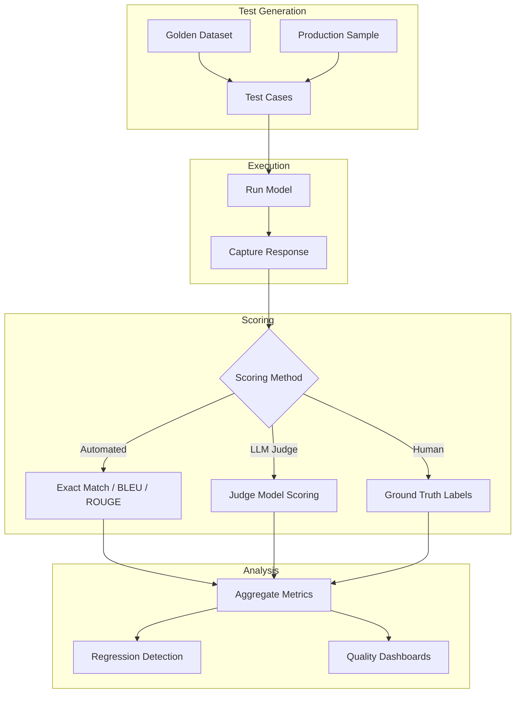
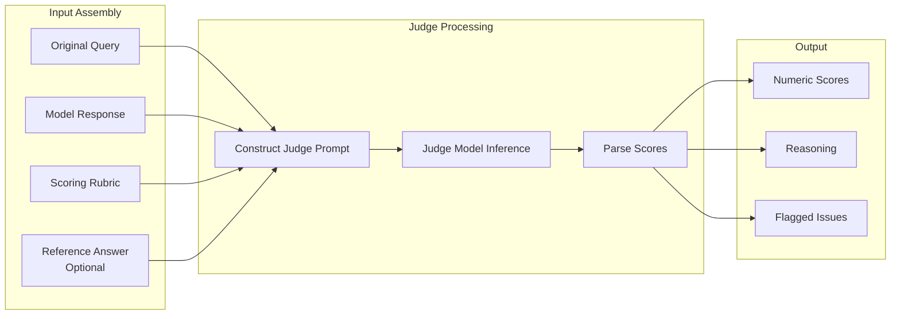
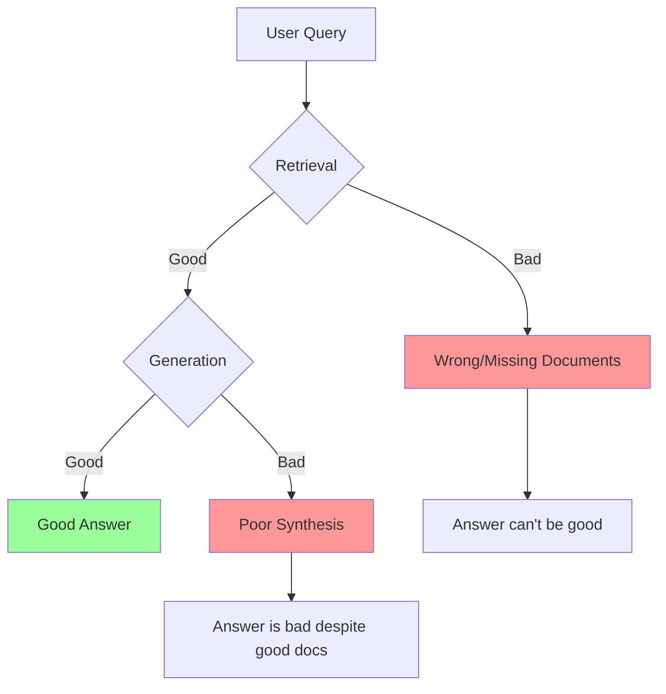
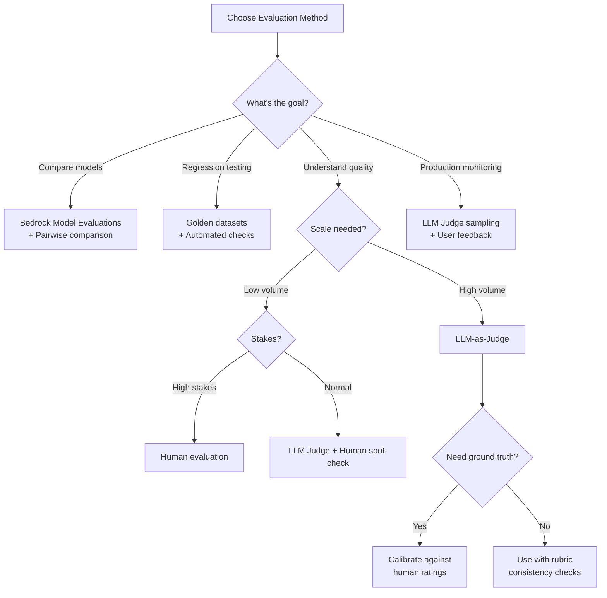

# Evaluation Systems for GenAI Applications

**Domain 5 | Task 5.1 | ~40 minutes**

---

## Why This Matters

You can't improve what you can't measure. You can't catch regressions you don't test for. You can't defend deployment decisions without data.

GenAI evaluation is fundamentally different from traditional ML evaluation. In traditional ML, you have ground truth labels and clear metrics—accuracy, precision, recall. In GenAI, outputs are free-form text. There's often no single "correct" answer. Quality is subjective and multidimensional. A response might be accurate but unhelpful, or creative but inaccurate, or fluent but incomplete.

This complexity requires a multi-layered evaluation strategy. Automated metrics catch obvious issues at scale. LLM-as-a-Judge captures nuance that simple metrics miss. Human evaluation provides ground truth for subjective quality. Production monitoring catches drift that pre-deployment testing can't predict. Golden datasets enable regression detection across all these methods.

Organizations that skip systematic evaluation deploy blind. They discover issues from user complaints, not metrics. They can't quantify improvements or defend against regressions. Evaluation isn't overhead—it's the foundation for reliable, improving GenAI systems.

---

## Under the Hood: How GenAI Evaluation Actually Works

Understanding the mechanics of evaluation helps you design better tests and interpret results correctly.

### The Evaluation Pipeline

A comprehensive evaluation system has multiple stages:



### How LLM-as-Judge Scoring Works

When you use an LLM to judge another model's output, the process involves:



**Key insight:** The judge model doesn't have magical evaluation abilities—it's applying the rubric you provided. Better rubrics = more consistent scores.

### What Each Metric Actually Measures

| Metric | What It Captures | What It Misses |
|--------|------------------|----------------|
| **Exact Match** | Identical responses | Paraphrases, valid alternatives |
| **BLEU** | N-gram overlap with reference | Semantic similarity, fluency |
| **ROUGE** | Recall of reference n-grams | Precision, factual accuracy |
| **Semantic Similarity** | Embedding distance | Hallucinations with similar meaning |
| **LLM Judge** | Nuanced quality dimensions | Judge model biases |
| **Human Rating** | True subjective quality | Scale, cost, speed |

### Why RAG Evaluation Has Two Parts

RAG failures can happen in retrieval OR generation:



**If retrieval fails:** No amount of good generation can save the answer
**If generation fails:** Good documents were wasted

This is why you must evaluate both separately AND end-to-end.

---

## Decision Framework: Choosing Evaluation Methods

Different evaluation methods suit different needs. Use this framework to select appropriately.

### Quick Reference

| Scenario | Primary Method | Secondary Method |
|----------|---------------|------------------|
| Pre-deployment testing | Golden dataset + LLM Judge | Human spot-check |
| Comparing model versions | Bedrock Model Evaluations | Pairwise human preference |
| Production monitoring | LLM Judge sampling | User feedback |
| High-stakes domain | Human evaluation | LLM Judge pre-filter |
| Scaling evaluation | LLM Judge | Golden dataset regression |
| Detecting hallucinations | Groundedness check | Fact verification |
| Measuring user satisfaction | User feedback | Task completion rate |

### Decision Tree



### Trade-off Analysis

| Method | Cost | Speed | Scale | Accuracy | Nuance |
|--------|------|-------|-------|----------|--------|
| **Exact match** | Free | Instant | Unlimited | Low | None |
| **BLEU/ROUGE** | Free | Instant | Unlimited | Medium | Low |
| **Semantic similarity** | $ | Fast | High | Medium | Low |
| **LLM Judge** | $$ | Medium | High | High | High |
| **Human evaluation** | $$$$ | Slow | Low | Highest | Highest |
| **Production feedback** | Free | Slow | Medium | Varies | Medium |

### Evaluation Pyramid

Build from automated (base) to human (peak):

```
                    /\
                   /  \  Human Evaluation
                  /----\  (Ground truth, high-stakes)
                 /      \
                /--------\  LLM-as-Judge
               /          \  (Scaled quality assessment)
              /------------\
             /              \  Golden Dataset Tests
            /----------------\  (Regression detection)
           /                  \
          /--------------------\  Automated Metrics
         /                      \  (Coverage, basic checks)
```

**Don't skip levels.** Automated metrics catch obvious issues cheaply. Golden tests ensure consistency. LLM judges provide scaled quality. Humans provide ground truth.

### When to Use Each

**Automated metrics (BLEU, exact match):**
- High-volume, deterministic tasks
- Initial filtering before expensive evaluation
- CI/CD pipelines for quick feedback

**Golden dataset tests:**
- Regression detection after any change
- Deployment gates
- Scheduled quality checks

**LLM-as-Judge:**
- Scaling quality evaluation beyond what humans can review
- Consistent application of rubrics
- Production monitoring

**Human evaluation:**
- Establishing ground truth
- High-stakes domains (medical, legal)
- Calibrating automated methods
- Subtle quality issues

---

## The GenAI Evaluation Challenge

Traditional evaluation approaches don't translate directly to GenAI. Understanding the differences is step one.

### Why GenAI Evaluation is Different

**Open-ended outputs**: A summarization model might produce infinite valid summaries of the same document. There's no single "correct" answer to match against.

**Subjective quality**: What makes a response "good" depends on context, audience, and purpose. A formal response might be perfect for business communication but wrong for casual chat.

**Multiple dimensions**: A response can be accurate but verbose, or concise but incomplete, or helpful but risky. Single metrics can't capture this complexity.

**Drift over time**: Model behavior changes. Base models update. Prompts evolve. RAG data changes. Even stable systems drift.

### Evaluation Dimensions

Evaluate across multiple dimensions:

| Dimension | What It Measures | How to Evaluate |
|-----------|-----------------|-----------------|
| **Accuracy** | Factual correctness | Fact-checking, source verification |
| **Relevance** | Addresses the actual question | LLM-as-Judge, human rating |
| **Completeness** | Covers all necessary information | Checklist verification |
| **Fluency** | Grammatically correct, well-written | Automated metrics, human judgment |
| **Helpfulness** | Actually solves user's problem | User feedback, task completion |
| **Safety** | No harmful or inappropriate content | Content filters, human review |
| **Groundedness** | Claims supported by sources (RAG) | Citation verification |

No single metric captures all dimensions. Evaluation strategy must address each one relevant to your application.

---

## Bedrock Model Evaluations

AWS provides built-in evaluation capabilities through Bedrock Model Evaluations. This enables systematic testing at scale.

### Setting Up Evaluations

Create evaluation jobs that test models against your datasets:

```typescript
import { BedrockClient, CreateEvaluationJobCommand } from '@aws-sdk/client-bedrock';

const evaluationJob = await bedrock.send(new CreateEvaluationJobCommand({
  jobName: `eval-${Date.now()}`,
  roleArn: evaluationRoleArn,
  evaluationConfig: {
    automated: {
      datasetMetricConfigs: [{
        taskType: 'Summarization',  // or 'QuestionAnswering', 'General', etc.
        dataset: {
          name: 'summarization-test-set',
          datasetLocation: {
            s3Uri: 's3://evaluation-data/summarization-tests.jsonl'
          }
        },
        metricNames: [
          'Accuracy',
          'Robustness',
          'Toxicity'
        ]
      }]
    }
  },
  inferenceConfig: {
    models: [{
      modelIdentifier: 'anthropic.claude-3-5-sonnet-20241022-v2:0'
    }]
  },
  outputDataConfig: {
    s3Uri: 's3://evaluation-results/'
  }
}));
```

### Evaluation Dataset Format

Evaluation datasets are JSONL files with prompts and (optionally) reference outputs:

```jsonl
{"prompt": "Summarize this article: [article text]", "referenceResponse": "Expected summary..."}
{"prompt": "What is the capital of France?", "referenceResponse": "The capital of France is Paris."}
{"prompt": "Explain quantum computing to a 10-year-old.", "category": "explanation"}
```

For LLM-as-Judge evaluations, you can omit reference responses—the judge model evaluates based on criteria instead.

### Comparing Models

Bedrock Model Evaluations can compare multiple models on the same dataset:

```typescript
const comparisonJob = await bedrock.send(new CreateEvaluationJobCommand({
  jobName: 'model-comparison',
  roleArn: evaluationRoleArn,
  evaluationConfig: {
    automated: {
      datasetMetricConfigs: [{
        taskType: 'QuestionAnswering',
        dataset: {
          name: 'qa-benchmark',
          datasetLocation: { s3Uri: 's3://eval-data/qa.jsonl' }
        },
        metricNames: ['Accuracy', 'Relevance']
      }]
    }
  },
  inferenceConfig: {
    models: [
      { modelIdentifier: 'anthropic.claude-3-haiku-20240307-v1:0' },
      { modelIdentifier: 'anthropic.claude-3-5-sonnet-20241022-v2:0' },
      { modelIdentifier: 'anthropic.claude-3-opus-20240229-v1:0' }
    ]
  },
  outputDataConfig: { s3Uri: 's3://eval-results/comparison/' }
}));
```

Results show how each model performs on each metric, enabling data-driven model selection.

---

## LLM-as-a-Judge Evaluation

Use one foundation model to evaluate another's outputs. This scales evaluation while capturing nuance that simple metrics miss.

### How It Works

1. Generate output from the model being tested
2. Send the output + evaluation criteria to a judge model
3. Judge model scores or critiques the output
4. Aggregate scores across your test set

```typescript
interface JudgeEvaluationResult {
  accuracy: number;      // 1-5
  helpfulness: number;   // 1-5
  relevance: number;     // 1-5
  overall: number;       // 1-5
  reasoning: string;     // Judge's explanation
}

async function evaluateWithJudge(
  query: string,
  response: string,
  context?: string
): Promise<JudgeEvaluationResult> {
  const judgePrompt = `You are evaluating an AI assistant's response.

Query: "${query}"
${context ? `Context provided: "${context}"` : ''}

Response to evaluate:
"""
${response}
"""

Evaluate the response on these criteria (1-5 scale, 5 is best):

1. **Accuracy**: Is the information factually correct?
2. **Helpfulness**: Does it actually help answer the question?
3. **Relevance**: Does it address what was asked?
4. **Overall**: Your overall quality assessment.

Provide your evaluation as JSON:
{
  "accuracy": <1-5>,
  "helpfulness": <1-5>,
  "relevance": <1-5>,
  "overall": <1-5>,
  "reasoning": "<brief explanation of your scores>"
}`;

  const judgeResponse = await bedrock.invokeModel({
    modelId: 'anthropic.claude-3-5-sonnet-20241022-v2:0',  // Judge model
    body: JSON.stringify({
      messages: [{ role: 'user', content: judgePrompt }],
      max_tokens: 500
    })
  });

  return JSON.parse(extractContent(judgeResponse));
}
```

### Best Practices for LLM-as-Judge

**Use a capable judge model**: The judge should be at least as capable as the model being evaluated. Using Haiku to judge Opus outputs may miss nuances Opus handles better.

**Provide clear criteria**: Vague criteria produce inconsistent scores. Define exactly what each score level means.

```typescript
const detailedCriteria = `
Accuracy scoring guide:
- 5: All facts are verifiably correct
- 4: Minor inaccuracies that don't affect usefulness
- 3: Some errors but core information is correct
- 2: Significant errors that mislead
- 1: Mostly incorrect or fabricated information
`;
```

**Include examples**: Few-shot examples improve consistency:

```typescript
const examplesPrompt = `
Example evaluation:

Query: "What year did World War 2 end?"
Response: "World War 2 ended in 1945 with the surrender of Japan."

Evaluation:
{
  "accuracy": 5,
  "helpfulness": 5,
  "relevance": 5,
  "overall": 5,
  "reasoning": "Completely accurate, directly answers the question."
}

Now evaluate this response:
...`;
```

**Cross-validate with human evaluation**: Periodically compare judge scores to human scores. If they diverge, recalibrate the judge prompt.

### Limitations

- Judge models have their own biases
- May miss domain-specific errors
- Expensive at scale (two FM calls per evaluation)
- Can potentially be gamed if the tested model knows judge criteria

---

## Human Evaluation

Human judgment remains the gold standard for subjective quality. Essential for high-stakes applications and validating automated methods.

### When Human Evaluation is Essential

- **Establishing ground truth**: Calibrate automated metrics against human judgment
- **Subjective qualities**: Helpfulness, tone, appropriateness
- **High-stakes domains**: Medical, legal, financial content
- **Subtle errors**: Issues that automated methods miss

### SageMaker Ground Truth for Evaluation

SageMaker Ground Truth provides managed workflows for human evaluation:

```typescript
const labelingJob = await sagemaker.createLabelingJob({
  LabelingJobName: 'genai-quality-evaluation',
  LabelAttributeName: 'quality-rating',
  InputConfig: {
    DataSource: {
      S3DataSource: {
        ManifestS3Uri: 's3://eval-data/responses-manifest.json'
      }
    }
  },
  OutputConfig: {
    S3OutputPath: 's3://eval-results/human/'
  },
  RoleArn: groundTruthRoleArn,
  HumanTaskConfig: {
    WorkteamArn: evaluatorWorkteamArn,
    UiConfig: {
      UiTemplateS3Uri: 's3://templates/quality-rating-ui.html'
    },
    PreHumanTaskLambdaArn: preProcessingLambdaArn,
    TaskTitle: 'Rate AI Response Quality',
    TaskDescription: 'Evaluate AI responses on accuracy, helpfulness, and safety',
    NumberOfHumanWorkersPerDataObject: 3,  // Multiple evaluators per item
    TaskTimeLimitInSeconds: 300,
    AnnotationConsolidationConfig: {
      AnnotationConsolidationLambdaArn: consolidationLambdaArn
    }
  }
});
```

### Evaluation Frameworks

**Rating scales**: Score responses on defined dimensions (1-5)
```
Helpfulness:
1 - Not helpful at all
2 - Slightly helpful but mostly inadequate
3 - Moderately helpful
4 - Very helpful with minor gaps
5 - Extremely helpful, fully addresses need
```

**Pairwise comparison**: Which response is better, A or B?
- Easier for evaluators than absolute ratings
- Useful for comparing model versions or prompt variants

**Task completion**: Can users accomplish their goal with the AI's help?
- Most realistic evaluation of usefulness
- Requires task-oriented test scenarios

**Free-form feedback**: Open critique identifying specific issues
- Captures problems structured ratings miss
- Harder to aggregate but rich in detail

### Evaluator Selection and Quality

**Domain experts** for specialized content (medical, legal, technical)
**Representative users** for general applications
**Multiple evaluators** to reduce individual bias

Implement quality controls:
```typescript
// Check inter-rater agreement
function calculateKappa(ratings: number[][]): number {
  // Cohen's kappa or Fleiss' kappa for multiple raters
  // Values > 0.6 indicate good agreement
}

// Flag evaluators with low agreement
const evaluatorAgreement = calculateAgreement(allRatings);
const lowAgreementEvaluators = evaluators.filter(
  e => evaluatorAgreement[e.id] < 0.5
);
```

---

## RAG-Specific Evaluation

RAG systems have unique evaluation needs. Retrieval quality is as important as generation quality.

### Retrieval Evaluation Metrics

**Precision**: What fraction of retrieved documents are relevant?
```
Precision = Relevant Retrieved / Total Retrieved
```

**Recall**: What fraction of relevant documents were retrieved?
```
Recall = Relevant Retrieved / Total Relevant
```

**Mean Reciprocal Rank (MRR)**: How high do relevant documents rank?
```
MRR = 1/|Q| × Σ(1/rank_i)
```
Higher MRR means relevant documents appear earlier in results.

**Normalized Discounted Cumulative Gain (NDCG)**: Accounts for graded relevance and position
```
Ideal ranking = 1.0, random = ~0.3
```

### Evaluating Retrieval

```typescript
interface RetrievalEvaluation {
  query: string;
  retrievedDocs: Document[];
  relevantDocs: Document[];  // Ground truth
}

function evaluateRetrieval(eval: RetrievalEvaluation): RetrievalMetrics {
  const retrievedIds = new Set(eval.retrievedDocs.map(d => d.id));
  const relevantIds = new Set(eval.relevantDocs.map(d => d.id));

  const relevantRetrieved = [...retrievedIds].filter(id => relevantIds.has(id));

  const precision = relevantRetrieved.length / retrievedIds.size;
  const recall = relevantRetrieved.length / relevantIds.size;
  const f1 = 2 * (precision * recall) / (precision + recall);

  // MRR: position of first relevant document
  const firstRelevantRank = eval.retrievedDocs.findIndex(
    d => relevantIds.has(d.id)
  ) + 1;
  const mrr = firstRelevantRank > 0 ? 1 / firstRelevantRank : 0;

  return { precision, recall, f1, mrr };
}
```

### Groundedness Evaluation

Groundedness measures whether generated answers are supported by retrieved documents.

```typescript
async function evaluateGroundedness(
  query: string,
  answer: string,
  retrievedContext: string
): Promise<GroundednessScore> {
  const groundednessPrompt = `You are evaluating whether an answer is grounded in the provided context.

Context:
"""
${retrievedContext}
"""

Answer to evaluate:
"""
${answer}
"""

For each claim in the answer:
1. Identify the claim
2. Determine if it's supported by the context
3. If not supported, is it common knowledge or a hallucination?

Return JSON:
{
  "claims": [
    {"claim": "...", "supported": true/false, "source": "context/common_knowledge/hallucination"}
  ],
  "groundedness_score": <0-1>,
  "hallucinated_claims": ["..."]
}`;

  const response = await evaluateWithLLM(groundednessPrompt);
  return JSON.parse(response);
}
```

### End-to-End RAG Evaluation

Don't just evaluate components—evaluate the full pipeline:

```typescript
interface RAGEvaluation {
  query: string;
  expectedAnswer: string;
  retrievalScore: RetrievalMetrics;
  generationScore: GenerationMetrics;
  groundednessScore: number;
  userSatisfaction?: number;
}

async function evaluateRAGPipeline(testCases: TestCase[]): Promise<RAGEvaluation[]> {
  const results = [];

  for (const testCase of testCases) {
    // Run full pipeline
    const { retrievedDocs, answer } = await ragPipeline(testCase.query);

    // Evaluate retrieval
    const retrievalScore = evaluateRetrieval({
      query: testCase.query,
      retrievedDocs,
      relevantDocs: testCase.relevantDocs
    });

    // Evaluate generation
    const generationScore = await evaluateWithJudge(
      testCase.query,
      answer,
      testCase.expectedAnswer
    );

    // Evaluate groundedness
    const groundedness = await evaluateGroundedness(
      testCase.query,
      answer,
      retrievedDocs.map(d => d.text).join('\n\n')
    );

    results.push({
      query: testCase.query,
      expectedAnswer: testCase.expectedAnswer,
      retrievalScore,
      generationScore,
      groundednessScore: groundedness.groundedness_score
    });
  }

  return results;
}
```

Perfect retrieval with poor generation = poor user experience.
Poor retrieval with good generation = hallucination risk.
You need both to work together.

---

## Golden Datasets and Regression Testing

Golden datasets are curated test cases with known-good expected outputs. Essential for detecting regression.

### Building Golden Datasets

Include diverse, representative test cases:

```typescript
interface GoldenTestCase {
  id: string;
  query: string;
  expectedResponse?: string;  // For exact matching
  requiredElements: string[];  // Must appear in response
  forbiddenElements: string[];  // Must NOT appear
  category: string;  // Group for analysis
  difficulty: 'easy' | 'medium' | 'hard';
}

const goldenDataset: GoldenTestCase[] = [
  {
    id: 'faq-001',
    query: 'What is your return policy?',
    requiredElements: ['30 days', 'original packaging', 'receipt'],
    forbiddenElements: ['competitor', 'lawsuit'],
    category: 'faq',
    difficulty: 'easy'
  },
  {
    id: 'reasoning-001',
    query: 'Should I upgrade to the premium plan if I have 5 users?',
    requiredElements: ['user count', 'features', 'price'],
    forbiddenElements: [],
    category: 'reasoning',
    difficulty: 'medium'
  }
];
```

### Automated Regression Testing

Run golden tests automatically:

```typescript
async function runGoldenTests(
  goldenDataset: GoldenTestCase[]
): Promise<TestResults> {
  const results: TestResult[] = [];

  for (const testCase of goldenDataset) {
    const response = await invokeModel(testCase.query);

    // Check required elements
    const missingRequired = testCase.requiredElements.filter(
      element => !response.toLowerCase().includes(element.toLowerCase())
    );

    // Check forbidden elements
    const foundForbidden = testCase.forbiddenElements.filter(
      element => response.toLowerCase().includes(element.toLowerCase())
    );

    const passed = missingRequired.length === 0 && foundForbidden.length === 0;

    results.push({
      testId: testCase.id,
      category: testCase.category,
      passed,
      missingRequired,
      foundForbidden,
      response
    });
  }

  // Aggregate by category
  const byCategory = aggregateByCategory(results);

  // Publish metrics
  await publishTestMetrics(results);

  return { results, byCategory };
}
```

### When to Run Golden Tests

- **Before deployment**: Gate deployments on test passage
- **After prompt changes**: Detect regressions immediately
- **On schedule**: Daily/weekly to catch drift
- **After model updates**: When base models change

### Step Functions for Evaluation Pipelines

Orchestrate evaluation workflows:

```typescript
const evaluationPipeline = new sfn.StateMachine(this, 'EvalPipeline', {
  definition: sfn.Chain.start(
    new sfn.Task(this, 'LoadGoldenDataset', {
      task: new tasks.LambdaInvoke({ lambdaFunction: loadDatasetFn })
    })
  ).next(
    new sfn.Map(this, 'EvaluateTestCases', {
      itemsPath: '$.testCases',
      maxConcurrency: 10
    }).iterator(
      new sfn.Task(this, 'RunTestCase', {
        task: new tasks.LambdaInvoke({ lambdaFunction: evaluateFn })
      })
    )
  ).next(
    new sfn.Task(this, 'AggregateResults', {
      task: new tasks.LambdaInvoke({ lambdaFunction: aggregateFn })
    })
  ).next(
    new sfn.Choice(this, 'CheckPassRate')
      .when(
        sfn.Condition.numberLessThan('$.passRate', 0.95),
        new sfn.Task(this, 'SendAlert', {
          task: new tasks.SnsPublish({ topic: alertTopic })
        })
      )
      .otherwise(
        new sfn.Task(this, 'RecordSuccess', {
          task: new tasks.LambdaInvoke({ lambdaFunction: recordFn })
        })
      )
  )
});
```

---

## Continuous Production Evaluation

Evaluation doesn't end at deployment. Production systems need continuous monitoring.

### Sampling Production Traffic

Evaluate a sample of production responses:

```typescript
async function sampleForEvaluation(request: Request, response: Response): Promise<void> {
  // Sample 1% of traffic
  if (Math.random() > 0.01) return;

  // Queue for evaluation
  await evaluationQueue.send({
    requestId: request.id,
    query: request.query,
    response: response.text,
    timestamp: Date.now(),
    metadata: {
      userId: request.userId,
      sessionId: request.sessionId
    }
  });
}

// Background evaluation worker
async function evaluationWorker(message: EvaluationMessage): Promise<void> {
  const scores = await evaluateWithJudge(message.query, message.response);

  await cloudwatch.putMetricData({
    Namespace: 'GenAI/Quality',
    MetricData: [
      {
        MetricName: 'ProductionQualityScore',
        Value: scores.overall,
        Dimensions: [
          { Name: 'Metric', Value: 'LLMJudge' }
        ]
      }
    ]
  });

  // Store for analysis
  await evaluationStore.put({
    ...message,
    scores,
    evaluatedAt: Date.now()
  });
}
```

### User Feedback Integration

Capture explicit and implicit feedback:

```typescript
// Explicit feedback
app.post('/api/feedback', async (req, res) => {
  const { responseId, rating, comment } = req.body;

  await feedbackStore.put({
    responseId,
    rating,  // 1-5 or thumbs up/down
    comment,
    timestamp: Date.now()
  });

  await cloudwatch.putMetricData({
    Namespace: 'GenAI/Feedback',
    MetricData: [{
      MetricName: 'UserRating',
      Value: rating,
      Unit: 'None'
    }]
  });
});

// Implicit signals
function trackImplicitFeedback(session: Session): void {
  const signals = {
    retried: session.retryCount > 0,
    edited: session.userEditedResponse,
    abandoned: session.abandonedWithoutAction,
    escalated: session.requestedHuman
  };

  // Negative signals indicate problems
  if (signals.retried || signals.abandoned || signals.escalated) {
    logQualityIssue(session, signals);
  }
}
```

### Drift Detection

Compare production metrics to baselines:

```typescript
// Calculate baseline from historical data
const baseline = await calculateBaseline('ProductionQualityScore', {
  period: 'last_30_days'
});

// Detect drift
new cloudwatch.Alarm(this, 'QualityDriftAlarm', {
  metric: new cloudwatch.Metric({
    namespace: 'GenAI/Quality',
    metricName: 'ProductionQualityScore',
    statistic: 'Average',
    period: Duration.hours(1)
  }),
  threshold: baseline.mean - (2 * baseline.stdDev),  // 2 sigma
  evaluationPeriods: 3,
  comparisonOperator: cloudwatch.ComparisonOperator.LESS_THAN_THRESHOLD,
  alarmDescription: 'Quality score has drifted below baseline'
});
```

---

## Key Services Summary

| Service | Evaluation Role | When to Use |
|---------|----------------|-------------|
| **Bedrock Model Evaluations** | Managed evaluation jobs | Systematic model testing and comparison |
| **SageMaker Ground Truth** | Human evaluation workflows | Subjective quality assessment, ground truth |
| **Amazon CloudWatch** | Quality metrics and alerting | Production monitoring, drift detection |
| **AWS Step Functions** | Evaluation pipeline orchestration | Automated testing workflows |
| **Amazon S3** | Dataset and results storage | Store golden datasets, evaluation results |

---

## Exam Tips

- **"Evaluate model outputs"** → Bedrock Model Evaluations with golden datasets
- **"Scale quality assessment"** → LLM-as-a-Judge
- **"Ground truth for subjective quality"** → SageMaker Ground Truth human evaluation
- **"Detect quality drift"** → CloudWatch metrics with anomaly detection, golden dataset comparison
- **"Evaluate RAG system"** → Separate retrieval metrics (precision, recall) from generation metrics (groundedness)

---

## Common Mistakes to Avoid

1. **Relying solely on automated metrics**—they miss nuance and subjective quality
2. **No golden dataset**—can't detect regression without baselines
3. **Evaluating only generation, not retrieval**—RAG failures often start in retrieval
4. **One-time evaluation at deployment**—quality drifts; monitor continuously
5. **No feedback loop**—evaluation should drive improvement, not just measurement
